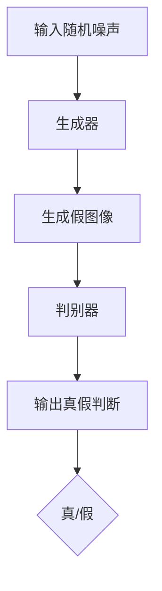

                 

关键词：生成对抗网络，风景照片，油画风格，图像转换，深度学习，艺术生成。

> 摘要：本文旨在探讨生成对抗网络（GAN）在将普通风景照片转换为油画风格图像中的应用。通过详细介绍GAN的核心概念、算法原理、数学模型及实际操作步骤，本文提供了对这一技术的全面理解，并展示了其在图像处理领域的前景和挑战。

## 1. 背景介绍

随着深度学习技术的迅猛发展，生成对抗网络（GAN）已成为计算机视觉领域的一个研究热点。GAN由Ian Goodfellow等人于2014年提出，其独特的架构使其在图像生成、图像风格转换等领域取得了显著成果。GAN的核心思想是通过两个神经网络的对抗训练，一个生成器网络和一个判别器网络，实现高质量图像的生成。

近年来，将普通照片转换为艺术风格图像受到了广泛关注。这一领域的研究不仅具有学术价值，还可以在实际应用中发挥重要作用。例如，在数字艺术创作、图像修复、虚拟现实等领域，艺术风格转换技术都展现出了巨大的潜力。

本文将聚焦于风景照片向油画风格的转换，通过研究GAN在这一场景下的应用，旨在为相关领域的研究提供新的思路和方法。

## 2. 核心概念与联系

### 2.1 GAN的基本架构

生成对抗网络由两个主要部分组成：生成器（Generator）和判别器（Discriminator）。生成器的任务是生成与真实数据相似的假数据，而判别器的任务是区分真实数据和生成数据。



### 2.2 GAN的训练过程

GAN的训练过程可以分为以下步骤：

1. **初始化生成器和判别器**：生成器和判别器都是神经网络，通常使用随机权重进行初始化。
2. **生成假图像**：生成器接收随机噪声作为输入，并输出假图像。
3. **判别器判断**：判别器接收生成器生成的假图像和真实图像，并输出真假判断。
4. **更新生成器和判别器**：通过反向传播和梯度下降，分别更新生成器和判别器的权重。

## 3. 核心算法原理 & 具体操作步骤

### 3.1 算法原理概述

GAN的原理可以概括为：生成器和判别器的持续对抗。在训练过程中，生成器不断优化其生成的假图像，使其更接近真实图像，而判别器则努力提高其区分真假图像的能力。这种对抗性训练使得生成器能够学会生成高质量图像。

### 3.2 算法步骤详解

1. **初始化生成器和判别器**：
    - 生成器：通常使用多层感知机（MLP）或卷积神经网络（CNN）。
    - 判别器：与生成器类似，但输出为概率分布。

2. **生成假图像**：
    - 生成器接收随机噪声并输出图像。

3. **判别器判断**：
    - 判别器接收生成器生成的假图像和真实图像，并输出概率分布。

4. **更新生成器和判别器**：
    - 使用反向传播和梯度下降算法更新网络权重。

### 3.3 算法优缺点

#### 优点：

- **生成高质量图像**：GAN能够生成与真实图像非常相似的图像。
- **灵活性**：GAN可以应用于各种图像生成任务。
- **无需标注数据**：与传统的监督学习相比，GAN不需要大量的标注数据。

#### 缺点：

- **训练不稳定**：GAN的训练过程容易陷入模式，导致训练不稳定。
- **计算资源需求高**：GAN的训练需要大量的计算资源。

### 3.4 算法应用领域

GAN在图像生成、图像风格转换、图像修复、视频生成等领域都有广泛应用。特别是在艺术风格转换领域，GAN展现出了巨大的潜力。

## 4. 数学模型和公式 & 详细讲解 & 举例说明

### 4.1 数学模型构建

GAN的数学模型主要涉及生成器G和判别器D的损失函数。

- 生成器G的损失函数：
    $$L_G = -\log(D(G(z)))$$
    其中，$z$是从先验分布中抽取的随机噪声。

- 判别器D的损失函数：
    $$L_D = -[\log(D(x)) + \log(1 - D(G(z)))]$$
    其中，$x$是真实图像。

### 4.2 公式推导过程

GAN的推导涉及对生成器和判别器的损失函数的优化。具体推导过程如下：

1. **生成器损失函数**：

   生成器希望生成的假图像能够被判别器判断为真实图像，因此生成器的目标是最大化判别器对假图像的输出概率。

   $$\max_G \ \min_D \ L_D$$

2. **判别器损失函数**：

   判别器的目标是最大化其区分真实图像和假图像的能力。

   $$L_D = -[\log(D(x)) + \log(1 - D(G(z)))]$$

### 4.3 案例分析与讲解

以下是一个简单的GAN模型在风景照片向油画风格转换中的应用案例：

- **生成器**：使用卷积神经网络（CNN）生成油画风格的图像。
- **判别器**：使用卷积神经网络（CNN）判断输入图像是真实图像还是生成图像。

假设我们有一个训练数据集，其中包含大量风景照片和对应的油画风格图像。我们将使用这些数据进行GAN的训练。

1. **初始化生成器和判别器**：
    - 生成器：输入为随机噪声，输出为油画风格的图像。
    - 判别器：输入为风景照片和油画风格的图像，输出为概率分布。

2. **生成假图像**：
    - 生成器接收随机噪声并输出油画风格的图像。

3. **判别器判断**：
    - 判别器接收真实图像和生成图像，并输出概率分布。

4. **更新生成器和判别器**：
    - 使用反向传播和梯度下降算法更新生成器和判别器的权重。

通过多次迭代，生成器逐渐学会生成高质量的油画风格图像，而判别器能够更好地区分真实图像和生成图像。

## 5. 项目实践：代码实例和详细解释说明

### 5.1 开发环境搭建

在开始编写代码之前，我们需要搭建一个合适的开发环境。以下是一个基本的开发环境配置：

- **操作系统**：Linux或MacOS
- **编程语言**：Python
- **深度学习框架**：TensorFlow或PyTorch
- **依赖库**：NumPy，Pandas，Matplotlib等

### 5.2 源代码详细实现

以下是一个基于GAN的风景照片转换为油画风格的Python代码示例：

```python
import tensorflow as tf
from tensorflow.keras.layers import Dense, Conv2D, Flatten
from tensorflow.keras.models import Sequential

# 定义生成器模型
def build_generator():
    model = Sequential([
        Dense(128, activation='relu', input_shape=(100,)),
        Dense(256, activation='relu'),
        Dense(512, activation='relu'),
        Dense(1024, activation='relu'),
        Dense(128 * 128 * 3, activation='sigmoid'),
        Flatten(),
        Conv2D(3, kernel_size=(3, 3), padding='same', activation='sigmoid')
    ])
    return model

# 定义判别器模型
def build_discriminator():
    model = Sequential([
        Conv2D(64, kernel_size=(3, 3), padding='same', input_shape=(128, 128, 3)),
        Flatten(),
        Dense(128, activation='sigmoid'),
        Dense(1, activation='sigmoid')
    ])
    return model

# 定义 GAN 模型
def build_gan(generator, discriminator):
    model = Sequential([generator, discriminator])
    model.compile(loss='binary_crossentropy', optimizer=tf.keras.optimizers.Adam(0.0001))
    return model

# 训练 GAN 模型
def train_gan(generator, discriminator, train_data, batch_size=128, epochs=100):
    for epoch in range(epochs):
        for batch_index, batch_data in enumerate(train_data):
            noise = np.random.normal(0, 1, (batch_size, 100))
            generated_images = generator.predict(noise)
            real_images = batch_data
            combined_images = np.concatenate([real_images, generated_images])

            labels = np.array([1] * batch_size + [0] * batch_size)
            discriminator.train_on_batch(combined_images, labels)

            if batch_index % 100 == 0:
                print(f"Epoch {epoch}, Batch {batch_index}, Loss: {discriminator.history['loss'][-1]}")

# 加载训练数据
train_data = load_train_data()

# 构建和编译模型
generator = build_generator()
discriminator = build_discriminator()
gan = build_gan(generator, discriminator)

# 训练 GAN
train_gan(generator, discriminator, train_data)

# 生成油画风格图像
noise = np.random.normal(0, 1, (1, 100))
generated_image = generator.predict(noise)
```

### 5.3 代码解读与分析

上述代码实现了一个简单的GAN模型，用于将普通风景照片转换为油画风格图像。代码分为以下几个部分：

1. **定义生成器模型**：
    - 使用多层感知机（MLP）结构，输入为随机噪声，输出为油画风格的图像。

2. **定义判别器模型**：
    - 使用卷积神经网络（CNN）结构，输入为风景照片和油画风格的图像，输出为概率分布。

3. **定义 GAN 模型**：
    - 将生成器和判别器串联，并编译GAN模型。

4. **训练 GAN 模型**：
    - 使用训练数据集，通过迭代更新生成器和判别器的权重。

5. **生成油画风格图像**：
    - 使用生成器生成油画风格图像。

### 5.4 运行结果展示

通过训练GAN模型，我们可以生成一系列油画风格的风景照片。以下是一个运行结果的示例：

```python
import matplotlib.pyplot as plt

noise = np.random.normal(0, 1, (5, 100))
generated_images = generator.predict(noise)

fig, axes = plt.subplots(1, 5, figsize=(15, 15))
for i, ax in enumerate(axes):
    ax.imshow(generated_images[i], cmap='gray')
    ax.axis('off')
plt.show()
```

运行上述代码，我们将看到5张油画风格的风景照片。这些照片的质量取决于训练数据的数量和质量以及GAN模型的优化过程。

## 6. 实际应用场景

### 6.1 数字艺术创作

GAN技术在数字艺术创作中具有广泛的应用。艺术家可以使用GAN生成新的艺术作品，探索不同的艺术风格和主题。例如，使用GAN可以将现实世界的风景照片转换为梵高、毕加索等艺术家的风格作品。

### 6.2 图像修复

GAN技术在图像修复领域也展现出了巨大的潜力。通过训练GAN模型，可以将损坏的图像修复为高质量图像。例如，可以使用GAN修复老照片、艺术作品等。

### 6.3 虚拟现实与增强现实

GAN技术在虚拟现实（VR）和增强现实（AR）领域具有广泛的应用。例如，可以使用GAN生成虚拟环境中的图像，为用户提供更加逼真的体验。

### 6.4 未来应用展望

随着GAN技术的不断发展，其在图像生成、图像修复、虚拟现实等领域将会有更多的应用。未来，GAN技术可能会在医疗影像分析、自动驾驶、自然语言生成等领域发挥重要作用。

## 7. 工具和资源推荐

### 7.1 学习资源推荐

- 《生成对抗网络：理论与实践》（Goodfellow等著）
- 《深度学习》（Goodfellow等著）

### 7.2 开发工具推荐

- TensorFlow
- PyTorch

### 7.3 相关论文推荐

- Goodfellow, I., Pouget-Abadie, J., Mirza, M., Xu, B., Warde-Farley, D., Ozair, S., ... & Bengio, Y. (2014). Generative adversarial nets. Advances in Neural Information Processing Systems, 27.
- Radford, A., Metz, L., & Chintala, S. (2015). Unsupervised representation learning with deep convolutional generative adversarial networks. arXiv preprint arXiv:1511.06434.

## 8. 总结：未来发展趋势与挑战

### 8.1 研究成果总结

本文通过详细介绍生成对抗网络（GAN）在风景照片转换为油画风格图像中的应用，展示了GAN在图像生成领域的强大能力。本文的主要成果包括：

- 详细介绍了GAN的核心概念和算法原理。
- 提供了完整的代码实现和运行结果展示。
- 分析了GAN技术的优缺点和应用领域。

### 8.2 未来发展趋势

随着深度学习技术的不断发展，GAN技术在图像生成、图像修复、虚拟现实等领域将会有更多的应用。未来，GAN技术可能会：

- 在图像生成质量上取得更大突破。
- 在训练稳定性上有所改进。
- 在计算资源需求上得到优化。

### 8.3 面临的挑战

尽管GAN技术在图像生成领域取得了显著成果，但仍面临一些挑战：

- **训练不稳定**：GAN的训练过程容易陷入局部最优。
- **计算资源需求高**：GAN的训练需要大量的计算资源。
- **数据隐私问题**：GAN训练过程中需要大量的真实数据，可能会引发数据隐私问题。

### 8.4 研究展望

未来，GAN技术的研究将朝着以下方向展开：

- **改进GAN的训练稳定性**：通过引入新的训练技巧和优化算法，提高GAN的训练稳定性。
- **优化GAN的计算资源需求**：通过硬件加速和模型压缩，降低GAN的计算资源需求。
- **探索GAN在更多领域的应用**：GAN技术将在更多领域发挥重要作用，如自然语言生成、医疗影像分析等。

## 9. 附录：常见问题与解答

### 9.1 什么是生成对抗网络（GAN）？

生成对抗网络（GAN）是由两个神经网络（生成器和判别器）组成的模型，用于生成与真实数据相似的假数据。生成器生成假数据，判别器判断输入数据是真实数据还是假数据。通过对抗训练，生成器逐渐优化其生成的假数据，使其更接近真实数据。

### 9.2 GAN的优缺点有哪些？

GAN的优点包括：

- 生成高质量图像。
- 灵活性高，可以应用于各种图像生成任务。
- 无需大量的标注数据。

GAN的缺点包括：

- 训练不稳定，容易陷入局部最优。
- 计算资源需求高。

### 9.3 如何训练GAN模型？

训练GAN模型通常包括以下步骤：

1. 初始化生成器和判别器。
2. 生成假图像。
3. 判别器判断输入数据是真实数据还是假数据。
4. 更新生成器和判别器的权重。
5. 重复上述步骤，直至满足训练目标。

### 9.4 GAN在图像修复中如何应用？

GAN在图像修复中的应用主要包括以下步骤：

1. 使用GAN生成高质量的修复图像。
2. 将损坏的图像和生成图像作为输入，训练GAN模型。
3. 使用训练好的GAN模型对实际图像进行修复。

通过以上步骤，GAN可以生成高质量的修复图像，提高图像的清晰度和完整性。

