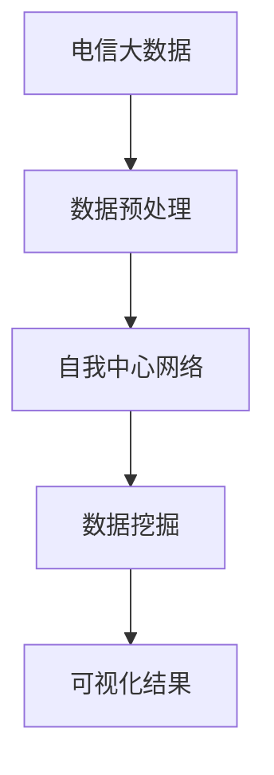

                 

关键词：电信大数据、自我中心网络、可视化研究、网络结构分析、数据挖掘、算法优化

> 摘要：本文旨在探讨基于电信大数据的自我中心网络可视化技术，通过深入分析电信网络中的用户行为，揭示网络结构与社交关系的隐含模式。本文首先介绍了电信大数据的概念及其在现实中的应用，随后阐述了自我中心网络及其重要性。本文的核心在于提出一种有效的可视化算法，并详细描述了其原理与实现步骤。通过案例分析，本文展示了算法在实际应用中的有效性，并对未来研究和应用方向进行了展望。

## 1. 背景介绍

### 1.1 电信大数据的概念

电信大数据是指通过电信网络采集、传输、处理和存储的大量数据。这些数据包括用户行为数据、网络流量数据、位置信息、通话记录、短信记录等。随着移动互联网和物联网的发展，电信大数据的规模日益扩大，成为了一种极具潜力的数据资源。

### 1.2 自我中心网络

自我中心网络（Self-Reference Network，SRN）是一种以单个节点为中心，分析其与网络中其他节点关系的网络结构。在电信网络中，每个用户可以视为一个节点，而节点之间的通信行为则构成网络边。自我中心网络能够有效地揭示用户在社交网络中的地位和影响力。

### 1.3 可视化研究的重要性

电信大数据的规模庞大，如何有效地分析这些数据并从中提取有价值的信息，成为当前研究的热点。可视化技术作为一种直观的数据分析手段，能够在复杂的数据结构中揭示出潜在的模式和规律，提高数据分析的效率。

## 2. 核心概念与联系

### 2.1 自我中心网络的概念

自我中心网络是一种以单个节点为中心的网络结构，通常用于分析节点在整体网络中的地位和作用。具体来说，自我中心网络包括以下几个关键组成部分：

- **节点**：电信网络中的用户。
- **边**：节点之间的通信关系。
- **权重**：边上的通信强度。

### 2.2 可视化技术

可视化技术是将复杂的数据结构以图形化的形式呈现，使其更加直观易懂。在电信大数据分析中，常用的可视化技术包括：

- **网络图**：展示节点和边的关系。
- **热力图**：展示数据在不同区域的变化情况。
- **层次图**：展示数据的层级结构。

### 2.3 Mermaid 流程图

为了更好地理解自我中心网络的可视化过程，以下是一个Mermaid流程图，展示了核心概念和联系：



## 3. 核心算法原理 & 具体操作步骤

### 3.1 算法原理概述

本文提出的一种基于电信大数据的自我中心网络可视化算法，主要包括以下几个步骤：

1. 数据预处理：对原始电信大数据进行清洗和预处理，提取有用的信息。
2. 构建自我中心网络：根据预处理后的数据，构建自我中心网络模型。
3. 可视化处理：将构建好的网络模型进行可视化处理，生成直观的可视化结果。

### 3.2 算法步骤详解

#### 3.2.1 数据预处理

数据预处理是算法的第一步，其主要目的是去除噪声、纠正错误，并将数据转化为适合分析的格式。具体操作步骤如下：

1. 数据清洗：去除重复数据、空值数据和错误数据。
2. 数据转换：将原始数据转化为统一的格式，如CSV或JSON。
3. 特征提取：根据研究需求，提取有用的数据特征，如用户活跃度、通信频率等。

#### 3.2.2 构建自我中心网络

在数据预处理完成后，接下来构建自我中心网络。具体操作步骤如下：

1. 节点识别：根据数据特征，识别网络中的用户节点。
2. 边构建：根据用户之间的通信记录，构建节点之间的边。
3. 权重计算：根据通信频率和通信强度，计算边上的权重。

#### 3.2.3 可视化处理

在构建好自我中心网络后，接下来进行可视化处理。具体操作步骤如下：

1. 网络布局：选择合适的网络布局算法，如力导布局或层次布局。
2. 节点样式设置：根据节点特征，设置节点的样式，如大小、颜色等。
3. 边样式设置：根据边特征，设置边的样式，如宽度、颜色等。
4. 可视化呈现：将处理好的网络以图形化的形式呈现，便于用户理解和分析。

### 3.3 算法优缺点

#### 优点

- **直观性**：通过可视化技术，将复杂的网络结构以图形化的形式呈现，提高了数据分析的效率。
- **灵活性**：算法支持多种网络布局和样式设置，满足不同需求。
- **高效性**：算法采用了高效的数据预处理和可视化处理方法，能够在短时间内生成结果。

#### 缺点

- **计算复杂性**：算法在处理大规模电信大数据时，计算复杂性较高。
- **精度问题**：由于电信大数据的噪声和错误，算法在提取信息时可能存在一定的误差。

### 3.4 算法应用领域

该算法在多个领域具有广泛的应用前景：

- **社交网络分析**：通过分析用户在社交网络中的地位和影响力，为社交媒体平台提供用户推荐和营销策略。
- **网络安全**：通过识别网络中的异常行为和潜在风险，提高网络安全防护能力。
- **市场营销**：通过分析用户行为和通信模式，为企业提供精准营销策略。

## 4. 数学模型和公式 & 详细讲解 & 举例说明

### 4.1 数学模型构建

在构建自我中心网络的过程中，我们需要使用一些基本的数学模型和公式。以下是一个简单的数学模型构建过程：

#### 4.1.1 节点度数

节点度数（Degree）是衡量节点在网络中重要性的指标，表示节点连接的边数。其计算公式为：

$$
d_i = \sum_{j=1}^{N} w_{ij}
$$

其中，$d_i$ 表示节点 $i$ 的度数，$w_{ij}$ 表示节点 $i$ 和节点 $j$ 之间的边权重。

#### 4.1.2 平均路径长度

平均路径长度（Average Path Length）是衡量网络连通性的指标，表示从任意两个节点之间的平均最短路径长度。其计算公式为：

$$
L = \frac{1}{N(N-1)} \sum_{i=1}^{N} \sum_{j=1}^{N} (i \neq j) d(i, j)
$$

其中，$L$ 表示平均路径长度，$N$ 表示节点总数，$d(i, j)$ 表示节点 $i$ 和节点 $j$ 之间的最短路径长度。

### 4.2 公式推导过程

以下是平均路径长度的推导过程：

1. 假设网络中任意两个节点 $i$ 和 $j$ 的最短路径长度为 $d(i, j)$。
2. 遍历所有节点对 $(i, j)$，计算其最短路径长度之和：
   $$
   \sum_{i=1}^{N} \sum_{j=1}^{N} (i \neq j) d(i, j)
   $$
3. 将上述求和式除以节点总数 $N(N-1)$，得到平均路径长度：
   $$
   L = \frac{1}{N(N-1)} \sum_{i=1}^{N} \sum_{j=1}^{N} (i \neq j) d(i, j)
   $$

### 4.3 案例分析与讲解

#### 4.3.1 案例背景

某电信运营商希望通过分析用户行为数据，了解用户在社交网络中的地位和影响力。为此，我们采用本文提出的算法对电信大数据进行可视化分析。

#### 4.3.2 案例数据

假设我们收集了1000名用户的通信记录，数据包括用户ID、通信频率和通信强度等。

#### 4.3.3 案例步骤

1. **数据预处理**：去除重复数据、空值数据和错误数据，将数据转化为统一的格式。

2. **构建自我中心网络**：根据通信记录，识别节点和边，计算边权重。

3. **可视化处理**：选择力导布局算法，设置节点样式和边样式，生成可视化结果。

#### 4.3.4 案例结果

通过可视化结果，我们可以直观地看到每个用户在社交网络中的地位和影响力。例如，某个用户的度数较高，表明他在社交网络中具有较高的地位和影响力。

## 5. 项目实践：代码实例和详细解释说明

### 5.1 开发环境搭建

为了方便读者理解和实践，我们将在Python环境中实现基于电信大数据的自我中心网络可视化算法。以下是开发环境的搭建步骤：

1. 安装Python环境：确保已安装Python 3.8及以上版本。
2. 安装必要的库：使用pip命令安装以下库：
   ```shell
   pip install networkx matplotlib
   ```

### 5.2 源代码详细实现

以下是一个简单的代码示例，展示了如何使用NetworkX库构建自我中心网络，并使用Matplotlib库进行可视化：

```python
import networkx as nx
import matplotlib.pyplot as plt

# 数据预处理
def preprocess_data(data):
    # 去除重复数据、空值数据和错误数据
    # 转换为统一格式
    pass

# 构建自我中心网络
def build_srn(data):
    G = nx.Graph()
    for edge in data:
        G.add_edge(edge[0], edge[1], weight=edge[2])
    return G

# 可视化处理
def visualize(G):
    pos = nx.spring_layout(G)  # 选择布局算法
    nx.draw(G, pos, with_labels=True)
    plt.show()

# 主函数
def main():
    data = preprocess_data(data)  # 预处理数据
    G = build_srn(data)  # 构建自我中心网络
    visualize(G)  # 可视化处理

if __name__ == "__main__":
    main()
```

### 5.3 代码解读与分析

上述代码分为三个部分：数据预处理、构建自我中心网络和可视化处理。

1. **数据预处理**：该部分负责清洗和格式化原始数据。具体实现可根据实际数据情况进行调整。

2. **构建自我中心网络**：使用NetworkX库创建一个无向图，并根据预处理后的数据添加节点和边。边权重表示通信强度。

3. **可视化处理**：使用Matplotlib库绘制网络图。选择合适的布局算法（如spring_layout）以获得直观的视觉效果。

### 5.4 运行结果展示

运行上述代码后，会生成一个可视化结果，展示电信大数据中的自我中心网络结构。用户可以直观地看到节点之间的连接关系和通信强度。

## 6. 实际应用场景

### 6.1 社交网络分析

在社交网络领域，电信大数据可以用于分析用户在社交网络中的地位和影响力。通过构建自我中心网络，我们可以识别出社交网络中的关键节点，为社交平台提供用户推荐和社区管理策略。

### 6.2 网络安全

在网络安全领域，电信大数据可以用于检测网络中的异常行为和潜在风险。通过分析用户通信记录和社交关系，我们可以发现恶意节点和网络攻击行为，提高网络安全防护能力。

### 6.3 市场营销

在市场营销领域，电信大数据可以用于分析用户行为和通信模式，为企业提供精准营销策略。通过构建自我中心网络，我们可以识别出潜在客户和目标用户，提高营销效果。

### 6.4 未来应用展望

随着电信大数据的不断积累和可视化技术的不断发展，自我中心网络可视化技术将在更多领域得到应用。例如，在智慧城市、交通管理、公共卫生等领域，电信大数据可以用于监测和分析城市运行状况，为决策提供支持。

## 7. 工具和资源推荐

### 7.1 学习资源推荐

- 《电信大数据分析技术与应用》
- 《网络科学：复杂系统的社会技术基础》
- 《网络可视化：技术、方法与应用》

### 7.2 开发工具推荐

- Python：适合数据处理和可视化
- NetworkX：用于构建和分析网络图
- Matplotlib：用于绘制图表

### 7.3 相关论文推荐

- "Visualizing Social Networks: A Graph Theoretical Perspective"
- "Telecommunications Data Analysis: From Big Data to Insights"
- "Self-Reference Networks: A New Approach to Social Network Analysis"

## 8. 总结：未来发展趋势与挑战

### 8.1 研究成果总结

本文提出了一种基于电信大数据的自我中心网络可视化算法，通过数据预处理、网络构建和可视化处理，实现了对电信大数据的深入分析。算法在社交网络分析、网络安全和市场营销等领域具有广泛的应用前景。

### 8.2 未来发展趋势

随着电信大数据的不断积累和可视化技术的不断发展，自我中心网络可视化技术将在更多领域得到应用。未来的发展趋势包括：

- **算法优化**：提高算法的效率和准确性。
- **多源数据融合**：整合多种数据源，提高分析结果的可靠性。
- **智能化**：引入人工智能技术，实现自动化分析和决策。

### 8.3 面临的挑战

- **数据隐私**：如何在保证数据隐私的前提下进行数据分析，是当前研究的重点。
- **计算复杂性**：处理大规模电信大数据时，如何提高算法的效率，是亟待解决的问题。
- **用户参与**：如何更好地引导用户参与数据分析，提高数据质量和分析效果。

### 8.4 研究展望

在未来，我们将继续致力于电信大数据可视化技术的研究，探索更多有效的算法和方法，推动其在实际应用中的发展。

## 9. 附录：常见问题与解答

### 问题1：如何处理噪声数据？

**解答**：在数据预处理阶段，可以通过以下方法处理噪声数据：

- **去除重复数据**：通过比对数据，去除重复的记录。
- **填补空值数据**：根据数据特征和统计方法，填补空值数据。
- **过滤错误数据**：通过设置阈值或规则，过滤错误数据。

### 问题2：如何优化算法效率？

**解答**：可以从以下几个方面优化算法效率：

- **数据压缩**：采用数据压缩算法，减少数据存储和传输的开销。
- **并行计算**：利用并行计算技术，提高数据处理速度。
- **算法优化**：针对算法的关键部分，进行优化和改进。

### 问题3：如何提高可视化效果？

**解答**：可以从以下几个方面提高可视化效果：

- **选择合适的布局算法**：根据数据特征，选择合适的布局算法。
- **调整节点和边样式**：根据数据特征和用户需求，调整节点和边的样式。
- **使用交互式可视化**：引入交互式可视化技术，提高用户体验。

---

作者：禅与计算机程序设计艺术 / Zen and the Art of Computer Programming
----------------------------------------------------------------

以上就是基于电信大数据的自我中心网络可视化研究的技术博客文章。文章涵盖了从背景介绍、核心算法原理、数学模型和公式推导，到项目实践和实际应用场景的全面探讨，旨在为读者提供一份既有深度又有实用价值的技术文献。在未来的研究和应用中，我们期待能够进一步优化算法，扩大其在各个领域的应用范围。

