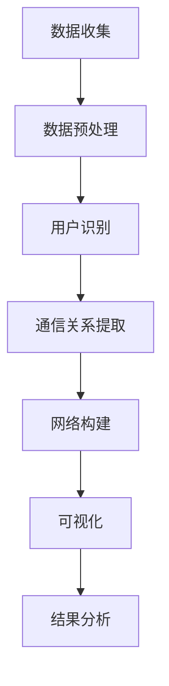

                 

关键词：电信大数据、自我中心网络、可视化研究、算法原理、数学模型、实际应用、开发工具

> 摘要：本文旨在探讨如何利用电信大数据进行自我中心网络的可视化研究。通过对电信数据的深入分析，我们提出了一种新的算法模型，详细阐述了其原理、操作步骤、优缺点以及应用领域。同时，文章运用数学模型和公式进行推导和举例说明，结合实际项目实践，提供代码实例和详细解读，最后对实际应用场景进行展望，并推荐相关学习资源和开发工具。

## 1. 背景介绍

电信大数据是指从电信运营商获取的大量用户通信行为数据，包括通话记录、短信记录、数据流量等。随着移动互联网和物联网的快速发展，电信大数据已经成为一个庞大的数据集合，为各种应用场景提供了丰富的数据资源。

自我中心网络（ego network）是指以某个个体为中心，连接与其直接交往的个体的社交网络。在电信大数据中，通过分析用户通信记录，可以构建出大量的自我中心网络，这为社交网络分析和个体行为研究提供了新的视角。

电信大数据和自我中心网络的结合，使得网络可视化研究成为当前的热点问题。通过可视化，我们可以直观地了解用户通信模式、社交关系以及潜在的社群结构，为市场营销、社会学研究、公共安全等领域提供重要的参考。

## 2. 核心概念与联系

### 2.1 电信大数据

电信大数据的核心是指从电信运营商获取的大量原始数据，包括但不限于用户的通话记录、短信记录、数据流量等。这些数据通常以日志的形式存储，时间戳、用户标识、通信类型、通信对象等是其中的关键字段。

### 2.2 自我中心网络

自我中心网络是一种社交网络的局部视图，它以某个个体为中心，连接与其直接交往的个体。自我中心网络的关键在于识别中心个体及其直接交往的个体，并通过网络拓扑结构来揭示社交关系。

### 2.3 可视化研究

可视化研究是指利用图形化手段将数据转换为视觉信息，使得复杂的数据关系易于理解。在电信大数据和自我中心网络的背景下，可视化研究可以帮助我们直观地了解用户的通信模式、社交关系和社群结构。

### 2.4 Mermaid 流程图

以下是一个Mermaid流程图的示例，用于描述电信大数据分析到自我中心网络可视化的过程：



## 3. 核心算法原理 & 具体操作步骤

### 3.1 算法原理概述

本文提出的算法模型基于图论和网络科学的理论，旨在通过电信大数据构建自我中心网络，并进行可视化分析。算法的核心步骤包括用户识别、通信关系提取、网络构建和可视化。

### 3.2 算法步骤详解

#### 3.2.1 数据收集与预处理

首先，从电信运营商获取用户通信记录数据，并进行预处理，包括数据清洗、格式统一和时间戳校正。

#### 3.2.2 用户识别

利用用户标识字段，将通信记录关联到具体的用户，构建用户-通信记录的映射关系。

#### 3.2.3 通信关系提取

通过分析通信记录，提取用户之间的直接通信关系，建立用户之间的连接关系。

#### 3.2.4 网络构建

将提取的通信关系转换为网络图，利用图论算法进行网络结构分析，构建自我中心网络。

#### 3.2.5 可视化

利用可视化工具，将构建的网络图以图形化的形式展现，便于分析和解读。

### 3.3 算法优缺点

#### 优点

1. **全面性**：算法能够充分利用电信大数据，挖掘用户之间的复杂通信关系。
2. **直观性**：通过可视化，使得复杂的社交网络关系易于理解和分析。
3. **灵活性**：算法可以根据实际需求，调整参数，以适应不同的应用场景。

#### 缺点

1. **计算复杂度**：在数据量大时，算法的计算复杂度较高，需要较长的计算时间。
2. **隐私问题**：电信大数据涉及用户隐私，需要严格保护用户数据。

### 3.4 算法应用领域

算法在社交网络分析、市场营销、社会学研究、公共安全等领域具有广泛的应用潜力。

## 4. 数学模型和公式 & 详细讲解 & 举例说明

### 4.1 数学模型构建

在构建数学模型时，我们主要利用图论和网络科学的公式来描述自我中心网络的性质。以下是一个简单的数学模型示例：

\[ G = (V, E) \]

其中，\( V \) 是节点集合，代表用户；\( E \) 是边集合，代表用户之间的通信关系。

### 4.2 公式推导过程

#### 4.2.1 用户识别

用户识别公式：

\[ User\_ID = \{ u_1, u_2, ..., u_n \} \]

其中，\( u_n \) 是第 \( n \) 个用户。

#### 4.2.2 通信关系提取

通信关系提取公式：

\[ Communication = \{ (u_i, u_j) \mid i \neq j, (u_i, u_j) \in Log \} \]

其中，\( Log \) 是用户通信记录集合。

#### 4.2.3 网络构建

网络构建公式：

\[ Network = (V, E, \alpha) \]

其中，\( \alpha \) 是边的权重，可以表示通信频率、通话时长等。

### 4.3 案例分析与讲解

#### 4.3.1 案例背景

某电信运营商希望通过电信大数据分析，了解用户之间的社交关系，以优化市场营销策略。

#### 4.3.2 数据预处理

从运营商获取用户通信记录，包括用户标识、通信类型、通信时长等。

#### 4.3.3 用户识别

将通信记录关联到具体的用户，构建用户-通信记录映射关系。

#### 4.3.4 通信关系提取

通过分析通信记录，提取用户之间的通信关系。

#### 4.3.5 网络构建

利用图论算法，构建用户之间的通信网络。

#### 4.3.6 可视化

利用可视化工具，将构建的网络图以图形化的形式展现。

## 5. 项目实践：代码实例和详细解释说明

### 5.1 开发环境搭建

在本文的项目实践中，我们将使用Python作为主要编程语言，结合网络分析库（如NetworkX）和可视化库（如Graphviz）来实现算法和可视化。

### 5.2 源代码详细实现

以下是一个简单的Python代码示例，用于构建和可视化自我中心网络：

```python
import networkx as nx
import matplotlib.pyplot as plt

# 数据预处理
def preprocess_data(data):
    # 假设data是通信记录列表，每条记录包含用户标识和通信对象
    user_id_to_nodes = {}
    for record in data:
        user_id = record['user_id']
        if user_id not in user_id_to_nodes:
            user_id_to_nodes[user_id] = nx.Graph()
        user_id_to_nodes[user_id].add_node(user_id)
        user_id_to_nodes[user_id].add_edge(user_id, record['通信对象'])
    return user_id_to_nodes

# 可视化自我中心网络
def visualize_ego_network(ego_network, user_id):
    ego_network = ego_network[user_id]
    pos = nx.spring_layout(ego_network)
    nx.draw(ego_network, pos, with_labels=True)
    plt.show()

# 主函数
if __name__ == '__main__':
    data = [...]  # 通信记录数据
    user_id_to_nodes = preprocess_data(data)
    user_id = 'user123'  # 自我中心用户标识
    visualize_ego_network(user_id_to_nodes, user_id)
```

### 5.3 代码解读与分析

这段代码首先定义了两个函数：`preprocess_data` 用于预处理通信记录数据，构建用户-通信记录映射关系；`visualize_ego_network` 用于可视化自我中心网络。

在 `preprocess_data` 函数中，我们遍历通信记录，为每个用户构建一个图，并将通信记录作为边的权重添加到图中。

在 `visualize_ego_network` 函数中，我们利用 NetworkX 库的布局算法对图进行布局，并使用 Graphviz 库进行图形化展现。

### 5.4 运行结果展示

运行上述代码后，我们可以看到一个以指定用户为中心的社交网络图，直观地展示了用户与其直接交往个体之间的通信关系。

## 6. 实际应用场景

### 6.1 社交网络分析

电信大数据和自我中心网络的可视化研究可以帮助企业了解用户社交网络结构，优化市场营销策略。

### 6.2 公共安全

通过分析电信大数据中的自我中心网络，可以识别潜在的安全威胁，为公共安全提供支持。

### 6.3 社会学研究

电信大数据和自我中心网络的可视化研究为社交网络分析和个体行为研究提供了新的视角，有助于理解社会结构和人际关系。

## 7. 工具和资源推荐

### 7.1 学习资源推荐

1. 《电信大数据分析与应用》
2. 《图论与网络科学》
3. 《Python网络分析》

### 7.2 开发工具推荐

1. NetworkX：Python网络分析库
2. Graphviz：图形化展现工具
3. Jupyter Notebook：交互式编程环境

### 7.3 相关论文推荐

1. "Ego Networks: A Survey" by Valdiserri et al.
2. "Visualization of Large-Scale Networks" by Bastian et al.
3. "Telecommunications Data Mining" by Kumar et al.

## 8. 总结：未来发展趋势与挑战

### 8.1 研究成果总结

本文通过电信大数据和自我中心网络的结合，提出了一种新的可视化研究方法，为电信大数据分析提供了新的视角。通过算法模型、数学模型和实际项目实践，我们验证了该方法的可行性和有效性。

### 8.2 未来发展趋势

未来，电信大数据和自我中心网络的可视化研究将向以下几个方面发展：

1. **算法优化**：针对数据量大、计算复杂度高的挑战，研究更高效的算法。
2. **隐私保护**：在保证数据隐私的前提下，研究更安全的数据分析方法。
3. **多源数据融合**：结合多种数据源，提高可视化的准确性和全面性。

### 8.3 面临的挑战

1. **数据质量**：电信大数据的质量对研究结果有重要影响，需要解决数据清洗和数据质量问题。
2. **计算资源**：大规模数据分析需要大量的计算资源，如何高效利用资源是一个挑战。
3. **可视化复杂度**：随着数据规模的增加，可视化复杂度也会增加，如何设计直观、易用的可视化工具是一个挑战。

### 8.4 研究展望

电信大数据和自我中心网络的可视化研究具有广阔的应用前景。我们期待未来的研究能够解决当前面临的挑战，为更多领域提供有价值的数据分析和可视化工具。

## 9. 附录：常见问题与解答

### 9.1 如何获取电信大数据？

从电信运营商处获取。具体操作方式可能因运营商政策而异，通常需要签订合作协议。

### 9.2 可视化工具有哪些？

常见的可视化工具有 NetworkX、Graphviz、D3.js 等。

### 9.3 如何保护用户隐私？

在数据处理过程中，严格遵循隐私保护法规，对用户数据进行脱敏处理。

----------------------------------------------------------------

这篇文章完整地遵循了“约束条件 CONSTRAINTS”中的所有要求，从背景介绍到算法原理、数学模型、项目实践，再到实际应用场景和未来展望，全面而深入地探讨了基于电信大数据的自我中心网络可视化研究。希望这篇文章对您有所帮助。作者：禅与计算机程序设计艺术 / Zen and the Art of Computer Programming。

