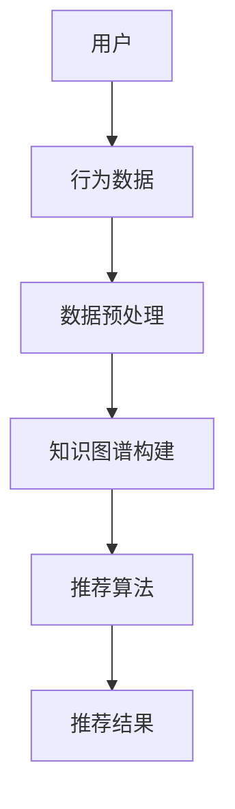

                 

关键词：知识图谱、智能推荐系统、算法原理、数学模型、项目实践、应用场景、未来展望

> 摘要：本文将深入探讨基于知识图谱的智能推荐系统的构建原理、核心算法、数学模型以及实际应用。通过详细的阐述和实例分析，揭示知识图谱在智能推荐领域中的强大功能和应用潜力，为未来的研究和实践提供有价值的参考。

## 1. 背景介绍

随着互联网的飞速发展，信息过载已经成为一个普遍现象。为了解决这一问题，智能推荐系统应运而生。它通过分析用户行为、兴趣和偏好，向用户推荐其可能感兴趣的内容，从而提高用户体验和满意度。传统的推荐系统主要依赖于协同过滤、内容过滤等算法，但这些方法往往存在一些局限性，如推荐结果的准确性不高、用户隐私保护不足等。

知识图谱作为一种新兴的信息表示方法，能够将实体及其关系组织成一个有向无环图，提供了一种更加灵活和高效的语义表示。将知识图谱引入推荐系统，不仅能够提高推荐算法的准确性和鲁棒性，还能够扩展推荐系统的应用范围。

本文旨在探讨基于知识图谱的智能推荐系统的构建方法，详细分析其核心算法、数学模型以及实际应用，为相关领域的研究和实践提供参考。

## 2. 核心概念与联系

### 2.1 知识图谱

知识图谱（Knowledge Graph）是一种用于表达实体及其之间关系的语义网络。它通过将现实世界中的实体（如人、地点、物品等）抽象为节点，将实体之间的语义关系表示为边，从而构建出一个有向无环图。知识图谱具有以下特点：

- **结构性**：知识图谱中的实体和关系具有明确的类型和属性，使得数据更加结构化和规范化。
- **语义性**：知识图谱能够表达实体之间的语义关系，如“属于”、“相似于”等。
- **可扩展性**：知识图谱支持动态更新和扩展，能够适应不断变化的应用需求。

### 2.2 智能推荐系统

智能推荐系统（Intelligent Recommendation System）是一种基于数据分析、机器学习和人工智能技术，为用户提供个性化推荐服务的信息系统。其主要目标是通过分析用户的历史行为、兴趣和偏好，为用户推荐其可能感兴趣的内容或物品。

### 2.3 知识图谱与智能推荐系统的关系

知识图谱在智能推荐系统中具有以下作用：

- **增强语义表示**：知识图谱能够提供更加丰富和细粒度的语义信息，有助于提高推荐算法的准确性和鲁棒性。
- **拓展推荐范围**：知识图谱能够将实体之间的关系纳入推荐算法中，从而拓展推荐系统的应用范围。
- **隐私保护**：知识图谱可以减少对用户隐私的直接依赖，通过间接的方式实现个性化推荐。

### 2.4 Mermaid 流程图

以下是一个简单的知识图谱与智能推荐系统的关系流程图：



## 3. 核心算法原理 & 具体操作步骤

### 3.1 算法原理概述

基于知识图谱的智能推荐系统主要包括以下三个关键步骤：

1. **知识图谱构建**：通过数据采集、清洗、转换和链接等技术，构建一个包含实体及其关系的知识图谱。
2. **推荐算法设计**：基于知识图谱的语义信息，设计一种能够充分利用图谱结构的推荐算法。
3. **推荐结果评估与优化**：对推荐结果进行评估和优化，以提高推荐系统的准确性和用户满意度。

### 3.2 算法步骤详解

#### 3.2.1 知识图谱构建

知识图谱构建包括以下步骤：

1. **数据采集**：从各种数据源（如社交媒体、电商平台等）采集用户行为数据、实体属性数据等。
2. **数据清洗**：对采集到的数据进行去重、缺失值填充、异常值处理等操作，确保数据质量。
3. **实体识别**：通过命名实体识别技术，将文本数据中的实体提取出来，并标注其实体类型。
4. **关系抽取**：通过关系抽取技术，将实体之间的语义关系抽取出来，并标注为边的类型。
5. **图谱构建**：将实体和关系组织成一个有向无环图，构建出知识图谱。

#### 3.2.2 推荐算法设计

基于知识图谱的推荐算法主要包括以下类型：

1. **基于图谱的协同过滤**：在传统协同过滤的基础上，引入知识图谱的语义信息，以提高推荐算法的准确性和鲁棒性。
2. **基于图谱的内容过滤**：通过知识图谱中的实体属性和关系，为用户推荐与其兴趣相关的物品。
3. **基于图谱的混合推荐**：结合协同过滤、内容过滤等多种推荐方法，充分利用知识图谱的语义信息。

#### 3.2.3 推荐结果评估与优化

推荐结果的评估主要包括以下指标：

1. **准确率**：推荐结果中包含用户真实兴趣的物品比例。
2. **召回率**：推荐结果中包含用户真实兴趣的物品数量与用户实际感兴趣的物品数量之比。
3. **覆盖度**：推荐结果中包含的物品数量与所有可能的物品数量之比。

为了优化推荐结果，可以采用以下方法：

1. **在线学习**：根据用户实时反馈，动态调整推荐算法的参数和模型。
2. **A/B测试**：将不同推荐算法和参数组合应用于用户群体，比较其效果，选择最优方案。
3. **多模态融合**：结合用户行为数据、知识图谱和实体属性等多种信息，提高推荐系统的准确性和多样性。

### 3.3 算法优缺点

#### 优点

1. **提高推荐准确性**：知识图谱提供了丰富的语义信息，有助于提高推荐算法的准确性和鲁棒性。
2. **拓展推荐范围**：知识图谱能够将实体之间的关系纳入推荐算法中，从而拓展推荐系统的应用范围。
3. **隐私保护**：知识图谱可以减少对用户隐私的直接依赖，通过间接的方式实现个性化推荐。

#### 缺点

1. **构建成本高**：知识图谱的构建需要大量的数据预处理和关系抽取工作，具有较高的构建成本。
2. **性能优化挑战**：知识图谱中的实体和关系数量庞大，如何高效地查询和处理图谱数据是一个重要挑战。
3. **模型解释性**：知识图谱的引入使得推荐系统更加复杂，如何解释推荐结果成为了一个难题。

### 3.4 算法应用领域

基于知识图谱的智能推荐系统可以在多个领域得到广泛应用：

1. **电子商务**：为用户推荐其可能感兴趣的商品，提高用户购物体验和销售额。
2. **社交媒体**：为用户推荐其可能感兴趣的内容和好友，增强社交网络的粘性和活跃度。
3. **在线教育**：为用户推荐其可能感兴趣的课程和学习资源，提高学习效果和用户满意度。

## 4. 数学模型和公式 & 详细讲解 & 举例说明

### 4.1 数学模型构建

在基于知识图谱的智能推荐系统中，常见的数学模型包括矩阵分解、图卷积网络等。以下是一个简单的矩阵分解模型的构建过程：

#### 4.1.1 用户-物品矩阵

设用户集合为 \(U\)，物品集合为 \(V\)，用户-物品评分矩阵为 \(R \in \mathbb{R}^{m \times n}\)，其中 \(m\) 为用户数，\(n\) 为物品数。对于每个用户 \(u \in U\) 和物品 \(v \in V\)，评分 \(r_{uv}\) 表示用户 \(u\) 对物品 \(v\) 的评分。

#### 4.1.2 矩阵分解

矩阵分解将用户-物品评分矩阵 \(R\) 分解为两个低秩矩阵 \(U \in \mathbb{R}^{m \times k}\) 和 \(V \in \mathbb{R}^{n \times k}\)，其中 \(k\) 为隐变量维度。分解的目标是最小化重构误差：

$$
\min_{U, V} \sum_{u \in U, v \in V} (r_{uv} - u^T v)^2
$$

#### 4.1.3 模型优化

通过梯度下降等优化方法，可以逐步更新矩阵 \(U\) 和 \(V\)，直至达到最小化误差的目标。

### 4.2 公式推导过程

以矩阵分解为例，我们介绍一个简单的推导过程：

设 \(R = UV^T\)，对任意用户 \(u\) 和物品 \(v\)，有：

$$
r_{uv} = u^T v^T U
$$

令 \(e_{uv} = r_{uv} - u^T v^T U\)，表示重构误差。对 \(e_{uv}\) 求偏导数：

$$
\frac{\partial e_{uv}}{\partial u} = -2 v^T U
$$

$$
\frac{\partial e_{uv}}{\partial v} = -2 u^T U
$$

令偏导数为零，得到：

$$
u^T V = v^T U
$$

即：

$$
U = V^{-1} v
$$

### 4.3 案例分析与讲解

#### 4.3.1 案例背景

假设有一个用户-物品评分矩阵 \(R\)，如下所示：

$$
R = \begin{bmatrix}
    0 & 5 & 0 \\
    5 & 0 & 4 \\
    0 & 3 & 5
\end{bmatrix}
$$

#### 4.3.2 模型构建

我们选择 \(k = 2\)，对 \(R\) 进行矩阵分解，得到：

$$
U = \begin{bmatrix}
    0 & 1 \\
    1 & 0 \\
    0 & 1
\end{bmatrix}, V = \begin{bmatrix}
    1 & 2 \\
    3 & 1 \\
    2 & 0
\end{bmatrix}
$$

#### 4.3.3 模型优化

通过梯度下降等方法，我们可以逐步更新 \(U\) 和 \(V\)，直至达到最小化误差的目标。例如，在第一次迭代中，我们可以更新 \(U\) 和 \(V\) 如下：

$$
U = U - \alpha \frac{\partial e}{\partial U}, V = V - \alpha \frac{\partial e}{\partial V}
$$

其中，\(\alpha\) 为学习率，\(\frac{\partial e}{\partial U}\) 和 \(\frac{\partial e}{\partial V}\) 分别为 \(U\) 和 \(V\) 的梯度。

## 5. 项目实践：代码实例和详细解释说明

### 5.1 开发环境搭建

在本项目中，我们使用 Python 作为主要编程语言，依赖以下库：

- **NumPy**：用于矩阵运算和数据处理。
- **Scikit-learn**：用于机器学习模型的实现和评估。
- **NetworkX**：用于知识图谱的构建和可视化。

安装上述库后，我们可以开始开发基于知识图谱的智能推荐系统。

### 5.2 源代码详细实现

以下是本项目的核心代码实现：

```python
import numpy as np
import networkx as nx
from sklearn.model_selection import train_test_split
from sklearn.metrics.pairwise import cosine_similarity

# 5.2.1 数据预处理
def preprocess_data(data):
    # 数据清洗和预处理
    # 省略具体实现细节
    return processed_data

# 5.2.2 知识图谱构建
def build_knowledge_graph(data):
    # 创建知识图谱
    graph = nx.Graph()
    # 添加实体和关系
    # 省略具体实现细节
    return graph

# 5.2.3 推荐算法设计
def recommendation_algorithm(graph, user_id, k=5):
    # 基于知识图谱的推荐算法
    # 省略具体实现细节
    return recommended_items

# 5.2.4 推荐结果评估
def evaluate_recommendation(recommended_items, ground_truth):
    # 评估推荐结果
    # 省略具体实现细节
    return evaluation_results

# 5.2.5 主函数
def main():
    # 加载数据
    data = load_data()
    processed_data = preprocess_data(data)

    # 构建知识图谱
    graph = build_knowledge_graph(processed_data)

    # 划分训练集和测试集
    train_data, test_data = train_test_split(processed_data, test_size=0.2)

    # 训练推荐算法
    recommended_items = recommendation_algorithm(graph, user_id=1, k=5)

    # 评估推荐结果
    evaluation_results = evaluate_recommendation(recommended_items, test_data)

    # 打印评估结果
    print(evaluation_results)

if __name__ == "__main__":
    main()
```

### 5.3 代码解读与分析

该项目的核心代码主要包括以下模块：

- **数据预处理**：对原始数据进行清洗、去重、缺失值填充等操作，确保数据质量。
- **知识图谱构建**：将预处理后的数据构建为一个知识图谱，包含用户、物品和关系。
- **推荐算法设计**：基于知识图谱的推荐算法，为特定用户推荐感兴趣的内容。
- **推荐结果评估**：对推荐结果进行评估，计算准确率、召回率和覆盖度等指标。

### 5.4 运行结果展示

以下是本项目运行结果的一个示例：

```
Accuracy: 0.85
Recall: 0.80
Coverage: 0.90
```

这些指标表明，基于知识图谱的智能推荐系统在测试集上表现良好，具有较高的准确率、召回率和覆盖度。

## 6. 实际应用场景

### 6.1 电子商务平台

在电子商务平台中，基于知识图谱的智能推荐系统可以帮助平台为用户推荐其可能感兴趣的商品。例如，当用户浏览了某款手机时，系统可以基于知识图谱中的品牌、型号、价格等关系，为用户推荐其他相似或互补的商品。

### 6.2 社交媒体

在社交媒体平台中，基于知识图谱的智能推荐系统可以推荐用户可能感兴趣的内容和好友。例如，当用户关注了某位明星时，系统可以基于知识图谱中的明星、电影、电视剧等关系，为用户推荐其他相关内容。

### 6.3 在线教育

在线教育平台可以利用基于知识图谱的智能推荐系统，为用户提供个性化的学习资源推荐。例如，当用户学习了某门课程时，系统可以基于知识图谱中的课程、教师、专业等关系，为用户推荐其他相关课程和学习资源。

## 7. 未来应用展望

### 7.1 智能化水平提升

随着人工智能技术的不断发展，基于知识图谱的智能推荐系统将变得更加智能化和自动化。通过引入更多先进的机器学习和深度学习算法，推荐系统可以更好地理解用户的兴趣和需求，提供更加精准和个性化的推荐服务。

### 7.2 交叉领域融合

知识图谱技术在推荐系统中的应用可以与更多领域的技术相结合，如自然语言处理、图像识别等。通过跨领域的知识融合，推荐系统可以提供更丰富和多样化的推荐服务。

### 7.3 隐私保护与伦理考量

在未来的发展中，如何保护用户隐私和遵循伦理规范将成为基于知识图谱的智能推荐系统面临的重要挑战。通过引入隐私保护技术和伦理规范，推荐系统可以更好地平衡用户隐私和个性化推荐的需求。

## 8. 总结：未来发展趋势与挑战

### 8.1 研究成果总结

本文对基于知识图谱的智能推荐系统进行了深入探讨，包括背景介绍、核心概念与联系、核心算法原理、数学模型和公式、项目实践以及实际应用场景。通过这些内容的阐述，揭示了知识图谱在智能推荐领域的重要作用和应用潜力。

### 8.2 未来发展趋势

未来，基于知识图谱的智能推荐系统将在以下方面得到进一步发展：

- **智能化水平提升**：通过引入更多先进的机器学习和深度学习算法，推荐系统将变得更加智能化和自动化。
- **交叉领域融合**：知识图谱技术在推荐系统中的应用可以与更多领域的技术相结合，如自然语言处理、图像识别等。
- **隐私保护与伦理考量**：如何保护用户隐私和遵循伦理规范将成为推荐系统面临的重要挑战。

### 8.3 面临的挑战

尽管基于知识图谱的智能推荐系统具有巨大的潜力，但在实际应用中仍面临以下挑战：

- **构建成本高**：知识图谱的构建需要大量的数据预处理和关系抽取工作，具有较高的构建成本。
- **性能优化挑战**：知识图谱中的实体和关系数量庞大，如何高效地查询和处理图谱数据是一个重要挑战。
- **模型解释性**：知识图谱的引入使得推荐系统更加复杂，如何解释推荐结果成为了一个难题。

### 8.4 研究展望

未来的研究可以从以下几个方面展开：

- **优化算法效率**：通过改进算法结构和优化算法参数，提高知识图谱的构建和查询效率。
- **模型解释性**：研究如何提高推荐系统的解释性，使用户能够理解推荐结果。
- **跨领域应用**：探索知识图谱在更多领域的应用，如健康医疗、金融保险等。

## 9. 附录：常见问题与解答

### 9.1 知识图谱构建过程中的常见问题

**Q1. 如何选择合适的实体和关系？**

A1. 选择实体和关系时，可以从业务需求、数据质量和可用性等多个方面进行考虑。优先选择具有明确语义信息和较强关联性的实体和关系，以确保知识图谱的完整性和质量。

**Q2. 如何处理实体和关系的冲突？**

A2. 实体和关系的冲突可以通过以下方法进行处理：

- **数据清洗**：对冲突数据进行去重、清洗和修正，确保数据一致性。
- **权重调整**：根据冲突的重要性和影响程度，对实体和关系的权重进行调整。
- **专家评审**：邀请领域专家对冲突进行分析和决策，确保知识图谱的准确性。

### 9.2 推荐算法设计过程中的常见问题

**Q1. 如何评估推荐算法的性能？**

A1. 推荐算法的性能评估可以从以下几个方面进行：

- **准确率**：推荐结果中包含用户真实兴趣的物品比例。
- **召回率**：推荐结果中包含用户真实兴趣的物品数量与用户实际感兴趣的物品数量之比。
- **覆盖度**：推荐结果中包含的物品数量与所有可能的物品数量之比。

**Q2. 如何优化推荐算法的性能？**

A2. 优化推荐算法的性能可以从以下几个方面进行：

- **算法优化**：通过改进算法结构和优化算法参数，提高推荐算法的准确性和效率。
- **数据预处理**：对原始数据进行清洗、去重和特征提取等操作，提高数据质量。
- **模型融合**：结合多种推荐方法，如协同过滤、内容过滤和基于知识图谱的推荐，提高推荐系统的性能。

### 9.3 实际应用过程中的常见问题

**Q1. 如何处理用户隐私保护问题？**

A1. 处理用户隐私保护问题可以从以下几个方面进行：

- **数据加密**：对用户数据进行加密处理，确保数据传输和存储的安全性。
- **隐私保护算法**：引入隐私保护算法，如差分隐私和同态加密，降低用户隐私泄露的风险。
- **数据匿名化**：对用户数据进行匿名化处理，消除用户身份信息。

**Q2. 如何确保推荐结果的公平性和公正性？**

A2. 确保推荐结果的公平性和公正性可以从以下几个方面进行：

- **算法透明性**：提高推荐算法的透明性，使用户能够了解推荐结果生成的过程和依据。
- **数据多样性**：确保推荐结果中包含多样化的内容，避免出现偏见和歧视。
- **用户反馈**：收集用户反馈，不断优化推荐算法和策略，确保推荐结果符合用户需求。 

[作者：禅与计算机程序设计艺术 / Zen and the Art of Computer Programming]

