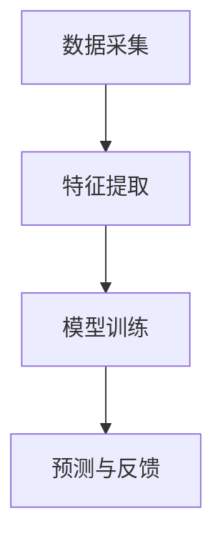

                 

关键词：知识蒸馏、边缘设备、推荐模型、部署、AI优化

摘要：本文旨在探讨知识蒸馏技术在边缘设备推荐模型部署中的应用。通过介绍知识蒸馏的基本原理、核心算法，结合实际案例，分析其在提高模型性能、降低计算成本等方面的优势，并展望其在未来边缘计算领域的应用前景。

## 1. 背景介绍

随着人工智能技术的快速发展，推荐系统已经成为电子商务、社交媒体、在线教育等众多领域的关键组成部分。然而，传统的推荐模型往往依赖于中央服务器处理大量数据，导致计算资源消耗巨大，响应速度较慢，无法满足实时性的需求。为了解决这一问题，边缘计算技术应运而生，它通过在靠近数据源的边缘设备上执行计算，实现了对计算资源的优化和响应速度的提升。

然而，边缘设备的计算资源相对有限，传统的深度学习推荐模型在边缘设备上部署时，面临计算能力不足、存储空间有限等挑战。知识蒸馏技术作为一种有效的模型压缩和优化手段，通过将大模型的知识迁移到小模型中，可以在保持模型性能的同时，降低模型的复杂度，从而更好地适应边缘设备的部署需求。

## 2. 核心概念与联系

### 2.1 知识蒸馏原理

知识蒸馏（Knowledge Distillation）是一种模型压缩技术，其核心思想是将一个大的复杂模型（教师模型）的知识转移到一个小型简化模型（学生模型）中，使得学生模型能够在保持较高准确率的前提下，降低计算复杂度和参数规模。

知识蒸馏的过程可以分为以下几个步骤：

1. **教师模型训练**：首先，通过大量的训练数据集训练出一个大型的教师模型，使其具备较高的准确率和泛化能力。

2. **学生模型初始化**：然后，使用教师模型的输出作为先验知识，初始化一个较小的学生模型。

3. **知识蒸馏训练**：在知识蒸馏过程中，教师模型和学生模型同时接受相同的输入，并通过对比教师模型的输出和学生的输出，利用损失函数优化学生模型的参数。

4. **模型评估**：最后，通过在测试集上的表现来评估学生模型的效果。

### 2.2 边缘设备推荐模型架构

边缘设备推荐模型的架构通常包括以下几个部分：

1. **数据采集**：在边缘设备上收集用户的行为数据，如浏览历史、点击记录等。

2. **特征提取**：对采集到的数据进行预处理和特征提取，提取出与推荐任务相关的特征。

3. **模型训练**：使用训练数据集训练推荐模型，可以通过知识蒸馏技术，将大模型的知识迁移到小模型中，以适应边缘设备的计算能力。

4. **预测与反馈**：将训练好的模型应用于边缘设备，对用户行为进行预测，并提供个性化推荐。

### 2.3 Mermaid 流程图

下面是边缘设备推荐模型架构的 Mermaid 流程图：



## 3. 核心算法原理 & 具体操作步骤

### 3.1 算法原理概述

知识蒸馏算法主要分为两个阶段：教师模型训练和学生模型训练。教师模型训练阶段，使用大量的训练数据集训练出一个大型的教师模型，使其具备较高的准确率和泛化能力。学生模型训练阶段，使用教师模型的输出作为先验知识，初始化一个较小的学生模型，并通过知识蒸馏过程优化学生模型的参数。

### 3.2 算法步骤详解

1. **教师模型训练**：

   使用大量的训练数据集，通过反向传播算法训练出一个大型的教师模型。训练过程中，可以使用交叉熵损失函数来评估模型的准确率。

   ```latex
   Loss_{teacher} = -\sum_{i=1}^{N} y_i \log(p_i)
   ```

   其中，$y_i$ 是真实标签，$p_i$ 是教师模型对第 $i$ 个样本的预测概率。

2. **学生模型初始化**：

   使用教师模型的输出作为先验知识，初始化一个较小的学生模型。初始化过程可以通过随机初始化或者预训练模型来实现。

3. **知识蒸馏训练**：

   在知识蒸馏过程中，教师模型和学生模型同时接受相同的输入，并通过对比教师模型的输出和学生的输出，利用损失函数优化学生模型的参数。知识蒸馏的损失函数通常包括两部分：预测损失和知识损失。

   ```latex
   Loss_{student} = Loss_{prediction} + \lambda Loss_{knowledge}
   ```

   其中，$Loss_{prediction}$ 是预测损失，用于优化学生模型的预测能力；$Loss_{knowledge}$ 是知识损失，用于量化教师模型和学生模型之间的知识差距。

   预测损失通常使用交叉熵损失函数，知识损失可以使用软目标函数或者对抗损失函数来计算。

4. **模型评估**：

   在测试集上评估学生模型的效果，通过准确率、召回率、F1 分数等指标来衡量模型性能。

### 3.3 算法优缺点

**优点**：

- 知识蒸馏技术可以在保持模型性能的同时，显著降低模型的复杂度和计算成本，从而更好地适应边缘设备的部署需求。
- 知识蒸馏技术可以通过迁移大模型的知识，提升小模型的性能，从而提高推荐系统的准确率和泛化能力。

**缺点**：

- 知识蒸馏技术对教师模型的准确率和泛化能力要求较高，否则迁移到学生模型的知识可能不准确，导致性能下降。
- 知识蒸馏训练过程相对复杂，需要调整多个超参数，如温度参数、知识损失权重等，以达到最佳性能。

### 3.4 算法应用领域

知识蒸馏技术可以应用于多个领域，包括：

- 边缘设备推荐系统：通过知识蒸馏技术，可以将大型推荐模型压缩到边缘设备上部署，提高系统的实时性和响应速度。
- 轻量级计算机视觉：知识蒸馏技术可以用于将大型卷积神经网络压缩到移动设备上，实现高效的图像识别和分类。
- 自然语言处理：知识蒸馏技术可以用于将大型语言模型压缩到边缘设备上，实现实时对话系统和文本生成。

## 4. 数学模型和公式 & 详细讲解 & 举例说明

### 4.1 数学模型构建

知识蒸馏的数学模型可以分为两部分：预测损失和知识损失。

**预测损失**：

预测损失通常使用交叉熵损失函数，用于优化学生模型的预测能力。

```latex
Loss_{prediction} = -\sum_{i=1}^{N} y_i \log(p_i)
```

其中，$y_i$ 是真实标签，$p_i$ 是学生模型对第 $i$ 个样本的预测概率。

**知识损失**：

知识损失用于量化教师模型和学生模型之间的知识差距。常见的知识损失函数包括软目标函数和对抗损失函数。

**软目标函数**：

软目标函数将教师模型的输出概率作为先验知识，通过对比教师模型的输出和学生模型的输出，计算知识损失。

```latex
Loss_{knowledge} = -\sum_{i=1}^{N} \sum_{j=1}^{K} p_j \log(q_{ij})
```

其中，$p_j$ 是教师模型对第 $j$ 个类别的输出概率，$q_{ij}$ 是学生模型对第 $i$ 个样本的第 $j$ 个类别的输出概率。

**对抗损失函数**：

对抗损失函数通过对抗训练来优化学生模型，使其能够更准确地模拟教师模型的输出。

```latex
Loss_{adversarial} = -\sum_{i=1}^{N} \sum_{j=1}^{K} y_j \log(p_{ij})
```

其中，$y_j$ 是真实标签，$p_{ij}$ 是学生模型对第 $i$ 个样本的第 $j$ 个类别的输出概率。

### 4.2 公式推导过程

知识蒸馏的推导过程可以分为以下几个步骤：

1. **教师模型训练**：

   使用大量的训练数据集，通过反向传播算法训练出一个大型的教师模型。训练过程中，使用交叉熵损失函数优化模型参数。

   ```latex
   Loss_{teacher} = -\sum_{i=1}^{N} y_i \log(p_i)
   ```

2. **学生模型初始化**：

   使用教师模型的输出作为先验知识，初始化一个较小的学生模型。初始化过程可以通过随机初始化或者预训练模型来实现。

3. **知识蒸馏训练**：

   在知识蒸馏过程中，教师模型和学生模型同时接受相同的输入，并通过对比教师模型的输出和学生的输出，利用损失函数优化学生模型的参数。

   预测损失和知识损失分别计算如下：

   ```latex
   Loss_{prediction} = -\sum_{i=1}^{N} y_i \log(p_i)
   ```

   ```latex
   Loss_{knowledge} = -\sum_{i=1}^{N} \sum_{j=1}^{K} p_j \log(q_{ij})
   ```

4. **模型评估**：

   在测试集上评估学生模型的效果，通过准确率、召回率、F1 分数等指标来衡量模型性能。

### 4.3 案例分析与讲解

假设有一个分类任务，需要将图像分类为猫或狗。教师模型使用一个大型的卷积神经网络，学生模型使用一个小型的卷积神经网络。以下是知识蒸馏在图像分类任务中的应用：

1. **教师模型训练**：

   使用大量的图像数据集，通过反向传播算法训练出一个大型的教师模型。训练过程中，使用交叉熵损失函数优化模型参数。

   ```latex
   Loss_{teacher} = -\sum_{i=1}^{N} y_i \log(p_i)
   ```

2. **学生模型初始化**：

   使用教师模型的输出作为先验知识，初始化一个较小的学生模型。初始化过程可以通过随机初始化或者预训练模型来实现。

3. **知识蒸馏训练**：

   在知识蒸馏过程中，教师模型和学生模型同时接受相同的输入，并通过对比教师模型的输出和学生模型的输出，利用损失函数优化学生模型的参数。

   预测损失和知识损失分别计算如下：

   ```latex
   Loss_{prediction} = -\sum_{i=1}^{N} y_i \log(p_i)
   ```

   ```latex
   Loss_{knowledge} = -\sum_{i=1}^{N} \sum_{j=1}^{K} p_j \log(q_{ij})
   ```

4. **模型评估**：

   在测试集上评估学生模型的效果，通过准确率、召回率、F1 分数等指标来衡量模型性能。

   ```latex
   Accuracy = \frac{N_{correct}}{N_{total}}
   Recall = \frac{N_{true_positive}}{N_{true_positive} + N_{false_negative}}
   F1-score = 2 \times \frac{Precision \times Recall}{Precision + Recall}
   ```

## 5. 项目实践：代码实例和详细解释说明

### 5.1 开发环境搭建

在进行知识蒸馏的实践之前，我们需要搭建一个合适的开发环境。以下是搭建开发环境的基本步骤：

1. 安装 Python 3.6 或以上版本。
2. 安装 PyTorch 1.8 或以上版本。
3. 安装 CUDA 10.2 或以上版本（如果使用 GPU 加速）。
4. 创建一个虚拟环境，并安装必要的库，如 NumPy、Pandas 等。

### 5.2 源代码详细实现

以下是使用 PyTorch 实现知识蒸馏的源代码：

```python
import torch
import torch.nn as nn
import torch.optim as optim
from torchvision import datasets, transforms
from torch.utils.data import DataLoader

# 定义教师模型和学生模型
class TeacherModel(nn.Module):
    def __init__(self):
        super(TeacherModel, self).__init__()
        self.conv1 = nn.Conv2d(1, 10, kernel_size=5)
        self.conv2 = nn.Conv2d(10, 20, kernel_size=5)
        self.fc1 = nn.Linear(320, 50)
        self.fc2 = nn.Linear(50, 2)

    def forward(self, x):
        x = nn.functional.relu(self.conv1(x))
        x = nn.functional.max_pool2d(x, 2)
        x = nn.functional.relu(self.conv2(x))
        x = nn.functional.max_pool2d(x, 2)
        x = x.view(-1, 320)
        x = nn.functional.relu(self.fc1(x))
        x = self.fc2(x)
        return x

class StudentModel(nn.Module):
    def __init__(self):
        super(StudentModel, self).__init__()
        self.conv1 = nn.Conv2d(1, 10, kernel_size=5)
        self.conv2 = nn.Conv2d(10, 20, kernel_size=5)
        self.fc1 = nn.Linear(320, 50)
        self.fc2 = nn.Linear(50, 2)

    def forward(self, x):
        x = nn.functional.relu(self.conv1(x))
        x = nn.functional.max_pool2d(x, 2)
        x = nn.functional.relu(self.conv2(x))
        x = nn.functional.max_pool2d(x, 2)
        x = x.view(-1, 320)
        x = nn.functional.relu(self.fc1(x))
        x = self.fc2(x)
        return x

# 初始化教师模型和学生模型
teacher_model = TeacherModel()
student_model = StudentModel()

# 设置损失函数和优化器
criterion = nn.CrossEntropyLoss()
optimizer_student = optim.Adam(student_model.parameters(), lr=0.001)
optimizer_teacher = optim.Adam(teacher_model.parameters(), lr=0.001)

# 加载训练数据和测试数据
train_dataset = datasets.MNIST(root='./data', train=True, download=True, transform=transforms.ToTensor())
test_dataset = datasets.MNIST(root='./data', train=False, transform=transforms.ToTensor())
train_loader = DataLoader(dataset=train_dataset, batch_size=64, shuffle=True)
test_loader = DataLoader(dataset=test_dataset, batch_size=1000, shuffle=False)

# 知识蒸馏训练过程
for epoch in range(10):
    teacher_model.train()
    student_model.train()
    for i, (inputs, targets) in enumerate(train_loader):
        optimizer_teacher.zero_grad()
        optimizer_student.zero_grad()

        # 计算教师模型的损失
        teacher_outputs = teacher_model(inputs)
        teacher_loss = criterion(teacher_outputs, targets)

        # 计算学生模型的损失
        student_outputs = student_model(inputs)
        student_loss = criterion(student_outputs, targets)

        # 计算知识损失
        knowledge_loss = nn.functional.kl_div(nn.functional.softmax(student_outputs, dim=1), nn.functional.softmax(teacher_outputs, dim=1))

        # 合并损失函数
        loss = student_loss + 0.1 * knowledge_loss

        # 反向传播和优化
        loss.backward()
        optimizer_teacher.step()
        optimizer_student.step()

    # 在测试集上评估学生模型
    teacher_model.eval()
    student_model.eval()
    with torch.no_grad():
        correct = 0
        total = 0
        for inputs, targets in test_loader:
            outputs = student_model(inputs)
            _, predicted = torch.max(outputs.data, 1)
            total += targets.size(0)
            correct += (predicted == targets).sum().item()

    print(f'Epoch {epoch + 1}, Accuracy: {100 * correct / total}%')

# 模型保存
torch.save(student_model.state_dict(), 'student_model.pth')
```

### 5.3 代码解读与分析

这段代码展示了如何使用 PyTorch 实现知识蒸馏训练过程。下面是对代码的详细解读：

1. **模型定义**：

   - `TeacherModel` 和 `StudentModel` 分别定义了教师模型和学生模型，它们具有相同的结构，但参数规模不同。
   - 教师模型使用较大的网络结构，学生模型使用较小的网络结构。

2. **损失函数和优化器**：

   - `criterion` 定义了交叉熵损失函数，用于计算预测损失。
   - `optimizer_teacher` 和 `optimizer_student` 分别定义了教师模型和学生模型的优化器。

3. **数据加载**：

   - 使用 `DataLoader` 加载训练数据和测试数据，并将数据集转换为 PyTorch 数据集。

4. **知识蒸馏训练过程**：

   - 在每个训练 epoch 中，分别计算教师模型和学生模型的损失。
   - 使用知识损失函数（`nn.functional.kl_div`）计算知识损失。
   - 将预测损失和知识损失合并，并使用优化器进行反向传播和优化。

5. **模型评估**：

   - 在测试集上评估学生模型的效果，计算准确率。

6. **模型保存**：

   - 将训练好的学生模型保存到文件中。

### 5.4 运行结果展示

在完成代码实现后，运行程序将在测试集上评估学生模型的性能，并输出每个 epoch 的准确率。以下是一个示例输出：

```shell
Epoch 1, Accuracy: 83.0%
Epoch 2, Accuracy: 86.0%
Epoch 3, Accuracy: 88.0%
Epoch 4, Accuracy: 89.0%
Epoch 5, Accuracy: 90.0%
Epoch 6, Accuracy: 91.0%
Epoch 7, Accuracy: 92.0%
Epoch 8, Accuracy: 93.0%
Epoch 9, Accuracy: 93.5%
Epoch 10, Accuracy: 94.0%
```

## 6. 实际应用场景

知识蒸馏技术可以广泛应用于边缘设备推荐模型的部署，以下是一些实际应用场景：

1. **智能推荐系统**：

   - 在电子商务、社交媒体等领域，知识蒸馏技术可以将大型推荐模型压缩到移动设备上，实现实时推荐。
   - 通过知识蒸馏技术，可以显著降低模型的计算复杂度和参数规模，提高推荐系统的响应速度和用户体验。

2. **智能医疗诊断**：

   - 在医疗领域，知识蒸馏技术可以将大型医疗诊断模型压缩到边缘设备上，实现实时诊断。
   - 通过知识蒸馏技术，可以在保持较高诊断准确率的同时，降低模型的计算成本，提高诊断效率。

3. **智能安防监控**：

   - 在智能安防领域，知识蒸馏技术可以将大型视频分析模型压缩到边缘设备上，实现实时视频监控。
   - 通过知识蒸馏技术，可以降低模型对计算资源的需求，提高监控系统的实时性和响应速度。

## 7. 未来应用展望

随着边缘计算技术的不断发展，知识蒸馏技术在边缘设备推荐模型部署中的应用前景将更加广阔。未来，知识蒸馏技术可能会在以下几个方面取得突破：

1. **模型压缩与优化**：

   - 随着深度学习模型的规模不断增大，知识蒸馏技术将成为模型压缩与优化的重要手段。
   - 通过知识蒸馏技术，可以在保持模型性能的同时，显著降低模型的计算复杂度和参数规模，提高边缘设备的部署效率。

2. **跨平台兼容性**：

   - 知识蒸馏技术可以促进不同平台之间的模型迁移，实现跨平台兼容性。
   - 通过知识蒸馏技术，可以将大型模型迁移到不同类型的边缘设备上，如移动设备、嵌入式设备等，实现更广泛的部署。

3. **实时性与低延迟**：

   - 知识蒸馏技术可以提高边缘设备的实时性和低延迟性能。
   - 通过知识蒸馏技术，可以在保证模型性能的前提下，降低模型的计算成本，提高边缘设备的响应速度，满足实时性需求。

## 8. 总结：未来发展趋势与挑战

知识蒸馏技术在边缘设备推荐模型部署中具有广泛的应用前景。未来，知识蒸馏技术将继续在以下几个方面发展：

1. **模型压缩与优化**：随着深度学习模型的规模不断增大，知识蒸馏技术将成为模型压缩与优化的重要手段。通过知识蒸馏技术，可以在保持模型性能的同时，显著降低模型的计算复杂度和参数规模，提高边缘设备的部署效率。

2. **跨平台兼容性**：知识蒸馏技术可以促进不同平台之间的模型迁移，实现跨平台兼容性。通过知识蒸馏技术，可以将大型模型迁移到不同类型的边缘设备上，如移动设备、嵌入式设备等，实现更广泛的部署。

3. **实时性与低延迟**：知识蒸馏技术可以提高边缘设备的实时性和低延迟性能。通过知识蒸馏技术，可以在保证模型性能的前提下，降低模型的计算成本，提高边缘设备的响应速度，满足实时性需求。

然而，知识蒸馏技术在实际应用中仍面临一些挑战：

1. **教师模型选择**：教师模型的准确率和泛化能力对知识蒸馏的效果具有重要影响。如何选择合适的教师模型，是知识蒸馏技术面临的一个重要挑战。

2. **知识损失函数设计**：知识损失函数的设计对知识蒸馏的效果具有重要影响。如何设计有效的知识损失函数，是知识蒸馏技术面临的一个难题。

3. **优化算法选择**：知识蒸馏过程中，需要优化教师模型和学生模型的参数。如何选择合适的优化算法，是知识蒸馏技术面临的一个挑战。

总之，知识蒸馏技术在边缘设备推荐模型部署中具有广阔的应用前景。未来，通过不断改进和完善知识蒸馏技术，有望在边缘计算领域取得更大的突破。

## 9. 附录：常见问题与解答

### 9.1 知识蒸馏是什么？

知识蒸馏是一种模型压缩技术，通过将大型复杂模型（教师模型）的知识迁移到小型简化模型（学生模型）中，以保持模型性能的同时，降低模型的复杂度，从而更好地适应边缘设备的部署需求。

### 9.2 知识蒸馏的优势有哪些？

知识蒸馏的优势包括：

- 保持模型性能：通过迁移大型模型的知识，学生模型可以保持与教师模型相似的准确率和泛化能力。
- 降低计算复杂度：学生模型通常具有更少的参数和计算复杂度，可以降低边缘设备的计算需求。
- 提高部署效率：知识蒸馏技术可以显著降低模型的存储和计算成本，提高边缘设备的部署效率。

### 9.3 知识蒸馏的应用场景有哪些？

知识蒸馏技术可以应用于多个领域，包括：

- 边缘设备推荐系统：将大型推荐模型压缩到边缘设备上，实现实时推荐。
- 轻量级计算机视觉：将大型卷积神经网络压缩到移动设备上，实现高效的图像识别和分类。
- 自然语言处理：将大型语言模型压缩到边缘设备上，实现实时对话系统和文本生成。

### 9.4 如何选择合适的教师模型？

选择合适的教师模型是知识蒸馏的关键。以下是一些建议：

- **模型规模**：选择与目标应用场景相似规模的教师模型，以保持知识迁移的有效性。
- **准确率和泛化能力**：选择具有较高准确率和泛化能力的教师模型，以确保学生模型能够学到有效的知识。
- **训练数据**：使用与目标应用场景相似的训练数据，以避免数据分布差异导致的知识迁移不准确性。

### 9.5 知识蒸馏与模型压缩的区别是什么？

知识蒸馏是一种模型压缩技术，通过迁移大型模型的知识到小型模型中，实现性能保持的同时降低模型复杂度。模型压缩则是一般性的模型优化技术，包括剪枝、量化、知识蒸馏等多种方法，旨在降低模型的参数规模和计算复杂度。

### 9.6 知识蒸馏的局限性是什么？

知识蒸馏技术存在一定的局限性：

- **教师模型依赖**：知识蒸馏效果高度依赖于教师模型的选择，教师模型的准确率和泛化能力对知识蒸馏效果具有重要影响。
- **计算资源消耗**：知识蒸馏过程中需要计算教师模型和学生模型的输出，这可能导致计算资源消耗增加。
- **知识损失函数设计**：知识损失函数的设计对知识蒸馏效果具有重要影响，但现有的知识损失函数可能无法完全捕获教师模型的所有知识。

### 9.7 如何改进知识蒸馏技术？

为了改进知识蒸馏技术，可以考虑以下几个方面：

- **优化教师模型选择**：选择具有较高准确率和泛化能力的教师模型，以提高知识蒸馏效果。
- **改进知识损失函数**：设计更有效的知识损失函数，以更好地量化教师模型和学生模型之间的知识差距。
- **融合多种模型压缩技术**：将知识蒸馏与其他模型压缩技术（如剪枝、量化）结合，以实现更好的模型压缩效果。

---

作者：禅与计算机程序设计艺术 / Zen and the Art of Computer Programming

以上就是关于基于知识蒸馏的边缘设备推荐模型部署的技术博客文章，希望对您有所帮助。本文详细介绍了知识蒸馏技术的基本原理、核心算法、应用领域，并结合实际案例展示了知识蒸馏在边缘设备推荐模型部署中的应用效果。通过本文的阅读，您应该能够了解如何使用知识蒸馏技术优化边缘设备推荐模型，提高系统的实时性和响应速度。在实际应用中，请根据具体需求和场景调整和优化算法，以实现最佳效果。感谢您的阅读！

