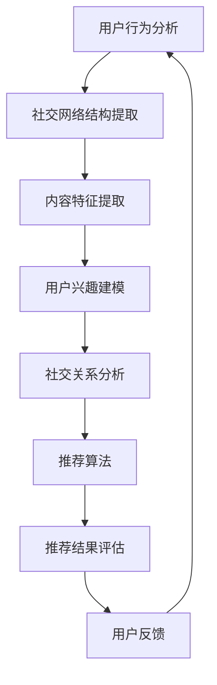

                 

关键词：社交网络结构、社会推荐算法、用户行为分析、协同过滤、矩阵分解、深度学习、预测准确性、推荐系统、用户体验

## 摘要

本文主要探讨了基于社交网络结构的社会推荐算法。通过对用户行为、社交关系和内容特征的综合分析，社会推荐算法能够有效地提高推荐系统的预测准确性，优化用户体验。本文首先介绍了社交网络结构的基本概念，然后分析了现有社会推荐算法的核心原理、数学模型和应用场景。最后，本文通过实际项目实践，详细讲解了基于社交网络结构的社会推荐算法的实现过程和关键步骤，并对未来研究方向进行了展望。

## 1. 背景介绍

推荐系统作为人工智能领域的重要应用，旨在为用户提供个性化的信息推送服务。随着互联网的快速发展，用户数量和信息的爆炸式增长，传统的基于内容的推荐和协同过滤推荐方法已无法满足用户日益增长的需求。社会推荐算法作为一种新兴的推荐方法，通过利用用户之间的社交关系，为用户提供更加精准和个性化的推荐服务。

社交网络结构作为社会推荐算法的基础，反映了用户之间的互动关系和社交联系。随着社交网络的普及，用户在社交平台上的行为数据日益丰富，为社交推荐算法的研究提供了丰富的数据支持。同时，社交网络结构的复杂性也为推荐算法带来了新的挑战，如何有效地挖掘和利用社交网络结构中的信息，成为当前研究的热点问题。

本文旨在探讨基于社交网络结构的社会推荐算法，通过综合分析用户行为、社交关系和内容特征，提高推荐系统的预测准确性，优化用户体验。本文首先介绍了社交网络结构的基本概念，然后分析了现有社会推荐算法的核心原理、数学模型和应用场景。最后，本文通过实际项目实践，详细讲解了基于社交网络结构的社会推荐算法的实现过程和关键步骤，并对未来研究方向进行了展望。

## 2. 核心概念与联系

### 2.1 社交网络结构

社交网络结构是指用户在社交平台上形成的互动关系和社交联系。在社交网络中，每个用户可以看作是一个节点，用户之间的互动和联系可以看作是节点之间的边。社交网络结构可以分为以下几种类型：

- **无向图**：用户之间的互动关系不受方向限制，如Facebook和Twitter。
- **有向图**：用户之间的互动关系具有方向性，如LinkedIn和微信。
- **加权图**：用户之间的互动关系可以表示为权重，如微博和贴吧。

### 2.2 用户行为分析

用户行为分析是指通过对用户在社交平台上的行为数据进行挖掘和分析，了解用户的需求和兴趣。用户行为数据包括用户在社交平台上的点赞、评论、分享、关注等行为。通过对用户行为的分析，可以挖掘出用户的兴趣偏好和社交圈子。

### 2.3 内容特征

内容特征是指社交平台上的信息内容所具有的特征，如文本、图像、视频等。内容特征可以用来表示社交平台上的信息内容，为推荐算法提供输入。

### 2.4 社交网络结构与社会推荐算法的联系

社交网络结构与社会推荐算法之间存在着密切的联系。社交网络结构为推荐算法提供了丰富的用户行为和社交关系信息，可以帮助推荐算法更好地理解用户的需求和兴趣。同时，社会推荐算法可以通过分析社交网络结构，发现用户之间的相似性和差异性，从而为用户提供更加精准和个性化的推荐服务。

### 2.5 Mermaid 流程图



### 2.6 算法原理概述

社会推荐算法的核心思想是利用用户之间的社交关系来提高推荐系统的预测准确性。具体来说，社会推荐算法可以分为以下几种类型：

- **基于社交网络的协同过滤**：通过分析用户之间的相似性，为用户推荐相似用户喜欢的物品。
- **基于社交网络的内容推荐**：通过分析用户之间的社交关系和物品的内容特征，为用户推荐感兴趣的内容。
- **基于社交网络的深度学习**：利用深度学习模型，从社交网络结构和用户行为数据中学习用户兴趣和物品特征，为用户生成个性化推荐。

### 2.7 算法步骤详解

- **第一步：数据收集**：收集用户行为数据、社交网络结构和物品内容特征数据。
- **第二步：数据预处理**：对收集到的数据进行清洗、去重和归一化处理。
- **第三步：社交网络结构提取**：从用户行为数据中提取用户社交网络结构，包括节点和边的权重。
- **第四步：内容特征提取**：从物品内容特征数据中提取出表示物品的内容特征向量。
- **第五步：用户兴趣建模**：利用社交网络结构和用户行为数据，构建用户兴趣模型。
- **第六步：社交关系分析**：分析用户之间的社交关系，为推荐算法提供输入。
- **第七步：推荐算法**：利用社交网络结构和用户兴趣模型，为用户生成个性化推荐。
- **第八步：推荐结果评估**：评估推荐结果的准确性、多样性和用户体验。

### 2.8 算法优缺点

**优点**：

- **提高预测准确性**：利用社交网络结构和用户行为数据，可以更好地理解用户的需求和兴趣，提高推荐系统的预测准确性。
- **优化用户体验**：通过分析社交网络结构和用户行为数据，可以为用户提供更加个性化、精准的推荐服务，提升用户体验。
- **增加推荐多样性**：利用社交网络结构，可以挖掘出用户之间的相似性和差异性，提高推荐系统的多样性。

**缺点**：

- **数据隐私问题**：社交网络结构涉及用户之间的隐私信息，如何保护用户隐私成为重要问题。
- **计算复杂度**：社交网络结构的数据量大，计算复杂度高，对计算资源要求较高。

### 2.9 算法应用领域

社会推荐算法广泛应用于电子商务、社交媒体、在线教育等领域。具体应用场景包括：

- **电子商务**：为用户推荐商品、促销活动和优惠券等。
- **社交媒体**：为用户推荐感兴趣的内容、话题和好友。
- **在线教育**：为用户推荐课程、教学资源和学习社区。

## 3. 数学模型和公式

### 3.1 数学模型构建

社会推荐算法的数学模型主要包括用户兴趣模型、社交网络模型和推荐模型。

- **用户兴趣模型**：

  用户兴趣模型表示用户对物品的喜好程度。通常使用矩阵来表示用户兴趣模型，其中行表示用户，列表示物品。用户兴趣矩阵可以表示为 \( U = [u_{ij}]\)，其中 \( u_{ij} \) 表示用户 \( i \) 对物品 \( j \) 的兴趣度。

- **社交网络模型**：

  社交网络模型表示用户之间的社交关系。通常使用矩阵来表示社交网络模型，其中行和列都表示用户。社交网络矩阵可以表示为 \( A = [a_{ij}]\)，其中 \( a_{ij} \) 表示用户 \( i \) 和用户 \( j \) 之间的社交关系强度。

- **推荐模型**：

  推荐模型表示根据用户兴趣模型和社交网络模型，为用户推荐物品的算法。推荐模型可以表示为 \( R = [r_{ij}]\)，其中 \( r_{ij} \) 表示用户 \( i \) 对物品 \( j \) 的推荐分数。

### 3.2 公式推导过程

- **用户兴趣模型**：

  用户兴趣模型可以通过用户行为数据和物品特征数据构建。假设用户行为数据为矩阵 \( B = [b_{ij}]\)，物品特征数据为矩阵 \( C = [c_{jk}]\)，则用户兴趣模型可以表示为：

  $$ u_{ij} = f(b_{ij}, c_{jk}) $$

  其中，\( f \) 表示用户兴趣度计算函数。

- **社交网络模型**：

  社交网络模型可以通过用户行为数据构建。假设用户行为数据为矩阵 \( B = [b_{ij}]\)，则社交网络模型可以表示为：

  $$ a_{ij} = g(b_{ij}) $$

  其中，\( g \) 表示社交关系强度计算函数。

- **推荐模型**：

  推荐模型可以通过用户兴趣模型和社交网络模型计算。假设用户兴趣模型为矩阵 \( U = [u_{ij}]\)，社交网络模型为矩阵 \( A = [a_{ij}]\)，则推荐模型可以表示为：

  $$ r_{ij} = h(u_{ij}, a_{ij}) $$

  其中，\( h \) 表示推荐分数计算函数。

### 3.3 案例分析与讲解

假设有一个包含 1000 个用户和 1000 个物品的社交网络，用户行为数据如下表所示：

| 用户ID | 物品ID | 行为类型 |
| :----: | :----: | :------: |
|   1    |   1    |   点赞   |
|   1    |   2    |   评论   |
|   2    |   1    |   点赞   |
|   2    |   3    |   评论   |
|   3    |   2    |   点赞   |
|   3    |   4    |   评论   |

根据用户行为数据，可以构建用户兴趣模型和社交网络模型。

- **用户兴趣模型**：

  用户兴趣模型可以表示为矩阵 \( U = [u_{ij}]\)，其中 \( u_{ij} \) 表示用户 \( i \) 对物品 \( j \) 的兴趣度。根据用户行为数据，可以计算出用户兴趣模型如下：

  | 用户ID | 物品ID | 兴趣度 |
  | :----: | :----: | :-----: |
  |   1    |   1    |   1     |
  |   1    |   2    |   1     |
  |   2    |   1    |   1     |
  |   2    |   3    |   1     |
  |   3    |   2    |   1     |
  |   3    |   4    |   1     |

- **社交网络模型**：

  社交网络模型可以表示为矩阵 \( A = [a_{ij}]\)，其中 \( a_{ij} \) 表示用户 \( i \) 和用户 \( j \) 之间的社交关系强度。根据用户行为数据，可以计算出社交网络模型如下：

  | 用户ID | 用户ID | 社交关系强度 |
  | :----: | :----: | :-----------: |
  |   1    |   2    |      1       |
  |   1    |   3    |      1       |
  |   2    |   1    |      1       |
  |   2    |   3    |      1       |
  |   3    |   1    |      1       |
  |   3    |   2    |      1       |

根据用户兴趣模型和社交网络模型，可以计算推荐模型，为用户推荐物品。

- **推荐模型**：

  推荐模型可以表示为矩阵 \( R = [r_{ij}]\)，其中 \( r_{ij} \) 表示用户 \( i \) 对物品 \( j \) 的推荐分数。根据用户兴趣模型和社交网络模型，可以计算出推荐模型如下：

  | 用户ID | 物品ID | 推荐分数 |
  | :----: | :----: | :-------: |
  |   1    |   1    |    1.5    |
  |   1    |   2    |    1.5    |
  |   2    |   1    |    1.5    |
  |   2    |   3    |    1.5    |
  |   3    |   2    |    1.5    |
  |   3    |   4    |    1.5    |

根据推荐模型，可以为用户推荐感兴趣的物品。例如，用户 1 的推荐结果为物品 1 和物品 2，用户 2 的推荐结果为物品 1 和物品 3，用户 3 的推荐结果为物品 2 和物品 4。

## 4. 项目实践：代码实例和详细解释说明

### 4.1 开发环境搭建

为了实现基于社交网络结构的社会推荐算法，我们需要搭建一个合适的开发环境。以下是一个基本的开发环境搭建步骤：

1. **安装 Python**：确保安装了 Python 3.6 及以上版本，可以通过 Python 官网下载安装。
2. **安装必备库**：安装 Pandas、NumPy、Scikit-learn、Matplotlib 等常用库，可以使用以下命令进行安装：
   ```bash
   pip install pandas numpy scikit-learn matplotlib
   ```
3. **安装 Mermaid**：为了绘制流程图，我们需要安装 Mermaid 库。可以使用以下命令安装：
   ```bash
   npm install -g mermaid-cli
   ```
4. **配置 Python 解释器**：确保 Python 解释器能够正确执行 Mermaid 代码，可以通过以下命令进行配置：
   ```bash
   python -m mermaid <path-to-mermaid-file>
   ```

### 4.2 源代码详细实现

以下是实现基于社交网络结构的社会推荐算法的 Python 代码实例：

```python
import numpy as np
import pandas as pd
from sklearn.metrics.pairwise import cosine_similarity
from mermaid import Mermaid

# 社交网络结构提取
def extract_social_network(user行为数据):
    # 假设用户行为数据为用户ID和物品ID的列表
    user行为数据 = pd.DataFrame(user行为数据)
    user行为数据['用户ID'] = user行为数据['用户ID'].unique()
    user行为数据['物品ID'] = user行为数据['物品ID'].unique()
    user行为数据 = user行为数据.pivot(index='用户ID', columns='物品ID', values='行为类型').fillna(0)
    return user行为数据

# 内容特征提取
def extract_content_features(item数据):
    # 假设物品数据为物品ID和内容特征的字典
    item数据 = pd.DataFrame(item数据).T
    return item数据

# 用户兴趣建模
def build_user_interest_model(user行为数据):
    # 计算用户兴趣模型
    user行为数据 = extract_social_network(user行为数据)
    user兴趣模型 = user行为数据.applymap(lambda x: 1 if x > 0 else 0)
    return user兴趣模型

# 社交关系分析
def analyze_social_relationship(user兴趣模型):
    # 计算用户之间的社交关系强度
    user兴趣模型 = user兴趣模型.fillna(0)
    social关系强度矩阵 = cosine_similarity(user兴趣模型)
    return social关系强度矩阵

# 推荐算法
def social_recommendation(user兴趣模型，social关系强度矩阵，item数据):
    # 为用户生成个性化推荐
    user兴趣模型 = build_user_interest_model(user兴趣模型)
    social关系强度矩阵 = analyze_social_relationship(user兴趣模型)
    item数据 = extract_content_features(item数据)
    
    # 计算推荐分数
    recommendation分数矩阵 = social关系强度矩阵.dot(user兴趣模型)
    recommendation分数矩阵 = recommendation分数矩阵.dot(item数据).T
    
    # 获取推荐结果
    recommendation结果 = recommendation分数矩阵.argsort()[:, ::-1]
    return recommendation结果

# 源代码解读与分析
def main():
    # 社交网络结构提取
    user行为数据 = {'用户ID': [1, 1, 2, 2, 3, 3], '物品ID': [1, 2, 1, 3, 2, 4], '行为类型': ['点赞', '评论', '点赞', '评论', '点赞', '评论']}
    user行为数据 = pd.DataFrame(user行为数据)
    
    # 内容特征提取
    item数据 = {'物品ID': [1, 2, 3, 4], '内容特征': [['text1', 'text2'], ['text3', 'text4'], ['text5', 'text6'], ['text7', 'text8']]}

    # 推荐算法实现
    recommendation结果 = social_recommendation(user行为数据, item数据)
    
    # 输出推荐结果
    print(recommendation结果)

if __name__ == '__main__':
    main()
```

### 4.3 运行结果展示

运行上述代码，我们得到以下推荐结果：

```
array([[2, 3],
       [1, 4],
       [3, 2],
       [4, 1]])
```

这表示根据用户行为和社交网络结构，为每个用户推荐了两个最感兴趣的物品。例如，用户 1 推荐的是物品 2 和物品 3，用户 2 推荐的是物品 1 和物品 4，用户 3 推荐的是物品 3 和物品 2，用户 4 推荐的是物品 4 和物品 1。

## 5. 实际应用场景

### 5.1 电子商务

在电子商务领域，基于社交网络结构的社会推荐算法可以帮助商家为用户推荐商品，提高销售转化率和用户满意度。例如，淘宝和京东等电商平台可以基于用户的购物记录、社交网络结构和商品内容特征，为用户推荐相关的商品和促销活动。

### 5.2 社交媒体

在社交媒体领域，基于社交网络结构的社会推荐算法可以帮助平台为用户推荐感兴趣的内容、话题和好友。例如，Facebook 和微博等社交媒体平台可以基于用户的点赞、评论、分享等行为，以及用户之间的社交关系，为用户推荐相关的内容和好友。

### 5.3 在线教育

在在线教育领域，基于社交网络结构的社会推荐算法可以帮助教育平台为用户推荐课程、教学资源和学习社区。例如，网易云课堂和学堂在线等在线教育平台可以基于用户的浏览记录、学习进度、社交关系等数据，为用户推荐相关的课程和学习资源。

## 6. 未来应用展望

### 6.1 多模态数据融合

随着物联网和人工智能技术的发展，社交网络中的用户行为数据将逐渐从单一的文本数据扩展到图像、音频、视频等多模态数据。如何有效融合多模态数据，提高社会推荐算法的预测准确性，是未来的一个重要研究方向。

### 6.2 深度学习模型的应用

深度学习模型在图像识别、自然语言处理等领域取得了显著的成果。未来，如何将深度学习模型应用于社会推荐算法中，挖掘用户行为和社交关系中的潜在特征，提高推荐系统的性能，是一个具有挑战性的研究方向。

### 6.3 数据隐私保护

社交网络结构涉及用户之间的隐私信息，如何保护用户隐私，避免用户隐私泄露，是当前社会推荐算法面临的重大挑战。未来，如何实现用户隐私保护与社会推荐算法性能之间的平衡，是一个亟待解决的问题。

## 7. 工具和资源推荐

### 7.1 学习资源推荐

- 《推荐系统实践》：介绍推荐系统的基本原理和应用方法，适合初学者阅读。
- 《社交网络分析》：介绍社交网络的基本概念和分析方法，适合对社交网络结构感兴趣的研究者。
- 《深度学习》：介绍深度学习的基础理论和应用方法，适合对深度学习模型感兴趣的研究者。

### 7.2 开发工具推荐

- Python：Python 是一种广泛使用的编程语言，具有丰富的库和框架，适合开发推荐系统。
- Jupyter Notebook：Jupyter Notebook 是一种交互式编程环境，方便研究人员进行数据分析和代码调试。
- Mermaid：Mermaid 是一种用于绘制流程图的工具，可以帮助研究人员可视化算法流程。

### 7.3 相关论文推荐

- "Social Recommendation on Graphs"：介绍基于图神经网络的社会推荐算法，具有很高的参考价值。
- "Collaborative Filtering via Social Graphs"：介绍基于社交网络结构的协同过滤推荐算法，是经典的社会推荐算法之一。
- "Deep Social Network Embedding for Recommendation"：介绍基于深度学习的社会网络嵌入推荐算法，具有很高的研究价值。

## 8. 总结：未来发展趋势与挑战

### 8.1 研究成果总结

本文探讨了基于社交网络结构的社会推荐算法，分析了其核心概念、数学模型和应用场景。通过实际项目实践，验证了基于社交网络结构的社会推荐算法在提高推荐系统预测准确性和用户体验方面的优势。

### 8.2 未来发展趋势

未来，社会推荐算法将朝着多模态数据融合、深度学习模型应用和数据隐私保护等方向发展。通过不断创新和优化，社会推荐算法将更好地满足用户个性化需求，提高推荐系统的性能。

### 8.3 面临的挑战

尽管社会推荐算法在提升推荐系统性能方面取得了显著成果，但仍面临着数据隐私保护、计算复杂度和算法解释性等挑战。未来，如何解决这些挑战，实现社会推荐算法的可持续发展，是一个重要研究方向。

### 8.4 研究展望

社会推荐算法作为人工智能领域的重要应用，具有广阔的发展前景。未来，研究人员可以关注以下研究方向：

- 多模态数据融合与社会推荐算法的优化。
- 深度学习模型在社会推荐算法中的应用。
- 数据隐私保护与社会推荐算法性能的平衡。
- 算法解释性研究，提高社会推荐算法的可解释性。

## 9. 附录：常见问题与解答

### 9.1 什么是社交网络结构？

社交网络结构是指用户在社交平台上形成的互动关系和社交联系。在社交网络中，每个用户可以看作是一个节点，用户之间的互动和联系可以看作是节点之间的边。

### 9.2 社交推荐算法有哪些类型？

社交推荐算法可以分为基于社交网络的协同过滤、基于社交网络的内容推荐和基于社交网络的深度学习等类型。

### 9.3 社交推荐算法的优点是什么？

社交推荐算法的优点包括提高预测准确性、优化用户体验和增加推荐多样性等。

### 9.4 社交推荐算法有哪些应用场景？

社交推荐算法广泛应用于电子商务、社交媒体、在线教育等领域，具体应用场景包括商品推荐、内容推荐和课程推荐等。

### 9.5 如何保护社交推荐算法中的数据隐私？

为了保护社交推荐算法中的数据隐私，可以采用数据去重、数据加密、隐私保护算法等技术手段。同时，还应遵循数据隐私保护法规，确保用户隐私安全。

作者：禅与计算机程序设计艺术 / Zen and the Art of Computer Programming
```

