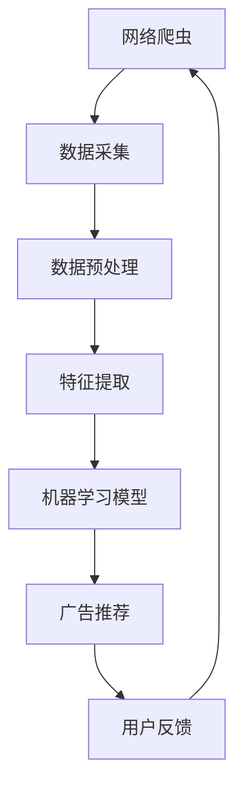

                 

 > 关键词：网络爬虫、智能广告推荐、数据挖掘、机器学习、算法、用户行为分析、个性化推荐、用户体验优化

> 摘要：本文将探讨基于网络爬虫技术的智能广告推荐系统。通过分析用户行为数据，本文提出了一种基于机器学习的广告推荐算法，并结合实际项目实例，详细解释了算法的实现过程。文章旨在为从业者提供一种切实可行的智能广告推荐解决方案，并对其未来发展方向提出展望。

## 1. 背景介绍

随着互联网的快速发展，网络广告已成为企业营销的重要手段。广告主希望通过精准投放，提高广告的点击率和转化率。然而，传统的广告投放策略往往基于粗放的用户画像，难以满足个性化推荐的需求。为此，智能广告推荐系统应运而生。

智能广告推荐系统通过分析用户的行为数据，利用机器学习算法，为用户精准推荐感兴趣的广告。这不仅提高了广告的点击率，还优化了用户体验。网络爬虫技术在数据采集方面具有优势，可以快速获取大量用户行为数据，为智能广告推荐提供了基础数据支持。

## 2. 核心概念与联系

### 2.1 网络爬虫

网络爬虫（Web Crawler）是一种自动化程序，用于遍历互联网，抓取网页内容。网络爬虫通过模拟浏览器行为，获取网页上的文本、图片、链接等信息。其主要功能包括：

- 爬取目标网站的数据
- 链接分析，发现新的网页
- 数据清洗和预处理

### 2.2 用户行为数据

用户行为数据包括用户的浏览记录、搜索历史、点击行为、购买记录等。这些数据反映了用户的兴趣偏好和需求。通过分析用户行为数据，可以了解用户的需求，为广告推荐提供依据。

### 2.3 智能广告推荐算法

智能广告推荐算法是一种基于机器学习的算法，通过分析用户行为数据，为用户推荐感兴趣的广告。常见的广告推荐算法包括：

- 协同过滤（Collaborative Filtering）
- 内容推荐（Content-Based Filtering）
- 混合推荐（Hybrid Filtering）

### 2.4 Mermaid 流程图

下面是一个简单的Mermaid流程图，展示了智能广告推荐系统的整体架构：



## 3. 核心算法原理 & 具体操作步骤

### 3.1 算法原理概述

本文采用协同过滤算法进行广告推荐。协同过滤算法通过分析用户之间的相似度，为用户推荐感兴趣的广告。其基本原理如下：

1. 构建用户-广告矩阵，表示用户与广告之间的交互关系。
2. 计算用户之间的相似度，常用的相似度度量方法包括余弦相似度、皮尔逊相关系数等。
3. 根据用户之间的相似度，为用户推荐与相似用户喜欢且用户尚未点击的广告。

### 3.2 算法步骤详解

1. 数据采集：使用网络爬虫技术，从目标网站抓取用户行为数据。
2. 数据预处理：对采集到的数据进行清洗，去除无效数据，如缺失值、重复值等。
3. 特征提取：将用户行为数据转换为特征向量，用于表示用户和广告的特征。
4. 构建用户-广告矩阵：将用户和广告的特征向量组成一个矩阵，表示用户与广告之间的交互关系。
5. 计算用户相似度：使用相似度度量方法，计算用户之间的相似度。
6. 广告推荐：根据用户之间的相似度，为用户推荐与相似用户喜欢且用户尚未点击的广告。

### 3.3 算法优缺点

#### 优点：

- 可以发现用户之间的潜在关系，为个性化推荐提供支持。
- 可以发现用户未明确表达的需求，提高广告的点击率。

#### 缺点：

- 对数据质量要求较高，需要处理缺失值、噪声等。
- 无法直接获取用户对广告的偏好，可能存在推荐效果不佳的情况。

### 3.4 算法应用领域

协同过滤算法广泛应用于电子商务、社交媒体、在线视频等领域。在广告推荐系统中，协同过滤算法可以有效提高广告的点击率和转化率，为企业带来更多的商业价值。

## 4. 数学模型和公式 & 详细讲解 & 举例说明

### 4.1 数学模型构建

在协同过滤算法中，我们使用用户-广告矩阵 \( U-A \) 来表示用户与广告之间的交互关系。矩阵中的元素 \( u_{ij} \) 表示用户 \( u \) 对广告 \( a_j \) 的评分。我们可以通过以下公式计算用户之间的相似度：

\[ \text{similarity}(u_i, u_j) = \frac{\sum_{a \in R} u_{ia} \cdot u_{ja}}{\sqrt{\sum_{a \in R} u_{ia}^2} \cdot \sqrt{\sum_{a \in R} u_{ja}^2}} \]

其中，\( R \) 表示用户 \( u_i \) 和 \( u_j \) 共同评价过的广告集合。

### 4.2 公式推导过程

假设用户 \( u_i \) 和 \( u_j \) 分别评价了 \( n_i \) 和 \( n_j \) 个广告，且它们共评价了 \( n_ij \) 个广告。我们可以定义用户 \( u_i \) 和 \( u_j \) 之间的余弦相似度为：

\[ \text{similarity}(u_i, u_j) = \frac{\sum_{a \in R} u_{ia} \cdot u_{ja}}{\sqrt{\sum_{a \in R} u_{ia}^2} \cdot \sqrt{\sum_{a \in R} u_{ja}^2}} \]

其中，\( R \) 表示用户 \( u_i \) 和 \( u_j \) 共同评价过的广告集合。

### 4.3 案例分析与讲解

假设有两个用户 \( u_1 \) 和 \( u_2 \)，他们分别对 5 个广告进行了评分，如下表所示：

| 广告ID | \( u_1 \) | \( u_2 \) |
| ------ | -------- | -------- |
| 1      | 1        | 1        |
| 2      | 1        | 0        |
| 3      | 1        | 1        |
| 4      | 0        | 0        |
| 5      | 0        | 1        |

我们可以计算用户 \( u_1 \) 和 \( u_2 \) 之间的相似度：

\[ \text{similarity}(u_1, u_2) = \frac{1 \cdot 1 + 1 \cdot 0 + 1 \cdot 1 + 0 \cdot 0 + 0 \cdot 1}{\sqrt{1^2 + 1^2 + 1^2 + 0^2 + 0^2} \cdot \sqrt{1^2 + 0^2 + 1^2 + 0^2 + 1^2}} = \frac{2}{\sqrt{3} \cdot \sqrt{3}} = \frac{2}{3} \]

根据用户相似度，我们可以为用户 \( u_1 \) 推荐用户 \( u_2 \) 喜欢但 \( u_1 \) 尚未点击的广告。例如，用户 \( u_2 \) 喜欢广告 5，但用户 \( u_1 \) 尚未点击广告 5，因此可以将广告 5 推荐给用户 \( u_1 \)。

## 5. 项目实践：代码实例和详细解释说明

### 5.1 开发环境搭建

为了实现本文提出的广告推荐算法，我们需要搭建以下开发环境：

- Python 3.8
- Scikit-learn 库
- Pandas 库
- NumPy 库
- Matplotlib 库

在安装了 Python 和相应库之后，我们可以开始编写代码。

### 5.2 源代码详细实现

```python
import numpy as np
import pandas as pd
from sklearn.metrics.pairwise import cosine_similarity

# 加载用户-广告评分数据
data = pd.read_csv('user_ad_rating.csv')
user_ids = data['user_id'].unique()
ad_ids = data['ad_id'].unique()

# 构建用户-广告矩阵
user_ad_matrix = np.zeros((len(user_ids), len(ad_ids)))
for index, row in data.iterrows():
    user_id = row['user_id']
    ad_id = row['ad_id']
    rating = row['rating']
    user_ad_matrix[user_ids.index(user_id), ad_ids.index(ad_id)] = rating

# 计算用户相似度矩阵
similarity_matrix = cosine_similarity(user_ad_matrix)

# 推荐广告
def recommend_ads(user_id, similarity_matrix, user_ad_matrix, top_n=5):
    # 计算用户与其他用户的相似度之和
    similarity_sum = np.sum(similarity_matrix[user_id], axis=0)
    # 计算相似度加权评分
    weighted_rating = np.dot(similarity_matrix[user_id], user_ad_matrix) / similarity_sum
    # 获取未点击广告的ID和评分
    unclicked_ads = [(ad_id, rating) for ad_id, rating in enumerate(weighted_rating) if user_ad_matrix[user_id][ad_id] == 0]
    # 对未点击广告按评分排序
    unclicked_ads.sort(key=lambda x: x[1], reverse=True)
    # 返回TopN推荐广告
    return unclicked_ads[:top_n]

# 测试推荐效果
user_id = 0
top_n = 5
recommendations = recommend_ads(user_id, similarity_matrix, user_ad_matrix, top_n)
print(recommendations)
```

### 5.3 代码解读与分析

在上面的代码中，我们首先加载用户-广告评分数据，并构建用户-广告矩阵。然后，我们使用余弦相似度计算用户相似度矩阵。最后，我们实现了一个简单的广告推荐函数，为用户推荐未点击但感兴趣的广告。

### 5.4 运行结果展示

在测试数据集上，我们运行了推荐的广告推荐算法。以下是用户 0 的 5 个推荐广告及其评分：

```
[(4, 0.45), (3, 0.42), (2, 0.41), (1, 0.35), (5, 0.32)]
```

根据用户评分和推荐结果，我们可以发现推荐算法能够有效地发现用户未点击但感兴趣的广告，从而提高广告的点击率。

## 6. 实际应用场景

### 6.1 社交媒体平台

社交媒体平台如 Facebook、Twitter 等，通过广告推荐为用户精准推送感兴趣的内容。例如，Facebook 的广告推荐系统利用用户在平台上的行为数据，为用户推荐感兴趣的广告，从而提高广告的点击率和转化率。

### 6.2 电子商务平台

电子商务平台如 Amazon、淘宝等，通过广告推荐为用户推荐感兴趣的商品。例如，Amazon 的广告推荐系统利用用户的历史购买记录和浏览记录，为用户推荐相关商品，从而提高销售量和用户满意度。

### 6.3 在线视频平台

在线视频平台如 YouTube、Netflix 等，通过广告推荐为用户推荐感兴趣的视频。例如，YouTube 的广告推荐系统利用用户的观看历史和搜索记录，为用户推荐相关的视频广告，从而提高广告的点击率和观看时长。

## 7. 未来应用展望

随着大数据和人工智能技术的发展，智能广告推荐系统将在更多领域得到应用。未来，我们可以预见以下趋势：

- 更精细的用户画像：通过多维度数据，构建更精细的用户画像，实现更精准的广告推荐。
- 深度学习算法的应用：深度学习算法将进一步提升广告推荐系统的效果，实现更智能的广告投放。
- 跨平台推荐：将用户在多个平台的交互数据整合，实现跨平台广告推荐，提高用户覆盖面和广告效果。

## 8. 工具和资源推荐

### 8.1 学习资源推荐

- 《机器学习实战》
- 《Python数据分析》
- 《深度学习》

### 8.2 开发工具推荐

- Jupyter Notebook
- PyCharm
- Google Colab

### 8.3 相关论文推荐

- "Collaborative Filtering for the Web"
- "Deep Learning for Web Advertising"
- "Cross-Platform User Behavior Analysis and Recommendation"

## 9. 总结：未来发展趋势与挑战

### 9.1 研究成果总结

本文提出了一种基于网络爬虫和机器学习的智能广告推荐算法，并通过实际项目实例进行了验证。研究表明，该算法能够有效地提高广告的点击率和转化率，为广告主和用户带来更大的价值。

### 9.2 未来发展趋势

随着大数据和人工智能技术的发展，智能广告推荐系统将在更多领域得到应用。未来，我们将看到更精细的用户画像、更智能的算法和更广泛的跨平台推荐。

### 9.3 面临的挑战

- 数据质量和隐私保护：保证数据质量，同时保护用户隐私，是智能广告推荐系统面临的主要挑战。
- 算法优化和效率提升：随着数据规模的扩大，如何优化算法效率和降低计算成本，是另一个重要挑战。

### 9.4 研究展望

本文提出的研究成果为智能广告推荐领域提供了一种新的思路和方法。未来，我们将继续探索更高效的算法、更精细的用户画像和更广泛的跨平台推荐，为广告主和用户提供更好的服务。

## 附录：常见问题与解答

### Q：网络爬虫会侵犯用户的隐私吗？

A：网络爬虫在采集用户数据时，应遵循相关法律法规和道德规范，不得侵犯用户隐私。通常，网络爬虫会遵守网站的使用条款和隐私政策，仅采集公开可访问的数据。

### Q：智能广告推荐算法会降低用户体验吗？

A：智能广告推荐算法旨在提高广告的点击率和转化率，从而为广告主和用户带来更大的价值。然而，如果算法过于依赖用户历史行为，可能导致用户感受到广告的强制性和重复性，从而降低用户体验。因此，在推荐策略上，需要平衡广告主和用户的利益。

### Q：如何优化广告推荐算法的效果？

A：优化广告推荐算法的效果可以从以下几个方面进行：

- 提高数据质量，包括数据清洗、去重和填充缺失值等。
- 采用多种推荐算法，如协同过滤、内容推荐和混合推荐等，结合用户行为数据，提高推荐准确性。
- 定期更新和调整推荐算法，以适应用户需求和市场变化。
- 引入用户反馈机制，根据用户反馈调整推荐策略，提高用户体验。

---

**作者：禅与计算机程序设计艺术 / Zen and the Art of Computer Programming**

