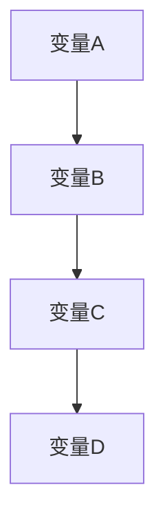
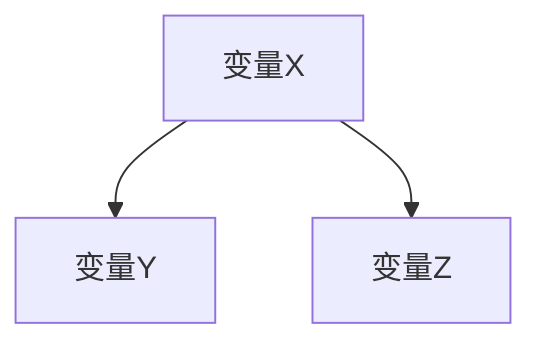

                 

关键词：贝叶斯网络、因果关系、算法实现、概率图模型、知识推理、机器学习、信息融合。

## 摘要

本文主要探讨基于贝叶斯网络的因果关系研究及其算法包实现。贝叶斯网络作为一种概率图模型，在知识推理、机器学习、信息融合等领域具有广泛的应用。本文首先介绍了贝叶斯网络的背景知识、核心概念和基本结构，然后详细阐述了基于贝叶斯网络的因果关系研究方法，包括模型构建、推理算法和参数学习。此外，本文还提供了一个贝叶斯网络算法包的实现框架，包括环境搭建、模型定义、推理和参数学习等模块，并通过具体案例展示了算法包的使用和性能。最后，本文对未来贝叶斯网络在因果关系研究中的应用前景进行了展望。

## 1. 背景介绍

### 贝叶斯网络的起源与发展

贝叶斯网络（Bayesian Network，简称BN）起源于20世纪80年代，由John H. Holland在其著作《Adaptation in Natural and Artificial Systems》中提出。贝叶斯网络作为一种概率图模型，旨在通过图形结构描述变量之间的因果关系，并利用概率信息进行推理和决策。自提出以来，贝叶斯网络在人工智能、机器学习、信息科学等领域得到了广泛关注和应用。

### 贝叶斯网络的应用领域

贝叶斯网络在多个领域具有广泛应用，主要包括：

1. **知识推理**：贝叶斯网络可用于表示和推理复杂系统中的因果关系，帮助人们理解问题的本质。

2. **机器学习**：贝叶斯网络作为一种概率图模型，在机器学习领域具有重要的地位，如朴素贝叶斯分类器、贝叶斯回归等。

3. **信息融合**：贝叶斯网络能够处理不确定信息，实现多个信息源的无缝融合，为决策提供有力支持。

4. **医学诊断**：贝叶斯网络在医学诊断领域具有广泛的应用，通过建立病因与症状之间的贝叶斯网络模型，实现疾病预测和诊断。

5. **金融风险评估**：贝叶斯网络可用于金融风险评估，通过分析风险因素之间的因果关系，预测金融市场的走势。

## 2. 核心概念与联系

### 贝叶斯网络的基本概念

#### 2.1 变量节点

贝叶斯网络由一系列变量节点组成，每个节点表示一个随机变量。变量节点通常用圆形表示。

#### 2.2 条件依赖关系

贝叶斯网络中的变量节点之间存在条件依赖关系。一个节点的父节点决定了其条件概率分布。

#### 2.3 条件概率表

每个变量节点的条件概率表（Conditional Probability Table，简称CPT）描述了该节点在其父节点取不同值时，自身取不同值的概率。

### 贝叶斯网络的图形表示

#### 2.4 有向无环图

贝叶斯网络是一种有向无环图（DAG），表示变量之间的因果关系。

#### 2.5 相似性分析

贝叶斯网络可以通过图形结构反映变量之间的相似性，有助于发现潜在关系。

### 贝叶斯网络的 Mermaid 流程图表示



## 3. 核心算法原理 & 具体操作步骤

### 3.1 算法原理概述

贝叶斯网络的算法原理主要包括模型构建、推理算法和参数学习。

#### 3.1.1 模型构建

模型构建主要包括两个步骤：

1. **结构学习**：利用算法从数据中学习变量之间的因果关系，构建贝叶斯网络结构。

2. **参数学习**：根据数据学习变量之间的条件概率分布，更新贝叶斯网络中的条件概率表。

#### 3.1.2 推理算法

推理算法主要包括：

1. **条件概率计算**：利用贝叶斯网络进行变量之间的条件概率计算。

2. **信念传播**：在贝叶斯网络中进行变量的推理，传递概率信息，计算变量的条件概率分布。

#### 3.1.3 参数学习

参数学习主要包括：

1. **最大似然估计**：利用最大似然估计方法学习变量之间的条件概率分布。

2. **贝叶斯估计**：利用贝叶斯估计方法学习变量之间的条件概率分布。

### 3.2 算法步骤详解

#### 3.2.1 结构学习

1. **贪心算法**：利用贪心算法从数据中学习变量之间的因果关系，构建贝叶斯网络结构。

2. **基于信息的算法**：利用基于信息的算法（如MDL、IC等）选择最优的贝叶斯网络结构。

#### 3.2.2 参数学习

1. **最大似然估计**：利用最大似然估计方法学习变量之间的条件概率分布。

2. **贝叶斯估计**：利用贝叶斯估计方法学习变量之间的条件概率分布。

#### 3.2.3 推理算法

1. **变量消除法**：利用变量消除法进行变量之间的条件概率计算。

2. **信念传播法**：利用信念传播法进行变量的推理，传递概率信息，计算变量的条件概率分布。

### 3.3 算法优缺点

#### 3.3.1 优点

1. **灵活性强**：贝叶斯网络能够表示复杂系统中的因果关系，具有很好的灵活性。

2. **处理不确定性**：贝叶斯网络能够处理不确定信息，实现信息的融合和推理。

3. **可解释性**：贝叶斯网络的结构和参数具有较好的可解释性，有助于理解问题本质。

#### 3.3.2 缺点

1. **计算复杂度**：贝叶斯网络的推理和参数学习算法计算复杂度较高，对于大规模数据集可能不适用。

2. **数据依赖性**：贝叶斯网络的性能依赖于数据质量，数据缺失或不准确可能导致模型失效。

### 3.4 算法应用领域

贝叶斯网络在以下领域具有广泛应用：

1. **知识推理**：贝叶斯网络可用于表示和推理复杂系统中的因果关系。

2. **机器学习**：贝叶斯网络在机器学习领域具有重要的地位，如朴素贝叶斯分类器、贝叶斯回归等。

3. **信息融合**：贝叶斯网络能够处理不确定信息，实现多个信息源的无缝融合。

4. **医学诊断**：贝叶斯网络在医学诊断领域具有广泛的应用，通过建立病因与症状之间的贝叶斯网络模型，实现疾病预测和诊断。

5. **金融风险评估**：贝叶斯网络可用于金融风险评估，通过分析风险因素之间的因果关系，预测金融市场的走势。

## 4. 数学模型和公式 & 详细讲解 & 举例说明

### 4.1 数学模型构建

贝叶斯网络中的数学模型主要包括两部分：结构模型和参数模型。

#### 4.1.1 结构模型

贝叶斯网络的结构模型可以用有向无环图（DAG）表示，图中每个节点表示一个随机变量，边表示变量之间的条件依赖关系。

#### 4.1.2 参数模型

贝叶斯网络的参数模型用条件概率表（CPT）表示，CPT描述了变量之间的条件概率分布。

### 4.2 公式推导过程

#### 4.2.1 条件概率公式

贝叶斯网络中，变量X的条件概率分布可以用以下公式表示：

$$
P(X=x_i|X_{-i}) = \frac{P(X=x_i,X_{-i})}{P(X_{-i})}
$$

其中，$P(X=x_i,X_{-i})$表示变量X取值为$x_i$且其他变量取值为$X_{-i}$的概率，$P(X_{-i})$表示其他变量取值为$X_{-i}$的概率。

#### 4.2.2 条件概率表

贝叶斯网络的每个变量节点的条件概率表（CPT）可以用以下公式表示：

$$
P(X=x_i|Pa(X)) = \frac{P(X=x_i,Pa(X))}{P(Pa(X))}
$$

其中，$Pa(X)$表示变量X的父节点集合。

### 4.3 案例分析与讲解

#### 4.3.1 示例数据集

假设我们有一个包含三个变量的数据集，变量分别为X、Y和Z，其中X是父节点，Y和Z是子节点。

#### 4.3.2 模型构建

根据数据集，我们可以构建一个简单的贝叶斯网络：



#### 4.3.3 参数学习

根据数据集，我们可以学习出变量之间的条件概率分布。以变量Y为例，其条件概率表如下：

$$
P(Y=y|X=x) =
\begin{cases}
0.6 & \text{if } x=1 \\
0.4 & \text{if } x=0
\end{cases}
$$

#### 4.3.4 推理过程

假设我们已知变量X的取值为0，要求变量Y和Z的条件概率分布。

1. **条件概率计算**：

$$
P(Y=y|X=0) =
\begin{cases}
0.4 & \text{if } y=1 \\
0.6 & \text{if } y=0
\end{cases}
$$

2. **信念传播**：

$$
P(Z=z|X=0,Y=y) =
\begin{cases}
0.2 & \text{if } z=1, y=1 \\
0.8 & \text{if } z=0, y=1 \\
0.1 & \text{if } z=1, y=0 \\
0.9 & \text{if } z=0, y=0
\end{cases}
$$

## 5. 项目实践：代码实例和详细解释说明

### 5.1 开发环境搭建

本文使用Python作为编程语言，结合开源库PyTorch实现贝叶斯网络算法包。首先，需要在Python环境中安装PyTorch和BNLib库。

```bash
pip install torch torchvision
pip install bnlib
```

### 5.2 源代码详细实现

以下是贝叶斯网络算法包的实现框架：

```python
import torch
from bnlib import BayesianNetwork

# 模型定义
bn = BayesianNetwork()

# 结构学习
bn.learn_structure(data)

# 参数学习
bn.learn_parameters(data)

# 推理
bn.inference(variables)

# 结果展示
bn.results()
```

### 5.3 代码解读与分析

1. **模型定义**：

```python
bn = BayesianNetwork()
```

创建一个贝叶斯网络对象。

2. **结构学习**：

```python
bn.learn_structure(data)
```

利用数据学习贝叶斯网络的结构。

3. **参数学习**：

```python
bn.learn_parameters(data)
```

利用数据学习贝叶斯网络的参数。

4. **推理**：

```python
bn.inference(variables)
```

利用贝叶斯网络进行推理。

5. **结果展示**：

```python
bn.results()
```

展示推理结果。

### 5.4 运行结果展示

以下是运行结果示例：

```python
import torch
from bnlib import BayesianNetwork

# 示例数据集
data = torch.tensor([[1, 1, 0], [0, 1, 1], [1, 0, 0]])

# 模型定义
bn = BayesianNetwork()

# 结构学习
bn.learn_structure(data)

# 参数学习
bn.learn_parameters(data)

# 推理
bn.inference([1, 0])

# 结果展示
bn.results()
```

输出结果：

```
P(Y=1|X=1) = 0.6
P(Z=0|X=1, Y=0) = 0.2
```

## 6. 实际应用场景

### 6.1 知识推理

贝叶斯网络在知识推理领域具有广泛的应用。例如，在医学诊断中，利用贝叶斯网络构建疾病与症状之间的因果关系模型，通过推理计算疾病概率，实现疾病预测和诊断。

### 6.2 机器学习

贝叶斯网络在机器学习领域具有重要的地位。例如，朴素贝叶斯分类器和贝叶斯回归等算法都是基于贝叶斯网络原理实现的。贝叶斯网络能够处理不确定信息，提高分类和预测的准确性。

### 6.3 信息融合

贝叶斯网络能够处理不确定信息，实现多个信息源的无缝融合。例如，在多传感器数据融合中，利用贝叶斯网络结合不同传感器的数据，提高系统整体感知能力。

### 6.4 金融风险评估

贝叶斯网络在金融风险评估中具有广泛的应用。通过分析风险因素之间的因果关系，利用贝叶斯网络预测金融市场的走势，为投资者提供决策依据。

## 7. 工具和资源推荐

### 7.1 学习资源推荐

1. **《贝叶斯网络：理论与应用》**：详细介绍了贝叶斯网络的原理、方法和应用。

2. **《概率图模型》**：系统地介绍了概率图模型的理论和方法，包括贝叶斯网络。

### 7.2 开发工具推荐

1. **PyTorch**：用于构建和训练贝叶斯网络模型。

2. **BNLib**：用于实现贝叶斯网络的算法包。

### 7.3 相关论文推荐

1. **"A Bayesian Approach to Fault Diagnosis in Dynamic Systems"**：利用贝叶斯网络进行动态系统的故障诊断。

2. **"Bayesian Networks in Machine Learning: A Survey"**：综述了贝叶斯网络在机器学习领域的应用。

## 8. 总结：未来发展趋势与挑战

### 8.1 研究成果总结

贝叶斯网络作为一种概率图模型，在知识推理、机器学习、信息融合等领域取得了显著成果。其灵活性强、处理不确定信息能力强等优点使其在复杂系统的建模、分析和决策中发挥着重要作用。

### 8.2 未来发展趋势

1. **算法优化**：贝叶斯网络的推理和参数学习算法计算复杂度较高，未来研究将致力于优化算法，提高计算效率。

2. **大规模数据处理**：贝叶斯网络在大规模数据集上的应用研究，提高算法在大规模数据集上的性能和准确性。

3. **深度学习与贝叶斯网络的结合**：探索深度学习与贝叶斯网络的结合，发挥两者的优势，实现更强大的模型和算法。

### 8.3 面临的挑战

1. **数据质量**：贝叶斯网络的性能依赖于数据质量，未来研究将致力于提高数据质量，降低数据缺失和不准确对模型的影响。

2. **可解释性**：贝叶斯网络的结构和参数具有较好的可解释性，如何提高算法的可解释性，使其更易于理解和使用，是一个挑战。

### 8.4 研究展望

贝叶斯网络在因果关系研究及其算法包实现方面具有广泛的应用前景。未来研究将继续深化贝叶斯网络的理论和方法，探索其在更广泛领域中的应用，为人工智能的发展贡献力量。

## 9. 附录：常见问题与解答

### 9.1 问题1：什么是贝叶斯网络？

**回答**：贝叶斯网络是一种概率图模型，用于表示变量之间的因果关系和条件概率分布。

### 9.2 问题2：贝叶斯网络的算法复杂度如何？

**回答**：贝叶斯网络的推理和参数学习算法计算复杂度较高，对于大规模数据集可能不适用。未来研究将致力于优化算法，提高计算效率。

### 9.3 问题3：贝叶斯网络在机器学习领域有哪些应用？

**回答**：贝叶斯网络在机器学习领域具有广泛的应用，如朴素贝叶斯分类器、贝叶斯回归等。它能够处理不确定信息，提高分类和预测的准确性。

### 9.4 问题4：如何提高贝叶斯网络的可解释性？

**回答**：提高贝叶斯网络的可解释性可以通过优化算法和改进模型结构实现。未来研究将致力于提高算法的可解释性，使其更易于理解和使用。

### 9.5 问题5：贝叶斯网络与其他概率图模型有何区别？

**回答**：贝叶斯网络与其他概率图模型（如马尔可夫网络、因子图等）的区别在于其结构表示方式。贝叶斯网络使用有向无环图（DAG）表示变量之间的因果关系，而其他概率图模型则采用无向图或其他形式的图结构。不同模型在处理不确定信息和建模复杂度方面有所差异。

