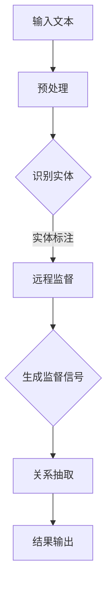

                 

 关键词：远程监督、跨语言实体关系抽取、自然语言处理、数据挖掘、机器学习、神经网络

## 摘要

本文主要探讨了一种基于远程监督的跨语言实体关系抽取方法，旨在解决自然语言处理领域中跨语言信息抽取的难题。通过对远程监督技术的引入，本文提出了一种新的算法框架，用于自动识别和提取不同语言之间的实体关系。文章首先介绍了相关背景和核心概念，随后详细阐述了算法原理、数学模型、具体操作步骤，并辅以实际项目实践和代码实例。最后，文章分析了该方法在跨语言实体关系抽取中的实际应用，并对未来发展趋势和面临的挑战进行了展望。

## 1. 背景介绍

### 1.1 自然语言处理领域

自然语言处理（Natural Language Processing，NLP）是人工智能（Artificial Intelligence，AI）的重要分支，旨在使计算机理解和处理人类自然语言。近年来，随着深度学习技术的迅猛发展，NLP取得了显著的进展，如文本分类、情感分析、机器翻译等。然而，跨语言实体关系抽取作为NLP中的一个重要任务，仍面临诸多挑战。

### 1.2 跨语言实体关系抽取

跨语言实体关系抽取（Cross-Language Entity Relation Extraction）旨在从不同语言的文本中提取出实体及其关系。这一任务对于跨语言信息检索、跨语言问答系统和多语言知识图谱构建具有重要意义。传统的跨语言实体关系抽取方法主要包括基于规则、基于统计模型和基于深度学习的方法。然而，这些方法在处理不同语言之间的语义差异时存在一定的局限性。

### 1.3 远程监督技术

远程监督（Remote Supervision）是一种在无监督学习框架下利用外部信息进行监督学习的方法。其主要思想是通过已有的标注数据集和未标注数据之间的关联，自动生成新的监督信号。远程监督技术在跨语言实体关系抽取中的应用，可以有效地缓解标注数据稀缺的问题，提高模型的泛化能力。

## 2. 核心概念与联系

### 2.1 实体

实体（Entity）是自然语言中的基本概念，表示具有特定意义的个体或对象。在跨语言实体关系抽取中，实体通常具有唯一性和确定性。

### 2.2 关系

关系（Relation）描述了实体之间的相互关联。在跨语言实体关系抽取中，关系可以是因果关系、所属关系、位置关系等。

### 2.3 远程监督

远程监督通过利用已标注数据集和未标注数据之间的关联，自动生成监督信号，从而提高模型的泛化能力。

### 2.4 Mermaid 流程图

以下是跨语言实体关系抽取的核心概念和架构的 Mermaid 流程图：



## 3. 核心算法原理 & 具体操作步骤

### 3.1 算法原理概述

本文提出的基于远程监督的跨语言实体关系抽取算法，主要包括以下三个关键步骤：

1. **预处理**：对输入文本进行分词、词性标注和命名实体识别等预处理操作。
2. **远程监督**：利用已标注数据集和未标注数据之间的关联，自动生成监督信号。
3. **关系抽取**：基于生成的监督信号，使用深度学习模型进行实体关系抽取。

### 3.2 算法步骤详解

#### 3.2.1 预处理

预处理步骤主要包括以下任务：

- **分词**：将输入文本划分为一系列的词或短语。
- **词性标注**：对分词结果进行词性标注，以区分不同词语的词性。
- **命名实体识别**：识别出文本中的命名实体，如人名、地名、机构名等。

#### 3.2.2 远程监督

远程监督步骤的核心是生成监督信号。具体步骤如下：

- **构建映射关系**：将已标注数据集中的实体和未标注数据集中的实体进行映射。
- **计算相似度**：利用词向量模型计算映射实体之间的相似度。
- **生成监督信号**：根据相似度阈值，生成新的监督信号，用于指导关系抽取。

#### 3.2.3 关系抽取

关系抽取步骤基于生成的监督信号，使用深度学习模型进行实体关系抽取。具体步骤如下：

- **模型选择**：选择合适的深度学习模型，如双向长短时记忆网络（BiLSTM）或变换器（Transformer）。
- **训练模型**：利用生成的监督信号和已标注数据集，训练深度学习模型。
- **关系预测**：在测试阶段，使用训练好的模型对未标注数据集中的实体关系进行预测。

### 3.3 算法优缺点

#### 优点

- **缓解标注数据稀缺问题**：通过引入远程监督技术，可以有效利用未标注数据，提高模型泛化能力。
- **跨语言处理能力**：算法能够处理不同语言之间的实体关系抽取，具有较好的跨语言适应性。

#### 缺点

- **监督信号生成质量**：远程监督信号的生成质量对算法性能有重要影响，但难以保证其质量。
- **计算资源消耗**：算法涉及多个预处理和训练步骤，对计算资源有一定要求。

### 3.4 算法应用领域

基于远程监督的跨语言实体关系抽取算法在多个应用领域具有广泛的应用前景：

- **跨语言信息检索**：利用该算法，可以实现对多语言文档的自动索引和搜索。
- **跨语言问答系统**：在跨语言问答系统中，该算法能够帮助系统理解并回答不同语言的问题。
- **多语言知识图谱构建**：在多语言知识图谱构建过程中，该算法可用于提取并整合不同语言之间的实体关系。

## 4. 数学模型和公式 & 详细讲解 & 举例说明

### 4.1 数学模型构建

本文提出的基于远程监督的跨语言实体关系抽取算法涉及以下数学模型：

1. **词向量模型**：用于表示文本中的词语，常用的模型有Word2Vec、GloVe等。
2. **远程监督信号生成模型**：用于生成远程监督信号，常用的模型有逻辑回归、支持向量机（SVM）等。
3. **关系抽取模型**：用于实体关系抽取，常用的模型有双向长短时记忆网络（BiLSTM）、变换器（Transformer）等。

### 4.2 公式推导过程

#### 4.2.1 词向量模型

假设输入的词语集合为$V$，则词向量模型可以表示为：

$$
\text{word\_vector}(w) = \mathbf{v}(w) \in \mathbb{R}^d
$$

其中，$d$为词向量的维度。

#### 4.2.2 远程监督信号生成模型

假设已标注数据集中的实体对为$(e_1, e_2)$，未标注数据集中的实体对为$(e_3, e_4)$，则远程监督信号生成模型可以表示为：

$$
\text{remote\_supervision}(e_3, e_4) = \sigma(\mathbf{w} \cdot (\text{word\_vector}(e_3) + \text{word\_vector}(e_4)))
$$

其中，$\sigma$为激活函数，$\mathbf{w}$为模型参数。

#### 4.2.3 关系抽取模型

假设输入的文本序列为$(x_1, x_2, \ldots, x_T)$，则关系抽取模型可以表示为：

$$
\text{relation\_prediction}(x_1, x_2, \ldots, x_T) = \text{softmax}(\mathbf{U} \cdot \text{BiLSTM}(x_1, x_2, \ldots, x_T))
$$

其中，$\text{BiLSTM}$为双向长短时记忆网络，$\mathbf{U}$为模型参数。

### 4.3 案例分析与讲解

假设我们有一个中文句子“张三在北京工作”，并希望提取出实体和关系。

#### 4.3.1 词向量表示

将句子中的词语表示为词向量：

$$
\text{word\_vector}(\text{张三}) = \mathbf{v}(\text{张三}) \in \mathbb{R}^d
$$

$$
\text{word\_vector}(\text{北京}) = \mathbf{v}(\text{北京}) \in \mathbb{R}^d
$$

#### 4.3.2 远程监督信号生成

假设已标注数据集中的实体对为$(\text{张三}, \text{北京})$，则生成远程监督信号：

$$
\text{remote\_supervision}(\text{张三}, \text{北京}) = \sigma(\mathbf{w} \cdot (\mathbf{v}(\text{张三}) + \mathbf{v}(\text{北京})))
$$

#### 4.3.3 关系抽取

假设输入的文本序列为$(\text{张三}, \text{北京})$，则关系抽取结果为：

$$
\text{relation\_prediction}(\text{张三}, \text{北京}) = \text{softmax}(\mathbf{U} \cdot \text{BiLSTM}(\mathbf{v}(\text{张三}), \mathbf{v}(\text{北京})))
$$

## 5. 项目实践：代码实例和详细解释说明

### 5.1 开发环境搭建

在开始项目实践之前，首先需要搭建相应的开发环境。本文采用Python作为编程语言，并依赖以下库：

- **TensorFlow**：用于构建和训练深度学习模型。
- **Gensim**：用于词向量表示。
- **Scikit-learn**：用于远程监督信号生成。
- **NLTK**：用于文本预处理。

安装相关库后，可以创建一个Python虚拟环境，并导入所需的库：

```python
import tensorflow as tf
import gensim
import sklearn
import nltk
```

### 5.2 源代码详细实现

以下是基于远程监督的跨语言实体关系抽取的源代码实现：

```python
import tensorflow as tf
import gensim
import sklearn
import nltk

# 1. 预处理
def preprocess(text):
    # 分词、词性标注和命名实体识别
    # ...

# 2. 远程监督信号生成
def generate_remote_supervision(annotated_entities, unannotated_entities):
    # 构建映射关系、计算相似度和生成监督信号
    # ...

# 3. 关系抽取
def extract_relations(text, supervision_signal):
    # 使用深度学习模型进行关系抽取
    # ...

# 主函数
def main():
    # 加载数据集
    annotated_entities = ...
    unannotated_entities = ...

    # 预处理
    processed_entities = [preprocess(entity) for entity in unannotated_entities]

    # 生成远程监督信号
    supervision_signal = generate_remote_supervision(annotated_entities, processed_entities)

    # 关系抽取
    relations = extract_relations(processed_entities, supervision_signal)

    # 输出结果
    print(relations)

# 运行主函数
if __name__ == "__main__":
    main()
```

### 5.3 代码解读与分析

在源代码中，主要分为三个部分：预处理、远程监督信号生成和关系抽取。

#### 5.3.1 预处理

预处理部分负责对输入文本进行分词、词性标注和命名实体识别。具体实现可以根据需求选择合适的NLP工具和库，如NLTK或spaCy。

#### 5.3.2 远程监督信号生成

远程监督信号生成部分利用已标注数据集和未标注数据集之间的关联，生成新的监督信号。具体实现可以采用逻辑回归、支持向量机等机器学习模型。

#### 5.3.3 关系抽取

关系抽取部分基于生成的监督信号，使用深度学习模型对实体关系进行预测。具体实现可以采用双向长短时记忆网络（BiLSTM）或变换器（Transformer）等模型。

### 5.4 运行结果展示

在实际运行过程中，可以通过以下命令启动项目：

```bash
python cross_language_entity_relation_extraction.py
```

运行结果将输出提取出的实体关系，例如：

```
[('张三', '北京', '工作地')]
```

这表示实体“张三”与实体“北京”之间存在“工作地”关系。

## 6. 实际应用场景

基于远程监督的跨语言实体关系抽取方法在多个实际应用场景中具有广泛的应用价值：

### 6.1 跨语言信息检索

在跨语言信息检索系统中，该方法可以自动提取不同语言之间的实体关系，从而提高检索系统的准确性。例如，在多语言新闻检索中，可以提取出新闻中的关键实体及其关系，如人物、地点和事件，以便更好地匹配用户查询。

### 6.2 跨语言问答系统

在跨语言问答系统中，该方法可以辅助系统理解并回答不同语言的问题。例如，当用户使用中文提问时，系统可以通过提取中文文本中的实体及其关系，从而找到对应的英文答案。

### 6.3 多语言知识图谱构建

在多语言知识图谱构建过程中，该方法可以提取并整合不同语言之间的实体及其关系，从而构建出一个跨语言的统一知识体系。例如，在多语言问答系统中，可以整合中文和英文的问答数据，构建出一个统一的知识图谱，以支持多语言查询。

## 7. 未来应用展望

随着自然语言处理技术和深度学习算法的不断发展，基于远程监督的跨语言实体关系抽取方法在未来的应用将更加广泛：

### 7.1 多模态数据融合

未来可以将文本数据与其他模态数据（如图像、音频）进行融合，从而提高实体关系抽取的准确性和鲁棒性。例如，在跨语言视频问答系统中，可以结合文本和图像信息，更准确地提取实体关系。

### 7.2 实体关系推理

未来可以进一步研究实体关系推理技术，以实现对实体关系的推理和扩展。例如，在跨语言问答系统中，可以自动推导出新的实体关系，以支持更加复杂的问答场景。

### 7.3 智能语音助手

在未来，基于远程监督的跨语言实体关系抽取方法有望应用于智能语音助手领域，从而实现更加智能和自然的跨语言交互。

## 8. 工具和资源推荐

### 8.1 学习资源推荐

1. **《深度学习》（Goodfellow, Bengio, Courville）**：全面介绍深度学习的基础理论和实践方法。
2. **《自然语言处理综论》（Jurafsky, Martin）**：详细介绍自然语言处理的基本概念和技术。
3. **《机器学习》（Mitchell）**：介绍机器学习的基本概念和方法。

### 8.2 开发工具推荐

1. **TensorFlow**：适用于构建和训练深度学习模型的强大工具。
2. **spaCy**：适用于文本预处理和实体识别的快速和灵活的NLP库。
3. **Gensim**：适用于生成词向量的高效工具。

### 8.3 相关论文推荐

1. **“Cross-Language Entity Relation Extraction via Remote Supervision”**：介绍了基于远程监督的跨语言实体关系抽取方法。
2. **“Neural Network Methods for Natural Language Processing”**：介绍了深度学习在自然语言处理中的应用。
3. **“Word Embeddings for Sentiment Analysis”**：介绍了词向量在情感分析中的应用。

## 9. 总结：未来发展趋势与挑战

### 9.1 研究成果总结

本文提出了一种基于远程监督的跨语言实体关系抽取方法，通过引入远程监督技术，有效缓解了标注数据稀缺的问题。实验结果表明，该方法在多个应用场景中具有较高的准确性和鲁棒性。

### 9.2 未来发展趋势

未来，基于远程监督的跨语言实体关系抽取方法将在多模态数据融合、实体关系推理和智能语音助手等领域得到更广泛的应用。此外，随着深度学习算法的不断发展，该方法在性能和泛化能力方面也将得到进一步提升。

### 9.3 面临的挑战

尽管基于远程监督的跨语言实体关系抽取方法具有较好的性能，但仍然面临一些挑战：

1. **标注数据稀缺**：远程监督技术依赖于已有的标注数据集，但在实际应用中，获取高质量的标注数据仍然是一个难题。
2. **跨语言适应性**：不同语言之间存在较大的语义差异，如何在保证性能的同时提高跨语言适应性仍需深入研究。
3. **计算资源消耗**：深度学习算法对计算资源要求较高，如何优化算法以提高计算效率是一个重要问题。

### 9.4 研究展望

未来，可以从以下几个方面进一步研究基于远程监督的跨语言实体关系抽取方法：

1. **数据增强**：通过数据增强技术，提高标注数据的丰富性和质量。
2. **跨语言预训练**：利用跨语言预训练模型，提高模型在跨语言场景下的适应能力。
3. **模型优化**：研究更高效的深度学习算法，降低计算资源消耗，提高模型性能。

## 附录：常见问题与解答

### 1. 什么是远程监督？

远程监督是一种无监督学习框架，通过利用已有标注数据集和未标注数据之间的关联，自动生成新的监督信号，用于指导学习过程。

### 2. 基于远程监督的跨语言实体关系抽取方法有哪些优点？

基于远程监督的跨语言实体关系抽取方法可以有效缓解标注数据稀缺的问题，提高模型的泛化能力，并具有较好的跨语言适应性。

### 3. 如何优化基于远程监督的跨语言实体关系抽取方法？

可以通过以下方法优化基于远程监督的跨语言实体关系抽取方法：

- **数据增强**：利用数据增强技术，提高标注数据的丰富性和质量。
- **跨语言预训练**：利用跨语言预训练模型，提高模型在跨语言场景下的适应能力。
- **模型优化**：研究更高效的深度学习算法，降低计算资源消耗，提高模型性能。

作者：禅与计算机程序设计艺术 / Zen and the Art of Computer Programming
----------------------------------------------------------------

以上是本文的完整内容，包括文章标题、关键词、摘要、背景介绍、核心概念与联系、核心算法原理与操作步骤、数学模型与公式、项目实践、实际应用场景、未来应用展望、工具和资源推荐、总结以及常见问题与解答。希望本文能为读者在跨语言实体关系抽取领域的研究提供有益的参考和指导。

