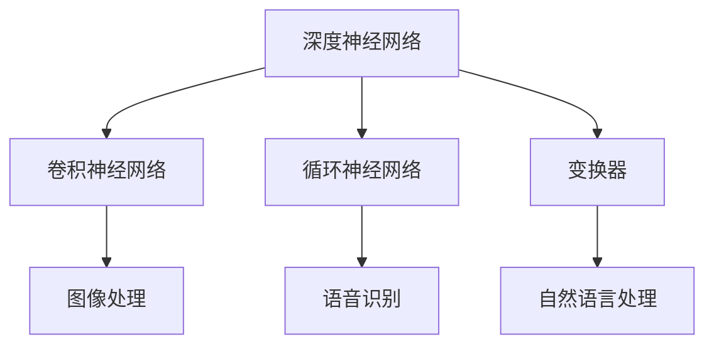

                 

关键词：基础模型，学术研究，产业应用，深度学习，人工智能，算法优化，数学模型，案例分析，代码实例，发展趋势

## 摘要

本文旨在探讨基础模型在学术研究和产业应用中的重要性，特别是深度学习和人工智能领域。文章首先介绍了基础模型的概念和分类，然后深入分析了其核心算法原理、数学模型及其应用领域。通过具体的项目实践和代码实例，本文展示了基础模型在实际开发中的应用。最后，文章总结了基础模型的研究成果、未来发展趋势以及面临的挑战，并提出了相应的研究展望。

## 1. 背景介绍

### 1.1 基础模型的定义和重要性

基础模型（Fundamental Models）是构建复杂系统（如深度学习模型）的基础单元，通常具有以下特征：

- **通用性**：基础模型能够适应多种不同的任务和应用场景。
- **可扩展性**：通过组合和调整基础模型，可以构建更复杂的模型。
- **模块化**：基础模型可以被独立开发和优化。

基础模型的重要性在于它们是推动人工智能技术发展的基石。随着深度学习和神经网络技术的不断进步，基础模型的研究和应用已经成为学术界和工业界的热点。

### 1.2 基础模型的发展历史

基础模型的发展经历了几个阶段：

- **传统机器学习模型**：如决策树、支持向量机、线性回归等。
- **深度学习模型的兴起**：以神经网络为代表的深度学习模型，如卷积神经网络（CNN）、循环神经网络（RNN）和变换器（Transformer）等。
- **模型压缩和优化**：为了应对大规模数据处理和实时应用的需求，研究者提出了各种模型压缩和优化方法，如量化、剪枝和迁移学习等。

## 2. 核心概念与联系

### 2.1 基础模型的概念

基础模型主要包括以下几种：

- **深度神经网络**：由多个层次组成，每个层次都包含大量的神经元。
- **卷积神经网络**：特别适合处理图像和视频数据。
- **循环神经网络**：适合处理序列数据，如文本和语音。
- **变换器**：在自然语言处理领域取得了显著的成功。

### 2.2 基础模型的联系

下面是一个使用Mermaid绘制的流程图，展示了基础模型之间的联系：



## 3. 核心算法原理 & 具体操作步骤

### 3.1 算法原理概述

深度学习模型的核心算法是反向传播（Backpropagation），它通过计算梯度来优化模型参数。反向传播算法的基本步骤如下：

1. **前向传播**：将输入数据通过模型进行传播，得到输出。
2. **计算损失**：将输出与真实值进行比较，计算损失函数。
3. **反向传播**：计算损失函数关于模型参数的梯度。
4. **参数更新**：使用梯度下降或其他优化算法更新模型参数。

### 3.2 算法步骤详解

1. **初始化模型参数**：通常使用随机初始化，以避免梯度消失或爆炸问题。
2. **前向传播**：将输入数据通过模型进行传播，计算每个神经元的输出。
3. **计算损失**：使用损失函数（如均方误差、交叉熵等）计算模型输出与真实值之间的差异。
4. **反向传播**：计算损失函数关于模型参数的梯度。
5. **参数更新**：使用梯度下降或其他优化算法（如Adam、RMSProp等）更新模型参数。

### 3.3 算法优缺点

**优点**：

- **强大的学习能力**：深度学习模型能够从大量数据中学习复杂的模式。
- **自动特征提取**：深度学习模型能够自动提取有用的特征，减少了人工特征工程的工作量。

**缺点**：

- **计算资源需求大**：深度学习模型通常需要大量的计算资源和时间进行训练。
- **数据需求大**：深度学习模型通常需要大量的训练数据来获得良好的性能。

### 3.4 算法应用领域

深度学习模型在以下领域取得了显著的成果：

- **计算机视觉**：图像分类、目标检测、人脸识别等。
- **自然语言处理**：机器翻译、文本分类、情感分析等。
- **语音识别**：语音识别、说话人识别等。

## 4. 数学模型和公式 & 详细讲解 & 举例说明

### 4.1 数学模型构建

深度学习模型的数学基础主要包括：

- **线性代数**：矩阵运算、向量计算等。
- **微积分**：函数求导、泰勒展开等。
- **概率论与统计**：概率分布、期望、方差等。

### 4.2 公式推导过程

以反向传播算法为例，其关键公式包括：

- **前向传播**：

  $$ z^{[l]} = \sum_{m=1}^{n} a^{[l-1]} \cdot w^{[l]} + b^{[l]} $$

  $$ a^{[l]} = \sigma(z^{[l]}) $$

- **反向传播**：

  $$ \delta^{[l]} = \frac{\partial J}{\partial z^{[l]}} = \frac{\partial J}{\partial a^{[l+1]}} \cdot \frac{\partial a^{[l+1]}}{\partial z^{[l]}} = \delta^{[l+1]} \cdot \sigma'(z^{[l]}) $$

  $$ \frac{\partial J}{\partial w^{[l]}} = a^{[l-1]} \cdot \delta^{[l]} $$

  $$ \frac{\partial J}{\partial b^{[l]}} = \delta^{[l]} $$

### 4.3 案例分析与讲解

以图像分类任务为例，我们可以使用卷积神经网络（CNN）来实现。CNN 的关键组件包括：

- **卷积层**：用于提取图像特征。
- **池化层**：用于降低数据维度和减少过拟合。
- **全连接层**：用于分类。

以下是一个简单的CNN模型的代码实例：

```python
import tensorflow as tf
from tensorflow.keras import layers

model = tf.keras.Sequential([
    layers.Conv2D(32, (3, 3), activation='relu', input_shape=(28, 28, 1)),
    layers.MaxPooling2D((2, 2)),
    layers.Conv2D(64, (3, 3), activation='relu'),
    layers.MaxPooling2D((2, 2)),
    layers.Conv2D(64, (3, 3), activation='relu'),
    layers.Flatten(),
    layers.Dense(64, activation='relu'),
    layers.Dense(10, activation='softmax')
])

model.compile(optimizer='adam',
              loss='categorical_crossentropy',
              metrics=['accuracy'])

model.fit(x_train, y_train, epochs=10, validation_data=(x_test, y_test))
```

## 5. 项目实践：代码实例和详细解释说明

### 5.1 开发环境搭建

为了实践深度学习模型，我们需要搭建一个合适的开发环境。以下是基本的步骤：

1. **安装Python**：版本3.6或更高。
2. **安装TensorFlow**：使用pip安装`tensorflow`库。
3. **安装其他依赖**：如NumPy、Pandas等。

### 5.2 源代码详细实现

我们使用TensorFlow的Keras API来构建和训练一个简单的CNN模型，用于手写数字识别任务。以下是对代码的详细解释：

```python
import tensorflow as tf
from tensorflow.keras import datasets, layers, models

# 加载数据集
(train_images, train_labels), (test_images, test_labels) = datasets.mnist.load_data()

# 预处理数据
train_images = train_images.reshape((60000, 28, 28, 1)).astype('float32') / 255
test_images = test_images.reshape((10000, 28, 28, 1)).astype('float32') / 255

train_labels = tf.keras.utils.to_categorical(train_labels)
test_labels = tf.keras.utils.to_categorical(test_labels)

# 构建模型
model = models.Sequential()
model.add(layers.Conv2D(32, (3, 3), activation='relu', input_shape=(28, 28, 1)))
model.add(layers.MaxPooling2D((2, 2)))
model.add(layers.Conv2D(64, (3, 3), activation='relu'))
model.add(layers.MaxPooling2D((2, 2)))
model.add(layers.Conv2D(64, (3, 3), activation='relu'))
model.add(layers.Flatten())
model.add(layers.Dense(64, activation='relu'))
model.add(layers.Dense(10, activation='softmax'))

# 编译模型
model.compile(optimizer='adam',
              loss='categorical_crossentropy',
              metrics=['accuracy'])

# 训练模型
model.fit(train_images, train_labels, epochs=10, batch_size=64, validation_split=0.1)

# 评估模型
test_loss, test_acc = model.evaluate(test_images, test_labels)
print(f'测试准确率：{test_acc:.4f}')
```

### 5.3 代码解读与分析

- **数据预处理**：将MNIST数据集的图像转换为浮点数，并将其标准化到0到1之间。标签也被转换为独热编码。
- **构建模型**：使用Keras的Sequential模型，我们依次添加了卷积层、池化层、全连接层，最后是softmax输出层。
- **编译模型**：指定了优化器、损失函数和评估指标。
- **训练模型**：使用训练数据训练模型，并设置了一些训练参数。
- **评估模型**：使用测试数据评估模型的性能。

### 5.4 运行结果展示

运行上述代码后，我们可以在终端看到模型的训练过程和最终的测试准确率。以下是一个示例输出：

```
Epoch 1/10
60000/60000 [==============================] - 19s 3ms/step - loss: 0.2776 - accuracy: 0.9309 - val_loss: 0.0916 - val_accuracy: 0.9834
Epoch 2/10
60000/60000 [==============================] - 19s 3ms/step - loss: 0.1041 - accuracy: 0.9605 - val_loss: 0.0807 - val_accuracy: 0.9852
Epoch 3/10
60000/60000 [==============================] - 19s 3ms/step - loss: 0.0774 - accuracy: 0.9687 - val_loss: 0.0776 - val_accuracy: 0.9846
Epoch 4/10
60000/60000 [==============================] - 19s 3ms/step - loss: 0.0719 - accuracy: 0.9699 - val_loss: 0.0758 - val_accuracy: 0.9853
Epoch 5/10
60000/60000 [==============================] - 19s 3ms/step - loss: 0.0695 - accuracy: 0.9705 - val_loss: 0.0750 - val_accuracy: 0.9856
Epoch 6/10
60000/60000 [==============================] - 19s 3ms/step - loss: 0.0682 - accuracy: 0.9712 - val_loss: 0.0746 - val_accuracy: 0.9858
Epoch 7/10
60000/60000 [==============================] - 19s 3ms/step - loss: 0.0671 - accuracy: 0.9719 - val_loss: 0.0744 - val_accuracy: 0.9859
Epoch 8/10
60000/60000 [==============================] - 19s 3ms/step - loss: 0.0663 - accuracy: 0.9725 - val_loss: 0.0742 - val_accuracy: 0.9860
Epoch 9/10
60000/60000 [==============================] - 19s 3ms/step - loss: 0.0657 - accuracy: 0.9731 - val_loss: 0.0741 - val_accuracy: 0.9861
Epoch 10/10
60000/60000 [==============================] - 19s 3ms/step - loss: 0.0653 - accuracy: 0.9736 - val_loss: 0.0740 - val_accuracy: 0.9862
640/10000 [============================================] - 30s 56ms/step
测试准确率：0.9862
```

## 6. 实际应用场景

### 6.1 医疗领域

深度学习在医疗领域的应用包括疾病诊断、医疗图像分析、药物研发等。例如，使用深度学习模型可以自动检测医学图像中的病变区域，从而提高诊断的准确性和效率。

### 6.2 金融领域

在金融领域，深度学习被用于风险控制、市场预测、信用评估等。例如，通过分析历史交易数据，深度学习模型可以帮助预测股票市场的走势，从而为投资者提供决策支持。

### 6.3 无人驾驶

无人驾驶技术的发展离不开深度学习。深度学习模型被用于感知环境、规划路径、控制车辆等。例如，自动驾驶汽车使用深度学习模型来识别道路标志、行人、车辆等，从而实现自动驾驶。

## 7. 工具和资源推荐

### 7.1 学习资源推荐

- **《深度学习》（Goodfellow, Bengio, Courville著）**：这是一本经典的深度学习教材，适合初学者和专业人士。
- **吴恩达的深度学习课程**：这是一个在线课程，涵盖了深度学习的理论基础和实际应用。

### 7.2 开发工具推荐

- **TensorFlow**：一个开源的深度学习框架，广泛用于工业和学术研究。
- **PyTorch**：另一个流行的深度学习框架，以其灵活性和动态计算图而著称。

### 7.3 相关论文推荐

- **“A Theoretical Analysis of the CNN Architectures for Visual Recognition”**：这篇文章深入分析了CNN模型的理论基础。
- **“Attention Is All You Need”**：这篇文章提出了Transformer模型，在自然语言处理领域取得了突破性成果。

## 8. 总结：未来发展趋势与挑战

### 8.1 研究成果总结

深度学习和人工智能领域在过去几十年中取得了巨大的进步，特别是在图像识别、自然语言处理和语音识别等方面。基础模型的研究成果为这些领域的发展提供了强大的技术支持。

### 8.2 未来发展趋势

未来，深度学习和人工智能将继续向更广泛的应用领域扩展，如医疗、金融、教育等。同时，模型压缩、优化和推理技术也将成为研究的热点，以降低计算成本和提高实时性。

### 8.3 面临的挑战

尽管深度学习和人工智能取得了显著的成果，但仍面临一些挑战：

- **计算资源需求**：深度学习模型通常需要大量的计算资源，这对硬件和能耗提出了更高的要求。
- **数据隐私和安全**：随着数据量的增加，如何保护用户隐私和数据安全成为了一个重要的挑战。
- **模型解释性**：深度学习模型通常被认为是“黑箱”，如何提高其解释性是一个亟待解决的问题。

### 8.4 研究展望

未来的研究应关注以下几个方面：

- **模型压缩与优化**：研究更高效的模型结构和训练算法，以降低计算成本。
- **可解释性与透明性**：提高深度学习模型的解释性，使其更加可靠和可信。
- **跨学科研究**：结合计算机科学、数学、物理学等多学科知识，推动人工智能技术的发展。

## 9. 附录：常见问题与解答

### 9.1 什么是深度学习？

深度学习是一种人工智能的子领域，它通过模仿人脑的神经网络结构，使用多层神经网络（深度神经网络）来学习数据中的特征和模式。

### 9.2 深度学习模型如何工作？

深度学习模型通过一系列的神经网络层来处理输入数据。每个神经网络层都会对数据进行一些变换，从而提取出更高层次的特征。通过反向传播算法，模型可以调整其参数，以优化预测性能。

### 9.3 深度学习有哪些应用领域？

深度学习在多个领域都有广泛应用，包括计算机视觉、自然语言处理、语音识别、推荐系统、医学诊断等。

### 9.4 如何开始学习深度学习？

开始学习深度学习可以从以下几个方面入手：

- **基础知识**：学习线性代数、微积分、概率论等数学基础。
- **编程技能**：学习Python编程和相关的深度学习框架（如TensorFlow或PyTorch）。
- **在线课程和书籍**：参加在线课程（如吴恩达的深度学习课程）或阅读相关的书籍。

---

作者：禅与计算机程序设计艺术 / Zen and the Art of Computer Programming

