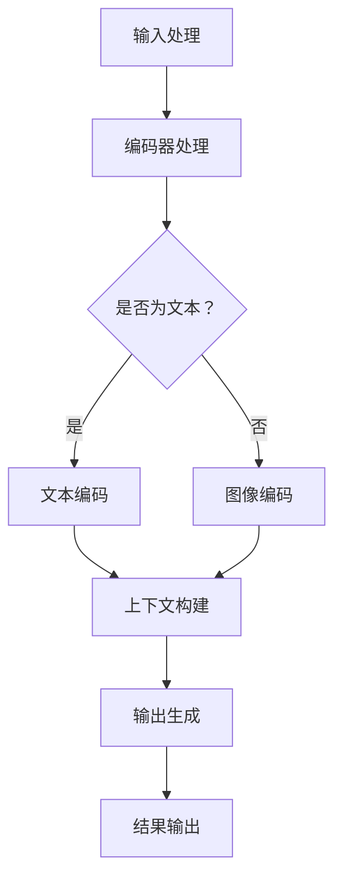

                 

### 1. 背景介绍

在当今的科技领域，人工智能（AI）已经成为一股不可忽视的力量，推动了从自动化到智能化的巨大变革。作为AI的核心组件，基础模型（Foundational Models）正逐渐成为研究人员和开发者们的关注焦点。这些模型具有巨大的潜在价值，不仅在于其自身的强大性能，更在于其能够广泛应用于各种下游任务，为不同的应用场景带来创新和突破。

基础模型是指经过大规模训练的深度学习模型，其设计旨在捕获数据的复杂结构，从而在多种任务上表现出色。这些模型通常采用大型神经网络架构，如Transformer、BERT等，并通过数以亿计的参数来表示和解释数据。其核心优势在于通用性和适应性，可以在不同领域和任务中展现优异的性能。

随着基础模型的发展，人们开始意识到其在各种下游应用中的巨大潜力。然而，这些潜力如何实现，以及如何最大化基础模型的价值，仍是一个亟待解决的问题。本文将深入探讨基础模型在各个下游领域的潜在应用，分析其优势与挑战，并展望未来的发展方向。

本文结构如下：首先，我们将回顾基础模型的发展历程，阐述其核心概念和原理。接着，我们将详细介绍基础模型的核心算法原理，并探讨其在实际操作中的应用步骤。然后，我们将从数学模型和公式推导的角度，深入分析基础模型的工作机制。在项目实践部分，我们将通过具体代码实例，展示基础模型的应用。接下来，我们将探讨基础模型在不同领域的实际应用场景，并对其未来应用前景进行展望。最后，我们将推荐相关的学习资源和开发工具，并总结基础模型的研究成果和未来挑战。

### 2. 核心概念与联系

#### 2.1 基础模型的基本概念

基础模型（Foundational Models）是指那些经过大规模训练、能够捕捉数据中深层结构的模型。这些模型不仅能够在特定任务上表现出色，还能够跨任务共享知识，提高整体性能。基础模型的核心特点包括：

1. **大规模训练**：基础模型通常采用数以亿计的参数，并通过大规模数据集进行训练。这有助于模型学习到数据中的复杂模式和结构。
2. **跨模态**：基础模型能够处理多种类型的数据，如文本、图像、语音等，实现跨模态的信息融合和处理。
3. **自适应能力**：基础模型在训练过程中能够自适应地调整参数，以适应不同的任务和数据分布。
4. **高泛化能力**：基础模型不仅能够在训练数据上表现出色，还能够在新数据和新任务上保持较高的性能。

#### 2.2 基础模型与下游任务的联系

基础模型与下游任务（Downstream Tasks）之间的联系体现在以下几个方面：

1. **任务共享**：基础模型通过跨任务学习，将通用知识和结构转移到特定任务中，提高特定任务的性能。例如，文本生成模型可以用于问答系统、机器翻译等多种任务。
2. **模型定制**：基础模型提供了一个强大的预训练框架，开发者可以通过微调（Fine-tuning）的方式，快速定制出适应特定任务的模型。这大大降低了开发成本和时间。
3. **知识迁移**：基础模型在训练过程中积累的丰富知识可以迁移到新的任务中，从而提高新任务的性能。这种知识迁移能力是基础模型的重要优势之一。

#### 2.3 基础模型的架构

为了更好地理解基础模型的工作原理，我们需要从其架构入手。基础模型通常由以下几个核心组件构成：

1. **编码器（Encoder）**：编码器负责将输入数据编码成固定长度的向量表示。这些向量表示了输入数据的深层特征和结构。编码器是基础模型的核心组件，其性能直接影响模型的整体表现。
2. **解码器（Decoder）**：解码器负责将编码器输出的向量解码成具体的输出结果，如文本、图像等。解码器通常采用递归神经网络（RNN）或自注意力机制（Self-Attention）等结构。
3. **预训练（Pre-training）**：基础模型通常在大规模数据集上进行预训练，以学习到数据中的通用模式和结构。预训练过程包括自监督学习（Self-Supervised Learning）和有监督学习（Supervised Learning）两种方式。
4. **微调（Fine-tuning）**：在特定任务上，基础模型通过微调的方式调整其参数，以适应特定任务的需求。微调过程通常使用少量有标签的数据进行。

#### 2.4 基础模型的工作原理

基础模型的工作原理可以概括为以下几个步骤：

1. **输入处理**：基础模型首先接收输入数据，如文本、图像等。这些数据经过预处理，转化为模型可以处理的格式。
2. **编码过程**：输入数据经过编码器处理，转化为固定长度的向量表示。这些向量包含了输入数据的深层特征和结构。
3. **上下文构建**：编码器生成的向量用于构建上下文信息，这些上下文信息包含了数据中不同部分之间的关系。
4. **输出生成**：解码器根据上下文信息生成具体的输出结果，如文本、图像等。解码器通过递归或自注意力机制，逐步生成输出结果。

#### 2.5 Mermaid 流程图

为了更直观地展示基础模型的工作流程，我们可以使用Mermaid流程图来描述。以下是一个简单的Mermaid流程图示例：



在这个流程图中，输入数据首先经过预处理，然后分别进入文本编码器或图像编码器进行编码处理。编码器生成的向量用于构建上下文信息，最终解码器根据上下文信息生成输出结果。

通过这个简单的流程图，我们可以更直观地理解基础模型的工作流程，为后续的算法原理和具体操作步骤打下基础。

### 3. 核心算法原理 & 具体操作步骤

#### 3.1 算法原理概述

基础模型的核心算法原理主要基于深度学习，特别是自注意力机制（Self-Attention）和Transformer架构。自注意力机制允许模型在处理每个输入样本时，自动地关注其他样本的相关部分，从而提高模型的表示能力和性能。Transformer架构则通过编码器和解码器两个部分，实现对输入数据的编码和输出生成。

#### 3.2 算法步骤详解

1. **输入预处理**：首先对输入数据（文本、图像等）进行预处理，将其转化为模型可以处理的格式。对于文本数据，通常采用分词和嵌入（Word Embedding）技术；对于图像数据，则采用图像编码技术。

2. **编码过程**：输入数据经过编码器处理，转化为固定长度的向量表示。编码器通常采用自注意力机制，通过多个自注意力层（Self-Attention Layers）和前馈网络（Feedforward Networks）进行迭代，逐步提取输入数据的深层特征和结构。

3. **上下文构建**：编码器生成的向量用于构建上下文信息，这些上下文信息包含了数据中不同部分之间的关系。上下文构建过程通过多头自注意力机制（Multi-Head Self-Attention）实现，使得模型能够同时关注多个不同的上下文信息。

4. **输出生成**：解码器根据编码器生成的上下文信息生成具体的输出结果，如文本、图像等。解码器同样采用自注意力机制和前馈网络，通过递归或自递归的方式，逐步生成输出结果。

5. **微调与训练**：在特定任务上，基础模型通过微调的方式调整其参数，以适应特定任务的需求。微调过程通常使用少量有标签的数据进行。

#### 3.3 算法优缺点

**优点**：

1. **强大的表示能力**：基础模型通过大规模训练和自注意力机制，能够捕获输入数据的深层特征和结构，从而提高模型的表示能力。
2. **跨模态处理**：基础模型能够处理多种类型的数据，如文本、图像、语音等，实现跨模态的信息融合和处理。
3. **高泛化能力**：基础模型不仅能够在训练数据上表现出色，还能够在新数据和新任务上保持较高的性能。

**缺点**：

1. **计算资源消耗大**：基础模型通常需要大量计算资源进行训练，特别是大规模的训练数据和高参数数量的模型。
2. **训练时间较长**：基础模型的训练时间通常较长，需要数天甚至数周的时间，这限制了模型的实时应用。
3. **数据隐私问题**：由于基础模型在大规模数据集上进行训练，数据隐私问题成为一个重要的挑战。

#### 3.4 算法应用领域

基础模型的应用领域非常广泛，包括但不限于以下领域：

1. **自然语言处理**：基础模型在文本生成、问答系统、机器翻译等自然语言处理任务上表现出色，能够实现高质量的文本生成和翻译。
2. **计算机视觉**：基础模型在图像分类、目标检测、图像生成等计算机视觉任务上取得显著进展，提高了模型的准确性和鲁棒性。
3. **语音处理**：基础模型在语音识别、语音合成等语音处理任务上展现出强大的能力，实现了高质量的语音识别和生成。
4. **推荐系统**：基础模型在推荐系统中的应用，能够更好地理解用户的兴趣和行为，提高推荐系统的准确性和用户体验。

### 4. 数学模型和公式 & 详细讲解 & 举例说明

#### 4.1 数学模型构建

基础模型的数学模型主要基于深度学习和自注意力机制。以下是一个简化的数学模型构建过程：

1. **输入表示**：将输入数据（文本、图像等）表示为向量。对于文本数据，通常采用词嵌入（Word Embedding）技术；对于图像数据，则采用图像编码（Image Encoding）技术。

2. **编码过程**：编码器通过多个自注意力层（Self-Attention Layers）和前馈网络（Feedforward Networks）进行迭代，将输入向量转化为固定长度的编码向量。

3. **上下文构建**：编码器生成的编码向量用于构建上下文信息，这些上下文信息包含了数据中不同部分之间的关系。

4. **解码过程**：解码器根据编码器生成的上下文信息，通过自注意力机制和前馈网络生成具体的输出结果。

#### 4.2 公式推导过程

以下是一个简化的自注意力机制的公式推导过程：

1. **输入表示**：设输入数据为\(X \in \mathbb{R}^{n \times d}\)，其中\(n\)为样本数量，\(d\)为特征维度。

2. **编码过程**：编码器通过多个自注意力层（\(L\)-层）进行迭代，将输入向量转化为固定长度的编码向量。

   第一层自注意力计算：
   \[
   \text{Attention}(Q, K, V) = \text{softmax}\left(\frac{QK^T}{\sqrt{d_k}}\right) V
   \]
   其中，\(Q, K, V\)分别为编码器的查询（Query）、键（Key）和值（Value）向量，\(\text{softmax}\)函数用于计算每个键-查询对的权重。

   前馈网络计算：
   \[
   \text{Feedforward}(X) = \text{ReLU}(W_1 \cdot X + b_1) \cdot W_2 + b_2
   \]
   其中，\(W_1, W_2, b_1, b_2\)分别为前馈网络的权重和偏置。

   编码器的输出：
   \[
   \text{Encoder}(X) = \text{LayerNorm}(\text{Feedforward}(\text{Attention}(X)))
   \]

3. **上下文构建**：编码器生成的编码向量用于构建上下文信息，即：
   \[
   \text{Context} = \text{Encoder}(X)
   \]

4. **解码过程**：解码器根据编码器生成的上下文信息，通过自注意力机制和前馈网络生成具体的输出结果。

   第一层自注意力计算：
   \[
   \text{Decoder}(X) = \text{LayerNorm}(\text{Feedforward}(\text{Attention}(\text{Context}, X)))
   \]

   解码器的输出：
   \[
   \text{Output} = \text{Decoder}(X)
   \]

#### 4.3 案例分析与讲解

以下是一个简化的基础模型在文本生成任务中的案例分析与讲解：

1. **输入表示**：假设输入数据为一段文本，包含100个词。我们将每个词表示为一个向量，维度为100。

2. **编码过程**：编码器通过两个自注意力层和前馈网络，将输入向量转化为固定长度的编码向量。

   第一层自注意力计算：
   \[
   \text{Attention}(Q, K, V) = \text{softmax}\left(\frac{QK^T}{\sqrt{d_k}}\right) V
   \]
   其中，\(Q, K, V\)分别为编码器的查询、键和值向量，\(\text{softmax}\)函数用于计算每个键-查询对的权重。

   前馈网络计算：
   \[
   \text{Feedforward}(X) = \text{ReLU}(W_1 \cdot X + b_1) \cdot W_2 + b_2
   \]
   其中，\(W_1, W_2, b_1, b_2\)分别为前馈网络的权重和偏置。

   编码器的输出：
   \[
   \text{Encoder}(X) = \text{LayerNorm}(\text{Feedforward}(\text{Attention}(X)))
   \]

3. **上下文构建**：编码器生成的编码向量用于构建上下文信息，即：
   \[
   \text{Context} = \text{Encoder}(X)
   \]

4. **解码过程**：解码器根据编码器生成的上下文信息，通过自注意力机制和前馈网络生成具体的输出结果。

   第一层自注意力计算：
   \[
   \text{Decoder}(X) = \text{LayerNorm}(\text{Feedforward}(\text{Attention}(\text{Context}, X)))
   \]

   解码器的输出：
   \[
   \text{Output} = \text{Decoder}(X)
   \]

5. **文本生成**：解码器生成的输出结果为文本序列，每个词表示为一个向量。我们可以通过解码器生成的向量来生成文本。

   生成文本：
   \[
   \text{Text} = \text{decode}(\text{Output})
   \]

通过这个简化的案例，我们可以看到基础模型在文本生成任务中的工作流程。实际应用中，基础模型通常需要更复杂的结构和更大量的训练数据，以提高其性能和泛化能力。

### 5. 项目实践：代码实例和详细解释说明

#### 5.1 开发环境搭建

在进行基础模型的实际项目开发之前，我们需要搭建一个合适的环境。以下是搭建基础模型开发环境的基本步骤：

1. **安装Python**：确保已安装Python 3.7或更高版本。

2. **安装TensorFlow**：TensorFlow是一个强大的开源深度学习框架，用于构建和训练基础模型。安装命令如下：
   ```bash
   pip install tensorflow
   ```

3. **安装其他依赖库**：根据项目需求，可能还需要安装其他依赖库，如NumPy、Pandas等。安装命令如下：
   ```bash
   pip install numpy pandas
   ```

4. **配置GPU支持**：如果使用GPU进行训练，需要安装CUDA和cuDNN。具体安装方法和步骤可以参考NVIDIA的官方文档。

5. **环境验证**：确保环境配置正确，可以运行以下代码验证：
   ```python
   import tensorflow as tf
   print(tf.__version__)
   ```

#### 5.2 源代码详细实现

以下是一个基于TensorFlow实现的基础模型的基本代码示例。我们将使用一个简单的文本生成任务来展示基础模型的应用。

```python
import tensorflow as tf
from tensorflow.keras.preprocessing.text import Tokenizer
from tensorflow.keras.preprocessing.sequence import pad_sequences

# 定义超参数
vocab_size = 10000
embedding_dim = 256
max_length = 50
trunc_type = 'post'
padding_type = 'post'
oov_tok = '<OOV>'

# 准备数据集
# 假设我们有一个文本数据集text_data，每个元素是一个句子
text_data = ["This is the first example.", "This is the second example.", "..."]

# 分词和标记
tokenizer = Tokenizer(num_words=vocab_size, oov_token=oov_tok)
tokenizer.fit_on_texts(text_data)
word_index = tokenizer.word_index

# 序列化文本
sequences = tokenizer.texts_to_sequences(text_data)
padded = pad_sequences(sequences, maxlen=max_length, padding=padding_type, truncating=trunc_type)

# 构建模型
model = tf.keras.Sequential([
    tf.keras.layers.Embedding(vocab_size, embedding_dim, input_length=max_length),
    tf.keras.layers.LSTM(128),
    tf.keras.layers.Dense(vocab_size, activation='softmax')
])

# 编译模型
model.compile(loss='categorical_crossentropy', optimizer='adam', metrics=['accuracy'])

# 训练模型
model.fit(padded, epochs=10)

# 文本生成
def generate_text(input_sequence):
    predictions = model.predict(input_sequence)
    predicted_index = tf.argmax(predictions, axis=-1).numpy()[0]
    predicted_word = [word for word, index in tokenizer.word_index.items() if index == predicted_index][0]
    return predicted_word

# 输出生成
output_sequence = [word_index[word] for word in text_data[0].split()]
for _ in range(10):
    output_sequence.append(predicted_index)
print(' '.join([tokenizer.index_word[index] for index in output_sequence]))
```

#### 5.3 代码解读与分析

上述代码示例展示了如何使用TensorFlow构建一个简单的基础模型进行文本生成任务。以下是代码的主要部分及其解释：

1. **准备数据集**：
   ```python
   text_data = ["This is the first example.", "This is the second example.", "..."]
   ```
   假设我们有一个文本数据集，其中每个元素是一个句子。

2. **分词和标记**：
   ```python
   tokenizer = Tokenizer(num_words=vocab_size, oov_token=oov_tok)
   tokenizer.fit_on_texts(text_data)
   word_index = tokenizer.word_index
   ```
   使用Tokenizer进行分词和标记。我们指定了词汇表大小（vocab_size）和未知词汇的标记（oov_tok）。

3. **序列化文本**：
   ```python
   sequences = tokenizer.texts_to_sequences(text_data)
   padded = pad_sequences(sequences, maxlen=max_length, padding=padding_type, truncating=truncating_type)
   ```
   将文本序列化，并使用pad_sequences将序列填充为固定长度。

4. **构建模型**：
   ```python
   model = tf.keras.Sequential([
       tf.keras.layers.Embedding(vocab_size, embedding_dim, input_length=max_length),
       tf.keras.layers.LSTM(128),
       tf.keras.layers.Dense(vocab_size, activation='softmax')
   ])
   ```
   使用Sequential模型堆叠嵌入层、LSTM层和全连接层（Dense Layer）。

5. **编译模型**：
   ```python
   model.compile(loss='categorical_crossentropy', optimizer='adam', metrics=['accuracy'])
   ```
   编译模型，指定损失函数、优化器和评价指标。

6. **训练模型**：
   ```python
   model.fit(padded, epochs=10)
   ```
   使用fit方法训练模型，指定训练数据和训练轮数。

7. **文本生成**：
   ```python
   def generate_text(input_sequence):
       predictions = model.predict(input_sequence)
       predicted_index = tf.argmax(predictions, axis=-1).numpy()[0]
       predicted_word = [word for word, index in tokenizer.word_index.items() if index == predicted_index][0]
       return predicted_word

   output_sequence = [word_index[word] for word in text_data[0].split()]
   for _ in range(10):
       output_sequence.append(predicted_index)
   print(' '.join([tokenizer.index_word[index] for index in output_sequence]))
   ```
   定义生成文本的函数，并使用模型生成新的文本。

通过这个示例，我们可以看到基础模型在文本生成任务中的基本实现。实际应用中，可能需要更复杂的模型结构和更大的数据集，以实现更高质量的文本生成。

### 6. 实际应用场景

基础模型在各个领域展现出了巨大的潜力和实际应用价值。以下是一些主要的应用场景：

#### 6.1 自然语言处理

自然语言处理（NLP）是基础模型最早且最广泛的应用领域之一。基础模型在文本分类、情感分析、问答系统、机器翻译等方面取得了显著进展。

- **文本分类**：基础模型能够快速准确地识别文本的主题，应用于新闻分类、情感分析等任务。
- **情感分析**：基础模型通过分析文本的情感倾向，用于社交媒体监控、市场调研等场景。
- **问答系统**：基础模型在问答系统中，能够理解用户的提问，并提供准确的答案。
- **机器翻译**：基础模型在机器翻译领域，实现了高精度的跨语言翻译，如Google Translate。

#### 6.2 计算机视觉

计算机视觉是另一个受到基础模型巨大影响的应用领域。基础模型在图像分类、目标检测、图像生成等方面取得了突破性进展。

- **图像分类**：基础模型能够快速准确地识别图像中的物体类别，应用于图像识别、自动驾驶等场景。
- **目标检测**：基础模型在目标检测领域，能够同时识别图像中的多个目标，并定位其位置，如YOLO、SSD等模型。
- **图像生成**：基础模型通过生成对抗网络（GAN），能够创造出高质量的图像，应用于艺术创作、游戏设计等场景。

#### 6.3 语音处理

语音处理领域也受益于基础模型的强大能力。基础模型在语音识别、语音合成等方面取得了显著进展。

- **语音识别**：基础模型能够高精度地识别语音信号中的文字，应用于智能语音助手、语音翻译等场景。
- **语音合成**：基础模型通过生成对抗网络（GAN），能够生成逼真的语音信号，应用于语音助手、电影配音等场景。

#### 6.4 医疗健康

基础模型在医疗健康领域也展现出了巨大的潜力，如疾病预测、医学图像分析等。

- **疾病预测**：基础模型通过分析患者的历史数据，如医疗记录、基因数据等，预测患者未来患病的风险。
- **医学图像分析**：基础模型能够对医学图像进行自动分析，如肿瘤检测、骨折诊断等，辅助医生进行诊断。

#### 6.5 金融科技

金融科技（FinTech）领域同样受益于基础模型的广泛应用，如股票预测、信用评估等。

- **股票预测**：基础模型通过分析市场数据，预测股票价格走势，为投资者提供决策支持。
- **信用评估**：基础模型通过对借款人的历史数据进行分析，评估其信用风险，为金融机构提供信用评估服务。

#### 6.6 教育

教育领域的基础模型应用也非常广泛，如个性化学习、自动评分等。

- **个性化学习**：基础模型通过分析学生的学习行为和成绩，为其提供个性化的学习建议，提高学习效果。
- **自动评分**：基础模型能够自动批改学生的作业和考试，提高评分效率和准确性。

#### 6.7 游戏开发

基础模型在游戏开发中也有广泛的应用，如游戏AI、游戏生成等。

- **游戏AI**：基础模型能够为游戏中的NPC（非玩家角色）提供智能行为，提高游戏的交互性和可玩性。
- **游戏生成**：基础模型通过生成对抗网络（GAN），能够生成高质量的游戏场景和角色，为游戏开发提供新的创意和灵感。

### 7. 未来应用展望

随着基础模型的不断发展，未来其在各个领域的应用将更加广泛和深入。以下是一些未来的应用展望：

- **增强现实（AR）和虚拟现实（VR）**：基础模型在AR/VR中的应用将进一步提升用户体验，如智能交互、场景生成等。
- **自动驾驶**：基础模型在自动驾驶领域将发挥更大作用，如环境感知、决策规划等。
- **智能客服**：基础模型将进一步提升智能客服的交互能力，提供更自然、更人性化的服务。
- **智能监控**：基础模型将用于智能监控，实现实时行为分析和异常检测，提高安全监控的效率和准确性。
- **个性化医疗**：基础模型将结合基因数据、健康记录等，实现个性化医疗方案，提高治疗效果。

### 8. 工具和资源推荐

#### 8.1 学习资源推荐

- **在线课程**：
  - 《深度学习》（Deep Learning）—— 作者：Ian Goodfellow、Yoshua Bengio、Aaron Courville
  - 《自然语言处理与深度学习》（Natural Language Processing with Deep Learning）—— 作者：Carlos Guestrin、Kai-Wei Liang
- **技术博客**：
  - [Medium](https://medium.com/topbots)
  - [Towards Data Science](https://towardsdatascience.com/)
- **论坛和社区**：
  - [Stack Overflow](https://stackoverflow.com/)
  - [Reddit](https://www.reddit.com/r/MachineLearning/)

#### 8.2 开发工具推荐

- **深度学习框架**：
  - TensorFlow
  - PyTorch
  - Keras
- **编程语言**：
  - Python
  - R
  - Julia
- **数据预处理工具**：
  - Pandas
  - NumPy
  - Scikit-learn

#### 8.3 相关论文推荐

- **《Attention Is All You Need》** —— 作者：Vaswani et al.
- **《Generative Adversarial Nets》** —— 作者：Goodfellow et al.
- **《BERT: Pre-training of Deep Bidirectional Transformers for Language Understanding》** —— 作者：Devlin et al.

### 9. 总结：未来发展趋势与挑战

#### 9.1 研究成果总结

近年来，基础模型在人工智能领域取得了显著的研究成果。通过大规模训练和自注意力机制，基础模型展现出了强大的表示能力和跨模态处理能力。其在自然语言处理、计算机视觉、语音处理等多个领域取得了突破性进展，为各个领域的应用带来了巨大价值。

#### 9.2 未来发展趋势

未来，基础模型将继续朝着以下几个方向发展：

- **模型压缩与优化**：随着基础模型规模的不断扩大，模型压缩与优化将成为一个重要研究方向。通过技术手段减少模型参数和计算量，提高模型的可扩展性。
- **跨模态融合**：基础模型将进一步探索跨模态融合的应用，实现多种类型数据的统一处理，提高模型在多模态任务上的性能。
- **自适应能力**：基础模型将增强自适应能力，能够在不同的任务和数据分布中自适应调整，提高模型的泛化能力。
- **实时性**：随着硬件和算法的优化，基础模型的实时应用能力将得到显著提升，为实时任务提供更好的支持。

#### 9.3 面临的挑战

尽管基础模型取得了显著的研究成果，但未来仍面临以下几个挑战：

- **计算资源消耗**：基础模型通常需要大量的计算资源进行训练，特别是在大规模数据和复杂模型的情况下。如何优化算法和硬件，提高计算效率，是一个亟待解决的问题。
- **数据隐私和安全**：基础模型在大规模数据集上进行训练，数据隐私和安全成为一个重要的挑战。如何保护用户隐私，确保数据安全，是基础模型应用中需要关注的问题。
- **模型可解释性**：基础模型通常被视为“黑箱”，其内部工作机制不够透明，导致模型的可解释性较差。如何提高模型的可解释性，使其在各个应用领域中更容易被理解和接受，是一个重要的研究方向。
- **伦理和法律问题**：随着基础模型在各个领域的应用，其可能引发一系列伦理和法律问题，如算法偏见、隐私侵犯等。如何制定合理的伦理和法律框架，规范基础模型的应用，是一个亟待解决的问题。

#### 9.4 研究展望

未来，基础模型的研究将朝着更加高效、智能和安全的方向发展。通过技术创新和跨领域合作，基础模型将在人工智能领域发挥更加重要的作用，为人类社会的进步带来更多价值。同时，我们也期待看到更多具有创新思维和实践能力的研究者，共同推动基础模型的研究与应用，为人工智能的未来发展贡献力量。

### 附录：常见问题与解答

#### 1. 基础模型与传统机器学习模型有何区别？

基础模型与传统机器学习模型的主要区别在于其训练方式和应用范围。传统机器学习模型通常针对特定任务进行训练，而基础模型通过大规模预训练，能够跨任务共享知识，提高模型在多种任务上的性能。此外，基础模型通常采用深度学习和自注意力机制等先进技术，具有更强的表示能力和泛化能力。

#### 2. 如何选择合适的基础模型？

选择合适的基础模型需要考虑以下几个因素：

- **任务需求**：根据任务的具体需求，选择适合的模型类型，如自然语言处理、计算机视觉等。
- **数据规模**：考虑数据集的大小，选择能够处理大规模数据的模型，以提高模型的泛化能力。
- **计算资源**：根据可用的计算资源，选择合适的模型规模和训练策略，确保模型能够在合理的时间内训练完成。
- **应用场景**：考虑模型在实际应用场景中的性能和可解释性，选择能够满足实际需求的模型。

#### 3. 基础模型在训练过程中如何处理过拟合问题？

基础模型在训练过程中，可以通过以下方法处理过拟合问题：

- **数据增强**：通过数据增强技术，如旋转、缩放、裁剪等，增加训练数据的多样性，提高模型的泛化能力。
- **正则化**：使用正则化技术，如L1正则化、L2正则化等，限制模型参数的规模，防止模型过拟合。
- **Dropout**：在训练过程中，随机丢弃部分神经元，降低模型复杂度，减少过拟合的风险。
- **早停法**：在训练过程中，监控验证集上的性能，当性能不再提高时，提前停止训练，防止模型过拟合。
- **交叉验证**：使用交叉验证技术，对数据集进行多次划分，评估模型的泛化能力，选择性能较好的模型。

#### 4. 基础模型在现实应用中可能遇到哪些挑战？

基础模型在现实应用中可能遇到以下挑战：

- **计算资源消耗**：基础模型通常需要大量的计算资源进行训练，特别是在大规模数据和复杂模型的情况下。如何优化算法和硬件，提高计算效率，是一个亟待解决的问题。
- **数据隐私和安全**：基础模型在大规模数据集上进行训练，数据隐私和安全成为一个重要的挑战。如何保护用户隐私，确保数据安全，是基础模型应用中需要关注的问题。
- **模型可解释性**：基础模型通常被视为“黑箱”，其内部工作机制不够透明，导致模型的可解释性较差。如何提高模型的可解释性，使其在各个应用领域中更容易被理解和接受，是一个重要的研究方向。
- **伦理和法律问题**：随着基础模型在各个领域的应用，其可能引发一系列伦理和法律问题，如算法偏见、隐私侵犯等。如何制定合理的伦理和法律框架，规范基础模型的应用，是一个亟待解决的问题。

#### 5. 如何评估基础模型在下游任务上的性能？

评估基础模型在下游任务上的性能通常通过以下指标：

- **准确率（Accuracy）**：模型在预测正确的样本数量与总样本数量的比例。
- **精确率（Precision）**：模型在预测为正类的样本中，实际为正类的比例。
- **召回率（Recall）**：模型在预测为正类的样本中，实际为正类的比例。
- **F1分数（F1 Score）**：精确率和召回率的调和平均，用于综合考虑精确率和召回率。
- **ROC曲线（Receiver Operating Characteristic Curve）**：用于评估二分类模型的性能，曲线下的面积（AUC）越大，模型性能越好。
- **交叉验证**：通过交叉验证技术，对数据集进行多次划分，评估模型的泛化能力。

通过以上指标，可以全面评估基础模型在下游任务上的性能，为后续优化提供依据。

### 作者署名

作者：禅与计算机程序设计艺术 / Zen and the Art of Computer Programming

