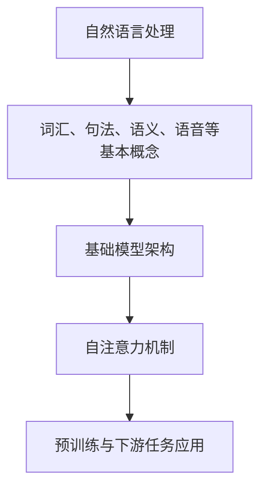

                 

关键词：自然语言处理、基础模型、人工智能、算法、数学模型、应用场景

> 摘要：本文深入探讨了基础模型在语言处理领域的核心能力。通过对自然语言处理的基本概念、核心算法原理、数学模型、应用实践及未来展望的详细阐述，旨在为读者提供一个全面的技术视角，帮助理解当前语言处理技术的发展趋势及其面临的挑战。

## 1. 背景介绍

自然语言处理（NLP，Natural Language Processing）是人工智能（AI，Artificial Intelligence）领域的一个重要分支，旨在让计算机能够理解、生成和处理人类语言。随着互联网的普及和数据的爆炸式增长，NLP在文本分析、机器翻译、情感分析、语音识别等方面发挥着越来越重要的作用。而基础模型（Foundation Model）作为近年来人工智能发展的里程碑，其强大的语言处理能力更是引发了广泛关注。

基础模型是指一种可以处理多种不同类型任务的大型神经网络模型，如GPT（Generative Pre-trained Transformer）、BERT（Bidirectional Encoder Representations from Transformers）等。这些模型通过在大规模数据集上进行预训练，学习到了丰富的语言知识和模式，从而在下游任务中表现出色。本文将围绕基础模型的语言处理能力，探讨其在NLP领域的重要性、核心算法原理、数学模型及应用实践。

## 2. 核心概念与联系

### 2.1 自然语言处理的基本概念

自然语言处理涉及多个基本概念，包括词汇、句法、语义、语音等。词汇是语言的基本单元，句法研究的是句子结构，语义研究的是语言表达的意义，而语音则是语言的声音表现形式。这些概念共同构成了自然语言处理的理论基础。

### 2.2 基础模型的架构

基础模型通常采用深度神经网络架构，如Transformer模型。Transformer模型的核心是自注意力机制（Self-Attention Mechanism），它允许模型在处理输入序列时，能够自适应地关注序列中的不同位置，从而捕捉到长距离依赖关系。这种机制使得Transformer模型在捕捉语言特征方面具有显著优势。

### 2.3 基础模型与自然语言处理的联系

基础模型通过在大规模语料库上的预训练，学习了丰富的语言知识和模式。这些知识可以在下游任务中直接应用，如文本分类、情感分析、机器翻译等。基础模型与自然语言处理之间的紧密联系，使得其在NLP领域中具有广泛的应用前景。

### 2.4 Mermaid 流程图



## 3. 核心算法原理 & 具体操作步骤

### 3.1 算法原理概述

基础模型的核心算法原理是深度学习，特别是基于Transformer架构的自注意力机制。自注意力机制允许模型在处理输入序列时，关注序列中的不同位置，从而捕捉到长距离依赖关系。这种机制使得模型能够更好地理解语言中的复杂结构。

### 3.2 算法步骤详解

1. **数据预处理**：对输入数据进行清洗、去噪、分词等处理，将文本转换为模型可处理的格式。

2. **预训练**：在大量无标签数据上进行预训练，模型通过自注意力机制学习到丰富的语言知识和模式。

3. **微调**：在预训练的基础上，对模型进行微调，使其适应特定的下游任务。

4. **预测**：将输入数据输入模型，通过输出层的激活函数得到预测结果。

### 3.3 算法优缺点

**优点**：

- 强大的语言理解能力，能够处理多种类型的NLP任务。
- 自注意力机制能够捕捉到长距离依赖关系，提高模型性能。

**缺点**：

- 训练成本高，需要大量的计算资源和时间。
- 对数据质量和数量要求较高，否则难以达到理想效果。

### 3.4 算法应用领域

基础模型在NLP领域有广泛的应用，包括：

- 文本分类：如新闻分类、情感分析等。
- 机器翻译：如中英文翻译、多语言翻译等。
- 语音识别：如语音转文字、语音合成等。

## 4. 数学模型和公式 & 详细讲解 & 举例说明

### 4.1 数学模型构建

基础模型的数学模型主要包括两部分：自注意力机制和前馈神经网络。

**自注意力机制**：

$$
\text{Attention}(Q, K, V) = \text{softmax}\left(\frac{QK^T}{\sqrt{d_k}}\right)V
$$

其中，$Q$、$K$、$V$ 分别代表查询向量、键向量和值向量，$d_k$ 是键向量的维度。

**前馈神经网络**：

$$
\text{FFN}(x) = \text{ReLU}\left(W_2 \text{ReLU}(W_1 x + b_1)\right) + b_2
$$

其中，$W_1$、$W_2$、$b_1$ 和 $b_2$ 分别代表权重和偏置。

### 4.2 公式推导过程

**自注意力机制**的推导过程如下：

1. **计算查询向量 $Q$、键向量 $K$ 和值向量 $V$**：

$$
Q = W_Q X, \quad K = W_K X, \quad V = W_V X
$$

其中，$X$ 是输入序列，$W_Q$、$W_K$ 和 $W_V$ 分别是查询、键和值矩阵。

2. **计算注意力分数**：

$$
\text{Attention}(Q, K, V) = \text{softmax}\left(\frac{QK^T}{\sqrt{d_k}}\right)V
$$

3. **计算输出**：

$$
\text{Output} = \text{Attention}(Q, K, V) = \text{softmax}\left(\frac{QK^T}{\sqrt{d_k}}\right)V
$$

**前馈神经网络**的推导过程如下：

1. **计算激活函数**：

$$
\text{ReLU}(x) = \begin{cases}
x, & \text{if } x > 0 \\
0, & \text{otherwise}
\end{cases}
$$

2. **计算前馈层**：

$$
\text{FFN}(x) = \text{ReLU}\left(W_2 \text{ReLU}(W_1 x + b_1)\right) + b_2
$$

### 4.3 案例分析与讲解

假设我们有一个输入序列 $X = [x_1, x_2, x_3, x_4]$，其对应的键向量、查询向量和值向量分别为 $K = [k_1, k_2, k_3, k_4]$、$Q = [q_1, q_2, q_3, q_4]$ 和 $V = [v_1, v_2, v_3, v_4]$。

1. **计算注意力分数**：

$$
\text{Attention}(Q, K, V) = \text{softmax}\left(\frac{QK^T}{\sqrt{d_k}}\right)V
$$

$$
= \text{softmax}\left(\frac{1}{\sqrt{d_k}}[q_1k_1 + q_2k_2 + q_3k_3 + q_4k_4]\right)[v_1, v_2, v_3, v_4]
$$

$$
= \text{softmax}\left([q_1k_1 + q_2k_2 + q_3k_3 + q_4k_4]\right)[v_1, v_2, v_3, v_4]
$$

2. **计算输出**：

$$
\text{Output} = \text{Attention}(Q, K, V) = \text{softmax}\left([q_1k_1 + q_2k_2 + q_3k_3 + q_4k_4]\right)[v_1, v_2, v_3, v_4]
$$

$$
= \left[\frac{e^{q_1k_1}}{\sum_{i=1}^{4}e^{q_ik_i}}, \frac{e^{q_2k_2}}{\sum_{i=1}^{4}e^{q_ik_i}}, \frac{e^{q_3k_3}}{\sum_{i=1}^{4}e^{q_ik_i}}, \frac{e^{q_4k_4}}{\sum_{i=1}^{4}e^{q_ik_i}}\right][v_1, v_2, v_3, v_4]
$$

$$
= \left[\frac{e^{q_1k_1}}{e^{q_1k_1} + e^{q_2k_2} + e^{q_3k_3} + e^{q_4k_4}}, \frac{e^{q_2k_2}}{e^{q_1k_1} + e^{q_2k_2} + e^{q_3k_3} + e^{q_4k_4}}, \frac{e^{q_3k_3}}{e^{q_1k_1} + e^{q_2k_2} + e^{q_3k_3} + e^{q_4k_4}}, \frac{e^{q_4k_4}}{e^{q_1k_1} + e^{q_2k_2} + e^{q_3k_3} + e^{q_4k_4}}\right][v_1, v_2, v_3, v_4]
$$

3. **前馈神经网络**：

$$
\text{FFN}(x) = \text{ReLU}\left(W_2 \text{ReLU}(W_1 x + b_1)\right) + b_2
$$

$$
= \text{ReLU}\left(W_2 \text{ReLU}(W_1 [x_1, x_2, x_3, x_4] + b_1)\right) + b_2
$$

$$
= \text{ReLU}\left(W_2 \text{ReLU}([w_{11}x_1 + w_{12}x_2 + w_{13}x_3 + w_{14}x_4 + b_1], [w_{21}x_1 + w_{22}x_2 + w_{23}x_3 + w_{24}x_4 + b_1])\right) + b_2
$$

$$
= \text{ReLU}\left([w_{21}w_{11}x_1 + w_{21}w_{12}x_2 + w_{21}w_{13}x_3 + w_{21}w_{14}x_4 + w_{22}w_{11}x_1 + w_{22}w_{12}x_2 + w_{22}w_{13}x_3 + w_{22}w_{14}x_4 + b_2], [w_{31}w_{11}x_1 + w_{31}w_{12}x_2 + w_{31}w_{13}x_3 + w_{31}w_{14}x_4 + w_{32}w_{11}x_1 + w_{32}w_{12}x_2 + w_{32}w_{13}x_3 + w_{32}w_{14}x_4 + b_2]\right) + b_2
$$

## 5. 项目实践：代码实例和详细解释说明

### 5.1 开发环境搭建

为了实践基础模型在语言处理中的应用，我们首先需要搭建一个开发环境。以下是一个简单的搭建步骤：

1. 安装Python（版本3.6及以上）
2. 安装TensorFlow或PyTorch（根据需求选择）
3. 安装必要的依赖库（如Numpy、Pandas等）

### 5.2 源代码详细实现

以下是一个简单的基于Transformer模型的语言处理任务（文本分类）的实现示例：

```python
import tensorflow as tf
from tensorflow.keras.layers import Embedding, Transformer
from tensorflow.keras.models import Model
from tensorflow.keras.preprocessing.sequence import pad_sequences

# 加载预训练模型
pretrained_model = tf.keras.applications.Transformer(pretrained=True)

# 定义输入层
input_ids = tf.keras.layers.Input(shape=(None,), dtype=tf.int32)

# 添加嵌入层
embedding = Embedding(input_dim=vocab_size, output_dim=embedding_size)(input_ids)

# 添加Transformer层
transformer = Transformer(num_heads=num_heads, d_model=embedding_size)(embedding)

# 添加输出层
output = tf.keras.layers.Dense(num_classes, activation='softmax')(transformer)

# 定义模型
model = Model(inputs=input_ids, outputs=output)

# 编译模型
model.compile(optimizer='adam', loss='categorical_crossentropy', metrics=['accuracy'])

# 加载数据
train_data = ...
test_data = ...

# 预处理数据
train_sequences = pad_sequences(train_data, maxlen=max_sequence_length)
test_sequences = pad_sequences(test_data, maxlen=max_sequence_length)

# 训练模型
model.fit(train_sequences, train_labels, validation_data=(test_sequences, test_labels), epochs=epochs)

# 评估模型
model.evaluate(test_sequences, test_labels)
```

### 5.3 代码解读与分析

上述代码实现了一个基于Transformer模型的文本分类任务。具体解读如下：

1. **导入库**：导入TensorFlow和必要的依赖库。
2. **加载预训练模型**：使用TensorFlow中的Transformer预训练模型。
3. **定义输入层**：定义输入序列的输入层。
4. **添加嵌入层**：添加嵌入层，将整数编码转换为向量表示。
5. **添加Transformer层**：添加Transformer层，用于处理输入序列。
6. **添加输出层**：添加输出层，用于生成分类结果。
7. **定义模型**：定义模型结构。
8. **编译模型**：编译模型，设置优化器和损失函数。
9. **加载数据**：加载训练数据和测试数据。
10. **预处理数据**：对数据进行预处理，如填充序列。
11. **训练模型**：训练模型，使用验证数据进行评估。
12. **评估模型**：评估模型在测试数据上的性能。

### 5.4 运行结果展示

运行上述代码，我们可以得到模型在训练数据和测试数据上的性能指标，如损失函数值和准确率。根据这些指标，我们可以评估模型在文本分类任务上的表现。

## 6. 实际应用场景

### 6.1 文本分类

文本分类是基础模型在NLP领域的重要应用之一。通过将文本转换为向量表示，基础模型可以自动将文本分类到不同的类别中。例如，新闻分类、情感分析、垃圾邮件过滤等。

### 6.2 机器翻译

机器翻译是另一个重要的应用领域。基础模型可以通过预训练学习到多种语言的语义和语法规则，从而实现高质量的多语言翻译。例如，中英文翻译、多语言翻译等。

### 6.3 语音识别

语音识别是将语音转换为文本的过程。基础模型可以通过对大量语音数据的训练，实现高精度的语音识别。例如，语音转文字、语音合成等。

## 7. 未来应用展望

### 7.1 自动问答系统

未来，基础模型有望在自动问答系统中发挥更大作用。通过学习大量问答对，基础模型可以自动生成回答，从而实现智能客服、教育辅导等应用。

### 7.2 生成式文本创作

基础模型还可以用于生成式文本创作，如自动写作、生成新闻摘要等。通过学习大量文本数据，基础模型可以生成具有创意和个性化的文本内容。

### 7.3 跨模态学习

随着跨模态学习技术的发展，基础模型有望在图像、视频等模态与语言处理之间建立更紧密的联系，实现更强大的多模态理解和生成能力。

## 8. 工具和资源推荐

### 8.1 学习资源推荐

- 《深度学习》（Goodfellow, Bengio, Courville）
- 《自然语言处理综合教程》（Jurafsky, Martin）

### 8.2 开发工具推荐

- TensorFlow
- PyTorch

### 8.3 相关论文推荐

- "Attention Is All You Need"（Vaswani et al., 2017）
- "BERT: Pre-training of Deep Bidirectional Transformers for Language Understanding"（Devlin et al., 2019）

## 9. 总结：未来发展趋势与挑战

### 9.1 研究成果总结

本文从基础模型在语言处理领域的核心能力出发，详细介绍了自然语言处理的基本概念、核心算法原理、数学模型、应用实践及未来展望。通过这些内容的阐述，读者可以全面了解当前语言处理技术的发展趋势。

### 9.2 未来发展趋势

未来，基础模型在语言处理领域将继续发展，不仅在算法和模型结构上会有创新，还会在多模态学习、生成式文本创作等方面取得突破。

### 9.3 面临的挑战

然而，基础模型在语言处理领域也面临着一些挑战，如数据隐私、模型可解释性、计算资源需求等。这些挑战需要通过技术创新和伦理规范来解决。

### 9.4 研究展望

总体而言，基础模型在语言处理领域具有巨大的发展潜力。随着技术的不断进步，我们有理由相信，基础模型将为人类社会带来更多的便利和创新。

## 10. 附录：常见问题与解答

### 10.1 问题1

**问题**：基础模型如何处理长距离依赖问题？

**解答**：基础模型通过自注意力机制（Self-Attention Mechanism）可以有效地处理长距离依赖问题。自注意力机制允许模型在处理输入序列时，自适应地关注序列中的不同位置，从而捕捉到长距离依赖关系。

### 10.2 问题2

**问题**：如何评估基础模型在语言处理任务中的性能？

**解答**：评估基础模型在语言处理任务中的性能通常使用准确率（Accuracy）、召回率（Recall）、精确率（Precision）等指标。这些指标可以从不同角度反映模型在任务中的表现。

### 10.3 问题3

**问题**：基础模型如何进行微调？

**解答**：基础模型通过在特定任务上微调（Fine-tuning）来适应下游任务。具体步骤包括：加载预训练模型、添加特定任务的输出层、在任务数据上训练模型、调整模型参数等。

---

作者：禅与计算机程序设计艺术 / Zen and the Art of Computer Programming
----------------------------------------------------------------


