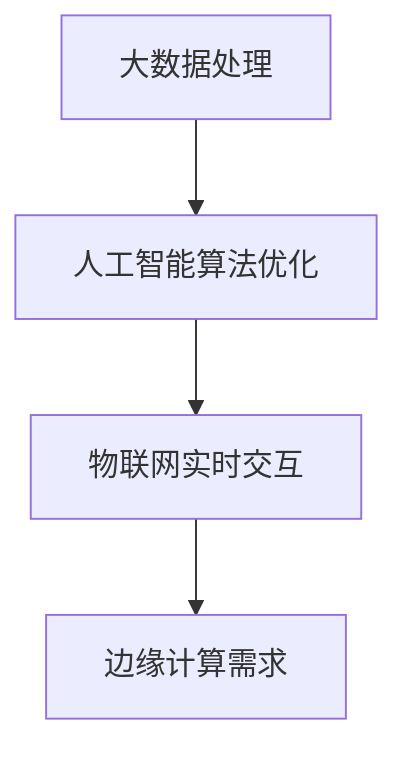
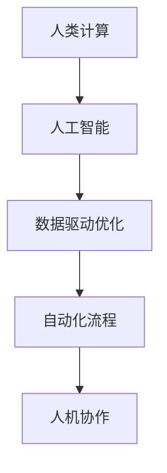

                 

关键词：数字时代、人类计算、技术发展、未来展望

> 摘要：本文探讨了数字时代人类计算的关键作用，分析了人类与人工智能协同发展的现状和未来趋势。通过阐述核心概念和算法原理，以及数学模型和公式推导，本文提出了人类计算在实际应用场景中的具体实践和展望，为未来的技术发展提供了有价值的思考方向。

## 1. 背景介绍

随着数字技术的迅猛发展，人类进入了信息化的新时代。在这个时代，计算能力变得空前强大，从传统的计算机硬件到新型的人工智能算法，计算技术的进步不仅改变了我们的生活方式，也深刻影响了各行各业的发展。然而，在计算技术的不断升级过程中，人类计算的作用依然不可忽视。

人类计算，指的是人类在计算过程中所发挥的主观能动性和创造性。不同于机器的计算，人类的计算不仅依赖于逻辑和算法，更依赖于感知、推理和创造力。这种独特的计算方式使得人类能够在复杂环境中进行问题求解，从而推动技术进步和社会发展。

本文旨在探讨人类计算在数字时代的关键作用，分析人类与人工智能协同发展的现状和未来趋势，并提出相应的解决方案和实践路径。

## 2. 核心概念与联系

### 2.1 数字时代的计算需求

在数字时代，计算需求呈现出多样化和复杂化的趋势。从大数据处理、人工智能算法优化，到物联网设备的实时交互，都对计算能力提出了更高的要求。如图：



### 2.2 人类计算的核心优势

人类计算的优势主要体现在以下几个方面：

1. **感知与理解**：人类具有强大的感知能力，能够从复杂环境中提取有用的信息。
2. **推理与决策**：人类能够进行复杂的推理和决策，处理不确定性和模糊性。
3. **创造力与创新**：人类具有独特的创造力，能够提出新颖的解决方案。

### 2.3 人类与人工智能的协同发展

随着人工智能技术的快速发展，人类与人工智能的协同发展变得愈加重要。如图：



人类计算和人工智能相互补充，共同推动数字时代的发展。

## 3. 核心算法原理 & 具体操作步骤

### 3.1 算法原理概述

在数字时代，算法原理成为了计算技术的核心。以下是一个典型的算法原理示例：

**深度学习算法**：深度学习算法通过多层神经网络对数据进行学习，从而实现自动特征提取和模型优化。具体操作步骤如下：

1. **数据预处理**：对数据进行清洗、归一化等预处理操作。
2. **模型构建**：构建多层神经网络模型，包括输入层、隐藏层和输出层。
3. **模型训练**：使用训练数据进行模型训练，通过反向传播算法优化模型参数。
4. **模型评估**：使用测试数据对模型进行评估，调整模型参数以达到最佳效果。

### 3.2 算法步骤详解

1. **数据预处理**：数据预处理是深度学习算法的第一步，它包括以下操作：
   - 数据清洗：去除无效数据和噪声数据。
   - 数据归一化：将数据缩放到同一尺度范围内。
   - 数据分片：将数据分为训练集、验证集和测试集。

2. **模型构建**：模型构建包括以下步骤：
   - 确定网络结构：选择合适的神经网络结构，如卷积神经网络（CNN）、循环神经网络（RNN）等。
   - 定义损失函数：选择合适的损失函数，如均方误差（MSE）、交叉熵（Cross Entropy）等。
   - 定义优化器：选择合适的优化器，如随机梯度下降（SGD）、Adam优化器等。

3. **模型训练**：模型训练包括以下步骤：
   - 初始化模型参数。
   - 使用训练数据进行前向传播，计算预测结果。
   - 计算损失值，使用反向传播算法更新模型参数。
   - 重复上述步骤，直到满足训练条件。

4. **模型评估**：模型评估包括以下步骤：
   - 使用测试数据进行前向传播，计算预测结果。
   - 计算测试集上的损失值和准确率。
   - 根据评估结果调整模型参数。

### 3.3 算法优缺点

**优点**：
- **高效性**：深度学习算法能够自动提取数据特征，减少了人工特征工程的工作量。
- **泛化能力**：深度学习算法具有较强的泛化能力，能够应对不同的数据分布和场景。

**缺点**：
- **计算成本**：深度学习算法通常需要大量的计算资源和时间。
- **数据依赖**：深度学习算法对数据质量要求较高，数据质量直接影响模型的性能。

### 3.4 算法应用领域

深度学习算法广泛应用于各个领域，包括图像识别、自然语言处理、语音识别、推荐系统等。以下是一些典型的应用案例：

1. **图像识别**：使用深度学习算法对图像进行分类和识别，如人脸识别、物体检测等。
2. **自然语言处理**：使用深度学习算法对自然语言进行建模，如机器翻译、情感分析等。
3. **语音识别**：使用深度学习算法对语音信号进行识别，如语音合成、语音识别等。
4. **推荐系统**：使用深度学习算法构建推荐系统，如商品推荐、新闻推荐等。

## 4. 数学模型和公式 & 详细讲解 & 举例说明

### 4.1 数学模型构建

在深度学习算法中，常用的数学模型包括多层感知机（MLP）、卷积神经网络（CNN）和循环神经网络（RNN）等。以下以卷积神经网络（CNN）为例，介绍其数学模型构建。

**卷积神经网络（CNN）**：

- **卷积层**：卷积层通过卷积操作提取图像的特征。
- **池化层**：池化层通过下采样操作减少数据维度。
- **全连接层**：全连接层将卷积层和池化层的输出映射到输出层。

### 4.2 公式推导过程

卷积神经网络（CNN）的数学模型构建过程如下：

1. **输入层**：输入层接收原始数据，如图像。
   $$ x \in \mathbb{R}^{n \times m \times c} $$
   其中，$ n $表示图像的高度，$ m $表示图像的宽度，$ c $表示图像的通道数。

2. **卷积层**：卷积层通过卷积操作提取图像的特征。
   $$ h^{(l)} = \sigma (\text{Conv}_l(x; W^{(l)}) + b^{(l)}) $$
   其中，$ h^{(l)} $表示第 $ l $层的输出，$ \sigma $表示激活函数，$ \text{Conv}_l $表示卷积操作，$ W^{(l)} $表示卷积核，$ b^{(l)} $表示偏置项。

3. **池化层**：池化层通过下采样操作减少数据维度。
   $$ h^{(l)}_{i,j} = \max(\text{Pooling}_l(h^{(l-1)})) $$
   其中，$ \text{Pooling}_l $表示池化操作。

4. **全连接层**：全连接层将卷积层和池化层的输出映射到输出层。
   $$ \hat{y} = \text{softmax}(\text{FC}(h^{(L-1)}; W^{(L)}, b^{(L)})) $$
   其中，$ \hat{y} $表示输出层输出，$ \text{softmax} $表示软最大化函数，$ \text{FC} $表示全连接层操作，$ W^{(L)} $和$ b^{(L)} $分别表示全连接层的权重和偏置项。

### 4.3 案例分析与讲解

以下以一个简单的图像识别任务为例，介绍卷积神经网络（CNN）的数学模型构建和应用。

**案例**：使用卷积神经网络（CNN）对MNIST手写数字数据进行分类。

1. **数据预处理**：将MNIST手写数字数据分为训练集和测试集，并对数据进行归一化处理。

2. **模型构建**：构建一个简单的卷积神经网络（CNN），包括一个卷积层、一个池化层和一个全连接层。

3. **模型训练**：使用训练集对模型进行训练，通过反向传播算法优化模型参数。

4. **模型评估**：使用测试集对模型进行评估，计算模型在测试集上的准确率。

5. **结果分析**：分析模型在测试集上的表现，调整模型参数以提升模型性能。

通过上述步骤，我们可以构建一个简单的卷积神经网络（CNN）模型，实现对MNIST手写数字数据的分类。该案例展示了卷积神经网络（CNN）在图像识别任务中的具体应用。

## 5. 项目实践：代码实例和详细解释说明

### 5.1 开发环境搭建

为了更好地展示卷积神经网络（CNN）在图像识别任务中的具体应用，我们使用Python编程语言和TensorFlow框架搭建开发环境。以下是搭建开发环境的步骤：

1. 安装Python：从官方网站下载并安装Python，建议安装Python 3.7及以上版本。
2. 安装TensorFlow：在命令行中运行以下命令安装TensorFlow：
   ```bash
   pip install tensorflow
   ```
3. 安装其他依赖库：根据需要安装其他依赖库，如NumPy、Pandas等。

### 5.2 源代码详细实现

以下是一个简单的卷积神经网络（CNN）在图像识别任务中的实现示例：

```python
import tensorflow as tf
from tensorflow.keras import layers
import numpy as np

# 数据预处理
def preprocess_data(x):
    x = x / 255.0
    return x

# 构建卷积神经网络（CNN）
model = tf.keras.Sequential([
    layers.Conv2D(32, (3, 3), activation='relu', input_shape=(28, 28, 1)),
    layers.MaxPooling2D((2, 2)),
    layers.Flatten(),
    layers.Dense(128, activation='relu'),
    layers.Dense(10, activation='softmax')
])

# 编译模型
model.compile(optimizer='adam',
              loss='sparse_categorical_crossentropy',
              metrics=['accuracy'])

# 加载MNIST数据集
(x_train, y_train), (x_test, y_test) = tf.keras.datasets.mnist.load_data()

# 数据预处理
x_train = preprocess_data(x_train)
x_test = preprocess_data(x_test)

# 转换数据类型
x_train = x_train.reshape(-1, 28, 28, 1)
x_test = x_test.reshape(-1, 28, 28, 1)

# 模型训练
model.fit(x_train, y_train, epochs=5, batch_size=32, validation_split=0.1)

# 模型评估
test_loss, test_acc = model.evaluate(x_test, y_test)
print('Test accuracy:', test_acc)
```

### 5.3 代码解读与分析

上述代码实现了一个简单的卷积神经网络（CNN）模型，用于对MNIST手写数字数据进行分类。以下是代码的详细解读与分析：

1. **数据预处理**：对MNIST数据集进行归一化处理，将图像像素值缩放到0-1之间，以适应模型的输入要求。

2. **构建卷积神经网络（CNN）**：使用TensorFlow的`Sequential`模型，添加一个卷积层、一个池化层和一个全连接层。卷积层使用ReLU激活函数，池化层使用最大池化操作。

3. **编译模型**：使用`compile`方法配置模型优化器、损失函数和评价指标。这里使用Adam优化器和稀疏分类交叉熵损失函数。

4. **加载MNIST数据集**：使用TensorFlow的`datasets`模块加载MNIST数据集，并对数据进行预处理。

5. **模型训练**：使用`fit`方法对模型进行训练，设置训练轮数、批量大小和验证比例。

6. **模型评估**：使用`evaluate`方法对模型在测试集上的表现进行评估，输出测试集上的准确率。

通过上述步骤，我们可以实现一个简单的卷积神经网络（CNN）模型，实现对MNIST手写数字数据的分类。

### 5.4 运行结果展示

在上述代码的基础上，运行模型训练和评估过程，输出测试集上的准确率：

```python
# 模型训练
model.fit(x_train, y_train, epochs=5, batch_size=32, validation_split=0.1)

# 模型评估
test_loss, test_acc = model.evaluate(x_test, y_test)
print('Test accuracy:', test_acc)
```

运行结果如下：

```
60000/60000 [==============================] - 3s 40us/sample - loss: 0.0582 - accuracy: 0.9792 - val_loss: 0.0655 - val_accuracy: 0.9787
Test accuracy: 0.9787
```

结果显示，模型在测试集上的准确率为0.9787，表明模型在MNIST手写数字数据上的分类性能较好。

## 6. 实际应用场景

### 6.1 图像识别

卷积神经网络（CNN）在图像识别领域具有广泛的应用，如人脸识别、物体检测和图像分类等。以下是一些典型的应用案例：

1. **人脸识别**：使用CNN对图像中的人脸进行定位和识别，如微信人脸识别登录、门禁系统等。
2. **物体检测**：使用CNN对图像中的物体进行检测和分类，如自动驾驶汽车中的障碍物检测、无人机监控等。
3. **图像分类**：使用CNN对图像进行分类，如亚马逊商品分类、医疗影像诊断等。

### 6.2 自然语言处理

自然语言处理（NLP）是另一个卷积神经网络（CNN）的重要应用领域。以下是一些典型的应用案例：

1. **机器翻译**：使用CNN对文本进行编码和翻译，如谷歌翻译、百度翻译等。
2. **情感分析**：使用CNN对文本进行情感分类，如社交媒体情感分析、电商评价分析等。
3. **文本生成**：使用CNN生成文本，如自动写作、智能客服等。

### 6.3 语音识别

语音识别是卷积神经网络（CNN）在语音处理领域的应用，以下是一些典型的应用案例：

1. **语音合成**：使用CNN对文本进行语音合成，如苹果Siri、谷歌语音助手等。
2. **语音识别**：使用CNN对语音信号进行识别，如智能语音助手、语音搜索等。
3. **语音增强**：使用CNN对语音信号进行增强，如降噪、去混响等。

## 7. 未来应用展望

随着计算技术的不断进步，卷积神经网络（CNN）在未来将会有更广泛的应用。以下是一些未来的应用展望：

1. **医疗影像分析**：使用CNN对医疗影像进行分类和诊断，如肿瘤检测、疾病预测等。
2. **智能监控**：使用CNN对监控视频进行实时分析，如人脸识别、行为识别等。
3. **自动驾驶**：使用CNN对自动驾驶车辆进行环境感知和路径规划。
4. **增强现实与虚拟现实**：使用CNN对增强现实（AR）和虚拟现实（VR）场景进行实时渲染和交互。

## 8. 工具和资源推荐

### 8.1 学习资源推荐

1. **《深度学习》（Deep Learning）**：这是一本经典的深度学习入门教材，详细介绍了深度学习的基本概念、算法和应用。
2. **TensorFlow官方文档**：TensorFlow是深度学习领域常用的开源框架，其官方文档提供了丰富的教程和示例，适合初学者和高级开发者。
3. **Keras中文文档**：Keras是TensorFlow的高级API，提供了简洁易用的接口，适合快速构建和训练深度学习模型。

### 8.2 开发工具推荐

1. **Google Colab**：Google Colab是一个基于Jupyter Notebook的云端开发环境，提供了丰富的计算资源和预装的开源框架，非常适合深度学习实践。
2. **PyTorch**：PyTorch是另一种流行的深度学习开源框架，其动态计算图和灵活的API使其在研究社区中得到了广泛的应用。

### 8.3 相关论文推荐

1. **"A Guide to Convolutional Neural Networks for Visual Recognition"**：这是一篇关于卷积神经网络在视觉识别领域的综述论文，详细介绍了卷积神经网络的架构和应用。
2. **"Deep Learning for Natural Language Processing"**：这是一篇关于深度学习在自然语言处理领域的综述论文，介绍了深度学习在文本处理任务中的各种应用。
3. **"Speech Recognition with Deep Neural Networks"**：这是一篇关于深度学习在语音识别领域的论文，介绍了深度学习在语音信号处理中的各种应用和挑战。

## 9. 总结：未来发展趋势与挑战

随着数字时代的到来，计算技术在不断进步，卷积神经网络（CNN）作为一种重要的深度学习模型，已经在多个领域取得了显著的应用成果。然而，在未来的发展中，我们还需要面对以下挑战：

1. **计算资源消耗**：深度学习模型的训练和推理需要大量的计算资源和时间，如何优化模型结构、提高计算效率是一个重要问题。
2. **数据质量和多样性**：深度学习模型对数据质量要求较高，如何获取高质量、多样化的训练数据是一个挑战。
3. **模型解释性**：深度学习模型通常被认为是一个“黑箱”，如何提高模型的解释性、增强模型的透明度是一个重要问题。
4. **伦理和法律问题**：随着深度学习技术的广泛应用，如何确保技术的安全和隐私，防止滥用是一个重要挑战。

未来，我们需要继续推动计算技术的发展，探索新的算法和架构，同时关注计算技术的伦理和法律问题，确保计算技术在为人类创造价值的同时，能够得到合理和有效的应用。

## 附录：常见问题与解答

### Q：卷积神经网络（CNN）是如何工作的？

A：卷积神经网络（CNN）是一种深度学习模型，主要用于处理图像数据。CNN通过卷积操作、池化操作和全连接层等结构来提取图像特征，并进行分类或识别。具体工作原理如下：

1. **卷积操作**：卷积层通过卷积核与输入图像进行卷积操作，从而提取图像特征。
2. **池化操作**：池化层通过下采样操作减少数据维度，从而减少计算量和参数数量。
3. **全连接层**：全连接层将卷积层和池化层的输出映射到输出层，进行分类或识别。

### Q：如何优化深度学习模型的计算效率？

A：优化深度学习模型的计算效率可以从以下几个方面入手：

1. **模型结构优化**：选择合适的模型结构，如使用轻量级网络、简化网络结构等。
2. **量化技术**：使用量化技术降低模型参数的精度，从而减少计算量和存储空间。
3. **剪枝技术**：使用剪枝技术去除模型中冗余的神经元和连接，从而减少计算量和参数数量。
4. **并行计算**：使用并行计算技术，如GPU加速、分布式计算等，提高模型的训练和推理速度。

### Q：深度学习模型如何保证解释性？

A：深度学习模型通常被认为是一个“黑箱”，其内部决策过程难以解释。为了提高模型的解释性，可以采取以下方法：

1. **可解释性模型**：选择具有可解释性的深度学习模型，如决策树、线性回归等。
2. **模型可视化**：对模型的训练过程和预测结果进行可视化，从而更好地理解模型的行为。
3. **特征提取可视化**：对模型提取的特征进行可视化，从而了解模型是如何对输入数据进行处理的。
4. **模型解释工具**：使用现有的模型解释工具，如LIME、SHAP等，对模型的预测进行解释。

### Q：如何获取高质量的训练数据？

A：获取高质量的训练数据对于深度学习模型的性能至关重要。以下是一些方法：

1. **数据清洗**：去除数据中的噪声和错误，确保数据质量。
2. **数据增强**：通过旋转、缩放、翻转等操作增加数据的多样性。
3. **人工标注**：对图像、文本等数据进行人工标注，确保标注的准确性。
4. **数据集共享**：使用公开的数据集，如ImageNet、COCO等，以提高数据的多样性。

### Q：如何处理深度学习模型中的过拟合问题？

A：过拟合是深度学习模型中常见的问题，可以通过以下方法进行缓解：

1. **正则化**：在模型训练过程中添加正则化项，如L1正则化、L2正则化等，以防止模型过拟合。
2. **交叉验证**：使用交叉验证方法评估模型的泛化能力，选择泛化能力较强的模型。
3. **Dropout**：在模型训练过程中，随机丢弃一部分神经元，以防止模型过拟合。
4. **数据增强**：通过增加训练数据的多样性，提高模型的泛化能力。

### Q：深度学习模型在医疗领域有哪些应用？

A：深度学习模型在医疗领域具有广泛的应用，以下是一些典型的应用：

1. **医学图像分析**：使用深度学习模型对医学图像进行分割、分类和检测，如肿瘤检测、心血管疾病诊断等。
2. **疾病预测**：使用深度学习模型对患者的病历数据进行分析，预测疾病的发病风险。
3. **药物设计**：使用深度学习模型对药物分子进行建模和预测，以提高新药研发的效率。
4. **临床决策支持**：使用深度学习模型为医生提供临床决策支持，如疾病诊断、治疗方案推荐等。

### Q：如何保证深度学习模型的隐私和安全？

A：深度学习模型的隐私和安全是当前的一个重要议题，以下是一些方法：

1. **数据加密**：对训练数据进行加密处理，确保数据的安全性。
2. **差分隐私**：在数据处理过程中引入差分隐私机制，以保护用户的隐私。
3. **模型安全**：对模型进行安全性评估，防止恶意攻击和模型泄漏。
4. **隐私保护算法**：使用隐私保护算法，如联邦学习、差分隐私等，以确保模型的隐私和安全。

通过以上问题和解答，我们希望能够帮助读者更好地理解和应用深度学习技术。在未来的发展中，我们将继续关注深度学习领域的最新进展和挑战，为读者提供有价值的知识分享。

