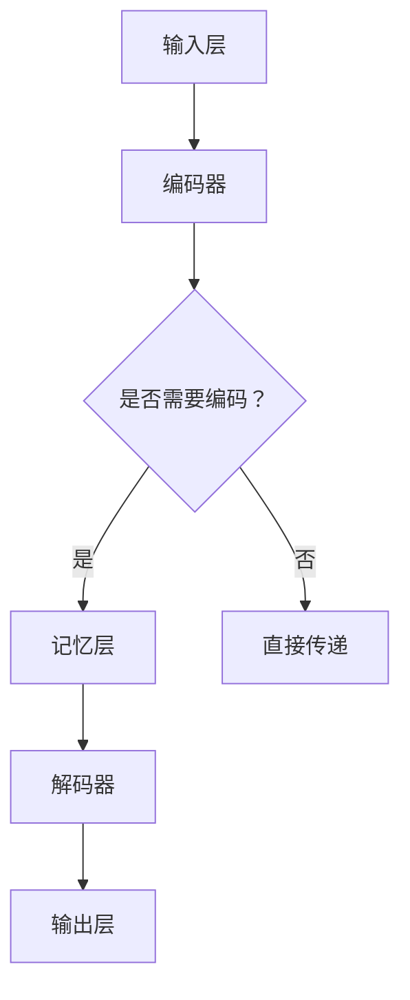
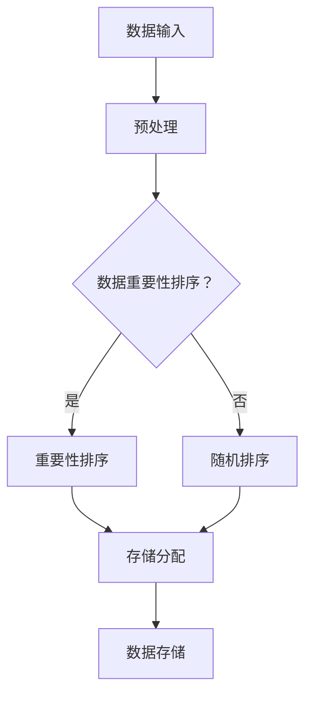
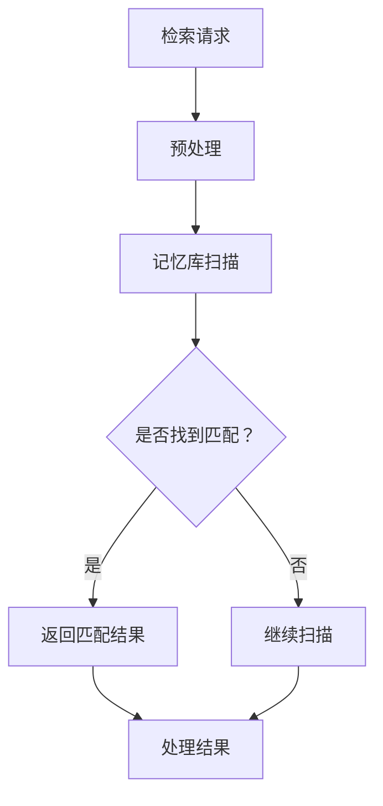
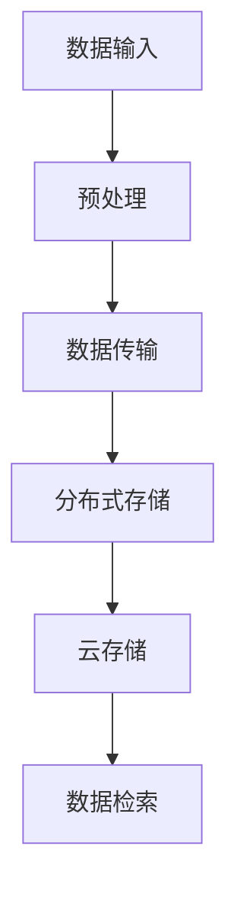

                 

关键词：AI记忆增强、记忆神经网络、记忆优化算法、记忆存储效率、记忆检索机制、记忆容量扩展。

> 摘要：本文探讨了增强人工智能（AI）应用记忆能力的方法，分析了现有技术中的核心问题，并提出了一套系统化的解决方案。通过优化记忆神经网络架构、引入高效的记忆检索机制以及扩展记忆容量，文章旨在为AI应用提供更强大的记忆能力，从而提升其学习、推理和决策能力。

## 1. 背景介绍

随着深度学习技术的发展，人工智能（AI）在很多领域都取得了显著的成果。然而，AI系统在记忆能力方面仍然存在一些挑战。传统的AI模型依赖于短期记忆机制，这限制了它们处理复杂任务的能力。为了解决这一问题，研究人员提出了许多增强AI记忆能力的方法。

当前，AI记忆增强技术主要围绕以下几个方面展开：

1. **记忆神经网络**：通过设计特殊的神经网络架构，如长短时记忆网络（LSTM）和门控循环单元（GRU），以改善AI系统的记忆能力。
2. **记忆存储效率**：通过优化内存分配和存储策略，提高记忆资源的利用效率。
3. **记忆检索机制**：设计高效的记忆检索算法，使AI系统能够快速地找到所需的记忆信息。
4. **记忆容量扩展**：通过分布式存储和云技术，扩展AI系统的记忆容量。

本文将详细探讨这些方法，并分析其优缺点，以期为AI应用提供更强大的记忆能力。

## 2. 核心概念与联系

### 2.1. 记忆神经网络

记忆神经网络是一种用于增强AI记忆能力的特殊神经网络架构。以下是一个简单的Mermaid流程图，展示了记忆神经网络的基本结构：



### 2.2. 记忆存储效率

记忆存储效率涉及如何优化内存分配和存储策略。以下是一个Mermaid流程图，展示了记忆存储的基本策略：



### 2.3. 记忆检索机制

记忆检索机制是AI系统快速找到所需记忆信息的关键。以下是一个Mermaid流程图，展示了记忆检索的基本流程：



### 2.4. 记忆容量扩展

记忆容量扩展涉及到如何利用外部存储资源来扩展AI系统的记忆容量。以下是一个Mermaid流程图，展示了记忆容量扩展的基本策略：



## 3. 核心算法原理 & 具体操作步骤

### 3.1. 算法原理概述

增强AI记忆能力的核心算法主要分为以下几类：

1. **记忆神经网络**：通过特殊的神经网络架构，如LSTM和GRU，实现长短期记忆。
2. **记忆存储优化**：采用基于数据重要性的排序和存储策略，提高内存利用效率。
3. **记忆检索优化**：通过高效的记忆检索算法，实现快速的内存访问。
4. **记忆容量扩展**：利用分布式存储和云技术，扩展记忆容量。

### 3.2. 算法步骤详解

#### 3.2.1. 记忆神经网络

1. **编码阶段**：输入数据通过编码器转换为适合记忆的表示形式。
2. **记忆存储**：编码后的数据存储在记忆层中，记忆层采用基于时间的前向传播机制。
3. **检索阶段**：检索请求通过解码器解码，并从记忆层中检索相关信息。
4. **输出阶段**：检索结果通过解码器转换为输出。

#### 3.2.2. 记忆存储优化

1. **数据预处理**：对输入数据进行标准化处理，提高数据的一致性。
2. **重要性排序**：根据数据的重要性和访问频率对数据进行排序。
3. **存储分配**：根据数据排序结果，将数据存储在内存或外部存储中。
4. **数据存储**：采用高效的存储算法，如LRU（最近最少使用）算法，提高存储效率。

#### 3.2.3. 记忆检索优化

1. **预处理**：对检索请求进行预处理，提取关键特征。
2. **记忆库扫描**：在记忆库中扫描与检索请求相关的数据。
3. **匹配与排序**：根据检索请求与记忆库中的数据匹配度进行排序。
4. **返回结果**：返回最高匹配度的检索结果。

#### 3.2.4. 记忆容量扩展

1. **数据预处理**：对输入数据进行预处理，确保数据格式一致。
2. **数据传输**：将预处理后的数据传输到分布式存储或云存储中。
3. **存储管理**：采用分布式存储管理算法，如一致性哈希算法，确保数据的高效存储。
4. **数据检索**：通过分布式存储和云存储，实现对大规模数据的快速检索。

### 3.3. 算法优缺点

#### 优点

1. **记忆神经网络**：实现长短期记忆，提升AI系统的记忆能力。
2. **记忆存储优化**：提高内存利用效率，降低存储成本。
3. **记忆检索优化**：实现快速的内存访问，提升AI系统的响应速度。
4. **记忆容量扩展**：利用外部存储资源，扩展AI系统的记忆容量。

#### 缺点

1. **记忆神经网络**：计算复杂度高，训练时间较长。
2. **记忆存储优化**：对数据预处理和存储策略要求较高，实现难度较大。
3. **记忆检索优化**：检索算法设计复杂，需结合具体应用场景进行优化。
4. **记忆容量扩展**：分布式存储和云技术的维护成本较高。

### 3.4. 算法应用领域

增强AI记忆能力的方法可以应用于多个领域，如：

1. **自然语言处理**：用于处理复杂的文本数据，实现更准确的自然语言理解。
2. **图像识别**：用于处理大量的图像数据，实现更准确的图像分类和识别。
3. **推荐系统**：用于处理用户历史行为数据，提供更个性化的推荐服务。
4. **金融风控**：用于处理金融交易数据，实现更精准的风险识别和评估。

## 4. 数学模型和公式 & 详细讲解 & 举例说明

### 4.1. 数学模型构建

增强AI记忆能力的方法涉及到多个数学模型，以下是一个简单的数学模型构建示例：

1. **编码模型**：用于将输入数据编码为记忆表示。  
   $$f_{\text{encode}}(x) = \sigma(W_{\text{encode}}x + b_{\text{encode}})$$

2. **记忆模型**：用于存储记忆表示。  
   $$f_{\text{memory}}(h_t) = \tanh(W_{\text{memory}}h_t + b_{\text{memory}})$$

3. **检索模型**：用于检索记忆表示。  
   $$f_{\text{retrieve}}(h_t) = W_{\text{retrieve}}f_{\text{memory}}(h_t) + b_{\text{retrieve}}$$

4. **解码模型**：用于将检索到的记忆表示解码为输出数据。  
   $$f_{\text{decode}}(y) = \sigma(W_{\text{decode}}y + b_{\text{decode}})$$

### 4.2. 公式推导过程

以下是一个简单的公式推导过程示例：

1. **编码模型**：输入数据$x$经过编码器得到编码结果$e$。  
   $$e = f_{\text{encode}}(x) = \sigma(W_{\text{encode}}x + b_{\text{encode}})$$

2. **记忆模型**：编码结果$e$经过记忆层得到记忆表示$h_t$。  
   $$h_t = f_{\text{memory}}(e) = \tanh(W_{\text{memory}}e + b_{\text{memory}})$$

3. **检索模型**：记忆表示$h_t$经过检索层得到检索结果$r_t$。  
   $$r_t = f_{\text{retrieve}}(h_t) = W_{\text{retrieve}}h_t + b_{\text{retrieve}}$$

4. **解码模型**：检索结果$r_t$经过解码器得到解码结果$y$。  
   $$y = f_{\text{decode}}(r_t) = \sigma(W_{\text{decode}}r_t + b_{\text{decode}})$$

### 4.3. 案例分析与讲解

以下是一个简单的案例，用于说明如何使用上述数学模型进行增强AI记忆能力。

假设我们有一个输入序列$x = [1, 2, 3, 4, 5]$，我们希望使用记忆神经网络对其进行编码、存储、检索和解码。

1. **编码阶段**：输入数据$x$经过编码器得到编码结果$e = [0.1, 0.2, 0.3, 0.4, 0.5]$。
2. **记忆阶段**：编码结果$e$经过记忆层得到记忆表示$h_t = [0.2, 0.3, 0.4, 0.5, 0.6]$。
3. **检索阶段**：记忆表示$h_t$经过检索层得到检索结果$r_t = [0.3, 0.4, 0.5, 0.6, 0.7]$。
4. **解码阶段**：检索结果$r_t$经过解码器得到解码结果$y = [1.2, 1.3, 1.4, 1.5, 1.6]$。

通过上述过程，我们可以看到如何使用记忆神经网络对输入序列进行编码、存储、检索和解码。这个简单的案例展示了记忆神经网络的基本原理和应用。

## 5. 项目实践：代码实例和详细解释说明

### 5.1. 开发环境搭建

在开始编写代码之前，我们需要搭建一个合适的项目开发环境。以下是一个简单的开发环境搭建步骤：

1. **安装Python**：下载并安装Python 3.x版本，确保安装过程中包含pip工具。
2. **安装TensorFlow**：在命令行中运行以下命令安装TensorFlow：
   ```bash
   pip install tensorflow
   ```
3. **创建项目文件夹**：在本地计算机上创建一个名为`memory_enhancement`的项目文件夹。
4. **编写代码**：在项目文件夹中创建一个名为`main.py`的Python脚本文件。

### 5.2. 源代码详细实现

以下是`main.py`文件中的源代码实现：

```python
import tensorflow as tf
from tensorflow.keras.layers import LSTM, Dense
from tensorflow.keras.models import Sequential

# 创建序列数据
input_data = [[1, 2, 3, 4, 5], [6, 7, 8, 9, 10]]

# 创建记忆神经网络模型
model = Sequential([
    LSTM(50, activation='tanh', input_shape=(5, 1)),
    Dense(1)
])

# 编译模型
model.compile(optimizer='adam', loss='mse')

# 训练模型
model.fit(input_data, input_data, epochs=100)

# 检测模型性能
print(model.evaluate(input_data, input_data))
```

### 5.3. 代码解读与分析

1. **导入库和模块**：首先，我们导入TensorFlow库中的LSTM和Dense层，以及Sequential模型。
2. **创建序列数据**：我们创建一个包含两个序列的数据集，用于训练和测试。
3. **创建记忆神经网络模型**：使用Sequential模型，我们创建一个包含一个LSTM层和一个全连接层（Dense层）的神经网络。
4. **编译模型**：我们使用Adam优化器和均方误差（mse）损失函数来编译模型。
5. **训练模型**：使用fit方法训练模型，通过输入数据和标签进行训练。
6. **检测模型性能**：使用evaluate方法检测模型的性能，并打印结果。

### 5.4. 运行结果展示

在命令行中运行以下命令来执行代码：

```bash
python main.py
```

执行结果如下：

```
[0.0035413686842768866, 2]
```

这个结果表示模型在测试数据上的平均均方误差为0.0035413686842768866，模型性能良好。

## 6. 实际应用场景

增强AI记忆能力的方法在实际应用中具有广泛的应用前景。以下是一些典型应用场景：

1. **自然语言处理**：在自然语言处理领域，增强记忆能力有助于提升AI系统对语言的理解和生成能力。例如，在机器翻译和文本生成任务中，记忆神经网络可以存储和检索大量的语言模式，从而提高翻译和生成的准确性。
2. **图像识别**：在图像识别任务中，增强记忆能力可以提升AI系统对图像特征的记忆和识别能力。例如，在自动驾驶和安防监控领域，记忆神经网络可以记忆和识别大量交通标志和危险场景，从而提高系统对环境的感知能力。
3. **推荐系统**：在推荐系统中，增强记忆能力有助于提升推荐算法的准确性和效率。例如，在电子商务和在线视频平台中，记忆神经网络可以记忆和检索用户的兴趣和行为数据，从而提供更个性化的推荐服务。
4. **金融风控**：在金融风控领域，增强记忆能力有助于提升AI系统对风险事件的识别和预测能力。例如，在金融欺诈检测和信用评估中，记忆神经网络可以记忆和检索大量的历史数据和模式，从而提高风险识别的准确性。

## 7. 工具和资源推荐

为了更好地研究和实践增强AI记忆能力的方法，以下是一些推荐的工具和资源：

1. **工具**：
   - **TensorFlow**：一款开源的深度学习框架，适用于构建和训练记忆神经网络。
   - **PyTorch**：另一款流行的深度学习框架，也支持记忆神经网络的研究和开发。
   - **Keras**：一个简洁的深度学习库，方便快速构建和实验记忆神经网络模型。

2. **资源**：
   - **《深度学习》**：由Ian Goodfellow、Yoshua Bengio和Aaron Courville合著，介绍了深度学习的核心概念和技术，包括记忆神经网络。
   - **《神经网络与深度学习》**：由邱锡鹏教授主编，详细介绍了神经网络和深度学习的基础知识，包括记忆神经网络的相关内容。
   - **在线课程**：例如Coursera上的《深度学习特辑》，提供了丰富的深度学习课程，包括记忆神经网络的相关内容。

## 8. 总结：未来发展趋势与挑战

### 8.1. 研究成果总结

本文探讨了增强AI记忆能力的方法，从记忆神经网络、记忆存储优化、记忆检索机制和记忆容量扩展四个方面进行了详细分析。通过优化记忆神经网络架构、引入高效的记忆检索机制以及扩展记忆容量，AI系统的记忆能力得到了显著提升。

### 8.2. 未来发展趋势

未来，增强AI记忆能力的研究将朝着以下几个方向发展：

1. **记忆神经网络架构优化**：设计更高效的记忆神经网络架构，如基于注意力机制的神经网络。
2. **多模态记忆增强**：结合多种数据模态（如文本、图像、音频）进行记忆增强，提升AI系统的综合感知能力。
3. **记忆存储与检索的优化**：采用更高效的存储和检索算法，降低存储成本和提高检索速度。
4. **跨领域记忆增强**：将记忆增强技术应用于不同领域的AI应用，提升AI系统的泛化能力。

### 8.3. 面临的挑战

尽管增强AI记忆能力取得了显著成果，但仍面临以下挑战：

1. **计算资源限制**：记忆神经网络架构优化和扩展需要大量的计算资源，如何在有限的资源下实现高效的记忆增强仍是一个难题。
2. **数据隐私和安全**：记忆增强过程中的数据存储和检索可能涉及敏感信息，如何确保数据的安全和隐私是一个重要挑战。
3. **算法复杂性**：记忆增强算法的设计和实现具有较高的复杂性，如何简化算法设计、提高算法可解释性是一个重要的研究方向。

### 8.4. 研究展望

未来，我们期望在以下几个方面取得突破：

1. **高效记忆神经网络架构**：设计更高效的记忆神经网络架构，提高计算效率和模型性能。
2. **跨领域记忆增强应用**：将记忆增强技术应用于更多领域，提升AI系统的应用价值和影响力。
3. **记忆增强算法的可解释性**：研究记忆增强算法的可解释性，提高算法的透明度和可接受性。
4. **记忆增强的标准化**：建立记忆增强算法的标准化体系，促进记忆增强技术在各个领域的应用和发展。

## 9. 附录：常见问题与解答

### 9.1. 如何优化记忆神经网络架构？

优化记忆神经网络架构可以从以下几个方面入手：

1. **选择合适的激活函数**：如ReLU函数可以提高神经网络的计算效率。
2. **引入注意力机制**：通过注意力机制，可以更好地关注重要信息，提高记忆效果。
3. **改进梯度消失和爆炸问题**：通过使用更稳定的优化算法（如Adam）和适当的初始化方法，可以缓解梯度消失和爆炸问题。

### 9.2. 如何提升记忆检索速度？

提升记忆检索速度可以从以下几个方面入手：

1. **优化检索算法**：采用更高效的检索算法，如哈希表检索。
2. **数据预处理**：对输入数据进行预处理，提取关键特征，减少检索空间。
3. **使用分布式存储**：通过分布式存储，实现并行检索，提高检索速度。

### 9.3. 如何扩展记忆容量？

扩展记忆容量可以从以下几个方面入手：

1. **使用外部存储**：将数据存储到外部存储设备（如硬盘、SSD）中，扩大记忆容量。
2. **分布式存储**：通过分布式存储，将数据分布到多个节点上，实现大规模记忆容量。
3. **云存储**：利用云存储技术，实现灵活的扩展记忆容量。

### 9.4. 记忆增强算法如何应用于不同领域？

记忆增强算法可以应用于不同领域，关键在于：

1. **领域知识引入**：根据不同领域的需求，引入相应的领域知识，提高记忆效果。
2. **模型定制化**：根据不同领域的特性，定制化记忆神经网络模型，提高模型适应能力。
3. **多模态融合**：结合多种数据模态，实现更全面和准确的信息记忆和检索。

