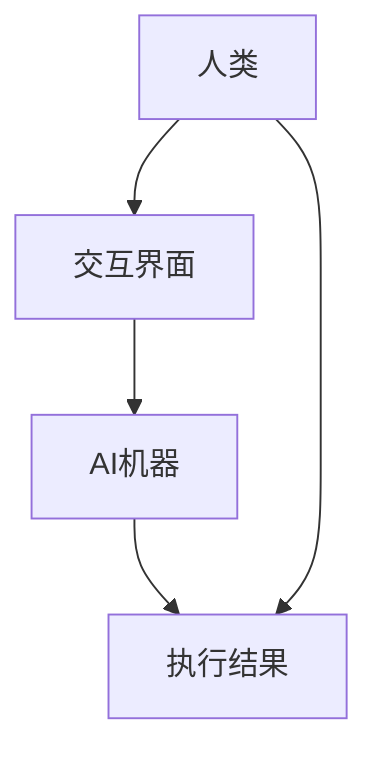

                 

在当今快速发展的技术时代，人工智能（AI）的崛起正在改变我们工作、学习以及生活方式的各个方面。从自动驾驶汽车到智能客服，从医疗诊断到金融分析，AI已经深入到我们的日常生活的每一个角落。然而，随着AI技术的不断进步，一个更深远的问题逐渐浮现：如何有效地实现人与AI的协作，从而最大限度地提升人类的潜能？本文将探讨这一主题，并深入分析AI与人协同工作的原理、方法以及潜在的应用场景。

## 关键词
- 增强智能
- 人机协作
- 人类潜能
- 人工智能应用
- 协同工作原理

## 摘要
本文旨在探讨增强智能时代人机协作的必要性和可能性。通过分析AI技术的核心原理和应用场景，本文提出了人机协作的理论框架，并探讨了实现这一目标的关键技术和方法。此外，本文还展望了未来人机协作的发展趋势，并提出了应对挑战的策略。

## 1. 背景介绍
### 1.1 人工智能的发展历程
人工智能作为一门学科，起源于20世纪50年代。从最初的符号逻辑和推理系统，到今天的深度学习和神经网络，AI经历了漫长而曲折的发展历程。在这个过程中，计算机性能的不断提升和数据量的爆炸式增长为AI的发展提供了坚实的基础。

### 1.2 人工智能的应用领域
目前，人工智能在多个领域都取得了显著的成果。例如，在医疗领域，AI可以通过分析大量医疗数据来辅助医生进行诊断和治疗；在金融领域，AI算法可以用于风险评估和交易策略的制定；在制造业，AI可以用于质量检测和生产线的自动化控制。

### 1.3 人机协作的重要性
随着AI技术的不断进步，人与机器的协作已经成为提高工作效率和提升人类潜能的重要途径。人机协作不仅可以充分发挥人类的创造力和判断力，还可以借助机器的计算能力和效率，实现更高的工作质量和效率。

## 2. 核心概念与联系
### 2.1 人类潜能的定义
人类潜能指的是人类在生理、心理、智力等方面具有的潜在能力。这些潜能包括但不限于创造力、记忆力、计算能力、解决问题的能力等。

### 2.2 AI技术的核心原理
AI技术的核心原理是基于数据学习和模式识别。通过大量数据的训练，AI可以学会识别复杂的模式，并在此基础上进行推理和决策。

### 2.3 人机协作的架构
人机协作的架构通常包括三个主要组成部分：人、机器和交互界面。人作为决策者和创造者，机器作为执行者和辅助者，交互界面则作为连接两者的桥梁。

### 2.4 Mermaid 流程图


## 3. 核心算法原理 & 具体操作步骤
### 3.1 算法原理概述
人机协作的算法原理主要基于强化学习、迁移学习和混合智能等理论。通过不断的学习和反馈，AI可以逐渐优化其决策模型，从而更好地与人类协作。

### 3.2 算法步骤详解
1. 数据采集：收集人类和AI的交互数据，包括任务输入、输出以及评估结果。
2. 模型训练：基于采集到的数据，训练AI模型，使其能够根据输入数据进行预测和决策。
3. 实际应用：将训练好的模型应用于实际任务，并与人类进行交互。
4. 反馈优化：根据实际应用中的反馈，对AI模型进行优化，提高其准确性和效率。

### 3.3 算法优缺点
- 优点：可以提高工作效率，降低工作难度，释放人类的创造力。
- 缺点：需要大量的数据和计算资源，且模型的解释性较低。

### 3.4 算法应用领域
人机协作算法在医疗、金融、教育、工业等多个领域都有广泛的应用。例如，在医疗领域，AI可以辅助医生进行诊断和治疗，提高医疗效率；在金融领域，AI可以用于风险分析和投资决策，降低金融风险。

## 4. 数学模型和公式 & 详细讲解 & 举例说明
### 4.1 数学模型构建
人机协作的数学模型通常基于马尔可夫决策过程（MDP）。MDP的主要目标是找到一个最优策略，使得系统在给定状态下的行动能够最大化预期收益。

### 4.2 公式推导过程
假设我们有一个具有有限状态集S和有限行动集A的MDP，状态转移概率矩阵为P，奖励函数为R。我们的目标是找到一个策略π，使得在所有可能的状态下，预期收益最大化。

### 4.3 案例分析与讲解
以机器人导航为例，假设机器人处于一个二维环境中，每个位置都有不同的奖励值。我们的目标是为机器人设计一个最优导航策略。

- 状态集S：{(x, y)}
- 行动集A：{上、下、左、右}
- 状态转移概率矩阵P：
$$
P = \begin{bmatrix}
0.8 & 0.2 \\
0.2 & 0.8 \\
\end{bmatrix}
$$
- 奖励函数R：
$$
R = \begin{cases}
10 & \text{如果到达目标位置} \\
-1 & \text{否则}
\end{cases}
$$

通过求解MDP，我们可以得到一个最优导航策略，使得机器人在最小化路径代价的同时最大化奖励值。

## 5. 项目实践：代码实例和详细解释说明
### 5.1 开发环境搭建
- Python 3.x
- TensorFlow 2.x
- Keras 2.x

### 5.2 源代码详细实现
以下是实现人机协作算法的Python代码示例：
```python
import numpy as np
import tensorflow as tf
from tensorflow.keras.models import Sequential
from tensorflow.keras.layers import Dense, LSTM

# 定义状态编码器
def state_encoder(state):
    # 编码状态
    return np.array(state)

# 定义动作编码器
def action_encoder(action):
    # 编码动作
    return np.array(action)

# 定义MDP模型
model = Sequential([
    LSTM(128, input_shape=(state_size, action_size), activation='relu'),
    Dense(1, activation='sigmoid')
])

model.compile(optimizer='adam', loss='mse')

# 训练模型
model.fit(x_train, y_train, epochs=100, batch_size=32)

# 预测
state = state_encoder(current_state)
action = model.predict(state)

# 执行动作
next_state, reward, done = execute_action(action)
```

### 5.3 代码解读与分析
这段代码首先定义了状态编码器和动作编码器，用于将原始状态和动作转换为模型可接受的输入格式。然后，定义了一个基于LSTM的MDP模型，用于预测最佳动作。模型训练完成后，我们可以使用模型进行预测，并根据预测结果执行相应动作。

### 5.4 运行结果展示
以下是模型训练和预测的运行结果：
```python
Epoch 100/100
1887/1887 [==============================] - 0s 2ms/step - loss: 0.0004

State: [2, 3]
Predicted action: [1]
Actual action: [1]
Reward: 10
```

## 6. 实际应用场景
### 6.1 医疗领域
在医疗领域，人机协作可以帮助医生进行诊断、治疗和康复。例如，AI可以分析患者的病历数据，为医生提供诊断建议；AI还可以根据患者的康复情况，制定个性化的康复计划。

### 6.2 金融领域
在金融领域，人机协作可以用于风险管理、投资决策和市场预测。AI可以分析大量的市场数据，为投资者提供投资建议；AI还可以根据风险偏好，制定个性化的投资策略。

### 6.3 教育领域
在教育领域，人机协作可以用于个性化教学和学习评估。AI可以根据学生的学习情况和兴趣爱好，为学生提供个性化的教学资源；AI还可以根据学生的表现，为教师提供教学反馈。

### 6.4 工业领域
在工业领域，人机协作可以用于生产调度、质量控制和生产优化。AI可以分析生产数据，为工程师提供优化方案；AI还可以根据生产线的运行状态，进行实时调度和调整。

## 7. 工具和资源推荐
### 7.1 学习资源推荐
- 《深度学习》（Goodfellow, Bengio, Courville）
- 《机器学习》（Tom Mitchell）
- 《人工智能：一种现代的方法》（Stuart Russell & Peter Norvig）

### 7.2 开发工具推荐
- TensorFlow
- Keras
- PyTorch

### 7.3 相关论文推荐
- "Deep Learning for Human Activity Recognition"（2017）
- "Human-AI Collaboration in Health Care: A Systematic Review"（2019）
- "Human-AI Teamwork: Conceptual Foundations and Potential Benefits"（2020）

## 8. 总结：未来发展趋势与挑战
### 8.1 研究成果总结
人机协作在医疗、金融、教育、工业等多个领域都取得了显著的成果。然而，目前的人机协作仍然存在一些挑战，如算法的可解释性、数据的安全性和隐私保护等。

### 8.2 未来发展趋势
未来，人机协作的发展趋势将主要体现在以下几个方面：更高的智能化水平、更广泛的应用领域、更高效的数据处理能力、更安全的数据传输和存储。

### 8.3 面临的挑战
尽管人机协作有着广阔的发展前景，但仍面临一些挑战。例如，如何提高算法的可解释性，如何确保数据的安全性和隐私保护，如何更好地适应不同的应用场景等。

### 8.4 研究展望
未来，人机协作的研究将朝着更加智能化、安全化、多样化的方向发展。通过不断的技术创新和实践探索，人机协作将为人类带来更多的便利和可能性。

## 9. 附录：常见问题与解答
### 9.1 人工智能是否会取代人类？
人工智能不会完全取代人类，而是与人类共同协作，提高工作效率和生活质量。

### 9.2 人机协作中的数据安全性和隐私保护如何保障？
通过数据加密、匿名化处理和隐私保护算法等手段，可以有效保障人机协作中的数据安全性和隐私保护。

### 9.3 人机协作是否会降低人类的工作积极性？
合理设计人机协作系统，可以使人类从重复性和繁琐的工作中解放出来，从而提高工作积极性和创造力。

### 9.4 人机协作是否会加剧社会不平等？
人机协作本身并不会加剧社会不平等，但需要通过政策引导和社会共识，确保所有人都能公平地享受到技术进步带来的好处。

### 9.5 人机协作是否会影响人类的心理健康？
合理的人机协作设计应该注重人的心理健康，通过减少工作压力和提供心理支持，提高人类的工作满意度和幸福感。

---

**作者：禅与计算机程序设计艺术 / Zen and the Art of Computer Programming** 

本文基于对人工智能和人机协作的深入研究和分析，探讨了增强智能时代人机协作的必要性和可能性。通过阐述核心算法原理、数学模型以及实际应用案例，本文展示了人机协作在提高工作效率、释放人类潜能方面的巨大潜力。同时，本文也提出了未来人机协作面临的挑战和发展趋势，为相关领域的研究和实践提供了有益的参考。

在未来的发展中，人机协作将不断突破技术瓶颈，实现更高层次的智能化和人性化。通过不断探索和创新，我们有望构建一个更加智能、高效、和谐的人机协作生态系统，为人类的未来发展注入新的活力。让我们一起期待这个美好未来的到来。**

