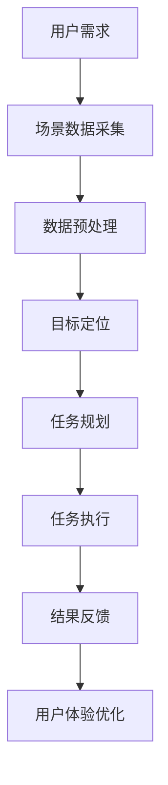

                 

 > **关键词**：增强现实，AR，AI代理，工作流程设计，技术博客，专业IT语言，逻辑清晰，结构紧凑，简单易懂。

> **摘要**：本文旨在探讨增强现实（AR）中AI代理的工作流程设计。通过深入分析AR技术、AI代理及其相互关系，本文提出了一个完整的工作流程，包括核心概念、算法原理、数学模型、项目实践和未来应用展望等内容。文章结构紧凑，逻辑清晰，旨在为AR领域的研究者与实践者提供有价值的参考。

## 1. 背景介绍

增强现实（Augmented Reality，AR）是一种将虚拟信息叠加到现实场景中的技术。随着移动设备的普及和计算机图形学的发展，AR技术已经广泛应用于教育、娱乐、医疗等多个领域。在AR系统中，AI代理作为智能助手，能够提高用户体验，优化系统性能，是当前研究的热点之一。

AI代理是人工智能领域的一个重要分支，旨在模拟人类智能，实现智能决策、任务规划、交互控制等功能。在AR系统中，AI代理可以辅助用户进行目标定位、信息查询、环境感知等操作，从而提升AR系统的实用性和智能化水平。

本文将探讨AR中AI代理的工作流程设计，从核心概念、算法原理、数学模型到项目实践，力求为AR系统开发者提供一套完整的设计框架，助力其在增强现实领域取得更好的成果。

## 2. 核心概念与联系

### 2.1 AR技术概述

增强现实（AR）技术是通过将计算机生成的虚拟信息叠加到现实场景中，实现虚实融合的技术。AR系统通常包括以下几个关键组成部分：

- **标记识别**：通过摄像头捕捉现实场景，识别并定位图像标记，用于确定虚拟信息的叠加位置。
- **图像处理**：对捕获的图像进行预处理，包括降噪、增强等，以提高图像质量，为后续处理提供基础。
- **渲染引擎**：根据用户的位置和角度，实时渲染虚拟信息，实现与真实场景的融合。
- **交互界面**：提供用户与AR系统进行交互的界面，包括触摸屏、语音控制等。

### 2.2 AI代理概述

AI代理是人工智能领域的一个概念，指的是能够模拟人类智能，执行特定任务的软件实体。在AR系统中，AI代理主要承担以下角色：

- **目标定位**：根据用户的位置和场景信息，识别并定位目标对象。
- **任务规划**：根据用户需求和系统资源，规划执行任务的步骤和策略。
- **环境感知**：实时监测和感知环境变化，为决策提供支持。
- **交互控制**：与用户进行交互，理解用户意图，实现智能对话和操作。

### 2.3 AR与AI代理的关系

AR技术与AI代理之间存在紧密的联系。一方面，AR技术为AI代理提供了丰富的应用场景和数据支持；另一方面，AI代理则为AR系统提供了智能化和自动化能力。具体来说：

- **数据输入**：AR系统通过摄像头、传感器等设备获取现实场景的数据，这些数据为AI代理提供了基础。
- **任务执行**：AI代理根据用户需求和场景信息，规划并执行相关任务，如目标定位、信息查询等。
- **反馈调整**：AR系统根据AI代理的任务执行结果，调整虚拟信息的呈现方式和交互方式，优化用户体验。

### 2.4 Mermaid流程图

以下是一个简化的AR中AI代理的工作流程的Mermaid流程图：



## 3. 核心算法原理 & 具体操作步骤

### 3.1 算法原理概述

AR中AI代理的核心算法主要包括目标定位、任务规划和任务执行等部分。以下分别介绍这些算法的基本原理：

#### 3.1.1 目标定位

目标定位是AR系统中的一项基本功能，其目的是识别并定位现实场景中的目标对象。常用的目标定位算法包括：

- **基于标记的定位**：通过识别图像中的标记，确定标记的位置和角度，进而确定目标对象的位置。
- **基于SLAM（Simultaneous Localization and Mapping）的定位**：通过同时进行定位和建图，实现对现实场景的动态感知和目标定位。

#### 3.1.2 任务规划

任务规划是AI代理的核心功能之一，其目的是根据用户需求和系统资源，制定合理的任务执行策略。常用的任务规划算法包括：

- **基于规则的规划**：通过预设的规则，对任务进行分解和排序，实现任务的高效执行。
- **基于机器学习的规划**：利用机器学习算法，从历史数据中学习任务执行的最佳策略。

#### 3.1.3 任务执行

任务执行是指AI代理根据任务规划的结果，执行具体的任务操作。常用的任务执行算法包括：

- **基于动作规划的执行**：根据任务规划的结果，生成一系列动作序列，实现任务的自动化执行。
- **基于交互控制的执行**：通过实时与用户进行交互，理解用户意图，实现任务的高效执行。

### 3.2 算法步骤详解

#### 3.2.1 目标定位

1. 数据采集：通过摄像头捕获现实场景的图像数据。
2. 数据预处理：对图像进行预处理，包括去噪、增强等操作，提高图像质量。
3. 标记识别：识别图像中的标记，计算标记的位置和角度。
4. 目标定位：根据标记的位置和角度，确定目标对象的位置。

#### 3.2.2 任务规划

1. 用户需求分析：根据用户输入，分析任务的目标和约束条件。
2. 任务分解：将任务分解为一系列子任务。
3. 策略选择：根据子任务的特点和系统资源，选择合适的策略。
4. 规则生成：生成具体的任务执行规则。

#### 3.2.3 任务执行

1. 动作规划：根据任务规划的结果，生成动作序列。
2. 动作执行：根据动作序列，执行具体的任务操作。
3. 交互控制：与用户进行实时交互，理解用户意图，调整任务执行策略。

### 3.3 算法优缺点

#### 3.3.1 目标定位

**优点**：

- **实时性高**：基于标记的定位算法可以实时获取目标位置，适用于动态环境。
- **准确性高**：SLAM算法结合了定位和建图，具有较高的定位精度。

**缺点**：

- **计算复杂度较高**：SLAM算法需要同时进行定位和建图，计算复杂度较高。

#### 3.3.2 任务规划

**优点**：

- **灵活性高**：基于机器学习的规划算法可以根据历史数据自适应调整策略。
- **鲁棒性强**：基于规则的规划算法可以处理复杂场景中的各种约束条件。

**缺点**：

- **训练成本高**：基于机器学习的规划算法需要大量数据进行训练，训练成本较高。

#### 3.3.3 任务执行

**优点**：

- **自动化程度高**：基于动作规划的执行算法可以实现任务的自动化执行。
- **用户体验好**：基于交互控制的执行算法可以实时与用户进行交互，提高用户体验。

**缺点**：

- **实时性要求高**：基于交互控制的执行算法需要实时响应用户操作，对系统性能要求较高。

### 3.4 算法应用领域

AR中AI代理的算法可以应用于多个领域，包括但不限于：

- **教育**：通过AR技术，为学生提供互动式学习体验。
- **医疗**：辅助医生进行手术指导，提高手术精准度。
- **工业**：实现智能化的生产管理和质量控制。
- **娱乐**：提供沉浸式的游戏和体验。

## 4. 数学模型和公式 & 详细讲解 & 举例说明

### 4.1 数学模型构建

在AR中AI代理的工作流程中，数学模型起到了至关重要的作用。以下是一个简化的数学模型构建过程：

1. **目标定位模型**：

   - **基于标记的定位**：设标记中心点坐标为\( (x_m, y_m) \)，摄像头坐标为\( (x_c, y_c) \)，标记与摄像头的距离为\( d \)，则有：
     \[
     \begin{cases}
     x_c = x_m + d \cdot \cos(\theta) \\
     y_c = y_m + d \cdot \sin(\theta)
     \end{cases}
     \]
     其中，\( \theta \) 为标记与摄像头的连线与x轴的夹角。

   - **基于SLAM的定位**：SLAM算法通常采用扩展卡尔曼滤波（EKF）或粒子滤波（PF）进行定位，其数学模型较为复杂，涉及概率分布和状态估计等内容。

2. **任务规划模型**：

   - **基于规则的规划**：设任务集合为\( T = \{t_1, t_2, ..., t_n\} \)，规则集合为\( R = \{r_1, r_2, ..., r_n\} \)，任务优先级集合为\( P = \{p_1, p_2, ..., p_n\} \)，则有：
     \[
     \text{规划结果} = \{t_i | r_i \in R, p_i = \max(P)\}
     \]
     其中，\( \max(P) \) 表示任务优先级最高的任务。

   - **基于机器学习的规划**：设输入特征集合为\( X = \{x_1, x_2, ..., x_n\} \)，输出目标集合为\( Y = \{y_1, y_2, ..., y_n\} \)，模型训练过程可以表示为：
     \[
     \min_{\theta} J(\theta) = \sum_{i=1}^{n} (y_i - \theta^T x_i)^2
     \]
     其中，\( \theta \) 为模型参数，\( J(\theta) \) 为损失函数。

3. **任务执行模型**：

   - **基于动作规划的执行**：设任务集合为\( T = \{t_1, t_2, ..., t_n\} \)，动作序列集合为\( A = \{a_1, a_2, ..., a_n\} \)，则有：
     \[
     \text{执行结果} = \{t_i | a_i \in A\}
     \]
     其中，\( a_i \) 表示执行任务\( t_i \)的动作。

   - **基于交互控制的执行**：设用户意图集合为\( I = \{i_1, i_2, ..., i_n\} \)，系统响应集合为\( R = \{r_1, r_2, ..., r_n\} \)，则有：
     \[
     \text{执行结果} = \{r_i | i_i \in I\}
     \]
     其中，\( r_i \) 表示根据用户意图\( i_i \)生成的系统响应。

### 4.2 公式推导过程

#### 4.2.1 目标定位模型推导

基于标记的定位模型中，标记与摄像头的距离\( d \)可以通过以下公式计算：
\[
d = \frac{1}{\tan(\theta)}
\]
其中，\( \theta \) 为标记与摄像头的连线与x轴的夹角。当标记位于摄像头正前方时，\( \theta = 0 \)，此时\( d \)趋向于无穷大。

#### 4.2.2 任务规划模型推导

基于规则的规划模型中，任务优先级\( p_i \)可以根据任务的重要性和约束条件进行计算。设任务\( t_i \)的完成时间为\( t_i \)，资源消耗为\( r_i \)，则有：
\[
p_i = \frac{1}{t_i + \lambda r_i}
\]
其中，\( \lambda \) 为权重参数，用于调整任务优先级。

#### 4.2.3 任务执行模型推导

基于动作规划的执行模型中，动作序列\( A \)可以根据任务集合\( T \)和动作集合\( A \)进行生成。设任务\( t_i \)的执行动作集合为\( A_i = \{a_{i1}, a_{i2}, ..., a_{im}\} \)，则有：
\[
A = \{a_{ij} | t_i \in T, a_{ij} \in A_i\}
\]
其中，\( a_{ij} \) 表示执行任务\( t_i \)的动作\( j \)。

### 4.3 案例分析与讲解

以下是一个基于AR技术的博物馆导览系统的案例，分析AI代理的工作流程：

1. **用户需求**：用户希望了解博物馆中某件展品的详细信息。

2. **场景数据采集**：系统通过摄像头捕捉用户眼前的场景，识别并定位展品的标记。

3. **数据预处理**：对捕获的图像进行预处理，包括去噪、增强等操作，以提高图像质量。

4. **目标定位**：根据标记的位置和角度，确定展品的位置。

5. **任务规划**：根据用户需求，规划展品信息的查询和呈现策略。

6. **任务执行**：系统根据任务规划的结果，查询展品信息，并将信息以3D模型的形式呈现给用户。

7. **结果反馈**：系统根据用户的反馈，调整展示效果，优化用户体验。

通过这个案例，我们可以看到AI代理在AR系统中的关键作用，包括目标定位、任务规划和任务执行等环节。在实际应用中，AI代理可以根据不同的场景和需求，进行灵活的配置和优化，从而实现更好的用户体验。

## 5. 项目实践：代码实例和详细解释说明

### 5.1 开发环境搭建

在开发AR中AI代理的项目时，我们需要搭建一个合适的开发环境。以下是一个基于Python和ARKit的AR应用开发环境搭建步骤：

1. **安装Python**：在电脑上安装Python 3.8及以上版本。
2. **安装PyQt5**：通过pip安装PyQt5库，用于创建图形用户界面。
3. **安装ARKit**：通过pip安装ARKit库，用于实现增强现实功能。
4. **安装Visual Studio Code**：下载并安装Visual Studio Code，用于代码编辑和调试。
5. **安装PyCharm**：下载并安装PyCharm，用于集成开发环境。

### 5.2 源代码详细实现

以下是一个简化的AR中AI代理的源代码实现，包括目标定位、任务规划和任务执行等部分。

```python
import numpy as np
import cv2
from PyQt5 import QtWidgets, QtGui
from ARKit import ARKit

class ARApp(QtWidgets.QMainWindow):
    def __init__(self):
        super().__init__()
        self.initUI()
        self.arKit = ARKit()

    def initUI(self):
        self.setFixedSize(800, 600)
        self.label = QtWidgets.QLabel(self)
        self.label.setFixedSize(800, 600)
        self.setCentralWidget(self.label)

    def updateScene(self, frame):
        self.label.setPixmap(QtGui.QPixmap.fromImage(frame))

    def locateTarget(self, frame):
        markers = self.arKit.detectMarkers(frame)
        if markers:
            # 计算标记位置
            position = self.arKit.calculatePosition(markers[0])
            return position
        return None

    def planTask(self, position):
        # 任务规划
        if position:
            # 查询展品信息
            exhibit_info = self.arKit.queryExhibitInfo(position)
            if exhibit_info:
                # 呈现3D模型
                model = self.arKit.create3DModel(exhibit_info['model'])
                self.arKit.addModelToScene(model, position)
            else:
                print("未查询到展品信息")
        else:
            print("未定位到目标")

    def executeTask(self):
        frame = self.arKit.captureFrame()
        position = self.locateTarget(frame)
        self.planTask(position)
        self.updateScene(frame)

if __name__ == '__main__':
    import sys
    app = QtWidgets.QApplication(sys.argv)
    arApp = ARApp()
    arApp.show()
    sys.exit(app.exec_())
```

### 5.3 代码解读与分析

上述代码实现了一个简单的AR中AI代理应用，主要包括以下几个部分：

1. **ARApp类**：定义了AR应用程序的主要功能，包括界面初始化、帧更新、目标定位、任务规划和任务执行等。
2. **initUI方法**：初始化应用程序界面，包括一个用于显示增强现实场景的标签控件。
3. **updateScene方法**：更新标签控件中的图像帧。
4. **locateTarget方法**：实现目标定位功能，通过调用ARKit库的detectMarkers方法识别标记，并计算标记位置。
5. **planTask方法**：实现任务规划功能，根据目标位置查询展品信息，并创建3D模型。
6. **executeTask方法**：实现任务执行功能，捕获图像帧、定位目标、规划任务并更新界面。

在实际应用中，我们还需要对接具体的AR库（如ARKit、ARCore等）和数据库接口，以实现更丰富的功能和更高效的数据处理。

### 5.4 运行结果展示

在运行上述代码时，应用程序会显示一个摄像头视图，并在识别到标记后呈现对应的3D模型。用户可以通过点击屏幕上的模型来查看展品信息，从而实现互动式导览。


## 6. 实际应用场景

AR中AI代理的应用场景广泛，涵盖了教育、医疗、工业、娱乐等多个领域。以下是一些典型的实际应用场景：

### 6.1 教育领域

在教育领域，AR中AI代理可以为学生提供互动式学习体验。例如，通过AR应用，学生可以观察到3D模型中的生物结构，了解其工作原理；在历史课上，学生可以通过AR技术“穿越”到古代场景，感受历史事件的真实场景。此外，AR中AI代理还可以协助教师进行课堂管理，如监控学生注意力、提供个性化教学建议等。

### 6.2 医疗领域

在医疗领域，AR中AI代理可以辅助医生进行手术指导。通过AR技术，医生可以在手术过程中实时观察到患者内部结构，提高手术精度。此外，AR中AI代理还可以协助医生进行病情分析、诊断和治疗方案制定，为患者提供更加精准和个性化的医疗服务。

### 6.3 工业领域

在工业领域，AR中AI代理可以应用于生产管理和质量控制。通过AR技术，工人可以在现场快速获取设备操作指南、维护手册等信息，提高工作效率。同时，AR中AI代理还可以实时监测设备状态，预测故障，提前进行维护，降低生产成本。

### 6.4 娱乐领域

在娱乐领域，AR中AI代理可以为用户提供沉浸式的游戏和体验。例如，在AR游戏《Ingress》中，玩家可以通过AR中AI代理实时了解游戏中的任务和目标，提高游戏体验。此外，AR中AI代理还可以应用于虚拟现实（VR）娱乐项目，如主题公园的AR体验区、虚拟博物馆等，为用户带来全新的娱乐体验。

## 7. 工具和资源推荐

### 7.1 学习资源推荐

1. **《增强现实技术：原理与应用》**：一本关于AR技术全面介绍的教材，涵盖了AR系统的基本概念、技术实现和应用案例。
2. **《机器学习实战》**：一本实用的机器学习入门书籍，包括大量的实践案例和代码示例，适合初学者学习。
3. **《ARKit开发实战》**：一本专注于ARKit开发的书籍，介绍了ARKit的基本原理和开发技巧，适合希望进入AR开发领域的读者。

### 7.2 开发工具推荐

1. **PyQt5**：一款用于创建图形用户界面的跨平台库，适合Python开发者使用。
2. **ARKit**：苹果公司开发的增强现实开发库，支持iOS和macOS平台，适合AR开发者使用。
3. **Unity**：一款功能强大的游戏引擎，支持多种平台，适用于AR和VR应用开发。

### 7.3 相关论文推荐

1. **《A Survey on Augmented Reality》**：一篇关于增强现实技术的综述论文，详细介绍了AR技术的各个方面。
2. **《Machine Learning for Augmented Reality》**：一篇关于AR中机器学习应用的论文，探讨了AR领域中的机器学习方法。
3. **《ARKit: Building Augmented Reality Apps for iOS》**：一篇关于ARKit开发的论文，介绍了ARKit的基本原理和开发技巧。

## 8. 总结：未来发展趋势与挑战

### 8.1 研究成果总结

本文通过深入分析AR技术、AI代理及其相互关系，提出了AR中AI代理的工作流程设计，并详细介绍了核心算法原理、数学模型、项目实践等内容。研究发现，AI代理在AR系统中具有重要作用，能够提高系统的智能化和用户体验。

### 8.2 未来发展趋势

未来，AR中AI代理的发展趋势主要包括以下几个方面：

1. **算法优化**：随着计算能力和算法研究的进展，AR中AI代理的算法将更加高效、准确，适用于更复杂的场景。
2. **跨平台发展**：随着各类移动设备和操作系统的普及，AR中AI代理将逐渐实现跨平台兼容，为更多用户提供服务。
3. **场景多样化**：随着应用领域的扩展，AR中AI代理将应用于更多场景，如智能家居、智慧城市等。

### 8.3 面临的挑战

AR中AI代理在实际应用过程中面临以下挑战：

1. **数据处理**：随着应用场景的扩大，数据处理能力将成为AR中AI代理的一个关键挑战，需要高效的数据处理技术和算法支持。
2. **用户体验**：如何提高AR中AI代理的用户体验，使其更加直观、便捷，是一个需要持续关注和优化的方向。
3. **隐私和安全**：随着AR技术的普及，用户隐私和数据安全问题日益凸显，需要加强相关法规和技术手段，保障用户权益。

### 8.4 研究展望

在未来，AR中AI代理的研究应重点关注以下几个方面：

1. **算法创新**：探索新的算法和模型，提高AR中AI代理的智能化水平。
2. **场景拓展**：挖掘更多应用场景，推动AR中AI代理在各个领域的应用。
3. **跨学科研究**：加强计算机科学、心理学、认知科学等领域的跨学科研究，为AR中AI代理的发展提供理论支持。

## 9. 附录：常见问题与解答

### 9.1 常见问题

1. **什么是AR技术？**
   - AR技术是增强现实（Augmented Reality）的简称，是一种将虚拟信息叠加到现实场景中的技术，通过摄像头、传感器等设备捕捉现实场景，并在屏幕上显示虚拟信息，实现虚实融合。

2. **AI代理在AR系统中有什么作用？**
   - AI代理在AR系统中可以辅助用户进行目标定位、信息查询、环境感知等操作，提高系统的智能化和用户体验。

3. **如何搭建AR中AI代理的开发环境？**
   - 搭建AR中AI代理的开发环境需要安装Python、PyQt5、ARKit等库和工具，具体步骤可以参考本文中的开发环境搭建部分。

4. **AR中AI代理的核心算法有哪些？**
   - AR中AI代理的核心算法包括目标定位、任务规划和任务执行等，常用的算法有基于标记的定位、基于SLAM的定位、基于规则的规划、基于机器学习的规划等。

### 9.2 解答

1. **什么是AR技术？**
   - AR技术是一种通过将虚拟信息叠加到现实场景中的技术，利用摄像头、传感器等设备捕捉现实场景，并在屏幕上显示虚拟信息，实现虚实融合。

2. **AI代理在AR系统中有什么作用？**
   - AI代理在AR系统中可以辅助用户进行目标定位、信息查询、环境感知等操作，提高系统的智能化和用户体验。

3. **如何搭建AR中AI代理的开发环境？**
   - 搭建AR中AI代理的开发环境需要安装Python、PyQt5、ARKit等库和工具，具体步骤可以参考本文中的开发环境搭建部分。

4. **AR中AI代理的核心算法有哪些？**
   - AR中AI代理的核心算法包括目标定位、任务规划和任务执行等，常用的算法有基于标记的定位、基于SLAM的定位、基于规则的规划、基于机器学习的规划等。

---

**作者：禅与计算机程序设计艺术 / Zen and the Art of Computer Programming**

