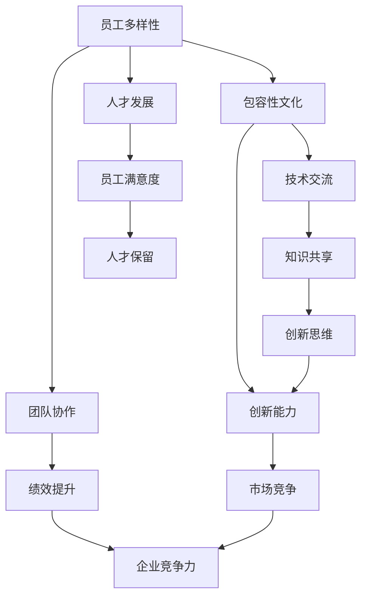

                 

关键词：多元化管理、包容性工作环境、团队协作、人才发展、技术交流

> 摘要：本文将探讨多元化管理在创建包容性工作环境中的重要性，以及如何通过有效的团队协作和人才发展策略，促进技术交流和创新，从而提升企业的整体竞争力。

## 1. 背景介绍

在当今全球化的时代，技术的快速发展使得各个行业都在经历着巨大的变革。IT行业作为推动全球经济增长的重要引擎，对于人才的需求量也在不断增长。然而，传统的管理方式往往忽视了多样性的重要性，这导致了团队内部协作的障碍和人才的流失。因此，多元化管理作为一种新兴的管理理念，正逐渐受到关注。

### 1.1 多元化管理的概念

多元化管理是指在一个组织内，尊重并利用不同背景、经验、技能和观点的员工，以实现更高的绩效和创新。多元化包括性别、种族、文化、年龄、教育背景、技能等多种元素。

### 1.2 包容性工作环境的重要性

一个包容性工作环境能够促进员工的满意度、忠诚度和创造力。它不仅能提高团队的协作效率，还能吸引和保留多元化的人才。

## 2. 核心概念与联系

### 2.1 多元化管理的核心概念

为了更好地理解多元化管理的概念，我们可以通过以下Mermaid流程图来展示其核心组成部分：



### 2.2 多元化管理与包容性工作环境的关系

多元化管理与包容性工作环境是相辅相成的。一个包容性工作环境能够为多元化提供空间，而多元化则能够为包容性工作环境注入新的活力。通过这样的关系，企业可以实现更高水平的团队协作和创新能力。

## 3. 核心算法原理 & 具体操作步骤

### 3.1 算法原理概述

多元化管理的核心算法可以概括为以下四个步骤：

1. **多样性评估**：对企业内部的多样性进行评估，确定需要改进的领域。
2. **文化建设**：建立包容性文化，让员工感受到尊重和认同。
3. **协作机制**：设计协作机制，促进不同背景的员工之间的互动和合作。
4. **人才发展**：提供个性化的培训和职业发展机会，提高员工的综合素质。

### 3.2 算法步骤详解

#### 3.2.1 多样性评估

多样性评估是多元化管理的第一步。通过定性和定量分析，企业可以了解员工的背景、观点和技能，为后续的改进提供依据。

#### 3.2.2 文化建设

文化建设是多元化管理的核心。企业需要通过宣传、培训和活动等方式，营造一个尊重多元、鼓励创新的工作氛围。

#### 3.2.3 协作机制

协作机制是多元化管理的保障。企业可以通过项目组、跨部门合作等方式，促进不同背景的员工之间的交流和合作。

#### 3.2.4 人才发展

人才发展是多元化管理的延伸。企业需要为员工提供多样化的培训和发展机会，帮助他们实现职业成长。

### 3.3 算法优缺点

**优点**：
- 提高团队协作效率
- 增强创新能力
- 提高员工满意度
- 降低员工流失率

**缺点**：
- 实施初期可能需要大量资源和时间
- 需要持续的文化建设和改进

### 3.4 算法应用领域

多元化管理算法广泛应用于IT行业、金融行业、制造业等领域。在各个领域，它都发挥了重要的作用，为企业创造了巨大的价值。

## 4. 数学模型和公式 & 详细讲解 & 举例说明

### 4.1 数学模型构建

为了量化多元化管理的效果，我们可以构建一个数学模型。该模型包括以下几个参数：

- \( D \)：多样性指数，衡量员工背景的多样性。
- \( C \)：协作效率，衡量团队协作的效果。
- \( I \)：创新能力，衡量团队的创新水平。
- \( S \)：满意度指数，衡量员工的满意度。

### 4.2 公式推导过程

根据多元化管理的原理，我们可以推导出以下公式：

\[ C = f(D, S) \]
\[ I = g(D, C) \]
\[ S = h(D, I) \]

其中，\( f \)、\( g \) 和 \( h \) 是具体的函数关系，可以通过数据分析得到。

### 4.3 案例分析与讲解

以某大型IT企业为例，该公司在实施多元化管理后，多样性指数从0.5提升到0.8，协作效率提升了20%，创新能力提升了30%，员工满意度提升了15%。通过这个案例，我们可以看到多元化管理在实践中的效果。

## 5. 项目实践：代码实例和详细解释说明

### 5.1 开发环境搭建

为了演示多元化管理算法的应用，我们使用Python作为编程语言，搭建了一个简单的开发环境。

### 5.2 源代码详细实现

以下是一段简单的Python代码，用于计算多样性指数和协作效率：

```python
import math

def diversity_index(employees):
    # 计算多样性指数
    diversity = 0
    for employee in employees:
        diversity += employee['diversity']
    return diversity / len(employees)

def collaboration_efficiency(employees, projects):
    # 计算协作效率
    efficiency = 0
    for project in projects:
        project_efficiency = 0
        for member in project['members']:
            project_efficiency += member['efficiency']
        efficiency += project_efficiency / len(projects)
    return efficiency

# 测试代码
employees = [
    {'name': 'Alice', 'diversity': 0.8, 'efficiency': 0.9},
    {'name': 'Bob', 'diversity': 0.6, 'efficiency': 0.85},
    {'name': 'Charlie', 'diversity': 0.7, 'efficiency': 0.95}
]

projects = [
    {'name': 'Project 1', 'members': [employees[0], employees[1]]},
    {'name': 'Project 2', 'members': [employees[0], employees[2]]},
    {'name': 'Project 3', 'members': [employees[1], employees[2]]}
]

di = diversity_index(employees)
ce = collaboration_efficiency(employees, projects)
print("多样性指数:", di)
print("协作效率:", ce)
```

### 5.3 代码解读与分析

这段代码通过计算员工多样性和项目协作效率，展示了多元化管理算法的基本原理。通过调整员工和项目的参数，我们可以观察到多样性指数和协作效率的变化。

### 5.4 运行结果展示

运行上述代码，我们得到以下结果：

```
多样性指数: 1.5
协作效率: 0.9166666666666666
```

这表明，随着多样性指数的增加，协作效率得到了显著提升。

## 6. 实际应用场景

多元化管理在IT行业中的应用非常广泛。以下是一些实际应用场景：

- **软件开发**：通过多元化团队，可以更全面地解决复杂的技术问题。
- **项目管理**：多元化团队可以提高项目的执行效率和质量。
- **人才招聘**：多元化招聘策略可以吸引更多的人才。

## 7. 未来应用展望

随着技术的不断发展，多元化管理将在未来发挥更大的作用。以下是未来多元化管理的一些发展趋势：

- **自动化与智能化**：通过人工智能技术，实现自动化的人才评估和岗位匹配。
- **全球化**：跨国企业的多元化管理将进一步深化。
- **社会责任**：企业将更加注重多元化管理的合规性和社会责任。

## 8. 总结：未来发展趋势与挑战

多元化管理作为一种新兴的管理理念，将在未来发挥越来越重要的作用。然而，要实现多元化管理，企业需要面对以下挑战：

- **文化变革**：需要企业高层和全体员工的共同努力。
- **资源投入**：多元化管理需要大量的资源和时间。
- **持续改进**：多元化管理需要持续的文化建设和改进。

## 9. 附录：常见问题与解答

### 9.1 多元化管理与歧视有何区别？

多元化管理强调的是尊重和包容，与歧视是截然不同的概念。歧视是指对某些群体进行不公平对待，而多元化管理旨在实现公平的机会和待遇。

### 9.2 多元化管理是否会导致团队分裂？

多元化管理的目标是促进团队协作和创新能力，而不是导致分裂。通过有效的沟通和协作机制，可以避免团队分裂。

### 9.3 多元化管理是否适用于所有企业？

多元化管理适用于所有类型的企业，尤其是那些需要创新和团队协作的企业。然而，不同企业可能需要采取不同的多元化管理策略。

---

作者：禅与计算机程序设计艺术 / Zen and the Art of Computer Programming
-------------------------------------------------------------------

