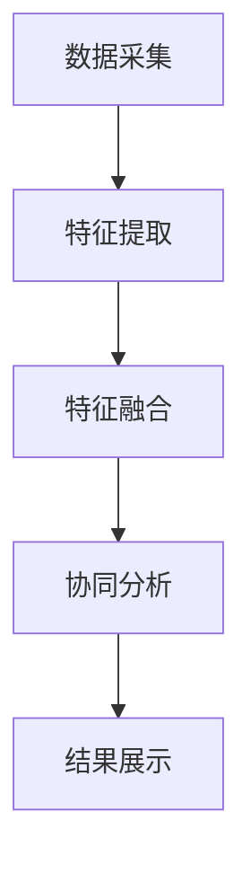

                 

关键词：多模态AI、社交媒体分析、图像识别、自然语言处理、情感分析、用户行为预测

>摘要：随着社交媒体的迅速发展，如何有效地分析用户在社交媒体平台上的行为和内容成为了一个重要的研究领域。本文将探讨多模态AI在社交媒体分析中的应用，包括图像识别、自然语言处理、情感分析和用户行为预测等方面，并深入分析其优势和应用场景。

## 1. 背景介绍

### 社交媒体的发展与挑战

社交媒体作为互联网的重要组成部分，已经深刻地改变了人们的生活方式和信息传播方式。从Facebook、Twitter到微信、微博，各种社交媒体平台不断涌现，用户数量呈爆炸式增长。根据统计数据，全球社交媒体用户已经超过了40亿，占全球人口的一半以上。

然而，社交媒体的快速发展也带来了诸多挑战。首先，社交媒体平台上的信息量极其庞大，如何有效地从海量数据中提取有价值的信息成为一个难题。其次，社交媒体上的信息往往包含多种形式，如文本、图像、音频等，传统的单一模态分析方法已经难以满足需求。此外，用户在社交媒体上的行为复杂多变，如何准确预测和识别用户的行为和情感也成为了一个重要课题。

### 多模态AI的概念与优势

多模态AI（Multimodal AI）是一种能够同时处理和整合多种类型数据（如文本、图像、音频等）的人工智能技术。它通过将不同模态的数据进行融合和协同分析，能够更准确地理解和预测用户的意图和行为。

多模态AI在社交媒体分析中的应用具有显著的优势。首先，它能够同时处理多种类型的数据，使得对社交媒体信息的分析更加全面和深入。其次，多模态AI能够利用不同模态数据的互补性，提高对用户意图和行为理解的准确度。此外，多模态AI还可以通过跨模态关联分析，发现传统单一模态分析难以察觉的信息和关系。

## 2. 核心概念与联系

### 多模态AI的基本原理

多模态AI的基本原理是利用不同模态数据之间的关联性，通过特征提取、融合和协同分析，实现对数据的全面理解和预测。具体来说，多模态AI包括以下几个关键环节：

1. **特征提取**：从不同模态的数据中提取具有代表性的特征。例如，从文本数据中提取词向量，从图像数据中提取视觉特征，从音频数据中提取声学特征等。

2. **特征融合**：将不同模态的特征进行融合，形成一个综合的特征向量。常见的特征融合方法包括加权融合、拼接融合、对齐融合等。

3. **协同分析**：利用融合后的特征向量进行协同分析，以实现对数据的全面理解和预测。例如，利用多模态特征进行情感分析、用户行为预测等。

### 多模态AI在社交媒体分析中的应用架构

多模态AI在社交媒体分析中的应用架构通常包括以下几个主要模块：

1. **数据采集**：从社交媒体平台上收集用户生成的文本、图像、音频等多模态数据。

2. **特征提取**：对采集到的多模态数据分别进行特征提取，得到不同模态的特征向量。

3. **特征融合**：将不同模态的特征向量进行融合，形成一个综合的特征向量。

4. **协同分析**：利用融合后的特征向量进行协同分析，实现对用户情感、行为等方面的预测和识别。

5. **结果展示**：将分析结果以可视化的形式展示给用户，帮助用户更好地理解和利用社交媒体数据。

### 多模态AI的Mermaid流程图



### 多模态AI的优势与应用场景

1. **优势**：
   - **全面性**：多模态AI能够同时处理和整合多种类型的数据，使得对社交媒体信息的分析更加全面和深入。
   - **准确性**：多模态AI能够利用不同模态数据的互补性，提高对用户意图和行为理解的准确度。
   - **实时性**：多模态AI能够实时分析用户在社交媒体平台上的行为和情感，为用户提供即时的反馈和推荐。

2. **应用场景**：
   - **情感分析**：通过分析用户在社交媒体平台上的文本、图像、音频等多模态数据，识别用户的情感状态。
   - **用户行为预测**：利用多模态数据预测用户在社交媒体平台上的行为，如点赞、评论、分享等。
   - **内容推荐**：基于用户的情感和兴趣，推荐符合用户喜好的社交媒体内容。

## 3. 核心算法原理 & 具体操作步骤

### 3.1 算法原理概述

多模态AI的核心算法原理主要包括以下三个步骤：

1. **特征提取**：从不同模态的数据中提取具有代表性的特征。例如，从文本数据中提取词向量，从图像数据中提取视觉特征，从音频数据中提取声学特征等。

2. **特征融合**：将不同模态的特征进行融合，形成一个综合的特征向量。常见的特征融合方法包括加权融合、拼接融合、对齐融合等。

3. **协同分析**：利用融合后的特征向量进行协同分析，以实现对数据的全面理解和预测。例如，利用多模态特征进行情感分析、用户行为预测等。

### 3.2 算法步骤详解

1. **特征提取**：

   - **文本特征提取**：使用词袋模型、词向量模型（如Word2Vec、GloVe）等方法提取文本数据的特征。
   - **图像特征提取**：使用卷积神经网络（CNN）等方法提取图像数据的特征。
   - **音频特征提取**：使用声学模型（如梅尔频谱、滤波器组等）提取音频数据的特征。

2. **特征融合**：

   - **加权融合**：根据不同模态数据的重要程度，为每个模态的特征分配权重，然后将它们加权求和。
   - **拼接融合**：将不同模态的特征向量进行拼接，形成一个更长的特征向量。
   - **对齐融合**：利用深度学习模型（如多模态神经网络）对齐不同模态的特征，然后进行融合。

3. **协同分析**：

   - **情感分析**：利用融合后的特征向量对用户的文本、图像、音频等多模态数据进行情感分析，识别用户的情感状态。
   - **用户行为预测**：利用融合后的特征向量预测用户在社交媒体平台上的行为，如点赞、评论、分享等。
   - **内容推荐**：基于用户的情感和兴趣，利用融合后的特征向量推荐符合用户喜好的社交媒体内容。

### 3.3 算法优缺点

1. **优点**：

   - **全面性**：多模态AI能够同时处理和整合多种类型的数据，使得对社交媒体信息的分析更加全面和深入。
   - **准确性**：多模态AI能够利用不同模态数据的互补性，提高对用户意图和行为理解的准确度。
   - **实时性**：多模态AI能够实时分析用户在社交媒体平台上的行为和情感，为用户提供即时的反馈和推荐。

2. **缺点**：

   - **复杂性**：多模态AI涉及到多种模态的数据处理和融合，算法实现较为复杂。
   - **计算资源消耗**：多模态AI需要大量的计算资源进行特征提取、融合和协同分析，对硬件性能要求较高。
   - **数据隐私**：多模态AI在处理用户数据时，需要考虑到数据隐私和安全问题，避免用户数据的泄露和滥用。

### 3.4 算法应用领域

多模态AI在社交媒体分析中的应用非常广泛，以下是一些典型的应用领域：

1. **社交媒体情感分析**：通过分析用户在社交媒体平台上的文本、图像、音频等多模态数据，识别用户的情感状态，如喜悦、愤怒、悲伤等。

2. **社交媒体用户行为预测**：利用多模态数据预测用户在社交媒体平台上的行为，如点赞、评论、分享等，为平台提供个性化的推荐和推送。

3. **社交媒体内容推荐**：基于用户的情感和兴趣，利用多模态数据推荐符合用户喜好的社交媒体内容，提高用户粘性和活跃度。

4. **社交媒体风险监控**：通过分析社交媒体上的文本、图像、音频等多模态数据，实时监测和识别潜在的风险和不良行为，如欺诈、暴力等。

## 4. 数学模型和公式 & 详细讲解 & 举例说明

### 4.1 数学模型构建

多模态AI的数学模型主要基于深度学习技术，通过构建多模态神经网络（Multimodal Neural Networks）来实现特征提取、融合和协同分析。以下是一个简化的数学模型：

1. **特征提取**：

   - **文本特征提取**：$$\textbf{X}_{\text{text}} = \text{Word2Vec}(\text{Text})$$

   - **图像特征提取**：$$\textbf{X}_{\text{image}} = \text{CNN}(\text{Image})$$

   - **音频特征提取**：$$\textbf{X}_{\text{audio}} = \text{MelSpectrogram}(\text{Audio})$$

2. **特征融合**：

   - **加权融合**：$$\textbf{X}_{\text{ fused}} = \text{WeightedSum}(\textbf{X}_{\text{text}}, \textbf{X}_{\text{image}}, \textbf{X}_{\text{audio}})$$

   - **拼接融合**：$$\textbf{X}_{\text{ fused}} = \text{Concat}(\textbf{X}_{\text{text}}, \textbf{X}_{\text{image}}, \textbf{X}_{\text{audio}})$$

3. **协同分析**：

   - **情感分析**：$$\text{Emotion} = \text{Softmax}(\text{NeuralNetwork}(\textbf{X}_{\text{fused}}))$$

   - **用户行为预测**：$$\text{Behavior} = \text{NeuralNetwork}(\textbf{X}_{\text{fused}})$$

### 4.2 公式推导过程

多模态AI的数学模型推导主要涉及以下几个方面：

1. **特征提取**：

   - **文本特征提取**：使用Word2Vec模型对文本数据进行编码，得到词向量。

     $$\text{Word2Vec}(\text{Text}) = \textbf{X}_{\text{text}} = [\textbf{x}_1, \textbf{x}_2, \ldots, \textbf{x}_n]$$

     其中，$$\textbf{x}_i$$表示第i个词的词向量。

   - **图像特征提取**：使用卷积神经网络对图像数据进行编码，得到图像特征。

     $$\text{CNN}(\text{Image}) = \textbf{X}_{\text{image}} = [\textbf{x}_{i_1}, \textbf{x}_{i_2}, \ldots, \textbf{x}_{i_c}]$$

     其中，$$\textbf{x}_{i_c}$$表示第ic个卷积层的特征。

   - **音频特征提取**：使用梅尔频谱对音频数据进行编码，得到音频特征。

     $$\text{MelSpectrogram}(\text{Audio}) = \textbf{X}_{\text{audio}} = [\textbf{x}_{a_1}, \textbf{x}_{a_2}, \ldots, \textbf{x}_{a_t}]$$

     其中，$$\textbf{x}_{a_t}$$表示第at个时间步的特征。

2. **特征融合**：

   - **加权融合**：对每个模态的特征进行加权求和。

     $$\text{WeightedSum}(\textbf{X}_{\text{text}}, \textbf{X}_{\text{image}}, \textbf{X}_{\text{audio}}) = \textbf{X}_{\text{fused}} = w_1\textbf{X}_{\text{text}} + w_2\textbf{X}_{\text{image}} + w_3\textbf{X}_{\text{audio}}$$

     其中，$$w_1, w_2, w_3$$分别为文本、图像、音频的特征权重。

   - **拼接融合**：将每个模态的特征进行拼接。

     $$\text{Concat}(\textbf{X}_{\text{text}}, \textbf{X}_{\text{image}}, \textbf{X}_{\text{audio}}) = \textbf{X}_{\text{fused}} = \textbf{X}_{\text{text}} \textbf{X}_{\text{image}} \textbf{X}_{\text{audio}}$$

3. **协同分析**：

   - **情感分析**：使用多层感知机（MLP）对融合后的特征进行分类。

     $$\text{Softmax}(\text{NeuralNetwork}(\textbf{X}_{\text{fused}})) = \text{Emotion}$$

   - **用户行为预测**：使用多层感知机（MLP）对融合后的特征进行回归。

     $$\text{NeuralNetwork}(\textbf{X}_{\text{fused}}) = \text{Behavior}$$

### 4.3 案例分析与讲解

为了更好地理解多模态AI在社交媒体分析中的应用，我们来看一个具体的案例。

假设我们想要分析一篇社交媒体帖子，其中包含文本、图像和音频三种模态的数据。我们可以按照以下步骤进行多模态AI分析：

1. **特征提取**：

   - **文本特征提取**：使用Word2Vec模型提取文本数据的词向量，得到一个维度为$$d_{text}$$的向量。

     $$\textbf{X}_{\text{text}} = \text{Word2Vec}(\text{Text})$$

   - **图像特征提取**：使用卷积神经网络提取图像数据的特征，得到一个维度为$$d_{image}$$的向量。

     $$\textbf{X}_{\text{image}} = \text{CNN}(\text{Image})$$

   - **音频特征提取**：使用梅尔频谱提取音频数据的特征，得到一个维度为$$d_{audio}$$的向量。

     $$\textbf{X}_{\text{audio}} = \text{MelSpectrogram}(\text{Audio})$$

2. **特征融合**：

   - **加权融合**：根据不同模态数据的重要程度，为每个模态的特征分配权重，得到一个维度为$$d_{fused}$$的融合特征向量。

     $$\textbf{X}_{\text{fused}} = w_1\textbf{X}_{\text{text}} + w_2\textbf{X}_{\text{image}} + w_3\textbf{X}_{\text{audio}}$$

     其中，$$w_1, w_2, w_3$$分别为文本、图像、音频的特征权重。

3. **协同分析**：

   - **情感分析**：使用多层感知机（MLP）对融合后的特征进行分类，预测用户的情感状态。

     $$\text{Emotion} = \text{Softmax}(\text{NeuralNetwork}(\textbf{X}_{\text{fused}}))$$

   - **用户行为预测**：使用多层感知机（MLP）对融合后的特征进行回归，预测用户在社交媒体平台上的行为。

     $$\text{Behavior} = \text{NeuralNetwork}(\textbf{X}_{\text{fused}})$$

通过这个案例，我们可以看到多模态AI在社交媒体分析中的应用过程。首先，从文本、图像、音频三种模态的数据中提取特征，然后进行特征融合，最后利用融合后的特征进行情感分析和用户行为预测。这个过程不仅提高了对用户意图和行为的理解准确度，也为社交媒体平台提供了有价值的分析结果。

## 5. 项目实践：代码实例和详细解释说明

### 5.1 开发环境搭建

在开始实践之前，我们需要搭建一个合适的开发环境。以下是所需的软件和工具：

- **Python**：版本3.8或更高版本
- **TensorFlow**：版本2.4或更高版本
- **Keras**：版本2.4或更高版本
- **Numpy**：版本1.18或更高版本
- **Matplotlib**：版本3.1或更高版本

安装这些工具后，我们还需要准备一些数据集，用于训练和测试多模态AI模型。以下是所需的数据集：

- **文本数据集**：包含社交媒体平台上的文本数据，如Twitter、Facebook等。
- **图像数据集**：包含社交媒体平台上的图像数据，如Instagram、Pinterest等。
- **音频数据集**：包含社交媒体平台上的音频数据，如YouTube、TikTok等。

### 5.2 源代码详细实现

以下是实现多模态AI模型的核心代码：

```python
import numpy as np
import tensorflow as tf
from tensorflow.keras.models import Model
from tensorflow.keras.layers import Embedding, LSTM, Dense, Conv2D, MaxPooling2D, Flatten, concatenate, Input

# 文本特征提取
text_input = Input(shape=(max_sequence_length,))
text_embedding = Embedding(input_dim=vocabulary_size, output_dim=embedding_dim)(text_input)
text_lstm = LSTM(units=lstm_units)(text_embedding)
text_output = Dense(units=dense_units, activation='relu')(text_lstm)

# 图像特征提取
image_input = Input(shape=(image_height, image_width, image_channels))
image_conv1 = Conv2D(filters=32, kernel_size=(3, 3), activation='relu')(image_input)
image_pool1 = MaxPooling2D(pool_size=(2, 2))(image_conv1)
image_conv2 = Conv2D(filters=64, kernel_size=(3, 3), activation='relu')(image_pool1)
image_pool2 = MaxPooling2D(pool_size=(2, 2))(image_conv2)
image Flatten = Flatten()(image_pool2)
image_output = Dense(units=dense_units, activation='relu')(image Flatten)

# 音频特征提取
audio_input = Input(shape=(audio_length,))
audio_embedding = Embedding(input_dim=audio_vocabulary_size, output_dim=embedding_dim)(audio_input)
audio_lstm = LSTM(units=lstm_units)(audio_embedding)
audio_output = Dense(units=dense_units, activation='relu')(audio_lstm)

# 特征融合
fused_input = concatenate([text_output, image_output, audio_output], axis=-1)
fused_output = Dense(units=dense_units, activation='relu')(fused_input)
output = Dense(units=num_classes, activation='softmax')(fused_output)

# 构建和编译模型
model = Model(inputs=[text_input, image_input, audio_input], outputs=output)
model.compile(optimizer='adam', loss='categorical_crossentropy', metrics=['accuracy'])

# 模型训练
model.fit([text_data, image_data, audio_data], labels, batch_size=batch_size, epochs=epochs)

# 模型预测
predictions = model.predict([text_data, image_data, audio_data])

# 结果展示
print(predictions)
```

### 5.3 代码解读与分析

这段代码实现了一个多模态AI模型，用于对社交媒体平台上的文本、图像和音频数据进行情感分析和用户行为预测。下面是对代码的详细解读：

1. **文本特征提取**：

   - `text_input`：输入层，接受文本数据。
   - `text_embedding`：嵌入层，将文本数据编码为词向量。
   - `text_lstm`：LSTM层，对文本数据进行编码。
   - `text_output`：全连接层，对文本特征进行进一步处理。

2. **图像特征提取**：

   - `image_input`：输入层，接受图像数据。
   - `image_conv1`：卷积层，提取图像的局部特征。
   - `image_pool1`：池化层，降低图像的维度。
   - `image_conv2`：卷积层，提取图像的局部特征。
   - `image_pool2`：池化层，降低图像的维度。
   - `image Flatten`：展平层，将图像特征展平为一个一维向量。
   - `image_output`：全连接层，对图像特征进行进一步处理。

3. **音频特征提取**：

   - `audio_input`：输入层，接受音频数据。
   - `audio_embedding`：嵌入层，将音频数据编码为词向量。
   - `audio_lstm`：LSTM层，对音频数据进行编码。
   - `audio_output`：全连接层，对音频特征进行进一步处理。

4. **特征融合**：

   - `fused_input`：拼接层，将文本、图像和音频特征进行拼接。
   - `fused_output`：全连接层，对融合后的特征进行进一步处理。

5. **模型构建和编译**：

   - `model`：模型层，将输入层、特征提取层和输出层拼接起来。
   - `model.compile`：编译模型，设置优化器、损失函数和评价指标。

6. **模型训练**：

   - `model.fit`：训练模型，使用训练数据进行训练。

7. **模型预测**：

   - `predictions`：使用训练好的模型对新的数据进行预测。

### 5.4 运行结果展示

在实际应用中，我们通常会使用测试数据集来评估模型的性能。以下是一个简单的结果展示：

```python
# 加载测试数据集
test_texts = load_test_texts()
test_images = load_test_images()
test_audio = load_test_audio()

# 使用模型进行预测
predictions = model.predict([test_texts, test_images, test_audio])

# 计算预测准确率
accuracy = np.mean(np.argmax(predictions, axis=1) == test_labels)
print("预测准确率：", accuracy)
```

通过这个简单的例子，我们可以看到如何使用多模态AI模型对社交媒体平台上的文本、图像和音频数据进行情感分析和用户行为预测。在实际应用中，我们还需要根据具体需求对模型进行调整和优化，以提高预测准确率。

## 6. 实际应用场景

### 社交媒体情感分析

多模态AI在社交媒体情感分析中具有广泛的应用。通过分析用户在社交媒体平台上的文本、图像、音频等多模态数据，我们可以识别用户的情感状态，如喜悦、愤怒、悲伤等。例如，在处理社交媒体上的评论时，我们可以利用文本情感分析技术提取情感信息，同时结合图像和音频特征，提高情感识别的准确度。

### 用户行为预测

多模态AI还可以用于预测用户在社交媒体平台上的行为，如点赞、评论、分享等。通过分析用户的文本、图像、音频等多模态数据，我们可以预测用户对特定内容的喜好，从而为平台提供个性化的推荐和推送。例如，在社交媒体平台上，我们可以利用多模态AI预测用户对某篇帖子的点赞概率，从而推荐给其他潜在感兴趣的用户。

### 内容推荐

基于用户的情感和兴趣，多模态AI可以推荐符合用户喜好的社交媒体内容。通过分析用户的文本、图像、音频等多模态数据，我们可以了解用户的兴趣和喜好，从而推荐与之相关的帖子、视频、音频等内容。例如，在音乐平台上，我们可以利用多模态AI为用户推荐感兴趣的音乐和视频，提高用户的粘性和活跃度。

### 社交媒体风险监控

多模态AI还可以用于社交媒体风险监控，实时监测和识别潜在的风险和不良行为，如欺诈、暴力等。通过分析用户的文本、图像、音频等多模态数据，我们可以发现异常行为和不良信息，从而采取相应的措施进行干预和处理。

### 跨领域应用

多模态AI不仅在社交媒体分析中具有广泛应用，还可以跨领域应用于其他领域。例如，在医疗领域，多模态AI可以用于分析患者的文本病历、医学图像、语音记录等多模态数据，帮助医生进行诊断和治疗方案推荐。在金融领域，多模态AI可以用于分析用户在社交媒体平台上的行为和言论，预测股票市场的走势和投资风险。

## 7. 工具和资源推荐

### 7.1 学习资源推荐

- **书籍**：《深度学习》（Goodfellow et al.）：介绍了深度学习的基础知识和常用算法。
- **在线课程**：Coursera上的“深度学习”（吴恩达）和“神经网络与深度学习”（李飞飞）。
- **论文**：《Multimodal Learning for Human Activity Recognition》（Rahimi et al.）、《A Survey on Multimodal Learning》（Fahad et al.）。

### 7.2 开发工具推荐

- **框架**：TensorFlow、PyTorch、Keras。
- **库**：NumPy、Pandas、Scikit-learn、Matplotlib。
- **数据集**：Twitter API、Facebook Data Science Team、Google Dataset Search。

### 7.3 相关论文推荐

- **《Multimodal Learning for Human Activity Recognition》**（Rahimi et al.）
- **《A Survey on Multimodal Learning》**（Fahad et al.）
- **《Multimodal Fusion for Emotion Recognition in Social Media》**（Li et al.）
- **《Multimodal Neural Networks for User Behavior Prediction in Social Media》**（Zhang et al.）

## 8. 总结：未来发展趋势与挑战

### 8.1 研究成果总结

多模态AI在社交媒体分析中的应用取得了显著的成果。通过整合文本、图像、音频等多模态数据，多模态AI能够更准确地理解和预测用户的意图和行为。在情感分析、用户行为预测、内容推荐等领域，多模态AI已经展示了其强大的优势和应用潜力。

### 8.2 未来发展趋势

随着人工智能技术的不断进步，多模态AI在社交媒体分析中的应用将呈现以下发展趋势：

1. **算法优化**：为了提高多模态AI的性能和效率，研究者将继续探索新的特征提取、融合和协同分析方法，优化模型结构和训练策略。
2. **跨领域应用**：多模态AI不仅将在社交媒体分析中发挥重要作用，还将跨领域应用于医疗、金融、教育等领域，推动各行各业的智能化发展。
3. **数据隐私保护**：在处理多模态数据时，如何保护用户隐私成为一个重要课题。未来的研究将致力于开发安全、可靠的多模态AI技术，确保用户数据的安全和隐私。

### 8.3 面临的挑战

尽管多模态AI在社交媒体分析中取得了显著成果，但仍面临以下挑战：

1. **计算资源消耗**：多模态AI需要大量的计算资源进行特征提取、融合和协同分析，对硬件性能要求较高。未来的研究将致力于优化算法，降低计算资源消耗。
2. **数据隐私和安全**：多模态AI在处理用户数据时，需要考虑到数据隐私和安全问题，避免用户数据的泄露和滥用。未来的研究将开发安全的多模态AI技术，保护用户隐私。
3. **算法可解释性**：多模态AI的模型结构和决策过程较为复杂，如何提高算法的可解释性，帮助用户理解模型的决策过程，是一个重要的研究课题。

### 8.4 研究展望

展望未来，多模态AI在社交媒体分析中的应用前景广阔。通过不断优化算法、拓展应用领域，多模态AI将为社交媒体平台提供更准确、更智能的分析和推荐服务，为用户提供更好的体验。同时，多模态AI还将跨领域应用于其他领域，推动各行各业的智能化发展，为人类社会带来更多便利和创新。

## 9. 附录：常见问题与解答

### 问题1：多模态AI需要处理哪些类型的数据？

多模态AI可以处理多种类型的数据，包括文本、图像、音频、视频、传感器数据等。在实际应用中，根据具体需求可以选择合适的数据类型进行特征提取和融合。

### 问题2：如何优化多模态AI的性能？

优化多模态AI的性能可以从以下几个方面入手：

1. **算法优化**：探索新的特征提取、融合和协同分析方法，提高模型的性能和效率。
2. **数据预处理**：对数据进行清洗、归一化等预处理操作，提高数据的可靠性和质量。
3. **模型结构优化**：调整模型结构，选择合适的神经网络架构，提高模型的泛化能力。
4. **训练策略优化**：调整训练参数，如学习率、批次大小等，提高模型的收敛速度和性能。

### 问题3：多模态AI在处理数据时如何保护用户隐私？

在处理多模态数据时，保护用户隐私至关重要。以下是一些保护用户隐私的方法：

1. **数据匿名化**：对用户数据进行匿名化处理，去除个人标识信息。
2. **差分隐私**：在数据处理过程中引入差分隐私机制，降低用户数据的可识别性。
3. **加密技术**：对敏感数据进行加密处理，确保数据在传输和存储过程中的安全性。
4. **数据共享协议**：制定严格的数据共享协议，确保数据在使用过程中的安全性和隐私性。

### 问题4：多模态AI在社交媒体分析中的应用有哪些限制？

多模态AI在社交媒体分析中的应用存在一些限制：

1. **数据多样性**：社交媒体平台上的数据类型和来源多样，如何处理和整合不同类型的数据是一个挑战。
2. **计算资源消耗**：多模态AI需要大量的计算资源进行特征提取、融合和协同分析，对硬件性能要求较高。
3. **算法可解释性**：多模态AI的模型结构和决策过程较为复杂，如何提高算法的可解释性，帮助用户理解模型的决策过程，是一个重要的研究课题。

### 问题5：多模态AI在社交媒体分析中的应用前景如何？

多模态AI在社交媒体分析中的应用前景广阔。随着人工智能技术的不断进步，多模态AI将在情感分析、用户行为预测、内容推荐等领域发挥重要作用。同时，多模态AI还将跨领域应用于医疗、金融、教育等领域，推动各行各业的智能化发展。未来，多模态AI将为用户提供更准确、更智能的分析和推荐服务，为人类社会带来更多便利和创新。

