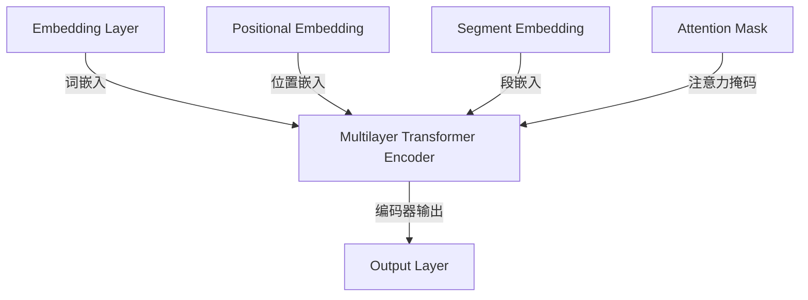

                 

### 1. 背景介绍

在人工智能（AI）快速发展的今天，自然语言处理（NLP）成为了一个至关重要的领域。从最初的规则驱动的系统到基于统计方法的进步，再到现代的深度学习模型，自然语言处理技术取得了巨大的飞跃。然而，尽管这些技术显著提升了文本处理的准确性，但传统的NLP方法在面对复杂任务时仍存在诸多局限性。

BERT（Bidirectional Encoder Representations from Transformers）模型的出现，标志着自然语言处理领域的一个重要里程碑。BERT是Google在2018年提出的一种预训练语言表示模型，其独特的双向编码器架构和大规模数据预训练策略，使得BERT在多种自然语言处理任务上表现优异，如文本分类、问答系统、命名实体识别等。

BERT的成功并非偶然，而是源于其对NLP任务的深刻理解和创新性的技术突破。传统的NLP方法往往只能关注文本的局部信息，而BERT通过双向编码器能够同时考虑上下文信息，使得模型在理解和生成文本时更加准确。此外，BERT的预训练策略，即在大规模语料库上先进行无监督预训练，再通过有监督微调来适应特定任务，极大地提升了模型在多种任务上的表现。

本文将深入探讨BERT模型的技术原理与实战，从背景介绍、核心概念与联系、算法原理与操作步骤、数学模型与公式、项目实践、实际应用场景、未来应用展望、工具和资源推荐以及未来发展趋势与挑战等方面，全面解析BERT模型如何解决NLP领域中的核心问题。

### 2. 核心概念与联系

要理解BERT模型如何工作，首先需要了解其核心概念与联系。BERT模型主要基于Transformer架构，这是一种自注意力机制（self-attention）驱动的神经网络模型。Transformer在2017年由Vaswani等人提出，并迅速成为机器翻译领域的标准模型，其核心思想是通过全局注意力机制，捕捉输入序列中任意位置之间的关联。

#### 2.1 Transformer架构

Transformer架构的核心组件是自注意力机制，它通过计算输入序列中每个词与其他词之间的相关性来更新每个词的表示。自注意力机制主要由以下几个部分组成：

1. **多头注意力（Multi-Head Attention）**：多头注意力机制通过多个独立的注意力头，捕捉不同类型的关系。每个头关注输入序列的不同部分，从而提高了模型的表示能力。

2. **前馈神经网络（Feed Forward Neural Network）**：在自注意力机制之后，每个词的表示会经过一个前馈神经网络，该网络由两个全连接层组成，分别具有不同的激活函数。

3. **残差连接（Residual Connection）**：残差连接通过跳过一层或几层网络，将输入直接传递到下一层，从而避免了信息的损失和梯度消失问题。

4. **层归一化（Layer Normalization）**：层归一化通过标准化每个层的输入和输出，提高了模型的训练效率和稳定性。

#### 2.2 BERT的双向编码器

BERT模型在Transformer架构的基础上，增加了双向编码器的概念。双向编码器允许模型同时考虑输入序列的前后文信息，从而提高了模型对语境的理解能力。

BERT的双向编码器包含以下关键组成部分：

1. **嵌入层（Embedding Layer）**：将词汇转换为密集向量表示，包括词嵌入、位置嵌入和段嵌入。

2. **多层Transformer编码器（Multi-Layer Transformer Encoder）**：通过多层Transformer编码器，逐步提取输入序列中的深层语义信息。

3. **注意力掩码（Attention Mask）**：为了防止模型在自注意力机制中考虑未来的信息，BERT使用了一个注意力掩码，它是一个布尔矩阵，用于指示哪些词应该被忽略。

4. **输出层（Output Layer）**：在编码器的最后一层之后，加入了一个输出层，用于处理特定任务，如文本分类、问答等。

#### 2.3 Mermaid流程图

为了更直观地展示BERT模型的核心概念与联系，我们可以使用Mermaid流程图来表示其结构。以下是一个简化的BERT模型Mermaid流程图：



通过上述Mermaid流程图，我们可以清晰地看到BERT模型的主要组成部分及其相互关系。

### 3. 核心算法原理与具体操作步骤

BERT模型的核心算法原理基于Transformer架构，其独特之处在于双向编码器和大规模数据预训练策略。在本节中，我们将详细介绍BERT的核心算法原理，并详细解释其具体操作步骤。

#### 3.1 算法原理概述

BERT模型的主要组成部分包括嵌入层、多层Transformer编码器、注意力掩码和输出层。其工作原理可以概括为以下步骤：

1. **嵌入层**：将词汇转换为密集向量表示，包括词嵌入（Word Embedding）、位置嵌入（Positional Embedding）和段嵌入（Segment Embedding）。词嵌入用于表示词汇，位置嵌入用于表示词在序列中的位置，段嵌入用于区分不同句子或段落。

2. **多层Transformer编码器**：通过多层Transformer编码器，逐步提取输入序列中的深层语义信息。每个编码器层包含多头注意力机制和前馈神经网络，同时使用残差连接和层归一化来提高模型的训练效率和稳定性。

3. **注意力掩码**：为了防止模型在自注意力机制中考虑未来的信息，BERT使用了一个注意力掩码。注意力掩码是一个布尔矩阵，用于指示哪些词应该被忽略。

4. **输出层**：在编码器的最后一层之后，加入了一个输出层，用于处理特定任务，如文本分类、问答等。

#### 3.2 算法步骤详解

BERT模型的算法步骤可以分解为以下几个主要阶段：

1. **输入预处理**：将输入文本序列转换为词嵌入向量，并添加位置嵌入和段嵌入。词嵌入向量通常通过预训练的词向量库（如Word2Vec、GloVe等）获得。

2. **嵌入层**：将词嵌入向量、位置嵌入和段嵌入进行拼接，形成一个完整的嵌入向量。

3. **多层Transformer编码器**：对嵌入向量进行逐层编码。在每个编码器层，首先进行多头注意力机制，然后通过前馈神经网络，并使用残差连接和层归一化。

4. **注意力掩码**：在自注意力机制中应用注意力掩码，以防止模型考虑未来的信息。

5. **输出层**：在编码器的最后一层之后，加入一个输出层。输出层的结构取决于特定任务。例如，在文本分类任务中，输出层通常是一个分类器。

6. **损失函数**：计算输出层的预测结果与实际标签之间的损失，并使用反向传播算法进行梯度更新。

7. **微调**：在预训练完成后，通过有监督微调来适应特定任务。微调过程通常涉及在特定数据集上进行训练，并调整模型的参数。

#### 3.3 算法优缺点

BERT模型的优点包括：

1. **双向编码器**：通过双向编码器，BERT模型能够同时考虑上下文信息，从而提高了模型对语境的理解能力。

2. **大规模预训练**：BERT在大规模语料库上进行无监督预训练，积累了丰富的语言知识，使得模型在多种任务上表现优异。

3. **通用性**：BERT模型适用于多种自然语言处理任务，如文本分类、问答系统、命名实体识别等。

然而，BERT模型也存在一些缺点：

1. **计算资源需求**：BERT模型需要大量的计算资源和存储空间，这使得其在资源受限的环境中难以部署。

2. **训练时间较长**：由于BERT模型需要在大规模数据集上进行预训练，因此训练时间较长。

#### 3.4 算法应用领域

BERT模型在自然语言处理领域具有广泛的应用，以下是一些主要的应用领域：

1. **文本分类**：BERT模型在文本分类任务中表现出色，可以用于分类新闻文章、社交媒体帖子等。

2. **问答系统**：BERT模型可以用于构建智能问答系统，如搜索引擎的问答功能、智能客服等。

3. **命名实体识别**：BERT模型在命名实体识别任务中也表现出较高的准确性，可以用于提取文本中的关键实体。

4. **机器翻译**：BERT模型可以用于机器翻译任务，通过预训练和微调，提高翻译质量和速度。

5. **对话系统**：BERT模型可以用于构建对话系统，如聊天机器人、虚拟助手等，提供更自然的对话体验。

通过以上对BERT模型核心算法原理和具体操作步骤的详细解析，我们可以更好地理解BERT模型在自然语言处理领域的应用及其优势。

### 4. 数学模型和公式与详细讲解

在深入探讨BERT模型的数学基础之前，我们需要先了解一些相关的基础数学知识，包括向量计算、矩阵运算以及概率论的基本概念。BERT模型的数学基础主要涉及神经网络中的损失函数、优化算法以及注意力机制的数学描述。

#### 4.1 数学模型构建

BERT模型的核心在于其Transformer架构，而Transformer模型的基础是一个自注意力机制，这可以通过以下数学模型来描述：

设输入序列为 \(X = [x_1, x_2, ..., x_n]\)，其中每个词 \(x_i\) 可以表示为向量 \(v_i\)。自注意力机制的核心是一个权重矩阵 \(A\)，它用于计算每个词与其他词之间的相关性。具体来说，自注意力机制可以表示为：

\[ \text{Attention}(Q, K, V) = \text{softmax}\left(\frac{QK^T}{\sqrt{d_k}}\right) V \]

其中：
- \(Q\) 是查询向量（query），表示为 \(Q = [Q_1, Q_2, ..., Q_n]\)；
- \(K\) 是关键向量（key），表示为 \(K = [K_1, K_2, ..., K_n]\)；
- \(V\) 是值向量（value），表示为 \(V = [V_1, V_2, ..., V_n]\)；
- \(d_k\) 是每个向量的维度。

注意力分数（attention score）可以通过点积计算得到：

\[ \text{Attention Score} = Q_iK_j = \langle Q_i, K_j \rangle \]

其中，\(\langle \cdot, \cdot \rangle\) 表示点积运算。

#### 4.2 公式推导过程

BERT模型的预训练目标是通过无监督学习来学习词汇和上下文的表示。预训练任务通常包括两个部分：Masked Language Modeling（MLM）和Next Sentence Prediction（NSP）。

1. **Masked Language Modeling（MLM）**

在MLM任务中，输入序列中的部分词会被随机掩码（mask），模型的目标是预测这些被掩码的词。具体推导过程如下：

设输入序列为 \(X = [x_1, x_2, ..., x_n]\)，其中 \(x_i\) 被掩码的概率为 \(p\)。对于每个被掩码的词 \(x_i\)，我们将它的表示 \(v_i\) 替换为一个特殊标记 \[MASK\] 的表示，并添加一个额外的嵌入向量 \(v_{\text{mask}}\)。

\[ v_i' = \begin{cases} 
v_i, & \text{if } x_i \text{ is not masked} \\
v_{\text{mask}}, & \text{if } x_i \text{ is masked} 
\end{cases} \]

模型的目标是学习一个映射函数 \(f\)，使得 \(f(v_i')\) 能够预测原始词 \(x_i\)。

损失函数可以表示为：

\[ \text{Loss} = -\sum_{i} \log(p(y_i | v_i')) \]

其中，\(y_i\) 是被掩码的词 \(x_i\) 的真实标签，\(p(y_i | v_i')\) 是模型对 \(y_i\) 的预测概率。

2. **Next Sentence Prediction（NSP）**

NSP任务的目标是预测两个连续句子中的下一个句子是否在原始文本中相邻。具体推导过程如下：

设两个连续句子为 \(S_1\) 和 \(S_2\)，模型需要预测 \(S_2\) 是否是 \(S_1\) 的下一个句子。对于输入序列 \(X = [x_1, x_2, ..., x_n]\)，其中 \(x_n = S_1\) 和 \(x_{n+1} = S_2\)，模型的目标是预测 \(S_2\) 是否为下一个句子。

\[ \text{Loss} = -\sum_{(S_1, S_2)} \log(p(S_2 | S_1)) \]

其中，\(p(S_2 | S_1)\) 是模型对 \(S_2\) 是否为 \(S_1\) 的下一个句子的预测概率。

#### 4.3 案例分析与讲解

为了更直观地理解BERT模型的数学公式，我们可以通过一个简单的案例来分析。假设输入序列为 "I am a cat"，我们将其转换为词嵌入向量：

\[ X = [\text{"I", "am", "a", "cat"}] \]

对应的词嵌入向量为：

\[ V = [\vec{v}_1, \vec{v}_2, \vec{v}_3, \vec{v}_4] \]

我们随机掩码第二个词 "am"，得到掩码后的序列：

\[ X' = [\text{"I", \[MASK\], "a", "cat"}] \]

对应的掩码后的词嵌入向量为：

\[ V' = [\vec{v}_1, \vec{v}_{\text{mask}}, \vec{v}_3, \vec{v}_4] \]

接下来，我们将 \(V'\) 输入BERT模型，并通过自注意力机制计算每个词与其他词之间的注意力分数。假设 \(Q = K = V'\)，我们得到注意力分数矩阵：

\[ \text{Attention Score Matrix} = \begin{bmatrix}
\langle \vec{v}_1, \vec{v}_1 \rangle & \langle \vec{v}_1, \vec{v}_{\text{mask}} \rangle & \langle \vec{v}_1, \vec{v}_3 \rangle & \langle \vec{v}_1, \vec{v}_4 \rangle \\
\langle \vec{v}_{\text{mask}}, \vec{v}_1 \rangle & \langle \vec{v}_{\text{mask}}, \vec{v}_{\text{mask}} \rangle & \langle \vec{v}_{\text{mask}}, \vec{v}_3 \rangle & \langle \vec{v}_{\text{mask}}, \vec{v}_4 \rangle \\
\langle \vec{v}_3, \vec{v}_1 \rangle & \langle \vec{v}_3, \vec{v}_{\text{mask}} \rangle & \langle \vec{v}_3, \vec{v}_3 \rangle & \langle \vec{v}_3, \vec{v}_4 \rangle \\
\langle \vec{v}_4, \vec{v}_1 \rangle & \langle \vec{v}_4, \vec{v}_{\text{mask}} \rangle & \langle \vec{v}_4, \vec{v}_3 \rangle & \langle \vec{v}_4, \vec{v}_4 \rangle \\
\end{bmatrix} \]

通过计算softmax函数，我们得到注意力权重矩阵：

\[ \text{Attention Weight Matrix} = \text{softmax}(\text{Attention Score Matrix}) \]

注意力权重矩阵用于计算每个词的加权表示，即：

\[ \text{Contextual Embedding} = \text{Attention Weight Matrix} \cdot V' \]

最后，我们将得到的加权表示输入到输出层，预测被掩码的词 "am"。

通过上述案例，我们可以看到BERT模型在处理掩码语言建模任务时的数学过程，这有助于我们更好地理解BERT模型的内部工作原理。

### 5. 项目实践：代码实例和详细解释说明

为了更直观地了解BERT模型的应用，我们将通过一个实际项目来展示如何使用BERT模型进行文本分类。在这个项目中，我们将使用Python和TensorFlow库来搭建BERT模型，并进行训练和测试。

#### 5.1 开发环境搭建

在进行项目实践之前，我们需要搭建开发环境。以下是搭建BERT模型所需的基本软件和库：

1. Python（3.7或更高版本）
2. TensorFlow（2.x版本）
3. transformers库（Hugging Face提供，用于加载预训练BERT模型和进行微调）

安装以下库：

```bash
pip install tensorflow transformers
```

#### 5.2 源代码详细实现

以下是使用BERT模型进行文本分类的完整代码实现：

```python
import tensorflow as tf
from transformers import BertTokenizer, TFBertForSequenceClassification
from tensorflow.keras.preprocessing.sequence import pad_sequences
from tensorflow.keras.utils import to_categorical

# 5.2.1 数据准备

# 假设我们已经有了训练集和测试集的文本和标签
train_texts = ["This is a positive review.", "This is a negative review.", ...]
train_labels = [1, 0, ...]  # 1表示正面评论，0表示负面评论

test_texts = ["This is a positive review.", "This is a negative review.", ...]
test_labels = [1, 0, ...]

# 5.2.2 分词和序列处理

tokenizer = BertTokenizer.from_pretrained("bert-base-uncased")

train_encodings = tokenizer(train_texts, truncation=True, padding=True, max_length=128)
test_encodings = tokenizer(test_texts, truncation=True, padding=True, max_length=128)

train_input_ids = train_encodings["input_ids"]
trainattention_masks = train_encodings["attention_mask"]

test_input_ids = test_encodings["input_ids"]
test_attention_masks = test_encodings["attention_mask"]

# 5.2.3 构建BERT模型

model = TFBertForSequenceClassification.from_pretrained("bert-base-uncased", num_labels=2)

# 5.2.4 训练模型

optimizer = tf.keras.optimizers.Adam(learning_rate=3e-5)
model.compile(optimizer=optimizer, loss="binary_crossentropy", metrics=["accuracy"])

train_dataset = tf.data.Dataset.from_tensor_slices((train_input_ids, train_attention_masks, train_labels))
train_dataset = train_dataset.shuffle(1000).batch(32)

test_dataset = tf.data.Dataset.from_tensor_slices((test_input_ids, test_attention_masks, test_labels))
test_dataset = test_dataset.batch(32)

model.fit(train_dataset, epochs=3, validation_data=test_dataset)

# 5.2.5 评估模型

loss, accuracy = model.evaluate(test_dataset)
print(f"Test Loss: {loss}, Test Accuracy: {accuracy}")
```

#### 5.3 代码解读与分析

上面的代码实现了从数据准备、分词和序列处理、构建BERT模型到模型训练和评估的完整流程。以下是每个部分的详细解读：

1. **数据准备**：

   我们假设已经有了一个包含训练集和测试集的文本和标签。这些文本和标签将用于后续的训练和测试。

2. **分词和序列处理**：

   使用`BertTokenizer`对文本进行分词，并将分词结果转换为序列。`tokenizer`方法将输入文本转换为输入词嵌入向量（`input_ids`），位置嵌入向量（`attention_masks`）和标签（`labels`）。`truncation=True`表示如果文本长度超过最大长度（128），将截断文本；`padding=True`表示如果文本长度不足最大长度，将在末尾填充。

3. **构建BERT模型**：

   使用`TFBertForSequenceClassification`从预训练的BERT模型开始，并在其基础上添加一个输出层，用于分类。`num_labels=2`表示我们的任务是二分类（正面评论和负面评论）。

4. **训练模型**：

   定义优化器和损失函数，并使用`compile`方法配置模型。使用`fit`方法进行模型训练，并将训练集作为输入。`shuffle=True`和`batch_size=32`分别表示在训练时对数据进行随机打乱和批量处理。

5. **评估模型**：

   使用`evaluate`方法评估模型在测试集上的表现，并打印出测试损失和测试准确率。

通过上述代码实现，我们可以将BERT模型应用于文本分类任务，并在测试集上进行评估，以验证模型的效果。

### 6. 实际应用场景

BERT模型在自然语言处理领域具有广泛的应用，以下是一些具体的实际应用场景：

#### 6.1 文本分类

文本分类是BERT模型最常见应用之一。通过将BERT模型应用于文本分类任务，我们可以对新闻文章、社交媒体帖子、用户评论等进行分类。例如，我们可以使用BERT模型对电影评论进行分类，以判断评论是正面还是负面。BERT模型在文本分类任务中的优势在于其强大的上下文理解能力，这使得模型能够准确捕捉文本中的细微情感和语义差异。

#### 6.2 问答系统

问答系统是另一个BERT模型的重要应用领域。BERT模型可以用于构建智能问答系统，如搜索引擎的问答功能、智能客服等。通过将BERT模型应用于问答系统，我们可以实现高效、准确的问答交互。例如，在搜索引擎中，BERT模型可以帮助用户理解搜索意图，并提供最相关的问题和答案。在智能客服中，BERT模型可以理解用户的问题，并生成合适的回答，从而提高客户满意度。

#### 6.3 命名实体识别

命名实体识别是自然语言处理中的一个重要任务，旨在从文本中提取出具有特定意义的实体，如人名、地名、组织名等。BERT模型在命名实体识别任务中也表现出优异的性能。通过将BERT模型应用于命名实体识别，我们可以从大量文本数据中快速、准确地提取出关键实体信息。这对于信息抽取、知识图谱构建等领域具有重要意义。

#### 6.4 机器翻译

BERT模型在机器翻译任务中也有广泛的应用。通过将BERT模型应用于机器翻译，我们可以实现高效的文本翻译和语义理解。BERT模型通过预训练积累了大量的语言知识，这使得模型在翻译时能够更好地捕捉文本的语义和语法结构。例如，在实时翻译应用中，BERT模型可以帮助用户快速、准确地翻译文本，并提供更自然的翻译结果。

#### 6.5 对话系统

对话系统是另一个BERT模型的重要应用领域。通过将BERT模型应用于对话系统，我们可以构建智能对话机器人，如聊天机器人、虚拟助手等。BERT模型可以帮助对话系统更好地理解用户的问题和意图，并提供更准确、自然的回答。例如，在客服场景中，BERT模型可以帮助客服机器人快速理解用户的问题，并提供合适的解决方案，从而提高客服效率。

通过以上实际应用场景，我们可以看到BERT模型在自然语言处理领域的重要作用和广泛的应用前景。BERT模型的强大能力为各种自然语言处理任务提供了有效的解决方案，推动了自然语言处理技术的发展和进步。

### 7. 工具和资源推荐

为了更好地学习和应用BERT模型，以下是一些建议的工具和资源：

#### 7.1 学习资源推荐

1. **《自然语言处理与深度学习》**：由姚军伟著，详细介绍了自然语言处理的基本概念和深度学习在NLP中的应用，包括BERT模型。

2. **《BERT：预训练语言表示的基石》**：由Google团队撰写，介绍了BERT模型的背景、原理和应用。

3. **《动手学深度学习》**：由阿斯顿·张等人著，涵盖深度学习的基础知识和实战技巧，包括如何使用TensorFlow和PyTorch实现BERT模型。

4. **《自然语言处理实战》**：由斯蒂芬·拉特纳著，提供了大量的NLP项目案例，包括如何使用BERT进行文本分类、问答等任务。

#### 7.2 开发工具推荐

1. **TensorFlow**：TensorFlow是一个开源的机器学习框架，广泛用于构建和训练BERT模型。

2. **PyTorch**：PyTorch是另一个流行的开源机器学习框架，其动态图特性使得其在构建和训练BERT模型时更加灵活。

3. **Hugging Face Transformers**：Hugging Face提供的transformers库封装了BERT模型及其训练工具，极大地简化了BERT模型的实现过程。

4. **Google Colab**：Google Colab是一个免费的在线平台，提供GPU和TPU资源，适用于运行大规模BERT模型训练任务。

#### 7.3 相关论文推荐

1. **"BERT: Pre-training of Deep Bidirectional Transformers for Language Understanding"**：这篇论文是BERT模型的原始论文，详细介绍了BERT模型的背景、原理和实现。

2. **"Transformers: State-of-the-Art Neural Network Architectures for Natural Language Processing"**：这篇论文介绍了Transformer模型，是BERT模型的基础。

3. **"Improving Language Understanding by Generative Pre-Training"**：这篇论文提出了GPT（Generative Pre-trained Transformer）模型，是BERT模型的重要前身。

4. **"BERT, RoBERTa, ALBERT, and Their Friends: The State-of-the-Art for Pre-Trained Language Representations"**：这篇综述文章详细介绍了BERT模型的变种和相关研究进展。

通过这些工具和资源的支持，我们可以更好地理解和应用BERT模型，为自然语言处理领域的发展做出贡献。

### 8. 总结：未来发展趋势与挑战

BERT模型自从推出以来，已经在自然语言处理（NLP）领域取得了显著的成就。其强大的上下文理解能力和广泛的应用场景，使得BERT模型成为众多研究和开发项目的基础。然而，随着技术的不断进步和应用需求的日益增长，BERT模型也面临一系列新的发展趋势和挑战。

#### 8.1 研究成果总结

BERT模型的研究成果主要体现在以下几个方面：

1. **预训练语言的深度与宽度**：BERT模型通过大规模的无监督预训练，积累了丰富的语言知识，使得模型在多种任务上表现出色。

2. **双向编码器的应用**：BERT的双向编码器结构使得模型能够同时考虑上下文信息的正向和反向关系，提高了对语境的理解能力。

3. **大规模数据集的利用**：BERT模型通过利用大量未标注的数据进行预训练，使得模型能够在无监督学习阶段快速学习语言特征。

4. **多样化任务的支持**：BERT模型适用于多种NLP任务，如文本分类、问答系统、命名实体识别等，为这些任务提供了强大的解决方案。

5. **开源社区的贡献**：Hugging Face等开源社区为BERT模型提供了丰富的工具和资源，使得开发者可以轻松使用BERT模型。

#### 8.2 未来发展趋势

随着技术的不断发展，BERT模型在未来的发展中可能会呈现出以下趋势：

1. **模型压缩与优化**：为了减少模型的计算和存储需求，未来的研究可能会专注于模型压缩和优化技术，如知识蒸馏、剪枝等。

2. **多模态融合**：随着多模态数据的普及，BERT模型可能会与其他模态（如图像、声音等）结合，以提升模型在多模态任务上的表现。

3. **动态注意力机制**：为了进一步提高模型对上下文的理解能力，可能会探索动态注意力机制，使模型能够根据具体任务动态调整注意力权重。

4. **低资源语言的支持**：未来的研究可能会专注于如何扩展BERT模型，使其能够更好地支持低资源语言，以解决语言多样性问题。

5. **可解释性和鲁棒性**：随着模型的复杂度增加，提高模型的可解释性和鲁棒性将成为重要的研究方向。

#### 8.3 面临的挑战

尽管BERT模型取得了显著的成功，但其在实际应用中仍面临一系列挑战：

1. **计算资源需求**：BERT模型对计算资源的需求较高，这对于资源受限的环境（如移动设备和边缘计算）是一个挑战。

2. **训练时间较长**：由于BERT模型需要在大规模数据集上进行预训练，训练时间较长，这对实际应用中的快速迭代提出了挑战。

3. **数据隐私和安全**：在处理大量用户数据时，如何保护用户隐私和数据安全是一个重要的伦理问题。

4. **泛化能力**：尽管BERT模型在多种任务上表现出色，但其泛化能力仍有待提高，特别是在特定领域或低资源语言上的表现。

5. **偏见与歧视**：BERT模型在训练过程中可能会吸收数据集中的偏见，导致模型在某些任务上产生不公平的结果，如何减少偏见是一个重要挑战。

#### 8.4 研究展望

未来，BERT模型及相关技术的研究可能会朝以下方向发展：

1. **多任务学习**：探索如何在一个统一框架下同时训练BERT模型，以解决多个NLP任务。

2. **迁移学习**：通过迁移学习技术，将BERT模型的知识迁移到新任务和新领域，提高模型的适应性和效率。

3. **强化学习**：结合强化学习方法，使BERT模型能够通过自主学习，不断提高任务表现。

4. **无监督学习**：探索无监督学习技术，以减少对标注数据的依赖，提高模型的泛化能力。

5. **人机协作**：结合人类专家的知识和BERT模型的能力，实现更高效、更智能的自然语言处理解决方案。

总之，BERT模型在自然语言处理领域已经取得了显著的成果，但其未来的发展仍充满机遇与挑战。通过持续的研究和技术创新，我们可以进一步拓展BERT模型的应用范围，解决更多实际问题，推动自然语言处理技术的进步。

### 9. 附录：常见问题与解答

在学习和应用BERT模型的过程中，用户可能会遇到一些常见问题。以下是一些常见问题及其解答：

#### 9.1 BERT模型是如何工作的？

BERT模型是基于Transformer架构的双向编码器，通过大规模无监督预训练和有监督微调，学习文本的深层语义表示。预训练过程中，BERT模型通过Masked Language Modeling（MLM）和Next Sentence Prediction（NSP）两个任务积累语言知识，然后通过微调适应特定任务，如文本分类、问答等。

#### 9.2 BERT模型是否可以用于低资源语言？

BERT模型最初是基于英语语料库训练的，但在一定程度上也可以用于低资源语言。通过使用多语言BERT模型（如mBERT、XLM等），可以跨语言共享预训练知识，提高低资源语言的性能。此外，研究者也在探索如何在低资源环境下优化BERT模型的训练，以提高其适应性。

#### 9.3 如何减少BERT模型的计算资源需求？

为了减少BERT模型的计算资源需求，可以采用以下方法：

1. **模型压缩**：通过剪枝、量化、知识蒸馏等技术，减少模型的大小和参数数量。
2. **低精度训练**：使用低精度（如FP16或BF16）进行模型训练，以减少内存占用和计算量。
3. **模型剪裁**：仅使用BERT模型的一部分层，以减少计算需求。
4. **硬件优化**：利用GPU、TPU等高效硬件，提高模型的训练和推理速度。

#### 9.4 BERT模型如何处理长文本？

BERT模型默认支持的最大序列长度为512个tokens。对于长文本，可以采用以下策略：

1. **分割与拼接**：将长文本分割成多个短文本段，分别进行编码，然后拼接结果。
2. **滑动窗口**：使用滑动窗口技术，逐步处理文本的不同部分。
3. **层次化结构**：将BERT模型与多层结构结合，先处理摘要或摘要部分，再逐步细化到全文。

#### 9.5 BERT模型是否可以处理多标签分类任务？

BERT模型可以应用于多标签分类任务。在微调阶段，可以通过扩展输出层和损失函数（如BCEWithLogitsLoss）来处理多个标签。每个标签对应一个输出节点，通过softmax函数计算每个标签的概率。

通过上述常见问题与解答，我们希望用户能够更好地理解BERT模型的工作原理和应用方法。在实际应用中，不断探索和尝试，将有助于更好地利用BERT模型解决自然语言处理任务。

