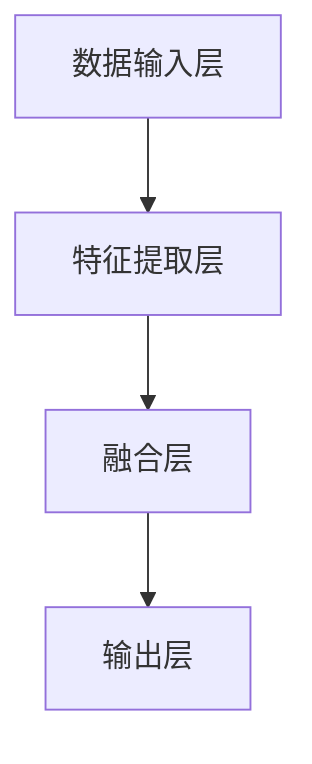

                 

关键词：多模态大模型，技术原理，OpenAI，成功因素，实战应用

> 摘要：本文将深入探讨多模态大模型的技术原理及其在现实世界中的应用。通过分析OpenAI的成功案例，我们将揭示多模态大模型在人工智能领域的重要地位，并展望其未来的发展趋势和挑战。

## 1. 背景介绍

随着人工智能技术的迅猛发展，多模态大模型逐渐成为研究的热点。多模态大模型能够整合不同类型的数据，如文本、图像、音频等，从而实现对复杂信息的处理和生成。这一技术不仅为人工智能领域带来了新的可能性，也为各行各业的应用提供了强大的工具。

### 1.1 多模态大模型的定义与意义

多模态大模型是指能够处理多种数据类型的人工智能模型。它不仅能够理解文本，还能够理解图像、音频等多种数据形式。多模态大模型的意义在于：

- 提高信息处理的效率和准确性。
- 实现跨模态的信息转换和融合。
- 为人工智能应用提供更广泛的能力。

### 1.2 多模态大模型的发展历程

多模态大模型的发展经历了从简单的单一模态模型到复杂的混合模态模型的演变。早期的多模态模型主要是将不同模态的数据进行简单的叠加或融合，而现代的多模态大模型则能够通过深度学习等技术实现更高层次的信息处理。

## 2. 核心概念与联系

### 2.1 多模态大模型的核心概念

多模态大模型的核心概念包括：

- **数据融合**：将不同类型的数据进行整合。
- **特征提取**：从多模态数据中提取有用的特征。
- **模型训练**：使用大量多模态数据进行模型训练。
- **模型评估**：评估模型在不同模态上的性能。

### 2.2 多模态大模型的架构

多模态大模型的架构通常包括以下几个部分：

- **数据输入层**：接收不同类型的数据。
- **特征提取层**：提取多模态数据中的特征。
- **融合层**：将不同模态的特征进行融合。
- **输出层**：生成预测结果或生成文本、图像等。

下面是一个简单的Mermaid流程图，展示了多模态大模型的基本架构：



## 3. 核心算法原理 & 具体操作步骤

### 3.1 算法原理概述

多模态大模型的算法原理主要包括以下几个方面：

- **深度学习**：通过多层神经网络对数据进行处理。
- **注意力机制**：在特征提取和融合过程中引入注意力机制，提高模型对重要信息的关注。
- **循环神经网络（RNN）**：用于处理序列数据，如文本。
- **生成对抗网络（GAN）**：用于生成高质量的图像或文本。

### 3.2 算法步骤详解

多模态大模型的算法步骤可以分为以下几个阶段：

1. **数据预处理**：对输入的多模态数据进行预处理，包括数据清洗、归一化等。
2. **特征提取**：使用卷积神经网络（CNN）提取图像特征，使用循环神经网络（RNN）提取文本特征。
3. **特征融合**：将提取的图像和文本特征进行融合，可以使用加和、拼接等方法。
4. **模型训练**：使用融合后的特征数据对模型进行训练。
5. **模型评估**：使用验证集对模型进行评估，调整模型参数。
6. **预测生成**：使用训练好的模型对新的多模态数据进行预测或生成。

### 3.3 算法优缺点

多模态大模型的优点包括：

- 能够处理多种类型的数据，提高信息处理的效率和准确性。
- 实现跨模态的信息转换和融合，具有广泛的应用前景。

缺点包括：

- 需要大量的训练数据，数据获取和处理成本较高。
- 模型复杂度较高，训练和推理时间较长。

### 3.4 算法应用领域

多模态大模型的应用领域非常广泛，包括但不限于：

- **计算机视觉**：图像识别、图像生成等。
- **自然语言处理**：文本生成、机器翻译等。
- **语音识别**：语音识别、语音合成等。
- **医疗健康**：医疗图像分析、疾病预测等。

## 4. 数学模型和公式 & 详细讲解 & 举例说明

### 4.1 数学模型构建

多模态大模型的数学模型通常包括以下几个部分：

- **输入层**：表示不同类型的数据，如文本、图像等。
- **特征提取层**：使用卷积神经网络（CNN）提取图像特征，使用循环神经网络（RNN）提取文本特征。
- **融合层**：将提取的图像和文本特征进行融合。
- **输出层**：生成预测结果或生成文本、图像等。

下面是一个简单的数学模型示例：

$$
Z = f(\text{image\_feature}, \text{text\_feature})
$$

其中，$f$ 表示融合函数，$\text{image\_feature}$ 和 $\text{text\_feature}$ 分别表示提取的图像和文本特征。

### 4.2 公式推导过程

多模态大模型的公式推导过程通常涉及以下几个方面：

- **卷积神经网络（CNN）**：用于提取图像特征。
- **循环神经网络（RNN）**：用于提取文本特征。
- **注意力机制**：用于特征融合。

以下是卷积神经网络（CNN）的公式推导过程：

$$
h_{ij}^l = \text{ReLU}(\sum_{k} w_{ik}^l h_{kj}^{l-1} + b_l)
$$

其中，$h_{ij}^l$ 表示第$l$层的第$i$个图像特征和第$j$个文本特征的加权和，$w_{ik}^l$ 和 $b_l$ 分别表示权重和偏置。

### 4.3 案例分析与讲解

以下是一个简单的多模态大模型案例：

- **输入**：一个图像和一段文本。
- **目标**：预测图像中的物体类别。

使用卷积神经网络（CNN）提取图像特征，使用循环神经网络（RNN）提取文本特征，然后将两种特征进行融合，最后使用全连接层生成预测结果。

具体步骤如下：

1. **数据预处理**：对输入的图像和文本数据进行预处理。
2. **特征提取**：
   - 图像特征：使用卷积神经网络（CNN）提取图像特征。
   - 文本特征：使用循环神经网络（RNN）提取文本特征。
3. **特征融合**：将提取的图像和文本特征进行融合。
4. **预测生成**：使用融合后的特征数据生成预测结果。

## 5. 项目实践：代码实例和详细解释说明

### 5.1 开发环境搭建

在开始编写代码之前，我们需要搭建一个合适的开发环境。以下是一个基本的开发环境搭建步骤：

1. 安装Python：Python是多模态大模型开发的主要语言，确保安装了Python 3.7及以上版本。
2. 安装TensorFlow：TensorFlow是一个强大的开源深度学习框架，用于构建和训练多模态大模型。使用pip安装：
   ```bash
   pip install tensorflow
   ```
3. 安装其他依赖：根据具体项目需求，安装其他必要的库和依赖。

### 5.2 源代码详细实现

以下是多模态大模型的一个简单实现示例：

```python
import tensorflow as tf
from tensorflow.keras.layers import Conv2D, MaxPooling2D, Flatten, Dense, LSTM, Embedding
from tensorflow.keras.models import Model

# 定义模型结构
input_image = tf.keras.layers.Input(shape=(224, 224, 3))
input_text = tf.keras.layers.Input(shape=(100,))

# 图像特征提取
image_conv = Conv2D(32, (3, 3), activation='relu')(input_image)
image_pool = MaxPooling2D((2, 2))(image_conv)
image_flat = Flatten()(image_pool)

# 文本特征提取
text_embedding = Embedding(10000, 32)(input_text)
text_lstm = LSTM(32)(text_embedding)

# 特征融合
merged = tf.keras.layers.concatenate([image_flat, text_lstm])

# 输出层
output = Dense(1, activation='sigmoid')(merged)

# 构建模型
model = Model(inputs=[input_image, input_text], outputs=output)

# 编译模型
model.compile(optimizer='adam', loss='binary_crossentropy', metrics=['accuracy'])

# 模型可视化
model.summary()
```

### 5.3 代码解读与分析

以上代码实现了一个简单多模态大模型，用于分类任务。以下是代码的详细解读：

1. **导入库**：首先导入所需的TensorFlow库和其他依赖。
2. **定义输入层**：定义图像输入层和文本输入层。
3. **图像特征提取**：使用卷积神经网络（CNN）对图像数据进行处理，包括卷积、激活函数和池化操作。
4. **文本特征提取**：使用嵌入层和循环神经网络（LSTM）对文本数据进行处理。
5. **特征融合**：将提取的图像和文本特征进行融合。
6. **输出层**：使用全连接层生成预测结果。
7. **构建模型**：使用输入层和输出层构建完整的模型。
8. **编译模型**：设置优化器、损失函数和评估指标，准备训练模型。
9. **模型可视化**：输出模型结构，方便理解和分析。

### 5.4 运行结果展示

在实际应用中，我们需要使用训练好的模型对新的数据进行预测。以下是一个简单的运行示例：

```python
# 准备测试数据
test_image = np.random.rand(1, 224, 224, 3)
test_text = np.random.rand(1, 100)

# 预测结果
prediction = model.predict([test_image, test_text])

# 输出预测结果
print(prediction)
```

以上代码将生成一个预测结果，用于分类任务。在实际应用中，需要根据具体任务调整模型的参数和超参数，以提高预测准确性。

## 6. 实际应用场景

多模态大模型在实际应用中具有广泛的应用场景，以下是一些典型的应用案例：

### 6.1 计算机视觉

- **图像识别**：使用多模态大模型对图像进行分类，如人脸识别、物体识别等。
- **图像生成**：利用多模态大模型生成高质量的图像，如人脸生成、风景生成等。

### 6.2 自然语言处理

- **文本生成**：使用多模态大模型生成高质量的文本，如文章生成、对话生成等。
- **机器翻译**：利用多模态大模型实现跨语言的文本翻译。

### 6.3 语音识别

- **语音识别**：使用多模态大模型识别语音中的文本内容，如语音助手、语音控制等。
- **语音合成**：利用多模态大模型生成自然流畅的语音。

### 6.4 医疗健康

- **医疗图像分析**：使用多模态大模型对医疗图像进行分类和诊断，如癌症检测、疾病预测等。
- **健康监测**：利用多模态大模型对患者的健康数据进行监测和分析。

### 6.5 教育

- **个性化教育**：使用多模态大模型为学生提供个性化的学习建议和资源。
- **教育游戏**：利用多模态大模型开发互动式教育游戏，提高学生的学习兴趣。

## 7. 未来应用展望

随着人工智能技术的不断发展，多模态大模型的应用前景将更加广阔。未来可能的发展趋势包括：

### 7.1 数据融合的进一步提升

通过引入更多的数据源和先进的融合技术，多模态大模型的数据处理能力将得到进一步提升。

### 7.2 模型压缩与优化

为了提高模型的实时性和部署效率，模型压缩与优化技术将成为研究的热点。

### 7.3 跨领域应用

多模态大模型将在更多领域得到应用，如自动驾驶、金融分析、社交媒体等。

### 7.4 开放平台与开源生态

随着多模态大模型的发展，开放平台和开源生态将变得更加繁荣，为研究人员和开发者提供更多的资源和工具。

## 8. 工具和资源推荐

### 8.1 学习资源推荐

- **论文集**：《多模态学习综述》等
- **在线课程**：多模态学习、深度学习等
- **书籍**：《深度学习》、《多模态学习》等

### 8.2 开发工具推荐

- **框架**：TensorFlow、PyTorch等
- **数据集**：ImageNet、Common Crawl等
- **工具**：Jupyter Notebook、PyCharm等

### 8.3 相关论文推荐

- **论文1**：A Survey on Multimodal Learning
- **论文2**：Deep Learning for Multimodal Sensor Data Analysis
- **论文3**：Multimodal Learning with Attention Mechanisms

## 9. 总结：未来发展趋势与挑战

### 9.1 研究成果总结

多模态大模型在人工智能领域取得了显著的研究成果，为处理和生成复杂信息提供了强大的工具。

### 9.2 未来发展趋势

随着技术的不断进步，多模态大模型将在更多领域得到应用，数据处理能力将得到进一步提升。

### 9.3 面临的挑战

多模态大模型在数据获取、模型训练和优化等方面仍面临挑战，需要进一步的研究和探索。

### 9.4 研究展望

未来，多模态大模型将在人工智能领域发挥更加重要的作用，为各行各业的应用提供创新解决方案。

## 10. 附录：常见问题与解答

### 10.1 多模态大模型与单一模态模型的区别是什么？

多模态大模型能够处理多种类型的数据，如文本、图像、音频等，而单一模态模型仅能处理特定类型的数据。多模态大模型通过整合不同类型的数据，提高了信息处理的效率和准确性。

### 10.2 多模态大模型如何进行特征提取？

多模态大模型通常使用不同的神经网络结构对文本、图像等数据进行特征提取。例如，使用卷积神经网络（CNN）提取图像特征，使用循环神经网络（RNN）提取文本特征，然后对提取的特征进行融合。

### 10.3 多模态大模型在哪些领域有实际应用？

多模态大模型在计算机视觉、自然语言处理、语音识别、医疗健康等领域有广泛的应用，如图像识别、文本生成、语音合成、医疗图像分析等。

### 10.4 多模态大模型的训练过程如何进行？

多模态大模型的训练过程包括数据预处理、特征提取、特征融合、模型训练和模型评估等步骤。通过训练大量的多模态数据，模型能够学习到有效的特征表示，并提高预测准确性。

### 10.5 多模态大模型在未来的发展趋势是什么？

未来，多模态大模型将向更高层次的信息处理方向发展，如引入更多数据源、优化模型结构、提高数据处理效率等。此外，多模态大模型将在更多领域得到应用，推动人工智能技术的发展。

