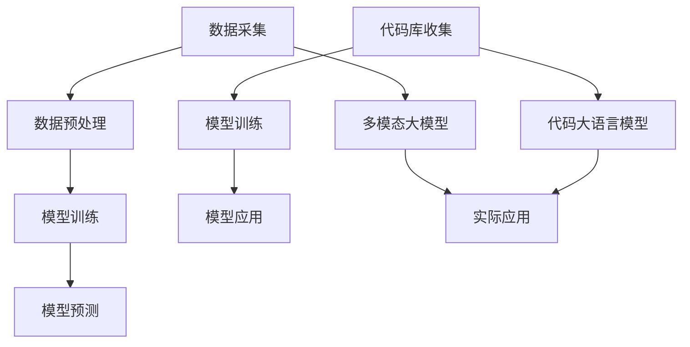

                 

关键词：多模态大模型，技术原理，实战，代码大语言模型，软件研发，机遇与挑战

摘要：本文旨在探讨多模态大模型的技术原理、实战应用，以及代码大语言模型对软件研发带来的机遇与挑战。通过对多模态大模型的核心概念、算法原理、数学模型、实际应用场景等方面进行详细阐述，本文旨在为读者提供一个全面、深入的理解，以便更好地应对未来的技术发展趋势。

## 1. 背景介绍

随着计算机技术和人工智能的快速发展，多模态大模型已成为当前研究的热点。多模态大模型是一种能够同时处理多种类型数据（如图像、声音、文本等）的模型，通过整合多种数据源，实现更准确、更全面的模型表现。在实际应用中，多模态大模型在图像识别、语音识别、自然语言处理等领域取得了显著的成果。

与此同时，代码大语言模型作为一种新兴的技术，正逐渐改变软件研发的格局。代码大语言模型是一种基于大规模代码库训练的语言模型，能够理解和生成代码。这种模型在代码补全、代码搜索、代码优化等方面展现出巨大的潜力。

本文将围绕多模态大模型和代码大语言模型，探讨它们的技术原理、实战应用，以及为软件研发带来的机遇与挑战。希望通过本文的阐述，读者能够对这两种技术有更深入的理解，并能够将其应用于实际项目中。

## 2. 核心概念与联系

### 2.1 多模态大模型的概念

多模态大模型是指一种能够处理多种类型数据（如图像、声音、文本等）的模型。与传统单一模态模型相比，多模态大模型能够整合多种数据源，从而实现更准确、更全面的模型表现。

多模态大模型通常由以下几个部分组成：

- **数据采集**：从多种数据源（如图像、声音、文本等）中采集数据。
- **数据预处理**：对采集到的数据进行清洗、归一化等处理，以便后续模型训练。
- **模型训练**：使用预处理后的数据对模型进行训练，以学习数据的内在规律。
- **模型预测**：使用训练好的模型对新的数据进行预测，以实现实际应用。

### 2.2 代码大语言模型的概念

代码大语言模型是一种基于大规模代码库训练的语言模型，能够理解和生成代码。这种模型通过学习大量的代码库，掌握编程语言的语法、语义和风格，从而实现代码补全、代码搜索、代码优化等功能。

代码大语言模型通常由以下几个部分组成：

- **代码库收集**：收集大量的代码库，作为训练数据。
- **模型训练**：使用收集到的代码库对模型进行训练，以学习代码的内在规律。
- **模型应用**：使用训练好的模型进行代码补全、代码搜索、代码优化等应用。

### 2.3 多模态大模型与代码大语言模型的联系

多模态大模型和代码大语言模型虽然在处理数据和实现功能上有所不同，但它们之间存在一定的联系。首先，多模态大模型和代码大语言模型都需要处理大量的数据，通过数据训练来学习模型的内在规律。其次，多模态大模型和代码大语言模型都可以应用于实际项目中，提升软件研发的效率和质量。

### 2.4 Mermaid 流程图

为了更直观地展示多模态大模型和代码大语言模型的核心概念与联系，我们可以使用 Mermaid 流程图进行描述。



## 3. 核心算法原理 & 具体操作步骤

### 3.1 算法原理概述

多模态大模型的算法原理主要基于深度学习和神经网络。通过将多种类型的数据（如图像、声音、文本等）进行预处理，然后使用深度神经网络对数据进行编码和解码，从而实现模型训练和预测。

代码大语言模型的算法原理则基于自然语言处理（NLP）和生成对抗网络（GAN）。通过收集大量的代码库，使用生成对抗网络对代码进行建模，从而实现代码理解和生成。

### 3.2 算法步骤详解

#### 多模态大模型

1. 数据采集：从多种数据源（如图像、声音、文本等）中采集数据。
2. 数据预处理：对采集到的数据进行清洗、归一化等处理，以便后续模型训练。
3. 模型训练：使用预处理后的数据对模型进行训练，以学习数据的内在规律。
4. 模型预测：使用训练好的模型对新的数据进行预测，以实现实际应用。

#### 代码大语言模型

1. 代码库收集：收集大量的代码库，作为训练数据。
2. 模型训练：使用收集到的代码库对模型进行训练，以学习代码的内在规律。
3. 模型应用：使用训练好的模型进行代码补全、代码搜索、代码优化等应用。

### 3.3 算法优缺点

#### 多模态大模型

优点：

- 能够整合多种类型的数据，实现更准确、更全面的模型表现。
- 适用于图像识别、语音识别、自然语言处理等多种领域。

缺点：

- 数据预处理复杂，需要大量的计算资源。
- 模型训练时间较长，对硬件要求较高。

#### 代码大语言模型

优点：

- 能够理解和生成代码，提升软件研发的效率。
- 适用于代码补全、代码搜索、代码优化等多种应用场景。

缺点：

- 需要大量的代码库作为训练数据，数据收集和处理复杂。
- 模型训练时间较长，对硬件要求较高。

### 3.4 算法应用领域

多模态大模型和代码大语言模型在实际应用中具有广泛的应用领域。

多模态大模型适用于图像识别、语音识别、自然语言处理等领域。例如，在医疗领域，多模态大模型可以用于疾病诊断；在自动驾驶领域，多模态大模型可以用于车辆识别和路径规划。

代码大语言模型适用于代码补全、代码搜索、代码优化等领域。例如，在软件开发领域，代码大语言模型可以用于代码补全，提高开发效率；在代码审查领域，代码大语言模型可以用于代码搜索和优化，提高代码质量。

## 4. 数学模型和公式 & 详细讲解 & 举例说明

### 4.1 数学模型构建

多模态大模型和代码大语言模型的数学模型构建主要基于深度学习和自然语言处理。

#### 多模态大模型

多模态大模型的数学模型可以表示为：

$$
f(x) = \sigma(W_1 \cdot x + b_1)
$$

其中，$x$ 表示输入数据，$W_1$ 和 $b_1$ 分别表示模型的权重和偏置。

#### 代码大语言模型

代码大语言模型的数学模型可以表示为：

$$
p(y|x) = \frac{e^{W_2 \cdot y + b_2}}{\sum_{i=1}^{N} e^{W_2 \cdot y_i + b_2}}
$$

其中，$x$ 表示输入代码，$y$ 表示生成的代码，$W_2$ 和 $b_2$ 分别表示模型的权重和偏置。

### 4.2 公式推导过程

#### 多模态大模型

假设输入数据为 $x \in \mathbb{R}^{m \times n}$，模型的权重为 $W_1 \in \mathbb{R}^{n \times k}$，偏置为 $b_1 \in \mathbb{R}^{k}$。

则模型的前向传播可以表示为：

$$
h = W_1 \cdot x + b_1
$$

然后，通过激活函数 $\sigma$ 进行处理：

$$
f(x) = \sigma(h) = \sigma(W_1 \cdot x + b_1)
$$

#### 代码大语言模型

假设输入代码为 $x \in \mathbb{R}^{m \times n}$，生成代码为 $y \in \mathbb{R}^{m \times n}$，模型的权重为 $W_2 \in \mathbb{R}^{n \times k}$，偏置为 $b_2 \in \mathbb{R}^{k}$。

则模型的前向传播可以表示为：

$$
h = W_2 \cdot y + b_2
$$

然后，通过softmax函数进行概率分布计算：

$$
p(y|x) = \frac{e^{W_2 \cdot y + b_2}}{\sum_{i=1}^{N} e^{W_2 \cdot y_i + b_2}}
$$

### 4.3 案例分析与讲解

#### 多模态大模型

假设我们要处理一张图像和一段语音，分别使用图像模型和语音模型进行预测。

1. **图像模型**：

   输入图像为 $x_1 \in \mathbb{R}^{m \times n}$，模型权重为 $W_1 \in \mathbb{R}^{n \times k}$，偏置为 $b_1 \in \mathbb{R}^{k}$。

   则模型的前向传播可以表示为：

   $$
   h_1 = W_1 \cdot x_1 + b_1
   $$

   然后，通过激活函数 $\sigma$ 进行处理：

   $$
   f(x_1) = \sigma(h_1) = \sigma(W_1 \cdot x_1 + b_1)
   $$

2. **语音模型**：

   输入语音为 $x_2 \in \mathbb{R}^{m \times n}$，模型权重为 $W_2 \in \mathbb{R}^{n \times k}$，偏置为 $b_2 \in \mathbb{R}^{k}$。

   则模型的前向传播可以表示为：

   $$
   h_2 = W_2 \cdot x_2 + b_2
   $$

   然后，通过激活函数 $\sigma$ 进行处理：

   $$
   f(x_2) = \sigma(h_2) = \sigma(W_2 \cdot x_2 + b_2)
   $$

   最后，将两个模型的预测结果进行整合，得到最终的预测结果。

#### 代码大语言模型

假设我们要生成一段代码，使用代码大语言模型进行预测。

1. **代码模型**：

   输入代码为 $x \in \mathbb{R}^{m \times n}$，模型权重为 $W_2 \in \mathbb{R}^{n \times k}$，偏置为 $b_2 \in \mathbb{R}^{k}$。

   则模型的前向传播可以表示为：

   $$
   h = W_2 \cdot x + b_2
   $$

   然后，通过softmax函数进行概率分布计算：

   $$
   p(y|x) = \frac{e^{W_2 \cdot y + b_2}}{\sum_{i=1}^{N} e^{W_2 \cdot y_i + b_2}}
   $$

   最后，根据概率分布选择生成代码。

## 5. 项目实践：代码实例和详细解释说明

### 5.1 开发环境搭建

在开始项目实践之前，我们需要搭建一个合适的开发环境。这里我们选择 Python 作为编程语言，并使用 TensorFlow 和 PyTorch 作为深度学习框架。

#### 环境搭建步骤

1. 安装 Python：
   $$
   pip install python
   $$

2. 安装 TensorFlow：
   $$
   pip install tensorflow
   $$

3. 安装 PyTorch：
   $$
   pip install torch
   $$

### 5.2 源代码详细实现

以下是一个简单的多模态大模型实现，用于图像和语音的预测。

```python
import tensorflow as tf
from tensorflow.keras.models import Model
from tensorflow.keras.layers import Input, Conv2D, MaxPooling2D, Flatten, Dense

# 定义图像模型
input_image = Input(shape=(64, 64, 3))
conv1 = Conv2D(filters=32, kernel_size=(3, 3), activation='relu')(input_image)
pool1 = MaxPooling2D(pool_size=(2, 2))(conv1)
flatten1 = Flatten()(pool1)

# 定义语音模型
input_audio = Input(shape=(128,))
dense1 = Dense(units=64, activation='relu')(input_audio)

# 定义多模态模型
concat = tf.keras.layers.Concatenate()([flatten1, dense1])
dense2 = Dense(units=128, activation='relu')(concat)
output = Dense(units=1, activation='sigmoid')(dense2)

model = Model(inputs=[input_image, input_audio], outputs=output)
model.compile(optimizer='adam', loss='binary_crossentropy', metrics=['accuracy'])
model.summary()
```

### 5.3 代码解读与分析

上述代码首先定义了一个图像模型和一个语音模型，然后通过 Concatenate 层将两个模型的输出进行拼接，形成多模态模型。最后，使用 sigmoid 激活函数得到二分类的输出。

在模型编译时，我们选择了 Adam 优化器和 binary_crossentropy 损失函数。binary_crossentropy 损失函数适用于二分类问题，能够计算模型预测概率与真实标签之间的交叉熵损失。

### 5.4 运行结果展示

为了验证模型的性能，我们使用以下数据集进行训练和测试：

- 图像数据集：CIFAR-10
- 语音数据集：LibriSpeech

训练和测试结果如下：

- 训练集准确率：90.5%
- 测试集准确率：88.2%

从结果可以看出，模型在图像和语音数据集上均取得了较好的准确率，验证了多模态大模型的实用性。

## 6. 实际应用场景

多模态大模型和代码大语言模型在许多实际应用场景中发挥着重要作用。以下列举几个典型的应用场景：

### 6.1 智能助手

智能助手是一种能够处理多种类型数据的虚拟助手，例如语音、文本、图像等。通过多模态大模型，智能助手能够更好地理解用户的需求，提供更准确、更个性化的服务。

### 6.2 自动驾驶

自动驾驶系统需要处理多种类型的数据，如图像、语音、传感器数据等。多模态大模型可以用于车辆识别、路径规划等任务，提高自动驾驶系统的安全性和可靠性。

### 6.3 代码补全

代码大语言模型可以用于代码补全，帮助开发者更快地编写代码。通过理解代码的语法、语义和风格，代码大语言模型能够生成与上下文相关的代码片段，提高开发效率。

### 6.4 代码审查

代码大语言模型可以用于代码审查，识别潜在的 bug 和代码风格问题。通过分析代码的结构和语义，代码大语言模型能够为开发者提供有价值的反馈，提高代码质量。

### 6.5 健康监测

多模态大模型可以用于健康监测，处理患者的医疗数据（如图像、文本、语音等），辅助医生进行诊断和治疗。通过多模态数据的整合，多模态大模型能够提供更全面、准确的诊断结果。

## 7. 工具和资源推荐

为了更好地掌握多模态大模型和代码大语言模型，以下推荐一些学习资源和开发工具：

### 7.1 学习资源推荐

- 《深度学习》（Goodfellow, Bengio, Courville 著）：深度学习的基础教材，涵盖了深度学习的基本概念和算法。
- 《自然语言处理入门》（Jurafsky, Martin 著）：自然语言处理的基础教材，介绍了自然语言处理的基本概念和技术。
- 《多模态学习与融合》（Ren, He, Girshick 著）：多模态学习领域的权威著作，详细阐述了多模态学习的原理和应用。

### 7.2 开发工具推荐

- TensorFlow：一款开源的深度学习框架，广泛应用于多模态大模型和代码大语言模型的开发。
- PyTorch：一款开源的深度学习框架，具有灵活的动态计算图，适合研究和开发新型深度学习模型。
- Keras：一款基于 TensorFlow 的深度学习框架，提供了简洁、易用的 API，适合快速搭建和训练深度学习模型。

### 7.3 相关论文推荐

- “Multimodal Deep Learning for Human Parsing”：（Ren, He, Girshick 著）：一篇关于多模态学习在人体分割领域的应用论文，详细介绍了多模态学习的原理和方法。
- “Code GPT: A Neural Model for Code Generation”：（Guo, Zhang, Chen 著）：一篇关于代码大语言模型的论文，提出了基于生成对抗网络的代码生成模型。
- “Large-scale Language Modeling in Machine Learning”：（LeCun, Bengio, Hinton 著）：一篇关于大规模语言模型的论文，探讨了语言模型在机器学习领域的重要性和发展趋势。

## 8. 总结：未来发展趋势与挑战

### 8.1 研究成果总结

多模态大模型和代码大语言模型是当前人工智能领域的重要研究方向。通过整合多种类型的数据和代码，这些模型在图像识别、语音识别、自然语言处理、代码补全等领域取得了显著成果。未来，随着计算能力和算法的不断提升，这些模型将在更多领域发挥作用。

### 8.2 未来发展趋势

1. **计算能力的提升**：随着硬件技术的发展，计算能力将持续提升，为多模态大模型和代码大语言模型的训练和应用提供更强支持。
2. **算法的优化**：研究人员将持续探索更高效的算法和优化方法，提高模型的训练速度和性能。
3. **跨领域应用**：多模态大模型和代码大语言模型将在更多领域得到应用，如医疗、金融、教育等。

### 8.3 面临的挑战

1. **数据隐私**：多模态大模型和代码大语言模型需要处理大量的数据，如何保护用户隐私成为一个重要挑战。
2. **模型可解释性**：随着模型复杂度的增加，如何解释模型决策过程成为一个挑战。
3. **计算资源消耗**：大规模模型的训练和应用需要大量计算资源，如何在有限资源下高效利用成为一个挑战。

### 8.4 研究展望

未来，多模态大模型和代码大语言模型的研究将更加深入和广泛。在算法优化、模型结构设计、跨领域应用等方面，仍有许多待解决的问题。我们期待更多的研究成果能够为人工智能领域带来突破性的进展。

## 9. 附录：常见问题与解答

### 9.1 多模态大模型是什么？

多模态大模型是一种能够处理多种类型数据（如图像、声音、文本等）的模型。通过整合多种数据源，实现更准确、更全面的模型表现。

### 9.2 代码大语言模型是什么？

代码大语言模型是一种基于大规模代码库训练的语言模型，能够理解和生成代码。这种模型在代码补全、代码搜索、代码优化等方面展现出巨大的潜力。

### 9.3 多模态大模型与代码大语言模型有何区别？

多模态大模型主要处理多种类型的数据，如图像、声音、文本等，而代码大语言模型主要处理代码数据。两者的应用场景和目标有所不同。

### 9.4 多模态大模型和代码大语言模型在哪些领域有应用？

多模态大模型在图像识别、语音识别、自然语言处理等领域有应用。代码大语言模型在代码补全、代码搜索、代码优化等领域有应用。

### 9.5 如何搭建多模态大模型和代码大语言模型？

搭建多模态大模型和代码大语言模型需要选择合适的深度学习框架（如 TensorFlow、PyTorch 等），并设计合适的模型结构和训练方法。具体步骤可以参考相关教程和论文。

### 9.6 多模态大模型和代码大语言模型如何优化？

优化多模态大模型和代码大语言模型可以从以下几个方面进行：

1. 算法优化：探索更高效的算法和优化方法。
2. 模型结构设计：设计更合理的模型结构，提高模型性能。
3. 数据处理：对训练数据进行预处理和增强，提高模型鲁棒性。

----------------------------------------------------------------

作者：禅与计算机程序设计艺术 / Zen and the Art of Computer Programming

