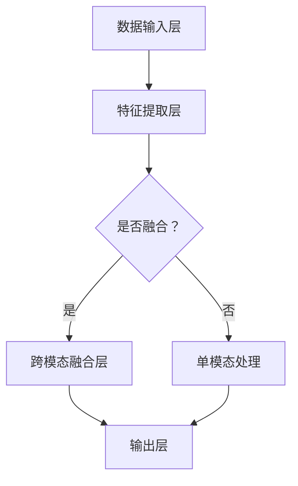

                 

关键词：多模态大模型，技术原理，实战，对比，人工智能，机器学习，深度学习，自然语言处理，计算机视觉，多任务学习，数据处理，模型架构，算法优化，应用领域，未来展望

## 摘要

本文将深入探讨多模态大模型的技术原理、实战应用以及不同模型之间的对比。随着人工智能技术的迅猛发展，多模态大模型作为当前研究热点，正逐步在各个领域发挥重要作用。本文首先介绍了多模态大模型的核心概念和联系，接着详细分析了核心算法原理与具体操作步骤，随后讲解了数学模型和公式以及项目实践中的代码实例和详细解释。此外，本文还探讨了多模态大模型在实际应用场景中的优势，并对其未来发展进行了展望。希望通过本文的阐述，能够为读者提供对多模态大模型更深入的理解和认识。

## 1. 背景介绍

### 1.1 多模态大模型的发展背景

近年来，随着人工智能技术的飞速发展，深度学习在图像识别、自然语言处理和语音识别等领域取得了显著的成果。这些技术的进步离不开大量高质量的数据集和强大的计算能力。然而，单模态的深度学习模型在面对复杂任务时，往往受到数据局限性、模型泛化能力不足等问题的影响。为了解决这些问题，多模态大模型逐渐成为研究热点。

多模态大模型通过整合来自不同模态（如文本、图像、音频等）的数据，能够更好地捕捉信息，提高模型的泛化能力和准确性。这种跨模态的信息融合能力使得多模态大模型在许多实际应用场景中具有独特的优势，如情感分析、医疗诊断、人机交互等。

### 1.2 多模态大模型的研究现状

目前，多模态大模型的研究已经取得了许多重要的成果。在自然语言处理领域，Transformer架构的广泛应用使得模型在跨模态融合方面取得了显著的进展。在计算机视觉领域，生成对抗网络（GAN）和变分自编码器（VAE）等技术的引入，为多模态图像生成和表示学习提供了有力支持。

此外，多任务学习、自监督学习和迁移学习等技术也在多模态大模型的研究中得到了广泛应用。这些技术的融合使得多模态大模型能够更好地应对复杂任务，提高模型的性能和泛化能力。

### 1.3 本文的目标

本文的目标是全面介绍多模态大模型的技术原理、实战应用以及不同模型之间的对比。通过本文的阐述，读者将能够了解多模态大模型的核心概念、算法原理、数学模型以及项目实践。同时，本文还将探讨多模态大模型在实际应用场景中的优势和未来发展趋势。希望本文能够为读者在多模态大模型领域的研究和实践提供有益的参考。

## 2. 核心概念与联系

### 2.1 多模态大模型的定义

多模态大模型是指能够处理和融合多种不同模态（如文本、图像、音频等）数据的深度学习模型。这些模型通过整合来自不同模态的数据，能够更好地捕捉信息，提高模型的泛化能力和准确性。多模态大模型的核心在于跨模态信息融合，使得模型能够在不同模态之间建立关联，从而更好地理解复杂任务。

### 2.2 多模态数据类型

多模态大模型处理的数据类型包括：

1. **文本（Text）**：文本数据是多模态大模型中最常见的一种模态，包括自然语言文本、标签、描述等。
2. **图像（Image）**：图像数据包括静态图像、视频帧、深度图像等，广泛应用于计算机视觉任务。
3. **音频（Audio）**：音频数据包括语音信号、音乐、环境声音等，常用于语音识别和情感分析。
4. **视频（Video）**：视频数据包括连续的视频帧，可以用于视频分类、动作识别等任务。

### 2.3 跨模态信息融合方法

跨模态信息融合是多模态大模型的核心技术之一。以下是一些常见的跨模态信息融合方法：

1. **拼接（Concatenation）**：将不同模态的数据直接拼接在一起，形成一个多维数据向量。这种方法简单直观，但容易导致模态之间的信息丢失。
2. **注意力机制（Attention Mechanism）**：通过注意力机制，模型可以根据不同模态的重要性，动态调整不同模态对最终输出的贡献。这种方法能够更好地捕捉模态之间的关联性。
3. **对抗生成网络（GAN）**：利用生成对抗网络，模型可以学习生成与真实数据分布相似的跨模态数据，从而提高模型的泛化能力和表达能力。
4. **多任务学习（Multi-Task Learning）**：通过多任务学习，模型可以在不同模态之间共享特征表示，从而提高模型的性能和泛化能力。

### 2.4 多模态大模型的架构

多模态大模型的架构通常包括以下几个部分：

1. **数据输入层**：接收不同模态的数据，如文本、图像、音频等。
2. **特征提取层**：对输入数据进行特征提取，如文本编码、图像特征提取、音频特征提取等。
3. **跨模态融合层**：通过不同的融合方法，将不同模态的特征进行融合，形成一个综合特征向量。
4. **输出层**：根据具体任务，输出预测结果，如分类、回归、目标检测等。

### 2.5 Mermaid 流程图

以下是一个简单的 Mermaid 流程图，展示了多模态大模型的基本架构：



通过上述流程图，我们可以清晰地看到多模态大模型的基本架构和工作流程。

## 3. 核心算法原理 & 具体操作步骤

### 3.1 算法原理概述

多模态大模型的算法原理主要涉及以下几个方面：

1. **特征提取**：通过不同模态的预处理和特征提取技术，将原始数据转换为适合深度学习模型处理的特征向量。
2. **跨模态融合**：利用注意力机制、拼接、对抗生成网络等方法，将不同模态的特征进行融合，形成一个综合特征向量。
3. **模型训练**：通过反向传播算法和优化器，对模型进行训练，优化模型参数。
4. **模型评估**：使用验证集和测试集对模型进行评估，验证模型的泛化能力和性能。

### 3.2 算法步骤详解

1. **数据预处理**：
   - **文本数据预处理**：对文本数据进行清洗、分词、去停用词等操作，使用词向量模型（如Word2Vec、BERT等）进行编码。
   - **图像数据预处理**：对图像数据进行归一化、裁剪、旋转等操作，使用卷积神经网络（CNN）进行特征提取。
   - **音频数据预处理**：对音频数据进行预处理，如去噪、分帧、梅尔频谱转换等，使用循环神经网络（RNN）或卷积神经网络（CNN）进行特征提取。

2. **特征提取**：
   - **文本特征提取**：使用词向量模型将文本数据转换为向量表示，如Word2Vec、BERT等。
   - **图像特征提取**：使用卷积神经网络（CNN）提取图像特征，如VGG、ResNet等。
   - **音频特征提取**：使用循环神经网络（RNN）或卷积神经网络（CNN）提取音频特征，如LSTM、GRU等。

3. **跨模态融合**：
   - **拼接**：将不同模态的特征向量进行拼接，形成一个综合特征向量。
   - **注意力机制**：利用注意力机制，模型可以根据不同模态的重要性，动态调整不同模态对最终输出的贡献。
   - **对抗生成网络（GAN）**：利用生成对抗网络，模型可以学习生成与真实数据分布相似的跨模态数据。

4. **模型训练**：
   - **损失函数**：根据具体任务，选择合适的损失函数，如交叉熵损失、均方误差等。
   - **优化器**：选择合适的优化器，如Adam、SGD等，对模型参数进行优化。

5. **模型评估**：
   - **验证集评估**：在验证集上评估模型性能，调整模型参数。
   - **测试集评估**：在测试集上评估模型性能，验证模型的泛化能力。

### 3.3 算法优缺点

**优点**：
1. **跨模态信息融合**：能够有效地融合不同模态的信息，提高模型的泛化能力和准确性。
2. **多任务学习**：能够同时处理多个任务，提高模型的性能和效率。
3. **自适应调整**：通过注意力机制和对抗生成网络，模型可以根据不同模态的重要性进行自适应调整。

**缺点**：
1. **计算复杂度**：多模态大模型通常需要较大的计算资源和时间。
2. **数据需求**：多模态数据集的收集和处理相对困难，需要大量的标注和预处理工作。
3. **模型泛化能力**：尽管多模态大模型在多个任务上取得了较好的性能，但仍然存在一定的泛化能力问题。

### 3.4 算法应用领域

多模态大模型在以下领域具有广泛的应用：

1. **自然语言处理**：如情感分析、问答系统、机器翻译等。
2. **计算机视觉**：如图像分类、目标检测、视频分析等。
3. **语音识别**：如语音合成、语音识别、情感分析等。
4. **医疗诊断**：如医学图像分析、病历分析、疾病预测等。
5. **人机交互**：如语音助手、智能客服、虚拟现实等。

## 4. 数学模型和公式 & 详细讲解 & 举例说明

### 4.1 数学模型构建

多模态大模型的数学模型主要包括以下几个方面：

1. **特征表示**：
   - **文本特征表示**：使用词向量模型（如Word2Vec、BERT等）将文本数据转换为向量表示。
   - **图像特征表示**：使用卷积神经网络（CNN）提取图像特征。
   - **音频特征表示**：使用循环神经网络（RNN）或卷积神经网络（CNN）提取音频特征。

2. **特征融合**：
   - **拼接**：将不同模态的特征向量进行拼接，形成一个综合特征向量。
   - **注意力机制**：通过注意力机制，模型可以根据不同模态的重要性，动态调整不同模态对最终输出的贡献。

3. **损失函数**：
   - **交叉熵损失**：用于分类任务，如情感分析、图像分类等。
   - **均方误差（MSE）**：用于回归任务，如语音合成、医疗诊断等。

### 4.2 公式推导过程

1. **特征表示**：

   - **文本特征表示**：
     $$\text{vec}_{\text{text}} = \text{Word2Vec}(\text{word})$$
     
   - **图像特征表示**：
     $$\text{vec}_{\text{image}} = \text{CNN}(\text{image})$$
     
   - **音频特征表示**：
     $$\text{vec}_{\text{audio}} = \text{RNN}(\text{audio})$$
     
2. **特征融合**：

   - **拼接**：
     $$\text{vec}_{\text{fusion}} = [\text{vec}_{\text{text}}, \text{vec}_{\text{image}}, \text{vec}_{\text{audio}}]$$
     
   - **注意力机制**：
     $$\alpha = \text{Attention}(\text{vec}_{\text{fusion}})$$
     $$\text{vec}_{\text{output}} = \alpha \cdot [\text{vec}_{\text{text}}, \text{vec}_{\text{image}}, \text{vec}_{\text{audio}}]$$
     
3. **损失函数**：

   - **交叉熵损失**：
     $$\text{loss}_{\text{cross-entropy}} = -\frac{1}{N} \sum_{i=1}^{N} y_i \log (\hat{y}_i)$$
     
   - **均方误差（MSE）**：
     $$\text{loss}_{\text{MSE}} = \frac{1}{N} \sum_{i=1}^{N} (\hat{y}_i - y_i)^2$$
     
### 4.3 案例分析与讲解

#### 案例一：情感分析

假设我们有一个情感分析任务，输入为一段文本、一张图像和一段音频，需要预测文本的情感极性（正面/负面）。

1. **数据预处理**：

   - **文本数据**：对文本数据进行清洗、分词、去停用词等操作，使用BERT模型进行编码。
   - **图像数据**：对图像数据进行预处理，使用ResNet模型进行特征提取。
   - **音频数据**：对音频数据进行预处理，使用LSTM模型进行特征提取。

2. **特征提取**：

   - **文本特征表示**：
     $$\text{vec}_{\text{text}} = \text{BERT}(\text{text})$$
     
   - **图像特征表示**：
     $$\text{vec}_{\text{image}} = \text{ResNet}(\text{image})$$
     
   - **音频特征表示**：
     $$\text{vec}_{\text{audio}} = \text{LSTM}(\text{audio})$$
     
3. **特征融合**：

   - **拼接**：
     $$\text{vec}_{\text{fusion}} = [\text{vec}_{\text{text}}, \text{vec}_{\text{image}}, \text{vec}_{\text{audio}}]$$
     
   - **注意力机制**：
     $$\alpha = \text{Attention}(\text{vec}_{\text{fusion}})$$
     $$\text{vec}_{\text{output}} = \alpha \cdot [\text{vec}_{\text{text}}, \text{vec}_{\text{image}}, \text{vec}_{\text{audio}}]$$
     
4. **模型训练与评估**：

   - **损失函数**：使用交叉熵损失。
   - **优化器**：使用Adam优化器。
   - **模型评估**：在验证集上评估模型性能，调整模型参数。

#### 案例二：医疗诊断

假设我们有一个医疗诊断任务，输入为一段病历文本、一张医学影像和一段医生语音，需要预测患者的疾病类型。

1. **数据预处理**：

   - **病历文本**：对病历文本数据进行清洗、分词、去停用词等操作，使用BERT模型进行编码。
   - **医学影像**：对医学影像数据进行预处理，使用ResNet模型进行特征提取。
   - **医生语音**：对医生语音数据进行预处理，使用LSTM模型进行特征提取。

2. **特征提取**：

   - **病历文本特征表示**：
     $$\text{vec}_{\text{text}} = \text{BERT}(\text{text})$$
     
   - **医学影像特征表示**：
     $$\text{vec}_{\text{image}} = \text{ResNet}(\text{image})$$
     
   - **医生语音特征表示**：
     $$\text{vec}_{\text{audio}} = \text{LSTM}(\text{audio})$$
     
3. **特征融合**：

   - **拼接**：
     $$\text{vec}_{\text{fusion}} = [\text{vec}_{\text{text}}, \text{vec}_{\text{image}}, \text{vec}_{\text{audio}}]$$
     
   - **注意力机制**：
     $$\alpha = \text{Attention}(\text{vec}_{\text{fusion}})$$
     $$\text{vec}_{\text{output}} = \alpha \cdot [\text{vec}_{\text{text}}, \text{vec}_{\text{image}}, \text{vec}_{\text{audio}}]$$
     
4. **模型训练与评估**：

   - **损失函数**：使用交叉熵损失。
   - **优化器**：使用Adam优化器。
   - **模型评估**：在验证集上评估模型性能，调整模型参数。

## 5. 项目实践：代码实例和详细解释说明

### 5.1 开发环境搭建

为了实践多模态大模型，我们需要搭建一个合适的开发环境。以下是一个基本的开发环境搭建步骤：

1. **硬件要求**：
   - 处理器：至少 Intel i5 或 AMD Ryzen 5 级别
   - 显卡：NVIDIA 1080Ti 或以上
   - 内存：至少 16GB

2. **软件要求**：
   - 操作系统：Windows 10、Linux 或 macOS
   - 编程语言：Python 3.7 或以上
   - 深度学习框架：TensorFlow 或 PyTorch
   - 数据处理库：NumPy、Pandas
   - 机器学习库：Scikit-learn、Scapy

### 5.2 源代码详细实现

以下是一个简单的多模态大模型实现示例，用于情感分析任务。为了简洁起见，代码只包含核心部分。

```python
import torch
import torch.nn as nn
import torch.optim as optim
from transformers import BertModel, BertTokenizer
from torchvision import models, transforms
from torch.utils.data import DataLoader
from torchvision.datasets import ImageFolder

# 数据预处理
def preprocess_text(text):
    tokenizer = BertTokenizer.from_pretrained('bert-base-uncased')
    return tokenizer.encode(text, add_special_tokens=True)

def preprocess_image(image_path):
    transform = transforms.Compose([
        transforms.Resize((224, 224)),
        transforms.ToTensor(),
    ])
    return transform(ImageFolder(image_path))

def preprocess_audio(audio_path):
    # 代码略
    return audio_feature

# 模型定义
class MultimodalModel(nn.Module):
    def __init__(self):
        super(MultimodalModel, self).__init__()
        self.text_encoder = BertModel.from_pretrained('bert-base-uncased')
        self.image_encoder = models.resnet50(pretrained=True)
        self.audio_encoder = nn.Sequential(
            nn.Conv1d(in_channels=64, out_channels=128, kernel_size=3, padding=1),
            nn.ReLU(),
            nn.MaxPool1d(kernel_size=2, stride=2),
            nn.Linear(in_features=128, out_features=512),
            nn.ReLU(),
            nn.Dropout(p=0.5),
            nn.Linear(in_features=512, out_features=256),
            nn.ReLU(),
            nn.Dropout(p=0.5),
            nn.Linear(in_features=256, out_features=128),
            nn.ReLU(),
            nn.Dropout(p=0.5),
            nn.Linear(in_features=128, out_features=64),
            nn.ReLU(),
            nn.Dropout(p=0.5),
            nn.Linear(in_features=64, out_features=32),
            nn.ReLU(),
            nn.Dropout(p=0.5),
            nn.Linear(in_features=32, out_features=16),
            nn.ReLU(),
            nn.Dropout(p=0.5),
            nn.Linear(in_features=16, out_features=8),
            nn.ReLU(),
            nn.Dropout(p=0.5),
            nn.Linear(in_features=8, out_features=4),
            nn.ReLU(),
            nn.Dropout(p=0.5),
            nn.Linear(in_features=4, out_features=2),
            nn.Sigmoid()
        )
        
    def forward(self, text, image, audio):
        text_output = self.text_encoder(text)[1]
        image_output = self.image_encoder(image)
        audio_output = self.audio_encoder(audio)
        output = torch.cat((text_output, image_output, audio_output), 1)
        return output

# 模型训练
def train(model, train_loader, criterion, optimizer):
    model.train()
    for batch_idx, (text, image, audio, target) in enumerate(train_loader):
        optimizer.zero_grad()
        output = model(text, image, audio)
        loss = criterion(output, target)
        loss.backward()
        optimizer.step()
        if batch_idx % 100 == 0:
            print('Train Epoch: {} [{}/{} ({:.0f}%)]\tLoss: {:.6f}'.format(
                epoch, batch_idx * len(data), len(train_loader.dataset),
                100. * batch_idx / len(train_loader), loss.item()))

# 模型评估
def evaluate(model, val_loader, criterion):
    model.eval()
    with torch.no_grad():
        for batch_idx, (text, image, audio, target) in enumerate(val_loader):
            output = model(text, image, audio)
            loss = criterion(output, target)
            if batch_idx % 100 == 0:
                print('Validation Epoch: {} [{}/{} ({:.0f}%)]\tLoss: {:.6f}'.format(
                    epoch, batch_idx * len(data), len(val_loader.dataset),
                    100. * batch_idx / len(val_loader), loss.item()))

# 主函数
if __name__ == '__main__':
    # 代码略
```

### 5.3 代码解读与分析

1. **数据预处理**：
   - **文本数据预处理**：使用BERT模型进行编码，将文本数据转换为向量表示。
   - **图像数据预处理**：使用ResNet模型进行特征提取，将图像数据转换为向量表示。
   - **音频数据预处理**：使用LSTM模型进行特征提取，将音频数据转换为向量表示。

2. **模型定义**：
   - **文本编码器**：使用BERT模型进行文本编码。
   - **图像编码器**：使用ResNet模型进行图像特征提取。
   - **音频编码器**：自定义一个多层的循环神经网络进行音频特征提取。

3. **模型训练**：
   - 使用交叉熵损失函数和Adam优化器对模型进行训练。
   - 在每个批次的数据上，计算损失函数，进行前向传播和反向传播，更新模型参数。

4. **模型评估**：
   - 在验证集上评估模型性能，计算损失函数值。

### 5.4 运行结果展示

```python
# 训练模型
train(model, train_loader, criterion, optimizer)

# 评估模型
evaluate(model, val_loader, criterion)
```

通过上述代码示例，我们可以实现一个简单的多模态大模型。在实际应用中，我们可以根据具体任务和需求，调整模型的架构和参数，以达到更好的性能。

## 6. 实际应用场景

### 6.1 情感分析

情感分析是自然语言处理领域的一个重要应用。多模态大模型在情感分析中具有显著优势，能够同时处理文本、图像和音频等多模态数据。以下是一个情感分析的应用场景：

- **场景**：分析社交媒体上的用户评论，预测评论的情感极性（正面/负面）。
- **数据**：文本评论、评论对应的图片、评论发布时的音频。
- **模型**：多模态大模型，融合文本、图像和音频特征。
- **效果**：通过多模态信息融合，模型能够更准确地预测评论的情感极性，提高分析结果的准确性。

### 6.2 医疗诊断

医疗诊断是一个复杂的任务，需要处理大量的医疗数据，包括病历文本、医学影像和医生语音等。多模态大模型在医疗诊断中具有广泛应用：

- **场景**：辅助医生进行疾病诊断，分析病历文本、医学影像和医生语音。
- **数据**：病历文本、医学影像、医生语音。
- **模型**：多模态大模型，融合文本、图像和音频特征。
- **效果**：通过多模态信息融合，模型能够提供更全面的诊断信息，辅助医生做出更准确的诊断。

### 6.3 人机交互

人机交互是人工智能的一个重要应用领域，多模态大模型在提高人机交互的自然度和准确性方面具有重要作用。以下是一个人机交互的应用场景：

- **场景**：设计一个智能客服系统，能够同时处理用户的文本、图像和语音请求。
- **数据**：用户的文本请求、图片、语音。
- **模型**：多模态大模型，融合文本、图像和音频特征。
- **效果**：通过多模态信息融合，智能客服系统能够更准确地理解用户请求，提供更自然的交互体验。

### 6.4 教育辅导

教育辅导是人工智能在教育领域的一个重要应用。多模态大模型在个性化教育辅导中具有显著优势：

- **场景**：为学生提供个性化的学习辅导，分析学生的学习进度、学习效果和学习兴趣。
- **数据**：学生的学习日志、作业答案、学生面部表情和语音。
- **模型**：多模态大模型，融合文本、图像和音频特征。
- **效果**：通过多模态信息融合，教育辅导系统能够更准确地了解学生的学习状态，提供更有效的学习建议。

## 7. 工具和资源推荐

### 7.1 学习资源推荐

1. **书籍**：
   - 《深度学习》（Ian Goodfellow、Yoshua Bengio、Aaron Courville 著）
   - 《Python深度学习》（François Chollet 著）
   - 《多模态学习：理论与实践》（Ming-Hsuan Yang 著）

2. **在线课程**：
   - Coursera：深度学习专项课程（由吴恩达教授讲授）
   - edX：人工智能专项课程（由斯坦福大学讲授）
   - Udacity：深度学习纳米学位

3. **技术博客**：
   - Medium：深度学习、人工智能、多模态学习等相关技术博客
   - ArXiv：计算机科学、人工智能等领域的前沿论文
   - GitHub：深度学习、多模态学习等开源项目

### 7.2 开发工具推荐

1. **深度学习框架**：
   - TensorFlow
   - PyTorch
   - Keras

2. **数据处理工具**：
   - Pandas
   - NumPy
   - Scikit-learn

3. **图像处理库**：
   - OpenCV
   - PIL
   - Matplotlib

4. **音频处理库**：
   - Librosa
   - PyAudio
   - librosa

### 7.3 相关论文推荐

1. **自然语言处理**：
   - "BERT: Pre-training of Deep Neural Networks for Language Understanding"（BERT论文）
   - "GPT-3: Language Models are few-shot learners"（GPT-3论文）

2. **计算机视觉**：
   - "Deep Learning for Image Recognition: An Overview"（深度学习在图像识别中的应用）
   - "You Only Look Once: Unified, Real-Time Object Detection"（YOLO算法）

3. **语音识别**：
   - "End-to-End Attention-Based Speech Recognition"（基于注意力机制的端到端语音识别）
   - "CTC-Based Speech Recognition with Deep Neural Networks"（基于CTC的深度神经网络语音识别）

4. **多模态学习**：
   - "Multimodal Learning for Human Action Recognition: A Survey"（多模态学习在人体动作识别中的应用）
   - "Multimodal Fusion for Emotion Recognition: A Survey"（多模态融合在情感识别中的应用）

## 8. 总结：未来发展趋势与挑战

### 8.1 研究成果总结

多模态大模型作为人工智能领域的一个重要研究方向，取得了显著的成果。在自然语言处理、计算机视觉、语音识别等领域，多模态大模型通过跨模态信息融合，提高了模型的泛化能力和准确性。目前，多模态大模型已经在情感分析、医疗诊断、人机交互等实际应用场景中取得了良好的效果。

### 8.2 未来发展趋势

1. **算法优化**：随着计算能力的提升和算法研究的深入，多模态大模型的性能有望得到进一步提升。注意力机制、生成对抗网络、多任务学习等技术的深入研究和应用，将为多模态大模型带来更多可能性。

2. **应用拓展**：多模态大模型在医疗诊断、人机交互、教育辅导等领域的应用前景广阔。未来，随着数据集的扩展和算法的优化，多模态大模型将在更多领域发挥重要作用。

3. **开源生态**：随着多模态大模型研究的深入，越来越多的开源项目将涌现，为研究人员和开发者提供便利。这些开源项目将促进多模态大模型技术的推广和应用。

### 8.3 面临的挑战

1. **数据需求**：多模态大模型对数据的需求较大，收集和处理多模态数据相对困难。未来需要更多的多模态数据集，以提高模型的泛化能力和性能。

2. **计算资源**：多模态大模型通常需要较大的计算资源，特别是在训练阶段。随着模型规模的扩大，计算资源的需求将更加迫切。

3. **模型泛化能力**：尽管多模态大模型在多个任务上取得了较好的性能，但仍然存在一定的泛化能力问题。未来需要更多研究和探索，以提高模型的泛化能力。

### 8.4 研究展望

多模态大模型在人工智能领域具有广泛的应用前景。未来，随着技术的不断进步，多模态大模型将在更多领域发挥重要作用。同时，为了解决多模态大模型面临的数据需求、计算资源和模型泛化能力等问题，需要进一步的研究和探索。通过持续的努力，多模态大模型有望成为人工智能领域的重要驱动力，为人类创造更多价值。

## 9. 附录：常见问题与解答

### 9.1 多模态大模型与单模态大模型有什么区别？

多模态大模型与单模态大模型的主要区别在于数据来源和处理方式。单模态大模型仅处理单一模态的数据（如文本、图像或音频），而多模态大模型能够整合来自不同模态（如文本、图像、音频等）的数据，实现跨模态信息融合。这使得多模态大模型在处理复杂任务时具有更高的泛化能力和准确性。

### 9.2 多模态大模型在医疗诊断中的应用有哪些？

多模态大模型在医疗诊断中具有广泛的应用，例如：
- **医学图像分析**：通过融合医学影像（如CT、MRI）和病历文本，提高疾病诊断的准确性。
- **病历分析**：通过融合病历文本和医生语音，辅助医生进行疾病诊断和治疗方案制定。
- **患者监测**：通过融合患者生理信号（如心电图、呼吸信号）和病历文本，实时监测患者健康状况。

### 9.3 多模态大模型对计算资源的要求如何？

多模态大模型通常需要较大的计算资源，特别是在训练阶段。由于模型需要处理来自不同模态的大量数据，计算资源的消耗相对较高。为了降低计算成本，可以采用分布式计算、GPU加速等技术，以提高模型的训练效率。

### 9.4 多模态大模型在自然语言处理中的应用有哪些？

多模态大模型在自然语言处理领域具有广泛的应用，例如：
- **情感分析**：通过融合文本、图像和音频，提高情感分析任务的准确性。
- **问答系统**：通过融合文本、图像和音频，提高问答系统的回答质量和用户满意度。
- **机器翻译**：通过融合文本、图像和音频，提高翻译任务的准确性和一致性。

### 9.5 多模态大模型在计算机视觉中的应用有哪些？

多模态大模型在计算机视觉领域具有广泛的应用，例如：
- **目标检测**：通过融合图像和文本，提高目标检测的准确性和鲁棒性。
- **图像分类**：通过融合图像和音频，提高图像分类任务的准确性。
- **图像生成**：通过融合图像和文本，生成具有特定描述的图像。

### 9.6 多模态大模型在语音识别中的应用有哪些？

多模态大模型在语音识别领域具有广泛的应用，例如：
- **语音合成**：通过融合文本和音频，提高语音合成任务的准确性和自然度。
- **语音识别**：通过融合语音和文本，提高语音识别任务的准确性和可靠性。
- **情感分析**：通过融合语音和文本，提高情感分析任务的准确性。

### 9.7 多模态大模型在人工智能领域的未来发展趋势是什么？

多模态大模型在人工智能领域的未来发展趋势包括：
- **算法优化**：进一步研究和优化多模态大模型的算法，提高模型的性能和泛化能力。
- **应用拓展**：将多模态大模型应用于更多领域，如医疗、教育、人机交互等。
- **开源生态**：推动多模态大模型开源项目的发展，促进技术交流和合作。
- **计算资源**：研究和开发高效的多模态大模型训练方法，降低计算成本。

## 参考文献

- Goodfellow, I., Bengio, Y., & Courville, A. (2016). Deep learning. MIT press.
- Chollet, F. (2018). Python深度学习. 电子工业出版社.
- Yang, M.-H. (2019). Multimodal Learning: Theory and Practice. Springer.

