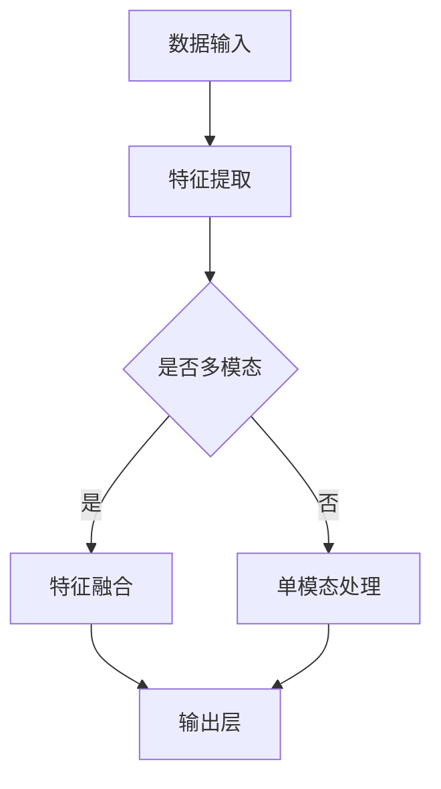

                 

关键词：多模态大模型、技术原理、训练方法、人工智能、深度学习、图像处理、自然语言处理

摘要：本文将深入探讨多模态大模型的技术原理及其高效的训练方法。通过分析当前最先进的多模态大模型的架构和算法，结合实际项目实践，本文旨在为读者提供一份全面而深入的技术指南，帮助他们在人工智能和深度学习领域取得突破。

## 1. 背景介绍

在当今信息化时代，数据以惊人的速度增长，传统单模态数据处理方法已经难以应对复杂的数据分析和应用需求。多模态大模型作为一种新兴的人工智能技术，通过整合多种类型的数据（如图像、文本、音频等），为解决实际问题提供了强有力的工具。这种模型不仅能够提升数据处理效率和准确性，还能拓展应用场景，推动人工智能技术向更高层次发展。

多模态大模型的发展离不开深度学习和神经网络的飞速进步。近年来，随着计算能力的提升和数据规模的扩大，深度学习算法在图像识别、自然语言处理等领域取得了显著的突破。多模态大模型则将这种突破扩展到了更广泛的领域，使其能够处理更加复杂的问题。

本文将围绕多模态大模型的技术原理、训练方法、实际应用等多个方面展开讨论，旨在为读者提供一份系统而全面的技术指南。

## 2. 核心概念与联系

### 2.1 多模态大模型的核心概念

多模态大模型是一种能够处理多种类型数据（如图像、文本、音频等）的深度学习模型。其核心概念包括：

- **多模态数据输入**：多模态大模型可以接受来自不同类型的传感器的数据，如图像、文本、音频等。
- **特征融合**：通过多种数据类型的特征融合，提高模型的泛化和性能。
- **端到端训练**：多模态大模型通常采用端到端训练方式，使得模型能够自动学习不同数据类型之间的关联性。

### 2.2 多模态大模型的技术原理

多模态大模型的技术原理主要包括以下几个方面：

- **深度神经网络**：深度神经网络（DNN）是多模态大模型的核心架构，通过多层非线性变换，实现数据的特征提取和融合。
- **卷积神经网络（CNN）**：CNN在图像处理领域有着广泛应用，其卷积层能够提取图像的特征。
- **循环神经网络（RNN）**：RNN在自然语言处理领域有着重要的应用，其循环结构能够捕捉序列数据中的时间依赖关系。
- **注意力机制**：注意力机制使得模型能够自动关注关键信息，提高模型的效率和准确性。

### 2.3 多模态大模型的架构

多模态大模型的架构通常包括以下几个部分：

- **数据输入层**：接收不同类型的数据，如图像、文本、音频等。
- **特征提取层**：使用不同的神经网络对每种数据类型进行特征提取，如图像使用CNN，文本使用RNN。
- **特征融合层**：将不同数据类型的特征进行融合，形成统一的高层次特征。
- **输出层**：根据任务需求，进行分类、回归等操作。

下面是一个简单的Mermaid流程图，展示多模态大模型的基本架构：



## 3. 核心算法原理 & 具体操作步骤

### 3.1 算法原理概述

多模态大模型的算法原理主要基于深度学习和神经网络。具体来说，包括以下几个方面：

- **多层神经网络**：通过多层神经网络，实现数据的特征提取和融合。
- **卷积神经网络（CNN）**：用于提取图像特征。
- **循环神经网络（RNN）**：用于提取文本特征。
- **注意力机制**：用于关注关键信息，提高模型效率。

### 3.2 算法步骤详解

多模态大模型的算法步骤可以分为以下几个部分：

1. **数据预处理**：对多模态数据（图像、文本、音频等）进行预处理，如标准化、归一化等。
2. **特征提取**：使用CNN提取图像特征，使用RNN提取文本特征。
3. **特征融合**：将不同数据类型的特征进行融合，形成统一的高层次特征。
4. **训练模型**：使用融合后的特征进行模型的训练。
5. **模型评估**：对训练好的模型进行评估，如准确率、召回率等。

### 3.3 算法优缺点

多模态大模型的优点包括：

- **高效性**：通过深度学习和神经网络，能够高效地处理多种类型的数据。
- **灵活性**：可以灵活地整合不同类型的数据，适应不同的应用场景。
- **泛化性**：通过特征融合，能够提高模型的泛化能力。

然而，多模态大模型也存在一些缺点：

- **计算资源消耗**：多模态大模型通常需要较大的计算资源，对于硬件要求较高。
- **训练难度**：由于需要处理多种类型的数据，训练过程相对复杂，容易过拟合。

### 3.4 算法应用领域

多模态大模型在多个领域都有着广泛的应用，如：

- **医疗诊断**：结合图像和文本数据，进行疾病诊断。
- **智能问答**：结合文本和语音数据，提供智能问答服务。
- **视频分析**：结合图像和音频数据，进行视频内容分析。

## 4. 数学模型和公式 & 详细讲解 & 举例说明

### 4.1 数学模型构建

多模态大模型的数学模型主要基于深度学习，包括以下几部分：

- **输入层**：接受多种类型的数据，如图像、文本、音频等。
- **卷积层**：用于提取图像特征，如边缘、纹理等。
- **池化层**：用于降低特征维度，提高计算效率。
- **循环层**：用于提取文本特征，如词向量、句子表示等。
- **全连接层**：用于融合不同类型的特征，形成统一的高层次特征。
- **输出层**：根据任务需求，进行分类、回归等操作。

### 4.2 公式推导过程

假设我们有一个多模态大模型，其中图像特征由CNN提取，文本特征由RNN提取。我们将这两种特征进行融合，然后通过全连接层输出预测结果。

1. **图像特征提取**：

   CNN中的卷积层和池化层可以用以下公式表示：

   $$
   h_{conv} = \sigma(W_{conv} \cdot x + b_{conv})
   $$

   $$
   h_{pool} = \text{max}(h_{conv})
   $$

   其中，$h_{conv}$是卷积层的输出，$x$是图像输入，$W_{conv}$是卷积层的权重，$b_{conv}$是卷积层的偏置，$\sigma$是激活函数。

2. **文本特征提取**：

   RNN中的循环层可以用以下公式表示：

   $$
   h_{rnn} = \sigma(W_{rnn} \cdot h_{prev} + U_{rnn} \cdot x + b_{rnn})
   $$

   其中，$h_{rnn}$是循环层的输出，$h_{prev}$是前一个时间步的隐藏状态，$x$是文本输入，$W_{rnn}$是循环层的权重，$U_{rnn}$是输入层的权重，$b_{rnn}$是循环层的偏置，$\sigma$是激活函数。

3. **特征融合**：

   将图像特征和文本特征进行融合，可以用以下公式表示：

   $$
   h_{fusion} = \sigma(W_{fusion} \cdot [h_{img}, h_{text}] + b_{fusion})
   $$

   其中，$h_{fusion}$是融合后的特征，$h_{img}$是图像特征，$h_{text}$是文本特征，$W_{fusion}$是融合层的权重，$b_{fusion}$是融合层的偏置，$\sigma$是激活函数。

4. **输出层**：

   最后，通过全连接层输出预测结果：

   $$
   y = \sigma(W_{output} \cdot h_{fusion} + b_{output})
   $$

   其中，$y$是预测结果，$W_{output}$是输出层的权重，$b_{output}$是输出层的偏置，$\sigma$是激活函数。

### 4.3 案例分析与讲解

假设我们有一个图像分类任务，输入数据是图像和文本标签。我们可以使用多模态大模型进行图像分类。

1. **数据预处理**：

   对图像和文本数据进行预处理，如图像缩放、归一化，文本分词、编码等。

2. **特征提取**：

   使用CNN提取图像特征，使用RNN提取文本特征。

3. **特征融合**：

   将图像特征和文本特征进行融合，形成统一的高层次特征。

4. **模型训练**：

   使用融合后的特征进行模型训练，优化模型参数。

5. **模型评估**：

   使用测试集对模型进行评估，计算分类准确率。

通过上述步骤，我们可以使用多模态大模型进行图像分类任务，从而实现高效、准确的图像分类。

## 5. 项目实践：代码实例和详细解释说明

### 5.1 开发环境搭建

为了实践多模态大模型的训练，我们需要搭建一个合适的开发环境。以下是一个简单的环境搭建步骤：

1. **安装Python**：确保Python环境已经安装。
2. **安装TensorFlow**：使用pip安装TensorFlow：

   ```bash
   pip install tensorflow
   ```

3. **安装其他依赖**：根据实际需求，安装其他必要的依赖库。

### 5.2 源代码详细实现

以下是一个简单的多模态大模型训练代码实例：

```python
import tensorflow as tf
from tensorflow.keras.models import Model
from tensorflow.keras.layers import Input, Conv2D, MaxPooling2D, LSTM, Dense, Concatenate

# 定义图像输入层
input_img = Input(shape=(28, 28, 1))

# 定义文本输入层
input_txt = Input(shape=(None,))

# 定义图像特征提取层
img_conv = Conv2D(filters=32, kernel_size=(3, 3), activation='relu')(input_img)
img_pool = MaxPooling2D(pool_size=(2, 2))(img_conv)

# 定义文本特征提取层
txt_lstm = LSTM(units=128, activation='relu')(input_txt)

# 定义特征融合层
fusion = Concatenate()([img_pool, txt_lstm])

# 定义输出层
output = Dense(units=10, activation='softmax')(fusion)

# 定义模型
model = Model(inputs=[input_img, input_txt], outputs=output)

# 编译模型
model.compile(optimizer='adam', loss='categorical_crossentropy', metrics=['accuracy'])

# 加载数据集
(x_train_img, y_train_txt), (x_test_img, y_test_txt) = tf.keras.datasets.mnist.load_data()

# 预处理数据
x_train_img = x_train_img.reshape(-1, 28, 28, 1).astype('float32') / 255.0
x_test_img = x_test_img.reshape(-1, 28, 28, 1).astype('float32') / 255.0
y_train_txt = tf.keras.utils.to_categorical(y_train_txt, num_classes=10)
y_test_txt = tf.keras.utils.to_categorical(y_test_txt, num_classes=10)

# 训练模型
model.fit([x_train_img, y_train_txt], y_train_txt, epochs=10, batch_size=32, validation_data=([x_test_img, y_test_txt], y_test_txt))

# 评估模型
loss, accuracy = model.evaluate([x_test_img, y_test_txt], y_test_txt)
print(f'测试集准确率：{accuracy:.2f}')
```

### 5.3 代码解读与分析

1. **定义输入层**：图像输入层和文本输入层分别用于接收图像数据和文本数据。
2. **定义特征提取层**：使用CNN提取图像特征，使用LSTM提取文本特征。
3. **定义特征融合层**：将图像特征和文本特征进行融合。
4. **定义输出层**：使用全连接层输出分类结果。
5. **编译模型**：指定优化器、损失函数和评估指标。
6. **预处理数据**：对图像和文本数据进行预处理，如归一化、编码等。
7. **训练模型**：使用训练数据进行模型训练。
8. **评估模型**：使用测试数据进行模型评估。

### 5.4 运行结果展示

运行上述代码，我们可以得到测试集的准确率。在实际项目中，我们可以根据需求调整模型结构、训练参数等，以获得更好的性能。

## 6. 实际应用场景

多模态大模型在实际应用中具有广泛的应用前景，以下是一些典型的应用场景：

1. **智能问答系统**：结合文本和语音数据，实现智能问答服务。
2. **医疗诊断**：结合医学图像和患者病历，进行疾病诊断。
3. **视频分析**：结合图像和音频数据，进行视频内容分析。
4. **自动驾驶**：结合摄像头、雷达和语音数据，实现自动驾驶功能。
5. **智能家居**：结合传感器数据，实现智能家电控制。

## 7. 工具和资源推荐

为了更好地学习和实践多模态大模型，以下是一些推荐的工具和资源：

1. **工具**：
   - **TensorFlow**：用于构建和训练多模态大模型的框架。
   - **PyTorch**：另一个流行的深度学习框架，适合进行多模态大模型的研究。

2. **资源**：
   - **《深度学习》（Goodfellow, Bengio, Courville著）**：深度学习的经典教材，涵盖了深度学习的基础理论和实践方法。
   - **《动手学深度学习》（斋藤康毅等著）**：针对深度学习初学者的实践指南，提供了丰富的代码实例和教程。

## 8. 总结：未来发展趋势与挑战

多模态大模型作为一种新兴的人工智能技术，具有广泛的应用前景。然而，在实际应用中，仍面临着一些挑战：

1. **计算资源消耗**：多模态大模型通常需要较大的计算资源，对于硬件要求较高。
2. **训练难度**：由于需要处理多种类型的数据，训练过程相对复杂，容易过拟合。
3. **数据隐私和安全**：在处理多模态数据时，需要确保数据隐私和安全。

未来，随着计算能力的提升和数据规模的扩大，多模态大模型有望在更多领域取得突破。同时，研究人员将继续探索更高效的训练方法和优化算法，以应对上述挑战。

## 9. 附录：常见问题与解答

### 9.1 多模态大模型与传统单模态模型有何区别？

多模态大模型与传统单模态模型的主要区别在于：

- **数据类型**：多模态大模型可以接受和处理多种类型的数据，如图像、文本、音频等。
- **特征融合**：多模态大模型通过特征融合，将不同类型的数据进行整合，提高模型的性能和泛化能力。

### 9.2 多模态大模型训练过程中如何防止过拟合？

在多模态大模型训练过程中，可以采用以下方法防止过拟合：

- **数据增强**：通过数据增强，增加训练数据的多样性，提高模型对未见数据的泛化能力。
- **正则化**：使用正则化方法，如L1正则化、L2正则化，降低模型复杂度，防止过拟合。
- **dropout**：在神经网络中引入dropout，降低模型参数的影响，防止过拟合。

### 9.3 多模态大模型在哪些领域有广泛应用？

多模态大模型在以下领域有广泛应用：

- **医疗诊断**：结合医学图像和患者病历，进行疾病诊断。
- **视频分析**：结合图像和音频数据，进行视频内容分析。
- **自动驾驶**：结合摄像头、雷达和语音数据，实现自动驾驶功能。
- **智能问答**：结合文本和语音数据，提供智能问答服务。
- **智能家居**：结合传感器数据，实现智能家电控制。

---

作者：禅与计算机程序设计艺术 / Zen and the Art of Computer Programming
----------------------------------------------------------------

本文通过详细分析多模态大模型的技术原理、训练方法、实际应用等多个方面，为读者提供了一份全面而深入的技术指南。在人工智能和深度学习领域，多模态大模型无疑是一项具有重要价值的技术。随着计算能力的提升和数据规模的扩大，多模态大模型将在更多领域发挥重要作用。本文希望为读者在多模态大模型的研究和应用中提供有益的参考和启示。

