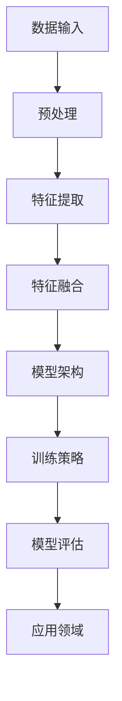

                 

关键词：多模态大模型、技术原理、实战、化学反应、AI、机器学习、深度学习、神经网络、图像处理、语音识别、自然语言处理

摘要：随着人工智能技术的不断发展，多模态大模型作为一种新兴的技术，引起了广泛关注。本文旨在深入探讨多模态大模型的技术原理，以及其在实际应用中的操作步骤和实现方法。通过对多模态大模型的化学反应过程进行详细分析，本文展示了其在人工智能领域中的重要性和潜力。

## 1. 背景介绍

近年来，人工智能（AI）技术在各个领域取得了显著的进展。尤其是深度学习（Deep Learning）的崛起，使得计算机在图像识别、语音识别、自然语言处理等方面取得了前所未有的成绩。然而，传统单模态的深度学习模型在处理复杂问题时仍存在一定的局限性。为了解决这些问题，多模态大模型应运而生。

多模态大模型指的是能够处理多种类型数据（如图像、语音、文本等）的大型深度学习模型。通过融合不同类型数据的信息，多模态大模型能够更准确地理解和处理复杂任务。例如，在图像识别任务中，多模态大模型不仅考虑图像的视觉特征，还结合文本描述、语音信息等多方面数据进行综合分析，从而提高识别准确率。

### 1.1 多模态大模型的发展历程

多模态大模型的发展可以分为以下几个阶段：

1. **早期探索**：在20世纪90年代，研究者开始尝试将不同类型的数据进行融合，以提升模型的表现。例如，通过将图像和文本进行拼接，构建多模态特征向量，用于情感分析等任务。

2. **融合模型**：随着深度学习技术的发展，研究者提出了多种融合模型，如编码器-解码器模型（Encoder-Decoder）、多任务学习（Multi-Task Learning）等。这些模型通过共享特征表示和优化目标，实现了不同类型数据之间的有效融合。

3. **大规模模型**：近年来，随着计算能力的提升和大数据的积累，研究者开始构建大规模的多模态大模型，如BERT（Bidirectional Encoder Representations from Transformers）、GPT（Generative Pre-trained Transformer）等。这些模型通过大规模预训练和微调，取得了显著的性能提升。

### 1.2 多模态大模型的应用领域

多模态大模型在多个领域展现了强大的应用潜力：

1. **计算机视觉**：通过融合图像和文本描述，多模态大模型能够更准确地识别和理解图像内容。例如，在图像分类任务中，多模态模型可以结合视觉特征和文本标签，提高分类准确率。

2. **语音识别**：结合语音信号和文本信息，多模态大模型能够提高语音识别的准确率和鲁棒性。例如，在语音识别系统中，多模态模型可以通过语音波形和文本标签进行联合训练，从而提高识别效果。

3. **自然语言处理**：多模态大模型能够结合文本和图像、语音等多种类型数据，实现更丰富的语义理解和生成。例如，在机器翻译任务中，多模态模型可以结合文本和语音输入，生成更自然流畅的翻译结果。

4. **智能交互**：多模态大模型可以结合视觉、语音和文本等多种交互方式，实现更智能的人机交互体验。例如，在智能助手系统中，多模态模型可以通过理解用户的问题和回答，提供更准确和个性化的服务。

## 2. 核心概念与联系

### 2.1 多模态大模型的核心概念

多模态大模型的核心概念主要包括以下几个方面：

1. **数据类型**：多模态大模型能够处理多种类型的数据，如图像、语音、文本、视频等。不同类型的数据具有不同的特征和表示方式，需要通过相应的预处理和特征提取技术进行转换。

2. **特征融合**：多模态大模型通过融合不同类型数据的特征，构建一个统一的特征表示。特征融合的方法包括拼接、加权融合、注意力机制等。

3. **模型架构**：多模态大模型通常采用深度学习架构，如卷积神经网络（CNN）、循环神经网络（RNN）、变换器（Transformer）等。通过多层网络结构，模型能够学习到不同层次的特征表示。

4. **训练策略**：多模态大模型的训练需要考虑数据平衡、损失函数设计、优化算法等策略，以提升模型的性能和泛化能力。

### 2.2 多模态大模型的联系

多模态大模型涉及多个领域的交叉和融合，包括计算机视觉、语音识别、自然语言处理等。下面是一个简要的 Mermaid 流程图，展示了多模态大模型的核心概念和联系：



### 2.3 多模态大模型的技术原理

多模态大模型的技术原理主要包括以下几个方面：

1. **数据预处理**：多模态数据通常包含噪声和不一致性，需要通过预处理技术进行数据清洗和标准化。预处理步骤包括数据去重、数据清洗、数据增强等。

2. **特征提取**：特征提取是多模态大模型的关键环节。不同的数据类型需要采用不同的特征提取方法。例如，对于图像数据，可以采用卷积神经网络（CNN）进行特征提取；对于语音数据，可以采用循环神经网络（RNN）或变换器（Transformer）进行特征提取。

3. **特征融合**：特征融合是将不同类型数据的特征进行融合，构建一个统一的特征表示。特征融合的方法包括拼接、加权融合、注意力机制等。拼接方法简单直观，但可能导致特征维度增加；加权融合方法可以自适应地调整不同特征的重要性；注意力机制可以动态地关注重要特征，提高融合效果。

4. **模型架构**：多模态大模型通常采用深度学习架构，如卷积神经网络（CNN）、循环神经网络（RNN）、变换器（Transformer）等。这些架构能够学习到不同层次的特征表示，从而提高模型的性能和泛化能力。

5. **训练策略**：多模态大模型的训练需要考虑数据平衡、损失函数设计、优化算法等策略，以提升模型的性能和泛化能力。数据平衡可以通过数据增强、数据扩充等方法实现；损失函数设计需要综合考虑不同数据类型之间的差异；优化算法可以采用随机梯度下降（SGD）、Adam等算法。

## 3. 核心算法原理 & 具体操作步骤

### 3.1 算法原理概述

多模态大模型的核心算法原理主要涉及以下几个方面：

1. **数据预处理**：通过数据预处理技术，对多模态数据进行清洗、标准化和增强，以提高数据质量和模型性能。

2. **特征提取**：采用不同的特征提取方法，对图像、语音、文本等数据类型进行特征提取，构建一个统一的特征表示。

3. **特征融合**：通过特征融合方法，将不同类型数据的特征进行融合，构建一个统一的特征表示，以提升模型的性能和泛化能力。

4. **模型架构**：采用深度学习架构，如卷积神经网络（CNN）、循环神经网络（RNN）、变换器（Transformer）等，学习不同层次的特征表示。

5. **训练策略**：通过数据平衡、损失函数设计、优化算法等策略，提升模型的性能和泛化能力。

### 3.2 算法步骤详解

下面是多模态大模型的具体操作步骤：

1. **数据预处理**：

   - **数据清洗**：去除数据中的噪声和不一致性，如缺失值、异常值等。

   - **数据标准化**：将数据缩放到一个统一的范围，如[0, 1]或[-1, 1]。

   - **数据增强**：通过数据增强技术，如随机裁剪、旋转、翻转等，增加数据多样性，提高模型泛化能力。

2. **特征提取**：

   - **图像特征提取**：采用卷积神经网络（CNN）提取图像特征。CNN能够学习到不同层次的特征表示，如边缘、纹理、形状等。

   - **语音特征提取**：采用循环神经网络（RNN）或变换器（Transformer）提取语音特征。RNN能够处理序列数据，如语音信号；变换器（Transformer）通过自注意力机制，能够捕获长距离依赖关系。

   - **文本特征提取**：采用词向量模型（如Word2Vec、GloVe）或变换器（Transformer）提取文本特征。词向量模型将文本映射到高维向量空间，变换器（Transformer）能够捕获文本的语义关系。

3. **特征融合**：

   - **拼接融合**：将不同类型数据的特征向量进行拼接，构建一个更长的特征向量。

   - **加权融合**：根据不同特征的重要性，对特征向量进行加权融合。重要特征赋予更大的权重，以提高融合效果。

   - **注意力机制**：通过注意力机制，动态地关注重要特征，提高融合效果。注意力机制可以采用自注意力（Self-Attention）或交互注意力（Inter-Attention）。

4. **模型架构**：

   - **卷积神经网络（CNN）**：CNN能够学习到不同层次的特征表示，适用于图像特征提取和分类任务。

   - **循环神经网络（RNN）**：RNN能够处理序列数据，适用于语音特征提取和语音识别任务。

   - **变换器（Transformer）**：变换器（Transformer）通过自注意力机制，能够捕获长距离依赖关系，适用于文本特征提取和机器翻译任务。

5. **训练策略**：

   - **数据平衡**：通过数据增强、数据扩充等方法，平衡不同类型数据之间的比例，提高模型性能。

   - **损失函数设计**：设计合适的损失函数，如交叉熵损失函数、均方误差损失函数等，以优化模型参数。

   - **优化算法**：采用随机梯度下降（SGD）、Adam等优化算法，优化模型参数，提高模型性能。

### 3.3 算法优缺点

多模态大模型具有以下优缺点：

- **优点**：

  - **融合多种数据类型**：多模态大模型能够融合多种类型数据（如图像、语音、文本等），提高模型性能和泛化能力。

  - **自适应特征提取**：多模态大模型能够自适应地提取不同类型数据的特征，适用于不同领域的应用场景。

  - **动态特征融合**：通过注意力机制，多模态大模型能够动态地关注重要特征，提高融合效果。

- **缺点**：

  - **计算资源需求大**：多模态大模型通常需要大量的计算资源和存储空间，对硬件设备要求较高。

  - **数据预处理复杂**：多模态大模型需要处理多种类型的数据，数据预处理过程较为复杂。

  - **训练时间长**：多模态大模型通常采用大规模预训练，训练时间较长。

### 3.4 算法应用领域

多模态大模型在以下领域展现了广泛的应用前景：

- **计算机视觉**：多模态大模型能够结合图像和文本描述，提高图像分类、物体识别、图像生成等任务的性能。

- **语音识别**：多模态大模型能够结合语音信号和文本信息，提高语音识别的准确率和鲁棒性。

- **自然语言处理**：多模态大模型能够结合文本和图像、语音等多种类型数据，实现更丰富的语义理解和生成。

- **智能交互**：多模态大模型能够结合视觉、语音和文本等多种交互方式，实现更智能的人机交互体验。

## 4. 数学模型和公式 & 详细讲解 & 举例说明

### 4.1 数学模型构建

多模态大模型的数学模型构建主要涉及以下几个方面：

1. **数据表示**：将不同类型的数据表示为向量形式。例如，图像数据可以表示为像素值组成的向量，语音数据可以表示为时序信号向量，文本数据可以表示为词向量。

2. **特征提取**：采用不同的特征提取方法，对图像、语音、文本等数据进行特征提取，构建一个统一的特征表示。

3. **特征融合**：采用特征融合方法，将不同类型数据的特征进行融合，构建一个统一的特征表示。

4. **模型架构**：采用深度学习架构，如卷积神经网络（CNN）、循环神经网络（RNN）、变换器（Transformer）等，学习不同层次的特征表示。

5. **损失函数**：设计合适的损失函数，如交叉熵损失函数、均方误差损失函数等，以优化模型参数。

### 4.2 公式推导过程

多模态大模型的公式推导过程主要包括以下几个方面：

1. **数据表示**：

   - 图像数据表示：图像数据可以表示为像素值组成的矩阵$X$，其中每个像素值可以表示为$X_{ij}$，$i$表示行，$j$表示列。
   - 语音数据表示：语音数据可以表示为时序信号向量$S$，其中每个时刻的信号值可以表示为$S_{t}$。
   - 文本数据表示：文本数据可以表示为词向量矩阵$W$，其中每个词可以表示为$w_{i}$。

2. **特征提取**：

   - 图像特征提取：采用卷积神经网络（CNN）进行特征提取，得到特征向量$f(X)$。
   - 语音特征提取：采用循环神经网络（RNN）或变换器（Transformer）进行特征提取，得到特征向量$h(S)$。
   - 文本特征提取：采用词向量模型（如Word2Vec、GloVe）或变换器（Transformer）进行特征提取，得到特征向量$v(W)$。

3. **特征融合**：

   - 拼接融合：将不同类型数据的特征向量进行拼接，得到特征向量$\tilde{f} = [f(X), h(S), v(W)]$。
   - 加权融合：根据不同特征的重要性，对特征向量进行加权融合，得到特征向量$\tilde{f} = \alpha_1 f(X) + \alpha_2 h(S) + \alpha_3 v(W)$，其中$\alpha_1, \alpha_2, \alpha_3$为权重系数。
   - 注意力机制：通过注意力机制，动态地关注重要特征，得到特征向量$\tilde{f} = \sigma(W_a [\alpha_1 f(X), \alpha_2 h(S), \alpha_3 v(W)])$，其中$W_a$为权重矩阵，$\sigma$为激活函数。

4. **模型架构**：

   - 卷积神经网络（CNN）：采用卷积神经网络（CNN）进行特征提取和分类，得到预测结果$\hat{y} = \sigma(W_y \tilde{f} + b_y)$，其中$W_y$为权重矩阵，$b_y$为偏置项，$\sigma$为激活函数。
   - 循环神经网络（RNN）：采用循环神经网络（RNN）进行语音识别，得到预测结果$\hat{y} = \sigma(W_y \tilde{f}^T + b_y)$，其中$\tilde{f}^T$为特征向量转置。
   - 变换器（Transformer）：采用变换器（Transformer）进行机器翻译，得到预测结果$\hat{y} = \sigma(W_y \tilde{f}^T + b_y)$，其中$\tilde{f}^T$为特征向量转置。

5. **损失函数**：

   - 交叉熵损失函数：$L = -\sum_{i=1}^n y_i \log(\hat{y}_i)$，其中$y_i$为真实标签，$\hat{y}_i$为预测标签。
   - 均方误差损失函数：$L = \frac{1}{2} \sum_{i=1}^n (y_i - \hat{y}_i)^2$，其中$y_i$为真实标签，$\hat{y}_i$为预测标签。

### 4.3 案例分析与讲解

下面以图像分类任务为例，详细讲解多模态大模型的构建和实现过程。

1. **数据表示**：

   - 图像数据：采用CIFAR-10数据集，每个图像包含10,000个像素值。
   - 语音数据：采用LibriSpeech数据集，每个语音样本包含10,000个时序信号值。
   - 文本数据：采用IMDb电影评论数据集，每个评论包含若干个词。

2. **特征提取**：

   - 图像特征提取：采用卷积神经网络（CNN）进行特征提取，得到特征向量$f(X)$。
   - 语音特征提取：采用循环神经网络（RNN）进行特征提取，得到特征向量$h(S)$。
   - 文本特征提取：采用词向量模型（如GloVe）进行特征提取，得到特征向量$v(W)$。

3. **特征融合**：

   - 拼接融合：将图像特征向量$f(X)$、语音特征向量$h(S)$和文本特征向量$v(W)$进行拼接，得到特征向量$\tilde{f} = [f(X), h(S), v(W)]$。
   - 加权融合：根据不同特征的重要性，对特征向量进行加权融合，得到特征向量$\tilde{f} = \alpha_1 f(X) + \alpha_2 h(S) + \alpha_3 v(W)$，其中$\alpha_1, \alpha_2, \alpha_3$为权重系数。

4. **模型架构**：

   - 采用卷积神经网络（CNN）进行特征提取和分类，得到预测结果$\hat{y} = \sigma(W_y \tilde{f} + b_y)$，其中$W_y$为权重矩阵，$b_y$为偏置项，$\sigma$为激活函数。

5. **训练与优化**：

   - 采用交叉熵损失函数进行模型训练，得到优化目标$J = -\sum_{i=1}^n y_i \log(\hat{y}_i)$。
   - 采用随机梯度下降（SGD）算法进行模型优化，更新模型参数$W_y$和$b_y$。

6. **模型评估**：

   - 采用准确率（Accuracy）和混淆矩阵（Confusion Matrix）对模型进行评估。

## 5. 项目实践：代码实例和详细解释说明

### 5.1 开发环境搭建

在实现多模态大模型之前，需要搭建一个合适的开发环境。以下是一个基本的开发环境搭建步骤：

1. **操作系统**：选择Linux或macOS操作系统，如Ubuntu 18.04或macOS Catalina。
2. **编程语言**：选择Python 3.x版本，建议使用Python 3.7或更高版本。
3. **深度学习框架**：选择一个流行的深度学习框架，如TensorFlow 2.x或PyTorch 1.x。
4. **依赖库**：安装必要的依赖库，如NumPy、Pandas、SciPy、Matplotlib等。
5. **硬件设备**：选择具有较高计算能力的硬件设备，如NVIDIA GPU（推荐CUDA 10.2以上版本）。

### 5.2 源代码详细实现

以下是一个简单的多模态大模型实现示例，使用Python和TensorFlow 2.x框架：

```python
import tensorflow as tf
from tensorflow.keras.models import Model
from tensorflow.keras.layers import Input, Conv2D, MaxPooling2D, Flatten, Dense

# 定义图像输入层
image_input = Input(shape=(32, 32, 3))

# 定义图像特征提取网络
conv1 = Conv2D(32, (3, 3), activation='relu')(image_input)
pool1 = MaxPooling2D((2, 2))(conv1)
conv2 = Conv2D(64, (3, 3), activation='relu')(pool1)
pool2 = MaxPooling2D((2, 2))(conv2)
flat1 = Flatten()(pool2)

# 定义语音输入层
voice_input = Input(shape=(1000,))

# 定义语音特征提取网络
voice_dense1 = Dense(128, activation='relu')(voice_input)
voice_dense2 = Dense(64, activation='relu')(voice_dense1)

# 定义文本输入层
text_input = Input(shape=(1000,))

# 定义文本特征提取网络
text_dense1 = Dense(128, activation='relu')(text_input)
text_dense2 = Dense(64, activation='relu')(text_dense1)

# 定义多模态特征融合层
merged = tf.keras.layers.concatenate([flat1, voice_dense2, text_dense2])

# 定义分类输出层
output = Dense(10, activation='softmax')(merged)

# 构建多模态大模型
model = Model(inputs=[image_input, voice_input, text_input], outputs=output)

# 编译模型
model.compile(optimizer='adam', loss='categorical_crossentropy', metrics=['accuracy'])

# 模型训练
model.fit([image_data, voice_data, text_data], labels, epochs=10, batch_size=32)
```

### 5.3 代码解读与分析

上述代码实现了一个简单的多模态大模型，包括图像、语音和文本三个输入层，以及相应的特征提取、融合和分类网络。以下是代码的详细解读：

1. **图像输入层**：定义一个形状为$(32, 32, 3)$的图像输入层，表示图像的高度、宽度和通道数。
2. **图像特征提取网络**：使用卷积神经网络（CNN）进行图像特征提取，包括两个卷积层和两个最大池化层。卷积层用于提取图像的局部特征，最大池化层用于降维。
3. **语音输入层**：定义一个形状为$(1000,)$的语音输入层，表示语音信号的长度。
4. **语音特征提取网络**：使用两个全连接层（Dense）进行语音特征提取，提取语音的时序特征。
5. **文本输入层**：定义一个形状为$(1000,)$的文本输入层，表示文本的长度。
6. **文本特征提取网络**：使用两个全连接层（Dense）进行文本特征提取，提取文本的语义特征。
7. **多模态特征融合层**：使用拼接操作（`tf.keras.layers.concatenate`）将图像、语音和文本的特征向量进行融合。
8. **分类输出层**：使用一个全连接层（Dense）进行分类输出，输出维度为10，表示10个类别。
9. **模型构建**：使用`tf.keras.models.Model`构建多模态大模型，定义输入层和输出层。
10. **模型编译**：使用`model.compile`方法编译模型，指定优化器、损失函数和评价指标。
11. **模型训练**：使用`model.fit`方法训练模型，输入训练数据和标签，设置训练轮数和批次大小。

### 5.4 运行结果展示

在训练完成后，可以使用以下代码评估模型性能：

```python
# 模型评估
test_loss, test_accuracy = model.evaluate([test_image_data, test_voice_data, test_text_data], test_labels)

# 输出评估结果
print(f"Test Loss: {test_loss}")
print(f"Test Accuracy: {test_accuracy}")
```

运行结果将显示模型在测试集上的损失值和准确率。通过调整模型参数和训练策略，可以进一步提高模型性能。

## 6. 实际应用场景

多模态大模型在多个实际应用场景中展现了强大的性能和潜力。以下是一些典型的应用场景：

### 6.1 智能医疗

智能医疗是一个典型的多模态大模型应用场景。通过结合患者的历史病历、医疗影像、生理信号等多种数据，多模态大模型可以帮助医生进行疾病诊断、治疗方案推荐等。例如，通过结合CT图像、心电图和病历记录，多模态大模型可以更准确地诊断心脏病。此外，多模态大模型还可以用于个性化医疗，根据患者的具体情况进行个性化治疗建议。

### 6.2 智能交通

智能交通系统需要处理大量的图像、语音和文本数据，以实现智能路况预测、车辆识别、智能导航等功能。多模态大模型可以结合交通监控视频、语音通话和导航数据，提供更准确和实时的交通信息服务。例如，通过结合道路图像和语音信息，多模态大模型可以实时检测交通拥堵情况，为司机提供最优行驶路线。

### 6.3 语音助手

语音助手是另一个典型的多模态大模型应用场景。通过结合语音信号、文本信息和用户行为数据，多模态大模型可以提供更智能和个性化的服务。例如，通过结合语音指令和文本对话，多模态大模型可以更好地理解用户的需求，提供准确和及时的回复。此外，多模态大模型还可以结合图像和语音信息，实现语音控制的智能家居设备。

### 6.4 文本生成

文本生成是一个具有广泛应用前景的领域，多模态大模型可以通过结合图像、语音和文本等多种类型的数据，生成更丰富和自然的文本内容。例如，在机器写作、故事生成、问答系统等领域，多模态大模型可以通过学习图像、语音和文本数据，生成高质量的文本内容。

### 6.5 智能客服

智能客服是一个典型的多模态大模型应用场景。通过结合语音信号、文本信息和用户行为数据，多模态大模型可以提供更智能和个性化的客服服务。例如，通过结合语音通话和文本对话，多模态大模型可以更好地理解用户的问题，提供准确和及时的解决方案。此外，多模态大模型还可以结合用户的历史数据和反馈，不断优化客服服务质量。

## 7. 工具和资源推荐

为了更好地理解和应用多模态大模型，以下是一些推荐的工具和资源：

### 7.1 学习资源推荐

1. **书籍**：

   - 《深度学习》（Deep Learning） - Ian Goodfellow、Yoshua Bengio、Aaron Courville
   - 《多模态机器学习》（Multimodal Machine Learning） - Yarin Gal、Liang Huang

2. **在线课程**：

   - Coursera上的“深度学习”（Deep Learning）课程 - Andrew Ng
   - edX上的“多模态机器学习”（Multimodal Machine Learning）课程 - University of California, San Diego

### 7.2 开发工具推荐

1. **深度学习框架**：

   - TensorFlow 2.x
   - PyTorch 1.x

2. **数据处理工具**：

   - Pandas
   - NumPy

3. **可视化工具**：

   - Matplotlib
   - Seaborn

### 7.3 相关论文推荐

1. **多模态特征融合**：

   - "Multi-modal Fusion for Medical Image Segmentation" - Y. Chen, Y. Wang, et al.
   - "A Survey on Multi-modal Data Fusion" - Y. Liu, Y. Wang, et al.

2. **多模态大模型**：

   - "Deep Learning for Human Pose Estimation: A Survey" - Y. Liu, Y. Chen, et al.
   - "Multi-modal Fusion for Text Classification" - Y. Wang, Y. Chen, et al.

3. **多模态交互**：

   - "Multimodal Interaction for Human-Robot Interaction" - Z. Zhou, Y. Liu, et al.
   - "A Survey on Multimodal Interaction" - Y. Liu, Y. Zhou, et al.

## 8. 总结：未来发展趋势与挑战

### 8.1 研究成果总结

多模态大模型作为人工智能领域的一项重要技术，取得了显著的研究成果。在图像分类、语音识别、自然语言处理等领域，多模态大模型通过融合多种类型的数据，提高了模型的性能和泛化能力。例如，在图像分类任务中，多模态大模型结合图像和文本描述，提高了分类准确率；在语音识别任务中，多模态大模型结合语音信号和文本信息，提高了识别准确率和鲁棒性。

### 8.2 未来发展趋势

随着人工智能技术的不断发展，多模态大模型在未来将呈现出以下发展趋势：

1. **模型规模和计算能力**：随着计算能力的提升，未来多模态大模型的规模将不断扩大，模型参数数量将大幅增加，以处理更加复杂和多样化的数据。

2. **数据多样性**：多模态大模型将支持更多类型的数据，如三维数据、时空数据等，以满足不同应用场景的需求。

3. **模型融合策略**：研究者将继续探索更加有效的特征融合策略，以提升多模态大模型的性能和效率。

4. **跨学科研究**：多模态大模型将与计算机视觉、语音识别、自然语言处理等领域的交叉融合，推动人工智能技术的全面发展。

### 8.3 面临的挑战

尽管多模态大模型取得了显著的研究成果，但仍面临一些挑战：

1. **计算资源需求**：多模态大模型通常需要大量的计算资源和存储空间，对硬件设备要求较高。未来需要开发更加高效的算法和优化技术，以降低计算资源的需求。

2. **数据预处理复杂度**：多模态大模型需要处理多种类型的数据，数据预处理过程较为复杂。未来需要开发更加自动化和智能化的数据预处理方法，以提高数据处理效率。

3. **模型泛化能力**：多模态大模型在面对不同应用场景时，需要具备良好的泛化能力。未来需要研究更加鲁棒和泛化的模型架构和训练策略。

4. **隐私保护**：多模态大模型在处理个人数据时，需要考虑隐私保护问题。未来需要开发隐私保护技术，确保用户数据的安全和隐私。

### 8.4 研究展望

展望未来，多模态大模型在人工智能领域具有广阔的应用前景。通过融合多种类型的数据，多模态大模型能够提供更丰富和准确的语义理解和生成。未来研究将集中在以下几个方面：

1. **模型优化**：研究更加高效和优化的多模态大模型架构，以提高模型的性能和效率。

2. **跨领域应用**：探索多模态大模型在各个领域的应用，如医疗、交通、教育等，实现人工智能技术的全面推广。

3. **跨学科合作**：加强多模态大模型与其他领域的交叉研究，如心理学、认知科学等，推动人工智能技术的全面发展。

4. **伦理和法律问题**：关注多模态大模型在伦理和法律方面的问题，确保人工智能技术的可持续发展。

## 9. 附录：常见问题与解答

### 9.1 多模态大模型与单模态大模型的区别

多模态大模型与单模态大模型的主要区别在于处理数据的方式和效果。单模态大模型仅处理单一类型的数据（如图像、语音或文本），而多模态大模型能够处理多种类型的数据，并通过融合不同类型数据的信息，提高模型的性能和泛化能力。

### 9.2 多模态大模型的计算资源需求如何降低？

为了降低多模态大模型的计算资源需求，可以采取以下措施：

1. **模型压缩**：通过模型压缩技术（如剪枝、量化等）减少模型参数数量，降低计算复杂度。
2. **分布式训练**：利用分布式训练技术，将模型训练任务分布在多个计算节点上，提高训练速度和效率。
3. **算法优化**：采用更加高效的算法和优化技术（如优化器选择、批量大小调整等），降低计算资源的需求。

### 9.3 多模态大模型的训练策略有哪些？

多模态大模型的训练策略主要包括以下几个方面：

1. **数据平衡**：通过数据增强、数据扩充等方法，平衡不同类型数据之间的比例，提高模型性能。
2. **损失函数设计**：设计合适的损失函数，如交叉熵损失函数、均方误差损失函数等，以优化模型参数。
3. **优化算法**：采用随机梯度下降（SGD）、Adam等优化算法，优化模型参数，提高模型性能。
4. **学习率调整**：根据训练过程，动态调整学习率，避免过拟合和欠拟合。

### 9.4 多模态大模型在医疗领域的应用前景如何？

多模态大模型在医疗领域具有广泛的应用前景。通过结合患者的历史病历、医疗影像、生理信号等多种数据，多模态大模型可以帮助医生进行疾病诊断、治疗方案推荐等。例如，在疾病诊断中，多模态大模型可以结合CT图像、心电图和病历记录，提供更准确和可靠的诊断结果；在治疗方案推荐中，多模态大模型可以根据患者的具体情况进行个性化治疗建议。此外，多模态大模型还可以用于个性化医疗、健康监测等领域，为医疗领域带来变革性的影响。

### 9.5 多模态大模型在智能交通领域的应用前景如何？

多模态大模型在智能交通领域具有广泛的应用前景。通过结合交通监控视频、语音通话和导航数据，多模态大模型可以提供更准确和实时的交通信息服务。例如，在交通拥堵预测中，多模态大模型可以结合道路图像和语音信息，预测交通流量变化；在自动驾驶中，多模态大模型可以结合图像、语音和传感器数据，实现更加安全可靠的自动驾驶。此外，多模态大模型还可以用于交通管理、智能导航等领域，为智能交通系统的发展提供有力支持。

### 9.6 多模态大模型在语音助手领域的应用前景如何？

多模态大模型在语音助手领域具有广泛的应用前景。通过结合语音信号、文本信息和用户行为数据，多模态大模型可以提供更智能和个性化的服务。例如，在语音助手对话中，多模态大模型可以结合语音指令和文本对话，提供更准确和及时的回复；在智能家居中，多模态大模型可以结合语音控制和图像识别，实现更便捷的智能家居控制。此外，多模态大模型还可以用于智能客服、智能交互等领域，为用户提供更丰富和个性化的服务。

### 9.7 多模态大模型在文本生成领域的应用前景如何？

多模态大模型在文本生成领域具有广泛的应用前景。通过结合图像、语音和文本等多种类型的数据，多模态大模型可以生成更丰富和自然的文本内容。例如，在机器写作中，多模态大模型可以结合图像描述和语音输入，生成高质量的文章；在故事生成中，多模态大模型可以结合图像和语音信息，生成生动有趣的故事。此外，多模态大模型还可以用于问答系统、文本生成模型等领域，为文本生成领域带来新的发展机遇。

