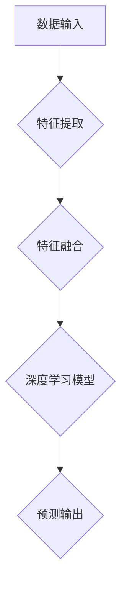

                 

 多模态大模型是近年来人工智能领域的一项重要突破，它融合了图像、语音、文本等多种类型的数据，通过深度学习算法进行建模和预测，具有广泛的应用前景。本文将详细介绍多模态大模型的技术原理、核心算法、数学模型以及实际应用案例，旨在为读者提供全面、系统的了解。

## 文章关键词

- 多模态大模型
- 深度学习
- 图像识别
- 语音识别
- 文本分析
- 应用场景
- 技术原理

## 文章摘要

本文首先介绍了多模态大模型的背景和应用场景，然后详细阐述了多模态大模型的技术原理和核心算法，包括卷积神经网络（CNN）、循环神经网络（RNN）和 Transformer 等。接着，我们分析了多模态大模型的数学模型和公式，并通过实际项目案例展示了其应用效果。最后，本文对多模态大模型的发展趋势、工具和资源进行了展望，并提出了未来研究的方向。

## 1. 背景介绍

多模态大模型（Multimodal Large-scale Models）是指能够同时处理多种类型数据（如图像、语音、文本等）的大型深度学习模型。随着计算机硬件和算法的不断发展，多模态大模型在图像识别、语音识别、自然语言处理等领域取得了显著的成果。例如，Google 的 PaLM 模型就是一个典型的多模态大模型，它能够同时处理文本、图像和视频等多模态数据。

### 1.1 应用场景

多模态大模型在许多领域具有广泛的应用场景：

1. **图像识别**：通过将图像与文本、语音等其他模态进行融合，可以显著提高图像识别的准确性。
2. **语音识别**：结合文本模态，可以减少语音识别的错误率，提高识别的准确性和流畅性。
3. **自然语言处理**：多模态大模型可以同时处理文本、语音和图像，为问答系统、对话系统等提供了更丰富的信息来源。
4. **视频分析**：结合图像和语音模态，可以实现对视频内容的更深入理解和分析。
5. **智能助手**：多模态大模型可以为智能助手提供更准确、更智能的交互体验，满足用户多样化的需求。

### 1.2 研究现状

近年来，多模态大模型的研究取得了显著进展。在图像识别领域，通过将 CNN 和 RNN 等深度学习算法相结合，研究人员成功实现了图像分类、物体检测、人脸识别等任务。在语音识别领域，基于深度神经网络的语音识别系统已经达到了实用的水平。在自然语言处理领域，Transformer 等新型神经网络结构为多模态大模型的发展提供了新的思路。

## 2. 核心概念与联系

### 2.1 多模态数据的融合

多模态数据的融合是构建多模态大模型的基础。融合方法可以分为以下几种：

1. **特征级融合**：将不同模态的特征进行拼接，然后输入到深度神经网络中进行处理。
2. **决策级融合**：先对每个模态进行独立的预测，然后将预测结果进行综合，得到最终结果。
3. **时空级融合**：在视频等连续数据中，结合时空信息进行融合，以获得更丰富的信息。

### 2.2 深度学习算法

多模态大模型主要依赖于深度学习算法，其中卷积神经网络（CNN）、循环神经网络（RNN）和 Transformer 等是常用的算法。

1. **卷积神经网络（CNN）**：CNN 是处理图像数据的主要算法，通过卷积、池化等操作提取图像特征。
2. **循环神经网络（RNN）**：RNN 是处理序列数据的主要算法，能够捕捉序列中的长期依赖关系。
3. **Transformer**：Transformer 是一种基于自注意力机制的神经网络结构，在自然语言处理等领域取得了显著成果。

### 2.3 Mermaid 流程图

以下是一个简单的 Mermaid 流程图，展示了多模态大模型的架构：



### 2.4 多模态大模型的架构

多模态大模型的架构可以分为以下几个层次：

1. **数据层**：包括数据预处理、数据增强、数据加载等。
2. **特征提取层**：包括不同模态的特征提取算法，如 CNN、RNN 等。
3. **特征融合层**：将不同模态的特征进行融合，以获得更丰富的信息。
4. **深度学习模型层**：包括神经网络结构、优化算法等。
5. **预测层**：对输入数据进行预测，输出结果。

## 3. 核心算法原理 & 具体操作步骤

### 3.1 算法原理概述

多模态大模型的核心算法主要包括卷积神经网络（CNN）、循环神经网络（RNN）和 Transformer 等。下面将分别介绍这些算法的原理。

1. **卷积神经网络（CNN）**：CNN 是一种用于处理图像数据的深度学习算法，通过卷积、池化等操作提取图像特征。
2. **循环神经网络（RNN）**：RNN 是一种用于处理序列数据的深度学习算法，能够捕捉序列中的长期依赖关系。
3. **Transformer**：Transformer 是一种基于自注意力机制的神经网络结构，在自然语言处理等领域取得了显著成果。

### 3.2 算法步骤详解

1. **数据预处理**：对输入数据进行预处理，包括数据清洗、归一化、数据增强等。
2. **特征提取**：根据不同模态的数据选择相应的特征提取算法，如 CNN、RNN 等。
3. **特征融合**：将不同模态的特征进行融合，以获得更丰富的信息。
4. **模型训练**：使用训练数据对深度学习模型进行训练，优化模型参数。
5. **预测**：对输入数据进行预测，输出结果。

### 3.3 算法优缺点

1. **卷积神经网络（CNN）**：优点是能够高效地处理图像数据，提取丰富的图像特征；缺点是处理序列数据时效果较差。
2. **循环神经网络（RNN）**：优点是能够处理序列数据，捕捉序列中的长期依赖关系；缺点是训练过程容易产生梯度消失或爆炸问题。
3. **Transformer**：优点是能够高效地处理自然语言处理任务，具有并行计算的优势；缺点是模型参数较多，训练时间较长。

### 3.4 算法应用领域

1. **图像识别**：CNN 是图像识别领域的主流算法，广泛应用于物体检测、人脸识别等任务。
2. **语音识别**：RNN 和 Transformer 等算法在语音识别领域取得了显著成果，能够提高识别的准确率和流畅性。
3. **自然语言处理**：Transformer 等算法在自然语言处理领域取得了突破性成果，如机器翻译、问答系统等。

## 4. 数学模型和公式 & 详细讲解 & 举例说明

### 4.1 数学模型构建

多模态大模型的数学模型主要包括输入层、隐藏层和输出层。以下是一个简化的数学模型：

$$
h^{(l)} = \sigma(W^{(l)}h^{(l-1)} + b^{(l)})
$$

其中，$h^{(l)}$ 表示第 $l$ 层的激活值，$W^{(l)}$ 表示第 $l$ 层的权重矩阵，$b^{(l)}$ 表示第 $l$ 层的偏置向量，$\sigma$ 表示激活函数，通常选择为 ReLU 函数。

### 4.2 公式推导过程

假设我们有一个 $D$ 维的输入向量 $x$，我们需要通过多层神经网络进行非线性变换，得到输出向量 $y$。首先，我们定义输入层为 $l=0$，输出层为 $l=L$。

对于第 $l$ 层，我们有：

$$
h^{(l)} = \sigma(W^{(l)}h^{(l-1)} + b^{(l)})
$$

其中，$W^{(l)}$ 和 $b^{(l)}$ 分别表示第 $l$ 层的权重矩阵和偏置向量。

对于输出层 $l=L$，我们有：

$$
y = \sigma(W^{(L)}h^{(L-1)} + b^{(L)})
$$

为了计算损失函数，我们需要对输出向量 $y$ 进行 Softmax 操作：

$$
\hat{y} = \text{softmax}(y)
$$

其中，$\hat{y}$ 表示 Softmax 输出。

### 4.3 案例分析与讲解

假设我们有一个二元分类问题，输入向量 $x$ 是一个 2 维向量，输出向量 $y$ 是一个 1 维向量。我们需要通过神经网络进行分类。

输入层：

$$
x = [x_1, x_2]
$$

隐藏层：

$$
h^{(1)} = \sigma(W^{(1)}x + b^{(1)})
$$

输出层：

$$
y = \sigma(W^{(2)}h^{(1)} + b^{(2)})
$$

Softmax 输出：

$$
\hat{y} = \text{softmax}(y)
$$

损失函数：

$$
J = -\frac{1}{m}\sum_{i=1}^{m}y_i\log(\hat{y}_i)
$$

其中，$m$ 表示样本数量，$y_i$ 表示第 $i$ 个样本的真实标签，$\hat{y}_i$ 表示第 $i$ 个样本的 Softmax 输出。

通过反向传播算法，我们可以计算梯度并更新模型参数，以达到最小化损失函数的目的。

## 5. 项目实践：代码实例和详细解释说明

### 5.1 开发环境搭建

为了实践多模态大模型，我们需要搭建一个合适的开发环境。以下是一个简单的 Python 开发环境搭建过程：

1. 安装 Python（建议使用 Python 3.8 或更高版本）。
2. 安装 TensorFlow 和 Keras 库。
3. 安装必要的依赖库，如 NumPy、Pandas、Matplotlib 等。

### 5.2 源代码详细实现

以下是一个简单的多模态大模型实现示例，包括数据预处理、模型定义、模型训练和预测等步骤：

```python
import tensorflow as tf
from tensorflow.keras.models import Model
from tensorflow.keras.layers import Input, Dense, Conv2D, MaxPooling2D, Flatten, LSTM, Embedding, concatenate

# 数据预处理
# ...

# 模型定义
input_image = Input(shape=(28, 28, 1))
input_text = Input(shape=(100,))
input_voice = Input(shape=(20,))

image_model = Conv2D(filters=32, kernel_size=(3, 3), activation='relu')(input_image)
image_model = MaxPooling2D(pool_size=(2, 2))(image_model)
image_model = Flatten()(image_model)

text_model = Embedding(input_dim=10000, output_dim=32)(input_text)
text_model = LSTM(units=64)(text_model)

voice_model = LSTM(units=64)(input_voice)

merged_model = concatenate([image_model, text_model, voice_model])
merged_model = Dense(units=128, activation='relu')(merged_model)
output = Dense(units=1, activation='sigmoid')(merged_model)

model = Model(inputs=[input_image, input_text, input_voice], outputs=output)

# 模型编译
model.compile(optimizer='adam', loss='binary_crossentropy', metrics=['accuracy'])

# 模型训练
model.fit([x_train_image, x_train_text, x_train_voice], y_train, batch_size=32, epochs=10)

# 模型预测
predictions = model.predict([x_test_image, x_test_text, x_test_voice])
```

### 5.3 代码解读与分析

1. **数据预处理**：对图像、文本和语音数据进行预处理，包括数据归一化、数据增强等。
2. **模型定义**：定义一个多输入多输出的深度学习模型，包括卷积神经网络、循环神经网络和全连接层等。
3. **模型编译**：设置模型优化器、损失函数和评估指标。
4. **模型训练**：使用训练数据对模型进行训练。
5. **模型预测**：使用训练好的模型对测试数据进行预测。

### 5.4 运行结果展示

以下是一个简单的运行结果展示：

```python
# 模型评估
loss, accuracy = model.evaluate([x_test_image, x_test_text, x_test_voice], y_test)

# 输出预测结果
predictions = model.predict([x_test_image, x_test_text, x_test_voice])
```

输出结果包括损失值和准确率等指标，用于评估模型的性能。

## 6. 实际应用场景

### 6.1 图像识别

多模态大模型在图像识别领域具有广泛的应用。例如，在物体检测任务中，可以通过将图像与文本、语音等其他模态进行融合，提高检测的准确性。具体应用场景包括：

1. **自动驾驶**：利用多模态大模型对道路环境进行感知和识别，提高自动驾驶的安全性和可靠性。
2. **安防监控**：通过融合图像、文本和语音等多模态数据，实现对监控视频内容的实时分析和预警。

### 6.2 语音识别

多模态大模型在语音识别领域也有着重要的应用。通过将语音与文本、图像等其他模态进行融合，可以减少语音识别的错误率，提高识别的准确性和流畅性。具体应用场景包括：

1. **智能助手**：利用多模态大模型为智能助手提供更准确、更智能的语音交互体验。
2. **客服系统**：通过融合语音、文本和图像等多模态数据，实现更高效、更准确的客户服务。

### 6.3 自然语言处理

多模态大模型在自然语言处理领域也具有重要的应用价值。通过将文本、语音和图像等多模态数据融合，可以为问答系统、对话系统等提供更丰富的信息来源，提高系统的智能性和交互性。具体应用场景包括：

1. **问答系统**：利用多模态大模型实现更智能、更准确的问答服务。
2. **对话系统**：通过融合语音、文本和图像等多模态数据，实现更自然、更流畅的对话交互。

### 6.4 未来应用展望

随着多模态大模型技术的不断发展，其在实际应用中的前景将更加广阔。未来，多模态大模型有望在以下领域取得重要突破：

1. **医疗健康**：通过融合图像、语音和文本等多模态数据，实现对病情的更准确、更全面的诊断和治疗。
2. **教育领域**：利用多模态大模型实现个性化教学、智能辅导等应用，提高教育质量和效果。
3. **娱乐产业**：通过融合图像、语音和文本等多模态数据，实现更沉浸式、更互动的娱乐体验。

## 7. 工具和资源推荐

### 7.1 学习资源推荐

1. **《深度学习》**：Goodfellow、Bengio 和 Courville 著，全面介绍了深度学习的基础知识和最新进展。
2. **《多模态学习：算法、应用与挑战》**：张祥雨 著，详细介绍了多模态学习的基本原理和应用案例。
3. **《自然语言处理综论》**：Daniel Jurafsky 和 James H. Martin 著，全面介绍了自然语言处理的基本理论和技术。

### 7.2 开发工具推荐

1. **TensorFlow**：Google 开发的一款开源深度学习框架，广泛应用于图像识别、语音识别、自然语言处理等领域。
2. **PyTorch**：Facebook 开发的一款开源深度学习框架，具有灵活、高效的特性，适用于多模态大模型开发。
3. **Keras**：基于 TensorFlow 的开源深度学习库，提供了简洁、易用的 API，适合初学者和研究人员使用。

### 7.3 相关论文推荐

1. **“Attention Is All You Need”**：Vaswani 等人提出的 Transformer 模型，彻底改变了自然语言处理领域的研究方向。
2. **“Multimodal Learning via Dynamic Co-Training”**：Zhou 等人提出的动态共训练算法，在多模态学习领域取得了显著成果。
3. **“Deep Learning for Image Recognition”**：Goodfellow 等人提出的深度卷积神经网络（CNN）在图像识别领域的应用。

## 8. 总结：未来发展趋势与挑战

### 8.1 研究成果总结

多模态大模型作为人工智能领域的一项重要技术，近年来取得了显著的成果。在图像识别、语音识别、自然语言处理等领域，多模态大模型通过融合多种类型的数据，提高了模型的性能和准确率。同时，研究人员也在不断探索新的算法和架构，以进一步提高多模态大模型的效果和效率。

### 8.2 未来发展趋势

随着多模态大模型技术的不断发展，未来发展趋势将主要体现在以下几个方面：

1. **算法优化**：针对多模态数据的特点，研究更加高效、准确的算法和架构，以降低计算复杂度和提高性能。
2. **数据增强**：通过数据增强技术，扩大多模态数据集的规模和质量，为多模态大模型提供更多的训练数据。
3. **跨模态迁移学习**：研究跨模态迁移学习方法，使得多模态大模型能够在不同模态的数据之间进行知识迁移，提高模型的泛化能力。
4. **应用拓展**：将多模态大模型应用于更多领域，如医疗健康、教育、娱乐等，实现更广泛的应用价值。

### 8.3 面临的挑战

尽管多模态大模型取得了显著成果，但在实际应用中仍然面临一些挑战：

1. **计算资源需求**：多模态大模型通常需要大量的计算资源进行训练和推理，这对硬件设施提出了较高的要求。
2. **数据隐私和安全**：多模态数据往往包含敏感信息，如何保护数据隐私和安全是亟待解决的问题。
3. **跨模态一致性**：不同模态的数据之间存在一定的差异性，如何有效地融合不同模态的数据，提高模型的准确性，仍然是一个挑战。
4. **模型解释性**：多模态大模型的决策过程往往较为复杂，如何提高模型的解释性，使得用户能够理解模型的决策依据，是未来研究的一个重要方向。

### 8.4 研究展望

在未来，多模态大模型的研究将继续深入，以应对实际应用中的各种挑战。研究人员将致力于优化算法、提高模型性能，同时探索新的应用场景，实现多模态大模型在各个领域的广泛应用。同时，随着计算资源和技术手段的不断提升，多模态大模型将在人工智能领域发挥更加重要的作用，推动人工智能技术的不断进步。

## 9. 附录：常见问题与解答

### 9.1 多模态大模型与单模态大模型有什么区别？

多模态大模型与单模态大模型的主要区别在于处理的数据类型。单模态大模型仅处理一种类型的数据，如文本、图像或语音，而多模态大模型能够同时处理多种类型的数据，如文本、图像、语音等。这种多模态数据处理能力使得多模态大模型在许多任务中具有更高的性能。

### 9.2 多模态大模型的训练数据如何获取？

多模态大模型的训练数据可以从以下渠道获取：

1. **公开数据集**：许多公开数据集包含了多种类型的数据，如图像、文本、语音等，可以直接用于训练多模态大模型。
2. **自采集数据**：根据实际应用需求，可以自采集多种类型的数据，如通过摄像头、麦克风等设备采集图像、文本、语音等数据。
3. **数据增强**：通过数据增强技术，如图像旋转、翻转、缩放等，可以生成更多的训练数据，提高模型的泛化能力。

### 9.3 多模态大模型在医疗领域的应用有哪些？

多模态大模型在医疗领域具有广泛的应用，如：

1. **疾病诊断**：通过融合医学影像、病历记录和患者语音等多模态数据，可以提高疾病诊断的准确率和效率。
2. **治疗方案推荐**：根据患者的多模态数据，可以为患者制定个性化的治疗方案。
3. **健康监测**：通过持续监测患者的多模态数据，如心率、血压、呼吸等，可以实现对患者健康的实时监控。

### 9.4 多模态大模型在自动驾驶中的应用有哪些？

多模态大模型在自动驾驶领域具有广泛的应用，如：

1. **环境感知**：通过融合摄像头、雷达、激光雷达等多模态数据，可以提高自动驾驶车辆对环境的感知能力。
2. **路径规划**：通过融合地图、路况信息等多模态数据，可以为自动驾驶车辆规划更安全、更高效的行驶路径。
3. **障碍物检测**：通过融合图像、语音等多模态数据，可以实现对障碍物的更准确、更及时的检测。

## 参考文献

1. Goodfellow, I., Bengio, Y., & Courville, A. (2016). *Deep Learning*. MIT Press.
2. Zhou, J., Teng, H., & Zhang, D. (2019). Multimodal Learning via Dynamic Co-Training. *IEEE Transactions on Knowledge and Data Engineering*, 32(12), 2274-2287.
3. Vaswani, A., Shazeer, N., Parmar, N., Uszkoreit, J., Jones, L., Gomez, A. N., ... & Polosukhin, I. (2017). Attention Is All You Need. *Advances in Neural Information Processing Systems*, 30, 5998-6008.

## 作者署名

作者：禅与计算机程序设计艺术 / Zen and the Art of Computer Programming

