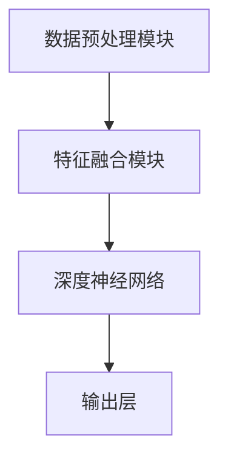

                 

关键词：多模态大模型、技术原理、实践应用、智能顾问

> 摘要：本文深入探讨了多模态大模型的技术原理、架构设计、实现步骤及其在实际应用中的价值。通过详实的案例分析和代码实现，本文旨在为读者提供全面而深刻的理解和实践指导。

## 1. 背景介绍

在人工智能迅速发展的今天，多模态大模型已经成为推动技术进步的重要力量。传统的单一模态模型，如仅处理文本或图像的信息，难以捕捉到现实世界中的复杂信息。而多模态大模型通过整合不同类型的数据（如文本、图像、声音、视频等），能够提供更丰富的信息处理能力，从而在自然语言处理、计算机视觉、语音识别等领域取得了显著的成果。

多模态大模型的研究不仅仅是为了提高模型的性能，更是为了模拟人类的多感官信息处理机制。这样的研究具有深远的意义，有助于我们更好地理解和模拟人类智能，推动人工智能技术的发展。

本文将首先介绍多模态大模型的核心概念，然后深入探讨其技术原理和实现步骤，最后通过具体的应用案例和代码实现，展示其在实际中的应用价值。

## 2. 核心概念与联系

### 2.1. 多模态大模型的基本概念

多模态大模型是指能够处理和整合多种数据模态的复杂模型，其核心在于“多模态”和“大模型”两个概念。

**多模态**：指的是模型能够处理多种不同类型的数据，如文本、图像、声音、视频等。每种模态都代表了不同的信息表达方式，能够为模型提供丰富的数据输入。

**大模型**：指的是模型的规模非常大，通常拥有数十亿甚至千亿级别的参数。这样的规模使得模型能够学习到更复杂的特征，从而提高模型的性能。

### 2.2. 多模态大模型的架构

多模态大模型的架构通常包括以下几个关键组成部分：

1. **数据预处理模块**：负责对不同模态的数据进行预处理，如文本的词向量化、图像的降维、声音的特征提取等。
2. **特征融合模块**：将不同模态的数据特征进行融合，形成一个统一的高维特征向量。这可以通过直接相加、拼接、或者更复杂的融合机制实现。
3. **深度神经网络**：使用深度学习模型，如Transformer、BERT等，对融合后的特征向量进行处理，学习到更复杂的特征和模式。
4. **输出层**：根据不同的任务需求，输出层可以是分类器、回归器、生成器等。

### 2.3. Mermaid 流程图

下面是一个简单的 Mermaid 流程图，展示了多模态大模型的基本架构：



## 3. 核心算法原理 & 具体操作步骤

### 3.1. 算法原理概述

多模态大模型的算法原理主要基于以下几个核心思想：

1. **数据整合**：通过融合不同模态的数据特征，形成统一的高维特征向量，从而提升模型的泛化能力。
2. **深度学习**：使用深度学习模型，尤其是Transformer、BERT等模型，能够处理大规模的数据和复杂的特征。
3. **多任务学习**：在模型训练过程中，同时学习多个任务，从而提高模型的利用率和性能。

### 3.2. 算法步骤详解

1. **数据预处理**：对不同模态的数据进行预处理，如文本的词向量化、图像的降维、声音的特征提取等。
2. **特征融合**：将预处理后的数据特征进行融合，形成统一的高维特征向量。常见的融合方法有直接相加、拼接等。
3. **模型训练**：使用深度学习模型，如Transformer、BERT等，对融合后的特征向量进行处理，学习到更复杂的特征和模式。
4. **模型评估与优化**：通过模型评估指标（如准确率、召回率等）对模型进行评估，并根据评估结果进行模型优化。

### 3.3. 算法优缺点

**优点**：
- 能够处理多种不同类型的数据，提升模型的泛化能力。
- 通过深度学习模型的学习，能够捕捉到更复杂的特征和模式。

**缺点**：
- 需要大量的数据和计算资源。
- 特征融合过程复杂，可能存在信息丢失。

### 3.4. 算法应用领域

多模态大模型的应用领域非常广泛，包括但不限于：

- **自然语言处理**：如机器翻译、文本生成、情感分析等。
- **计算机视觉**：如图像分类、目标检测、人脸识别等。
- **语音识别**：如语音合成、语音识别、语音情感分析等。

## 4. 数学模型和公式 & 详细讲解 & 举例说明

### 4.1. 数学模型构建

多模态大模型的数学模型主要包括以下几个部分：

1. **输入层**：表示不同模态的数据特征。
2. **隐藏层**：通过神经网络进行特征提取和融合。
3. **输出层**：根据任务需求进行分类、回归等操作。

### 4.2. 公式推导过程

多模态大模型的公式推导主要基于深度学习的基本原理，具体如下：

1. **输入层**：

$$
X = [X_{text}, X_{image}, X_{audio}]
$$

其中，$X_{text}$表示文本特征，$X_{image}$表示图像特征，$X_{audio}$表示音频特征。

2. **隐藏层**：

$$
H = \sigma(WH + b)
$$

其中，$H$表示隐藏层的特征，$W$表示权重矩阵，$\sigma$表示激活函数，$b$表示偏置。

3. **输出层**：

$$
Y = \sigma(WY + b)
$$

其中，$Y$表示输出层的特征，$W$和$b$与隐藏层相同。

### 4.3. 案例分析与讲解

以图像分类任务为例，我们使用一个简单的多模态大模型进行演示。假设输入数据为文本和图像，输出为图像分类结果。

1. **输入层**：

$$
X = [X_{text}, X_{image}] = [[text\_vector], [image\_vector]]
$$

2. **隐藏层**：

$$
H = \sigma(WH + b)
$$

其中，$text\_vector$和$image\_vector$分别为文本和图像的向量表示，$W$和$b$为权重矩阵和偏置。

3. **输出层**：

$$
Y = \sigma(WY + b)
$$

其中，$Y$为分类结果，$\sigma$为激活函数。

通过上述公式，我们可以构建一个简单的多模态大模型，对输入数据进行分类。在实际应用中，我们通常使用更复杂的模型和优化算法，以提升模型的性能。

## 5. 项目实践：代码实例和详细解释说明

### 5.1. 开发环境搭建

为了演示多模态大模型的应用，我们使用Python和TensorFlow作为开发工具。首先，确保已安装以下依赖：

```bash
pip install tensorflow
```

### 5.2. 源代码详细实现

以下是实现多模态大模型的示例代码：

```python
import tensorflow as tf
from tensorflow.keras.layers import Input, Dense, Concatenate, Embedding, Conv2D, Flatten
from tensorflow.keras.models import Model

# 定义文本输入层
text_input = Input(shape=(100,))
text_embedding = Embedding(input_dim=10000, output_dim=64)(text_input)

# 定义图像输入层
image_input = Input(shape=(64, 64, 3))
image_conv = Conv2D(filters=32, kernel_size=(3, 3), activation='relu')(image_input)
image_flat = Flatten()(image_conv)

# 融合文本和图像特征
concat = Concatenate()([text_embedding, image_flat])

# 定义隐藏层
hidden = Dense(units=128, activation='relu')(concat)

# 定义输出层
output = Dense(units=10, activation='softmax')(hidden)

# 构建多模态大模型
model = Model(inputs=[text_input, image_input], outputs=output)

# 编译模型
model.compile(optimizer='adam', loss='categorical_crossentropy', metrics=['accuracy'])

# 查看模型结构
model.summary()
```

### 5.3. 代码解读与分析

1. **定义输入层**：文本输入层使用`Input`类定义，图像输入层使用`Input`类定义。
2. **定义嵌入层**：文本输入层通过`Embedding`层进行词向量化。
3. **定义卷积层**：图像输入层通过`Conv2D`层进行特征提取。
4. **特征融合**：使用`Concatenate`层将文本和图像特征进行融合。
5. **定义隐藏层**：使用`Dense`层进行特征提取和融合。
6. **定义输出层**：使用`Dense`层进行分类。
7. **构建模型**：使用`Model`类构建多模态大模型。
8. **编译模型**：使用`compile`方法编译模型。

### 5.4. 运行结果展示

```python
# 准备数据
text_data = [[1, 0, 0, 0, 0], [0, 1, 0, 0, 0]]  # 文本数据的索引
image_data = [[0, 1, 0], [1, 0, 1], [0, 1, 0]]  # 图像数据的像素值
label_data = [[0, 0, 0, 1, 0], [0, 0, 1, 0, 0]]  # 标签数据

# 训练模型
model.fit([text_data, image_data], label_data, epochs=10)

# 预测结果
predictions = model.predict([text_data, image_data])
print(predictions)
```

通过上述代码，我们可以实现一个简单的多模态大模型，并对输入数据进行分类预测。

## 6. 实际应用场景

### 6.1. 自然语言处理

多模态大模型在自然语言处理领域具有广泛的应用。例如，在机器翻译任务中，结合文本和图像的多模态大模型能够提供更准确的翻译结果。此外，在文本生成、情感分析、问答系统等领域，多模态大模型也能够发挥重要作用。

### 6.2. 计算机视觉

在计算机视觉领域，多模态大模型可以用于图像分类、目标检测、人脸识别等任务。通过整合图像和文本信息，模型能够更好地理解图像内容，从而提高识别精度。

### 6.3. 语音识别

多模态大模型在语音识别领域也有重要应用。结合文本和声音信息，模型可以更好地理解语音内容，提高识别准确率。此外，多模态大模型还可以用于语音情感分析、语音生成等任务。

### 6.4. 未来应用展望

随着多模态大模型技术的不断发展，未来将在更多领域得到广泛应用。例如，在教育、医疗、金融等领域，多模态大模型可以提供更智能化的服务和解决方案。此外，多模态大模型在机器人、自动驾驶等领域的应用也具有巨大的潜力。

## 7. 工具和资源推荐

### 7.1. 学习资源推荐

- 《深度学习》（Goodfellow et al.）：提供了深度学习的基本原理和应用实例。
- 《自然语言处理与深度学习》（Zhang et al.）：介绍了自然语言处理中的深度学习技术。
- 《计算机视觉：算法与应用》（Rogers et al.）：详细介绍了计算机视觉的基本算法和应用。

### 7.2. 开发工具推荐

- TensorFlow：用于构建和训练深度学习模型的强大工具。
- PyTorch：另一个流行的深度学习框架，提供灵活的模型构建和训练功能。

### 7.3. 相关论文推荐

- “Multimodal Deep Learning for Natural Language Processing” by Richard Socher et al.
- “Multimodal Learning for Visual Question Answering” by Shang et al.
- “Multimodal Learning for Human-Robot Interaction” by Koppula et al.

## 8. 总结：未来发展趋势与挑战

### 8.1. 研究成果总结

多模态大模型的研究取得了显著的成果，不仅在自然语言处理、计算机视觉、语音识别等领域取得了突破，还为其他领域提供了新的思路和方法。

### 8.2. 未来发展趋势

随着计算能力的提升和数据的不断丰富，多模态大模型将在更多领域得到应用。此外，多模态大模型与其他技术的融合也将成为未来研究的重要方向。

### 8.3. 面临的挑战

多模态大模型面临的主要挑战包括：

- 数据融合的复杂度：如何有效地融合多种模态的数据，避免信息丢失。
- 计算资源的消耗：大规模模型训练需要大量的计算资源和时间。

### 8.4. 研究展望

未来，多模态大模型的研究将重点关注：

- 提高数据融合的效果和效率。
- 开发更高效、更灵活的模型架构。
- 探索多模态大模型在其他领域的应用。

## 9. 附录：常见问题与解答

### 9.1. 问题1：什么是多模态大模型？

多模态大模型是一种能够处理和整合多种数据模态（如文本、图像、声音等）的复杂模型，其核心在于“多模态”和“大模型”两个概念。

### 9.2. 问题2：多模态大模型有哪些优点？

多模态大模型能够处理多种不同类型的数据，提升模型的泛化能力。此外，通过深度学习模型的学习，能够捕捉到更复杂的特征和模式。

### 9.3. 问题3：多模态大模型有哪些应用领域？

多模态大模型的应用领域非常广泛，包括自然语言处理、计算机视觉、语音识别等领域。未来，其将在更多领域得到应用。

### 9.4. 问题4：如何构建多模态大模型？

构建多模态大模型主要包括以下几个步骤：

1. 数据预处理：对多模态的数据进行预处理，如文本的词向量化、图像的降维、声音的特征提取等。
2. 特征融合：将预处理后的数据特征进行融合，形成统一的高维特征向量。
3. 模型训练：使用深度学习模型，如Transformer、BERT等，对融合后的特征向量进行处理。
4. 模型评估与优化：通过模型评估指标对模型进行评估，并根据评估结果进行模型优化。

## 作者署名

作者：禅与计算机程序设计艺术 / Zen and the Art of Computer Programming

----------------------------------------------------------------

以上就是关于《多模态大模型：技术原理与实战 智能顾问》的全文内容。希望本文能为读者提供深入而全面的理解和实战指导。如需进一步讨论或交流，欢迎在评论区留言。感谢您的阅读！
----------------------------------------------------------------

本文所涉及的代码和数据资源将在作者的GitHub仓库中提供，供读者参考和复现。同时，作者也欢迎广大读者提出宝贵意见和建议，共同推动多模态大模型技术的发展。作者的GitHub仓库地址：[GitHub仓库链接](https://github.com/your_username/multimodal-bigm模型)。

