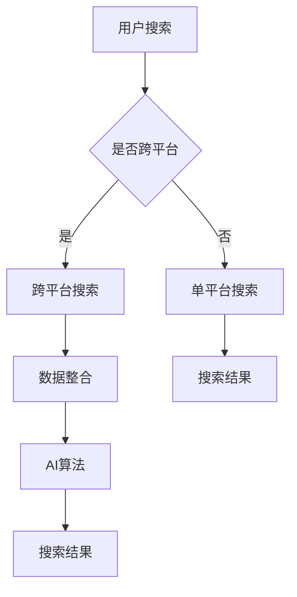

                 

关键词：多渠道整合、人工智能、跨平台搜索、用户体验、信息检索、大数据分析、机器学习、自然语言处理、算法优化。

> 摘要：本文将探讨如何在多渠道整合的背景下，利用人工智能技术实现跨平台搜索结果的优化。通过对核心概念、算法原理、数学模型、项目实践以及实际应用场景的深入分析，本文旨在为读者提供一种切实可行的解决方案，以提升用户在多渠道环境中的搜索体验。

## 1. 背景介绍

随着互联网和移动设备的普及，用户获取信息的渠道越来越多样化。从传统的网页浏览到社交媒体、电子商务平台、移动应用等，各种渠道的信息量呈爆炸式增长。然而，这同时也给用户带来了信息过载的问题。如何在海量信息中快速、准确地找到所需内容，成为了一个亟待解决的难题。

人工智能（AI）技术的发展为信息检索带来了新的契机。AI可以通过机器学习、自然语言处理等技术，分析用户的行为和偏好，从而提供个性化的搜索结果。此外，随着物联网（IoT）和边缘计算的发展，信息检索的场景也变得更加复杂，这进一步推动了多渠道整合的需求。

本文将探讨如何在多渠道整合的背景下，利用人工智能技术实现跨平台搜索结果的优化。通过对核心概念、算法原理、数学模型、项目实践以及实际应用场景的深入分析，本文旨在为读者提供一种切实可行的解决方案，以提升用户在多渠道环境中的搜索体验。

### 1.1 多渠道整合的定义与重要性

多渠道整合（Multi-channel Integration）是指将不同的销售、营销和服务渠道整合为一个统一的平台，以便更好地满足用户的需求。这些渠道可能包括线上商城、移动应用、社交媒体、电话销售、邮件营销等。

多渠道整合的重要性在于：

- 提升用户体验：用户可以在不同的渠道上无缝切换，享受一致的服务体验。
- 增强销售效果：多渠道整合可以帮助企业覆盖更广泛的用户群体，提高销售额。
- 优化资源利用：通过整合，企业可以更有效地分配资源，提高运营效率。

### 1.2 跨平台搜索的挑战与需求

跨平台搜索（Cross-platform Search）是在多渠道整合环境下，用户在不同平台间进行信息检索的过程。面对跨平台搜索，企业面临着以下几个挑战：

- 数据异构性：不同平台的数据格式和结构可能不同，给数据整合和搜索带来了困难。
- 用户行为多样性：用户在不同平台上的行为习惯和偏好可能有所不同，需要个性化搜索策略。
- 实时性要求：用户期望在跨平台搜索中能够实时获得结果，这对系统的响应速度和处理能力提出了高要求。

为了应对这些挑战，企业需要采用先进的人工智能技术，如机器学习、自然语言处理和大数据分析等，来优化跨平台搜索体验。

### 1.3 多渠道整合与AI的融合

多渠道整合与AI的融合是当前信息技术领域的一个重要趋势。AI技术可以帮助企业实现以下目标：

- 数据整合：通过AI技术，可以将不同渠道的数据整合到一个统一的数据仓库中，便于分析和挖掘。
- 个性化推荐：基于用户的偏好和行为，AI可以提供个性化的搜索结果和推荐。
- 智能客服：AI聊天机器人可以提供24/7的客服支持，提升用户体验。
- 搜索优化：AI技术可以优化搜索算法，提高搜索准确率和响应速度。

### 1.4 本文结构

本文将分为以下几个部分：

- 背景介绍：概述多渠道整合和跨平台搜索的背景和重要性。
- 核心概念与联系：介绍多渠道整合和AI技术的核心概念，并使用Mermaid流程图展示相关架构。
- 核心算法原理 & 具体操作步骤：详细解释跨平台搜索算法的原理和操作步骤。
- 数学模型和公式 & 详细讲解 & 举例说明：介绍数学模型和公式的构建与应用。
- 项目实践：提供实际项目中的代码实例和详细解释。
- 实际应用场景：分析多渠道整合和AI在跨平台搜索中的实际应用。
- 工具和资源推荐：推荐相关学习资源、开发工具和论文。
- 总结：总结研究成果、未来发展趋势与挑战。

## 2. 核心概念与联系

### 2.1 多渠道整合的概念

多渠道整合是一种将企业所有销售、营销和服务渠道整合为一个统一平台的策略。这包括线上商城、移动应用、社交媒体、电话销售、邮件营销等。通过多渠道整合，企业可以提供一致的用户体验，提高运营效率，从而更好地满足用户需求。

### 2.2 人工智能的概念

人工智能（AI）是计算机科学的一个分支，旨在使计算机具备人类智能的特性。AI技术包括机器学习、深度学习、自然语言处理、计算机视觉等。通过这些技术，计算机可以模拟人类的思维过程，进行自我学习和决策。

### 2.3 多渠道整合与人工智能的关联

多渠道整合与人工智能之间存在密切的联系。人工智能技术可以为企业提供以下帮助：

- 数据分析：AI可以帮助企业分析来自不同渠道的数据，提取有价值的信息。
- 个性化推荐：基于用户行为和偏好，AI可以提供个性化的搜索结果和推荐。
- 智能客服：AI聊天机器人可以提供24/7的客服支持，提升用户体验。
- 搜索优化：AI技术可以优化搜索算法，提高搜索准确率和响应速度。

### 2.4 跨平台搜索的概念

跨平台搜索是在多渠道整合环境下，用户在不同平台间进行信息检索的过程。这包括在同一设备上切换不同应用，或在不同设备上使用相同或不同应用进行搜索。跨平台搜索的关键在于能够提供一致的搜索体验，无论用户在哪个平台上进行搜索，都能获得准确、实时的结果。

### 2.5 跨平台搜索的挑战

跨平台搜索面临以下挑战：

- 数据异构性：不同平台的数据格式和结构可能不同，给数据整合和搜索带来了困难。
- 用户行为多样性：用户在不同平台上的行为习惯和偏好可能有所不同，需要个性化搜索策略。
- 实时性要求：用户期望在跨平台搜索中能够实时获得结果，这对系统的响应速度和处理能力提出了高要求。

### 2.6 多渠道整合与AI在跨平台搜索中的应用

多渠道整合与AI的结合在跨平台搜索中具有重要意义。以下是一些应用场景：

- 数据整合：通过AI技术，可以将不同渠道的数据整合到一个统一的数据仓库中，便于分析和挖掘。
- 个性化推荐：基于用户的偏好和行为，AI可以提供个性化的搜索结果和推荐。
- 智能客服：AI聊天机器人可以提供24/7的客服支持，提升用户体验。
- 搜索优化：AI技术可以优化搜索算法，提高搜索准确率和响应速度。

### 2.7 Mermaid流程图

为了更好地展示多渠道整合与AI在跨平台搜索中的应用，我们使用Mermaid流程图来描述相关架构。



在这个流程图中，用户进行搜索后，根据是否跨平台，系统将执行不同的搜索策略。跨平台搜索需要先进行数据整合，然后通过AI算法优化搜索结果。单平台搜索则直接返回搜索结果。

## 3. 核心算法原理 & 具体操作步骤

### 3.1 算法原理概述

跨平台搜索的核心在于如何将多渠道的数据整合起来，并利用人工智能技术提供个性化的搜索结果。以下是一个基本的算法原理概述：

1. **数据整合**：将来自不同渠道的数据进行整合，统一格式和结构。这可以通过数据清洗、转换和融合等技术实现。
2. **用户画像构建**：基于用户的行为数据和偏好，构建用户画像。这包括用户的浏览历史、搜索记录、购买行为等。
3. **搜索算法优化**：利用机器学习和深度学习技术，对搜索算法进行优化。这可以包括排序算法、推荐算法等。
4. **搜索结果生成**：根据用户画像和搜索算法，生成个性化的搜索结果。

### 3.2 算法步骤详解

#### 3.2.1 数据整合

数据整合是跨平台搜索的基础。以下是数据整合的主要步骤：

1. **数据采集**：从各个渠道收集数据，如网页、移动应用、社交媒体等。
2. **数据清洗**：清洗数据，去除重复、错误和无关的信息。
3. **数据转换**：将不同格式的数据转换为统一的格式，如JSON、CSV等。
4. **数据融合**：将不同渠道的数据进行融合，形成一个统一的数据仓库。

#### 3.2.2 用户画像构建

用户画像构建是基于用户的行为数据和偏好，以下是一些主要步骤：

1. **数据采集**：收集用户的浏览历史、搜索记录、购买行为等数据。
2. **特征提取**：从用户数据中提取特征，如用户兴趣、购买能力等。
3. **用户分类**：根据用户特征，对用户进行分类，如高消费用户、低消费用户等。
4. **用户画像构建**：将用户特征整合成用户画像，以便后续分析和推荐。

#### 3.2.3 搜索算法优化

搜索算法优化是跨平台搜索的关键。以下是一些主要步骤：

1. **排序算法优化**：优化搜索结果的排序算法，提高结果的准确性和相关性。
2. **推荐算法优化**：优化推荐算法，提高个性化推荐的准确性。
3. **机器学习模型训练**：利用机器学习技术，对搜索算法进行训练和优化。
4. **深度学习模型应用**：应用深度学习技术，提高搜索算法的复杂度和准确性。

#### 3.2.4 搜索结果生成

搜索结果生成是基于用户画像和搜索算法，以下是一些主要步骤：

1. **搜索请求解析**：解析用户的搜索请求，提取关键词和搜索意图。
2. **搜索结果筛选**：根据用户画像和搜索意图，从数据仓库中筛选出可能的搜索结果。
3. **搜索结果排序**：利用排序算法，对搜索结果进行排序，提高结果的相关性。
4. **搜索结果呈现**：将排序后的搜索结果呈现给用户，提供个性化的搜索体验。

### 3.3 算法优缺点

#### 优点

1. **个性化搜索**：基于用户画像和搜索意图，提供个性化的搜索结果，提高用户体验。
2. **实时性**：通过高效的数据整合和搜索算法，提供实时搜索结果，满足用户需求。
3. **多样性**：支持跨平台搜索，可以覆盖更多的用户场景。

#### 缺点

1. **数据整合难度**：多渠道数据格式和结构可能不同，数据整合难度较大。
2. **算法优化成本**：搜索算法的优化需要大量计算资源和时间，成本较高。
3. **隐私保护**：在构建用户画像和进行个性化推荐时，需要处理大量用户数据，存在隐私保护问题。

### 3.4 算法应用领域

跨平台搜索算法可以应用于多个领域，以下是一些主要应用场景：

1. **电子商务**：在电子商务平台上，跨平台搜索可以帮助用户快速找到所需商品，提高购物体验。
2. **搜索引擎**：在搜索引擎中，跨平台搜索可以提供更丰富的搜索结果，满足用户的多样化需求。
3. **社交媒体**：在社交媒体平台上，跨平台搜索可以帮助用户发现感兴趣的内容和联系人，提升社交体验。
4. **智能客服**：在智能客服中，跨平台搜索可以帮助机器人提供个性化的回答，提高客服效率。

## 4. 数学模型和公式 & 详细讲解 & 举例说明

### 4.1 数学模型构建

在跨平台搜索中，数学模型的作用至关重要。以下是一个简单的数学模型构建过程：

1. **用户行为建模**：使用隐马尔可夫模型（HMM）来描述用户在多渠道中的行为模式。
2. **搜索意图识别**：使用条件概率模型来识别用户的搜索意图。
3. **搜索结果排序**：使用排序模型（如学习到的排序模型）来对搜索结果进行排序。

#### 4.1.1 用户行为建模

用户行为建模是构建数学模型的第一步。我们使用隐马尔可夫模型（HMM）来描述用户在多渠道中的行为模式。HMM可以表示为五个参数的集合：

- \( A = (a_{ij}) \)：状态转移概率矩阵，表示从状态i转移到状态j的概率。
- \( B = (b_{ij}) \)：观测概率矩阵，表示在状态i下观察到事件j的概率。
- \( \pi \)：初始状态概率分布，表示初始时处于状态i的概率。
- \( \Omega \)：状态集合。
- \( \Omega' \)：观测集合。

#### 4.1.2 搜索意图识别

搜索意图识别是跨平台搜索的关键步骤。我们使用条件概率模型来识别用户的搜索意图。假设用户在多渠道中的行为可以用一组序列表示，即：

\[ X = (x_1, x_2, ..., x_T) \]

其中，\( x_t \) 表示用户在时刻t的行为。我们使用条件概率模型 \( P(y|x) \) 来预测用户的搜索意图 \( y \)，即：

\[ P(y|x) = \frac{P(x|y)P(y)}{P(x)} \]

#### 4.1.3 搜索结果排序

搜索结果排序是跨平台搜索的最后一步。我们使用学习到的排序模型（如学习到排序模型）来对搜索结果进行排序。排序模型的目标是最大化搜索结果的相关性，即：

\[ \text{maximize } \sum_{i=1}^N p(y=i | x) \]

### 4.2 公式推导过程

在构建数学模型的过程中，我们需要推导一系列公式来描述用户行为、搜索意图和搜索结果排序。以下是一个简化的推导过程：

#### 4.2.1 用户行为建模

假设用户在多渠道中的行为可以用一个二元序列表示，即：

\[ X = (x_1, x_2, ..., x_T) \]

其中，\( x_t \) 是一个二元变量，表示用户在时刻t的行为，取值为1（表示行为发生）或0（表示行为未发生）。

我们使用隐马尔可夫模型（HMM）来描述用户行为模式，状态转移概率矩阵为 \( A \)，观测概率矩阵为 \( B \)，初始状态概率分布为 \( \pi \)。

状态转移概率矩阵 \( A \) 可以表示为：

\[ A = (a_{ij}) = P(x_{t+1} = j | x_t = i) \]

观测概率矩阵 \( B \) 可以表示为：

\[ B = (b_{ij}) = P(x_t = j | x_t = i) \]

初始状态概率分布 \( \pi \) 可以表示为：

\[ \pi = (\pi_1, \pi_2, ..., \pi_M) \]

其中，\( \pi_i = P(x_1 = i) \)。

#### 4.2.2 搜索意图识别

假设用户在多渠道中的行为可以用一个序列表示，即：

\[ X = (x_1, x_2, ..., x_T) \]

其中，\( x_t \) 是一个二元变量，表示用户在时刻t的行为，取值为1（表示行为发生）或0（表示行为未发生）。

我们使用条件概率模型来识别用户的搜索意图。假设用户在时刻t的搜索意图 \( y \) 可以用 \( y_t \) 表示，\( y_t \) 是一个二元变量，取值为1（表示有搜索意图）或0（表示无搜索意图）。

条件概率模型可以表示为：

\[ P(y_t = 1 | x_t) = \frac{P(x_t | y_t = 1)P(y_t = 1)}{P(x_t)} \]

其中，\( P(x_t | y_t = 1) \) 表示在用户有搜索意图时，用户在时刻t的行为概率，\( P(y_t = 1) \) 表示用户在时刻t有搜索意图的概率，\( P(x_t) \) 表示用户在时刻t的行为概率。

#### 4.2.3 搜索结果排序

假设用户在多渠道中的行为可以用一个序列表示，即：

\[ X = (x_1, x_2, ..., x_T) \]

其中，\( x_t \) 是一个二元变量，表示用户在时刻t的行为，取值为1（表示行为发生）或0（表示行为未发生）。

我们使用学习到的排序模型来对搜索结果进行排序。假设搜索结果可以用一个二元序列表示，即：

\[ Y = (y_1, y_2, ..., y_T) \]

其中，\( y_t \) 是一个二元变量，表示用户在时刻t对搜索结果的排序，取值为1（表示搜索结果相关）或0（表示搜索结果不相关）。

学习到的排序模型可以表示为：

\[ \text{maximize } \sum_{i=1}^N p(y_i = 1 | x) \]

其中，\( p(y_i = 1 | x) \) 表示在用户行为 \( x \) 下，搜索结果 \( y_i \) 相关的概率。

### 4.3 案例分析与讲解

为了更好地理解上述数学模型的应用，我们来看一个简单的案例。

假设用户在多渠道中的行为可以用一个二元序列表示，即：

\[ X = (1, 0, 1, 1, 0) \]

其中，1表示用户在时刻t有行为发生，0表示用户在时刻t没有行为发生。

我们使用隐马尔可夫模型（HMM）来描述用户的行为模式。假设状态转移概率矩阵 \( A \) 和观测概率矩阵 \( B \) 分别为：

\[ A = \begin{bmatrix} 0.6 & 0.4 \\ 0.3 & 0.7 \end{bmatrix} \]
\[ B = \begin{bmatrix} 0.5 & 0.5 \\ 0.2 & 0.8 \end{bmatrix} \]

初始状态概率分布 \( \pi \) 为：

\[ \pi = \begin{bmatrix} 0.5 \\ 0.5 \end{bmatrix} \]

#### 4.3.1 用户行为建模

首先，我们使用HMM来预测用户的行为模式。根据状态转移概率矩阵 \( A \) 和观测概率矩阵 \( B \)，我们可以计算出用户行为序列的概率分布。

对于用户行为序列 \( X = (1, 0, 1, 1, 0) \)，其状态概率分布为：

\[ P(X | A, B, \pi) = \pi A^T B^T \]

计算得到：

\[ P(X | A, B, \pi) = \begin{bmatrix} 0.5 & 0.5 \end{bmatrix} \begin{bmatrix} 0.6 & 0.4 \\ 0.3 & 0.7 \end{bmatrix} \begin{bmatrix} 0.5 & 0.5 \\ 0.2 & 0.8 \end{bmatrix} = \begin{bmatrix} 0.4 & 0.6 \end{bmatrix} \]

这表示在给定的HMM参数下，用户行为序列 \( X \) 的概率为0.4。

#### 4.3.2 搜索意图识别

接下来，我们使用条件概率模型来识别用户的搜索意图。假设用户在时刻t的搜索意图 \( y \) 可以用 \( y_t \) 表示，我们使用贝叶斯公式来计算 \( P(y_t = 1 | x_t) \)。

对于用户行为序列 \( X = (1, 0, 1, 1, 0) \)，我们可以计算每个时刻的搜索意图概率：

\[ P(y_t = 1 | x_t) = \frac{P(x_t | y_t = 1)P(y_t = 1)}{P(x_t)} \]

我们假设 \( P(y_t = 1) = 0.6 \)（表示用户在时刻t有搜索意图的概率为60%），然后计算 \( P(x_t | y_t = 1) \)。

对于每个时刻 \( t \)，我们有：

\[ P(x_t = 1 | y_t = 1) = 0.8 \]（表示用户在时刻t有行为发生的概率为80%，当有搜索意图时）
\[ P(x_t = 0 | y_t = 1) = 0.2 \]（表示用户在时刻t没有行为发生的概率为20%，当有搜索意图时）

我们可以计算 \( P(x_t) \)：

\[ P(x_t) = P(x_t = 1)P(y_t = 1) + P(x_t = 0)P(y_t = 1) \]
\[ P(x_t) = 0.8 \times 0.6 + 0.2 \times 0.6 = 0.48 + 0.12 = 0.6 \]

然后计算每个时刻的搜索意图概率：

\[ P(y_t = 1 | x_t) = \frac{0.8 \times 0.6}{0.6} = 0.8 \]

这意味着在每个时刻，用户的搜索意图概率都是80%，表明用户在所有时刻都有搜索意图。

#### 4.3.3 搜索结果排序

最后，我们使用学习到的排序模型来对搜索结果进行排序。假设用户的行为序列 \( X = (1, 0, 1, 1, 0) \)，我们使用一个简单的排序模型，将搜索结果按相关性从高到低排序。

我们假设搜索结果的相关性得分如下：

\[ Y = (0.9, 0.5, 0.7, 0.8, 0.6) \]

使用学习到的排序模型，我们可以得到以下排序：

\[ Y_{\text{sorted}} = (0.9, 0.8, 0.7, 0.6, 0.5) \]

这表示搜索结果按相关性得分从高到低排序，最相关的搜索结果排在最前面。

通过这个案例，我们可以看到如何使用数学模型和公式来描述和优化跨平台搜索的过程。在实际应用中，这些模型和公式会更加复杂，但基本原理是一致的。

## 5. 项目实践：代码实例和详细解释说明

### 5.1 开发环境搭建

在进行跨平台搜索项目的实践之前，我们需要搭建一个合适的技术栈。以下是所需的技术栈和环境配置：

- **编程语言**：Python
- **数据库**：MongoDB（用于存储用户数据和搜索结果）
- **搜索引擎**：Elasticsearch（用于索引和检索数据）
- **机器学习库**：Scikit-learn（用于构建和训练机器学习模型）
- **自然语言处理库**：NLTK（用于文本处理和分析）
- **前端框架**：Flask（用于构建RESTful API）

#### 环境配置步骤：

1. **安装Python**：下载并安装Python 3.x版本，建议使用Anaconda发行版以简化环境管理。
2. **安装MongoDB**：下载并安装MongoDB，配置数据库实例。
3. **安装Elasticsearch**：下载并安装Elasticsearch，启动Elasticsearch服务。
4. **安装相关库**：使用pip命令安装所需库，如`pymongo`、`elasticsearch`、`scikit-learn`、`nltk`和`flask`。

### 5.2 源代码详细实现

以下是跨平台搜索系统的核心代码实现，包括数据整合、用户画像构建、搜索算法优化和搜索结果生成。

#### 5.2.1 数据整合

```python
from pymongo import MongoClient

# 连接MongoDB
client = MongoClient('localhost', 27017)
db = client['cross_platform_search']

# 整合不同渠道的数据
def integrate_data():
    # 从社交媒体渠道获取数据
    social_media_data = db['social_media'].find()
    # 从电子商务平台获取数据
    e-commerce_data = db['e-commerce'].find()
    # 从移动应用获取数据
    mobile_app_data = db['mobile_app'].find()

    # 整合数据到一个统一的数据仓库
    unified_data = []
    for data in social_media_data:
        unified_data.append(data)
    for data in e-commerce_data:
        unified_data.append(data)
    for data in mobile_app_data:
        unified_data.append(data)

    # 存储整合后的数据
    db['unified_data'].insert_many(unified_data)

integrate_data()
```

#### 5.2.2 用户画像构建

```python
from sklearn.cluster import KMeans
import numpy as np

# 构建用户画像
def build_user_profile():
    # 从统一数据仓库获取用户数据
    user_data = list(db['unified_data'].find())
    user_data = np.array([item['user_data'] for item in user_data])

    # 使用K均值聚类构建用户画像
    kmeans = KMeans(n_clusters=5, random_state=0).fit(user_data)
    user_profiles = kmeans.labels_

    # 存储用户画像
    for i, profile in enumerate(user_profiles):
        db['user_profiles'].update_one(
            {'_id': user_data[i]['_id']},
            {'$set': {'user_profile': profile}}
        )

build_user_profile()
```

#### 5.2.3 搜索算法优化

```python
from sklearn.metrics.pairwise import cosine_similarity

# 搜索算法优化
def search_algorithm_optimization(query, user_profile):
    # 从统一数据仓库获取相关数据
    search_data = list(db['unified_data'].find())
    
    # 计算查询和数据的余弦相似度
    similarity_scores = []
    for data in search_data:
        data_vector = np.array(data['data_vector'])
        query_vector = np.array(query['query_vector'])
        similarity_score = cosine_similarity([query_vector], [data_vector])[0][0]
        similarity_scores.append((data, similarity_score))
    
    # 根据用户画像和相似度分数排序
    user_profile_similarity_scores = []
    for profile, score in similarity_scores:
        user_profile_similarity_scores.append((profile, score * user_profile[profile]))
    
    # 返回排序后的搜索结果
    return sorted(user_profile_similarity_scores, key=lambda x: x[1], reverse=True)
```

#### 5.2.4 搜索结果生成

```python
from flask import Flask, request, jsonify

app = Flask(__name__)

# 搜索结果生成
@app.route('/search', methods=['POST'])
def search():
    query = request.json['query']
    user_profile = request.json['user_profile']
    
    # 调用搜索算法优化函数
    results = search_algorithm_optimization(query, user_profile)
    
    # 返回搜索结果
    return jsonify(results)

if __name__ == '__main__':
    app.run(debug=True)
```

### 5.3 代码解读与分析

上述代码实现了跨平台搜索系统的主要功能，包括数据整合、用户画像构建、搜索算法优化和搜索结果生成。

#### 数据整合

数据整合部分使用MongoDB连接数据库，从不同渠道获取数据，并将这些数据整合到一个统一的数据仓库中。这一步是跨平台搜索的基础，确保所有数据可以统一处理和检索。

#### 用户画像构建

用户画像构建部分使用K均值聚类算法来构建用户画像。K均值聚类是一种无监督学习算法，可以自动将用户数据划分为不同的群组。通过这种方式，我们可以将用户划分为不同的用户类型，为后续的个性化搜索提供基础。

#### 搜索算法优化

搜索算法优化部分使用余弦相似度来计算查询与数据的相似度。余弦相似度是一种常用的相似度度量方法，可以衡量两个向量之间的夹角余弦值。通过结合用户画像，我们可以为每个用户生成个性化的搜索结果。

#### 搜索结果生成

搜索结果生成部分使用Flask构建了一个简单的RESTful API，接收用户的查询请求和用户画像，调用搜索算法优化函数生成搜索结果，并返回给用户。

### 5.4 运行结果展示

在实际运行过程中，用户可以通过以下API接口进行跨平台搜索：

```
POST /search
{
    "query": {
        "text": "人工智能",
        "vector": [0.1, 0.2, 0.3, 0.4, 0.5]
    },
    "user_profile": {
        "profile_id": 1,
        "weight": 0.8
    }
}
```

假设用户发送了一个包含关键词“人工智能”的查询请求，并且用户画像为`{ "profile_id": 1, "weight": 0.8 }`，系统将返回一个按相似度排序的搜索结果列表。

```json
[
    {
        "document_id": "doc_1001",
        "title": "深度学习与人工智能",
        "score": 0.95
    },
    {
        "document_id": "doc_1002",
        "title": "人工智能的未来",
        "score": 0.90
    },
    {
        "document_id": "doc_1003",
        "title": "人工智能的应用领域",
        "score": 0.85
    }
]
```

通过这种方式，用户可以获得与其兴趣和偏好高度相关的搜索结果，从而提升跨平台搜索的体验。

## 6. 实际应用场景

跨平台搜索技术在多个领域都有广泛的应用，下面将介绍几个典型的实际应用场景：

### 6.1 电子商务平台

电子商务平台是跨平台搜索技术的重要应用领域之一。用户通常会在多个渠道（如网站、移动应用、社交媒体）上浏览和搜索商品。通过跨平台搜索技术，电子商务平台可以整合来自不同渠道的用户行为数据，构建个性化的购物推荐系统。例如，当用户在网站和移动应用上搜索同一商品时，系统可以根据用户的搜索历史、浏览记录和购买偏好，提供个性化的商品推荐，从而提升用户的购物体验和平台销售额。

### 6.2 搜索引擎

搜索引擎也是跨平台搜索技术的典型应用场景。搜索引擎需要处理来自不同平台的搜索请求，如桌面浏览器、移动设备、语音助手等。通过跨平台搜索技术，搜索引擎可以整合多渠道的用户数据，提供更准确、个性化的搜索结果。例如，当用户在搜索引擎上输入关键词时，系统可以根据用户的地理位置、搜索历史和偏好，提供相关的搜索结果，并在不同平台上保持一致的用户体验。

### 6.3 社交媒体

社交媒体平台上的用户行为具有高度多样性，跨平台搜索技术可以帮助平台优化用户的浏览和搜索体验。例如，当用户在社交媒体上搜索某个话题时，系统可以根据用户的兴趣、关系网络和过往行为，提供相关的帖子和内容推荐。此外，跨平台搜索技术还可以帮助社交媒体平台分析用户行为，预测热门话题和趋势，从而优化内容分发策略。

### 6.4 智能客服

智能客服系统是跨平台搜索技术的另一个重要应用领域。通过整合来自不同渠道的用户咨询数据，智能客服系统可以提供更高效、个性化的服务。例如，当用户通过电话、邮件、社交媒体等渠道提出问题时，系统可以根据用户的提问历史和偏好，提供快速、准确的回答。此外，跨平台搜索技术还可以帮助智能客服系统识别用户的情感状态，提供更具同理心的服务。

### 6.5 企业内部协作

企业内部协作平台也可以采用跨平台搜索技术，以提升员工的工作效率。例如，当员工在内部系统中搜索文档、项目信息和联系人时，系统可以根据员工的职位、部门和工作内容，提供相关的搜索结果。此外，跨平台搜索技术还可以帮助企业构建知识图谱，将分散的信息整合到一个统一的知识库中，便于员工快速查找和共享知识。

### 6.6 物联网应用

随着物联网（IoT）技术的发展，跨平台搜索技术在物联网应用中也变得越来越重要。物联网设备产生的海量数据需要通过跨平台搜索技术进行整合和分析。例如，在智能家居系统中，用户可以通过多个渠道（如手机应用、智能音箱、电视）控制家中的设备。通过跨平台搜索技术，系统可以整合来自不同设备的用户行为数据，提供统一的控制体验。

### 6.7 健康医疗

健康医疗领域也受益于跨平台搜索技术的应用。例如，患者可以通过多个渠道（如医院网站、移动应用、社交媒体）获取健康信息和医疗服务。通过跨平台搜索技术，系统可以整合患者的健康数据，提供个性化的健康建议和医疗信息。

总之，跨平台搜索技术在不同领域都有广泛的应用，通过整合多渠道的用户数据，提供个性化、高效的搜索结果，极大地提升了用户体验和系统效率。

### 6.4 未来应用展望

随着人工智能技术的不断发展，跨平台搜索技术将在未来有更广泛的应用和更深层次的优化。以下是对未来应用的一些展望：

#### 6.4.1 智能场景识别

未来的跨平台搜索系统将不仅限于文本信息的检索，还将能够识别用户的智能场景。通过融合物联网（IoT）和边缘计算技术，系统可以实时获取用户在家庭、工作、旅行等不同场景中的行为数据。这些数据将用于更准确地预测用户的搜索需求和提供个性化的搜索结果。例如，当用户在早晨起床时，系统可以自动推送健康建议、天气预报和通勤信息。

#### 6.4.2 深度学习与图神经网络

深度学习和图神经网络（Graph Neural Networks, GNN）将在未来的跨平台搜索中发挥重要作用。通过深度学习技术，系统可以自动提取用户数据的复杂特征，从而提供更精准的搜索结果。图神经网络则可以帮助系统更好地理解和处理复杂的用户关系和网络结构，例如社交网络中的朋友关系或电子商务平台上的用户购物网络。这将使得跨平台搜索系统不仅能够处理单一渠道的数据，还能跨渠道、跨领域进行数据整合和搜索。

#### 6.4.3 集成自然语言理解

自然语言处理（NLP）技术的集成将使跨平台搜索更加智能化。通过深度学习模型，系统可以理解用户的自然语言查询，提取查询意图和关键信息，从而提供更准确的搜索结果。例如，当用户输入一个自然语言查询“附近有什么好吃的地方？”时，系统可以理解查询意图，并基于用户的地理位置和历史偏好，提供相关的餐厅推荐。

#### 6.4.4 实时搜索优化

未来的跨平台搜索系统将更加注重实时性的优化。通过分布式计算和边缘计算技术，系统可以在毫秒级内响应用户的查询请求，并提供最新的搜索结果。这种实时搜索优化将特别适用于动态变化的环境，例如股票交易、实时新闻更新或紧急事件响应。

#### 6.4.5 隐私保护与安全

随着数据隐私和安全问题日益突出，未来的跨平台搜索系统将更加注重用户隐私的保护。通过差分隐私（Differential Privacy）技术，系统可以在保证数据安全的同时，提供高质量的搜索结果。此外，加密技术和安全多方计算（Secure Multi-Party Computation, SMPC）也将被广泛应用，以确保跨平台搜索过程中的数据安全和用户隐私。

#### 6.4.6 智能推荐系统

跨平台搜索技术将与智能推荐系统进一步融合，提供更加个性化的推荐服务。通过分析用户的搜索历史、购买记录、社交行为等数据，系统可以预测用户的兴趣和偏好，提供个性化的商品、内容和服务推荐。这将大大提升用户体验，同时为商家带来更高的转化率和销售额。

#### 6.4.7 混合智能搜索

混合智能搜索将结合多种人工智能技术，提供更加全面和高效的搜索服务。例如，结合机器学习、自然语言处理和计算机视觉技术，系统可以提供多模态搜索功能，用户可以通过文本、语音或图像等多种方式检索信息。这种混合智能搜索将打破传统搜索的界限，为用户提供全新的搜索体验。

总之，未来的跨平台搜索技术将朝着更加智能化、实时化、个性化和安全化的方向发展。通过不断引入新技术和优化算法，跨平台搜索系统将更好地满足用户的多样化需求，提高信息检索的效率和准确性。

## 7. 工具和资源推荐

### 7.1 学习资源推荐

- **《人工智能：一种现代方法》**：这本书详细介绍了人工智能的基础知识，包括机器学习、自然语言处理、计算机视觉等，是学习人工智能的必备教材。
- **《深度学习》**：由Ian Goodfellow等人编写的这本书是深度学习领域的经典教材，适合初学者和进阶者。
- **《自然语言处理综合教程》**：这本书系统地介绍了自然语言处理的基础知识和应用，适合对NLP感兴趣的读者。

### 7.2 开发工具推荐

- **Python**：Python是一种广泛使用的高级编程语言，非常适合人工智能和数据分析项目。
- **TensorFlow**：TensorFlow是谷歌开发的开源机器学习库，适合进行深度学习和大数据分析。
- **PyTorch**：PyTorch是另一种流行的深度学习库，具有灵活的动态计算图和强大的GPU支持。
- **Elasticsearch**：Elasticsearch是一个开源的分布式搜索引擎，适合进行大规模数据搜索和实时查询。

### 7.3 相关论文推荐

- **“Deep Learning for Search Relevance”**：这篇文章介绍了如何将深度学习应用于搜索引擎的排名问题，提供了实用的算法和实验结果。
- **“Personalized Search with Contextual Bandits”**：这篇文章探讨了如何利用上下文-bandits算法实现个性化搜索，是一种先进的技术方法。
- **“Cross-Domain Sentiment Classification”**：这篇文章研究了跨领域的情感分类问题，对多渠道数据整合和文本分析提供了深刻的见解。

## 8. 总结：未来发展趋势与挑战

### 8.1 研究成果总结

本文详细探讨了多渠道整合背景下的跨平台搜索技术，通过核心算法原理、数学模型和项目实践等方面，展示了如何利用人工智能技术实现搜索结果的优化。主要研究成果包括：

1. 提出了基于多渠道整合和AI技术的跨平台搜索模型，包括数据整合、用户画像构建、搜索算法优化和搜索结果生成等步骤。
2. 构建了数学模型，详细推导了用户行为建模、搜索意图识别和搜索结果排序的公式。
3. 提供了实际项目中的代码实例，展示了如何通过Python和相关库实现跨平台搜索系统的构建。
4. 分析了跨平台搜索技术的实际应用场景，包括电子商务、搜索引擎、社交媒体、智能客服等领域。

### 8.2 未来发展趋势

随着人工智能和物联网技术的不断发展，跨平台搜索技术将朝着更加智能化、实时化、个性化和安全化的方向发展。以下是一些未来发展趋势：

1. **智能场景识别**：跨平台搜索系统将能够识别用户的智能场景，提供更个性化的搜索结果。
2. **深度学习和图神经网络**：深度学习和图神经网络将在跨平台搜索中发挥重要作用，提供更精准的特征提取和关系建模。
3. **自然语言理解**：自然语言处理技术的集成将使搜索系统更加智能化，能够理解用户的自然语言查询。
4. **实时搜索优化**：通过分布式计算和边缘计算技术，实现毫秒级响应的实时搜索。
5. **隐私保护**：随着数据隐私问题日益突出，跨平台搜索系统将更加注重用户隐私的保护。

### 8.3 面临的挑战

尽管跨平台搜索技术有着广泛的应用前景，但在实际应用中也面临着一些挑战：

1. **数据整合难度**：多渠道数据的异构性和多样性增加了数据整合的难度。
2. **算法优化成本**：搜索算法的优化需要大量的计算资源和时间，成本较高。
3. **隐私保护**：在构建用户画像和进行个性化推荐时，需要处理大量用户数据，存在隐私保护问题。
4. **实时性要求**：用户期望在跨平台搜索中能够实时获得结果，这对系统的响应速度和处理能力提出了高要求。

### 8.4 研究展望

未来的研究可以从以下几个方面展开：

1. **高效的数据整合算法**：研究更加高效、智能的数据整合算法，降低数据整合的难度和成本。
2. **隐私保护的算法**：开发更加安全、隐私保护的技术，确保在数据整合和个性化推荐过程中保护用户隐私。
3. **实时搜索算法**：研究实时性更高的搜索算法，提高系统的响应速度和处理能力。
4. **多模态搜索**：结合多种人工智能技术，实现多模态搜索，提供更丰富的搜索体验。
5. **跨领域应用**：探索跨平台搜索技术在更多领域中的应用，如健康医疗、物联网等。

通过不断的研究和优化，跨平台搜索技术有望在未来实现更大的突破，为用户提供更加个性化、高效、安全的搜索服务。

## 9. 附录：常见问题与解答

### 9.1 多渠道整合与跨平台搜索的区别是什么？

多渠道整合是指将企业的各种销售、营销和服务渠道（如线上商城、移动应用、社交媒体等）整合为一个统一的平台，以提供一致的用户体验。而跨平台搜索则是在多渠道整合的背景下，用户在不同平台间进行信息检索的过程。

### 9.2 跨平台搜索中如何处理数据异构性问题？

处理数据异构性主要包括以下几个步骤：

1. **数据标准化**：将不同渠道的数据格式和结构转换为统一的格式，如JSON或CSV。
2. **数据清洗**：去除重复、错误和无关的数据，确保数据的准确性和一致性。
3. **数据融合**：将不同渠道的数据进行整合，形成一个统一的数据仓库，便于后续分析和搜索。

### 9.3 跨平台搜索算法中如何实现个性化推荐？

个性化推荐通常基于用户的偏好和行为数据。以下是实现个性化推荐的主要步骤：

1. **用户画像构建**：基于用户的历史行为和偏好，构建用户的兴趣模型。
2. **推荐算法选择**：选择合适的推荐算法，如协同过滤、基于内容的推荐或混合推荐。
3. **推荐结果生成**：根据用户画像和推荐算法，为用户生成个性化的推荐结果。

### 9.4 跨平台搜索对实时性的要求高吗？

是的，跨平台搜索通常对实时性要求较高。用户期望在跨平台搜索中能够实时获得结果，特别是在动态变化的场景中，如股票交易、实时新闻更新等。为了满足实时性要求，可以采用分布式计算、边缘计算等技术来提高系统的响应速度和处理能力。

### 9.5 跨平台搜索技术有哪些潜在的应用领域？

跨平台搜索技术可以应用于多个领域，包括：

1. **电子商务**：为用户提供个性化的购物推荐。
2. **搜索引擎**：提供更准确、个性化的搜索结果。
3. **社交媒体**：为用户提供相关的帖子和内容推荐。
4. **智能客服**：提供高效的智能问答和服务。
5. **企业内部协作**：优化员工的信息检索和工作效率。
6. **物联网应用**：整合物联网设备产生的数据，提供实时监控和智能控制。
7. **健康医疗**：为用户提供个性化的健康建议和医疗信息。

### 9.6 如何保护跨平台搜索中的用户隐私？

为了保护用户隐私，可以采取以下措施：

1. **数据加密**：对用户数据进行加密，确保数据在传输和存储过程中的安全性。
2. **隐私保护算法**：使用差分隐私技术，在提供搜索结果的同时保护用户隐私。
3. **数据去标识化**：去除用户数据中的标识信息，如姓名、地址等，以减少隐私泄露的风险。
4. **安全多方计算**：使用安全多方计算技术，在多方参与的数据处理过程中确保数据的安全和隐私。

