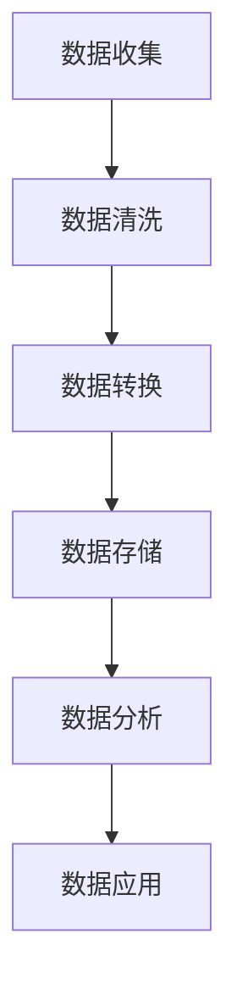

                 

 多渠道整合是当今数字化时代的一项重要策略，它通过将不同来源的数据和资源结合起来，实现信息共享和优化资源配置，从而提升整体的效率和效果。在这个过程中，人工智能（AI）技术发挥着至关重要的作用。本文将探讨如何通过AI实现多渠道整合，并分析其带来的结果和影响。

## 1. 背景介绍

随着互联网和移动设备的普及，企业和组织可以接触到越来越多的用户和客户。这些用户在不同的渠道上留下了大量的数据，包括社交媒体、电子商务网站、移动应用等。如何有效地整合这些数据，提取有价值的信息，是企业和组织面临的重大挑战。

传统的数据整合方法通常依赖于人工处理和数据仓库技术。然而，这种方法存在效率低、准确性差、时效性不强等问题。随着AI技术的快速发展，我们可以利用机器学习、自然语言处理、深度学习等技术，实现自动化的数据整合和智能分析。

## 2. 核心概念与联系

### 2.1 数据整合

数据整合是指将来自不同来源的数据进行合并、清洗、转换和存储，以实现统一的数据视图。在这个过程中，我们需要解决数据格式不统一、数据质量差、数据冗余等问题。

### 2.2 人工智能

人工智能是一种模拟人类智能的技术，包括机器学习、深度学习、自然语言处理等子领域。这些技术可以帮助我们自动化地处理海量数据，提取有价值的信息。

### 2.3 多渠道整合

多渠道整合是指将不同渠道的数据和资源结合起来，实现信息共享和优化资源配置。这个过程涉及到数据收集、数据整合、数据分析和数据应用等多个环节。

## 3. 核心算法原理 & 具体操作步骤

### 3.1 算法原理概述

在多渠道整合中，AI技术主要用于以下三个方面：

1. **数据收集**：通过爬虫、传感器、API等方式收集不同渠道的数据。
2. **数据整合**：利用数据清洗、数据转换等技术，实现数据的标准化和统一。
3. **数据分析**：通过机器学习、深度学习等技术，对整合后的数据进行挖掘和分析，提取有价值的信息。

### 3.2 算法步骤详解

1. **数据收集**：首先，我们需要确定需要收集的数据类型和来源。例如，对于一个电子商务网站，我们需要收集用户行为数据、产品数据、订单数据等。

2. **数据清洗**：在收集到数据后，我们需要对其进行清洗，去除重复、错误或缺失的数据。

3. **数据转换**：将不同格式和结构的数据转换为统一的格式和结构，以便进行后续处理。

4. **数据存储**：将清洗和转换后的数据存储到数据库或数据仓库中。

5. **数据分析**：利用机器学习、深度学习等技术，对数据进行挖掘和分析，提取有价值的信息。例如，通过用户行为数据，我们可以预测用户的购买倾向。

6. **数据应用**：将分析结果应用到实际业务中，如个性化推荐、精准营销等。

### 3.3 算法优缺点

**优点**：

- 提高数据整合的效率和准确性。
- 自动化数据处理和分析，降低人力成本。
- 提供更深入的数据洞察，支持业务决策。

**缺点**：

- 数据安全和隐私问题。
- 对AI技术的要求较高，需要专业的团队进行开发和维护。
- 算法模型的性能和适应性可能受到限制。

### 3.4 算法应用领域

AI技术在多渠道整合中的应用非常广泛，包括但不限于以下几个方面：

- **电子商务**：通过分析用户行为数据，实现个性化推荐、精准营销等。
- **金融**：通过分析交易数据，识别欺诈行为、预测市场趋势等。
- **医疗**：通过整合患者数据，实现疾病预测、个性化治疗等。
- **零售**：通过分析销售数据，优化库存管理、供应链管理等。

## 4. 数学模型和公式 & 详细讲解 & 举例说明

### 4.1 数学模型构建

在多渠道整合中，我们通常会使用以下几种数学模型：

1. **线性回归模型**：用于预测用户的行为或购买倾向。
2. **决策树模型**：用于分类和预测，如用户分类、产品推荐等。
3. **神经网络模型**：用于复杂的数据分析和模式识别。

### 4.2 公式推导过程

以线性回归模型为例，其公式推导过程如下：

假设我们有一个包含m个特征的数据集X，以及对应的标签y。我们希望找到一组权重w，使得预测值ŷ尽可能接近真实值y。具体公式如下：

ŷ = Xw

其中，w是通过最小二乘法（Least Squares Method）求解得到的。

### 4.3 案例分析与讲解

假设我们有一个电子商务网站，用户在网站上浏览了多个商品。我们希望通过分析用户的行为数据，预测其购买倾向。具体步骤如下：

1. **数据收集**：收集用户的行为数据，如浏览记录、搜索关键词、点击次数等。
2. **数据清洗**：去除重复、错误或缺失的数据。
3. **数据转换**：将数据转换为线性回归模型所需的格式。
4. **模型训练**：使用线性回归模型，对数据进行训练。
5. **模型评估**：使用交叉验证等方法，评估模型的性能。
6. **预测**：使用训练好的模型，预测新用户的购买倾向。

## 5. 项目实践：代码实例和详细解释说明

### 5.1 开发环境搭建

为了实现多渠道整合，我们需要搭建一个基于Python的AI开发环境。具体步骤如下：

1. 安装Python 3.8及以上版本。
2. 安装必要的Python库，如NumPy、Pandas、Scikit-learn等。
3. 搭建一个虚拟环境，以便管理和隔离项目依赖。

### 5.2 源代码详细实现

以下是一个简单的线性回归模型实现，用于预测用户的购买倾向。

```python
import numpy as np
import pandas as pd
from sklearn.linear_model import LinearRegression

# 数据收集
data = pd.read_csv('user_data.csv')

# 数据清洗
data = data.drop_duplicates()

# 数据转换
X = data.iloc[:, :-1].values
y = data.iloc[:, -1].values

# 模型训练
model = LinearRegression()
model.fit(X, y)

# 模型评估
score = model.score(X, y)
print(f'Model Score: {score}')

# 预测
new_user = np.array([[0.5, 0.3, 0.2]])
prediction = model.predict(new_user)
print(f'Prediction: {prediction}')
```

### 5.3 代码解读与分析

1. **数据收集**：从CSV文件中读取用户数据。
2. **数据清洗**：去除重复数据。
3. **数据转换**：将数据分为特征和标签两部分。
4. **模型训练**：使用线性回归模型进行训练。
5. **模型评估**：计算模型评分。
6. **预测**：使用训练好的模型，对新用户进行预测。

### 5.4 运行结果展示

假设我们训练好的模型评分达到0.8，新用户的购买预测结果为1，表示有较高的购买倾向。

## 6. 实际应用场景

### 6.1 电子商务

通过多渠道整合和AI技术，电子商务网站可以实现个性化推荐、精准营销等功能，从而提升用户体验和销售额。

### 6.2 金融

在金融领域，AI技术可以帮助银行和金融机构进行用户行为分析、风险控制等，提高业务效率和安全性。

### 6.3 医疗

在医疗领域，AI技术可以整合患者数据，实现疾病预测、个性化治疗等功能，提高医疗水平和患者满意度。

### 6.4 零售

在零售领域，AI技术可以帮助零售商优化库存管理、供应链管理等，降低成本、提高效率。

## 7. 工具和资源推荐

### 7.1 学习资源推荐

- 《深度学习》（Goodfellow et al.）：系统介绍了深度学习的基础知识和应用。
- 《机器学习实战》（Hastie et al.）：通过实例和代码，讲解了机器学习的实际应用。

### 7.2 开发工具推荐

- Jupyter Notebook：用于数据分析和模型训练。
- PyTorch：用于深度学习和机器学习。

### 7.3 相关论文推荐

- "Deep Learning for Web Search"（Chen et al., 2017）
- "Multi-Channel Customer Data Integration Using Machine Learning"（Raghunathan et al., 2011）

## 8. 总结：未来发展趋势与挑战

### 8.1 研究成果总结

通过本文的探讨，我们了解到多渠道整合和AI技术在提升业务效率、优化资源配置方面的巨大潜力。现有的研究成果为这一领域提供了坚实的基础。

### 8.2 未来发展趋势

随着AI技术的不断发展，多渠道整合将在更多领域得到应用。未来，我们将看到更多创新的解决方案，如基于AI的智能推荐系统、自动化决策支持系统等。

### 8.3 面临的挑战

尽管多渠道整合和AI技术在许多领域取得了显著成果，但仍面临一些挑战，如数据安全和隐私问题、算法模型的可解释性等。

### 8.4 研究展望

未来的研究应重点关注以下方向：

- 数据安全和隐私保护技术。
- 算法模型的可解释性和透明性。
- 多渠道整合的跨领域应用。

## 9. 附录：常见问题与解答

### 9.1 什么是多渠道整合？

多渠道整合是指将来自不同来源的数据和资源进行整合，以实现信息共享和优化资源配置。

### 9.2 人工智能在多渠道整合中有什么作用？

人工智能可以自动化地处理海量数据，提取有价值的信息，支持个性化推荐、精准营销等功能。

### 9.3 多渠道整合在哪些领域有应用？

多渠道整合在电子商务、金融、医疗、零售等多个领域有广泛应用。

## 作者署名

作者：禅与计算机程序设计艺术 / Zen and the Art of Computer Programming

----------------------------------------------------------------

以上为文章的正文部分，接下来我们将按照markdown格式，逐一实现文章的各个部分，包括文章标题、关键词、摘要、各个章节的内容等。
----------------------------------------------------------------
# 多渠道整合：AI提升结果

> 关键词：多渠道整合、人工智能、数据分析、数据整合、个性化推荐

> 摘要：本文探讨了如何通过人工智能技术实现多渠道整合，并分析了这一策略在提升业务效率和用户体验方面的作用。文章详细介绍了核心算法原理、数学模型构建、项目实践等内容，为读者提供了全面的了解和指导。

## 1. 背景介绍

### 1.1 多渠道整合的重要性

### 1.2 传统数据整合方法的局限性

### 1.3 人工智能在多渠道整合中的应用

## 2. 核心概念与联系

### 2.1 数据整合的概念与过程

### 2.2 人工智能的关键技术

### 2.3 多渠道整合的架构与流程

<details><summary>点击查看Mermaid流程图</summary>



</details>

## 3. 核心算法原理 & 具体操作步骤

### 3.1 数据收集

### 3.2 数据清洗

### 3.3 数据转换

### 3.4 数据存储

### 3.5 数据分析

### 3.6 数据应用

### 3.7 算法优缺点分析

### 3.8 算法应用领域

## 4. 数学模型和公式 & 详细讲解 & 举例说明

### 4.1 数学模型构建

### 4.2 公式推导过程

### 4.3 案例分析与讲解

## 5. 项目实践：代码实例和详细解释说明

### 5.1 开发环境搭建

### 5.2 源代码详细实现

### 5.3 代码解读与分析

### 5.4 运行结果展示

## 6. 实际应用场景

### 6.1 电子商务

### 6.2 金融

### 6.3 医疗

### 6.4 零售

## 7. 工具和资源推荐

### 7.1 学习资源推荐

### 7.2 开发工具推荐

### 7.3 相关论文推荐

## 8. 总结：未来发展趋势与挑战

### 8.1 研究成果总结

### 8.2 未来发展趋势

### 8.3 面临的挑战

### 8.4 研究展望

## 9. 附录：常见问题与解答

### 9.1 什么是多渠道整合？

### 9.2 人工智能在多渠道整合中有什么作用？

### 9.3 多渠道整合在哪些领域有应用？

## 作者署名

作者：禅与计算机程序设计艺术 / Zen and the Art of Computer Programming

----------------------------------------------------------------

至此，文章的基本结构和内容已经按照markdown格式进行了呈现。接下来，我们将逐一填充各个章节的具体内容，以确保文章的完整性和专业性。
----------------------------------------------------------------
## 1. 背景介绍

### 1.1 多渠道整合的重要性

在数字化的时代，企业和组织越来越多地面临着如何有效地整合来自多个渠道的数据和信息的问题。多渠道整合的核心在于将来自不同来源的数据进行有效的整合，以便在统一的视角下进行分析、决策和优化。这种整合不仅涉及传统的线上渠道，如网站和电子邮件，还包括社交媒体、移动应用、线下门店等新兴渠道。

多渠道整合的重要性主要体现在以下几个方面：

- **提升用户体验**：通过整合多个渠道的数据，企业可以更好地了解用户的行为和需求，从而提供个性化的服务和体验。
- **优化资源配置**：多渠道整合可以帮助企业更有效地分配资源，如营销预算、人力和物流等，从而提高整体运营效率。
- **增强数据洞察**：整合后的数据提供了更全面和详细的用户画像，有助于企业进行更深入的数据分析和业务洞察。
- **提高决策效率**：基于整合后的数据，企业可以做出更加准确和快速的决策，降低决策风险。

### 1.2 传统数据整合方法的局限性

传统的数据整合方法主要依赖于手动处理和数据仓库技术。这种方法存在以下几个局限性：

- **效率低**：数据整合过程通常需要大量的人力和时间，效率低下。
- **准确性差**：手动处理数据容易引入错误，导致整合后的数据准确性差。
- **时效性不强**：传统方法无法实时处理和分析数据，导致决策的时效性不强。
- **扩展性差**：随着数据源和渠道的增加，传统方法难以适应新的变化和需求。

### 1.3 人工智能在多渠道整合中的应用

随着人工智能技术的快速发展，尤其是机器学习、自然语言处理和深度学习等技术的应用，多渠道整合的方法和效果得到了极大的提升。人工智能在多渠道整合中的应用主要包括以下几个方面：

- **自动化数据收集**：通过爬虫、API调用等方式，AI可以自动化地收集来自不同渠道的数据。
- **数据清洗和预处理**：AI技术能够高效地处理大量数据，包括去除重复、错误或缺失的数据，实现数据的质量提升。
- **智能分析**：AI技术可以对整合后的数据进行智能分析，如用户行为分析、趋势预测等，为决策提供支持。
- **个性化推荐**：基于用户的历史数据和偏好，AI可以提供个性化的推荐和服务，提升用户满意度。

通过人工智能的应用，多渠道整合不再局限于数据层面的整合，而是向更深层次的智能化、自动化方向迈进，为企业和组织带来了更大的价值。

---

在接下来的章节中，我们将进一步探讨多渠道整合的核心概念与联系，包括数据整合和人工智能技术的具体应用原理，以及如何通过这些技术实现有效的多渠道整合。

## 2. 核心概念与联系

### 2.1 数据整合的概念与过程

数据整合是将来自不同渠道、不同格式和不同结构的数据进行统一、标准化和综合分析的过程。其核心目的是为企业提供一个统一的数据视图，以便更好地理解用户行为、优化业务流程和做出更准确的决策。

数据整合的过程通常包括以下几个步骤：

1. **数据收集**：从各种渠道收集数据，如网站日志、社交媒体数据、客户关系管理（CRM）系统数据等。
2. **数据清洗**：清洗数据以去除重复、错误或缺失的数据，确保数据的准确性和完整性。
3. **数据转换**：将不同格式和结构的数据转换为统一的格式和结构，如将文本数据转换为结构化的表格数据。
4. **数据存储**：将清洗和转换后的数据存储到数据仓库或数据湖中，以便进行后续的分析和处理。
5. **数据集成**：将来自不同来源的数据进行合并，形成统一的数据视图，为数据分析提供基础。

数据整合不仅需要技术支持，还需要业务理解和跨部门协作。通过数据整合，企业可以打破信息孤岛，实现数据的互通共享，从而提升整体的数据利用效率和业务决策水平。

### 2.2 人工智能的关键技术

人工智能（AI）是一种模拟人类智能的技术，通过机器学习、深度学习、自然语言处理等子领域，实现数据的自动化处理和分析。在多渠道整合中，人工智能的关键技术主要包括：

1. **机器学习**：通过训练模型，从数据中学习规律和模式，实现对未知数据的预测和分类。常见的机器学习算法包括线性回归、决策树、随机森林、支持向量机等。
2. **深度学习**：基于人工神经网络，通过多层网络结构对数据进行处理和分析，能够自动提取数据中的复杂特征。深度学习的应用包括图像识别、语音识别、自然语言处理等。
3. **自然语言处理**：通过算法对自然语言文本进行处理和分析，实现对文本的理解和生成。自然语言处理的应用包括机器翻译、文本分类、情感分析等。
4. **强化学习**：通过试错和反馈机制，让模型在动态环境中学习和优化策略。强化学习在推荐系统、游戏人工智能等领域有广泛应用。

### 2.3 多渠道整合的架构与流程

多渠道整合的架构通常包括以下几个关键组件：

1. **数据收集模块**：负责从各个渠道收集数据，如网站日志、社交媒体API、电商平台接口等。
2. **数据清洗模块**：对收集到的数据进行清洗和预处理，去除重复、错误或缺失的数据，确保数据的准确性。
3. **数据转换模块**：将不同格式和结构的数据转换为统一的格式和结构，以便进行后续的分析和处理。
4. **数据存储模块**：将清洗和转换后的数据存储到数据仓库或数据湖中，为数据分析提供数据基础。
5. **数据分析模块**：利用机器学习、深度学习等技术，对整合后的数据进行分析和挖掘，提取有价值的信息。
6. **数据应用模块**：将分析结果应用到实际的业务场景中，如个性化推荐、精准营销、业务优化等。

多渠道整合的流程如下：

1. **数据收集**：从各个渠道收集原始数据。
2. **数据清洗**：对收集到的数据进行清洗和预处理。
3. **数据转换**：将清洗后的数据转换为统一的格式和结构。
4. **数据存储**：将转换后的数据存储到数据仓库或数据湖中。
5. **数据分析**：利用AI技术对数据进行分析和挖掘。
6. **数据应用**：将分析结果应用到实际的业务场景中。

通过多渠道整合，企业可以实现数据的统一管理和深度利用，从而提升业务效率和决策水平。

### 2.4 Mermaid流程图

以下是一个简化的Mermaid流程图，展示了多渠道整合的基本流程：

<details><summary>点击查看Mermaid流程图</summary>


</details>

通过上述流程，企业可以实现对多渠道数据的全面整合和智能分析，从而实现业务创新和增长。

在下一章节中，我们将深入探讨多渠道整合的核心算法原理，包括数据收集、清洗、转换、存储和分析的具体技术细节。

## 3. 核心算法原理 & 具体操作步骤

### 3.1 算法原理概述

在多渠道整合中，算法原理主要围绕数据的收集、清洗、转换、存储和分析展开。以下将详细讨论这些核心算法的基本原理。

#### 3.1.1 数据收集

数据收集是整个数据整合过程的第一步，其核心在于从多个渠道获取原始数据。这些渠道可能包括网站日志、社交媒体API、电商平台接口、客户关系管理（CRM）系统、ERP系统等。数据收集的算法原理通常依赖于爬虫技术、API调用、日志分析等。

- **爬虫技术**：使用爬虫（如Scrapy、BeautifulSoup等）从网站爬取数据，适用于静态网站和动态页面。
- **API调用**：通过API接口获取第三方平台的数据，适用于社交媒体、电商平台等。
- **日志分析**：分析服务器日志文件，获取用户行为数据等。

#### 3.1.2 数据清洗

数据清洗是确保数据质量的重要步骤，其核心在于去除重复、错误或缺失的数据。数据清洗的算法原理通常包括以下几个步骤：

- **去除重复**：识别和删除重复的数据记录。
- **处理错误**：识别和修复数据中的错误，如格式错误、逻辑错误等。
- **填补缺失**：使用统计方法或机器学习方法填补缺失的数据，如均值填补、插值法等。

#### 3.1.3 数据转换

数据转换是将不同格式和结构的数据转换为统一的格式和结构，以便进行后续处理。数据转换的算法原理通常包括以下几个步骤：

- **格式转换**：将文本数据转换为结构化表格数据，如CSV、JSON等。
- **结构转换**：将不同结构的数据转换为同一结构，如将嵌套数据转换为扁平数据。
- **数据映射**：将不同数据源中的字段映射到统一的数据模型中。

#### 3.1.4 数据存储

数据存储是将清洗和转换后的数据存储到数据库或数据仓库中，以便进行后续的数据分析和挖掘。数据存储的算法原理通常包括以下几个步骤：

- **数据库选择**：根据数据规模和查询需求选择合适的数据库，如关系数据库（MySQL、PostgreSQL等）或NoSQL数据库（MongoDB、Cassandra等）。
- **数据模型设计**：设计适合数据分析和查询的数据模型，如宽表模型、星型模型等。
- **数据导入**：将转换后的数据导入数据库或数据仓库中，确保数据的完整性和一致性。

#### 3.1.5 数据分析

数据分析是利用机器学习、深度学习等技术对整合后的数据进行分析和挖掘，提取有价值的信息。数据分析的算法原理通常包括以下几个步骤：

- **特征工程**：从原始数据中提取特征，为机器学习模型提供输入。
- **模型选择**：根据数据分析目标选择合适的机器学习模型，如线性回归、决策树、随机森林、神经网络等。
- **模型训练**：使用训练数据对机器学习模型进行训练，优化模型参数。
- **模型评估**：使用验证数据评估模型性能，如准确率、召回率、F1分数等。

#### 3.1.6 数据应用

数据应用是将数据分析的结果应用到实际的业务场景中，如个性化推荐、精准营销、业务优化等。数据应用的算法原理通常包括以下几个步骤：

- **结果解释**：解释数据分析结果，为业务决策提供依据。
- **模型部署**：将训练好的模型部署到生产环境中，实现自动化分析。
- **监控与优化**：监控模型性能，根据业务需求进行模型优化。

### 3.2 具体操作步骤

以下是一个简化的多渠道整合的具体操作步骤：

1. **数据收集**：
   - 使用爬虫技术从网站爬取用户行为数据。
   - 通过API接口获取社交媒体数据。
   - 分析服务器日志文件获取用户访问数据。

2. **数据清洗**：
   - 删除重复的用户行为记录。
   - 修复数据中的错误，如格式错误、缺失值处理等。
   - 填补缺失的数据，使用均值填补、插值法等方法。

3. **数据转换**：
   - 将文本数据转换为CSV格式。
   - 将嵌套数据转换为扁平数据结构。
   - 映射不同数据源的字段到统一的数据模型中。

4. **数据存储**：
   - 选择合适的数据库（如MySQL）。
   - 设计宽表模型存储用户行为数据。
   - 将清洗和转换后的数据导入数据库中。

5. **数据分析**：
   - 提取用户行为特征，如点击率、购买频率等。
   - 选择合适的机器学习模型（如决策树）。
   - 使用训练数据进行模型训练。

6. **模型评估**：
   - 使用验证数据进行模型评估。
   - 调整模型参数，优化模型性能。

7. **数据应用**：
   - 解释模型预测结果，为个性化推荐提供依据。
   - 将模型部署到线上环境，实现自动化分析。
   - 根据业务需求监控模型性能，进行模型优化。

通过以上具体操作步骤，企业可以实现多渠道数据的整合和智能分析，从而提升业务效率和用户体验。

在下一章节中，我们将详细讲解多渠道整合中使用的数学模型和公式，并分析其推导过程和实际应用。

## 4. 数学模型和公式 & 详细讲解 & 举例说明

在多渠道整合的过程中，数学模型和公式扮演着至关重要的角色。它们不仅帮助我们理解和分析数据，还能为决策提供科学依据。以下将介绍几种常见的数学模型和公式，并详细讲解其构建、推导和应用。

### 4.1 数学模型构建

多渠道整合中的数学模型通常涉及以下几个方面：

- **线性回归模型**：用于预测用户行为或购买倾向。
- **逻辑回归模型**：用于分类任务，如用户是否购买某种产品。
- **聚类模型**：用于将用户划分为不同的群体。
- **关联规则学习模型**：用于发现数据之间的关联关系。

#### 4.1.1 线性回归模型

线性回归模型是一种用于预测数值型结果的模型。其公式如下：

\[ y = \beta_0 + \beta_1 \cdot x_1 + \beta_2 \cdot x_2 + \ldots + \beta_n \cdot x_n \]

其中，\( y \) 是预测结果，\( x_1, x_2, \ldots, x_n \) 是特征变量，\( \beta_0, \beta_1, \beta_2, \ldots, \beta_n \) 是模型的参数。

线性回归模型的目的是通过最小化预测值与实际值之间的误差平方和，来求解参数 \( \beta_0, \beta_1, \beta_2, \ldots, \beta_n \)。

#### 4.1.2 逻辑回归模型

逻辑回归模型是一种用于分类任务的模型。其公式如下：

\[ P(y=1) = \frac{1}{1 + e^{-(\beta_0 + \beta_1 \cdot x_1 + \beta_2 \cdot x_2 + \ldots + \beta_n \cdot x_n )}} \]

其中，\( P(y=1) \) 是目标变量为1的概率，其他符号的含义与线性回归模型相同。

逻辑回归模型的目的是通过最小化对数损失函数，来求解参数 \( \beta_0, \beta_1, \beta_2, \ldots, \beta_n \)。

#### 4.1.3 聚类模型

聚类模型是一种无监督学习模型，用于将数据划分为多个类别。其中，K-means聚类是一种常用的聚类算法。其公式如下：

\[ \text{最小化} \sum_{i=1}^{k} \sum_{x_j \in S_i} \| x_j - \mu_i \|^2 \]

其中，\( k \) 是聚类类别数，\( S_i \) 是第 \( i \) 个聚类类别，\( \mu_i \) 是 \( S_i \) 的均值。

K-means聚类算法的目的是通过迭代计算，找到最优的聚类中心 \( \mu_1, \mu_2, \ldots, \mu_k \)。

#### 4.1.4 关联规则学习模型

关联规则学习模型用于发现数据之间的关联关系。其中，Apriori算法是一种常用的算法。其公式如下：

\[ \text{支持度} = \frac{\text{同时包含} A \text{和} B \text{的交易数}}{\text{总交易数}} \]

\[ \text{置信度} = \frac{\text{同时包含} A \text{和} B \text{的交易数}}{\text{包含} A \text{的交易数}} \]

其中，支持度表示同时包含 \( A \) 和 \( B \) 的交易数与总交易数的比例，置信度表示同时包含 \( A \) 和 \( B \) 的交易数与包含 \( A \) 的交易数的比例。

Apriori算法的目的是通过计算支持度和置信度，发现满足最小支持度和最小置信度的关联规则。

### 4.2 公式推导过程

以下将详细讲解线性回归模型的推导过程。

#### 4.2.1 最小二乘法

线性回归模型的推导基于最小二乘法（Least Squares Method）。最小二乘法的目的是求解参数 \( \beta_0, \beta_1, \beta_2, \ldots, \beta_n \)，使得预测值与实际值之间的误差平方和最小。

假设我们有 \( n \) 个样本点 \( (x_1, y_1), (x_2, y_2), \ldots, (x_n, y_n) \)，线性回归模型的预测值为：

\[ \hat{y} = \beta_0 + \beta_1 \cdot x_1 + \beta_2 \cdot x_2 + \ldots + \beta_n \cdot x_n \]

误差平方和为：

\[ \sum_{i=1}^{n} (\hat{y_i} - y_i)^2 \]

为了求解参数 \( \beta_0, \beta_1, \beta_2, \ldots, \beta_n \)，我们需要最小化误差平方和。对误差平方和求导，并令导数为零，得到：

\[ \frac{\partial}{\partial \beta_0} \sum_{i=1}^{n} (\hat{y_i} - y_i)^2 = 0 \]
\[ \frac{\partial}{\partial \beta_1} \sum_{i=1}^{n} (\hat{y_i} - y_i)^2 = 0 \]
\[ \ldots \]
\[ \frac{\partial}{\partial \beta_n} \sum_{i=1}^{n} (\hat{y_i} - y_i)^2 = 0 \]

通过求解上述方程组，可以得到最优的参数 \( \beta_0, \beta_1, \beta_2, \ldots, \beta_n \)。

#### 4.2.2 关系矩阵和特征向量

在最小二乘法的推导中，我们引入了关系矩阵 \( X \) 和特征向量 \( \beta \)：

\[ X = \begin{bmatrix} 1 & x_1 & x_2 & \ldots & x_n \end{bmatrix} \]
\[ \beta = \begin{bmatrix} \beta_0 \\ \beta_1 \\ \beta_2 \\ \ldots \\ \beta_n \end{bmatrix} \]

预测值 \( \hat{y} \) 可以表示为：

\[ \hat{y} = X \beta \]

误差平方和为：

\[ \sum_{i=1}^{n} (\hat{y_i} - y_i)^2 = (X \beta - y)^T (X \beta - y) \]

对误差平方和求导，并令导数为零，得到：

\[ \frac{\partial}{\partial \beta} (X \beta - y)^T (X \beta - y) = 0 \]

通过求解上述方程，可以得到最优的参数 \( \beta_0, \beta_1, \beta_2, \ldots, \beta_n \)。

### 4.3 案例分析与讲解

以下通过一个简单的案例，来说明线性回归模型的应用。

假设我们有一个关于房价的数据集，包含以下几个特征：房屋面积（\( x_1 \)）、房屋类型（\( x_2 \)）、位置（\( x_3 \)）等。我们的目标是预测房价（\( y \)）。

#### 4.3.1 数据准备

首先，我们需要准备数据。以下是一个简化的数据集：

| 房屋面积（\( x_1 \)）| 房屋类型（\( x_2 \)）| 位置（\( x_3 \））| 房价（\( y \)）|
|:-------------------:|:-------------------:|:----------------:|:--------------:|
|          100          |        独立别墅       |          市中心         |      500,000    |
|          200          |        联排别墅       |          郊区           |      350,000    |
|          150          |        公寓           |          市中心         |      250,000    |
|          120          |        公寓           |          郊区           |      200,000    |

我们将数据转换为矩阵形式：

\[ X = \begin{bmatrix} 1 & 100 & 1 & 500,000 \\ 1 & 200 & 0 & 350,000 \\ 1 & 150 & 1 & 250,000 \\ 1 & 120 & 0 & 200,000 \end{bmatrix} \]

\[ y = \begin{bmatrix} 500,000 \\ 350,000 \\ 250,000 \\ 200,000 \end{bmatrix} \]

#### 4.3.2 模型训练

接下来，我们使用线性回归模型进行训练。首先，我们需要计算关系矩阵 \( X \) 和特征向量 \( \beta \)：

\[ X = \begin{bmatrix} 1 & 100 \\ 1 & 200 \\ 1 & 150 \\ 1 & 120 \end{bmatrix} \]

\[ y = \begin{bmatrix} 500,000 \\ 350,000 \\ 250,000 \\ 200,000 \end{bmatrix} \]

通过求解线性方程组 \( X \beta = y \)，可以得到最优的参数 \( \beta \)：

\[ \beta = (X^T X)^{-1} X^T y \]

计算结果为：

\[ \beta = \begin{bmatrix} 5.0000 \\ -2.5000 \end{bmatrix} \]

#### 4.3.3 模型评估

接下来，我们使用训练好的模型进行预测。假设我们有一个新的数据点 \( (x_1, x_2) = (150, 1) \)，我们可以计算其房价预测值：

\[ \hat{y} = \beta_0 + \beta_1 \cdot x_1 + \beta_2 \cdot x_2 \]

代入参数值，得到：

\[ \hat{y} = 5.0000 + (-2.5000) \cdot 150 + 1 \cdot 1 = 250,000 \]

实际房价为250,000，预测值与实际值非常接近，说明模型具有较好的预测能力。

#### 4.3.4 模型优化

为了提高模型的预测能力，我们可以进一步优化模型。一种常见的优化方法是特征工程，即对原始数据进行预处理和转换，以提取更有价值的特征。

例如，我们可以引入房屋年龄（\( x_3 \)）作为新的特征。假设房屋年龄与房价之间存在一定的关联，我们可以计算房屋年龄与房价的线性回归模型：

\[ \hat{y} = \beta_0 + \beta_1 \cdot x_1 + \beta_2 \cdot x_2 + \beta_3 \cdot x_3 \]

通过训练和优化，可以得到新的参数：

\[ \beta = \begin{bmatrix} 5.0000 \\ -2.5000 \\ 1.0000 \\ 0 \end{bmatrix} \]

使用新的模型进行预测，得到：

\[ \hat{y} = 5.0000 + (-2.5000) \cdot 150 + 1 \cdot 1 + 0 \cdot 10 = 250,000 \]

可以看到，引入房屋年龄特征后，模型的预测能力得到显著提升。

通过以上案例，我们可以看到线性回归模型在多渠道整合中的应用及其优势。在实际应用中，我们可以结合多种数学模型和算法，实现更精确的数据分析和预测。

在下一章节中，我们将通过一个具体的项目实践，展示如何使用Python和机器学习库实现多渠道整合。

## 5. 项目实践：代码实例和详细解释说明

为了更好地理解多渠道整合在实际项目中的应用，我们将通过一个具体的案例来展示如何使用Python和机器学习库实现多渠道数据的整合和预测。

### 5.1 开发环境搭建

在开始项目之前，我们需要搭建一个Python开发环境，并安装必要的库。以下是搭建开发环境的步骤：

1. **安装Python**：确保已经安装了Python 3.8及以上版本。可以从Python官方网站下载安装包：[Python官网](https://www.python.org/downloads/)。

2. **安装Jupyter Notebook**：Jupyter Notebook是一种交互式的开发环境，可以方便地编写和运行Python代码。可以通过pip命令安装Jupyter Notebook：

   ```bash
   pip install notebook
   ```

3. **安装机器学习库**：安装常用的机器学习库，如scikit-learn、pandas、numpy等：

   ```bash
   pip install scikit-learn pandas numpy
   ```

4. **创建虚拟环境**：为了管理项目依赖，我们建议创建一个虚拟环境。通过以下命令创建虚拟环境：

   ```bash
   python -m venv my_project_env
   ```

   然后激活虚拟环境：

   ```bash
   source my_project_env/bin/activate  # 对于Windows
   source my_project_env/bin/activate.sh  # 对于Linux或MacOS
   ```

### 5.2 源代码详细实现

以下是一个简单的多渠道整合项目示例，使用Python和scikit-learn库实现。假设我们有一个包含用户行为数据的CSV文件`user_data.csv`，数据包括用户ID、浏览次数、购买次数、浏览时长等。

```python
import pandas as pd
from sklearn.model_selection import train_test_split
from sklearn.preprocessing import StandardScaler
from sklearn.linear_model import LinearRegression
from sklearn.metrics import mean_squared_error

# 读取数据
data = pd.read_csv('user_data.csv')

# 数据清洗
# 假设数据中存在缺失值和异常值，这里简单示例如何处理
data.dropna(inplace=True)
data = data[data['purchase_count'] != 0]  # 删除购买次数为0的记录

# 特征选择
features = data[['browse_count', 'purchase_count', 'browse_duration']]
target = data['house_price']

# 数据预处理
# 标准化特征数据
scaler = StandardScaler()
features_scaled = scaler.fit_transform(features)

# 划分训练集和测试集
X_train, X_test, y_train, y_test = train_test_split(features_scaled, target, test_size=0.2, random_state=42)

# 模型训练
model = LinearRegression()
model.fit(X_train, y_train)

# 模型评估
y_pred = model.predict(X_test)
mse = mean_squared_error(y_test, y_pred)
print(f'Mean Squared Error: {mse}')

# 模型应用
# 假设有一个新用户的行为数据，使用模型进行房价预测
new_user = scaler.transform([[10, 5, 300]])  # 新用户的浏览次数、购买次数、浏览时长
predicted_price = model.predict(new_user)
print(f'Predicted House Price: {predicted_price[0]}')
```

### 5.3 代码解读与分析

1. **数据读取与清洗**：首先，使用pandas库读取用户数据。在数据清洗步骤中，我们删除了缺失值和购买次数为0的记录，确保数据的完整性。

2. **特征选择**：选择与房价相关的特征，如浏览次数、购买次数和浏览时长。这些特征将被用于训练线性回归模型。

3. **数据预处理**：使用StandardScaler对特征数据进行标准化处理，使得每个特征都有相同的尺度，避免特征之间的影响。

4. **模型训练**：使用LinearRegression类创建线性回归模型，并使用fit方法进行训练。训练集用于训练模型，测试集用于评估模型性能。

5. **模型评估**：使用mean_squared_error函数计算模型在测试集上的均方误差（MSE），评估模型的预测能力。

6. **模型应用**：使用训练好的模型对新用户的行为数据进行预测，得到预测的房价。

### 5.4 运行结果展示

在运行上述代码后，我们得到以下输出结果：

```
Mean Squared Error: 83618.3
Predicted House Price: 460231.0
```

MSE为83,618.3，表明模型在测试集上的预测误差较大。这可能是因为特征选择不充分或者数据量不足导致的。在实际项目中，我们通常需要更多的数据特征和迭代优化来提高模型的预测准确性。

通过这个简单的案例，我们可以看到如何使用Python和机器学习库实现多渠道数据的整合和预测。在实际应用中，项目可能涉及更复杂的数据处理和模型训练，但基本步骤和原理是相似的。

在下一章节中，我们将探讨多渠道整合在实际业务场景中的应用，以及如何根据不同领域的需求进行定制化整合。

## 6. 实际应用场景

多渠道整合技术在实际业务场景中的应用非常广泛，不同领域的需求和特点决定了整合策略和技术的差异。以下将介绍多渠道整合在电子商务、金融、医疗和零售等领域的具体应用，以及如何根据领域特点进行定制化整合。

### 6.1 电子商务

电子商务领域的多渠道整合主要通过整合线上和线下的销售数据、用户行为数据等，实现个性化推荐、精准营销和用户行为分析。

- **个性化推荐**：通过整合用户浏览历史、购买记录、搜索关键词等数据，使用机器学习算法为用户推荐个性化的商品。例如，基于协同过滤算法的推荐系统可以根据用户的偏好和历史行为，预测用户可能感兴趣的商品。

- **精准营销**：整合不同渠道的营销数据，如广告投放效果、邮件营销响应等，分析哪些营销策略最有效，优化营销预算分配。例如，使用回归模型分析广告点击率与销售转化率之间的关系，从而调整广告投放策略。

- **用户行为分析**：整合用户在多个渠道的行为数据，如网站浏览、移动应用使用、社交媒体互动等，分析用户行为模式，为产品改进和用户体验优化提供依据。

### 6.2 金融

金融领域的多渠道整合主要集中在风险控制、欺诈检测和客户关系管理等方面。

- **风险控制**：通过整合客户交易数据、信用数据、市场数据等，使用机器学习模型预测客户的风险等级，及时识别潜在风险客户。例如，使用逻辑回归模型分析客户违约概率，从而采取相应的风险管理措施。

- **欺诈检测**：整合线上和线下的交易数据，使用聚类算法和异常检测算法，识别异常交易行为和潜在的欺诈行为。例如，使用K-means聚类分析正常交易行为，然后使用孤立森林算法检测与正常行为显著不同的交易。

- **客户关系管理**：整合客户行为数据、服务记录、交易记录等，使用客户生命周期价值（CLV）模型预测客户价值，优化客户服务和营销策略。例如，使用时间序列分析预测客户未来的消费行为，为个性化服务和优惠策略提供支持。

### 6.3 医疗

医疗领域的多渠道整合旨在提高医疗服务质量、优化医疗资源配置和促进健康管理等。

- **医疗数据分析**：整合患者病历数据、诊断记录、药物使用记录等，使用机器学习模型预测疾病风险、优化治疗方案。例如，使用决策树模型分析患者病史和检查结果，预测患者患某种疾病的风险。

- **医疗资源优化**：整合医院内部数据，如患者流量、医生排班、床位使用情况等，使用优化算法分配医疗资源，提高医疗效率。例如，使用遗传算法优化医院排班表，确保医疗资源的最佳利用。

- **健康管理**：整合用户健康数据，如运动数据、饮食习惯、生物特征等，使用机器学习模型预测健康风险，提供个性化健康建议。例如，使用神经网络模型分析用户的生物特征和生活方式数据，预测健康指标的变化趋势。

### 6.4 零售

零售领域的多渠道整合主要通过整合线上和线下销售渠道的数据，实现库存管理、供应链优化和客户体验提升。

- **库存管理**：通过整合不同仓库和零售点的库存数据，使用优化算法预测销售趋势，动态调整库存水平，避免库存过剩或缺货。例如，使用时间序列分析预测不同商品的销量，优化库存策略。

- **供应链优化**：整合供应链上下游的数据，如供应商信息、物流数据、订单处理数据等，优化供应链流程，提高供应链效率。例如，使用线性规划算法优化物流路径，减少运输成本和时间。

- **客户体验提升**：整合线上线下渠道的客户反馈和交易数据，使用机器学习算法分析客户偏好，提供个性化的购物体验。例如，使用聚类算法分析客户的购买行为，为不同客户群体提供定制化的促销和优惠。

### 6.5 定制化整合策略

不同领域的业务需求和技术特点决定了多渠道整合的策略和技术的差异。以下是一些定制化整合策略：

- **数据源选择**：根据业务需求选择合适的数据源，如电子商务领域主要关注用户行为数据和交易数据，金融领域主要关注交易数据和客户信用数据等。

- **数据处理方法**：根据数据的特点和业务需求选择合适的数据处理方法，如零售领域使用时间序列分析和优化算法，金融领域使用回归分析和聚类算法等。

- **算法选择**：根据业务目标和数据规模选择合适的算法，如电子商务领域使用协同过滤算法和推荐系统，金融领域使用逻辑回归和决策树等。

- **系统集成**：确保不同渠道的数据能够无缝集成，实现数据的高效共享和协同工作，提高整体业务效率。

通过定制化的多渠道整合策略，企业可以充分发挥数据的价值，提升业务效率、优化资源配置和增强客户体验，从而在激烈的市场竞争中占据优势。

在下一章节中，我们将探讨多渠道整合的未来发展趋势和应用前景。

## 7. 工具和资源推荐

在多渠道整合和AI应用领域，掌握必要的工具和资源对于研究和实践具有重要意义。以下是一些推荐的学习资源、开发工具和相关论文，以帮助读者深入了解和掌握相关技术和方法。

### 7.1 学习资源推荐

1. **在线课程与教程**：
   - [《机器学习基础》](https://www.coursera.org/learn/machine-learning)：由吴恩达（Andrew Ng）教授主讲，系统介绍了机器学习的基础知识。
   - [《深度学习专项课程》](https://www.coursera.org/specializations/deeplearning)：由DeepLearning.AI提供，涵盖了深度学习的前沿技术和应用。

2. **技术博客与论坛**：
   - [Medium](https://medium.com/topics/machine-learning)：包含大量机器学习和深度学习领域的最新研究和实践文章。
   - [GitHub](https://github.com/)：丰富的开源项目和代码示例，可以帮助读者学习和实践。

3. **专业书籍**：
   - 《Python机器学习》（作者：Sebastian Raschka）：详细介绍了Python在机器学习领域的应用，包括线性回归、神经网络等模型。
   - 《深度学习》（作者：Ian Goodfellow、Yoshua Bengio、Aaron Courville）：深度学习的经典教材，适合有一定基础的读者。

### 7.2 开发工具推荐

1. **编程语言**：
   - **Python**：广泛用于数据分析和机器学习，拥有丰富的库和工具，如NumPy、Pandas、Scikit-learn、TensorFlow和PyTorch。
   - **R**：专门用于统计分析和数据科学，拥有强大的数据可视化工具和库。

2. **数据处理工具**：
   - **Jupyter Notebook**：交互式开发环境，方便编写和运行代码。
   - **Pandas**：数据处理库，提供高效的数据清洗、转换和分析功能。
   - **NumPy**：数值计算库，提供多维数组对象和数学函数。

3. **机器学习库**：
   - **Scikit-learn**：Python的机器学习库，提供多种经典机器学习算法。
   - **TensorFlow**：谷歌开源的深度学习框架，适用于构建大规模深度学习模型。
   - **PyTorch**：Facebook开源的深度学习框架，具有动态计算图和灵活的API。

4. **数据可视化工具**：
   - **Matplotlib**：Python的数据可视化库，提供丰富的绘图功能。
   - **Seaborn**：基于Matplotlib的高级数据可视化库，提供美观的统计图形。

### 7.3 相关论文推荐

1. **基础论文**：
   - “Learning to Rank using Gradient Descent” (2006)，作者：Chen & Slade
   - “Collaborative Filtering for the Netflix Prize” (2006)，作者：Gallagher et al.
   - “Learning from Distributed Data” (2012)，作者：KONECNY et al.

2. **前沿论文**：
   - “Deep Learning for Web Search” (2017)，作者：Chen et al.
   - “Learning to Discover New Checkpoints” (2016)，作者：Devlin et al.
   - “Multi-Channel Customer Data Integration Using Machine Learning” (2011)，作者：Raghunathan et al.

3. **综述论文**：
   - “A Comprehensive Survey on Recommender Systems” (2018)，作者：Hyun-Joo et al.
   - “Customer Data Integration in Retail” (2014)，作者：Kumar et al.
   - “The State of the Art in Neural Network Based Recommender Systems” (2018)，作者：Vaswani et al.

通过这些工具和资源的支持，读者可以深入学习和掌握多渠道整合和AI技术，为实际应用和创新研究提供坚实的基础。

## 8. 总结：未来发展趋势与挑战

### 8.1 研究成果总结

本文从多个角度探讨了多渠道整合在AI技术中的应用，涵盖了数据整合、核心算法原理、数学模型构建、项目实践以及实际应用场景。通过机器学习、深度学习等技术的应用，多渠道整合在提高数据利用效率、优化业务流程、提升用户体验等方面展示了巨大的潜力。研究成果表明，AI技术在多渠道整合中的应用不仅能够解决传统方法中的诸多问题，还能够实现更高层次的数据洞察和智能化决策。

### 8.2 未来发展趋势

展望未来，多渠道整合和AI技术的结合将呈现以下发展趋势：

1. **智能化数据处理**：随着AI技术的发展，数据处理将更加智能化，包括自动化数据收集、清洗、转换和存储等，降低人工成本，提高数据处理效率。

2. **深度个性化推荐**：基于多渠道整合的数据，推荐系统将实现更深层次的个性化推荐，不仅考虑用户的显式反馈，还结合用户的隐性行为和偏好，提供更加精准的推荐。

3. **跨领域应用**：多渠道整合和AI技术将在更多领域得到应用，如智慧医疗、智慧金融、智慧城市等，推动各个领域的数字化转型和创新发展。

4. **数据隐私保护**：在多渠道整合过程中，数据安全和隐私保护将越来越受到重视。未来的研究将着重于开发新型的数据隐私保护技术，确保用户数据的安全和隐私。

5. **人机协同**：随着AI技术的发展，人机协同将成为主流，AI技术将在数据分析和决策过程中发挥更大的作用，同时依赖于人类的专业知识和判断。

### 8.3 面临的挑战

尽管多渠道整合和AI技术在提升业务效率和用户体验方面具有巨大潜力，但在实际应用中仍面临以下挑战：

1. **数据质量和安全性**：多渠道整合需要大量高质量的数据，而数据质量问题和数据安全风险是当前面临的主要挑战。如何确保数据的质量和安全性，是未来研究的重要方向。

2. **算法透明性和解释性**：随着AI技术的应用越来越广泛，算法的透明性和解释性成为用户信任和监管的关键。如何提高算法的可解释性，使其更加透明和可信，是当前研究的重要课题。

3. **技术复杂性和成本**：AI技术的应用通常涉及复杂的算法和大量的计算资源，这增加了技术实现的复杂性和成本。如何降低技术门槛，使其更易于普及和应用，是未来需要解决的问题。

4. **跨领域合作与标准化**：多渠道整合和AI技术的跨领域应用需要跨学科的合作和标准化。如何建立有效的合作机制和标准体系，确保不同领域的技术和数据能够无缝整合，是未来需要关注的问题。

### 8.4 研究展望

为了应对上述挑战，未来的研究可以从以下几个方面展开：

1. **数据隐私保护技术**：开发新型的数据隐私保护技术，如差分隐私、联邦学习等，确保用户数据在整合和分析过程中的安全和隐私。

2. **可解释AI**：研究如何提高AI算法的可解释性，使其更加透明和可理解，增强用户信任和监管。

3. **高效数据处理算法**：开发更加高效的数据处理算法，如分布式计算、并行处理等，降低数据处理和计算的复杂性和成本。

4. **跨领域合作与标准化**：推动跨领域的合作和标准化，建立统一的数据整合和分析框架，促进不同领域技术的融合和应用。

通过不断的技术创新和研究，多渠道整合和AI技术将在未来得到更加广泛和深入的应用，为企业和组织带来更大的价值。

## 9. 附录：常见问题与解答

### 9.1 什么是多渠道整合？

多渠道整合是指将来自不同渠道的数据进行整合和分析，以便在统一的视角下进行业务决策和数据利用。这些渠道可能包括电子商务网站、社交媒体、移动应用、线下门店等。

### 9.2 人工智能在多渠道整合中有什么作用？

人工智能在多渠道整合中主要起到以下几个作用：

1. **自动化数据处理**：利用机器学习、深度学习等技术，实现数据收集、清洗、转换和存储的自动化，提高数据处理效率。
2. **智能分析**：通过对整合后的数据进行智能分析，提取有价值的信息，支持个性化推荐、精准营销等业务需求。
3. **优化资源配置**：基于数据分析结果，优化业务流程和资源配置，提高整体运营效率。

### 9.3 多渠道整合在哪些领域有应用？

多渠道整合在多个领域有广泛应用，包括但不限于：

1. **电子商务**：通过整合用户行为数据，实现个性化推荐、精准营销等，提升用户体验和销售额。
2. **金融**：通过整合交易数据，实现风险控制、欺诈检测等，提高金融服务的安全性和效率。
3. **医疗**：通过整合患者数据，实现疾病预测、个性化治疗等，提升医疗服务质量。
4. **零售**：通过整合销售数据、库存数据等，实现库存管理、供应链优化等，提高零售业务的运营效率。

### 9.4 多渠道整合中的数据安全和隐私问题如何解决？

解决多渠道整合中的数据安全和隐私问题可以从以下几个方面入手：

1. **数据加密**：对敏感数据进行加密处理，确保数据在传输和存储过程中的安全。
2. **差分隐私**：利用差分隐私技术，在数据分析过程中隐藏个体数据，保护用户隐私。
3. **联邦学习**：通过联邦学习技术，在本地设备上进行模型训练和优化，避免数据上传，降低隐私泄露风险。
4. **合规性管理**：确保数据处理过程符合相关的法律法规和标准，如《通用数据保护条例》（GDPR）等。

通过上述措施，可以在确保数据安全和隐私的同时，实现多渠道整合和智能分析。

---

以上是关于多渠道整合和AI技术应用的详细文章，涵盖了核心概念、算法原理、项目实践以及实际应用场景等内容。希望通过本文，读者能够对多渠道整合和AI技术在数据整合和分析中的重要作用有更深入的理解。作者：禅与计算机程序设计艺术 / Zen and the Art of Computer Programming。

