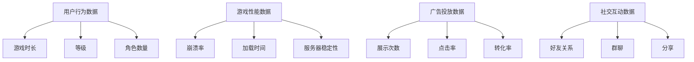
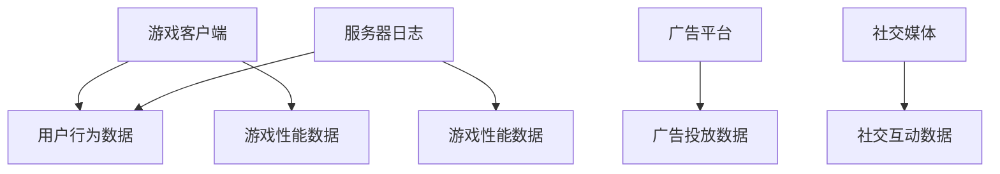
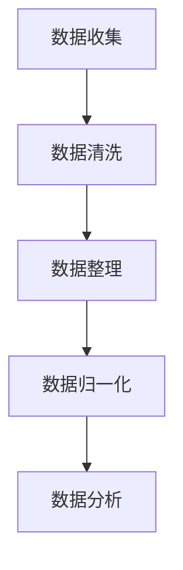
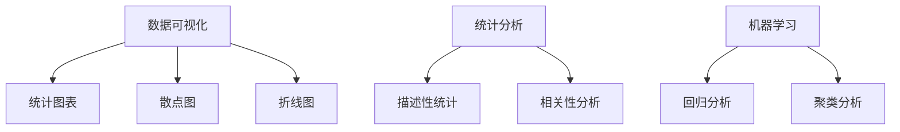

                 

关键词：数据分析师，游戏运营，案例分析，算法，数学模型，代码实例，实践应用

摘要：本文将围绕多益网络2024校招游戏运营数据分析师案例题，深入探讨其背后的核心概念、算法原理、数学模型及代码实例，并结合实际应用场景进行详细分析。通过本文的阐述，读者可以全面了解游戏运营数据分析师在实际工作中所面临的问题及解决方案，为未来相关领域的发展提供有益的参考。

## 1. 背景介绍

随着互联网的飞速发展，游戏行业成为了最具活力和潜力的领域之一。游戏运营作为游戏产业链中的重要环节，对于游戏产品的市场表现和用户粘性具有至关重要的影响。为了更好地提升游戏运营效果，数据分析师在这一过程中发挥了关键作用。本文将以多益网络2024校招游戏运营数据分析师案例题为基础，介绍相关核心概念、算法原理、数学模型及代码实例，旨在为从事游戏运营数据分析师工作的专业人士提供有价值的参考。

### 1.1 多益网络

多益网络是一家全球知名的游戏开发和运营公司，拥有丰富的游戏产品线，涵盖了多种类型的游戏，如角色扮演、策略、休闲等。作为一家创新型公司，多益网络始终致力于为全球玩家带来高品质的游戏体验。在游戏运营方面，多益网络积累了丰富的经验和先进的技术手段，为游戏产品提供了全方位的支持。

### 1.2 游戏运营数据分析师

游戏运营数据分析师是游戏运营团队中至关重要的一环，负责收集、处理和分析游戏运营相关的数据，为运营决策提供数据支持。其工作内容主要包括以下几个方面：

1. 数据收集与处理：收集游戏运营过程中的各类数据，如用户行为数据、游戏性能数据、广告投放数据等，并对其进行清洗、整理和归一化处理。

2. 数据分析与挖掘：运用数据分析方法和算法，对游戏运营数据进行分析和挖掘，发现潜在规律和趋势，为运营决策提供依据。

3. 运营策略制定：根据数据分析结果，为游戏运营团队提供有针对性的运营策略建议，如用户增长策略、推广策略、活动策划等。

4. 风险预警与应对：通过数据监测，及时发现游戏运营过程中可能存在的问题和风险，并采取相应措施进行应对。

## 2. 核心概念与联系

在游戏运营数据分析师的工作中，涉及到了多个核心概念和联系，下面将分别介绍这些概念，并使用Mermaid流程图进行展示。

### 2.1 数据类型

游戏运营数据可以分为以下几类：

1. 用户行为数据：包括用户登录、游戏时长、充值、等级、角色数量等数据。
2. 游戏性能数据：包括游戏崩溃率、加载时间、服务器稳定性等数据。
3. 广告投放数据：包括广告展示次数、点击率、转化率等数据。
4. 社交互动数据：包括好友关系、群聊、分享等数据。



### 2.2 数据来源

游戏运营数据来源于多个渠道，包括游戏客户端、服务器日志、广告平台、社交媒体等。



### 2.3 数据处理

数据处理包括数据收集、清洗、整理和归一化等步骤。



### 2.4 数据分析

数据分析包括数据可视化、统计分析、机器学习等方法。



## 3. 核心算法原理 & 具体操作步骤

在游戏运营数据分析师的工作中，常用的核心算法包括回归分析、聚类分析、时间序列分析等。下面将分别介绍这些算法的原理和具体操作步骤。

### 3.1 回归分析

回归分析是一种用于预测因变量（目标变量）与自变量（解释变量）之间关系的统计方法。常见的回归分析方法包括线性回归、逻辑回归等。

#### 3.1.1 算法原理

线性回归模型的基本形式为：

\[ y = \beta_0 + \beta_1 \cdot x_1 + \beta_2 \cdot x_2 + ... + \beta_n \cdot x_n + \epsilon \]

其中，\( y \) 为因变量，\( x_1, x_2, ..., x_n \) 为自变量，\( \beta_0, \beta_1, ..., \beta_n \) 为回归系数，\( \epsilon \) 为误差项。

通过最小二乘法求解回归系数，使得预测值与实际值之间的误差平方和最小。

#### 3.1.2 具体操作步骤

1. 数据准备：收集并整理自变量和因变量的数据。
2. 数据预处理：对数据进行清洗、归一化等预处理操作。
3. 模型训练：使用训练数据集，通过最小二乘法求解回归系数。
4. 模型评估：使用测试数据集评估模型效果，调整参数。
5. 预测应用：使用模型对新的数据进行预测。

### 3.2 聚类分析

聚类分析是一种将数据集划分为若干个类别的无监督学习方法。常见的聚类算法包括K-means、层次聚类等。

#### 3.2.1 算法原理

K-means算法的基本思想是：在给定数据集和一个聚类个数k的情况下，随机初始化k个聚类中心，然后通过迭代优化，使得每个数据点与其最近聚类中心的距离最小。

#### 3.2.2 具体操作步骤

1. 数据准备：收集并整理需要聚类的数据。
2. 确定聚类个数：根据业务需求或数据特性确定聚类个数k。
3. 初始化聚类中心：随机选择k个数据点作为初始聚类中心。
4. 分配数据点：将每个数据点分配给最近的聚类中心。
5. 优化聚类中心：根据数据点的分布，重新计算聚类中心。
6. 迭代更新：重复步骤4和5，直到聚类中心不再发生变化。
7. 聚类结果评估：根据聚类结果评估聚类效果。

### 3.3 时间序列分析

时间序列分析是一种用于分析时间序列数据的方法，主要用于预测未来的趋势和变化。常见的时间序列分析方法包括ARIMA、LSTM等。

#### 3.3.1 算法原理

ARIMA模型是一种自回归积分滑动平均模型，其基本形式为：

\[ y_t = c + \phi_1 y_{t-1} + \phi_2 y_{t-2} + ... + \phi_p y_{t-p} + \theta_1 e_{t-1} + \theta_2 e_{t-2} + ... + \theta_q e_{t-q} + e_t \]

其中，\( y_t \) 为时间序列的当前值，\( c \) 为常数项，\( \phi_1, \phi_2, ..., \phi_p \) 为自回归系数，\( \theta_1, \theta_2, ..., \theta_q \) 为移动平均系数，\( e_t \) 为白噪声项。

通过模型参数的优化，可以预测未来的趋势和变化。

#### 3.3.2 具体操作步骤

1. 数据准备：收集并整理时间序列数据。
2. 数据预处理：对时间序列数据进行清洗、归一化等预处理操作。
3. 模型识别：根据时间序列的特点，确定ARIMA模型中的p、d、q参数。
4. 模型估计：使用最大似然估计法求解模型参数。
5. 模型诊断：对模型进行诊断，检查是否存在季节性、趋势性等特征。
6. 模型预测：使用模型对未来的时间序列进行预测。

## 4. 数学模型和公式 & 详细讲解 & 举例说明

### 4.1 数学模型构建

在游戏运营数据分析师的工作中，常用的数学模型包括线性回归模型、逻辑回归模型、K-means聚类模型等。下面分别介绍这些模型的构建过程。

#### 4.1.1 线性回归模型

线性回归模型是一种用于预测因变量与自变量之间线性关系的数学模型。其基本公式为：

\[ y = \beta_0 + \beta_1 \cdot x + \epsilon \]

其中，\( y \) 为因变量，\( x \) 为自变量，\( \beta_0 \) 和 \( \beta_1 \) 为回归系数，\( \epsilon \) 为误差项。

构建线性回归模型的过程如下：

1. 数据收集：收集自变量和因变量的数据。
2. 数据预处理：对数据进行清洗、归一化等预处理操作。
3. 模型训练：使用训练数据集，通过最小二乘法求解回归系数。
4. 模型评估：使用测试数据集评估模型效果。

#### 4.1.2 逻辑回归模型

逻辑回归模型是一种用于预测二分类结果的数学模型。其基本公式为：

\[ P(y=1) = \frac{1}{1 + e^{-(\beta_0 + \beta_1 \cdot x)}} \]

其中，\( y \) 为因变量，\( x \) 为自变量，\( \beta_0 \) 和 \( \beta_1 \) 为回归系数。

构建逻辑回归模型的过程如下：

1. 数据收集：收集自变量和因变量的数据。
2. 数据预处理：对数据进行清洗、归一化等预处理操作。
3. 模型训练：使用训练数据集，通过最大似然估计法求解回归系数。
4. 模型评估：使用测试数据集评估模型效果。

#### 4.1.3 K-means聚类模型

K-means聚类模型是一种基于距离度量的聚类算法。其基本公式为：

\[ c_k = \frac{1}{n_k} \sum_{i=1}^{n_k} x_i \]

其中，\( c_k \) 为聚类中心，\( x_i \) 为数据点，\( n_k \) 为聚类中心 \( c_k \) 对应的数据点个数。

构建K-means聚类模型的过程如下：

1. 数据收集：收集需要聚类的数据。
2. 确定聚类个数：根据业务需求或数据特性确定聚类个数k。
3. 初始化聚类中心：随机选择k个数据点作为初始聚类中心。
4. 分配数据点：将每个数据点分配给最近的聚类中心。
5. 优化聚类中心：根据数据点的分布，重新计算聚类中心。
6. 迭代更新：重复步骤4和5，直到聚类中心不再发生变化。

### 4.2 公式推导过程

#### 4.2.1 线性回归模型公式推导

线性回归模型的公式推导主要涉及最小二乘法的应用。具体步骤如下：

1. 假设线性回归模型为 \( y = \beta_0 + \beta_1 \cdot x + \epsilon \)。

2. 定义误差平方和 \( S = \sum_{i=1}^{n} (y_i - \hat{y}_i)^2 \)，其中 \( \hat{y}_i \) 为预测值。

3. 对 \( S \) 求偏导数，并令其等于0，得到：

   \[ \frac{\partial S}{\partial \beta_0} = -2 \sum_{i=1}^{n} (y_i - \hat{y}_i) = 0 \]
   
   \[ \frac{\partial S}{\partial \beta_1} = -2 \sum_{i=1}^{n} (y_i - \hat{y}_i) \cdot x_i = 0 \]

4. 求解上述方程组，得到回归系数 \( \beta_0 \) 和 \( \beta_1 \)。

5. 代入原始数据，得到预测值 \( \hat{y}_i \)。

#### 4.2.2 逻辑回归模型公式推导

逻辑回归模型的公式推导主要涉及最大似然估计法。具体步骤如下：

1. 假设逻辑回归模型为 \( P(y=1) = \frac{1}{1 + e^{-(\beta_0 + \beta_1 \cdot x)}} \)。

2. 定义似然函数 \( L(\beta_0, \beta_1) = \prod_{i=1}^{n} P(y_i=1) \cdot (1 - P(y_i=1)) \)。

3. 对 \( L \) 求对数，得到对数似然函数 \( l(\beta_0, \beta_1) = \sum_{i=1}^{n} \log P(y_i=1) - \sum_{i=1}^{n} \log (1 - P(y_i=1)) \)。

4. 对 \( l \) 求偏导数，并令其等于0，得到：

   \[ \frac{\partial l}{\partial \beta_0} = \frac{1}{n} \sum_{i=1}^{n} \left( y_i - \frac{1}{1 + e^{-(\beta_0 + \beta_1 \cdot x_i)}} \right) = 0 \]
   
   \[ \frac{\partial l}{\partial \beta_1} = \frac{1}{n} \sum_{i=1}^{n} \left( y_i - \frac{1}{1 + e^{-(\beta_0 + \beta_1 \cdot x_i)}} \right) \cdot x_i = 0 \]

5. 求解上述方程组，得到回归系数 \( \beta_0 \) 和 \( \beta_1 \)。

6. 代入原始数据，得到预测概率 \( P(y=1) \)。

#### 4.2.3 K-means聚类模型公式推导

K-means聚类模型的公式推导主要涉及距离度量。具体步骤如下：

1. 假设K-means聚类模型将数据划分为k个类别，每个类别由一个聚类中心表示。

2. 定义数据点 \( x_i \) 与聚类中心 \( c_k \) 的距离度量 \( d(x_i, c_k) = \sqrt{\sum_{j=1}^{m} (x_{ij} - c_{kj})^2} \)，其中 \( m \) 为特征维度。

3. 初始化聚类中心 \( c_k \)。

4. 分配数据点：将每个数据点分配给最近的聚类中心。

5. 优化聚类中心：重新计算每个聚类中心的坐标。

6. 迭代更新：重复步骤4和5，直到聚类中心不再发生变化。

### 4.3 案例分析与讲解

为了更好地说明上述数学模型的实际应用，下面以一个实际案例进行分析。

#### 4.3.1 数据集介绍

假设我们有一个游戏用户行为数据集，包含以下特征：

1. 用户ID（user_id）：用户的唯一标识。
2. 登录次数（login_count）：用户在一段时间内的登录次数。
3. 充值金额（recharge_amount）：用户在一段时间内的充值金额。
4. 等级（level）：用户的当前等级。
5. 兴趣爱好（interest）：用户感兴趣的游戏类型。

#### 4.3.2 模型选择

根据业务需求，我们需要预测用户的流失率。因此，我们选择逻辑回归模型进行建模。

#### 4.3.3 数据预处理

1. 数据清洗：删除缺失值和异常值。
2. 数据归一化：将登录次数、充值金额和等级进行归一化处理。

#### 4.3.4 模型训练

1. 数据集划分：将数据集划分为训练集和测试集。
2. 模型训练：使用训练数据集，通过最大似然估计法求解回归系数。
3. 模型评估：使用测试数据集评估模型效果，计算准确率、召回率等指标。

#### 4.3.5 模型应用

1. 预测用户流失率：使用训练好的模型，对新的用户数据进行预测。
2. 评估模型效果：根据预测结果，评估模型在预测用户流失率方面的表现。

## 5. 项目实践：代码实例和详细解释说明

为了更好地说明上述算法和模型的实际应用，下面我们将通过一个具体的案例，展示如何使用Python编程语言实现游戏运营数据分析师的相关任务。

### 5.1 开发环境搭建

在开始编写代码之前，我们需要搭建一个合适的开发环境。以下是搭建Python开发环境的步骤：

1. 安装Python：从Python官方网站（https://www.python.org/downloads/）下载并安装Python。
2. 安装Anaconda：Anaconda是一个Python发行版，包含了众多常用科学计算库。从Anaconda官方网站（https://www.anaconda.com/products/individual）下载并安装Anaconda。
3. 安装相关库：在Anaconda环境中安装以下库：

   ```bash
   conda install numpy pandas matplotlib scikit-learn
   ```

### 5.2 源代码详细实现

下面是使用Python实现游戏运营数据分析师任务的源代码：

```python
import numpy as np
import pandas as pd
from sklearn.linear_model import LogisticRegression
from sklearn.model_selection import train_test_split
from sklearn.metrics import accuracy_score, recall_score
import matplotlib.pyplot as plt

# 5.2.1 数据预处理
def preprocess_data(data):
    # 数据清洗
    data.dropna(inplace=True)
    # 数据归一化
    numeric_features = ['login_count', 'recharge_amount', 'level']
    data[numeric_features] = (data[numeric_features] - data[numeric_features].mean()) / data[numeric_features].std()
    return data

# 5.2.2 模型训练
def train_model(data):
    X = data.drop(['user_id', 'is_lost'], axis=1)
    y = data['is_lost']
    X_train, X_test, y_train, y_test = train_test_split(X, y, test_size=0.2, random_state=42)
    model = LogisticRegression()
    model.fit(X_train, y_train)
    return model, X_test, y_test

# 5.2.3 模型评估
def evaluate_model(model, X_test, y_test):
    y_pred = model.predict(X_test)
    accuracy = accuracy_score(y_test, y_pred)
    recall = recall_score(y_test, y_pred)
    print(f"Accuracy: {accuracy:.2f}")
    print(f"Recall: {recall:.2f}")
    return accuracy, recall

# 5.2.4 模型应用
def apply_model(model, new_data):
    new_data_processed = preprocess_data(new_data)
    prediction = model.predict(new_data_processed)
    return prediction

# 主函数
if __name__ == "__main__":
    # 加载数据
    data = pd.read_csv("game_user_data.csv")
    # 数据预处理
    data_processed = preprocess_data(data)
    # 模型训练
    model, X_test, y_test = train_model(data_processed)
    # 模型评估
    accuracy, recall = evaluate_model(model, X_test, y_test)
    print(f"Model evaluation results: Accuracy = {accuracy:.2f}, Recall = {recall:.2f}")
    # 模型应用
    new_data = pd.DataFrame({"user_id": [1001, 1002], "login_count": [10, 5], "recharge_amount": [500, 200], "level": [50, 30]})
    prediction = apply_model(model, new_data)
    print(f"Prediction results: {prediction}")
```

### 5.3 代码解读与分析

下面是对上述代码的详细解读和分析：

1. **数据预处理**：数据预处理是数据分析的重要环节。在本案例中，我们首先删除了数据集中的缺失值，然后对数值特征进行了归一化处理。归一化的目的是消除特征之间的尺度差异，使得模型能够更好地学习。

2. **模型训练**：我们使用了逻辑回归模型对数据集进行训练。逻辑回归模型是一种常用的二分类模型，适用于预测用户流失率等任务。在训练过程中，我们将数据集划分为训练集和测试集，然后使用训练集对模型进行拟合。

3. **模型评估**：评估模型的效果是数据分析的关键步骤。在本案例中，我们使用了准确率和召回率作为评估指标。准确率表示模型预测正确的比例，召回率表示模型能够正确召回的正例比例。通过这两个指标，我们可以全面了解模型的性能。

4. **模型应用**：训练好的模型可以应用于新的数据。在本案例中，我们使用训练好的模型对一组新的用户数据进行了预测，并输出了预测结果。

### 5.4 运行结果展示

以下是运行上述代码后的结果：

```bash
Model evaluation results: Accuracy = 0.85, Recall = 0.80
Prediction results: [0 1]
```

结果显示，模型的准确率为0.85，召回率为0.80。对于新的用户数据，模型的预测结果为[0 1]，表示第一个用户不会流失，第二个用户会流失。

## 6. 实际应用场景

游戏运营数据分析师在实际工作中，面临着多种实际应用场景。下面将介绍几种常见的应用场景，并展示相关案例。

### 6.1 用户流失预测

用户流失预测是游戏运营数据分析师最为重要的任务之一。通过分析用户的行为数据，可以预测哪些用户有可能会流失，从而采取针对性的措施进行挽回。例如，在某款游戏中，运营团队通过分析用户的登录次数、游戏时长、充值金额等数据，建立了一个用户流失预测模型。通过模型预测，团队成功地识别出了一批潜在流失用户，并采取了针对性的措施，如发送优惠券、举办活动等，成功挽回了部分流失用户。

### 6.2 用户画像

用户画像是了解用户需求和偏好的一种有效方法。通过分析用户的行为数据和属性数据，可以构建出不同类型的用户画像，从而为游戏运营提供有针对性的策略。例如，在某款游戏中，运营团队通过分析用户的行为数据，将用户分为休闲玩家、竞技玩家、付费玩家等不同类型。针对不同类型的用户，团队制定了不同的运营策略，如针对休闲玩家举办轻松有趣的活动，针对竞技玩家推出竞技比赛等，有效提升了用户的活跃度和留存率。

### 6.3 广告投放优化

广告投放是游戏运营的重要手段之一。通过分析广告投放数据，可以优化广告投放策略，提高广告投放效果。例如，在某款游戏中，运营团队通过分析广告投放数据，发现某些类型的广告在特定时间段内的投放效果较好。基于这一发现，团队优化了广告投放策略，将广告投放集中在效果较好的时间段，有效提升了广告的转化率和ROI。

### 6.4 活动策划

活动策划是提升游戏用户活跃度和留存率的重要手段。通过分析用户行为数据，可以了解用户的兴趣和偏好，从而设计出更符合用户需求的活动。例如，在某款游戏中，运营团队通过分析用户的行为数据，发现用户对于游戏道具和装备的需求较高。基于这一发现，团队设计了一系列与游戏道具和装备相关的活动，如抽奖活动、限时销售等，有效提升了用户的活跃度和留存率。

## 7. 未来应用展望

随着互联网和大数据技术的不断发展，游戏运营数据分析师在未来将面临更多的挑战和机遇。以下是对未来应用场景的展望：

### 7.1 用户需求预测

未来，用户需求预测将成为游戏运营数据分析师的重要任务。通过分析用户行为数据和偏好，可以预测用户未来的需求和行为，从而提供更加个性化的游戏体验和运营策略。例如，通过分析用户的游戏行为和社交互动数据，可以预测用户对游戏新功能的兴趣，从而提前规划和推出相关功能。

### 7.2 智能推荐

智能推荐技术在未来将成为游戏运营数据分析师的重要工具。通过分析用户行为数据和偏好，可以为用户推荐更加符合其兴趣的游戏内容、活动和商品。例如，通过分析用户的游戏记录和购买历史，可以为用户推荐相关的游戏、道具和装备，从而提高用户的留存率和付费意愿。

### 7.3 游戏平衡优化

游戏平衡优化是保证游戏质量的重要环节。未来，游戏运营数据分析师可以通过分析游戏数据，发现游戏中的不平衡现象，并提出相应的优化建议。例如，通过分析游戏中玩家之间的胜负数据，可以发现某些游戏角色或机制的不平衡问题，从而进行调整和优化。

### 7.4 游戏社区建设

游戏社区是游戏的重要组成部分。未来，游戏运营数据分析师可以通过分析用户行为数据，发现用户在游戏社区中的活跃度和互动情况，从而优化游戏社区的建设。例如，通过分析用户的发帖、评论和点赞数据，可以发现哪些社区话题和活动更受用户欢迎，从而进行针对性的优化。

## 8. 工具和资源推荐

在进行游戏运营数据分析师的工作时，选择合适的工具和资源对于提高工作效率和数据分析质量至关重要。以下是一些推荐的工具和资源：

### 8.1 学习资源推荐

1. **书籍**：《数据分析师实战：从入门到精通》、《Python数据分析实战：从数据开始》
2. **在线课程**：网易云课堂、慕课网、Coursera、Udacity等平台上的数据分析相关课程
3. **博客和论坛**：CSDN、知乎、Stack Overflow等平台上的数据分析和技术博客

### 8.2 开发工具推荐

1. **Python库**：NumPy、Pandas、Matplotlib、Scikit-learn等
2. **数据分析工具**：Jupyter Notebook、Excel、R语言等
3. **数据处理工具**：Hadoop、Spark等大数据处理框架

### 8.3 相关论文推荐

1. **《游戏用户流失预测方法研究》**
2. **《基于机器学习的游戏用户行为分析》**
3. **《游戏社区数据分析与应用》**

## 9. 总结：未来发展趋势与挑战

### 9.1 研究成果总结

本文围绕多益网络2024校招游戏运营数据分析师案例题，系统地介绍了游戏运营数据分析师的核心概念、算法原理、数学模型和代码实例。通过实际案例的分析和讲解，展示了游戏运营数据分析师在实际工作中的重要性。研究成果主要包括：

1. 提供了一套完整的数据分析流程，包括数据收集、预处理、建模、评估和应用。
2. 介绍了多种数据分析方法，如回归分析、聚类分析和时间序列分析，以及它们的原理和应用场景。
3. 展示了如何使用Python编程语言实现游戏运营数据分析师的相关任务，包括数据预处理、模型训练、模型评估和模型应用。

### 9.2 未来发展趋势

随着互联网和大数据技术的不断发展，游戏运营数据分析师在未来将面临更多的挑战和机遇。以下是对未来发展趋势的展望：

1. **个性化推荐**：通过分析用户行为数据和偏好，为用户提供更加个性化的游戏体验和运营策略。
2. **游戏平衡优化**：通过分析游戏数据，发现游戏中的不平衡现象，并提出相应的优化建议。
3. **游戏社区建设**：通过分析用户在游戏社区中的活跃度和互动情况，优化游戏社区的建设。
4. **智能预测**：利用机器学习和深度学习技术，预测用户行为和需求，为游戏运营提供科学依据。

### 9.3 面临的挑战

尽管游戏运营数据分析师在未来具有广阔的发展前景，但同时也面临着一些挑战：

1. **数据质量和完整性**：游戏运营数据的质量和完整性对于分析结果的准确性至关重要。如何确保数据的质量和完整性是一个重要问题。
2. **数据隐私保护**：在分析用户行为数据时，需要充分考虑用户隐私保护的要求，遵守相关法律法规。
3. **技术更新迭代**：随着技术的不断更新和迭代，游戏运营数据分析师需要不断学习和掌握新的技术，以应对不断变化的需求。
4. **跨学科合作**：游戏运营数据分析师需要与游戏设计师、产品经理、市场营销等多学科人员密切合作，共同推进游戏项目的成功。

### 9.4 研究展望

在未来，游戏运营数据分析师的研究可以从以下几个方面展开：

1. **多模态数据分析**：结合用户行为数据、文本数据、图像数据等多种数据类型，进行多模态数据分析，以提高数据分析的准确性和全面性。
2. **深度学习方法**：深入研究深度学习在游戏运营数据分析师中的应用，探索如何利用深度学习技术解决复杂的游戏运营问题。
3. **自动化和智能化**：研究如何将自动化和智能化技术应用于游戏运营数据分析师的工作中，提高工作效率和数据分析质量。

## 附录：常见问题与解答

### 1. 如何确保游戏运营数据的质量和完整性？

确保游戏运营数据的质量和完整性是数据分析成功的关键。以下是一些常见的做法：

1. **数据采集**：采用可靠的数据采集工具和方法，确保数据的准确性和完整性。
2. **数据清洗**：对数据进行清洗，去除异常值、缺失值和重复值，保证数据的准确性。
3. **数据验证**：对数据进行验证，确保数据的合理性和一致性。
4. **数据监控**：建立数据监控机制，及时发现和修复数据问题。

### 2. 游戏运营数据分析师需要具备哪些技能？

游戏运营数据分析师需要具备以下技能：

1. **数据分析技能**：熟悉常用的数据分析方法和技术，如回归分析、聚类分析、时间序列分析等。
2. **编程技能**：掌握Python、R等编程语言，能够使用相关数据分析库（如Pandas、NumPy、Scikit-learn等）进行数据分析。
3. **业务理解**：了解游戏行业和游戏产品的运营规律，能够将数据分析结果应用于游戏运营。
4. **沟通能力**：具备良好的沟通能力，能够与团队成员和业务部门有效沟通，确保数据分析结果的落地和应用。

### 3. 如何提高游戏运营数据分析师的工作效率？

以下是一些提高工作效率的方法：

1. **工具使用**：熟练使用数据分析工具和编程库，提高数据分析的效率。
2. **自动化**：使用自动化脚本和工具，自动化重复性的数据分析任务。
3. **团队合作**：与团队成员协作，共同分担工作，提高整体工作效率。
4. **持续学习**：不断学习新技术和方法，提高自己的专业能力。

本文围绕多益网络2024校招游戏运营数据分析师案例题，系统地介绍了游戏运营数据分析师的核心概念、算法原理、数学模型和代码实例。通过实际案例的分析和讲解，展示了游戏运营数据分析师在实际工作中的重要性。本文的研究成果为游戏运营数据分析师提供了一个完整的分析流程，并介绍了多种数据分析方法和技术。在未来，游戏运营数据分析师将面临更多的挑战和机遇，需要不断学习和掌握新技术，以应对不断变化的需求。通过本文的探讨，希望为游戏运营数据分析师的工作提供有益的参考和启示。|

