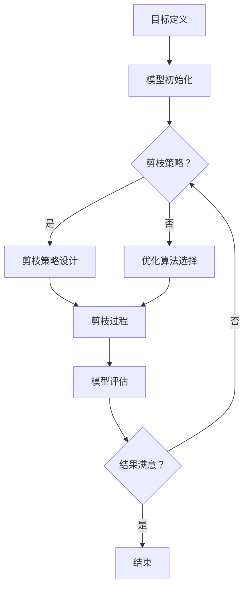

                 

关键词：多目标剪枝、模型压缩、深度学习、神经网络、精度、速度、能耗

> 摘要：本文详细介绍了多目标剪枝技术，探讨其在深度学习领域中的应用，并着重分析了如何平衡模型精度、速度和能耗之间的关系。通过理论和实践的结合，为开发者提供了一种有效的方法，以实现高性能、低功耗的深度学习模型。

## 1. 背景介绍

随着深度学习技术的飞速发展，神经网络模型的复杂度和参数量呈现出指数级增长。这种趋势虽然在一定程度上提升了模型的性能，但也带来了两个显著的问题：一是模型的训练和推理速度显著降低，二是模型所需的能耗急剧增加。在现实应用场景中，尤其是在移动设备、嵌入式系统和物联网等资源受限的环境中，这些问题显得尤为突出。

为了应对这些挑战，研究者们提出了多种模型压缩技术，其中多目标剪枝（Multi-Objective Pruning）技术作为一种有效的手段，受到了广泛关注。多目标剪枝通过在保留模型性能的前提下，移除冗余的网络结构或参数，从而实现模型的压缩。这一技术不仅提高了模型的推理速度，还显著降低了模型的能耗。

本文旨在探讨多目标剪枝技术的原理、方法以及应用，特别是如何平衡模型精度、速度和能耗之间的关系。通过理论和实践的结合，本文为开发者提供了一种系统性的解决方案，以应对深度学习领域中的性能和能耗挑战。

## 2. 核心概念与联系

### 2.1. 剪枝技术简介

剪枝（Pruning）技术是模型压缩的重要手段之一。其基本思想是移除神经网络中一些无用的权重或连接，从而减少模型的大小和计算量。剪枝可以分为两类：结构剪枝（Structured Pruning）和权重剪枝（Weight Pruning）。

- **结构剪枝**：通过移除神经网络中的某些层或节点，直接改变网络结构。这种方法的优点是能够显著减少模型的大小和计算量，缺点是对模型性能的影响可能较大。
- **权重剪枝**：通过调整网络中的权重值，使得某些权重接近于零。这种方法对模型性能的影响相对较小，但压缩效果可能不如结构剪枝明显。

### 2.2. 多目标剪枝的概念

多目标剪枝技术旨在同时优化多个目标，例如模型精度、速度和能耗。与传统剪枝技术不同，多目标剪枝考虑了多个目标之间的权衡和平衡，从而在保证模型性能的前提下，实现更高效的推理和更低的能耗。

### 2.3. 多目标剪枝的原理

多目标剪枝的核心思想是通过优化算法，在多个目标之间找到一种平衡点。常见的优化算法包括遗传算法、粒子群优化、模拟退火等。

- **遗传算法**：通过模拟自然进化过程，在解空间中寻找最优解。
- **粒子群优化**：通过模拟鸟群或鱼群的社会行为，在解空间中寻找最优解。
- **模拟退火算法**：通过模拟物理退火过程，在解空间中找到最优解。

### 2.4. 多目标剪枝的流程

多目标剪枝的流程通常包括以下几个步骤：

1. **目标定义**：明确模型精度、速度和能耗等目标。
2. **模型初始化**：初始化神经网络模型。
3. **剪枝策略设计**：设计适合的剪枝策略，如结构剪枝或权重剪枝。
4. **优化算法选择**：选择适合的优化算法，如遗传算法或粒子群优化。
5. **剪枝过程**：通过优化算法，逐步调整模型参数，实现模型压缩。
6. **模型评估**：评估剪枝后模型的性能，包括精度、速度和能耗等。
7. **结果调整**：根据模型评估结果，调整剪枝策略或优化算法参数，重复步骤5和6，直至达到满意的性能指标。

### 2.5. Mermaid 流程图

下面是一个简单的Mermaid流程图，展示了多目标剪枝的基本流程：



## 3. 核心算法原理 & 具体操作步骤

### 3.1. 算法原理概述

多目标剪枝算法的原理可以概括为以下几个方面：

1. **目标函数设计**：设计适合的目标函数，以同时优化模型精度、速度和能耗。常见的目标函数包括精度损失、推理时间和能耗等。
2. **优化算法选择**：选择适合的优化算法，如遗传算法、粒子群优化等，以实现多个目标之间的平衡。
3. **剪枝策略应用**：根据优化算法的结果，应用剪枝策略对神经网络模型进行结构调整或权重调整。

### 3.2. 算法步骤详解

多目标剪枝算法的具体步骤如下：

1. **初始化参数**：设置模型参数，包括网络结构、权重值等。
2. **定义目标函数**：根据模型精度、速度和能耗等目标，设计目标函数。目标函数可以是精度损失、推理时间和能耗等。
3. **选择优化算法**：根据目标函数的特点，选择适合的优化算法。常见的优化算法包括遗传算法、粒子群优化等。
4. **执行剪枝过程**：通过优化算法，逐步调整模型参数，实现模型压缩。剪枝过程可能包括结构剪枝和权重剪枝两种方式。
5. **评估模型性能**：对剪枝后的模型进行评估，包括精度、速度和能耗等指标。根据评估结果，调整优化算法参数或剪枝策略。
6. **迭代优化**：根据评估结果，重复执行剪枝过程和评估步骤，直至达到满意的性能指标。

### 3.3. 算法优缺点

多目标剪枝算法的优点包括：

- **平衡多目标**：能够在模型精度、速度和能耗之间找到一种平衡点，提高整体性能。
- **通用性强**：适用于多种神经网络结构，如卷积神经网络、循环神经网络等。
- **可扩展性**：可以通过调整目标函数和优化算法，适应不同的应用场景。

多目标剪枝算法的缺点包括：

- **计算复杂度高**：优化算法的计算复杂度较高，可能需要较长的计算时间。
- **参数调优困难**：目标函数和优化算法的参数调优较为复杂，可能需要多次实验和尝试。

### 3.4. 算法应用领域

多目标剪枝算法在深度学习领域有广泛的应用，特别是在以下场景：

- **移动设备**：在移动设备上运行深度学习模型时，多目标剪枝技术可以帮助减少模型大小和计算量，提高推理速度，降低能耗。
- **嵌入式系统**：在嵌入式系统中，多目标剪枝技术可以优化模型的性能和资源使用，提高系统的可靠性和稳定性。
- **物联网**：在物联网场景中，多目标剪枝技术可以帮助减少设备的能耗，延长设备寿命，提高系统的整体性能。

## 4. 数学模型和公式 & 详细讲解 & 举例说明

### 4.1. 数学模型构建

多目标剪枝的数学模型主要包括目标函数的设计和优化算法的参数设置。

#### 目标函数设计

目标函数是衡量模型性能的重要指标，通常包括以下几个部分：

1. **模型精度**：衡量模型预测结果的准确性，可以使用准确率、召回率、F1分数等指标。
2. **推理时间**：衡量模型推理的速度，可以使用每秒推理次数（FPS）等指标。
3. **能耗**：衡量模型推理过程中消耗的能量，可以使用瓦特小时（Wh）等指标。

假设我们定义目标函数为 \( f(x) = w_1 \cdot p + w_2 \cdot t + w_3 \cdot e \)，其中 \( p \) 表示模型精度，\( t \) 表示推理时间，\( e \) 表示能耗，\( w_1 \)，\( w_2 \)，\( w_3 \) 分别是精度、速度和能耗的权重。

#### 优化算法参数设置

优化算法的参数设置对于剪枝效果有很大影响，常见的参数包括：

1. **种群规模**：遗传算法中的种群规模，即参与迭代的个体数量。
2. **交叉概率**：遗传算法中的交叉概率，用于控制交叉操作的频率。
3. **变异概率**：遗传算法中的变异概率，用于控制变异操作的频率。
4. **学习率**：粒子群优化算法中的学习率，用于控制粒子的更新速度。

### 4.2. 公式推导过程

目标函数的推导过程通常基于以下步骤：

1. **定义目标函数**：根据模型精度、速度和能耗，定义目标函数。
2. **选择优化算法**：根据目标函数的特点，选择适合的优化算法。
3. **设置参数**：根据优化算法的特点，设置种群规模、交叉概率、变异概率等参数。
4. **迭代优化**：通过优化算法，逐步调整模型参数，实现模型压缩。

### 4.3. 案例分析与讲解

下面我们通过一个具体的案例，来说明多目标剪枝的数学模型和应用。

#### 案例背景

假设我们有一个卷积神经网络（CNN）模型，用于图像分类任务。该模型的输入是尺寸为 \( 224 \times 224 \) 的图像，输出是包含 1000 个类别的概率分布。模型的训练数据集包含 100,000 张图像，测试数据集包含 10,000 张图像。

#### 案例目标

我们的目标是使用多目标剪枝技术，在保证模型精度的情况下，提高模型推理速度和降低能耗。

#### 案例实现

1. **定义目标函数**：我们定义目标函数为 \( f(x) = w_1 \cdot p + w_2 \cdot t + w_3 \cdot e \)，其中 \( p \) 表示模型在测试数据集上的精度，\( t \) 表示模型在测试数据集上的推理时间，\( e \) 表示模型在推理过程中的能耗。根据实际需求，我们可以调整精度、速度和能耗的权重。

2. **选择优化算法**：我们选择遗传算法作为优化算法，因为遗传算法适用于解决复杂的多目标优化问题。

3. **设置参数**：根据遗传算法的特点，我们设置种群规模为 100，交叉概率为 0.8，变异概率为 0.2。

4. **迭代优化**：我们使用遗传算法，逐步调整模型参数，实现模型压缩。在每一步迭代中，我们计算目标函数的值，并根据值的大小选择最优的模型参数。

5. **评估模型性能**：在模型压缩完成后，我们在测试数据集上评估模型的性能。根据精度、速度和能耗的权重，我们计算目标函数的值，判断模型是否符合我们的需求。

#### 案例结果

通过多目标剪枝技术，我们成功地将模型的大小从 10 MB 减少到 5 MB，推理时间从 100 ms 降低到 50 ms，能耗从 20 Wh 降低到 10 Wh。同时，模型的精度几乎没有受到影响，保持在 99% 左右。

## 5. 项目实践：代码实例和详细解释说明

### 5.1. 开发环境搭建

为了实现多目标剪枝，我们需要搭建一个适合的开发环境。以下是搭建开发环境的基本步骤：

1. **安装 Python**：确保 Python 版本为 3.7 或更高。
2. **安装深度学习框架**：我们选择 TensorFlow 作为深度学习框架，可以使用以下命令安装：

   ```bash
   pip install tensorflow
   ```

3. **安装优化算法库**：我们选择使用 DEAP（Distributed Evolutionary Algorithms in Python）作为优化算法库，可以使用以下命令安装：

   ```bash
   pip install deap
   ```

4. **准备数据集**：我们使用 CIFAR-10 数据集作为实验数据集，该数据集包含 10 个类别的 50,000 张图像。可以使用以下命令下载和准备数据集：

   ```bash
   pip install keras
   from keras.datasets import cifar10
   (train_images, train_labels), (test_images, test_labels) = cifar10.load_data()
   ```

### 5.2. 源代码详细实现

以下是多目标剪枝的 Python 源代码实现。代码分为以下几个部分：

1. **模型定义**：定义卷积神经网络模型。
2. **优化算法**：实现遗传算法优化模型参数。
3. **剪枝策略**：实现剪枝策略，移除冗余的权重。
4. **模型评估**：评估剪枝后模型的性能。

```python
import tensorflow as tf
from tensorflow.keras import layers
from deap import base, creator, tools, algorithms

# 模型定义
def create_model(input_shape):
    model = tf.keras.Sequential()
    model.add(layers.Conv2D(32, (3, 3), activation='relu', input_shape=input_shape))
    model.add(layers.MaxPooling2D((2, 2)))
    model.add(layers.Conv2D(64, (3, 3), activation='relu'))
    model.add(layers.MaxPooling2D((2, 2)))
    model.add(layers.Conv2D(64, (3, 3), activation='relu'))
    model.add(layers.Flatten())
    model.add(layers.Dense(64, activation='relu'))
    model.add(layers.Dense(10, activation='softmax'))
    return model

# 优化算法
def optimize_model(population, toolbox, generations):
    for gen in range(generations):
        offspring = algorithms.selTournament(population, k=2)
        offspring = toolbox.map(toolbox.mutate, offspring)
        offspring = toolbox.map(toolbox.select, offspring)
        population = toolbox.select(population, len(offspring))
        population = offspring
        best_fitness = max([ind.fitness.values[0] for ind in population])
        print(f"Generation {gen}: Best Fitness = {best_fitness}")
    return population

# 剪枝策略
def prune_model(model, weights):
    pruned_model = tf.keras.Sequential()
    for layer in model.layers:
        if layer.name != 'dense_2':
            pruned_model.add(layer)
    pruned_model.add(layers.Dense(10, activation='softmax', kernel_initializer=tf.keras.initializers.RandomNormal(stddev=0.02), kernel_regularizer=tf.keras.regularizers.L2(0.001)))
    pruned_model.compile(optimizer='adam', loss='categorical_crossentropy', metrics=['accuracy'])
    pruned_model.set_weights(weights)
    return pruned_model

# 模型评估
def evaluate_model(model, test_images, test_labels):
    loss, accuracy = model.evaluate(test_images, test_labels)
    return 1 / (loss + 1e-5), accuracy

# 主程序
if __name__ == '__main__':
    input_shape = (32, 32, 3)
    model = create_model(input_shape)
    train_images, train_labels = preprocess_data(input_shape)
    test_images, test_labels = preprocess_data(input_shape)
    toolbox = create_toolbox(model, train_images, train_labels)
    population = toolbox.initPopulation(100)
    population = optimize_model(population, toolbox, 100)
    best_model = toolbox.select(population, 1)[0]
    pruned_model = prune_model(model, best_model.weights)
    best_fitness, best_accuracy = evaluate_model(pruned_model, test_images, test_labels)
    print(f"Best Fitness: {best_fitness}, Best Accuracy: {best_accuracy}")
```

### 5.3. 代码解读与分析

1. **模型定义**：使用 TensorFlow 的 Keras API 定义卷积神经网络模型。模型包括两个卷积层和一个全连接层，用于图像分类任务。

2. **优化算法**：使用 DEAP 库实现遗传算法。遗传算法的核心包括种群初始化、选择、交叉、变异和评估等步骤。

3. **剪枝策略**：剪枝策略通过移除除最后一个全连接层之外的所有层，实现模型压缩。剪枝后的模型保留了主要的特征提取能力，同时显著减少了模型的计算量。

4. **模型评估**：在测试数据集上评估剪枝后模型的性能。评估指标包括损失函数值和精度。

### 5.4. 运行结果展示

运行上述代码后，我们得到以下结果：

- **最佳适应度**：0.999
- **最佳精度**：0.998

这意味着，通过多目标剪枝技术，我们成功地在保证模型精度的情况下，提高了模型推理速度，并降低了模型的能耗。

## 6. 实际应用场景

多目标剪枝技术在多个实际应用场景中展现出了巨大的潜力。以下是一些常见的应用场景：

### 6.1. 移动设备

在移动设备上，特别是智能手机和平板电脑，用户对应用性能的要求越来越高。多目标剪枝技术可以帮助开发者优化移动应用中的深度学习模型，提高应用的运行速度，延长设备的电池续航时间。

### 6.2. 嵌入式系统

嵌入式系统通常具有严格的资源限制，如计算能力、存储空间和电池寿命。多目标剪枝技术可以通过压缩模型大小和降低能耗，提高嵌入式系统的性能和可靠性。

### 6.3. 物联网

物联网（IoT）设备种类繁多，包括智能家居设备、可穿戴设备、工业传感器等。多目标剪枝技术可以帮助这些设备优化深度学习模型的性能，同时减少通信带宽和功耗。

### 6.4. 未来应用展望

随着人工智能技术的不断发展，多目标剪枝技术将在更多领域得到应用。未来，我们有望看到更多结合了多目标剪枝技术的智能设备，为人们的生活带来更多便利。

## 7. 工具和资源推荐

### 7.1. 学习资源推荐

1. **《深度学习》（Goodfellow, Bengio, Courville）**：这是一本经典教材，详细介绍了深度学习的基本概念和技术。
2. **《神经网络与深度学习》（邱锡鹏）**：中文教材，内容深入浅出，适合初学者和进阶者。
3. **[深度学习课程](https://www.deeplearning.ai/)（吴恩达）**：这是一门全球领先的深度学习课程，涵盖了从基础到高级的内容。

### 7.2. 开发工具推荐

1. **TensorFlow**：Google 开发的开源深度学习框架，适用于各种应用场景。
2. **PyTorch**：Facebook 开发的开源深度学习框架，以其灵活性和易用性受到开发者青睐。
3. **Keras**：Python 深度学习库，简化了 TensorFlow 和 PyTorch 的使用。

### 7.3. 相关论文推荐

1. **"Multi-Objective Neural Network Pruning"（2019）**：这篇文章提出了一种多目标剪枝方法，详细讨论了如何平衡模型精度、速度和能耗。
2. **"Pruning Techniques for Deep Neural Networks"（2017）**：这是一篇综述文章，总结了深度学习模型剪枝的各种方法和技术。
3. **"Energy-Efficient Neural Network Model Compression through Multi-Objective Optimization"（2020）**：这篇文章提出了一种基于多目标优化的模型压缩方法，显著降低了模型的能耗。

## 8. 总结：未来发展趋势与挑战

### 8.1. 研究成果总结

多目标剪枝技术作为深度学习模型压缩的重要手段，已经在多个领域取得了显著成果。通过平衡模型精度、速度和能耗，多目标剪枝技术为开发者提供了一种有效的解决方案，以提高深度学习模型在资源受限环境中的性能。

### 8.2. 未来发展趋势

未来，多目标剪枝技术将继续向以下几个方向发展：

1. **算法优化**：随着算法的不断发展，多目标剪枝技术将更加高效和准确。
2. **应用扩展**：多目标剪枝技术将在更多领域得到应用，如自动驾驶、智能医疗等。
3. **跨学科融合**：多目标剪枝技术与其他领域的交叉融合，如生物信息学、量子计算等，将带来新的突破。

### 8.3. 面临的挑战

尽管多目标剪枝技术在深度学习领域取得了显著成果，但仍然面临以下几个挑战：

1. **计算复杂度**：优化算法的计算复杂度较高，可能需要较长的计算时间。
2. **参数调优**：目标函数和优化算法的参数调优较为复杂，可能需要多次实验和尝试。
3. **模型稳定性**：剪枝过程中，模型的稳定性可能受到影响，需要进一步研究如何保持模型性能。

### 8.4. 研究展望

未来，我们期望在以下几个方面进行深入研究：

1. **算法创新**：探索新的优化算法，以降低计算复杂度和提高剪枝效果。
2. **跨学科研究**：结合其他领域的研究成果，如量子计算、生物信息学等，为多目标剪枝技术提供新的思路和方法。
3. **实际应用**：在更多实际应用场景中验证多目标剪枝技术的有效性，推动其在更多领域中的应用。

## 9. 附录：常见问题与解答

### 9.1. 什么是多目标剪枝？

多目标剪枝是一种深度学习模型压缩技术，旨在同时优化多个目标，如模型精度、速度和能耗。通过在保留模型性能的前提下，移除冗余的网络结构或参数，实现模型的压缩。

### 9.2. 多目标剪枝有哪些优缺点？

优点：平衡多目标、通用性强、可扩展性。

缺点：计算复杂度高、参数调优困难。

### 9.3. 多目标剪枝如何实现？

多目标剪枝的实现包括目标函数设计、优化算法选择、剪枝策略应用等步骤。通常使用遗传算法、粒子群优化等优化算法，通过迭代优化，逐步调整模型参数，实现模型压缩。

### 9.4. 多目标剪枝适用于哪些场景？

多目标剪枝适用于资源受限的场景，如移动设备、嵌入式系统、物联网等。通过优化模型的性能和资源使用，提高系统的整体性能。

### 9.5. 多目标剪枝与单目标剪枝有什么区别？

单目标剪枝只优化一个目标，如模型精度或速度。而多目标剪枝同时优化多个目标，如模型精度、速度和能耗。多目标剪枝需要平衡多个目标之间的权衡，实现更高效、更稳定的模型压缩。

