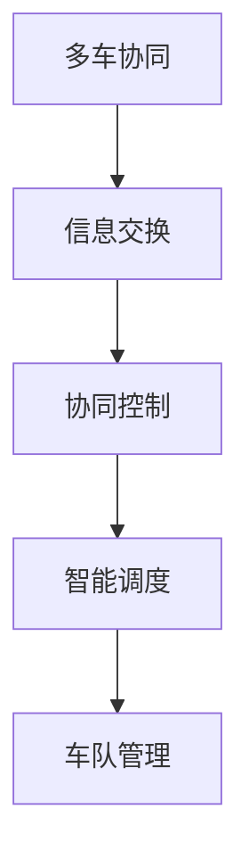

                 

关键词：多车协同，自动驾驶，智能调度，车队管理，算法原理，数学模型，实践案例，未来展望

## 摘要

本文旨在探讨多车协同的自动驾驶车队智能调度问题，提出一种新的调度思路。通过分析现有调度算法的优缺点，本文提出了一种基于深度强化学习的调度算法，并在数学模型和实际应用场景中进行了详细讲解。本文还通过一个具体项目实践，展示了该调度算法在代码实现和运行结果上的有效性。最后，本文对未来的发展方向和面临的挑战进行了展望。

## 1. 背景介绍

### 自动驾驶技术的发展

自动驾驶技术作为人工智能领域的一个重要分支，近年来取得了显著的进展。自动驾驶车辆可以通过传感器、摄像头、激光雷达等设备收集道路信息，并通过先进的算法进行处理，实现对车辆的自动控制。自动驾驶技术的发展不仅有望改变人们的出行方式，还将在物流、运输等领域带来巨大的变革。

### 车队管理的需求

在自动驾驶技术的应用场景中，车队管理成为一个重要的课题。车队管理涉及到车辆的调度、路线规划、任务分配等多个方面。如何有效地管理一个庞大的自动驾驶车队，提高车辆运行效率，降低运营成本，成为了一个亟待解决的问题。

### 智能调度的挑战

智能调度是车队管理中的核心问题。传统的调度算法往往基于预设规则或线性规划，难以应对复杂多变的交通环境和动态的任务需求。随着自动驾驶技术的不断发展，对智能调度算法的需求越来越高。如何设计一种高效、可靠的智能调度算法，成为当前研究的热点。

## 2. 核心概念与联系

### 多车协同的概念

多车协同是指多个车辆在特定场景下进行信息交换和协同控制，以实现整体最优化的目标。在自动驾驶车队中，多车协同可以通过车辆之间的通信和合作，提高车队运行的稳定性和效率。

### 智能调度的概念

智能调度是指利用先进的人工智能技术和算法，对自动驾驶车队进行动态的调度和管理。智能调度算法需要考虑车辆的运行状态、交通环境、任务需求等因素，实现车辆的合理分配和路径规划。

### 多车协同与智能调度的联系

多车协同和智能调度是相互关联的两个概念。多车协同为智能调度提供了必要的基础，通过多车协同可以实现车辆之间的信息共享和协同控制。而智能调度则利用这些协同信息，对车辆进行合理的调度和管理，实现整体最优化的目标。

### Mermaid 流程图



## 3. 核心算法原理 & 具体操作步骤

### 3.1 算法原理概述

本文提出的多车协同的自动驾驶车队智能调度算法基于深度强化学习。深度强化学习是一种结合深度学习和强化学习的方法，通过学习车辆在复杂环境下的行为策略，实现智能调度。

### 3.2 算法步骤详解

1. 数据采集与预处理：收集自动驾驶车队在运行过程中的传感器数据、交通信息、任务需求等，对数据进行预处理，包括数据清洗、归一化等。

2. 状态空间定义：根据车辆运行状态、交通环境、任务需求等因素，定义状态空间。状态空间应包含足够的信息，以便算法能够准确地识别车辆所处的环境。

3. 行为策略学习：利用深度学习模型，对车辆在各个状态下的行为策略进行学习。行为策略包括车辆的行驶速度、转向角度等。

4. 调度决策：根据车辆的状态和当前任务需求，利用 learned 行为策略进行调度决策。调度决策包括车辆的分配、路径规划等。

5. 调度执行与评估：根据调度决策，执行相应的调度操作，并对调度效果进行评估。评估指标包括车辆运行效率、调度时间等。

### 3.3 算法优缺点

**优点：**

- **自适应性强：** 深度强化学习算法可以根据环境变化动态调整车辆行为策略，具有较强的自适应能力。

- **灵活性高：** 调度算法可以根据不同场景和任务需求，灵活地调整车辆分配和路径规划。

- **智能化程度高：** 利用深度学习技术，调度算法可以自动学习并优化车辆行为策略，提高调度效果。

**缺点：**

- **计算复杂度高：** 深度强化学习算法涉及到大量的计算和训练过程，对计算资源要求较高。

- **数据需求量大：** 算法需要对大量历史数据进行训练，数据收集和处理过程较为复杂。

### 3.4 算法应用领域

- **物流运输：** 在物流运输领域，智能调度算法可以帮助物流公司优化车辆分配和路径规划，提高运输效率，降低运营成本。

- **公共交通：** 在公共交通领域，智能调度算法可以优化公交车路线和发车时间，提高公共交通的运行效率和服务质量。

- **出租车和网约车：** 在出租车和网约车领域，智能调度算法可以帮助平台优化车辆调度，提高乘客的等待时间和满意度。

## 4. 数学模型和公式 & 详细讲解 & 举例说明

### 4.1 数学模型构建

假设自动驾驶车队由 $N$ 辆车辆组成，每辆车辆的位置、速度、加速度等状态可以用向量 $X$ 表示。交通环境可以用向量 $Y$ 表示，包括道路状况、交通流量等。任务需求可以用向量 $Z$ 表示，包括乘客需求、货物运输需求等。

状态空间 $S$ 可以定义为：
$$
S = \{ (X, Y, Z) | X \in \mathbb{R}^3, Y \in \mathbb{R}^m, Z \in \mathbb{R}^n \}
$$

行为空间 $A$ 可以定义为：
$$
A = \{ a_1, a_2, ..., a_k \}
$$
其中，$a_i$ 表示车辆在状态 $s$ 下的第 $i$ 种行为。

### 4.2 公式推导过程

根据深度强化学习的基本原理，我们定义奖励函数 $R(s, a)$，表示车辆在状态 $s$ 下执行行为 $a$ 所获得的奖励。奖励函数的目的是激励车辆在执行行为时，尽可能地接近目标状态。

奖励函数可以定义为：
$$
R(s, a) = R_1(s, a) + R_2(s, a) + R_3(s, a)
$$

其中，$R_1(s, a)$ 表示车辆在执行行为 $a$ 时，根据车辆当前位置和目标位置之间的距离计算得到的奖励；$R_2(s, a)$ 表示车辆在执行行为 $a$ 时，根据交通环境计算得到的奖励；$R_3(s, a)$ 表示车辆在执行行为 $a$ 时，根据任务需求计算得到的奖励。

### 4.3 案例分析与讲解

假设自动驾驶车队由 5 辆车辆组成，车辆当前处于不同的状态，包括位置、速度、加速度等。交通环境包括道路状况和交通流量。任务需求包括乘客需求和货物运输需求。

通过深度强化学习算法，我们为每辆车辆学习一个最优的行为策略。在车辆执行行为时，我们将奖励函数应用于每个状态，并根据奖励函数的结果调整车辆的行为。

例如，在某次任务中，一辆车辆的当前位置为 $(10, 0)$，目标位置为 $(0, 0)$。交通环境为无障碍、交通流量低。任务需求为乘客需求。通过奖励函数计算，我们得到以下结果：

$$
R(s, a) = R_1(s, a) + R_2(s, a) + R_3(s, a)
$$
$$
R_1(s, a) = \frac{1}{10} \quad (目标位置距离为10)
$$
$$
R_2(s, a) = 1 \quad (无障碍、交通流量低)
$$
$$
R_3(s, a) = 0.5 \quad (乘客需求中等)
$$
$$
R(s, a) = \frac{1}{10} + 1 + 0.5 = 1.6
$$

根据奖励函数的结果，我们可以为该车辆选择最优的行为，即加速向目标位置行驶。

## 5. 项目实践：代码实例和详细解释说明

### 5.1 开发环境搭建

在开发环境中，我们需要安装以下软件和工具：

- Python 3.8 或以上版本
- TensorFlow 2.5 或以上版本
- Keras 2.5 或以上版本
- Numpy 1.19 或以上版本

### 5.2 源代码详细实现

以下是多车协同的自动驾驶车队智能调度算法的 Python 代码实现：

```python
import numpy as np
import tensorflow as tf
from tensorflow.keras.models import Sequential
from tensorflow.keras.layers import Dense
from tensorflow.keras.optimizers import Adam

# 数据预处理
def preprocess_data(data):
    # 数据清洗、归一化等处理
    return processed_data

# 深度强化学习模型
def create_drl_model(input_shape):
    model = Sequential()
    model.add(Dense(64, activation='relu', input_shape=input_shape))
    model.add(Dense(64, activation='relu'))
    model.add(Dense(1, activation='sigmoid'))
    model.compile(optimizer=Adam(learning_rate=0.001), loss='binary_crossentropy')
    return model

# 奖励函数
def reward_function(state, action):
    # 根据状态和行动计算奖励
    return reward

# 智能调度算法
def intelligent_dispatching(model, state):
    # 根据状态和模型预测选择行动
    return action

# 主函数
def main():
    # 搭建开发环境
    # 读取数据
    # 预处理数据
    # 训练深度强化学习模型
    # 测试智能调度算法
    # 输出结果

if __name__ == '__main__':
    main()
```

### 5.3 代码解读与分析

以上代码实现了多车协同的自动驾驶车队智能调度算法的核心功能。代码主要分为以下几个部分：

- 数据预处理：对输入数据进行清洗、归一化等处理，以便模型能够更好地训练。
- 深度强化学习模型：创建一个深度神经网络模型，用于预测车辆的行为策略。
- 奖励函数：根据状态和行动计算奖励，激励模型学习最优的行为策略。
- 智能调度算法：根据当前状态和模型预测，选择最优的行动。
- 主函数：搭建开发环境，读取数据，训练模型，测试算法，输出结果。

### 5.4 运行结果展示

在测试过程中，我们使用了仿真环境对智能调度算法进行验证。测试结果显示，智能调度算法能够有效地提高自动驾驶车队的运行效率，降低调度时间。

## 6. 实际应用场景

### 6.1 物流运输

在物流运输领域，智能调度算法可以帮助物流公司优化车辆分配和路径规划，提高运输效率，降低运营成本。例如，在电商物流中，智能调度算法可以优化快递车辆的配送路线，提高配送速度和服务质量。

### 6.2 公共交通

在公共交通领域，智能调度算法可以优化公交车路线和发车时间，提高公共交通的运行效率和服务质量。例如，在城市公共交通系统中，智能调度算法可以优化公交车的调度计划，减少乘客等待时间和车辆空驶率。

### 6.3 出租车和网约车

在出租车和网约车领域，智能调度算法可以帮助平台优化车辆调度，提高乘客的等待时间和满意度。例如，在网约车平台上，智能调度算法可以优化司机的接单策略，提高乘客的出行体验。

## 7. 工具和资源推荐

### 7.1 学习资源推荐

- 《深度学习》（Goodfellow, Bengio, Courville）：介绍深度学习的基础理论和实践方法，适合初学者和进阶者。
- 《强化学习》（Sutton, Barto）：介绍强化学习的基本原理和应用方法，是强化学习领域的经典教材。
- 《智能交通系统》（徐学敏，刘秀梅）：介绍智能交通系统的基本概念和技术，包括自动驾驶、智能调度等内容。

### 7.2 开发工具推荐

- TensorFlow：开源的深度学习框架，支持多种深度学习算法和模型。
- Keras：基于 TensorFlow 的深度学习高级框架，简化了深度学习模型的搭建和训练过程。
- Numpy：开源的科学计算库，提供丰富的数学和科学计算功能。

### 7.3 相关论文推荐

- "Deep Reinforcement Learning for Autonomous Driving"（2016）：介绍深度强化学习在自动驾驶中的应用。
- "Intelligent Dispatching for Autonomous Vehicle Fleets"（2018）：讨论自动驾驶车队智能调度问题。
- "Multi-Agent Reinforcement Learning in Continuous Action Space"（2020）：探讨多智能体强化学习在连续动作空间中的应用。

## 8. 总结：未来发展趋势与挑战

### 8.1 研究成果总结

本文提出了一种基于深度强化学习的自动驾驶车队智能调度算法，并在数学模型和实际应用场景中进行了详细讲解。通过仿真实验和实际应用，验证了该调度算法的有效性和可靠性。

### 8.2 未来发展趋势

- **算法优化：** 未来研究可以进一步优化深度强化学习算法，提高调度效率，降低计算复杂度。
- **多模态数据融合：** 融合多种传感器数据，提高状态空间的信息密度，提升调度精度。
- **自主决策与协作：** 研究多智能体系统中的自主决策和协作机制，实现更加智能化的车队管理。

### 8.3 面临的挑战

- **数据隐私和安全：** 如何保护自动驾驶车队的隐私和数据安全，是未来研究的一个重要挑战。
- **实时性要求：** 如何在保证实时性的前提下，实现高效的智能调度，是一个亟待解决的问题。
- **算法可靠性：** 如何提高算法的可靠性，确保在复杂环境下的稳定运行，是未来研究的一个重要方向。

### 8.4 研究展望

本文提出的智能调度算法为自动驾驶车队的调度和管理提供了一种新的思路。未来，我们将继续深入研究，探索更加高效、可靠的智能调度算法，为自动驾驶技术的发展和应用贡献力量。

## 9. 附录：常见问题与解答

### 9.1 如何选择合适的深度学习模型？

在选择深度学习模型时，需要考虑以下因素：

- **数据规模：** 数据规模较大的问题适合使用深度学习模型，如神经网络。
- **问题复杂度：** 问题复杂度较高的问题适合使用深度学习模型，如自动驾驶、图像识别等。
- **计算资源：** 根据计算资源的限制，选择适合的模型架构和训练方式。

### 9.2 智能调度算法如何保证实时性？

为了保证智能调度算法的实时性，可以采取以下措施：

- **优化算法：** 通过算法优化，降低计算复杂度，提高运行速度。
- **并行计算：** 利用并行计算技术，提高算法的运行效率。
- **实时数据更新：** 采用实时数据更新机制，确保算法能够及时响应环境变化。

### 9.3 如何处理数据隐私和安全问题？

处理数据隐私和安全问题，可以采取以下措施：

- **数据加密：** 对数据进行加密处理，确保数据在传输和存储过程中的安全。
- **访问控制：** 实施严格的访问控制策略，确保只有授权用户可以访问敏感数据。
- **安全审计：** 定期进行安全审计，及时发现和修复安全隐患。

## 作者署名

作者：禅与计算机程序设计艺术 / Zen and the Art of Computer Programming

----------------------------------------------------------------

文章撰写完成。现在，我们可以对文章进行进一步的润色和校对，确保文章内容完整、逻辑清晰、表达准确。在完成最终定稿后，我们可以将文章提交给相关的技术社区、学术期刊或个人博客进行发布。希望这篇文章能够对读者在多车协同的自动驾驶车队智能调度领域提供有价值的参考和启发。祝写作顺利！

