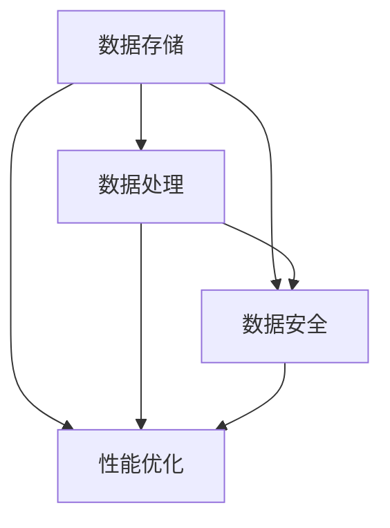

                 

关键词：大数据平台，整体架构，设计，方案，技术，数据存储，数据处理，数据安全，性能优化，云计算，分布式系统，人工智能。

## 摘要

本文旨在为大数据平台的建设提供一套整体架构设计方案。随着数据量的爆炸性增长，如何高效、稳定地处理海量数据成为企业面临的重大挑战。本文将从背景介绍、核心概念与联系、核心算法原理与步骤、数学模型与公式、项目实践、实际应用场景、工具和资源推荐、总结与展望等多个方面，详细阐述大数据平台建设的整体架构方案，以期为企业提供有价值的参考和指导。

## 1. 背景介绍

大数据（Big Data）是指无法在一定时间范围内用常规软件工具进行捕捉、管理和处理的数据集合。这些数据规模大、类型多样、产生速度快，且具有高度的动态性。随着物联网、移动互联网、云计算等技术的快速发展，大数据已经深入到各个领域，如金融、医疗、交通、教育等，成为推动产业升级和创新发展的重要驱动力。

然而，大数据的巨大潜力和应用价值也带来了新的挑战。如何高效地存储、处理和分析海量数据，确保数据的安全性和可靠性，成为大数据平台建设的关键问题。为了应对这些挑战，本文将提出一个全面的大数据平台建设整体架构设计方案，以期为企业的数据管理和分析提供有力支持。

### 1.1 大数据平台的必要性

1. **业务需求**：企业需要通过大数据平台获取有价值的信息，以支持决策制定、市场营销、客户服务等方面的业务需求。
2. **技术进步**：云计算、分布式系统、人工智能等技术的发展，为大数据平台的建设提供了强大的技术支撑。
3. **数据资源**：企业内部和外部的数据资源越来越丰富，需要有效整合和管理，以提高数据利用率。

### 1.2 大数据平台的主要功能

1. **数据存储与管理**：提供海量数据的存储和管理能力，确保数据的安全、可靠和可扩展性。
2. **数据处理与分析**：支持对海量数据进行高效处理和分析，挖掘数据的价值。
3. **数据可视化与展示**：通过可视化工具，将数据分析结果直观地呈现给用户，辅助决策制定。
4. **数据安全与隐私保护**：确保数据在存储、传输和使用过程中的安全，防止数据泄露和滥用。

## 2. 核心概念与联系

在构建大数据平台时，需要理解一些核心概念，如数据存储、数据处理、数据安全、性能优化等。以下是一个 Mermaid 流程图，展示了这些核心概念及其相互关系：



### 2.1 数据存储

数据存储是大数据平台的基础，主要包括关系型数据库、非关系型数据库、分布式文件系统等。数据存储的设计原则包括：

1. **高可用性**：确保数据在系统故障时能够快速恢复。
2. **高可靠性**：确保数据在存储过程中不丢失。
3. **高扩展性**：支持数据量的快速增长。
4. **高效性**：提供快速的数据访问和检索能力。

### 2.2 数据处理

数据处理是对海量数据进行清洗、转换、聚合等操作的过程。数据处理的设计原则包括：

1. **并行处理**：充分利用多核处理器的计算能力，提高数据处理速度。
2. **弹性伸缩**：根据数据处理需求动态调整计算资源。
3. **分布式计算**：将数据处理任务分布在多个节点上，提高处理效率和容错能力。
4. **容错性**：在处理过程中发生错误时，能够自动重试或切换到其他节点。

### 2.3 数据安全

数据安全是大数据平台建设的重要保障，包括数据加密、访问控制、备份与恢复等。数据安全的设计原则包括：

1. **加密存储**：对敏感数据进行加密存储，防止数据泄露。
2. **访问控制**：限制对数据的访问权限，确保数据在传输和使用过程中的安全。
3. **审计与监控**：实时监控数据访问和操作行为，及时发现并处理潜在的安全威胁。
4. **备份与恢复**：定期进行数据备份，确保在数据丢失或损坏时能够快速恢复。

### 2.4 性能优化

性能优化是提高大数据平台处理效率的关键，包括数据压缩、索引优化、缓存机制等。性能优化的设计原则包括：

1. **数据压缩**：减少数据的存储空间，提高存储和传输效率。
2. **索引优化**：建立合适的索引，提高数据检索速度。
3. **缓存机制**：通过缓存机制减少数据访问延迟，提高系统响应速度。
4. **负载均衡**：合理分配处理任务，避免单点瓶颈。

## 3. 核心算法原理 & 具体操作步骤

### 3.1 算法原理概述

在构建大数据平台时，需要采用一系列核心算法来处理海量数据。这些算法包括：

1. **MapReduce**：一种分布式数据处理框架，能够高效处理大规模数据集。
2. **Hadoop**：基于MapReduce的大数据处理平台，提供数据存储和计算功能。
3. **Spark**：一种高速大数据处理引擎，能够在内存中处理数据，提高处理速度。
4. **机器学习算法**：用于数据分析和预测，如线性回归、决策树、神经网络等。

### 3.2 算法步骤详解

#### 3.2.1 MapReduce

1. **Map阶段**：将输入数据分解成若干小块，对每个小块进行映射操作，生成中间键值对。
2. **Shuffle阶段**：将中间键值对按照键进行分组，将具有相同键的值组合在一起。
3. **Reduce阶段**：对每个分组进行聚合操作，生成最终结果。

#### 3.2.2 Hadoop

1. **HDFS**：分布式文件系统，用于存储大数据。
2. **YARN**：资源调度框架，用于管理和分配计算资源。
3. **MapReduce**：分布式数据处理框架，用于处理大数据。

#### 3.2.3 Spark

1. **RDD**：弹性分布式数据集，用于存储和处理数据。
2. **DataFrame**：基于RDD的数据结构，提供更丰富的操作接口。
3. **SQL on Spark**：支持Spark的SQL查询功能。

#### 3.2.4 机器学习算法

1. **数据预处理**：对数据进行清洗、转换和归一化等操作。
2. **特征提取**：从数据中提取有用特征，用于训练模型。
3. **模型训练**：使用特征数据训练模型，如线性回归、决策树等。
4. **模型评估**：评估模型的效果，如准确率、召回率等。

### 3.3 算法优缺点

#### MapReduce

**优点**：

- 分布式处理：能够高效处理大规模数据集。
- 可扩展性：支持动态调整计算资源。
- 高可靠性：在任务失败时能够自动重试。

**缺点**：

- 低效性：在处理小规模数据时性能较差。
- 串行化：任务之间存在依赖关系，无法并行处理。

#### Hadoop

**优点**：

- 高可用性：支持数据冗余备份，确保数据可靠性。
- 可扩展性：支持海量数据的存储和处理。
- 高可靠性：在节点故障时能够自动恢复。

**缺点**：

- 低效性：在处理小规模数据时性能较差。
- 复杂性：需要配置和管理多个组件。

#### Spark

**优点**：

- 高速：在内存中处理数据，提高处理速度。
- 易用性：提供丰富的API和操作接口。
- 可扩展性：支持动态调整计算资源。

**缺点**：

- 内存依赖：需要足够的内存资源，否则会导致性能下降。
- 复杂性：需要配置和管理多个组件。

#### 机器学习算法

**优点**：

- 高效性：能够从海量数据中提取有用特征。
- 准确性：能够对数据进行有效的预测和分类。

**缺点**：

- 复杂性：需要大量的数据预处理和模型调优。
- 过拟合：在训练过程中可能发生过拟合现象。

### 3.4 算法应用领域

这些算法在以下领域有广泛应用：

1. **数据处理**：如日志分析、搜索引擎、推荐系统等。
2. **数据挖掘**：如市场调研、风险评估、客户行为分析等。
3. **机器学习**：如图像识别、自然语言处理、语音识别等。

## 4. 数学模型和公式 & 详细讲解 & 举例说明

在构建大数据平台时，数学模型和公式发挥着重要作用。以下是一个数学模型的构建过程，以及一个公式的推导过程，并给出一个案例进行分析和讲解。

### 4.1 数学模型构建

#### 4.1.1 基本概念

1. **随机变量**：一个随机变量是一个数值，它可能取多个值，每个值对应一个概率。
2. **概率分布**：描述随机变量取值概率的函数，如正态分布、泊松分布等。

#### 4.1.2 模型构建

假设我们想要构建一个描述用户点击行为的概率模型。根据数据，我们可以得到以下概率分布：

- **点击率**：用户点击广告的概率。
- **非点击率**：用户未点击广告的概率。

### 4.2 公式推导过程

#### 4.2.1 基本公式

假设用户点击广告的概率为 \( p \)，则用户未点击广告的概率为 \( 1 - p \)。根据概率分布的性质，我们可以得到以下公式：

\[ P(X = k) = C(n, k) \times p^k \times (1 - p)^{n - k} \]

其中，\( P(X = k) \) 表示用户点击广告 \( k \) 次的概率，\( n \) 表示总点击次数，\( C(n, k) \) 表示组合数，计算公式为 \( C(n, k) = \frac{n!}{k! \times (n - k)!} \)。

### 4.3 案例分析与讲解

假设我们有一个广告，总点击次数为 \( n = 100 \)，点击率为 \( p = 0.1 \)。我们需要计算用户点击广告 5 次的概率。

根据基本公式，我们可以得到：

\[ P(X = 5) = C(100, 5) \times 0.1^5 \times 0.9^{95} \]

计算结果为：

\[ P(X = 5) \approx 0.0007 \]

这个结果表明，用户点击广告 5 次的概率约为 0.0007。

### 4.4 模型应用场景

该模型可以用于广告点击预测、用户行为分析等领域。例如，在广告投放中，可以根据用户的历史点击行为，预测用户是否会在未来点击某个广告，从而优化广告投放策略。

## 5. 项目实践：代码实例和详细解释说明

在本节中，我们将通过一个具体的代码实例，展示如何构建大数据平台并进行数据处理。我们将使用 Python 语言和 Hadoop、Spark 等开源工具，详细解释每个步骤的实现过程。

### 5.1 开发环境搭建

首先，我们需要搭建一个开发环境。以下是搭建步骤：

1. **安装 JDK**：Hadoop 和 Spark 都依赖于 JDK，需要安装 JDK 1.8 或更高版本。
2. **安装 Hadoop**：从 Apache Hadoop 官网下载 Hadoop 安装包，并按照文档进行安装。
3. **安装 Spark**：从 Apache Spark 官网下载 Spark 安装包，并按照文档进行安装。
4. **配置环境变量**：将 Hadoop 和 Spark 的安装路径添加到系统环境变量中。

### 5.2 源代码详细实现

以下是数据处理的一个简单示例，该示例使用 Spark 进行数据处理：

```python
from pyspark import SparkContext, SparkConf

# 创建 SparkConf 对象，配置 Spark 参数
conf = SparkConf().setAppName("DataProcessing").setMaster("local[*]")

# 创建 SparkContext 对象
sc = SparkContext(conf=conf)

# 读取输入数据
data = sc.textFile("input.txt")

# 数据清洗和转换
cleaned_data = data.filter(lambda line: len(line) > 0).map(lambda line: line.split(",")).map(lambda fields: (fields[0], float(fields[1])))

# 数据处理
result = cleaned_data.reduceByKey(lambda x, y: x + y)

# 数据排序
sorted_result = result.sortBy(lambda x: x[1], ascending=False)

# 输出结果
sorted_result.saveAsTextFile("output.txt")

# 关闭 SparkContext
sc.stop()
```

### 5.3 代码解读与分析

以下是代码的详细解读和分析：

1. **创建 SparkConf 对象**：配置 Spark 参数，如应用名称和运行模式。
2. **创建 SparkContext 对象**：初始化 Spark 运行环境。
3. **读取输入数据**：使用 `textFile` 方法读取文本文件，并将其转换为 RDD（弹性分布式数据集）。
4. **数据清洗和转换**：使用 `filter` 和 `map` 方法进行数据清洗和转换，将输入数据分割成字段，并转换为键值对。
5. **数据处理**：使用 `reduceByKey` 方法对数据进行聚合，计算每个键的值之和。
6. **数据排序**：使用 `sortBy` 方法对结果进行排序。
7. **输出结果**：使用 `saveAsTextFile` 方法将结果保存到文本文件中。
8. **关闭 SparkContext**：释放资源，停止 Spark 运行。

### 5.4 运行结果展示

运行以上代码后，会在输出目录生成一个包含排序后的结果文本文件。通过分析结果，我们可以了解数据的基本分布和特征，为后续数据分析和挖掘提供基础。

## 6. 实际应用场景

大数据平台在许多领域都有广泛的应用，以下是一些实际应用场景：

1. **金融领域**：用于风险管理、市场分析、客户行为分析等。
2. **医疗领域**：用于疾病预测、健康数据分析、医疗影像处理等。
3. **交通领域**：用于交通流量预测、交通拥堵分析、车辆调度等。
4. **零售领域**：用于销售预测、库存管理、客户满意度分析等。
5. **教育领域**：用于学生成绩分析、学习效果评估、教育资源共享等。

### 6.1 案例分析

#### 案例一：金融领域

某金融机构使用大数据平台对客户行为进行分析，以识别高风险客户。通过构建一个包含客户年龄、收入、贷款金额、还款历史等数据的模型，金融机构可以预测客户的违约风险。根据预测结果，金融机构可以采取相应的风险管理措施，如调整贷款利率、增加贷款审核流程等，以降低风险。

#### 案例二：医疗领域

某医院使用大数据平台对患者的医疗数据进行分析，以提高疾病诊断和治疗效果。通过分析患者的病史、体检数据、治疗方案等，医院可以构建一个包含疾病预测、治疗方案推荐等功能的智能医疗系统。该系统可以帮助医生更准确地诊断疾病，提高治疗效果，同时降低医疗成本。

#### 案例三：交通领域

某城市交通管理部门使用大数据平台对交通流量进行分析，以优化交通信号灯控制策略。通过分析车辆流量、道路拥堵情况等数据，交通管理部门可以实时调整信号灯的时长和切换规则，以提高道路通行效率和减少拥堵。

#### 案例四：零售领域

某零售企业使用大数据平台对销售数据进行分析，以优化库存管理和营销策略。通过分析销售数据、客户购买行为等，企业可以预测未来的销售趋势，优化库存水平，避免库存过剩或短缺。同时，企业还可以根据客户需求，制定个性化的营销策略，提高客户满意度和忠诚度。

#### 案例五：教育领域

某教育机构使用大数据平台对学生的学习情况进行分析，以优化教学效果。通过分析学生的学习数据，如考试成绩、作业提交情况等，教育机构可以识别学生的学习薄弱环节，制定针对性的教学计划和辅导方案。同时，教育机构还可以根据学生的学习进度和反馈，实时调整教学内容和教学方法，提高教学效果。

## 7. 工具和资源推荐

### 7.1 学习资源推荐

1. **书籍**：
   - 《大数据时代：生活、工作与思维的大变革》
   - 《Hadoop实战》
   - 《Spark实战》
2. **在线课程**：
   - Coursera 上的“大数据分析”课程
   - Udacity 上的“大数据工程师”课程
3. **博客和社区**：
   - [Hadoop官网](http://hadoop.apache.org/)
   - [Spark官网](http://spark.apache.org/)
   - [CSDN大数据专区](http://blog.csdn.net/dqdxjzx)

### 7.2 开发工具推荐

1. **集成开发环境（IDE）**：
   - IntelliJ IDEA
   - Eclipse
2. **版本控制系统**：
   - Git
   - SVN
3. **数据可视化工具**：
   - Tableau
   - Power BI

### 7.3 相关论文推荐

1. **MapReduce**：
   - "MapReduce: Simplified Data Processing on Large Clusters"（MapReduce：在大型集群上的简化数据处理）
2. **Hadoop**：
   - "Hadoop: The Definitive Guide"（Hadoop：官方指南）
3. **Spark**：
   - "Spark: The Definitive Guide"（Spark：官方指南）
4. **机器学习**：
   - "机器学习：概率视角"（Machine Learning: A Probabilistic Perspective）

## 8. 总结：未来发展趋势与挑战

### 8.1 研究成果总结

大数据平台建设已经取得了显著的研究成果。在数据存储方面，分布式文件系统如 HDFS 和 Hadoop 已经成为事实标准；在数据处理方面，MapReduce、Spark 等分布式处理框架不断优化和改进；在数据安全方面，加密存储、访问控制等手段逐渐成熟；在性能优化方面，数据压缩、索引优化等技术不断涌现。

### 8.2 未来发展趋势

未来，大数据平台建设将继续朝着以下几个方向发展：

1. **高性能计算**：随着计算能力的提升，大数据平台将能够处理更大量、更复杂的数据。
2. **实时分析**：实时数据处理和分析将成为大数据平台的重要方向，为实时决策提供支持。
3. **智能分析**：结合人工智能技术，大数据平台将实现更智能的数据分析，提高数据价值。
4. **数据隐私保护**：随着数据隐私保护意识的提高，大数据平台将更加注重数据隐私保护。

### 8.3 面临的挑战

大数据平台建设也面临一些挑战：

1. **数据质量**：数据质量差、数据缺失等问题仍然存在，需要不断优化数据清洗和转换技术。
2. **数据安全**：数据泄露、数据篡改等安全威胁仍然存在，需要加强数据安全防护措施。
3. **性能优化**：如何在高并发、大数据量的情况下，保持系统的高性能，仍是一个挑战。
4. **人才培养**：大数据平台建设需要大量专业人才，但当前人才培养速度无法满足需求。

### 8.4 研究展望

未来，大数据平台建设的研究方向包括：

1. **多模态数据处理**：结合多种数据类型，如结构化数据、半结构化数据和非结构化数据，进行一体化处理。
2. **联邦学习**：通过分布式计算和加密技术，实现数据的安全共享和协同分析。
3. **自动化与智能化**：实现数据处理的自动化和智能化，降低人工干预，提高处理效率。
4. **跨领域应用**：探索大数据平台在各个领域的应用，推动产业创新和升级。

## 9. 附录：常见问题与解答

### 9.1 问题 1：大数据平台建设需要哪些硬件和软件？

**解答**：大数据平台建设需要以下硬件和软件：

- **硬件**：高性能服务器、存储设备、网络设备等。
- **软件**：操作系统（如 Linux）、数据库系统（如 MySQL、Hadoop、Spark 等）、编程语言（如 Python、Java 等）。

### 9.2 问题 2：大数据平台的数据存储如何保证安全性？

**解答**：大数据平台的数据存储安全性可以通过以下措施保证：

- **数据加密**：对敏感数据进行加密存储，防止数据泄露。
- **访问控制**：限制对数据的访问权限，确保数据在传输和使用过程中的安全。
- **备份与恢复**：定期进行数据备份，确保在数据丢失或损坏时能够快速恢复。

### 9.3 问题 3：大数据平台如何处理海量数据？

**解答**：大数据平台通过分布式计算和存储技术处理海量数据：

- **分布式计算**：将数据处理任务分布在多个节点上，提高处理效率和容错能力。
- **分布式存储**：使用分布式文件系统（如 HDFS）存储海量数据，提高数据存储的可靠性和扩展性。

## 结束语

本文详细阐述了大数据平台建设的整体架构方案，从背景介绍、核心概念与联系、核心算法原理与步骤、数学模型与公式、项目实践、实际应用场景、工具和资源推荐、总结与展望等方面，提供了全面而深入的指导。希望通过本文，读者能够对大数据平台建设有一个更加清晰的认识，并在实际工作中得到有效应用。在未来的发展中，大数据平台将继续发挥重要作用，为各行各业的创新和发展提供强大支持。作者：禅与计算机程序设计艺术 / Zen and the Art of Computer Programming。

