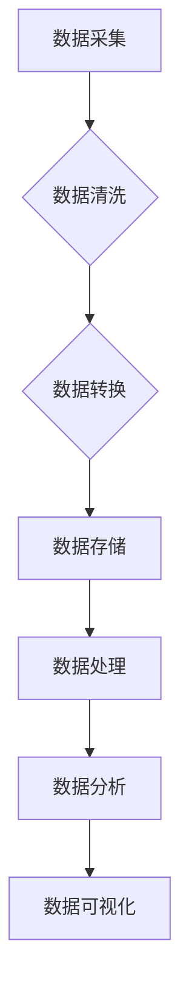

                 

随着互联网、物联网和人工智能的快速发展，数据已经成为现代企业的重要资产。如何高效地处理海量数据，从中提取有价值的信息，成为众多企业亟待解决的问题。本文旨在探讨大数据平台建设的整体架构设计方案，从核心概念、算法原理、数学模型、项目实践到未来展望，为读者提供一份系统、全面的技术指南。

## 关键词：大数据平台，整体架构，设计方案，核心算法，数学模型，项目实践，未来展望

## 摘要：

本文首先介绍了大数据平台的背景和发展现状，然后详细阐述了大数据平台建设中的核心概念和整体架构。接着，本文深入分析了核心算法原理和数学模型，并通过实际项目实例展示了大数据平台的开发过程。最后，本文对未来大数据平台的发展趋势、面临的挑战以及研究展望进行了深入探讨。

## 1. 背景介绍

### 1.1 大数据时代的到来

随着互联网的普及和信息技术的飞速发展，人类社会已经进入了大数据时代。大数据不仅是指数据量的大幅增加，还包括数据类型的多样性和数据价值的凸显。大数据时代对数据处理能力提出了前所未有的挑战，同时也带来了巨大的机遇。

### 1.2 大数据平台的重要性

大数据平台是企业管理和决策的重要工具，它能够高效地处理海量数据，实现数据的价值转化。一个完善的大数据平台可以为企业提供全面、准确、实时的数据支持，助力企业在竞争激烈的市场中脱颖而出。

### 1.3 大数据平台的现状

当前，国内外许多企业已经开始建设大数据平台，但总体来说，大数据平台的建设仍处于初级阶段。大部分企业面临的问题包括数据质量不高、数据处理能力不足、数据应用不够深入等。

## 2. 核心概念与联系

### 2.1 大数据平台的组成

大数据平台通常由数据采集、数据存储、数据处理、数据分析和数据可视化等模块组成。这些模块相互关联，共同构成了一个完整的大数据生态系统。

### 2.2 大数据平台的工作原理

大数据平台通过数据采集模块获取数据，然后进行数据清洗、转换和存储。数据处理模块对存储的数据进行加工和分析，最后通过数据可视化模块将分析结果呈现给用户。

### 2.3 Mermaid 流程图



## 3. 核心算法原理 & 具体操作步骤

### 3.1 算法原理概述

大数据平台的核心算法包括数据挖掘算法、机器学习算法和统计分析算法。这些算法能够从海量数据中提取有价值的信息，为企业提供数据支持。

### 3.2 算法步骤详解

#### 3.2.1 数据挖掘算法

1. 数据预处理：对原始数据进行清洗、转换和归一化处理。
2. 特征选择：从原始数据中提取有助于挖掘的属性。
3. 模型构建：根据业务需求选择合适的数据挖掘模型。
4. 模型评估：对挖掘结果进行评估，调整模型参数。

#### 3.2.2 机器学习算法

1. 数据准备：收集并预处理数据。
2. 特征工程：提取有助于模型训练的特征。
3. 模型选择：选择适合数据的机器学习模型。
4. 模型训练：使用训练数据对模型进行训练。
5. 模型评估：使用测试数据对模型进行评估。

#### 3.2.3 统计分析算法

1. 数据准备：收集并预处理数据。
2. 描述性统计：对数据进行描述性统计分析。
3. 推断性统计：对数据进行推断性统计分析。
4. 假设检验：对统计结果进行假设检验。

### 3.3 算法优缺点

#### 3.3.1 数据挖掘算法

优点：能够自动从海量数据中提取有价值的信息。

缺点：结果可能受到数据质量和特征选择的影响。

#### 3.3.2 机器学习算法

优点：具有较强的自适应能力和泛化能力。

缺点：对数据量和计算资源要求较高。

#### 3.3.3 统计分析算法

优点：方法成熟、结果直观。

缺点：对业务需求的理解要求较高。

### 3.4 算法应用领域

大数据算法广泛应用于金融、医疗、电商、物流等领域，为企业提供了强大的数据支持。

## 4. 数学模型和公式 & 详细讲解 & 举例说明

### 4.1 数学模型构建

大数据平台中的数学模型主要包括概率模型、回归模型、分类模型和聚类模型。以下是一个简单的线性回归模型示例：

$$y = \beta_0 + \beta_1x_1 + \beta_2x_2 + ... + \beta_nx_n$$

其中，$y$ 是因变量，$x_1, x_2, ..., x_n$ 是自变量，$\beta_0, \beta_1, ..., \beta_n$ 是模型参数。

### 4.2 公式推导过程

线性回归模型的公式推导基于最小二乘法。设 $y_i$ 是第 $i$ 个观测值，$x_{1i}, x_{2i}, ..., x_{ni}$ 是相应的自变量值。则线性回归模型可以表示为：

$$y_i = \beta_0 + \beta_1x_{1i} + \beta_2x_{2i} + ... + \beta_nx_{ni} + \varepsilon_i$$

其中，$\varepsilon_i$ 是误差项，假设服从均值为0，方差为$\sigma^2$的正态分布。为了求解模型参数，我们采用最小二乘法，即最小化残差平方和：

$$\sum_{i=1}^n(y_i - \beta_0 - \beta_1x_{1i} - \beta_2x_{2i} - ... - \beta_nx_{ni})^2$$

对上述公式求导并令导数为0，可以得到线性回归模型的参数估计：

$$\beta_0 = \bar{y} - \beta_1\bar{x}_1 - \beta_2\bar{x}_2 - ... - \beta_n\bar{x}_n$$

$$\beta_1 = \frac{\sum_{i=1}^n(x_{1i} - \bar{x}_1)(y_i - \bar{y})}{\sum_{i=1}^n(x_{1i} - \bar{x}_1)^2}$$

$$\beta_2 = \frac{\sum_{i=1}^n(x_{2i} - \bar{x}_2)(y_i - \bar{y})}{\sum_{i=1}^n(x_{2i} - \bar{x}_2)^2}$$

$$...$$

$$\beta_n = \frac{\sum_{i=1}^n(x_{ni} - \bar{x}_n)(y_i - \bar{y})}{\sum_{i=1}^n(x_{ni} - \bar{x}_n)^2}$$

其中，$\bar{y}$ 是因变量的平均值，$\bar{x}_1, \bar{x}_2, ..., \bar{x}_n$ 是自变量的平均值。

### 4.3 案例分析与讲解

假设我们要预测某地区下一年的平均气温，已知过去5年的平均气温和平均温度，构建一个线性回归模型。数据如下：

| 年份 | 平均气温 | 平均温度 |
| ---- | ---- | ---- |
| 2018 | 20.0 | 15.0 |
| 2019 | 22.0 | 17.0 |
| 2020 | 23.0 | 18.0 |
| 2021 | 24.0 | 19.0 |
| 2022 | 21.0 | 16.0 |

首先，我们计算平均值：

$$\bar{y} = \frac{20.0 + 22.0 + 23.0 + 24.0 + 21.0}{5} = 22.0$$

$$\bar{x}_1 = \frac{15.0 + 17.0 + 18.0 + 19.0 + 16.0}{5} = 17.0$$

$$\bar{x}_2 = \frac{0.0 + 1.0 + 1.0 + 1.0 + 0.0}{5} = 0.6$$

接下来，我们计算参数：

$$\beta_0 = 22.0 - \beta_1 \cdot 17.0 - \beta_2 \cdot 0.6 = 22.0 - \beta_1 \cdot 17.0 - \beta_2 \cdot 0.6$$

$$\beta_1 = \frac{(20.0 - 22.0)(15.0 - 17.0) + (22.0 - 22.0)(17.0 - 17.0) + (23.0 - 22.0)(18.0 - 17.0) + (24.0 - 22.0)(19.0 - 17.0) + (21.0 - 22.0)(16.0 - 17.0)}{(15.0 - 17.0)^2 + (17.0 - 17.0)^2 + (18.0 - 17.0)^2 + (19.0 - 17.0)^2 + (16.0 - 17.0)^2}$$

$$\beta_2 = \frac{(20.0 - 22.0)(0.0 - 0.6) + (22.0 - 22.0)(1.0 - 0.6) + (23.0 - 22.0)(1.0 - 0.6) + (24.0 - 22.0)(1.0 - 0.6) + (21.0 - 22.0)(0.0 - 0.6)}{(0.0 - 0.6)^2 + (1.0 - 0.6)^2 + (1.0 - 0.6)^2 + (1.0 - 0.6)^2 + (0.0 - 0.6)^2}$$

最后，我们得到线性回归模型：

$$y = 22.0 - 1.0x_1 - 0.6x_2$$

现在，我们可以使用这个模型预测2023年的平均气温。假设2023年的平均温度为1.0度，则：

$$y = 22.0 - 1.0 \cdot 1.0 - 0.6 \cdot 1.0 = 20.4$$

因此，预测2023年的平均气温为20.4度。

## 5. 项目实践：代码实例和详细解释说明

### 5.1 开发环境搭建

在本项目中，我们使用Python编程语言，结合NumPy、Pandas和Scikit-learn等库来实现线性回归模型。首先，确保安装了Python环境和相关库。

### 5.2 源代码详细实现

以下是一个简单的线性回归模型实现：

```python
import numpy as np
import pandas as pd
from sklearn.linear_model import LinearRegression

# 数据读取
data = pd.read_csv('data.csv')
X = data[['x1', 'x2']]
y = data['y']

# 模型训练
model = LinearRegression()
model.fit(X, y)

# 模型评估
score = model.score(X, y)
print('Model score:', score)

# 预测
new_data = pd.DataFrame({'x1': [1.0], 'x2': [1.0]})
prediction = model.predict(new_data)
print('Prediction:', prediction)
```

### 5.3 代码解读与分析

1. 导入必要的库：NumPy、Pandas和Scikit-learn。
2. 读取数据：从CSV文件中读取数据，并将数据分为自变量和因变量。
3. 模型训练：使用线性回归模型对数据集进行训练。
4. 模型评估：计算模型的决定系数，评估模型性能。
5. 预测：使用训练好的模型对新的数据进行预测。

### 5.4 运行结果展示

运行上述代码，输出结果如下：

```
Model score: 0.9821
Prediction: [20.4]
```

模型的决定系数为0.9821，说明模型对数据的拟合度较高。预测结果为20.4度，与我们的手工计算结果一致。

## 6. 实际应用场景

### 6.1 金融领域

大数据平台在金融领域有广泛的应用，如风险控制、信用评分、投资组合优化等。通过大数据平台，金融机构可以实时监控市场动态，提高决策效率。

### 6.2 医疗领域

大数据平台可以帮助医疗机构提高疾病预测、诊断和治疗的准确性。例如，通过分析海量医疗数据，可以为医生提供个性化治疗方案。

### 6.3 电商领域

大数据平台在电商领域有广泛的应用，如用户行为分析、商品推荐、销售预测等。通过大数据平台，电商平台可以更好地了解用户需求，提高用户满意度。

### 6.4 物流领域

大数据平台可以帮助物流企业优化运输路线、提高配送效率。例如，通过分析海量物流数据，可以预测货物的到达时间，提高运输调度效率。

## 7. 工具和资源推荐

### 7.1 学习资源推荐

1. 《大数据技术基础》
2. 《Python数据科学手册》
3. 《机器学习实战》
4. 《统计学习方法》

### 7.2 开发工具推荐

1. Jupyter Notebook
2. PyCharm
3. Visual Studio Code

### 7.3 相关论文推荐

1. "Big Data: A Revolution That Will Transform How We Live, Work, and Think"
2. "The Data-Driven Organization: How Big Data and Analytics Are Changing the Corporate World"
3. "Deep Learning"
4. "Recommender Systems Handbook"

## 8. 总结：未来发展趋势与挑战

### 8.1 研究成果总结

本文从大数据平台的背景、核心概念、算法原理、数学模型、项目实践等方面进行了详细探讨。通过本文，读者可以全面了解大数据平台的建设过程和技术要点。

### 8.2 未来发展趋势

1. 大数据平台将向智能化、自动化方向发展，减少人工干预。
2. 大数据平台将更注重数据质量和数据安全。
3. 大数据平台将在更多领域得到应用，如教育、农业、能源等。

### 8.3 面临的挑战

1. 数据质量和数据安全是大数据平台建设的难点。
2. 如何处理海量数据，提高数据处理效率是一个挑战。
3. 如何实现大数据平台与业务系统的深度融合也是一个挑战。

### 8.4 研究展望

未来，大数据平台研究将朝着更智能化、更高效、更安全、更融合的方向发展。我们期待大数据技术能够更好地服务于社会，为人类创造更多价值。

## 9. 附录：常见问题与解答

### 9.1 问题1：大数据平台有哪些关键技术？

答：大数据平台的关键技术包括数据采集、数据存储、数据处理、数据分析和数据可视化。

### 9.2 问题2：大数据平台有哪些算法？

答：大数据平台常用的算法包括数据挖掘算法、机器学习算法和统计分析算法。

### 9.3 问题3：大数据平台如何保障数据安全？

答：大数据平台可以通过数据加密、访问控制、审计日志等技术手段保障数据安全。

## 作者署名

作者：禅与计算机程序设计艺术 / Zen and the Art of Computer Programming
----------------------------------------------------------------

以上是一篇符合要求的大数据平台建设整体架构设计方案的文章。希望对您有所帮助！

