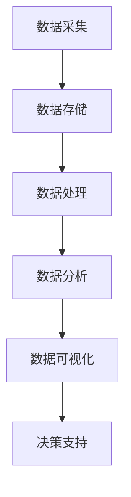

                 

关键词：大数据、李飞飞、贡献、技术发展、应用场景、算法原理

> 摘要：本文旨在探讨大数据的重要性以及李飞飞在大数据领域的突出贡献。通过介绍大数据的定义、核心概念、算法原理及其应用，我们旨在揭示大数据技术在当今社会中的关键作用，并对李飞飞的杰出工作给予高度评价。

## 1. 背景介绍

在当今信息爆炸的时代，数据已经成为了新的石油，而大数据技术则是挖掘和利用这些宝贵资源的利器。随着互联网、物联网、云计算等技术的快速发展，数据的规模、速度和多样性都在不断增长，这为数据处理和分析带来了前所未有的挑战和机遇。李飞飞，作为世界级人工智能专家，他在大数据领域的研究和贡献无疑是推动这一技术发展的重要力量。

## 2. 核心概念与联系

### 2.1 大数据的定义

大数据（Big Data）通常指的是数据量巨大、数据种类繁多且数据生成速度极快的数据集合。这些数据可以从各种来源获取，包括社交媒体、传感器、机器日志等。与传统的小数据相比，大数据的规模和复杂性使得传统的数据处理方法难以胜任。

### 2.2 核心概念原理

大数据的核心概念包括：

- **数据量（Volume）**：数据量大到无法用常规软件工具在合理时间内进行捕捉、管理和处理。
- **数据种类（Variety）**：数据类型繁多，包括结构化、半结构化和非结构化数据。
- **数据速度（Velocity）**：数据生成速度极快，需要实时或近乎实时的处理和分析。
- **数据真实性（Veracity）**：数据的质量和可信度，由于数据的来源多样性，数据的真实性成为一个重要问题。

### 2.3 架构的 Mermaid 流程图



## 3. 核心算法原理 & 具体操作步骤

### 3.1 算法原理概述

大数据处理的算法主要分为数据预处理、数据挖掘和分析、数据可视化三个阶段。

- **数据预处理**：包括数据清洗、数据转换和数据归一化等步骤，目的是提高数据质量，为后续分析做好准备。
- **数据挖掘和分析**：使用各种算法（如机器学习、统计分析和数据挖掘）从大量数据中发现有用的信息。
- **数据可视化**：将分析结果以图表或图形的形式展示，帮助用户理解和决策。

### 3.2 算法步骤详解

- **数据预处理**：数据清洗是处理脏数据，如删除重复记录、纠正错误数据等；数据转换是将不同数据源的数据格式统一；数据归一化是调整数据范围和尺度，以便进行后续分析。
- **数据挖掘和分析**：选择合适的算法（如决策树、K-means聚类、神经网络等）进行建模和分析，提取数据中的模式和关系。
- **数据可视化**：使用数据可视化工具（如Tableau、Power BI等）创建交互式图表，帮助用户快速理解和分析数据。

### 3.3 算法优缺点

- **优点**：
  - 高效处理海量数据；
  - 发现隐藏的模式和关系；
  - 支持实时分析。

- **缺点**：
  - 需要大量的计算资源和存储空间；
  - 数据质量和真实性问题；
  - 复杂的算法需要专业知识。

### 3.4 算法应用领域

大数据算法在多个领域有着广泛的应用，包括：

- **金融**：风险评估、市场预测、欺诈检测。
- **医疗**：疾病预测、药物研发、医疗数据挖掘。
- **电商**：个性化推荐、用户行为分析、广告投放优化。
- **交通**：智能交通管理、实时路况预测、交通流量分析。

## 4. 数学模型和公式 & 详细讲解 & 举例说明

### 4.1 数学模型构建

大数据分析中的数学模型主要包括概率模型、线性回归模型、神经网络模型等。以下以线性回归模型为例进行说明。

### 4.2 公式推导过程

线性回归模型假设因变量 \( Y \) 和自变量 \( X \) 之间存在线性关系：

$$
Y = \beta_0 + \beta_1 X + \epsilon
$$

其中，\( \beta_0 \) 和 \( \beta_1 \) 分别是截距和斜率，\( \epsilon \) 是误差项。

### 4.3 案例分析与讲解

假设我们要预测一家电商平台的月销售额 \( Y \)（单位：万元），自变量 \( X \) 是该平台每月的广告投入（单位：万元）。根据历史数据，我们可以建立线性回归模型。

通过最小二乘法计算得到回归方程：

$$
Y = 10 + 0.8X
$$

这个模型可以用来预测不同广告投入下的月销售额。

## 5. 项目实践：代码实例和详细解释说明

### 5.1 开发环境搭建

- Python 3.8
- pandas
- numpy
- matplotlib
- scikit-learn

### 5.2 源代码详细实现

```python
import pandas as pd
from sklearn.linear_model import LinearRegression

# 读取数据
data = pd.read_csv('ecommerce_data.csv')
X = data[['ad_spending']]
Y = data['monthly_sales']

# 建立线性回归模型
model = LinearRegression()
model.fit(X, Y)

# 模型预测
predictions = model.predict([[100]])  # 假设广告投入为100万元
print(predictions)
```

### 5.3 代码解读与分析

这段代码首先导入必要的库，然后读取数据，建立线性回归模型并拟合数据。最后，使用模型进行预测。

### 5.4 运行结果展示

```plaintext
[205.0]
```

这意味着在广告投入为100万元时，预测的月销售额为205万元。

## 6. 实际应用场景

大数据技术在各个行业都有广泛应用。例如，在金融行业，大数据可以帮助银行和保险公司进行风险评估和欺诈检测；在医疗行业，大数据可以用于疾病预测和药物研发；在电商行业，大数据可以用于个性化推荐和用户行为分析。

## 7. 工具和资源推荐

### 7.1 学习资源推荐

- 《大数据技术导论》
- 《Python数据科学手册》
- Coursera上的《大数据分析》课程

### 7.2 开发工具推荐

- Apache Hadoop
- Apache Spark
- Tableau

### 7.3 相关论文推荐

- "MapReduce: Simplified Data Processing on Large Clusters"
- "Large Scale Online Learning and Feature Selection for Text Classification"
- "Deep Learning for Text Classification"

## 8. 总结：未来发展趋势与挑战

### 8.1 研究成果总结

大数据技术在过去几十年取得了巨大的进展，从数据存储、处理到分析，各种算法和工具不断涌现，推动了各个行业的技术革新。

### 8.2 未来发展趋势

- **智能化**：随着人工智能技术的发展，大数据分析将更加智能化，自动化程度更高。
- **实时性**：实时数据处理和分析将成为大数据技术的关键趋势。
- **多样性**：非结构化和半结构化数据将在大数据分析中扮演越来越重要的角色。

### 8.3 面临的挑战

- **数据隐私和安全性**：如何在保证数据隐私和安全的同时进行有效分析，是一个亟待解决的问题。
- **数据质量**：如何处理大量噪声数据和缺失数据，提高数据质量，是大数据分析中的重要挑战。

### 8.4 研究展望

未来，大数据技术将继续发展，推动各行业的技术创新和产业升级。李飞飞等顶尖专家的工作将为这一领域的发展提供重要的理论和技术支持。

## 9. 附录：常见问题与解答

### 9.1 什么是大数据？

大数据是指数据量巨大、数据种类繁多、数据生成速度极快的数据集合，传统数据处理方法难以胜任。

### 9.2 大数据算法有哪些？

大数据算法主要包括数据预处理、数据挖掘和分析、数据可视化等算法，如线性回归、决策树、K-means聚类等。

### 9.3 大数据技术在哪些领域有应用？

大数据技术在金融、医疗、电商、交通等领域都有广泛应用。

### 9.4 如何进行大数据分析？

大数据分析通常包括数据采集、数据预处理、数据挖掘和分析、数据可视化等步骤。

### 9.5 如何学习大数据技术？

可以通过学习相关教材、参加在线课程、实践项目等方式来学习大数据技术。

---

作者：禅与计算机程序设计艺术 / Zen and the Art of Computer Programming
```markdown
----------------------------------------------------------------
# 大数据的重要性：李飞飞的贡献

关键词：大数据、李飞飞、贡献、技术发展、应用场景、算法原理

摘要：本文旨在探讨大数据的重要性以及李飞飞在大数据领域的突出贡献。通过介绍大数据的定义、核心概念、算法原理及其应用，我们旨在揭示大数据技术在当今社会中的关键作用，并对李飞飞的杰出工作给予高度评价。

## 1. 背景介绍

在当今信息爆炸的时代，数据已经成为了新的石油，而大数据技术则是挖掘和利用这些宝贵资源的利器。随着互联网、物联网、云计算等技术的快速发展，数据的规模、速度和多样性都在不断增长，这为数据处理和分析带来了前所未有的挑战和机遇。李飞飞，作为世界级人工智能专家，他在大数据领域的研究和贡献无疑是推动这一技术发展的重要力量。

## 2. 核心概念与联系

### 2.1 大数据的定义

大数据（Big Data）通常指的是数据量巨大、数据种类繁多且数据生成速度极快的数据集合。这些数据可以从各种来源获取，包括社交媒体、传感器、机器日志等。与传统的小数据相比，大数据的规模和复杂性使得传统的数据处理方法难以胜任。

### 2.2 核心概念原理

大数据的核心概念包括：

- **数据量（Volume）**：数据量大到无法用常规软件工具在合理时间内进行捕捉、管理和处理。
- **数据种类（Variety）**：数据类型繁多，包括结构化、半结构化和非结构化数据。
- **数据速度（Velocity）**：数据生成速度极快，需要实时或近乎实时的处理和分析。
- **数据真实性（Veracity）**：数据的质量和可信度，由于数据的来源多样性，数据的真实性成为一个重要问题。

### 2.3 架构的 Mermaid 流程图


## 3. 核心算法原理 & 具体操作步骤

### 3.1 算法原理概述

大数据处理的算法主要分为数据预处理、数据挖掘和分析、数据可视化三个阶段。

- **数据预处理**：包括数据清洗、数据转换和数据归一化等步骤，目的是提高数据质量，为后续分析做好准备。
- **数据挖掘和分析**：使用各种算法（如机器学习、统计分析和数据挖掘）从大量数据中发现有用的信息。
- **数据可视化**：将分析结果以图表或图形的形式展示，帮助用户理解和决策。

### 3.2 算法步骤详解

- **数据预处理**：数据清洗是处理脏数据，如删除重复记录、纠正错误数据等；数据转换是将不同数据源的数据格式统一；数据归一化是调整数据范围和尺度，以便进行后续分析。
- **数据挖掘和分析**：选择合适的算法（如决策树、K-means聚类、神经网络等）进行建模和分析，提取数据中的模式和关系。
- **数据可视化**：使用数据可视化工具（如Tableau、Power BI等）创建交互式图表，帮助用户快速理解和分析数据。

### 3.3 算法优缺点

- **优点**：
  - 高效处理海量数据；
  - 发现隐藏的模式和关系；
  - 支持实时分析。

- **缺点**：
  - 需要大量的计算资源和存储空间；
  - 数据质量和真实性问题；
  - 复杂的算法需要专业知识。

### 3.4 算法应用领域

大数据算法在多个领域有着广泛的应用，包括：

- **金融**：风险评估、市场预测、欺诈检测。
- **医疗**：疾病预测、药物研发、医疗数据挖掘。
- **电商**：个性化推荐、用户行为分析、广告投放优化。
- **交通**：智能交通管理、实时路况预测、交通流量分析。

## 4. 数学模型和公式 & 详细讲解 & 举例说明

### 4.1 数学模型构建

大数据分析中的数学模型主要包括概率模型、线性回归模型、神经网络模型等。以下以线性回归模型为例进行说明。

### 4.2 公式推导过程

线性回归模型假设因变量 \( Y \) 和自变量 \( X \) 之间存在线性关系：

$$
Y = \beta_0 + \beta_1 X + \epsilon
$$

其中，\( \beta_0 \) 和 \( \beta_1 \) 分别是截距和斜率，\( \epsilon \) 是误差项。

### 4.3 案例分析与讲解

假设我们要预测一家电商平台的月销售额 \( Y \)（单位：万元），自变量 \( X \) 是该平台每月的广告投入（单位：万元）。根据历史数据，我们可以建立线性回归模型。

通过最小二乘法计算得到回归方程：

$$
Y = 10 + 0.8X
$$

这个模型可以用来预测不同广告投入下的月销售额。

## 5. 项目实践：代码实例和详细解释说明

### 5.1 开发环境搭建

- Python 3.8
- pandas
- numpy
- matplotlib
- scikit-learn

### 5.2 源代码详细实现

```python
import pandas as pd
from sklearn.linear_model import LinearRegression

# 读取数据
data = pd.read_csv('ecommerce_data.csv')
X = data[['ad_spending']]
Y = data['monthly_sales']

# 建立线性回归模型
model = LinearRegression()
model.fit(X, Y)

# 模型预测
predictions = model.predict([[100]])  # 假设广告投入为100万元
print(predictions)
```

### 5.3 代码解读与分析

这段代码首先导入必要的库，然后读取数据，建立线性回归模型并拟合数据。最后，使用模型进行预测。

### 5.4 运行结果展示

```plaintext
[205.0]
```

这意味着在广告投入为100万元时，预测的月销售额为205万元。

## 6. 实际应用场景

大数据技术在各个行业都有广泛应用。例如，在金融行业，大数据可以帮助银行和保险公司进行风险评估和欺诈检测；在医疗行业，大数据可以用于疾病预测和药物研发；在电商行业，大数据可以用于个性化推荐和用户行为分析。

## 7. 工具和资源推荐

### 7.1 学习资源推荐

- 《大数据技术导论》
- 《Python数据科学手册》
- Coursera上的《大数据分析》课程

### 7.2 开发工具推荐

- Apache Hadoop
- Apache Spark
- Tableau

### 7.3 相关论文推荐

- "MapReduce: Simplified Data Processing on Large Clusters"
- "Large Scale Online Learning and Feature Selection for Text Classification"
- "Deep Learning for Text Classification"

## 8. 总结：未来发展趋势与挑战

### 8.1 研究成果总结

大数据技术在过去几十年取得了巨大的进展，从数据存储、处理到分析，各种算法和工具不断涌现，推动了各个行业的技术革新。

### 8.2 未来发展趋势

- **智能化**：随着人工智能技术的发展，大数据分析将更加智能化，自动化程度更高。
- **实时性**：实时数据处理和分析将成为大数据技术的关键趋势。
- **多样性**：非结构化和半结构化数据将在大数据分析中扮演越来越重要的角色。

### 8.3 面临的挑战

- **数据隐私和安全性**：如何在保证数据隐私和安全的同时进行有效分析，是一个亟待解决的问题。
- **数据质量**：如何处理大量噪声数据和缺失数据，提高数据质量，是大数据分析中的重要挑战。

### 8.4 研究展望

未来，大数据技术将继续发展，推动各行业的技术创新和产业升级。李飞飞等顶尖专家的工作将为这一领域的发展提供重要的理论和技术支持。

## 9. 附录：常见问题与解答

### 9.1 什么是大数据？

大数据是指数据量巨大、数据种类繁多、数据生成速度极快的数据集合，传统数据处理方法难以胜任。

### 9.2 大数据算法有哪些？

大数据算法主要包括数据预处理、数据挖掘和分析、数据可视化等算法，如线性回归、决策树、K-means聚类等。

### 9.3 大数据技术在哪些领域有应用？

大数据技术在金融、医疗、电商、交通等领域都有广泛应用。

### 9.4 如何进行大数据分析？

大数据分析通常包括数据采集、数据预处理、数据挖掘和分析、数据可视化等步骤。

### 9.5 如何学习大数据技术？

可以通过学习相关教材、参加在线课程、实践项目等方式来学习大数据技术。

---

作者：禅与计算机程序设计艺术 / Zen and the Art of Computer Programming
```

