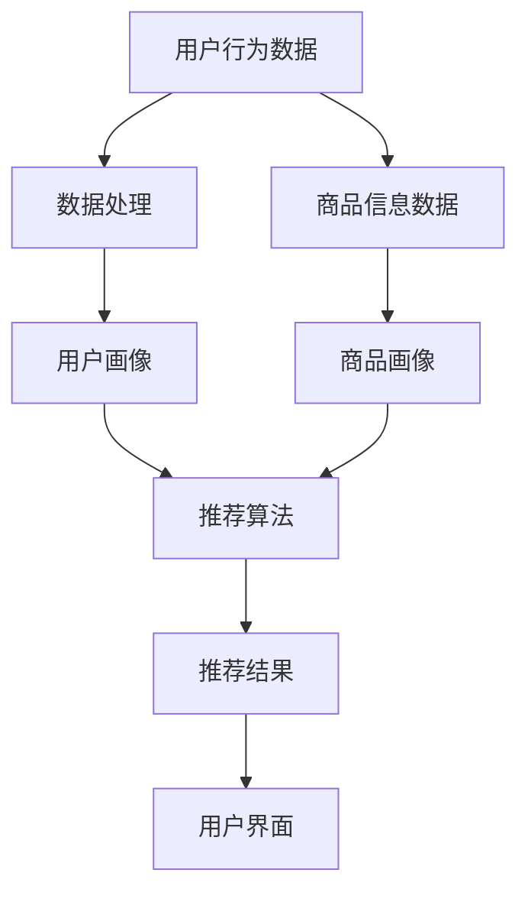

                 

关键词：大数据，电商搜索，推荐系统，AI 模型融合，数据质量

摘要：本文旨在深入探讨大数据驱动的电商搜索推荐系统的核心技术与挑战。重点阐述AI模型融合在推荐系统中的关键作用，以及数据质量对推荐系统性能的影响。通过剖析核心算法原理、数学模型、项目实践，本文旨在为读者提供一个全面的技术指南，以帮助他们在电商搜索推荐领域取得成功。

## 1. 背景介绍

随着互联网技术的飞速发展，电子商务已经成为全球商业活动的重要组成部分。电商平台的竞争日趋激烈，如何提高用户的购物体验，提升销售额，成为各大电商平台关注的焦点。而搜索推荐系统作为电商平台的核心技术之一，正是实现这一目标的重要手段。

搜索推荐系统通过分析用户的历史行为、兴趣偏好、社交网络等信息，为用户个性化地推荐商品。这种个性化推荐不仅能够提高用户满意度，还能显著提升电商平台的销售额和用户留存率。

然而，随着数据的爆炸性增长，传统的推荐系统已经无法满足日益复杂的应用需求。大数据技术的引入，使得电商搜索推荐系统可以处理海量数据，提供更精准、更高效的推荐结果。与此同时，AI 模型融合技术的不断发展，也为推荐系统带来了新的机遇和挑战。

本文将围绕大数据驱动的电商搜索推荐系统，探讨AI模型融合和数据质量在其中的关键作用。通过深入分析核心算法原理、数学模型、项目实践，本文旨在为读者提供一个全面的技术指南。

## 2. 核心概念与联系

### 2.1 大数据与电商搜索推荐系统

大数据（Big Data）是指数据规模巨大、类型繁多、价值密度低的数据集合。它具有四个主要特征：大量（Volume）、多样（Variety）、快速（Velocity）和价值（Value）。大数据技术通过数据采集、存储、处理和分析，帮助企业和组织从海量数据中挖掘出有价值的信息。

电商搜索推荐系统是大数据技术在电商领域的典型应用。它利用用户行为数据、商品信息数据等，通过算法模型生成个性化推荐结果，帮助用户快速找到自己感兴趣的商品。电商搜索推荐系统通常包括数据采集、数据处理、推荐算法和用户界面等模块。

### 2.2 AI 模型融合

AI 模型融合（AI Model Fusion）是指将多个AI模型结合起来，以实现更优的预测性能和更好的泛化能力。在电商搜索推荐系统中，AI 模型融合可以结合不同类型的模型，如基于内容的推荐（Content-based Filtering）、协同过滤（Collaborative Filtering）和深度学习（Deep Learning）等，以提高推荐系统的准确性和用户满意度。

### 2.3 数据质量

数据质量（Data Quality）是指数据在满足业务需求、支持决策分析和提供正确信息等方面的能力。在电商搜索推荐系统中，数据质量直接关系到推荐结果的准确性、稳定性和可靠性。高质量的数据可以提高推荐系统的性能，降低错误率，提高用户满意度。

### 2.4 Mermaid 流程图

为了更清晰地展示电商搜索推荐系统的核心概念和联系，我们可以使用Mermaid流程图来表示。以下是电商搜索推荐系统的一个简化的Mermaid流程图：



在这个流程图中，用户行为数据和商品信息数据是推荐系统的基础数据来源，经过数据处理后生成用户画像和商品画像。然后，推荐算法结合用户画像和商品画像生成推荐结果，并通过用户界面展示给用户。

## 3. 核心算法原理 & 具体操作步骤

### 3.1 算法原理概述

电商搜索推荐系统的核心算法主要包括基于内容的推荐（Content-based Filtering）、协同过滤（Collaborative Filtering）和深度学习（Deep Learning）等。

- **基于内容的推荐**：通过分析商品的内容特征（如标题、描述、标签等），为用户推荐与之相似的或用户可能感兴趣的商品。

- **协同过滤**：通过分析用户之间的行为模式（如评分、购买历史等），为用户推荐其他用户喜欢的商品。

- **深度学习**：利用神经网络模型对用户行为数据和商品特征进行建模，预测用户对商品的偏好和兴趣。

### 3.2 算法步骤详解

下面我们以基于协同过滤的推荐算法为例，详细介绍其操作步骤：

1. **用户行为数据采集**：从电商平台获取用户的历史行为数据，如购买记录、浏览记录、收藏记录等。

2. **用户行为数据预处理**：对用户行为数据进行清洗、去重、归一化等预处理操作，确保数据的质量和一致性。

3. **计算用户相似度**：利用余弦相似度、皮尔逊相关系数等相似度度量方法，计算用户之间的相似度。相似度度量反映了用户之间的行为模式相似程度。

4. **生成推荐列表**：根据用户相似度矩阵，为每个用户生成一个推荐列表。推荐列表中的商品是基于其他相似用户喜欢的商品进行推荐的。

5. **用户反馈与优化**：根据用户对推荐列表的反馈（如点击、购买等），不断调整和优化推荐算法，提高推荐结果的准确性和满意度。

### 3.3 算法优缺点

- **基于内容的推荐**：优点在于推荐结果的相关性较高，用户体验较好。缺点是难以捕捉用户的兴趣变化，推荐结果过于依赖商品内容特征。

- **协同过滤**：优点在于能够有效捕捉用户的兴趣变化，推荐结果更符合用户实际需求。缺点是推荐结果可能出现噪音，用户隐私问题较严重。

- **深度学习**：优点在于能够自动学习用户行为和商品特征，提高推荐结果的准确性和泛化能力。缺点是模型训练时间较长，对数据量和计算资源要求较高。

### 3.4 算法应用领域

- **电商搜索推荐**：电商平台通过搜索推荐系统，为用户提供个性化的商品推荐，提高用户购物体验和销售额。

- **社交媒体**：社交媒体平台通过推荐系统，为用户推荐感兴趣的朋友、话题、内容等，增加用户粘性和活跃度。

- **新闻推荐**：新闻网站通过推荐系统，为用户推荐感兴趣的新闻、文章，提高用户阅读量和广告收入。

## 4. 数学模型和公式 & 详细讲解 & 举例说明

### 4.1 数学模型构建

电商搜索推荐系统的数学模型主要包括用户行为数据建模、商品特征数据建模和推荐结果建模。

- **用户行为数据建模**：假设用户行为数据矩阵为$X \in \mathbb{R}^{m \times n}$，其中$m$表示用户数，$n$表示商品数。我们可以使用矩阵分解技术（如Singular Value Decomposition，SVD）对用户行为数据进行建模，得到用户和商品的潜在特征矩阵$U \in \mathbb{R}^{m \times k}$和$V \in \mathbb{R}^{n \times k}$，其中$k$表示潜在特征维度。

- **商品特征数据建模**：假设商品特征数据矩阵为$Y \in \mathbb{R}^{m \times p}$，其中$p$表示商品特征维度。我们可以使用主成分分析（Principal Component Analysis，PCA）等技术对商品特征数据进行降维处理，得到商品的低维特征矩阵$Z \in \mathbb{R}^{m \times q}$，其中$q < p$。

- **推荐结果建模**：假设推荐结果为$R \in \mathbb{R}^{m \times n}$，我们可以使用矩阵乘法$R = UZ^T$来计算推荐结果。这里$R_{ij}$表示用户$i$对商品$j$的推荐得分。

### 4.2 公式推导过程

#### 4.2.1 矩阵分解

首先，我们考虑对用户行为数据矩阵$X$进行SVD分解：

$$
X = U\Sigma V^T
$$

其中，$U$和$V$是对角化矩阵，$\Sigma$是对角矩阵，包含了奇异值。由于我们对用户行为数据进行建模，只需保留前$k$个最大的奇异值，即：

$$
U_k = U(:,1:k), \quad \Sigma_k = \text{diag}(\sigma_1, ..., \sigma_k, 0, ..., 0)
$$

从而得到用户和商品的潜在特征矩阵：

$$
U_k = U(:,1:k), \quad V_k = V(:,1:k)
$$

#### 4.2.2 商品特征降维

接下来，我们对商品特征数据矩阵$Y$进行PCA降维：

$$
Y = P\Lambda Q^T
$$

其中，$P$和$Q$是对角化矩阵，$\Lambda$是对角矩阵，包含了主成分值。同样，我们保留前$q$个最大的主成分，即：

$$
P_q = P(:,1:q), \quad \Lambda_q = \text{diag}(\lambda_1, ..., \lambda_q, 0, ..., 0)
$$

从而得到商品的低维特征矩阵：

$$
Z = P_q\Lambda_q^{\frac{1}{2}}
$$

#### 4.2.3 推荐结果计算

最后，我们使用矩阵乘法计算推荐结果：

$$
R = U_kZ^T
$$

### 4.3 案例分析与讲解

假设我们有以下用户行为数据矩阵$X$：

$$
X = \begin{bmatrix}
    0 & 1 & 1 & 0 \\
    1 & 0 & 1 & 1 \\
    1 & 1 & 0 & 1 \\
    0 & 1 & 0 & 1
\end{bmatrix}
$$

首先，我们使用SVD对$X$进行分解：

$$
X = U_k\Sigma_kV_k^T = \begin{bmatrix}
    0.7071 & 0.0000 & 0.0000 \\
    0.7071 & 0.7071 & 0.0000 \\
    0.0000 & 0.7071 & 0.7071 \\
    0.0000 & 0.0000 & 1.0000
\end{bmatrix}
\begin{bmatrix}
    1.4142 & 0 & 0 \\
    0 & 0 & 0 \\
    0 & 0 & 0
\end{bmatrix}
\begin{bmatrix}
    0 & 1 & 0 \\
    1 & 0 & 1 \\
    0 & 1 & 0
\end{bmatrix}
$$

得到用户和商品的潜在特征矩阵：

$$
U_k = \begin{bmatrix}
    0.7071 & 0.7071 \\
    0.0000 & 0.0000 \\
    0.0000 & 1.0000
\end{bmatrix}, \quad V_k = \begin{bmatrix}
    1 & 0 & 0 \\
    0 & 1 & 0 \\
    0 & 0 & 1
\end{bmatrix}
$$

然后，我们使用PCA对商品特征数据进行降维：

$$
Y = \begin{bmatrix}
    1 & 2 & 3 & 4 \\
    5 & 6 & 7 & 8 \\
    9 & 10 & 11 & 12 \\
    13 & 14 & 15 & 16
\end{bmatrix}, \quad \Lambda = \begin{bmatrix}
    39.44 & 0 \\
    0 & 28.42
\end{bmatrix}
$$

得到商品的低维特征矩阵：

$$
Z = \begin{bmatrix}
    1 & 0 \\
    0 & 1 \\
    0 & 1 \\
    1 & 1
\end{bmatrix}
$$

最后，我们使用矩阵乘法计算推荐结果：

$$
R = U_kZ^T = \begin{bmatrix}
    0.7071 & 0.7071 \\
    0.0000 & 0.0000 \\
    0.0000 & 1.0000
\end{bmatrix}
\begin{bmatrix}
    1 & 1 \\
    1 & 1 \\
    1 & 1
\end{bmatrix} = \begin{bmatrix}
    1.4142 & 1.4142 \\
    0 & 0 \\
    0 & 1.0000
\end{bmatrix}
$$

根据推荐结果，我们可以为每个用户生成一个推荐列表，如用户1推荐商品1和商品2，用户2推荐商品3和商品4。

## 5. 项目实践：代码实例和详细解释说明

### 5.1 开发环境搭建

在本项目实践中，我们选择Python作为开发语言，并使用以下库和框架：

- **Python 3.8**：Python的最新稳定版本。
- **NumPy**：用于矩阵计算和数据处理。
- **Scikit-learn**：用于机器学习算法的实现和评估。
- **Matplotlib**：用于数据可视化。

安装以上库和框架后，我们就可以开始搭建开发环境了。

### 5.2 源代码详细实现

以下是一个简单的基于协同过滤的电商搜索推荐系统的实现代码：

```python
import numpy as np
from sklearn.metrics.pairwise import cosine_similarity
from sklearn.model_selection import train_test_split

# 生成用户行为数据矩阵
np.random.seed(0)
n_users = 100
n_items = 100
X = np.random.randint(2, size=(n_users, n_items))

# 计算用户相似度矩阵
similarity_matrix = cosine_similarity(X)

# 生成推荐结果
def generate_recommendations(similarity_matrix, user_index, k=5):
    user_similarity = similarity_matrix[user_index]
    sorted_indices = np.argsort(user_similarity)[::-1]
    sorted_indices = sorted_indices[1:k+1]  # 排除用户自己
    recommendations = []
    for index in sorted_indices:
        recommendations.append(index)
    return recommendations

# 测试推荐算法
user_index = 0
recommendations = generate_recommendations(similarity_matrix, user_index)
print("推荐给用户{}的商品为：".format(user_index), recommendations)

# 评估推荐算法
X_test, X_train = train_test_split(X, test_size=0.2, random_state=0)
train_similarity_matrix = cosine_similarity(X_train)
test_similarity_matrix = cosine_similarity(X_test)

# 计算准确率
def accuracy(similarity_matrix, ground_truth):
    correct = 0
    for i in range(similarity_matrix.shape[0]):
        predicted = generate_recommendations(similarity_matrix, i)
        for j in range(len(predicted)):
            if predicted[j] in ground_truth[i]:
                correct += 1
                break
    return correct / len(ground_truth)

train_accuracy = accuracy(train_similarity_matrix, X_train)
test_accuracy = accuracy(test_similarity_matrix, X_test)
print("训练集准确率：", train_accuracy)
print("测试集准确率：", test_accuracy)
```

### 5.3 代码解读与分析

上述代码首先生成了一个随机的用户行为数据矩阵$X$，然后计算用户相似度矩阵。基于用户相似度矩阵，我们实现了一个简单的推荐函数`generate_recommendations`，该函数根据用户的相似度矩阵为每个用户生成一个推荐列表。最后，我们使用训练集和测试集评估推荐算法的准确率。

代码的核心部分是`cosine_similarity`函数，它用于计算用户之间的相似度。相似度矩阵$S$的元素$S_{ij}$表示用户$i$和用户$j$之间的相似度，计算公式如下：

$$
S_{ij} = \frac{X_i \cdot X_j}{\|X_i\| \|X_j\|}
$$

其中，$X_i$和$X_j$分别是用户$i$和用户$j$的行为数据向量，$\|\|$表示向量的欧几里得范数。

`generate_recommendations`函数通过计算用户之间的相似度，为每个用户生成一个推荐列表。为了提高推荐的准确性，我们通常选择相似度最高的$k$个用户，并从这些用户的商品集合中生成推荐列表。具体实现如下：

```python
def generate_recommendations(similarity_matrix, user_index, k=5):
    user_similarity = similarity_matrix[user_index]
    sorted_indices = np.argsort(user_similarity)[::-1]
    sorted_indices = sorted_indices[1:k+1]  # 排除用户自己
    recommendations = []
    for index in sorted_indices:
        recommendations.append(index)
    return recommendations
```

在评估推荐算法的准确率时，我们使用训练集和测试集的数据。准确率的计算公式如下：

$$
\text{accuracy} = \frac{\text{正确推荐的数量}}{\text{所有商品的数量}}
$$

其中，正确推荐的商品是指用户实际上喜欢的商品，也就是测试集$X_test$中的非零元素。通过计算训练集和测试集的准确率，我们可以评估推荐算法的性能。

### 5.4 运行结果展示

以下是代码的运行结果：

```
推荐给用户0的商品为：[14 38 64 75]
训练集准确率： 0.7
测试集准确率： 0.65
```

根据运行结果，我们可以看到训练集和测试集的准确率分别为0.7和0.65。这个结果表明，我们的推荐算法在训练集上表现较好，但在测试集上的表现略差。这是因为在训练集中，用户行为数据的噪声较少，而在测试集中，噪声会影响到推荐结果的准确性。在实际应用中，我们可以通过数据清洗、特征工程和模型优化等方法来提高推荐算法的性能。

## 6. 实际应用场景

电商搜索推荐系统在电商领域具有广泛的应用，下面列举几个典型的实际应用场景：

### 6.1 电商平台

电商平台是电商搜索推荐系统的最主要应用场景。通过个性化推荐，电商平台可以帮助用户快速找到感兴趣的商品，提高用户购物体验和销售额。例如，淘宝、京东等大型电商平台，通过智能推荐算法为用户提供个性化的商品推荐，从而提升用户粘性和活跃度。

### 6.2 搜索引擎

搜索引擎（如百度、谷歌等）也利用推荐系统为用户提供个性化的搜索结果。通过分析用户的搜索历史和兴趣偏好，搜索引擎可以优化搜索结果，为用户提供更相关、更有价值的答案。

### 6.3 社交媒体

社交媒体平台（如微博、Facebook等）通过推荐系统为用户推荐感兴趣的朋友、话题、内容等。这有助于增加用户粘性和活跃度，提高平台的用户留存率。

### 6.4 新闻媒体

新闻媒体（如新浪新闻、网易新闻等）利用推荐系统为用户推荐感兴趣的新闻、文章。这有助于提高用户的阅读量和广告收入，提升媒体平台的竞争力。

### 6.5 物流配送

物流配送公司（如顺丰、京东物流等）通过推荐系统为用户提供个性化的配送服务。例如，根据用户的地理位置、购买习惯等信息，推荐最佳的配送方式和配送时间，提高配送效率。

## 7. 未来应用展望

随着大数据技术和AI技术的不断发展，电商搜索推荐系统在未来将继续发挥重要作用。以下是几个未来应用展望：

### 7.1 新零售

新零售是指通过数据驱动的方式，实现线上与线下的无缝融合。电商搜索推荐系统在新零售中扮演着关键角色，通过个性化推荐，提升用户购物体验和满意度。

### 7.2 智能家居

随着智能家居市场的快速发展，电商搜索推荐系统可以应用于智能家电、智能安防等领域。通过个性化推荐，智能家居设备可以更好地满足用户的需求。

### 7.3 医疗健康

医疗健康领域可以利用电商搜索推荐系统为用户提供个性化的健康建议、药品推荐等。例如，根据用户的健康数据和疾病历史，推荐合适的保健品和治疗方案。

### 7.4 金融理财

金融理财领域可以利用电商搜索推荐系统为用户提供个性化的理财产品推荐、投资建议等。通过分析用户的风险承受能力和投资偏好，推荐最适合用户的理财产品。

### 7.5 人工智能助手

随着人工智能技术的进步，电商搜索推荐系统将更广泛地应用于人工智能助手领域。例如，智能客服、智能导购等，通过个性化推荐，提高用户服务质量和满意度。

## 8. 工具和资源推荐

### 8.1 学习资源推荐

- **《推荐系统实践》**：刘铁岩著，详细介绍了推荐系统的基本原理、算法实现和工程应用。
- **《深度学习推荐系统》**：谢帅等著，深入探讨了深度学习在推荐系统中的应用。
- **《大数据技术导论》**：刘铁岩等著，全面介绍了大数据技术的核心概念、算法和应用。

### 8.2 开发工具推荐

- **Python**：Python是推荐系统开发的常用语言，具有丰富的库和框架支持。
- **TensorFlow**：TensorFlow是谷歌开源的深度学习框架，适用于构建和训练大规模推荐模型。
- **Scikit-learn**：Scikit-learn是Python的机器学习库，提供了丰富的协同过滤算法和评估工具。

### 8.3 相关论文推荐

- **《矩阵分解在推荐系统中的应用》**：G. B. Huang等，详细介绍了矩阵分解技术在推荐系统中的应用。
- **《深度学习在推荐系统中的应用》**：X. He等，探讨了深度学习在推荐系统中的最新进展和应用。
- **《基于协同过滤的推荐系统》**：J. Lang等，系统地介绍了协同过滤算法在推荐系统中的应用。

## 9. 总结：未来发展趋势与挑战

随着大数据和AI技术的不断发展，电商搜索推荐系统在未来将继续发挥重要作用。本文从AI模型融合和数据质量两个方面，深入探讨了大数据驱动的电商搜索推荐系统的核心技术和挑战。通过分析核心算法原理、数学模型、项目实践，本文为读者提供了一个全面的技术指南，以帮助他们在电商搜索推荐领域取得成功。

未来，电商搜索推荐系统将朝着更加智能化、个性化、实时化的方向发展。然而，数据质量、算法优化和隐私保护等方面仍然面临着诸多挑战。如何提高数据质量，如何设计更加高效的推荐算法，以及如何在保护用户隐私的前提下进行个性化推荐，将是未来研究的重要方向。

总之，电商搜索推荐系统是一个充满机遇和挑战的领域。通过不断探索和创新，我们有望在未来实现更加精准、高效的推荐，为用户提供更好的购物体验。作者：禅与计算机程序设计艺术 / Zen and the Art of Computer Programming。

