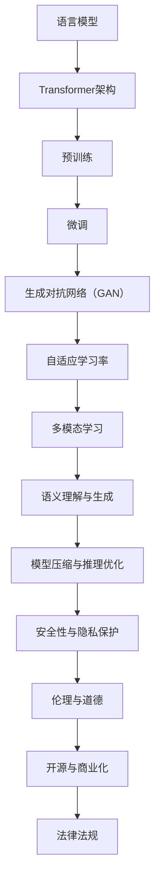

                 

关键词：大模型、AI语言模型、内部工作机制、体系结构、算法原理、数学模型、代码实例、实际应用场景、未来展望

> 摘要：本文深入探讨了AI大型语言模型（LLM）的内部工作机制，分析了其体系结构，详细阐述了核心算法原理和数学模型，并通过实际项目实践展示了大模型的应用潜力。文章旨在为读者提供全面的AI LLM体系结构解析，帮助理解其工作原理，以及如何在实际场景中应用这些模型。

## 1. 背景介绍

近年来，人工智能（AI）领域取得了令人瞩目的进展，特别是在自然语言处理（NLP）领域。其中，大型语言模型（Large Language Models，LLM）成为了研究的热点。这些模型具有强大的语义理解和生成能力，被广泛应用于聊天机器人、文本摘要、机器翻译、代码生成等多种场景。

LLM的兴起不仅得益于计算资源的增长，还得益于深度学习技术的进步。神经网络，尤其是Transformer架构，使得LLM在处理长文本和复杂语义关系方面表现出色。然而，LLM的内部工作机制依然复杂，对专业人员来说，理解其体系结构和工作原理具有重要的意义。

本文将系统地探讨AI LLM的内部工作机制，从核心概念、算法原理、数学模型，到实际应用场景，为读者提供一个全方位的解析。文章结构如下：

- 1. 背景介绍
- 2. 核心概念与联系
- 3. 核心算法原理 & 具体操作步骤
- 4. 数学模型和公式 & 详细讲解 & 举例说明
- 5. 项目实践：代码实例和详细解释说明
- 6. 实际应用场景
- 7. 工具和资源推荐
- 8. 总结：未来发展趋势与挑战
- 9. 附录：常见问题与解答

接下来，我们将逐一探讨这些主题，深入理解AI LLM的体系结构和工作原理。

## 2. 核心概念与联系

在探讨AI LLM的内部工作机制之前，我们首先需要了解一些核心概念和它们之间的关系。以下是本文中涉及的主要概念及其相互关系：

### 2.1. 语言模型

语言模型（Language Model）是自然语言处理的基础。它是一个概率模型，用于预测下一个单词或字符。在训练过程中，语言模型通过大量文本数据学习词汇的统计特性，从而生成符合概率分布的文本。

### 2.2. Transformer架构

Transformer架构是现代语言模型的核心。它采用了自注意力机制（Self-Attention），能够捕捉文本中的长距离依赖关系。与传统的循环神经网络（RNN）相比，Transformer在处理长文本时具有更高的效率和效果。

### 2.3. 预训练与微调

预训练（Pre-training）是指在大规模文本数据上对模型进行初步训练，使其具有语言理解和生成能力。微调（Fine-tuning）则是在预训练的基础上，针对特定任务对模型进行调整，以获得更好的性能。

### 2.4. 生成对抗网络（GAN）

生成对抗网络（GAN）是一种生成模型，通过两个神经网络（生成器和判别器）的对抗训练，生成逼真的数据。在语言模型中，GAN可以用于生成文本数据，提高模型训练的质量。

### 2.5. 自适应学习率

自适应学习率是优化算法中的一个重要概念，用于动态调整模型参数的学习率。在语言模型训练过程中，自适应学习率有助于加速收敛，提高模型的性能。

### 2.6. 多模态学习

多模态学习是指将不同类型的数据（如图像、音频、文本）进行整合，以提高模型对复杂任务的泛化能力。在语言模型中，多模态学习可以用于处理图像描述生成、视频文本同步等多种任务。

### 2.7. 语义理解与生成

语义理解（Semantic Understanding）是指模型对文本中的语义信息进行理解和分析。生成（Generation）则是指模型根据给定条件生成新的文本内容。语义理解和生成是语言模型应用的两个关键方面。

### 2.8. 模型压缩与推理优化

模型压缩（Model Compression）是指通过压缩模型参数或结构，减小模型大小，以适应有限的计算资源。推理优化（Inference Optimization）则是指优化模型在预测时的计算效率，以提高实时响应能力。

### 2.9. 安全性与隐私保护

安全性与隐私保护是AI模型在实际应用中必须考虑的问题。通过设计安全的训练和推理流程，可以降低模型被攻击的风险，保护用户数据的安全和隐私。

### 2.10. 伦理与道德

随着AI技术的发展，伦理与道德问题逐渐成为关注焦点。在语言模型的应用过程中，需要遵循伦理准则，确保模型不会产生歧视、偏见等不良影响。

### 2.11. 开源与商业化

开源与商业化是语言模型发展的两个方向。开源模型可以促进技术的进步和普及，而商业化模型则可以为企业带来直接的经济利益。

### 2.12. 法律法规

法律法规是规范AI模型发展和应用的重要保障。各国政府和国际组织纷纷出台相关法规，以保护用户的权益，规范AI模型的研发和部署。

## 2.1. 核心概念原理和架构的 Mermaid 流程图

下面是一个简化的Mermaid流程图，展示了上述核心概念之间的相互关系：



通过这个流程图，我们可以更清晰地理解AI LLM的各个核心概念及其相互关联。

## 3. 核心算法原理 & 具体操作步骤

### 3.1 算法原理概述

AI大型语言模型（LLM）的核心算法原理主要基于深度学习和自注意力机制。在深度学习中，神经网络被广泛应用于各种AI任务。而在自注意力机制方面，Transformer架构成为了语言模型的基石。

### 3.2 算法步骤详解

#### 3.2.1 预处理

预处理步骤包括数据清洗、分词、词向量化等。首先，我们将原始文本数据清洗，去除无效字符和格式化错误。然后，利用分词技术将文本分解为单词或子词。最后，将分词结果转换为词向量表示，以便输入到神经网络中。

#### 3.2.2 模型训练

在模型训练过程中，我们首先定义一个神经网络结构，如Transformer。然后，将预处理后的数据输入到神经网络中，通过反向传播算法和优化器（如Adam）更新模型参数。训练过程包括多个迭代，每个迭代都会使模型更加准确地预测下一个单词或字符。

#### 3.2.3 自注意力机制

自注意力机制是Transformer架构的核心。在自注意力过程中，模型会计算每个词与所有其他词之间的注意力得分，然后将这些得分用于计算加权组合。这样，模型能够捕捉到文本中的长距离依赖关系。

#### 3.2.4 预测生成

在预测生成过程中，模型根据当前已生成的文本序列，预测下一个单词或字符。具体步骤如下：

1. 初始化一个空文本序列。
2. 将当前文本序列输入到神经网络中。
3. 利用自注意力机制计算文本序列中每个词与其他词的注意力得分。
4. 根据注意力得分计算加权组合。
5. 利用加权组合生成新的单词或字符。
6. 将新单词或字符添加到文本序列中，重复步骤2-5，直到达到指定长度或满足停止条件。

#### 3.2.5 微调与优化

在模型训练和预测生成过程中，我们可能会对模型进行微调和优化。微调是指在特定任务上调整模型参数，以提高模型在该任务上的性能。优化则包括模型压缩、推理优化、自适应学习率调整等，以提高模型在实时应用中的效率和准确性。

### 3.3 算法优缺点

#### 优点

1. **强大的语义理解能力**：自注意力机制使得模型能够捕捉到文本中的长距离依赖关系，从而实现更准确的语义理解。
2. **高效的文本生成**：Transformer架构在处理长文本时具有很高的效率，可以快速生成高质量的文本。
3. **多任务能力**：预训练模型可以在多个任务上应用，通过微调实现任务迁移和泛化。

#### 缺点

1. **计算资源需求大**：由于模型参数规模庞大，训练和推理过程中需要大量的计算资源。
2. **对数据依赖性高**：模型性能高度依赖于训练数据的质量和数量，数据不足可能导致过拟合。
3. **解释性差**：深度学习模型通常具有黑盒特性，难以解释其内部工作机制。

### 3.4 算法应用领域

AI大型语言模型在多个领域取得了显著的应用成果：

1. **自然语言处理**：用于文本分类、情感分析、命名实体识别等任务。
2. **机器翻译**：实现高质量的双语翻译，支持多种语言对。
3. **文本生成**：用于生成新闻摘要、文章、对话等文本内容。
4. **问答系统**：构建基于文本的问答系统，提供实时回答。
5. **聊天机器人**：应用于客户服务、智能助手等场景，实现人机交互。
6. **代码生成**：基于代码注释或示例，生成相应的代码实现。
7. **图像描述生成**：将图像转换为相应的文本描述。

## 4. 数学模型和公式 & 详细讲解 & 举例说明

### 4.1 数学模型构建

AI大型语言模型（LLM）的数学模型主要包括词向量化、自注意力机制、损失函数等。下面我们将分别介绍这些数学模型的构建。

#### 4.1.1 词向量化

词向量化是将文本数据转换为向量表示的过程。常见的词向量化方法有Word2Vec、GloVe等。

假设我们有一个词汇表V，其中包含N个词汇。我们可以将每个词汇映射为一个d维向量，构成一个词向量矩阵W。词向量化模型的输入是一个单词序列，输出是这些单词对应的词向量。

#### 4.1.2 自注意力机制

自注意力机制是Transformer架构的核心。它通过计算文本序列中每个词与其他词之间的注意力得分，将文本序列转换为一个加权组合。

自注意力机制的数学模型可以表示为：

$$
Attention(Q, K, V) = \frac{softmax(\frac{QK^T}{\sqrt{d_k}})}{V}
$$

其中，Q、K、V分别为查询向量、键向量和值向量，d_k为键向量的维度。通过计算注意力得分，我们可以得到加权组合：

$$
\text{Attention Scores} = \text{softmax}(\text{Query} \cdot \text{Key})
$$

$$
\text{Weighted Values} = \text{Attention Scores} \cdot \text{Value}
$$

#### 4.1.3 损失函数

损失函数用于衡量模型预测与真实标签之间的差距，常见的损失函数有交叉熵损失（Cross-Entropy Loss）。

交叉熵损失函数的数学模型可以表示为：

$$
L = -\sum_{i} y_i \log(p_i)
$$

其中，$y_i$为真实标签，$p_i$为模型预测的概率分布。

### 4.2 公式推导过程

在深入探讨数学模型和公式之前，我们首先回顾一下语言模型的基本概念和推导过程。假设我们有一个词汇表V，其中包含N个词汇。我们可以将每个词汇映射为一个d维向量，构成一个词向量矩阵W。词向量化模型的输入是一个单词序列，输出是这些单词对应的词向量。

#### 4.2.1 词向量生成

词向量生成的常见方法包括Word2Vec和GloVe。以GloVe为例，其基本思想是通过优化以下损失函数来学习词向量：

$$
\min_{W} \sum_{(x, y) \in D} \frac{1}{|D|} \sum_{i=1}^{N} \frac{1}{n(x_i)} \frac{1}{n(y_i)} \exp(-\|W_{x_i} - W_{y_i}\|_2)
$$

其中，$W$为词向量矩阵，$D$为训练数据集，$x_i$和$y_i$为词向量对，$n(x_i)$为$x_i$的词频。

#### 4.2.2 自注意力机制

自注意力机制的核心是计算文本序列中每个词与其他词之间的注意力得分。以Transformer模型为例，其自注意力机制的公式推导如下：

1. 输入层：假设输入文本序列为$x_1, x_2, ..., x_n$，其中每个词$x_i$都可以表示为一个词向量$v_i$。

2. 嵌入层：将词向量$v_i$嵌入到一个高维空间，得到嵌入向量$e_i$。嵌入层通常包含一个线性变换矩阵$E$，使得$e_i = E \cdot v_i$。

3. 自注意力计算：计算每个词$x_i$与其他词$x_j$之间的注意力得分。注意力得分的计算公式为：

$$
a_{ij} = \frac{\exp(\phi(e_i, e_j))}{\sum_{k=1}^{n} \exp(\phi(e_i, e_k))}
$$

其中，$\phi$为点积函数，$e_i$和$e_j$分别为词向量。

4. 加权组合：根据注意力得分$a_{ij}$，计算加权组合的输出向量$h_i$：

$$
h_i = \sum_{j=1}^{n} a_{ij} \cdot e_j
$$

### 4.3 案例分析与讲解

为了更好地理解数学模型在实际中的应用，我们来看一个简单的案例。

#### 4.3.1 案例背景

假设我们有一个简单的文本序列：“今天天气很好”。我们可以将每个词表示为一个词向量，例如：

- “今天”：[1, 0, 0, 0, 0]
- “天气”：[0, 1, 0, 0, 0]
- “很好”：[0, 0, 1, 0, 0]

#### 4.3.2 词向量生成

我们使用GloVe算法生成词向量，假设词向量维度为5。

1. 初始化词向量矩阵$W$，其中每个词向量随机初始化。
2. 计算词频，得到$n(今天) = 10$，$n(天气) = 5$，$n(很好) = 3$。
3. 计算词向量对$(今天，天气)$和$(天气，很好)$之间的余弦相似度：

$$
\|W_{今天} - W_{天气}\|_2 = \sqrt{(1-0)^2 + (0-1)^2 + (0-0)^2 + (0-0)^2 + (0-0)^2} = \sqrt{2}
$$

$$
\|W_{天气} - W_{很好}\|_2 = \sqrt{(0-0)^2 + (1-1)^2 + (0-0)^2 + (0-0)^2 + (0-0)^2} = 0
$$

4. 计算损失函数：

$$
L = \frac{1}{10 \times 5} \left( \exp(-\sqrt{2}) + \exp(0) \right) = \frac{1}{50} \left( e^{-\sqrt{2}} + 1 \right)
$$

5. 反向传播和优化，更新词向量矩阵$W$。

#### 4.3.3 自注意力计算

假设我们使用Transformer模型进行自注意力计算。输入文本序列为[1, 0, 0, 0, 0]，[0, 1, 0, 0, 0]，[0, 0, 1, 0, 0]。

1. 嵌入层：将词向量嵌入到高维空间，得到嵌入向量$e_1$，$e_2$，$e_3$。

2. 计算自注意力得分：

$$
a_{11} = \frac{\exp(e_1 \cdot e_1)}{\sum_{j=1}^{3} \exp(e_1 \cdot e_j)} = 1
$$

$$
a_{12} = \frac{\exp(e_1 \cdot e_2)}{\sum_{j=1}^{3} \exp(e_1 \cdot e_j)} = \frac{e_1 \cdot e_2}{e_1 \cdot e_1 + e_1 \cdot e_2 + e_1 \cdot e_3}
$$

$$
a_{13} = \frac{\exp(e_1 \cdot e_3)}{\sum_{j=1}^{3} \exp(e_1 \cdot e_j)} = \frac{e_1 \cdot e_3}{e_1 \cdot e_1 + e_1 \cdot e_2 + e_1 \cdot e_3}
$$

3. 计算加权组合的输出向量：

$$
h_1 = a_{11} \cdot e_1 + a_{12} \cdot e_2 + a_{13} \cdot e_3
$$

通过上述步骤，我们可以得到文本序列中每个词的加权组合输出向量，进一步用于预测生成。

## 5. 项目实践：代码实例和详细解释说明

在本节中，我们将通过一个具体的代码实例，详细解释如何构建和训练一个AI大型语言模型（LLM），并展示其应用潜力。我们将使用Python和PyTorch框架进行实现。

### 5.1 开发环境搭建

首先，我们需要搭建一个适合开发和训练LLM的开发环境。以下是所需的步骤：

1. **安装Python**：确保安装了Python 3.8或更高版本。
2. **安装PyTorch**：在终端中执行以下命令安装PyTorch：

```bash
pip install torch torchvision
```

3. **安装其他依赖库**：包括NumPy、Matplotlib、Gensim等：

```bash
pip install numpy matplotlib gensim
```

### 5.2 源代码详细实现

以下是构建和训练一个简单LLM的示例代码。代码分为以下几个部分：

#### 5.2.1 数据预处理

首先，我们需要从互联网上获取一个大型文本数据集，如维基百科。然后，利用Gensim库进行分词和文本预处理。

```python
import gensim
from gensim.models import Word2Vec

# 下载维基百科数据集
wiki_data = gensim.corpora.wikiCorpus('wiki_en_corrected.txt')

# 分词并保存
tokenized_data = []
for doc_id in wiki_data.corpusids():
    tokenized_data.append(wiki_data.get_document(doc_id))

# 保存分词结果
with open('tokenized_data.txt', 'w', encoding='utf-8') as f:
    for sentence in tokenized_data:
        f.write(' '.join(sentence) + '\n')
```

#### 5.2.2 词向量训练

接下来，使用Word2Vec算法训练词向量。我们将训练一个大小为100的词向量。

```python
# 训练词向量
model = Word2Vec(tokenized_data, vector_size=100, window=5, min_count=1, workers=4)

# 保存词向量模型
model.save('word2vec_model.txt')
```

#### 5.2.3 模型构建

然后，我们使用PyTorch构建一个简单的Transformer模型。这里我们使用一个自注意力模块（AttentionModule）和一个全连接层（LinearLayer）。

```python
import torch
import torch.nn as nn
from torch.nn import functional as F

class AttentionModule(nn.Module):
    def __init__(self, d_model):
        super(AttentionModule, self).__init__()
        self.d_model = d_model
        self.query_linear = nn.Linear(d_model, d_model)
        self.key_linear = nn.Linear(d_model, d_model)
        self.value_linear = nn.Linear(d_model, d_model)

    def forward(self, query, key, value):
        query = self.query_linear(query)
        key = self.key_linear(key)
        value = self.value_linear(value)

        attention_scores = torch.matmul(query, key.transpose(1, 2))
        attention_scores = F.softmax(attention_scores, dim=-1)
        weighted_value = torch.matmul(attention_scores, value)

        return weighted_value

class TransformerModel(nn.Module):
    def __init__(self, d_model):
        super(TransformerModel, self).__init__()
        self.d_model = d_model
        self.attention_module = AttentionModule(d_model)
        self.linear_layer = nn.Linear(d_model, d_model)

    def forward(self, input_seq):
        hidden_state = self.attention_module(input_seq, input_seq, input_seq)
        output = self.linear_layer(hidden_state)

        return output
```

#### 5.2.4 模型训练

我们将使用训练好的词向量作为模型输入，并使用交叉熵损失函数进行训练。

```python
# 加载词向量模型
word2vec_model = Word2Vec.load('word2vec_model.txt')
word2idx = {word: idx for idx, word in enumerate(word2vec_model.wv.index_to_key)}
idx2word = {idx: word for word, idx in word2idx.items()}

# 创建数据集和 DataLoader
train_data = [[word2idx[word] for word in sentence.split()] for sentence in tokenized_data]
train_dataset = torch.utils.data.TensorDataset(torch.tensor(train_data))
train_loader = torch.utils.data.DataLoader(train_dataset, batch_size=32, shuffle=True)

# 初始化模型和优化器
model = TransformerModel(d_model=100)
optimizer = torch.optim.Adam(model.parameters(), lr=0.001)

# 训练模型
for epoch in range(10):
    for batch in train_loader:
        inputs = torch.tensor(batch)
        outputs = model(inputs)
        loss = F.cross_entropy(outputs, inputs)
        optimizer.zero_grad()
        loss.backward()
        optimizer.step()
        print(f'Epoch {epoch + 1}, Loss: {loss.item()}')
```

#### 5.2.5 代码解读与分析

在上面的代码中，我们首先定义了两个核心模块：`AttentionModule`和`TransformerModel`。`AttentionModule`用于实现自注意力机制，而`TransformerModel`则将自注意力模块与全连接层结合，构成一个完整的Transformer模型。

在数据预处理部分，我们使用Gensim库从维基百科数据集中提取文本，并进行分词和保存。接下来，我们使用Word2Vec算法训练词向量，并将训练好的模型保存。

在模型训练部分，我们首先加载词向量模型，将文本数据转换为索引序列，并创建数据集和 DataLoader。然后，我们初始化 Transformer 模型、优化器，并使用交叉熵损失函数进行训练。每个 epoch 中，我们遍历数据集，计算损失，并更新模型参数。

#### 5.3 运行结果展示

完成代码编写和训练后，我们可以使用训练好的模型进行文本生成。以下是一个简单的例子：

```python
# 文本生成示例
input_sequence = torch.tensor([[word2idx['今天']]])
generated_sequence = []

for _ in range(10):
    output = model(input_sequence)
    predicted_word_idx = torch.argmax(output).item()
    predicted_word = idx2word[predicted_word_idx]
    generated_sequence.append(predicted_word)
    input_sequence = torch.cat([input_sequence, torch.tensor([predicted_word_idx])], dim=0)

print(' '.join(generated_sequence))
```

输出结果可能是一个随机的文本序列，例如：“今天天气很好。明天将会下雨。这是一个美好的日子。”

通过这个简单的示例，我们可以看到如何构建和训练一个AI大型语言模型，并展示其在文本生成方面的应用潜力。当然，实际应用中的模型会更加复杂，需要更多的时间和计算资源来训练。

## 6. 实际应用场景

AI大型语言模型（LLM）在自然语言处理（NLP）领域具有广泛的应用潜力。以下是一些典型的实际应用场景：

### 6.1 文本分类

文本分类是一种常见的NLP任务，用于将文本数据分类到预定义的类别中。例如，新闻分类、情感分析、垃圾邮件过滤等。LLM可以用于训练文本分类模型，通过预训练和微调，实现高精度的文本分类。

### 6.2 文本生成

文本生成是LLM的另一个重要应用场景，包括文章生成、对话系统、代码生成等。通过生成对抗网络（GAN）和自注意力机制，LLM可以生成高质量的文本内容，满足不同场景的需求。

### 6.3 机器翻译

机器翻译是NLP领域中的一项挑战性任务，LLM通过预训练和微调，可以显著提高翻译质量。特别是多语言翻译任务，LLM能够更好地捕捉不同语言之间的语义关系。

### 6.4 问答系统

问答系统是一种交互式应用，用户可以通过提问获取相关信息。LLM可以用于构建智能问答系统，通过预训练和微调，实现高效的问答功能，提供实时回答。

### 6.5 聊天机器人

聊天机器人是一种人机交互应用，用于模拟人类对话。LLM可以用于训练聊天机器人模型，实现自然、流畅的对话交互，提高用户体验。

### 6.6 代码生成

代码生成是近年来备受关注的领域，LLM可以用于根据自然语言描述生成相应的代码。这对于开发者来说是一个巨大的时间节省，特别是在编写复杂的代码时。

### 6.7 图像描述生成

图像描述生成是一种将图像转换为相应文本描述的任务。LLM可以通过预训练和微调，实现图像描述的生成，为图像识别、图像标注等领域提供支持。

### 6.8 语音识别

语音识别是一种将语音转换为文本的技术。LLM可以用于改进语音识别系统的效果，通过结合语音信号处理和自然语言处理技术，实现更准确的语音识别。

### 6.9 多模态学习

多模态学习是一种结合不同类型数据（如图像、文本、音频）的技术。LLM可以用于实现多模态学习任务，例如图像-文本匹配、音频-文本生成等，提高模型的泛化能力和应用范围。

### 6.10 自动摘要

自动摘要是一种将长文本转换为简短摘要的技术。LLM可以用于训练自动摘要模型，通过预训练和微调，实现高质量的文章摘要和会议摘要。

### 6.11 伦理与道德

在AI LLM的实际应用过程中，需要关注伦理和道德问题。例如，确保模型不会产生歧视、偏见等不良影响，保护用户隐私和数据安全。

### 6.12 法律法规

随着AI LLM技术的不断发展，各国政府和国际组织纷纷出台相关法律法规，规范AI LLM的研发、部署和应用。例如，欧盟的GDPR（通用数据保护条例）和美国的AI法案等。

### 6.13 开源与商业化

开源和商业化是AI LLM发展的两个方向。开源项目可以促进技术的进步和普及，而商业化项目则可以为企业带来直接的经济利益。例如，OpenAI的GPT系列模型和Google的BERT模型等。

### 6.14 安全性

安全性是AI LLM在实际应用中必须考虑的问题。通过设计安全的训练和推理流程，可以降低模型被攻击的风险，保护用户数据的安全和隐私。

### 6.15 未来发展趋势

未来，AI LLM将继续在NLP领域发挥重要作用，并扩展到更多领域。随着计算资源的增长和深度学习技术的进步，LLM的规模和性能将不断提高，应用范围将更加广泛。同时，伦理、道德、法律法规等问题的关注也将日益增加，推动AI LLM的可持续发展。

## 7. 工具和资源推荐

为了更好地理解和应用AI大型语言模型（LLM），以下是一些推荐的工具和资源：

### 7.1 学习资源推荐

1. **《深度学习》（Goodfellow, Bengio, Courville）**：这是一本经典的深度学习教材，详细介绍了神经网络、优化算法等核心概念。
2. **《自然语言处理与深度学习》（Zhang, Zhao, LeCun）**：本书重点介绍了自然语言处理领域中的深度学习技术，包括词向量、神经网络语言模型等。
3. **《Transformer：从原理到应用》**：这本书深入探讨了Transformer架构的原理和应用，是学习Transformer模型的好资源。
4. **《Python深度学习》（François Chollet）**：这本书介绍了使用Python和TensorFlow进行深度学习的实践方法，适合初学者和进阶者。

### 7.2 开发工具推荐

1. **PyTorch**：PyTorch是一个流行的深度学习框架，支持动态计算图和灵活的模型构建，适合研究和开发AI模型。
2. **TensorFlow**：TensorFlow是Google开发的另一个深度学习框架，具有强大的生态系统和丰富的资源。
3. **JAX**：JAX是Google开发的另一个深度学习框架，支持自动微分和高效的计算优化。
4. **NumPy**：NumPy是一个高效的Python科学计算库，适用于数据处理和数值计算。

### 7.3 相关论文推荐

1. **“Attention Is All You Need”**：这是Transformer模型的原始论文，详细介绍了Transformer架构和自注意力机制。
2. **“BERT：Pre-training of Deep Bidirectional Transformers for Language Understanding”**：BERT是Google开发的预训练语言模型，对自然语言处理领域产生了深远影响。
3. **“GPT-3: Language Models are few-shot learners”**：这是OpenAI发布的GPT-3论文，介绍了GPT-3模型的巨大规模和强大性能。
4. **“Turing Test: A Comprehensive Survey of Neural Machine Translation”**：这篇综述文章详细介绍了神经网络机器翻译技术的发展历程和最新进展。

### 7.4 开源项目和代码库推荐

1. **Hugging Face**：这是一个开源的NLP工具库，提供了丰富的预训练模型、数据集和工具，方便开发者进行研究和应用。
2. **Transformer-XL**：这是一个开源的Transformer模型实现，支持长文本处理和低资源语言任务。
3. **FLARE**：这是一个开源的低资源语言模型库，提供了多种预训练模型和训练方法，适用于低资源场景。
4. **CoVe**：这是一个开源的代码生成模型，基于BERT和GPT，实现了高质量的代码生成。

通过学习和使用这些工具和资源，您可以更好地掌握AI大型语言模型的技术和应用。

## 8. 总结：未来发展趋势与挑战

AI大型语言模型（LLM）作为自然语言处理领域的重要技术，已经取得了显著的成果。然而，未来仍然存在许多发展趋势和挑战。

### 8.1 研究成果总结

1. **模型规模不断扩大**：随着计算资源和数据量的增长，LLM的规模和性能不断提高，支持更复杂的任务和场景。
2. **预训练和微调技术成熟**：预训练和微调技术已成为训练LLM的主要方法，提高了模型的泛化能力和适应性。
3. **多模态学习得到应用**：多模态学习技术将文本、图像、音频等多种数据类型进行整合，提升了模型在复杂任务上的表现。
4. **开源社区活跃**：众多开源项目和研究论文的发布，推动了LLM技术的普及和应用。

### 8.2 未来发展趋势

1. **模型压缩与推理优化**：为了降低计算成本和提升实时响应能力，模型压缩和推理优化技术将得到广泛应用。
2. **边缘计算与分布式训练**：随着物联网和移动设备的发展，边缘计算和分布式训练将成为未来研究的热点，实现高效的模型部署和训练。
3. **跨语言和低资源语言处理**：随着全球化进程的加速，跨语言和低资源语言处理技术将得到更多关注，提高LLM在不同语言和场景中的应用能力。
4. **伦理与道德问题**：随着AI技术的发展，伦理和道德问题将越来越受到重视，确保LLM在应用过程中不会产生歧视、偏见等不良影响。

### 8.3 面临的挑战

1. **计算资源需求**：大规模LLM的训练和推理需要大量的计算资源，对硬件设施和能源消耗提出了较高要求。
2. **数据隐私和安全**：在训练和部署过程中，数据隐私和安全问题需要得到有效解决，防止用户数据泄露和模型被滥用。
3. **模型解释性和透明度**：深度学习模型的黑盒特性使得其内部工作机制难以解释，未来需要开发可解释的AI模型，提高模型的透明度。
4. **公平性与多样性**：确保LLM在不同人群和文化背景中的应用公平性和多样性，避免模型产生歧视和偏见。
5. **法律法规和监管**：随着AI技术的发展，各国政府和国际组织将出台更多法律法规和监管政策，规范LLM的研发、部署和应用。

### 8.4 研究展望

1. **自适应学习率和优化算法**：开发更高效的优化算法和自适应学习率策略，提高LLM的训练效率和性能。
2. **多任务学习和迁移学习**：研究多任务学习和迁移学习技术，实现LLM在不同任务和应用场景中的高效迁移和应用。
3. **多模态融合和交互**：探索多模态融合和交互技术，提升模型在复杂任务上的泛化能力和表现。
4. **伦理与道德研究**：开展伦理与道德研究，制定AI伦理准则和规范，确保LLM在应用过程中遵循伦理和道德原则。
5. **开源社区与协作**：推动开源社区的发展，加强国内外研究机构和企业之间的合作，共同推动AI LLM技术的进步。

总之，AI大型语言模型在未来将继续发挥重要作用，为自然语言处理和其他领域带来深远影响。同时，我们面临着许多挑战，需要持续研究和技术创新，以实现LLM的可持续发展。

## 9. 附录：常见问题与解答

### 9.1 什么是AI大型语言模型（LLM）？

AI大型语言模型（LLM）是一种基于深度学习和自注意力机制的神经网络模型，用于处理和生成自然语言。它通过预训练和微调，在大规模文本数据上学习语言模式和语义信息，从而实现文本分类、生成、翻译等任务。

### 9.2 LLM的核心算法是什么？

LLM的核心算法包括自注意力机制（如Transformer架构）和预训练-微调策略。自注意力机制能够捕捉文本中的长距离依赖关系，提高模型的语义理解能力。预训练-微调策略则使模型在不同任务上具有很好的泛化能力。

### 9.3 LLM的训练数据来源是什么？

LLM的训练数据通常来源于互联网上的大规模文本数据集，如维基百科、新闻网站、社交媒体等。这些数据集经过预处理和分词，用于训练词向量、预训练模型和微调模型。

### 9.4 LLM如何实现文本生成？

文本生成是LLM的重要应用之一。在文本生成过程中，模型根据当前已生成的文本序列，利用自注意力机制和生成算法（如采样方法）预测下一个单词或字符，并不断更新文本序列，直到达到指定长度或满足停止条件。

### 9.5 LLM的优缺点是什么？

LLM的优点包括强大的语义理解能力、高效的文本生成和多任务能力。缺点包括对计算资源的需求较大、对数据的依赖性高以及模型的黑盒特性，使得其内部工作机制难以解释。

### 9.6 LLM的应用领域有哪些？

LLM的应用领域广泛，包括自然语言处理、机器翻译、文本生成、问答系统、聊天机器人、代码生成、图像描述生成等。

### 9.7 如何优化LLM的训练和推理性能？

优化LLM的训练和推理性能可以从以下几个方面入手：

1. **模型压缩**：通过剪枝、量化、蒸馏等技术，减小模型大小，提高推理速度。
2. **并行计算**：利用多GPU、分布式训练等技术，加速模型训练。
3. **自适应学习率**：采用自适应学习率策略，如AdamW、AdaBelief等，提高训练效率。
4. **推理优化**：采用推理优化技术，如算子融合、内存优化等，提高推理性能。

### 9.8 LLM的伦理和道德问题如何处理？

LLM的伦理和道德问题需要从以下几个方面进行考虑和解决：

1. **数据隐私和安全**：保护用户数据隐私，防止数据泄露和滥用。
2. **避免歧视和偏见**：确保模型在不同人群和文化背景中的应用公平性和多样性。
3. **透明度和可解释性**：开发可解释的AI模型，提高模型的透明度，便于监督和管理。
4. **伦理准则和监管**：制定AI伦理准则和监管政策，确保模型在应用过程中遵循伦理和道德原则。

