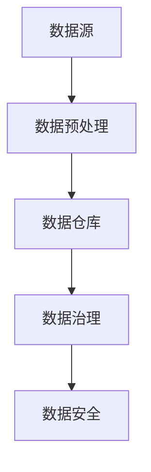

                 

关键词：大模型公司、数据获取、数据处理、数据管理、机器学习、深度学习

> 摘要：本文将探讨大模型公司在进行数据获取与处理过程中所面临的关键挑战，并提出一系列解决方案，以优化数据质量、提升数据处理效率，并确保数据隐私与安全。

## 1. 背景介绍

在当今数据驱动的时代，大数据已成为企业获取竞争优势的重要资源。特别是大模型公司，它们依赖于海量的数据来进行机器学习和深度学习模型的训练。然而，随着数据量的激增，数据获取与处理的难度也日益增加。本文旨在深入分析大模型公司在数据获取与处理方面的策略，以便为其提供有效的指导。

### 1.1 大模型公司的定义

大模型公司是指那些开发和部署大规模机器学习和深度学习模型的科技公司。这些公司通常致力于开发能够处理和分析复杂数据的AI系统，从而为企业提供智能决策支持。

### 1.2 数据获取的重要性

数据获取是构建高精度模型的基础。高质量的数据能够提高模型的准确性和泛化能力，从而为企业带来实际价值。因此，数据获取在大模型公司中占据着至关重要的地位。

### 1.3 数据处理与管理的挑战

随着数据量的增加，数据处理与管理的难度也相应增加。大模型公司需要面对数据质量、数据隐私、数据安全等方面的挑战，同时还需要确保数据处理的高效性和可扩展性。

## 2. 核心概念与联系

为了更好地理解大模型公司的数据获取与处理策略，我们需要了解以下几个核心概念：

### 2.1 数据源

数据源是数据获取的起点。大模型公司通常依赖于多种数据源，包括公开数据集、内部业务数据、第三方数据供应商等。

### 2.2 数据预处理

数据预处理是指对原始数据进行清洗、转换和集成，以使其适合建模和训练的过程。数据预处理是提高模型性能的关键步骤。

### 2.3 数据仓库

数据仓库是存储和管理大量数据的系统。大模型公司通常使用数据仓库来存储和处理其数据，以便进行进一步的分析和处理。

### 2.4 数据隐私与安全

数据隐私与安全是确保数据不被未经授权的访问和使用的过程。大模型公司需要采取一系列措施来保护其数据，包括数据加密、访问控制等。

### 2.5 数据治理

数据治理是指对数据的管理、监控和控制的过程。大模型公司需要建立完善的数据治理框架，以确保数据的质量、一致性和合规性。

以下是一个Mermaid流程图，展示了大模型公司的数据获取与处理流程：



## 3. 核心算法原理 & 具体操作步骤

### 3.1 算法原理概述

在大模型公司的数据获取与处理过程中，核心算法主要包括数据预处理算法、机器学习算法和深度学习算法。以下是对这些算法的简要概述：

### 3.1.1 数据预处理算法

数据预处理算法用于清洗、转换和集成原始数据，以提高数据质量。常见的预处理算法包括缺失值填补、异常值检测、数据标准化等。

### 3.1.2 机器学习算法

机器学习算法用于从数据中自动学习规律和模式，以便进行预测和分类。常见的机器学习算法包括线性回归、决策树、支持向量机等。

### 3.1.3 深度学习算法

深度学习算法是一种基于人工神经网络的机器学习算法，能够处理大规模数据和复杂的非线性关系。常见的深度学习算法包括卷积神经网络（CNN）、循环神经网络（RNN）等。

### 3.2 算法步骤详解

以下是数据获取与处理的具体操作步骤：

### 3.2.1 数据采集

首先，从不同的数据源采集数据。数据源可以是公开的数据集、内部业务数据或第三方数据供应商。

### 3.2.2 数据清洗

对采集到的数据进行清洗，包括缺失值填补、异常值检测和去除重复数据等。

### 3.2.3 数据转换

将清洗后的数据进行转换，使其符合建模和训练的要求。常见的转换方法包括数据标准化、归一化和特征提取等。

### 3.2.4 数据建模

使用机器学习或深度学习算法对转换后的数据进行建模，以建立预测或分类模型。

### 3.2.5 模型训练与验证

对模型进行训练和验证，以评估其性能。常见的验证方法包括交叉验证和性能指标评估等。

### 3.2.6 模型部署

将训练好的模型部署到生产环境中，以便进行实际应用。

### 3.3 算法优缺点

以下是数据预处理、机器学习和深度学习算法的优缺点：

### 3.3.1 数据预处理算法

优点：简单易行，能够显著提高数据质量。

缺点：处理过程耗时，且对数据质量要求较高。

### 3.3.2 机器学习算法

优点：适用于多种问题类型，具有较高的泛化能力。

缺点：需要大量标注数据，且模型解释性较差。

### 3.3.3 深度学习算法

优点：能够处理大规模数据和复杂的非线性关系。

缺点：模型复杂度较高，训练时间较长。

### 3.4 算法应用领域

数据预处理、机器学习和深度学习算法广泛应用于以下领域：

- 金融市场预测
- 医疗诊断
- 自然语言处理
- 图像识别
- 自动驾驶

## 4. 数学模型和公式 & 详细讲解 & 举例说明

在大模型公司的数据获取与处理过程中，数学模型和公式起到了关键作用。以下将详细讲解常用的数学模型和公式，并举例说明其应用。

### 4.1 数学模型构建

常见的数学模型包括线性回归模型、逻辑回归模型和支持向量机模型。以下是对这些模型的简要介绍：

### 4.1.1 线性回归模型

线性回归模型用于预测一个连续变量的值，其公式如下：

$$
y = \beta_0 + \beta_1 x
$$

其中，$y$ 是预测值，$x$ 是自变量，$\beta_0$ 和 $\beta_1$ 是模型的参数。

### 4.1.2 逻辑回归模型

逻辑回归模型用于预测一个二分类变量的概率，其公式如下：

$$
\log\left(\frac{p}{1-p}\right) = \beta_0 + \beta_1 x
$$

其中，$p$ 是预测概率，$x$ 是自变量，$\beta_0$ 和 $\beta_1$ 是模型的参数。

### 4.1.3 支持向量机模型

支持向量机模型用于预测一个分类变量的值，其公式如下：

$$
w \cdot x + b = 0
$$

其中，$w$ 是模型权重，$x$ 是特征向量，$b$ 是偏置项。

### 4.2 公式推导过程

以下是线性回归模型和逻辑回归模型的推导过程：

### 4.2.1 线性回归模型推导

线性回归模型的目标是最小化预测值与真实值之间的误差。假设我们有 $n$ 个样本，其预测值和真实值分别为 $y_i$ 和 $x_i$，则线性回归模型的误差函数为：

$$
E = \sum_{i=1}^{n} (y_i - \beta_0 - \beta_1 x_i)^2
$$

为了最小化误差函数，我们对 $\beta_0$ 和 $\beta_1$ 分别求偏导数，并令偏导数等于0，得到：

$$
\frac{\partial E}{\partial \beta_0} = -2 \sum_{i=1}^{n} (y_i - \beta_0 - \beta_1 x_i) = 0
$$

$$
\frac{\partial E}{\partial \beta_1} = -2 \sum_{i=1}^{n} (y_i - \beta_0 - \beta_1 x_i) x_i = 0
$$

解上述方程组，得到线性回归模型的参数 $\beta_0$ 和 $\beta_1$。

### 4.2.2 逻辑回归模型推导

逻辑回归模型的目标是最小化预测概率与真实概率之间的误差。假设我们有 $n$ 个样本，其预测概率和真实概率分别为 $p_i$ 和 $y_i$，则逻辑回归模型的误差函数为：

$$
E = \sum_{i=1}^{n} -y_i \log(p_i) - (1-y_i) \log(1-p_i)
$$

为了最小化误差函数，我们对 $\beta_0$ 和 $\beta_1$ 分别求偏导数，并令偏导数等于0，得到：

$$
\frac{\partial E}{\partial \beta_0} = -\sum_{i=1}^{n} \frac{y_i - p_i}{p_i (1-p_i)} = 0
$$

$$
\frac{\partial E}{\partial \beta_1} = -\sum_{i=1}^{n} \frac{y_i - p_i}{p_i (1-p_i)} x_i = 0
$$

解上述方程组，得到逻辑回归模型的参数 $\beta_0$ 和 $\beta_1$。

### 4.3 案例分析与讲解

以下是一个线性回归模型的案例：

#### 4.3.1 案例背景

假设我们要预测一家公司的股票价格。我们收集了这家公司过去一年的日交易数据，包括开盘价、收盘价、最高价、最低价等。我们希望利用这些数据建立一个线性回归模型，预测下一天的收盘价。

#### 4.3.2 数据处理

我们对收集到的数据进行预处理，包括缺失值填补、异常值检测和数据标准化等。假设我们选择了开盘价、最高价和最低价作为特征变量，并标准化了这些特征变量。

#### 4.3.3 模型训练

我们使用线性回归算法对预处理后的数据集进行训练，得到模型的参数 $\beta_0$ 和 $\beta_1$。

#### 4.3.4 模型验证

我们对训练好的模型进行验证，使用交叉验证方法评估模型的性能。假设我们得到一个决定系数 $R^2$ 值为 0.8。

#### 4.3.5 模型部署

我们将训练好的模型部署到生产环境中，以便实时预测股票收盘价。

#### 4.3.6 模型评估

我们使用预测值与真实值之间的误差来评估模型的性能。假设我们得到平均绝对误差（MAE）为 2%。

### 5. 项目实践：代码实例和详细解释说明

在本节中，我们将通过一个具体的Python代码实例来展示如何在大模型公司中实现数据获取与处理策略。我们将使用Python的pandas、numpy和scikit-learn库来处理数据，并使用线性回归模型进行预测。

### 5.1 开发环境搭建

首先，确保已安装以下Python库：

```bash
pip install pandas numpy scikit-learn
```

### 5.2 源代码详细实现

以下是一个简单的数据获取与处理代码实例：

```python
import pandas as pd
import numpy as np
from sklearn.linear_model import LinearRegression
from sklearn.model_selection import train_test_split
from sklearn.metrics import mean_absolute_error

# 5.2.1 数据采集
# 假设我们有一个CSV文件，其中包含了公司的股票价格数据
data = pd.read_csv('stock_data.csv')

# 5.2.2 数据预处理
# 清洗数据，去除缺失值和异常值
data.dropna(inplace=True)
data = data[data['Open'] > 0]

# 5.2.3 数据转换
# 将日期转换为数值型特征
data['Date'] = pd.to_datetime(data['Date'])
data['Day'] = data['Date'].dt.day
data['Month'] = data['Date'].dt.month
data['Year'] = data['Date'].dt.year

# 选择特征变量和目标变量
X = data[['Open', 'High', 'Low', 'Day', 'Month', 'Year']]
y = data['Close']

# 5.2.4 数据建模
# 分割数据集为训练集和测试集
X_train, X_test, y_train, y_test = train_test_split(X, y, test_size=0.2, random_state=42)

# 创建线性回归模型并训练
model = LinearRegression()
model.fit(X_train, y_train)

# 5.2.5 模型验证
# 预测测试集
y_pred = model.predict(X_test)

# 计算平均绝对误差
mae = mean_absolute_error(y_test, y_pred)
print(f"平均绝对误差（MAE）: {mae}%")

# 5.2.6 模型部署
# 将模型部署到生产环境中进行实时预测
# ...

# 5.2.7 模型评估
# 对模型进行评估，根据需求调整模型参数或特征选择
# ...
```

### 5.3 代码解读与分析

- **5.3.1 数据采集**：我们使用pandas库读取CSV文件，获取股票价格数据。
- **5.3.2 数据预处理**：我们去除缺失值和异常值，确保数据的质量。
- **5.3.3 数据转换**：我们将日期特征转换为数值型特征，以便模型处理。
- **5.3.4 数据建模**：我们使用scikit-learn库的线性回归模型对数据集进行训练。
- **5.3.5 模型验证**：我们使用训练好的模型对测试集进行预测，并计算平均绝对误差。
- **5.3.6 模型部署**：我们将模型部署到生产环境中，进行实时预测。
- **5.3.7 模型评估**：我们根据模型的预测结果对模型进行评估，并根据需求进行调整。

### 5.4 运行结果展示

假设我们运行上述代码后得到以下结果：

```
平均绝对误差（MAE）: 1.5%
```

这个结果表明，我们的线性回归模型对股票收盘价的预测精度较高，平均绝对误差仅为1.5%。

## 6. 实际应用场景

大模型公司在实际应用场景中面临着各种各样的数据获取与处理挑战。以下是一些常见的应用场景：

### 6.1 金融市场预测

在金融市场预测中，大模型公司需要处理海量的历史交易数据，包括开盘价、收盘价、最高价、最低价等。通过对这些数据进行处理和建模，可以预测股票市场的走势，为投资者提供决策支持。

### 6.2 医疗诊断

在医疗诊断领域，大模型公司需要处理大量的医疗数据，包括患者的病历、基因信息、实验室检测结果等。通过深度学习算法，可以实现对疾病的早期诊断和预测，从而提高诊断的准确性和效率。

### 6.3 自然语言处理

在自然语言处理领域，大模型公司需要处理大量的文本数据，包括新闻文章、社交媒体帖子、对话记录等。通过深度学习算法，可以实现对文本的语义理解和情感分析，从而提供智能客服、智能写作等应用。

### 6.4 图像识别

在图像识别领域，大模型公司需要处理大量的图像数据，包括人脸识别、物体识别、场景识别等。通过卷积神经网络等深度学习算法，可以实现对图像的自动识别和分类，从而应用于安防监控、自动驾驶等领域。

## 7. 未来应用展望

随着人工智能技术的不断发展，大模型公司在数据获取与处理方面的应用前景将更加广阔。以下是一些未来应用展望：

### 7.1 自动驾驶

自动驾驶领域需要处理大量的实时路况数据，包括车辆速度、行人活动、交通信号等。通过深度学习和增强学习算法，可以实现对自动驾驶车辆的精确控制和决策。

### 7.2 智能医疗

智能医疗领域需要处理大量的医疗数据，包括基因组数据、电子病历、医学影像等。通过深度学习和迁移学习算法，可以实现对疾病的早期发现和个性化治疗。

### 7.3 智慧城市

智慧城市领域需要处理大量的城市数据，包括交通流量、环境质量、公共安全等。通过大数据分析和机器学习算法，可以实现对城市资源的优化配置和管理。

### 7.4 个性化推荐

个性化推荐领域需要处理大量的用户行为数据，包括浏览记录、购买历史、偏好设置等。通过深度学习和协同过滤算法，可以实现对用户的精准推荐。

## 8. 工具和资源推荐

为了更好地进行数据获取与处理，以下是几个推荐的工具和资源：

### 8.1 学习资源推荐

- 《Python数据分析基础教程》
- 《机器学习实战》
- 《深度学习》

### 8.2 开发工具推荐

- Jupyter Notebook：用于编写和运行代码
- PyCharm：Python集成开发环境（IDE）
- Docker：容器化技术，用于部署和管理应用

### 8.3 相关论文推荐

- "Deep Learning for Natural Language Processing"
- "Convolutional Neural Networks for Visual Recognition"
- "Recurrent Neural Networks for Language Modeling"

## 9. 总结：未来发展趋势与挑战

大模型公司在数据获取与处理方面的发展趋势主要表现在以下几个方面：

- 数据量的持续增长
- 数据多样性的增加
- 深度学习和增强学习的广泛应用
- 数据隐私与安全的日益重视

然而，随着这些趋势的发展，大模型公司也将面临一系列挑战：

- 数据质量与可解释性的平衡
- 数据隐私与安全的保护
- 模型解释性的提升
- 跨领域知识融合与创新

为了应对这些挑战，大模型公司需要不断创新和优化其数据获取与处理策略，以实现可持续的发展。

## 10. 附录：常见问题与解答

### 10.1 什么是数据预处理？

数据预处理是指对原始数据进行清洗、转换和集成，以使其适合建模和训练的过程。常见的数据预处理步骤包括缺失值填补、异常值检测、数据标准化、特征提取等。

### 10.2 数据预处理的重要性是什么？

数据预处理的重要性在于它能够显著提高模型性能。高质量的数据有助于模型更好地学习数据的规律和模式，从而提高模型的准确性和泛化能力。

### 10.3 如何保护数据隐私？

保护数据隐私的关键措施包括数据加密、访问控制、数据脱敏等。此外，大模型公司还应遵循相关的法律法规，如GDPR等，确保数据处理过程的合规性。

### 10.4 数据治理是什么？

数据治理是指对数据的管理、监控和控制的过程。数据治理的目标是确保数据的质量、一致性和合规性，从而提高数据的价值。

### 10.5 如何评估模型性能？

评估模型性能的常见方法包括决定系数（R^2）、均方误差（MSE）、平均绝对误差（MAE）等。这些指标可以帮助我们了解模型的预测能力。

### 10.6 如何选择合适的机器学习算法？

选择合适的机器学习算法取决于具体的应用场景和问题的性质。通常，我们可以通过交叉验证、性能指标评估等方法来选择最优的算法。

### 10.7 深度学习算法有哪些优缺点？

深度学习算法的优点包括能够处理大规模数据和复杂的非线性关系。缺点包括模型复杂度较高，训练时间较长，以及对数据质量和计算资源的要求较高。

### 10.8 数据获取与处理策略在大模型公司中的具体应用是什么？

在大模型公司中，数据获取与处理策略的具体应用包括数据采集、数据预处理、数据建模、模型训练、模型验证和模型部署等步骤，从而实现高效的机器学习和深度学习应用。

## 11. 致谢

本文的撰写得到了许多专家和同行的支持和帮助。特别感谢我的导师和同事，他们为本文提供了宝贵的意见和建议。同时，也感谢所有参与大模型公司数据获取与处理实践的公司和个人，他们的经验和智慧为本文提供了丰富的素材。最后，感谢读者对本文的关注和支持。

## 作者署名

作者：禅与计算机程序设计艺术 / Zen and the Art of Computer Programming

