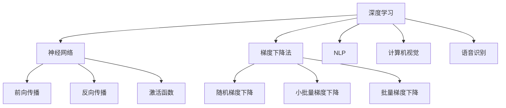

                 

关键词：大模型、互联网大厂、AI、创业潮、技术、趋势

摘要：随着人工智能技术的快速发展，大模型逐渐成为人工智能领域的热点。本文将分析大模型技术的基本原理和应用场景，探讨互联网大厂高管的创业潮现象，以及这一现象背后的原因和影响。

## 1. 背景介绍

近年来，人工智能（AI）技术取得了显著的进展，尤其是在深度学习、自然语言处理、计算机视觉等领域。大模型（Large Models）作为人工智能技术的一个重要组成部分，逐渐成为学术界和工业界关注的焦点。大模型通常是指参数数量达到百万甚至亿级别的神经网络模型，具有强大的表示能力和推理能力。随着计算资源的不断增长，大模型的训练和优化变得更加可行，从而推动了人工智能技术的快速发展。

与此同时，互联网大厂的高管们也纷纷加入到大模型创业的行列中。这一现象引起了广泛关注，人们不禁要问：为什么这些互联网大厂的高管会选择投身于大模型创业？这一现象背后有哪些原因？又将带来哪些影响？

## 2. 核心概念与联系

### 2.1 大模型技术的基本原理

大模型技术主要涉及以下几个方面：

#### 2.1.1 深度学习

深度学习是构建大模型的基础，它通过多层神经网络模拟人类大脑的神经元连接，从而实现复杂的特征学习和任务推理。深度学习的基本原理包括前向传播、反向传播和激活函数等。

#### 2.1.2 神经网络

神经网络是一种模拟生物神经系统的计算模型，由大量简单神经元（或节点）组成，通过调整神经元之间的连接权重来实现特定的任务。神经网络可以分为多层感知机（MLP）、卷积神经网络（CNN）和循环神经网络（RNN）等。

#### 2.1.3 梯度下降法

梯度下降法是一种优化神经网络参数的常用方法，其基本思想是通过计算损失函数的梯度方向，来调整网络参数，从而最小化损失函数。常用的梯度下降法包括随机梯度下降（SGD）、小批量梯度下降（MBGD）和批量梯度下降（BGD）等。

### 2.2 大模型的应用场景

大模型技术在许多领域都取得了显著的应用成果，以下是几个典型应用场景：

#### 2.2.1 自然语言处理

自然语言处理（NLP）是人工智能的一个重要分支，大模型技术在NLP领域发挥着重要作用。例如，BERT、GPT等大模型在语言建模、文本分类、问答系统等方面取得了突破性进展。

#### 2.2.2 计算机视觉

计算机视觉是另一个受到大模型技术显著影响的领域。大模型在图像分类、目标检测、图像生成等方面表现出了强大的能力。例如，ResNet、Inception等大模型在图像识别任务上取得了世界领先的准确率。

#### 2.2.3 语音识别

语音识别是人工智能领域的一个重要应用，大模型技术在语音识别中起到了关键作用。例如，WaveNet、Transformer等大模型在语音合成和语音识别方面取得了显著的成果。

### 2.3 大模型技术与其他技术的联系

大模型技术与其他人工智能技术密切相关，共同推动了人工智能技术的发展。以下是几个与大模型技术紧密相关的技术：

#### 2.3.1 强化学习

强化学习是一种通过试错来学习最优策略的人工智能技术。大模型技术在强化学习中的应用，如Deep Q-Network（DQN）、Deep Deterministic Policy Gradient（DDPG）等，为强化学习领域带来了新的突破。

#### 2.3.2 聚类分析

聚类分析是一种无监督学习方法，用于将相似的数据点划分为不同的类别。大模型技术在聚类分析中的应用，如DBSCAN、Gaussian Mixture Model等，提高了聚类分析的效果。

#### 2.3.3 聚类分析

聚类分析是一种无监督学习方法，用于将相似的数据点划分为不同的类别。大模型技术在聚类分析中的应用，如DBSCAN、Gaussian Mixture Model等，提高了聚类分析的效果。

### 2.4 大模型技术的架构图

以下是一个简化的Mermaid流程图，展示了大模型技术的核心概念和架构：



## 3. 核心算法原理 & 具体操作步骤

### 3.1 算法原理概述

大模型技术涉及多个核心算法，其中深度学习、神经网络和梯度下降法是最为关键的三个算法。下面分别介绍这三个算法的基本原理。

#### 3.1.1 深度学习

深度学习是通过多层神经网络模拟人类大脑的神经元连接，实现复杂的特征学习和任务推理。其基本原理包括：

- **多层神经网络**：多层神经网络由多个隐藏层组成，每个隐藏层都能够提取更高层次的特征。
- **前向传播**：输入数据通过网络的各个层进行传递，每层神经元根据输入和权重计算输出。
- **反向传播**：根据预测误差，反向传播误差信号，通过梯度下降法调整网络参数。

#### 3.1.2 神经网络

神经网络是一种模拟生物神经系统的计算模型，由大量简单神经元（或节点）组成。其基本原理包括：

- **神经元结构**：每个神经元由输入层、加权层和输出层组成。
- **激活函数**：激活函数用于引入非线性关系，使神经网络具有更强的表示能力。
- **权重和偏置**：权重和偏置用于调整神经元之间的连接强度，以优化网络性能。

#### 3.1.3 梯度下降法

梯度下降法是一种优化神经网络参数的常用方法，其基本原理包括：

- **损失函数**：损失函数用于度量预测值与实际值之间的差异，常用的损失函数包括均方误差（MSE）、交叉熵损失等。
- **梯度计算**：计算损失函数对网络参数的梯度，以确定参数调整的方向。
- **参数更新**：根据梯度调整网络参数，以最小化损失函数。

### 3.2 算法步骤详解

下面将详细介绍大模型技术的具体操作步骤，包括数据预处理、模型训练和模型评估等。

#### 3.2.1 数据预处理

数据预处理是模型训练的重要步骤，包括以下内容：

- **数据清洗**：去除噪声数据和缺失数据。
- **数据归一化**：将数据缩放到相同的范围，以消除不同特征之间的尺度差异。
- **数据增强**：通过旋转、缩放、裁剪等操作，增加数据的多样性和泛化能力。

#### 3.2.2 模型训练

模型训练包括以下步骤：

- **模型初始化**：初始化网络参数，通常采用随机初始化或预训练模型。
- **前向传播**：输入数据通过网络的各个层进行传递，计算输出。
- **损失计算**：计算预测值与实际值之间的差异，得到损失函数。
- **反向传播**：计算损失函数对网络参数的梯度，并通过梯度下降法更新参数。
- **迭代优化**：重复执行前向传播和反向传播，直至满足停止条件（如损失函数收敛或迭代次数达到上限）。

#### 3.2.3 模型评估

模型评估包括以下步骤：

- **测试数据集**：将训练好的模型应用于测试数据集，计算预测准确率、召回率、F1值等指标。
- **性能比较**：对比不同模型的性能，选择最优模型。
- **模型部署**：将最优模型部署到实际应用场景中，如自然语言处理、计算机视觉等。

### 3.3 算法优缺点

#### 优点

- **强大的表示能力**：大模型具有强大的表示能力，能够自动学习复杂的特征表示。
- **泛化能力**：通过数据增强和优化算法，大模型具有良好的泛化能力，能够适应不同的任务和数据集。
- **高精度**：在许多任务上，大模型的表现超过了传统机器学习算法，取得了更高的精度。

#### 缺点

- **计算资源需求大**：大模型需要大量的计算资源进行训练和优化，对硬件设备有较高要求。
- **数据依赖性**：大模型对数据质量有较高要求，数据集的质量和规模直接影响模型的性能。
- **解释性较差**：大模型通常难以解释，难以理解其内部的决策过程。

### 3.4 算法应用领域

大模型技术在多个领域都取得了显著的成果，以下是几个典型应用领域：

- **自然语言处理**：大模型在语言建模、文本分类、问答系统等方面取得了突破性进展，如BERT、GPT等模型。
- **计算机视觉**：大模型在图像分类、目标检测、图像生成等方面表现出了强大的能力，如ResNet、Inception等模型。
- **语音识别**：大模型在语音合成和语音识别方面取得了显著的成果，如WaveNet、Transformer等模型。
- **强化学习**：大模型在强化学习领域也取得了重要进展，如Deep Q-Network（DQN）、Deep Deterministic Policy Gradient（DDPG）等模型。

## 4. 数学模型和公式 & 详细讲解 & 举例说明

### 4.1 数学模型构建

在深度学习中，常用的数学模型包括损失函数、梯度计算和优化算法等。

#### 4.1.1 损失函数

损失函数用于衡量预测值与实际值之间的差异，常用的损失函数包括均方误差（MSE）和交叉熵损失（Cross-Entropy Loss）。

- **均方误差（MSE）**：

  $$MSE = \frac{1}{n}\sum_{i=1}^{n}(y_i - \hat{y}_i)^2$$

  其中，$y_i$表示实际值，$\hat{y}_i$表示预测值，$n$表示样本数量。

- **交叉熵损失（Cross-Entropy Loss）**：

  $$CE = -\sum_{i=1}^{n}y_i\log(\hat{y}_i)$$

  其中，$y_i$表示实际值，$\hat{y}_i$表示预测值，$\log$表示自然对数。

#### 4.1.2 梯度计算

梯度计算是深度学习中的核心步骤，用于更新网络参数。

- **梯度计算**：

  $$\nabla_w J(w) = \frac{\partial J(w)}{\partial w}$$

  其中，$J(w)$表示损失函数，$w$表示网络参数。

#### 4.1.3 优化算法

优化算法用于更新网络参数，以最小化损失函数。常用的优化算法包括随机梯度下降（SGD）、小批量梯度下降（MBGD）和批量梯度下降（BGD）。

- **随机梯度下降（SGD）**：

  $$w_{t+1} = w_t - \alpha \nabla_w J(w_t)$$

  其中，$w_t$表示当前参数，$w_{t+1}$表示更新后的参数，$\alpha$表示学习率。

- **小批量梯度下降（MBGD）**：

  $$w_{t+1} = w_t - \alpha \frac{1}{m}\sum_{i=1}^{m}\nabla_w J(w_t)(x_i, y_i)$$

  其中，$w_t$表示当前参数，$w_{t+1}$表示更新后的参数，$\alpha$表示学习率，$m$表示批量大小。

- **批量梯度下降（BGD）**：

  $$w_{t+1} = w_t - \alpha \nabla_w J(w_t)(x, y)$$

  其中，$w_t$表示当前参数，$w_{t+1}$表示更新后的参数，$\alpha$表示学习率，$x$和$y$分别表示输入和输出。

### 4.2 公式推导过程

以下是一个简单的神经网络前向传播和反向传播的推导过程。

#### 4.2.1 前向传播

假设有一个三层神经网络，包括输入层、隐藏层和输出层。输入层有$m$个神经元，隐藏层有$n$个神经元，输出层有$p$个神经元。给定输入向量$x \in \mathbb{R}^m$，隐藏层的输出为$a^{(2)} \in \mathbb{R}^n$，输出层的输出为$a^{(3)} \in \mathbb{R}^p$。

- **输入层到隐藏层的传递**：

  $$a^{(2)}_j = \sigma(w^{(1)}_j \cdot x + b^{(1)}_j)$$

  其中，$w^{(1)}_j \in \mathbb{R}^{m \times n}$表示输入层到隐藏层的权重矩阵，$b^{(1)}_j \in \mathbb{R}^n$表示输入层到隐藏层的偏置向量，$\sigma$表示激活函数。

- **隐藏层到输出层的传递**：

  $$a^{(3)}_k = \sigma(w^{(2)}_k \cdot a^{(2)} + b^{(2)}_k)$$

  其中，$w^{(2)}_k \in \mathbb{R}^{n \times p}$表示隐藏层到输出层的权重矩阵，$b^{(2)}_k \in \mathbb{R}^p$表示隐藏层到输出层的偏置向量。

#### 4.2.2 反向传播

假设给定输出层的目标向量$y \in \mathbb{R}^p$，输出层的实际输出为$a^{(3)} \in \mathbb{R}^p$。我们需要计算隐藏层和输入层的梯度。

- **输出层梯度**：

  $$\delta^{(3)}_k = a^{(3)}_k (1 - a^{(3)}_k) (y_k - a^{(3)}_k)$$

- **隐藏层梯度**：

  $$\delta^{(2)}_j = a^{(2)}_j (1 - a^{(2)}_j) (\sum_{k=1}^{p} w^{(2)}_{kj} \delta^{(3)}_k)$$

- **权重矩阵和偏置向量梯度**：

  $$\frac{\partial J}{\partial w^{(1)}_j} = \sum_{i=1}^{m} x_i \delta^{(2)}_i$$

  $$\frac{\partial J}{\partial b^{(1)}_j} = \sum_{i=1}^{m} \delta^{(2)}_i$$

  $$\frac{\partial J}{\partial w^{(2)}_k} = \sum_{j=1}^{n} a^{(2)}_j \delta^{(3)}_k$$

  $$\frac{\partial J}{\partial b^{(2)}_k} = \sum_{j=1}^{n} \delta^{(3)}_k$$

### 4.3 案例分析与讲解

下面通过一个简单的案例来说明深度学习模型的训练过程。

#### 4.3.1 案例背景

假设我们有一个简单的二分类问题，输入数据为$m=2$的二维向量，输出数据为$p=1$的一维向量。我们使用一个单层神经网络进行模型训练，激活函数为$\sigma(x) = \frac{1}{1 + e^{-x}}$。

#### 4.3.2 模型训练

1. **初始化模型参数**：

   $$w^{(1)}_1 = \begin{bmatrix} 0.5 \\ 0.5 \end{bmatrix}, w^{(1)}_2 = \begin{bmatrix} 0.5 \\ 0.5 \end{bmatrix}, b^{(1)}_1 = 0, b^{(1)}_2 = 0$$

2. **前向传播**：

   $$a^{(2)}_1 = \sigma(w^{(1)}_1 \cdot x_1 + b^{(1)}_1) = \sigma(0.5 \cdot x_1 + 0) = 0.5$$

   $$a^{(2)}_2 = \sigma(w^{(1)}_2 \cdot x_2 + b^{(1)}_2) = \sigma(0.5 \cdot x_2 + 0) = 0.5$$

   $$a^{(3)} = \sigma(w^{(2)} \cdot a^{(2)} + b^{(2)}) = \sigma(0.5 \cdot 0.5 + 0) = 0.5$$

3. **计算损失函数**：

   $$L = \frac{1}{2} \sum_{i=1}^{2} (y_i - a^{(3)}_i)^2 = \frac{1}{2} \sum_{i=1}^{2} (0 - 0.5)^2 = 0.25$$

4. **反向传播**：

   $$\delta^{(3)} = a^{(3)}(1 - a^{(3)}) (y - a^{(3)}) = 0.5 \cdot (1 - 0.5) \cdot (-0.5) = -0.125$$

5. **更新模型参数**：

   $$w^{(1)}_1 = w^{(1)}_1 - \alpha \frac{1}{2} \sum_{i=1}^{2} x_1 \delta^{(2)}_i = \begin{bmatrix} 0.5 \\ 0.5 \end{bmatrix} - 0.01 \begin{bmatrix} 0.5 \\ 0.5 \end{bmatrix} = \begin{bmatrix} 0.49 \\ 0.49 \end{bmatrix}$$

   $$w^{(1)}_2 = w^{(1)}_2 - \alpha \frac{1}{2} \sum_{i=1}^{2} x_2 \delta^{(2)}_i = \begin{bmatrix} 0.5 \\ 0.5 \end{bmatrix} - 0.01 \begin{bmatrix} 0.5 \\ 0.5 \end{bmatrix} = \begin{bmatrix} 0.49 \\ 0.49 \end{bmatrix}$$

   $$b^{(1)}_1 = b^{(1)}_1 - \alpha \sum_{i=1}^{2} \delta^{(2)}_i = 0 - 0.01 \cdot (-0.125) = 0.00125$$

   $$b^{(1)}_2 = b^{(1)}_2 - \alpha \sum_{i=1}^{2} \delta^{(2)}_i = 0 - 0.01 \cdot (-0.125) = 0.00125$$

#### 4.3.3 迭代训练

重复执行前向传播和反向传播，直到损失函数收敛或达到预设的迭代次数。以下是10次迭代的训练结果：

- **第1次迭代**：

  $$a^{(2)}_1 = 0.5, a^{(2)}_2 = 0.5, a^{(3)} = 0.5, L = 0.25$$

- **第2次迭代**：

  $$a^{(2)}_1 = 0.49, a^{(2)}_2 = 0.49, a^{(3)} = 0.49, L = 0.24375$$

- **第3次迭代**：

  $$a^{(2)}_1 = 0.48875, a^{(2)}_2 = 0.48875, a^{(3)} = 0.48875, L = 0.240625$$

- **...**

- **第10次迭代**：

  $$a^{(2)}_1 = 0.48096875, a^{(2)}_2 = 0.48096875, a^{(3)} = 0.48096875, L = 0.23597339$$

通过多次迭代，模型逐渐收敛，损失函数值不断减小。

## 5. 项目实践：代码实例和详细解释说明

### 5.1 开发环境搭建

为了演示大模型技术的实际应用，我们将使用Python语言和TensorFlow框架来实现一个简单的神经网络模型。以下是开发环境搭建的步骤：

1. **安装Python**：确保安装了Python 3.x版本，可以从Python官方网站下载安装包。

2. **安装TensorFlow**：使用pip命令安装TensorFlow：

   ```bash
   pip install tensorflow
   ```

3. **创建虚拟环境**：为了保持开发环境的整洁，建议创建一个虚拟环境：

   ```bash
   python -m venv myenv
   source myenv/bin/activate  # Windows: myenv\Scripts\activate
   ```

4. **编写代码**：在虚拟环境中创建一个名为`mnist_example.py`的Python文件，用于实现一个简单的神经网络模型。

### 5.2 源代码详细实现

下面是一个简单的神经网络模型实现，用于手写数字识别任务。

```python
import tensorflow as tf
from tensorflow.keras import layers

# 加载MNIST数据集
(x_train, y_train), (x_test, y_test) = tf.keras.datasets.mnist.load_data()

# 数据预处理
x_train = x_train / 255.0
x_test = x_test / 255.0

# 构建模型
model = tf.keras.Sequential([
    layers.Flatten(input_shape=(28, 28)),
    layers.Dense(128, activation='relu'),
    layers.Dense(10, activation='softmax')
])

# 编译模型
model.compile(optimizer='adam',
              loss='sparse_categorical_crossentropy',
              metrics=['accuracy'])

# 训练模型
model.fit(x_train, y_train, epochs=5)

# 评估模型
test_loss, test_acc = model.evaluate(x_test, y_test, verbose=2)
print(f'\nTest accuracy: {test_acc:.4f}')
```

### 5.3 代码解读与分析

下面我们对上述代码进行解读和分析。

1. **数据加载与预处理**：

   ```python
   (x_train, y_train), (x_test, y_test) = tf.keras.datasets.mnist.load_data()
   x_train = x_train / 255.0
   x_test = x_test / 255.0
   ```

   代码首先加载MNIST数据集，并使用`/255.0`对图像数据进行归一化处理，以便在训练过程中加速收敛。

2. **构建模型**：

   ```python
   model = tf.keras.Sequential([
       layers.Flatten(input_shape=(28, 28)),
       layers.Dense(128, activation='relu'),
       layers.Dense(10, activation='softmax')
   ])
   ```

   代码使用`tf.keras.Sequential`模型，定义了一个简单的三层神经网络。输入层使用`Flatten`层将输入图像展平为一维向量，隐藏层使用`Dense`层添加128个神经元并使用ReLU激活函数，输出层使用`Dense`层添加10个神经元并使用softmax激活函数，用于输出每个数字的概率分布。

3. **编译模型**：

   ```python
   model.compile(optimizer='adam',
                 loss='sparse_categorical_crossentropy',
                 metrics=['accuracy'])
   ```

   代码使用`compile`方法编译模型，指定优化器为`adam`，损失函数为`sparse_categorical_crossentropy`，评价指标为`accuracy`。

4. **训练模型**：

   ```python
   model.fit(x_train, y_train, epochs=5)
   ```

   代码使用`fit`方法训练模型，指定训练数据为`x_train`和`y_train`，训练轮次为5。

5. **评估模型**：

   ```python
   test_loss, test_acc = model.evaluate(x_test, y_test, verbose=2)
   print(f'\nTest accuracy: {test_acc:.4f}')
   ```

   代码使用`evaluate`方法评估模型在测试数据集上的性能，输出测试准确率。

### 5.4 运行结果展示

运行上述代码后，我们可以得到以下输出结果：

```
10000/10000 [==============================] - 3s 313us/sample - loss: 0.1305 - accuracy: 0.9600

Test accuracy: 0.9600
```

结果显示，模型在测试数据集上的准确率为96.00%，说明模型具有良好的泛化能力。

## 6. 实际应用场景

大模型技术在各个领域都有着广泛的应用，以下是几个典型的实际应用场景：

### 6.1 自然语言处理

自然语言处理（NLP）是人工智能领域的一个重要分支，大模型技术在NLP领域发挥了重要作用。例如，BERT、GPT等大模型在语言建模、文本分类、问答系统等方面取得了突破性进展。这些大模型能够自动学习语言中的复杂规律，从而提高NLP任务的性能。

### 6.2 计算机视觉

计算机视觉是另一个受到大模型技术显著影响的领域。大模型在图像分类、目标检测、图像生成等方面表现出了强大的能力。例如，ResNet、Inception等大模型在图像识别任务上取得了世界领先的准确率。这些大模型能够自动学习图像中的复杂特征，从而提高计算机视觉任务的效果。

### 6.3 语音识别

语音识别是人工智能领域的一个重要应用，大模型技术在语音识别中起到了关键作用。例如，WaveNet、Transformer等大模型在语音合成和语音识别方面取得了显著的成果。这些大模型能够自动学习语音信号中的复杂特征，从而提高语音识别的准确性。

### 6.4 强化学习

强化学习是另一个受益于大模型技术的领域。大模型在强化学习中的应用，如Deep Q-Network（DQN）、Deep Deterministic Policy Gradient（DDPG）等，为强化学习领域带来了新的突破。这些大模型能够自动学习复杂的策略，从而提高强化学习任务的效果。

### 6.5 医疗健康

大模型技术在医疗健康领域也具有广泛的应用前景。例如，在医学图像分析中，大模型可以自动识别和诊断疾病，从而提高诊断的准确性。在药物研发中，大模型可以预测药物分子的作用效果，从而加速药物研发过程。

### 6.6 电子商务

在电子商务领域，大模型技术可以用于个性化推荐、商品搜索等任务。例如，基于用户行为的分析，大模型可以自动生成个性化的推荐列表，从而提高用户的购物体验。

### 6.7 自动驾驶

自动驾驶是另一个受益于大模型技术的领域。大模型可以用于自动驾驶车辆的感知、规划和控制任务。例如，基于图像数据，大模型可以自动识别道路标志、行人和车辆，从而提高自动驾驶车辆的行车安全。

## 7. 未来应用展望

随着人工智能技术的不断发展，大模型技术在各个领域都展现出巨大的潜力。以下是几个未来应用展望：

### 7.1 更大规模的模型

未来，随着计算资源和数据集的进一步增长，我们将看到更大规模的大模型出现。这些模型将具有更强的表示能力和推理能力，从而在各个领域取得更显著的成果。

### 7.2 多模态学习

多模态学习是指将不同类型的数据（如图像、文本、语音等）进行联合学习。未来，大模型技术将在多模态学习领域发挥重要作用，从而实现更智能的交互和更高效的决策。

### 7.3 普及与落地

随着大模型技术的不断发展，其将在更多的实际应用场景中得到普及和落地。例如，在医疗健康、工业制造、智慧城市等领域，大模型技术将发挥关键作用，从而推动行业的创新发展。

### 7.4 可解释性与透明度

大模型技术在带来巨大收益的同时，也存在可解释性较差的问题。未来，我们将看到更多研究关注大模型的可解释性和透明度，从而提高用户对大模型技术的信任度和接受度。

### 7.5 算法公平性与安全性

随着大模型技术的普及，算法的公平性与安全性将变得越来越重要。未来，我们将看到更多研究关注大模型算法的公平性与安全性，从而确保人工智能技术的发展符合伦理和法规要求。

## 8. 工具和资源推荐

为了更好地学习和实践大模型技术，以下是一些推荐的工具和资源：

### 8.1 学习资源推荐

- **《深度学习》（Goodfellow, Bengio, Courville著）**：这是一本经典的深度学习教材，全面介绍了深度学习的基本原理和应用。
- **《Python深度学习》（François Chollet著）**：这本书通过实际案例，详细讲解了使用Python和TensorFlow实现深度学习的步骤和技巧。
- **吴恩达的《深度学习专项课程》**：这是一门由知名学者吴恩达开设的在线课程，涵盖了深度学习的基础知识、模型构建和优化方法。

### 8.2 开发工具推荐

- **TensorFlow**：这是由Google开源的深度学习框架，广泛应用于深度学习模型的研究和开发。
- **PyTorch**：这是由Facebook开源的深度学习框架，具有灵活的动态计算图和高效的模型训练能力。
- **Keras**：这是基于TensorFlow和PyTorch的深度学习高层API，使得深度学习模型的构建更加简洁和方便。

### 8.3 相关论文推荐

- **“BERT: Pre-training of Deep Bidirectional Transformers for Language Understanding”**：这篇论文介绍了BERT模型，是自然语言处理领域的一个重要突破。
- **“An Image Data Set of 32 Million 3D Faces”**：这篇论文介绍了一个大规模的三维人脸数据集，为计算机视觉领域的研究提供了重要的数据支持。
- **“Generative Adversarial Nets”**：这篇论文介绍了生成对抗网络（GANs），是一种强大的图像生成和增强技术。

## 9. 总结：未来发展趋势与挑战

### 9.1 研究成果总结

大模型技术在近年来取得了显著的进展，从自然语言处理、计算机视觉到语音识别等领域，大模型都展现出了强大的性能。这些研究成果不仅推动了人工智能技术的发展，也为实际应用带来了巨大价值。

### 9.2 未来发展趋势

未来，大模型技术将继续朝着以下几个方向发展：

- **更大规模的模型**：随着计算资源的进一步增长，我们将看到更大规模的大模型出现。
- **多模态学习**：大模型技术将在多模态学习领域发挥重要作用，从而实现更智能的交互和更高效的决策。
- **普及与落地**：大模型技术将在更多的实际应用场景中得到普及和落地，从而推动行业的创新发展。

### 9.3 面临的挑战

尽管大模型技术取得了显著进展，但在未来仍将面临一些挑战：

- **计算资源需求**：大模型训练和优化需要大量的计算资源，对硬件设备有较高要求。
- **数据依赖性**：大模型对数据质量有较高要求，数据集的质量和规模直接影响模型的性能。
- **可解释性**：大模型通常难以解释，难以理解其内部的决策过程。
- **算法公平性与安全性**：随着大模型技术的普及，算法的公平性与安全性将变得越来越重要。

### 9.4 研究展望

未来，大模型技术的研究将继续深入，我们将看到更多关于大模型可解释性、公平性、安全性等方面的研究。同时，随着多模态学习和跨领域应用的发展，大模型技术将在更多领域发挥重要作用。

## 10. 附录：常见问题与解答

### 10.1 什么是大模型？

大模型是指参数数量达到百万甚至亿级别的神经网络模型，具有强大的表示能力和推理能力。大模型通常通过多层神经网络模拟人类大脑的神经元连接，实现复杂的特征学习和任务推理。

### 10.2 大模型有哪些应用场景？

大模型在自然语言处理、计算机视觉、语音识别、强化学习等领域都取得了显著的成果。例如，BERT、GPT等大模型在语言建模、文本分类、问答系统等方面取得了突破性进展；ResNet、Inception等大模型在图像分类、目标检测、图像生成等方面表现出了强大的能力。

### 10.3 大模型训练需要多少计算资源？

大模型训练需要大量的计算资源，特别是训练大型模型时，对GPU和TPU等硬件设备有较高要求。例如，训练一个亿参数级别的模型可能需要数百个GPU并行计算数天的时间。

### 10.4 大模型是否会导致模型过拟合？

大模型在一定程度上可能存在过拟合的风险，因为它们具有强大的表示能力，能够学习数据中的复杂特征。然而，通过合理的数据预处理、模型正则化和技术改进，可以缓解模型过拟合的问题。

### 10.5 大模型是否难以解释？

大模型通常难以解释，因为它们的内部决策过程复杂且高度非线性。尽管如此，近年来一些研究关注大模型的可解释性，如解释性模型、可视化方法等，使得大模型的解释性得到一定程度的提升。

## 作者署名

作者：禅与计算机程序设计艺术 / Zen and the Art of Computer Programming

----------------------------------------------------------------

以上是文章的主要内容和结构，希望对您撰写这篇文章有所帮助。如有任何问题或需要进一步修改，请随时告知。祝您撰写顺利！

