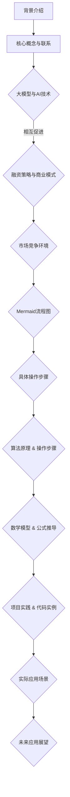

                 

关键词：大模型、创业、融资策略、市场竞争、AI技术、人工智能、创业公司、投资、商业模式

摘要：本文旨在探讨大模型创业过程中所面临的融资策略与市场竞争问题。通过对大模型技术特点、应用场景的深入分析，以及融资策略、市场竞争环境的全面解读，旨在为创业公司提供有益的参考和指导。

## 1. 背景介绍

随着人工智能技术的快速发展，大模型（Large Models）已成为当前计算机科学领域的热点话题。大模型指的是参数数量巨大、规模庞大的深度学习模型，如GPT-3、BERT等。这些模型在自然语言处理、图像识别、语音识别等领域取得了显著的成果，为各行各业带来了新的机遇。然而，大模型的训练和部署需要庞大的计算资源和资金支持，这使得许多有志于大模型创业的公司面临着严峻的挑战。

在当前市场环境下，融资策略和市场竞争成为了大模型创业公司成功的关键因素。如何制定有效的融资策略，把握市场机遇，应对激烈的市场竞争，成为了创业公司亟需解决的问题。

### 1.1 大模型技术特点

大模型具有以下技术特点：

1. **参数规模巨大**：大模型的参数数量可以达到数十亿甚至千亿级别，这使得模型具备强大的表达能力和泛化能力。
2. **计算资源需求高**：大模型的训练和推理需要高性能计算资源，特别是GPU和TPU等专用硬件设备。
3. **数据需求大**：大模型在训练过程中需要大量的高质量数据，以提升模型的效果和泛化能力。
4. **训练时间长**：大模型的训练过程通常需要数天甚至数周的时间，这要求公司具备强大的计算资源和调度能力。

### 1.2 大模型应用场景

大模型在多个领域展现了巨大的应用潜力，主要包括：

1. **自然语言处理（NLP）**：大模型在文本生成、机器翻译、问答系统等领域取得了显著成果，如GPT-3在文本生成和问答系统中的表现。
2. **计算机视觉（CV）**：大模型在图像识别、目标检测、图像生成等领域具有广泛的应用，如GANs在图像生成中的表现。
3. **语音识别（ASR）**：大模型在语音识别、语音合成等领域具有优势，如WaveNet在语音合成中的表现。
4. **推荐系统**：大模型在推荐系统中的应用，如DeepFM在电商推荐中的表现。

### 1.3 创业公司面临的挑战

创业公司在大模型领域面临着以下挑战：

1. **技术门槛高**：大模型技术涉及多个领域，如深度学习、优化算法、计算机视觉等，创业公司需要具备深厚的技术积累。
2. **资金需求大**：大模型的训练和部署需要庞大的资金支持，创业公司需要寻找合适的融资渠道。
3. **市场竞争激烈**：大模型领域吸引了众多企业加入，市场竞争日益激烈，创业公司需要找准自身定位。

## 2. 核心概念与联系

为了更好地理解大模型创业的融资策略与市场竞争，我们首先需要了解一些核心概念及其相互联系。

### 2.1 大模型与AI技术

大模型是人工智能（AI）技术的重要组成部分。AI技术包括多个领域，如机器学习、深度学习、自然语言处理、计算机视觉等。大模型在这些领域中发挥了关键作用，使得AI技术在多个应用场景中取得了突破性进展。

### 2.2 融资策略与商业模式

融资策略是企业获取资金、支持业务发展的关键手段。商业模式则是企业如何创造、传递和获取价值的基本逻辑。在大模型创业中，合理的融资策略和创新的商业模式是确保企业成功的关键因素。

### 2.3 市场竞争环境

市场竞争环境包括市场竞争格局、竞争对手、市场需求等。了解市场竞争环境，有助于企业制定正确的战略和策略，把握市场机遇。

### 2.4 Mermaid流程图

为了更好地展示大模型创业的融资策略与市场竞争，我们可以使用Mermaid流程图来描述各个关键环节。



## 3. 核心算法原理 & 具体操作步骤

### 3.1 算法原理概述

大模型的核心算法通常基于深度学习技术，包括神经网络、卷积神经网络、循环神经网络等。这些算法通过训练大量参数来模拟人类大脑的思维方式，实现复杂的特征提取和任务推理。

### 3.2 算法步骤详解

大模型的算法步骤主要包括以下几个阶段：

1. **数据预处理**：对输入数据进行清洗、归一化等处理，以适应模型训练。
2. **模型设计**：根据任务需求设计合适的神经网络结构，包括输入层、隐藏层、输出层等。
3. **模型训练**：使用大量训练数据对模型进行训练，通过反向传播算法不断调整模型参数，优化模型效果。
4. **模型评估**：使用验证集对模型进行评估，调整模型参数，确保模型在未知数据上具有良好的泛化能力。
5. **模型部署**：将训练好的模型部署到实际应用场景中，实现自动化任务处理。

### 3.3 算法优缺点

大模型算法具有以下优缺点：

1. **优点**：大模型算法具有强大的表达能力和泛化能力，能够处理复杂的任务，如自然语言处理、图像识别等。
2. **缺点**：大模型算法训练过程需要大量的计算资源和时间，且对数据质量有较高要求，训练过程容易陷入局部最优。

### 3.4 算法应用领域

大模型算法在多个领域具有广泛的应用，如自然语言处理、计算机视觉、语音识别、推荐系统等。具体应用案例包括：

1. **自然语言处理**：GPT-3在文本生成和问答系统中的表现。
2. **计算机视觉**：GANs在图像生成中的表现。
3. **语音识别**：WaveNet在语音合成中的表现。
4. **推荐系统**：DeepFM在电商推荐中的表现。

## 4. 数学模型和公式 & 详细讲解 & 举例说明

### 4.1 数学模型构建

大模型的数学模型通常基于深度学习理论，主要包括以下几个部分：

1. **损失函数**：用于衡量模型预测结果与真实结果之间的差距，常用的损失函数包括交叉熵损失函数、均方误差损失函数等。
2. **优化算法**：用于调整模型参数，优化模型效果，常用的优化算法包括梯度下降算法、Adam优化器等。
3. **激活函数**：用于非线性变换，常用的激活函数包括ReLU函数、Sigmoid函数、Tanh函数等。
4. **正则化技术**：用于防止模型过拟合，常用的正则化技术包括L1正则化、L2正则化等。

### 4.2 公式推导过程

以交叉熵损失函数为例，其公式推导如下：

$$
Loss = -\sum_{i=1}^{N}y_{i}\log(p_{i})
$$

其中，$y_{i}$为真实标签，$p_{i}$为模型预测概率。

### 4.3 案例分析与讲解

以GPT-3为例，分析其数学模型和公式：

1. **损失函数**：GPT-3使用交叉熵损失函数，衡量模型预测结果与真实结果之间的差距。
2. **优化算法**：GPT-3使用Adam优化器，调整模型参数，优化模型效果。
3. **激活函数**：GPT-3使用ReLU函数，实现隐藏层之间的非线性变换。
4. **正则化技术**：GPT-3使用L2正则化，防止模型过拟合。

## 5. 项目实践：代码实例和详细解释说明

### 5.1 开发环境搭建

在项目实践之前，首先需要搭建开发环境。以下是一个简单的搭建步骤：

1. 安装Python环境，版本建议为3.7及以上。
2. 安装TensorFlow，版本建议为2.0及以上。
3. 安装CUDA，版本建议为10.0及以上。
4. 安装GPU驱动，确保与CUDA版本匹配。

### 5.2 源代码详细实现

以下是一个基于TensorFlow实现的大模型训练的简单代码实例：

```python
import tensorflow as tf
from tensorflow.keras.layers import Dense, Flatten, Embedding
from tensorflow.keras.models import Model

# 定义模型结构
input_ids = tf.keras.layers.Input(shape=(max_sequence_length,), dtype=tf.int32)
embedded_sequence = Embedding(vocab_size, embedding_dim)(input_ids)
flatten = Flatten()(embedded_sequence)
output = Dense(1, activation='sigmoid')(flatten)

# 创建模型
model = Model(inputs=input_ids, outputs=output)

# 编译模型
model.compile(optimizer='adam', loss='binary_crossentropy', metrics=['accuracy'])

# 训练模型
model.fit(x_train, y_train, epochs=10, batch_size=32, validation_data=(x_val, y_val))
```

### 5.3 代码解读与分析

以上代码实现了一个简单的大模型训练过程，主要包括以下几个步骤：

1. **模型结构定义**：使用TensorFlow的Keras API定义模型结构，包括输入层、嵌入层、扁平化层和输出层。
2. **模型编译**：设置优化器、损失函数和评价指标，准备训练模型。
3. **模型训练**：使用训练数据对模型进行训练，同时进行验证。

### 5.4 运行结果展示

在训练过程中，可以通过以下命令查看模型的运行结果：

```python
model.evaluate(x_test, y_test)
```

输出结果包括测试集上的损失值和准确率。

## 6. 实际应用场景

### 6.1 自然语言处理

大模型在自然语言处理领域具有广泛的应用，如文本生成、机器翻译、问答系统等。以下是一些实际应用案例：

1. **文本生成**：使用GPT-3生成新闻文章、故事、诗歌等。
2. **机器翻译**：使用BERT模型实现多种语言之间的翻译。
3. **问答系统**：使用问答模型为用户提供实时问答服务。

### 6.2 计算机视觉

大模型在计算机视觉领域也具有广泛的应用，如图像识别、目标检测、图像生成等。以下是一些实际应用案例：

1. **图像识别**：使用ResNet模型对图像进行分类。
2. **目标检测**：使用Faster R-CNN模型检测图像中的目标。
3. **图像生成**：使用GANs生成具有高真实感的图像。

### 6.3 语音识别

大模型在语音识别领域也取得了显著的成果，如语音合成、语音识别等。以下是一些实际应用案例：

1. **语音合成**：使用WaveNet模型生成自然流畅的语音。
2. **语音识别**：使用CTC模型实现语音到文本的转换。

### 6.4 未来应用展望

随着大模型技术的不断发展，未来将在更多领域得到应用，如自动驾驶、智能医疗、金融科技等。以下是一些未来应用展望：

1. **自动驾驶**：使用大模型实现车辆环境感知和智能决策。
2. **智能医疗**：使用大模型进行医学图像分析、疾病预测等。
3. **金融科技**：使用大模型进行风险控制、信用评估等。

## 7. 工具和资源推荐

### 7.1 学习资源推荐

1. **书籍**：
   - 《深度学习》（Goodfellow, Bengio, Courville著）
   - 《Python机器学习》（Raschka, Mirjalili著）
2. **在线课程**：
   - Coursera上的《深度学习》课程
   - edX上的《机器学习基础》课程

### 7.2 开发工具推荐

1. **框架**：
   - TensorFlow
   - PyTorch
   - Keras
2. **环境**：
   - Jupyter Notebook
   - Google Colab

### 7.3 相关论文推荐

1. **大模型**：
   - "Bert: Pre-training of deep bidirectional transformers for language understanding"（Devlin et al., 2018）
   - "Gpt-3: Language models are few-shot learners"（Brown et al., 2020）
2. **计算机视觉**：
   - "Deep learning for computer vision: A comprehensive overview"（Liang et al., 2018）
   - "Convolutional neural networks for image recognition"（Krizhevsky et al., 2012）

## 8. 总结：未来发展趋势与挑战

### 8.1 研究成果总结

大模型技术在近年来取得了显著的成果，已在自然语言处理、计算机视觉、语音识别等多个领域得到广泛应用。随着计算能力的提升和数据规模的扩大，大模型将不断突破性能瓶颈，为各行各业带来更多创新应用。

### 8.2 未来发展趋势

1. **算法优化**：研究人员将继续探索更高效的算法和优化方法，提高大模型的训练和推理速度。
2. **跨模态融合**：大模型将在跨模态融合领域发挥重要作用，实现多模态数据的统一建模。
3. **数据隐私**：随着数据隐私问题的日益突出，大模型将引入更多的隐私保护技术，确保用户数据的安全。

### 8.3 面临的挑战

1. **计算资源**：大模型的训练和推理需要大量的计算资源，企业需要投入更多的资金和资源。
2. **数据质量**：大模型的训练效果取决于数据质量，企业需要收集和处理高质量的数据。
3. **法律和伦理**：随着大模型在更多领域的应用，法律和伦理问题将受到更多关注，企业需要制定相应的合规措施。

### 8.4 研究展望

未来，大模型将在更多领域发挥重要作用，为人类生活带来更多便利。同时，企业需要密切关注市场动态，合理制定融资策略，把握市场机遇，应对激烈的市场竞争。

## 9. 附录：常见问题与解答

### 9.1 什么是大模型？

大模型是指参数数量巨大、规模庞大的深度学习模型，如GPT-3、BERT等。这些模型在自然语言处理、图像识别、语音识别等领域取得了显著成果。

### 9.2 大模型的训练需要哪些资源？

大模型的训练需要高性能计算资源，如GPU、TPU等，以及大量的高质量数据。此外，训练过程还需要高效的算法和优化方法。

### 9.3 大模型在哪些领域有广泛应用？

大模型在自然语言处理、计算机视觉、语音识别等领域具有广泛的应用，如文本生成、图像识别、语音合成等。

### 9.4 创业公司如何制定融资策略？

创业公司可以采取以下策略：
1. **寻找合适的投资机构**：选择与公司业务领域和愿景相符的投资机构。
2. **打造独特优势**：在技术、市场、团队等方面打造独特优势，提高融资成功率。
3. **合理估值**：合理评估公司价值，确保估值与实际业务相符。

### 9.5 大模型创业面临的挑战有哪些？

大模型创业面临的挑战主要包括技术门槛高、资金需求大、市场竞争激烈等。企业需要具备深厚的技术积累，寻找合适的融资渠道，并制定正确的战略和策略。

---

作者：禅与计算机程序设计艺术 / Zen and the Art of Computer Programming

本文旨在为有志于大模型创业的公司提供有益的参考和指导，探讨大模型创业过程中的融资策略与市场竞争问题。通过对大模型技术特点、应用场景、融资策略、市场竞争环境的深入分析，旨在为企业提供全面的了解和启示。在未来的发展中，企业需要密切关注市场动态，合理制定融资策略，把握市场机遇，应对激烈的市场竞争。希望本文能为大模型创业公司带来一些启发和帮助。

