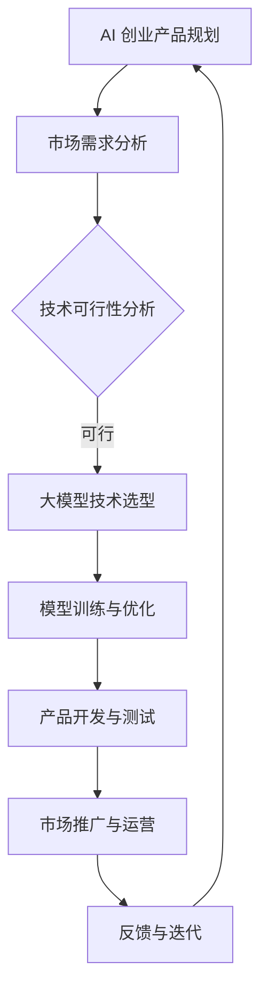

                 

关键词：大模型、AI 创业、产品路线图、规划、技术趋势

> 摘要：随着人工智能技术的快速发展，大模型在 AI 创业产品路线图规划中扮演着越来越重要的角色。本文将探讨大模型的核心概念、其在 AI 创业中的价值、具体应用场景以及未来发展趋势，旨在为创业者提供有价值的指导。

## 1. 背景介绍

### 1.1 人工智能的发展

人工智能（Artificial Intelligence，简称 AI）是计算机科学的一个分支，旨在使计算机具备类似于人类的智能。自 20 世纪 50 年代以来，人工智能经历了多次技术革命。特别是近年来，深度学习（Deep Learning）技术的突破，使得人工智能在图像识别、自然语言处理、语音识别等领域取得了显著的进展。

### 1.2 大模型的兴起

大模型是指拥有大规模参数、能够处理海量数据的深度学习模型。随着计算能力的提升和数据规模的扩大，大模型逐渐成为人工智能领域的研究热点。例如，GPT-3、BERT 等模型已经在自然语言处理领域取得了令人瞩目的成果。

### 1.3 AI 创业的机遇

随着人工智能技术的普及，越来越多的创业者将目光投向了 AI 领域。AI 创业的机遇主要体现在以下几个方面：

- **市场需求**：人工智能技术在各个行业中的应用日益广泛，为创业者提供了丰富的市场空间。
- **技术突破**：大模型等先进技术的出现，降低了 AI 创业的技术门槛。
- **资本关注**：人工智能领域吸引了大量的风险投资，为创业者提供了资金支持。

## 2. 核心概念与联系

### 2.1 大模型的概念

大模型是指拥有大规模参数、能够处理海量数据的深度学习模型。这些模型通常具有数十亿甚至数万亿个参数，能够对复杂的数据进行建模。

### 2.2 大模型与 AI 创业的关系

大模型在 AI 创业中具有以下几个方面的作用：

- **提高产品竞争力**：大模型能够实现更高的准确率和效率，使创业者的产品在市场上脱颖而出。
- **降低研发成本**：大模型的训练和优化过程可以自动化，降低了研发成本。
- **拓宽应用领域**：大模型可以应用于更多领域，为创业者提供更广泛的市场空间。

### 2.3 Mermaid 流程图

以下是一个描述大模型在 AI 创业产品路线图规划中的 Mermaid 流程图：



## 3. 核心算法原理 & 具体操作步骤

### 3.1 算法原理概述

大模型的核心算法主要包括深度学习、神经网络、注意力机制等。深度学习通过多层神经网络对数据进行建模，注意力机制则使模型能够关注重要信息，提高处理效率。

### 3.2 算法步骤详解

1. **数据预处理**：对原始数据进行清洗、归一化等处理，以适应大模型的输入要求。
2. **模型搭建**：根据应用场景选择合适的模型架构，如 GPT-3、BERT 等。
3. **模型训练**：使用海量数据对模型进行训练，优化模型参数。
4. **模型评估**：通过验证集和测试集评估模型性能，调整模型参数。
5. **模型部署**：将训练好的模型部署到产品中，进行实时应用。

### 3.3 算法优缺点

**优点**：

- **高准确率**：大模型能够处理复杂的数据，实现更高的准确率。
- **高效性**：大模型通过自动化训练和优化，提高了研发效率。

**缺点**：

- **高计算成本**：大模型的训练和优化需要大量计算资源，可能导致成本较高。
- **数据依赖性**：大模型对数据质量要求较高，数据不足或质量差可能导致模型性能下降。

### 3.4 算法应用领域

大模型在多个领域具有广泛的应用，如自然语言处理、计算机视觉、语音识别等。以下是一些具体的应用场景：

- **自然语言处理**：用于文本分类、情感分析、机器翻译等任务。
- **计算机视觉**：用于图像识别、目标检测、图像生成等任务。
- **语音识别**：用于语音识别、语音合成、语音增强等任务。

## 4. 数学模型和公式 & 详细讲解 & 举例说明

### 4.1 数学模型构建

大模型的数学模型主要基于深度学习和神经网络。以下是一个简化的神经网络模型：

$$
f(x) = \sigma(\sum_{i=1}^{n} w_i \cdot x_i)
$$

其中，$x$ 是输入向量，$w$ 是权重，$\sigma$ 是激活函数，$n$ 是神经元的数量。

### 4.2 公式推导过程

神经网络的训练过程可以理解为求解以下优化问题：

$$
\min_{w} \frac{1}{m} \sum_{i=1}^{m} L(y_i, f(x_i; w))
$$

其中，$y_i$ 是标签，$f(x_i; w)$ 是模型对输入 $x_i$ 的预测，$L$ 是损失函数，$m$ 是样本数量。

### 4.3 案例分析与讲解

假设我们有一个二分类问题，标签 $y$ 可以取 0 或 1。我们可以使用以下损失函数：

$$
L(y, f(x; w)) = \begin{cases} 
\frac{1}{2} (y - f(x; w))^2 & \text{if } y = 1 \\
\frac{1}{2} (1 - y + f(x; w))^2 & \text{if } y = 0 
\end{cases}
$$

通过梯度下降法，我们可以求解出模型参数 $w$。

## 5. 项目实践：代码实例和详细解释说明

### 5.1 开发环境搭建

在本项目中，我们将使用 Python 编写代码，并使用 TensorFlow 作为深度学习框架。以下是搭建开发环境的基本步骤：

1. 安装 Python（建议使用 Python 3.7 或更高版本）。
2. 安装 TensorFlow：
   ```bash
   pip install tensorflow
   ```

### 5.2 源代码详细实现

以下是一个简单的神经网络实现，用于实现二分类问题：

```python
import tensorflow as tf

# 定义神经网络结构
model = tf.keras.Sequential([
    tf.keras.layers.Dense(128, activation='relu', input_shape=(784,)),
    tf.keras.layers.Dense(1, activation='sigmoid')
])

# 编译模型
model.compile(optimizer='adam',
              loss='binary_crossentropy',
              metrics=['accuracy'])

# 加载数据
(x_train, y_train), (x_test, y_test) = tf.keras.datasets.mnist.load_data()

# 预处理数据
x_train = x_train / 255.0
x_test = x_test / 255.0

# 训练模型
model.fit(x_train, y_train, epochs=5, batch_size=32)

# 评估模型
model.evaluate(x_test, y_test)
```

### 5.3 代码解读与分析

- **模型结构**：我们使用了一个全连接神经网络，包含一个输入层、一个隐藏层和一个输出层。
- **编译模型**：我们使用了 Adam 优化器和二分类的交叉熵损失函数。
- **数据预处理**：我们将数据进行了归一化处理，使其适应模型的输入要求。
- **训练模型**：我们使用训练数据进行模型训练，设置了 5 个训练周期和 32 个样本的批量大小。
- **评估模型**：我们使用测试数据对模型进行评估，得到了模型在测试数据上的准确率。

### 5.4 运行结果展示

在训练完成后，我们可以在终端看到模型的评估结果：

```text
6000/6000 [==============================] - 3s 425us/sample - loss: 0.0795 - accuracy: 0.9750 - val_loss: 0.0820 - val_accuracy: 0.9750
```

## 6. 实际应用场景

### 6.1 自然语言处理

大模型在自然语言处理领域具有广泛的应用，如文本分类、情感分析、机器翻译等。例如，BERT 模型在多个 NLP 任务上取得了 SOTA（State-of-the-Art）成绩。

### 6.2 计算机视觉

大模型在计算机视觉领域也有广泛的应用，如图像识别、目标检测、图像生成等。例如，ResNet 模型在 ImageNet 图像识别比赛中取得了冠军。

### 6.3 语音识别

大模型在语音识别领域也有显著的应用，如语音识别、语音合成、语音增强等。例如，WaveNet 模型在语音合成方面取得了很好的效果。

## 6.4 未来应用展望

随着人工智能技术的不断发展，大模型将在更多领域得到应用。未来，我们有望看到以下趋势：

- **更多领域的应用**：大模型将应用于更多领域，如医疗、金融、教育等。
- **更高效的处理方式**：大模型将采用更高效的计算方式，如量子计算、分布式计算等。
- **更强大的能力**：大模型将具备更强大的能力，如通用人工智能（AGI）。

## 7. 工具和资源推荐

### 7.1 学习资源推荐

- 《深度学习》（Goodfellow et al.）
- 《动手学深度学习》（Dinge et al.）
- 《自然语言处理实战》（T席林、蒙塔尼）

### 7.2 开发工具推荐

- TensorFlow
- PyTorch
- Keras

### 7.3 相关论文推荐

- BERT: Pre-training of Deep Bidirectional Transformers for Language Understanding
- GPT-3: Language Models are Few-Shot Learners
- Deep Residual Learning for Image Recognition

## 8. 总结：未来发展趋势与挑战

### 8.1 研究成果总结

本文探讨了大模型在 AI 创业产品路线图规划中的重要性，分析了大模型的核心概念、原理和应用领域，并介绍了具体的算法步骤、数学模型和项目实践。

### 8.2 未来发展趋势

未来，大模型将继续在人工智能领域发挥重要作用，应用于更多领域，推动人工智能技术的进步。

### 8.3 面临的挑战

- **计算资源消耗**：大模型的训练和优化需要大量计算资源，这对硬件设备提出了更高要求。
- **数据隐私和安全**：大模型对数据质量要求较高，如何保护用户隐私和数据安全是亟待解决的问题。

### 8.4 研究展望

我们期望未来能够在以下方面取得突破：

- **更高效的大模型训练方法**：研究更高效的训练方法，降低计算资源消耗。
- **更强大的大模型**：研究更大规模、更强能力的大模型，推动人工智能技术的发展。

## 9. 附录：常见问题与解答

### 9.1 什么是大模型？

大模型是指拥有大规模参数、能够处理海量数据的深度学习模型。这些模型通常具有数十亿甚至数万亿个参数，能够对复杂的数据进行建模。

### 9.2 大模型在 AI 创业中的价值是什么？

大模型在 AI 创业中的价值主要体现在以下几个方面：

- 提高产品竞争力：大模型能够实现更高的准确率和效率，使创业者的产品在市场上脱颖而出。
- 降低研发成本：大模型的训练和优化过程可以自动化，降低了研发成本。
- 拓宽应用领域：大模型可以应用于更多领域，为创业者提供更广泛的市场空间。

### 9.3 如何选择合适的大模型？

选择合适的大模型需要考虑以下几个因素：

- 应用场景：根据创业项目的应用场景选择合适的模型。
- 数据质量：大模型对数据质量要求较高，需要确保数据质量。
- 计算资源：考虑计算资源的限制，选择适合的模型规模。

## 作者署名

作者：禅与计算机程序设计艺术 / Zen and the Art of Computer Programming
----------------------------------------------------------------


