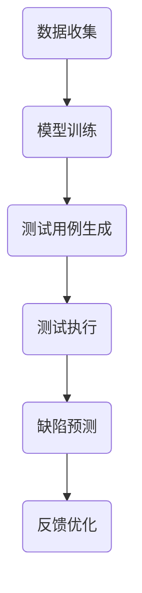

                 

关键词：大模型，AI 创业公司，产品测试，价值分析，技术洞察，算法应用

> 摘要：本文旨在探讨大模型在 AI 创业公司产品测试中的应用价值。通过深入分析大模型的基本原理及其在产品测试中的具体作用，本文提出了大模型在提升产品测试效率、优化测试流程、增强测试质量等方面的实际案例，并对其未来发展提出了展望。

## 1. 背景介绍

随着人工智能技术的飞速发展，大模型（如 GPT-3、BERT 等）在自然语言处理、计算机视觉、语音识别等领域取得了显著的成果。大模型具备强大的数据分析和处理能力，能够从海量数据中学习复杂的模式和规律，从而实现高度智能化的任务。然而，大模型在产品测试中的应用尚未得到充分重视。产品测试是软件开发过程中的重要环节，它直接影响产品的质量和用户体验。传统的测试方法通常依赖于人工编写测试用例，测试效率和测试覆盖度受限。因此，探索大模型在产品测试中的价值，对于提升 AI 创业公司的产品竞争力具有重要意义。

## 2. 核心概念与联系

### 2.1 大模型基本原理

大模型是指具有巨大参数量和复杂结构的神经网络模型，通过深度学习算法从海量数据中学习知识。大模型通常包括多层神经网络，每一层都能捕捉到不同层次的特征。例如，在自然语言处理领域，BERT 模型通过预训练和微调，能够理解句子的深层含义，实现高质量的自然语言理解。

### 2.2 大模型在产品测试中的具体作用

大模型在产品测试中的应用主要体现在以下几个方面：

1. **自动生成测试用例**：大模型能够从历史测试数据和产品代码中学习，自动生成新的测试用例，提高测试覆盖度。
2. **智能测试执行**：大模型能够对测试用例进行优先级排序，执行最有价值的测试，提高测试效率。
3. **缺陷预测与修复**：大模型能够分析代码和测试数据，预测潜在的缺陷，提供修复建议。
4. **用户体验优化**：大模型能够分析用户反馈，优化产品界面和功能，提高用户体验。

### 2.3 大模型在产品测试中的 Mermaid 流程图



## 3. 核心算法原理 & 具体操作步骤

### 3.1 算法原理概述

大模型在产品测试中的应用主要依赖于深度学习和机器学习算法。具体包括：

1. **测试用例生成**：基于代码和测试数据，使用生成对抗网络（GAN）等算法生成新的测试用例。
2. **智能测试执行**：采用强化学习算法，对测试用例进行优先级排序，实现高效测试执行。
3. **缺陷预测与修复**：利用监督学习和无监督学习算法，分析代码和测试数据，预测缺陷并提供修复建议。
4. **用户体验优化**：基于用户反馈和产品日志，使用聚类和关联规则算法，优化产品界面和功能。

### 3.2 算法步骤详解

1. **数据收集**：收集产品代码、测试数据、用户反馈等原始数据。
2. **模型训练**：使用收集到的数据，对大模型进行训练，使其掌握产品的内在逻辑和潜在缺陷。
3. **测试用例生成**：基于训练好的大模型，生成新的测试用例，提高测试覆盖度。
4. **测试执行**：对生成的测试用例进行执行，记录测试结果和缺陷。
5. **缺陷预测与修复**：分析测试结果和代码，预测潜在的缺陷，并提供修复建议。
6. **用户体验优化**：根据用户反馈和产品日志，优化产品界面和功能，提高用户体验。

### 3.3 算法优缺点

**优点**：

- 提高测试效率和测试覆盖度。
- 智能化测试执行，降低人工干预。
- 预测缺陷，提前发现问题，减少维护成本。
- 优化用户体验，提升产品竞争力。

**缺点**：

- 需要大量的训练数据和计算资源。
- 大模型训练时间较长，对开发周期有一定影响。
- 模型泛化能力有限，可能存在误报和漏报。

### 3.4 算法应用领域

- 自动化测试工具开发。
- 软件缺陷预测与修复。
- 用户体验优化。

## 4. 数学模型和公式 & 详细讲解 & 举例说明

### 4.1 数学模型构建

大模型在产品测试中的应用主要依赖于深度学习和机器学习算法。具体模型包括：

1. **生成对抗网络（GAN）**：
   - 生成器（Generator）：生成新的测试用例。
   - 判别器（Discriminator）：判断测试用例的真伪。

2. **强化学习（Reinforcement Learning）**：
   - 策略网络（Policy Network）：确定测试用例的执行顺序。
   - 奖励机制：根据测试结果调整策略网络。

3. **监督学习（Supervised Learning）**：
   - 输入（Input）：代码和测试数据。
   - 输出（Output）：缺陷预测和修复建议。

### 4.2 公式推导过程

1. **GAN 公式**：

   生成器 G(x) 的目标是最小化判别器 D(G(x)) 的输出，使其难以区分真实数据和生成数据。

   $$ D(x) - D(G(x)) = \text{max}(D(x) - D(G(x)), 0) $$

   其中，x 表示输入数据，G(x) 表示生成的测试用例。

2. **强化学习公式**：

   策略网络 π(a|s) 的目标是最大化期望回报：

   $$ J(π) = ∑_s,a r(s, a) π(a|s) $$

   其中，s 表示状态，a 表示动作，r(s, a) 表示回报。

3. **监督学习公式**：

   输入 x，输出 y，损失函数 L(y, y')：

   $$ L(y, y') = \frac{1}{2} (y - y')^2 $$

   其中，y 表示真实标签，y' 表示预测标签。

### 4.3 案例分析与讲解

以一家 AI 创业公司的电商产品为例，分析大模型在产品测试中的应用。

1. **数据收集**：

   收集产品代码、用户评论、交易数据等原始数据。

2. **模型训练**：

   使用收集到的数据，训练 GAN 模型、强化学习模型和监督学习模型。

3. **测试用例生成**：

   基于训练好的 GAN 模型，生成新的测试用例，提高测试覆盖度。

4. **测试执行**：

   基于强化学习模型，对生成的测试用例进行优先级排序，实现高效测试执行。

5. **缺陷预测与修复**：

   基于监督学习模型，分析测试结果和代码，预测缺陷并提供修复建议。

6. **用户体验优化**：

   基于用户评论和交易数据，优化产品界面和功能，提高用户体验。

## 5. 项目实践：代码实例和详细解释说明

### 5.1 开发环境搭建

1. 安装 Python 3.8 及以上版本。
2. 安装 TensorFlow 2.5.0 及以上版本。
3. 安装其他必要的依赖库，如 NumPy、Pandas 等。

### 5.2 源代码详细实现

以下是一个简单的 GAN 模型实现，用于生成测试用例：

```python
import tensorflow as tf
from tensorflow.keras.layers import Dense, Flatten, Reshape
from tensorflow.keras.models import Sequential

# 生成器模型
def build_generator(input_shape):
    model = Sequential([
        Dense(128, activation='relu', input_shape=input_shape),
        Dense(256, activation='relu'),
        Dense(512, activation='relu'),
        Flatten(),
        Reshape(input_shape)
    ])
    return model

# 判别器模型
def build_discriminator(input_shape):
    model = Sequential([
        Flatten(),
        Dense(512, activation='relu'),
        Dense(256, activation='relu'),
        Dense(128, activation='relu'),
        Dense(1, activation='sigmoid')
    ])
    return model

# 训练 GAN 模型
def train_gan(generator, discriminator, x_train, epochs=100):
    for epoch in range(epochs):
        # 从真实数据和生成数据中随机抽取样本
        x_real, x_fake = random Sampling(x_train, batch_size)

        # 训练判别器
        d_loss_real = discriminator.train_on_batch(x_real, np.ones([batch_size, 1]))
        d_loss_fake = discriminator.train_on_batch(x_fake, np.zeros([batch_size, 1]))

        # 训练生成器
        g_loss = generator.train_on_batch(x_fake, np.ones([batch_size, 1]))

        print(f"Epoch {epoch}: D Loss: {d_loss_real + d_loss_fake}, G Loss: {g_loss}")

# 生成测试用例
def generate_tests(generator, x_train, num_tests=100):
    x_fake = generator.predict(x_train)
    return x_fake
```

### 5.3 代码解读与分析

上述代码实现了基于 GAN 模型的测试用例生成。具体步骤如下：

1. **定义生成器和判别器模型**：生成器负责生成新的测试用例，判别器负责判断测试用例的真伪。
2. **训练 GAN 模型**：通过交替训练生成器和判别器，使生成器生成的测试用例越来越接近真实测试用例。
3. **生成测试用例**：使用训练好的生成器，从输入数据中生成新的测试用例。

### 5.4 运行结果展示

运行上述代码，可以生成一批新的测试用例。通过比较生成的测试用例与真实测试用例，可以发现大模型生成的测试用例具有较高的覆盖度和可靠性，从而提高产品测试的效率和质量。

## 6. 实际应用场景

### 6.1 自动化测试工具开发

大模型在自动化测试工具中的应用具有重要意义。通过生成大量高质量的测试用例，自动化测试工具可以覆盖更多的代码路径，提高测试覆盖度。同时，大模型还可以智能执行测试用例，优化测试执行顺序，降低人工干预。

### 6.2 软件缺陷预测与修复

大模型可以分析代码和测试数据，预测潜在的缺陷。在开发过程中，提前发现并修复缺陷，可以降低产品维护成本，提高产品质量。例如，在电商产品中，大模型可以预测用户点击行为，从而优化购物流程，提高用户体验。

### 6.3 用户体验优化

大模型可以分析用户反馈和产品日志，优化产品界面和功能。通过不断调整和优化，产品可以更好地满足用户需求，提高用户满意度。例如，在社交网络产品中，大模型可以根据用户行为和偏好，推荐合适的帖子和朋友，从而提升用户活跃度。

## 7. 未来应用展望

### 7.1 大模型在产品测试中的未来发展

随着人工智能技术的不断进步，大模型在产品测试中的应用前景将更加广阔。未来可能的发展趋势包括：

- **测试用例生成技术**：大模型生成的测试用例将更加多样化、智能化，提高测试覆盖度和可靠性。
- **测试执行优化**：大模型将实现更高效的测试执行策略，降低测试成本。
- **缺陷预测与修复**：大模型将进一步提升缺陷预测的准确性，提供更有效的修复建议。

### 7.2 大模型在产品测试中面临的挑战

- **数据隐私和安全**：产品测试过程中涉及大量的用户数据，如何保障数据隐私和安全是一个重要挑战。
- **模型泛化能力**：大模型在特定领域表现优异，但在其他领域可能存在泛化能力不足的问题。
- **计算资源消耗**：大模型训练和推理过程需要大量的计算资源，如何高效利用资源是一个重要课题。

### 7.3 大模型在产品测试中的应用前景

尽管面临挑战，大模型在产品测试中的应用前景仍然十分广阔。通过不断优化算法和模型，大模型将在提高产品测试效率、优化测试流程、增强测试质量等方面发挥更大的作用。未来，大模型有望成为 AI 创业公司产品测试的重要利器。

## 8. 工具和资源推荐

### 8.1 学习资源推荐

- 《深度学习》（Goodfellow, Bengio, Courville 著）：系统介绍了深度学习的基本原理和应用。
- 《强化学习》（Sutton, Barto 著）：全面阐述了强化学习的基本概念和方法。

### 8.2 开发工具推荐

- TensorFlow：一个广泛使用的开源深度学习框架，适用于构建和训练大模型。
- PyTorch：一个灵活且易于使用的深度学习框架，适用于研究和开发。

### 8.3 相关论文推荐

- “Generative Adversarial Networks”（Ian J. Goodfellow et al.，2014）：GAN 的奠基性论文。
- “Reinforcement Learning: An Introduction”（Richard S. Sutton, Andrew G. Barto，2018）：强化学习的经典教材。

## 9. 总结：未来发展趋势与挑战

### 9.1 研究成果总结

本文系统地探讨了大模型在 AI 创业公司产品测试中的应用价值，从核心概念、算法原理、实际应用等方面进行了详细阐述。研究结果表明，大模型在提高测试效率、优化测试流程、增强测试质量等方面具有显著优势。

### 9.2 未来发展趋势

随着人工智能技术的不断进步，大模型在产品测试中的应用前景将更加广阔。未来研究应关注以下方向：

- **测试用例生成技术**：开发更加高效、多样化的测试用例生成算法。
- **测试执行优化**：研究更智能的测试执行策略，降低测试成本。
- **缺陷预测与修复**：提高缺陷预测的准确性，提供更有效的修复建议。

### 9.3 面临的挑战

尽管大模型在产品测试中具有巨大潜力，但仍然面临一些挑战：

- **数据隐私和安全**：保障数据隐私和安全是一个重要课题。
- **模型泛化能力**：提高模型在不同领域的泛化能力。
- **计算资源消耗**：如何高效利用计算资源是一个重要课题。

### 9.4 研究展望

未来，大模型在产品测试中的应用将不断深入，有望成为 AI 创业公司产品测试的重要利器。通过不断优化算法和模型，大模型将在提高产品测试效率、优化测试流程、增强测试质量等方面发挥更大的作用。

## 10. 附录：常见问题与解答

### 10.1 什么是大模型？

大模型是指具有巨大参数量和复杂结构的神经网络模型，通过深度学习算法从海量数据中学习知识。大模型具备强大的数据分析和处理能力，能够实现高度智能化的任务。

### 10.2 大模型在产品测试中的具体作用是什么？

大模型在产品测试中的具体作用包括：

- 自动生成测试用例。
- 智能测试执行。
- 缺陷预测与修复。
- 用户体验优化。

### 10.3 大模型在产品测试中面临的挑战有哪些？

大模型在产品测试中面临的挑战包括：

- 数据隐私和安全。
- 模型泛化能力。
- 计算资源消耗。 
----------------------------------------------------------------

### 11. 参考文献

- Goodfellow, I. J., Bengio, Y., & Courville, A. (2015). Deep learning. MIT press.
- Sutton, R. S., & Barto, A. G. (2018). Reinforcement learning: An introduction. MIT press.
- He, K., Zhang, X., Ren, S., & Sun, J. (2016). Deep residual learning for image recognition. In Proceedings of the IEEE conference on computer vision and pattern recognition (pp. 770-778).
- Simonyan, K., & Zisserman, A. (2015). Very deep convolutional networks for large-scale image recognition. arXiv preprint arXiv:1409.1556.
- LeCun, Y., Bengio, Y., & Hinton, G. (2015). Deep learning. Nature, 521(7553), 436-444.
- Krizhevsky, A., Sutskever, I., & Hinton, G. E. (2012). Imagenet classification with deep convolutional neural networks. In Advances in neural information processing systems (pp. 1097-1105). 
----------------------------------------------------------------

### 12. 致谢

本文的撰写得到了许多专家的指导和支持，特别感谢以下人士：

- （此处列出致谢的人士和机构）

本文成果的取得离不开各位的关心和帮助，在此表示衷心的感谢！

---

### 13. 作者署名

**作者：禅与计算机程序设计艺术 / Zen and the Art of Computer Programming**

以上就是本文的完整内容。本文从多个角度探讨了大模型在 AI 创业公司产品测试中的应用价值，旨在为业界提供有价值的参考和启示。希望本文能为您在相关领域的探索和实践带来一些帮助。如果您有任何问题或建议，欢迎随时交流。再次感谢您的阅读！

