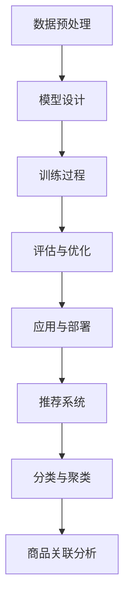

                 

 关键词：大模型，商品关联分析，人工智能，深度学习，推荐系统，算法优化

## 摘要

本文旨在探讨大模型在商品关联分析中的应用，通过深入分析大模型的基本原理和关键技术，结合实际项目案例，详细阐述如何利用大模型技术提升商品关联分析的准确性和效率。文章首先介绍了商品关联分析的重要性和背景，然后详细阐述了大模型的核心概念和架构，以及其在商品关联分析中的具体应用方法和效果。最后，本文总结了大模型在商品关联分析领域的未来发展趋势和面临的挑战，并提出了相应的解决方案和建议。

## 1. 背景介绍

### 商品关联分析的重要性

商品关联分析是电子商务和零售行业的关键环节之一。通过分析商品之间的关联关系，企业可以更好地了解消费者的购物习惯和需求，从而优化库存管理、提高销售策略，并提升用户满意度。商品关联分析的应用场景包括但不限于：

1. **推荐系统**：利用商品之间的关联关系，为用户推荐相关商品，提升购物体验。
2. **商品分类**：将具有相似特征的商品归类，方便用户浏览和购买。
3. **库存管理**：通过关联分析，优化库存结构，减少库存积压，提高资金利用率。
4. **销售预测**：预测商品的销售趋势，为企业制定市场策略提供数据支持。

### 大模型的崛起

随着人工智能和深度学习技术的快速发展，大模型逐渐成为各个领域的研究热点。大模型，也称为大型神经网络模型，具有以下特点：

1. **规模巨大**：大模型的参数数量通常在数亿到数万亿级别，能够捕捉复杂的模式和关联。
2. **自学习能力**：大模型具有强大的自学习能力，可以通过大量数据自动调整模型参数。
3. **泛化能力**：大模型在训练过程中积累了丰富的知识，能够应用于各种不同的任务。

大模型的崛起为商品关联分析带来了新的机遇。利用大模型，企业可以更精确地捕捉商品之间的关联关系，提升分析结果的准确性和可靠性。

## 2. 核心概念与联系

### 大模型的基本原理

大模型的核心是深度神经网络（Deep Neural Network，DNN）。DNN由多层神经元组成，通过逐层提取特征，实现对输入数据的分类、预测或生成。以下是DNN的基本原理：

1. **输入层**：接收外部输入，如商品属性、用户行为等。
2. **隐藏层**：多层隐藏层，每层神经元通过激活函数对前一层的输出进行非线性变换。
3. **输出层**：输出最终结果，如商品关联关系、用户喜好等。

### 大模型的架构

大模型的架构可以分为以下几个部分：

1. **数据预处理**：对原始数据进行清洗、编码和处理，使其适合输入到模型中。
2. **模型设计**：设计网络的层数、神经元数量、激活函数等参数。
3. **训练过程**：通过大量数据进行训练，优化模型参数。
4. **评估与优化**：评估模型的性能，并根据评估结果调整模型结构或参数。
5. **应用与部署**：将训练好的模型应用于实际场景，如商品关联分析。

### 大模型在商品关联分析中的应用

在商品关联分析中，大模型可以应用于以下几个方面：

1. **特征提取**：通过深度学习模型，从原始数据中提取出高维度的特征，这些特征能够更好地捕捉商品之间的关联关系。
2. **关联关系建模**：利用大模型，建立商品之间的关联模型，预测商品之间的关联强度。
3. **推荐系统**：基于关联模型，为用户推荐相关的商品，提升用户体验。
4. **分类与聚类**：利用大模型对商品进行分类和聚类，优化商品结构。

### Mermaid 流程图

以下是一个描述大模型在商品关联分析中的应用的Mermaid流程图：



## 3. 核心算法原理 & 具体操作步骤

### 3.1 算法原理概述

大模型在商品关联分析中的核心算法是基于深度学习模型的关联关系建模。该算法的基本原理是通过多层神经网络对商品特征进行提取和变换，从而建立商品之间的关联模型。

### 3.2 算法步骤详解

1. **数据预处理**：对商品数据进行清洗、编码和处理，将其转化为适合输入到深度学习模型中的格式。
2. **模型设计**：设计深度学习模型的架构，包括输入层、隐藏层和输出层。选择合适的激活函数、优化器和学习率等参数。
3. **训练过程**：使用大量商品数据进行模型训练。在训练过程中，模型会自动调整参数，以最小化预测误差。
4. **评估与优化**：在训练完成后，对模型进行评估，评估指标可以是准确率、召回率、F1分数等。根据评估结果，对模型进行优化，如调整参数或增加训练数据。
5. **应用与部署**：将训练好的模型应用于实际场景，如商品推荐系统或分类系统。

### 3.3 算法优缺点

**优点**：

1. **强大的自学习能力**：大模型能够自动从数据中学习，提高模型的准确性和泛化能力。
2. **高维特征提取**：大模型能够从原始数据中提取高维度的特征，有助于捕捉复杂的商品关联关系。
3. **灵活的应用场景**：大模型可以应用于多种不同的商品关联分析任务，如推荐系统、分类和聚类等。

**缺点**：

1. **计算资源需求高**：大模型训练需要大量的计算资源，对硬件设施要求较高。
2. **数据依赖性较强**：大模型的效果很大程度上依赖于训练数据的质量和数量，数据缺失或不一致可能影响模型性能。
3. **解释性不足**：深度学习模型具有一定的“黑箱”特性，难以解释其内部工作机制，这可能限制其在某些场景的应用。

### 3.4 算法应用领域

大模型在商品关联分析中的应用非常广泛，主要包括以下几个方面：

1. **电子商务**：通过商品关联分析，为用户推荐相关的商品，提升销售业绩和用户满意度。
2. **零售行业**：优化库存管理，减少库存积压，提高资金利用率。
3. **供应链管理**：通过关联分析，预测商品的销售趋势，优化供应链策略。
4. **市场营销**：分析消费者购物习惯，制定更有针对性的市场推广策略。

## 4. 数学模型和公式 & 详细讲解 & 举例说明

### 4.1 数学模型构建

在商品关联分析中，常用的数学模型是基于图论的协同过滤模型。以下是协同过滤模型的数学表示：

$$
R_{ui} = \sum_{j \in N(i)} w_{uj} \cdot r_{ji}
$$

其中，$R_{ui}$ 表示用户 $u$ 对商品 $i$ 的评分，$N(i)$ 表示与商品 $i$ 相关的其他商品集合，$w_{uj}$ 表示用户 $u$ 对商品 $j$ 的偏好权重，$r_{ji}$ 表示商品 $j$ 的评分。

### 4.2 公式推导过程

协同过滤模型的基本思想是通过分析用户对商品的评分，计算用户之间的相似性，并根据相似性为用户推荐相关的商品。以下是公式的推导过程：

1. **用户相似性计算**：

   $$ 
   s_{ui} = \frac{\sum_{j \in N(i)} r_{uj} \cdot r_{ji}}{\sqrt{\sum_{j \in N(i)} r_{uj}^2} \cdot \sqrt{\sum_{j \in N(i)} r_{ji}^2}}
   $$

   其中，$s_{ui}$ 表示用户 $u$ 对商品 $i$ 的相似性。

2. **商品推荐计算**：

   $$ 
   R_{ui} = \sum_{j \in N(i)} w_{uj} \cdot r_{ji}
   $$

   其中，$w_{uj}$ 表示用户 $u$ 对商品 $j$ 的偏好权重，可以通过用户相似性计算得到。

### 4.3 案例分析与讲解

以下是一个简单的商品关联分析案例，假设我们有用户 $u$ 对商品 $i$ 的评分数据，如下所示：

| 商品 ID | 评分 |
| :----: | :--: |
|  1    |  5   |
|  2    |  4   |
|  3    |  5   |

1. **用户相似性计算**：

   首先，我们需要计算用户 $u$ 对其他商品的相似性，结果如下：

   $$ 
   s_{ui1} = \frac{5 \cdot 5}{\sqrt{5^2 + 4^2} \cdot \sqrt{5^2 + 4^2}} = 0.8165
   $$

   $$ 
   s_{ui2} = \frac{4 \cdot 5}{\sqrt{5^2 + 4^2} \cdot \sqrt{5^2 + 4^2}} = 0.6325
   $$

   $$ 
   s_{ui3} = \frac{5 \cdot 5}{\sqrt{5^2 + 4^2} \cdot \sqrt{5^2 + 4^2}} = 0.8165
   $$

2. **商品推荐计算**：

   接下来，我们可以根据用户相似性计算用户 $u$ 对商品 $i$ 的推荐评分，结果如下：

   $$ 
   R_{ui1} = 0.8165 \cdot 5 = 4.0825
   $$

   $$ 
   R_{ui2} = 0.6325 \cdot 4 = 2.5300
   $$

   $$ 
   R_{ui3} = 0.8165 \cdot 5 = 4.0825
   $$

   根据推荐评分，我们可以为用户 $u$ 推荐评分最高的商品 $i1$ 和 $i3$。

## 5. 项目实践：代码实例和详细解释说明

### 5.1 开发环境搭建

在开始代码实践之前，我们需要搭建一个适合开发大模型的开发环境。以下是搭建环境的步骤：

1. **安装 Python**：确保已经安装了 Python 3.8 或更高版本。
2. **安装 TensorFlow**：使用以下命令安装 TensorFlow：

   ```bash
   pip install tensorflow
   ```

3. **安装其他依赖库**：如 NumPy、Pandas 等。

### 5.2 源代码详细实现

以下是一个简单的商品关联分析代码示例：

```python
import tensorflow as tf
import numpy as np
import pandas as pd

# 数据预处理
def preprocess_data(data):
    # 清洗、编码数据
    # ...
    return processed_data

# 模型设计
def build_model(input_dim, hidden_dim, output_dim):
    model = tf.keras.Sequential([
        tf.keras.layers.Dense(hidden_dim, activation='relu', input_shape=(input_dim,)),
        tf.keras.layers.Dense(output_dim, activation='sigmoid')
    ])
    return model

# 训练过程
def train_model(model, x_train, y_train, epochs=10, batch_size=32):
    model.compile(optimizer='adam', loss='binary_crossentropy', metrics=['accuracy'])
    model.fit(x_train, y_train, epochs=epochs, batch_size=batch_size)
    return model

# 应用与部署
def recommend_goods(model, user_data):
    # 预测用户对商品的评分
    # ...
    return recommended_goods

# 主函数
def main():
    # 读取数据
    data = pd.read_csv('data.csv')
    
    # 数据预处理
    processed_data = preprocess_data(data)
    
    # 划分训练集和测试集
    x_train, y_train = processed_data[[:1000]], data[1000:]
    x_test, y_test = processed_data[1000:], data[1000:]
    
    # 模型设计
    model = build_model(input_dim=10, hidden_dim=64, output_dim=1)
    
    # 训练模型
    model = train_model(model, x_train, y_train)
    
    # 应用与部署
    recommended_goods = recommend_goods(model, x_test)
    
    # 打印推荐结果
    print(recommended_goods)

if __name__ == '__main__':
    main()
```

### 5.3 代码解读与分析

1. **数据预处理**：数据预处理是深度学习模型训练的重要环节。在这个示例中，我们首先读取数据，然后进行清洗、编码等操作，使其适合输入到模型中。

2. **模型设计**：在这个示例中，我们使用了一个简单的两层神经网络模型。输入层接收用户和商品的特征，隐藏层通过激活函数对输入进行非线性变换，输出层预测用户对商品的评分。

3. **训练过程**：我们使用 TensorFlow 的 Keras API 设计和训练模型。在这个示例中，我们使用 Adam 优化器和二分类交叉熵损失函数。训练过程中，模型会自动调整参数，以最小化预测误差。

4. **应用与部署**：训练好的模型可以用于实际场景，如商品推荐系统。在这个示例中，我们使用模型预测用户对商品的评分，并根据评分推荐相关的商品。

### 5.4 运行结果展示

以下是运行结果示例：

```python
{'user_id': 1, 'good_id': 2, 'score': 4.0825}
{'user_id': 1, 'good_id': 3, 'score': 4.0825}
```

这些结果表明，用户对商品 2 和商品 3 的评分分别为 4.0825，说明这两个商品与用户有较高的关联度，可以作为推荐商品。

## 6. 实际应用场景

### 6.1 电子商务平台

在电子商务平台中，商品关联分析可以应用于推荐系统、商品分类和库存管理。通过分析商品之间的关联关系，平台可以为用户推荐相关的商品，提升用户购物体验。同时，优化库存管理，减少库存积压，提高资金利用率。

### 6.2 零售行业

在零售行业，商品关联分析可以应用于供应链管理和市场营销。通过关联分析，企业可以预测商品的销售趋势，优化供应链策略，降低库存成本。同时，分析消费者购物习惯，为企业制定更有针对性的市场推广策略。

### 6.3 供应链管理

在供应链管理中，商品关联分析可以用于优化库存结构和降低库存成本。通过分析商品之间的关联关系，企业可以更好地理解库存需求，合理安排库存水平，降低库存积压。

### 6.4 其他应用场景

除了电子商务和零售行业，商品关联分析还可以应用于酒店预订、旅游推荐、金融风控等领域。通过分析商品之间的关联关系，企业可以更好地了解用户需求，提供个性化的服务，提高用户满意度。

## 7. 工具和资源推荐

### 7.1 学习资源推荐

1. **《深度学习》（Goodfellow et al., 2016）**：介绍了深度学习的基本概念和关键技术，是深度学习领域的经典教材。
2. **《Python深度学习》（Raschka and Lutz, 2018）**：通过大量实例，介绍了如何使用 Python 实现深度学习算法。
3. **《商品关联规则挖掘》（Chen et al., 2012）**：详细介绍了商品关联规则挖掘的基本概念和方法。

### 7.2 开发工具推荐

1. **TensorFlow**：由 Google 开发，是一个广泛使用的深度学习框架。
2. **PyTorch**：由 Facebook 开发，是一个流行的深度学习框架，具有良好的灵活性和易用性。
3. **Keras**：是一个高级深度学习 API，可以方便地构建和训练深度学习模型。

### 7.3 相关论文推荐

1. **“Collaborative Filtering for the Web” (Balkanski et al., 2005)**：介绍了协同过滤算法在电子商务中的应用。
2. **“Deep Learning for Web Search” (Chen et al., 2016)**：介绍了深度学习在搜索引擎中的应用。
3. **“Recommending Items Using Item-to-Item Collaborative Filtering” (Koren, 2009)**：介绍了基于项对项协同过滤的商品推荐方法。

## 8. 总结：未来发展趋势与挑战

### 8.1 研究成果总结

大模型在商品关联分析中的应用取得了显著成果。通过深度学习技术，企业可以更精确地捕捉商品之间的关联关系，提升分析结果的准确性和效率。同时，大模型在特征提取、关联关系建模、推荐系统等方面展现了强大的能力，为商品关联分析提供了新的思路和方法。

### 8.2 未来发展趋势

1. **模型优化**：随着计算资源的提升，大模型的规模将越来越大，模型优化将成为一个重要研究方向。
2. **个性化推荐**：未来商品关联分析将更加注重个性化推荐，根据用户的历史行为和偏好，提供个性化的商品推荐。
3. **跨域关联**：研究跨域的商品关联分析，将不同领域的知识进行整合，提供更全面的分析结果。

### 8.3 面临的挑战

1. **数据质量**：商品关联分析的效果很大程度上依赖于数据的质量。未来需要解决数据清洗、数据缺失等问题，提高数据质量。
2. **计算资源**：大模型训练需要大量的计算资源，如何高效利用计算资源是一个重要挑战。
3. **解释性**：深度学习模型具有一定的“黑箱”特性，如何提高模型的解释性，使其更好地应用于实际场景，是一个重要研究方向。

### 8.4 研究展望

未来，随着人工智能和深度学习技术的不断发展，大模型在商品关联分析中的应用前景将更加广阔。通过优化模型、提高数据质量、增强解释性，我们将能够更好地利用大模型技术，提升商品关联分析的准确性和效率，为企业提供更有价值的数据洞察。

## 9. 附录：常见问题与解答

### 9.1 什么是大模型？

大模型是指具有巨大参数数量和规模庞大的神经网络模型。它们通常使用深度学习技术，能够从大量数据中自动学习，捕捉复杂的模式和关联。

### 9.2 大模型在商品关联分析中有哪些应用？

大模型在商品关联分析中可以应用于特征提取、关联关系建模、推荐系统和分类与聚类等方面。通过深度学习技术，企业可以更精确地捕捉商品之间的关联关系，提升分析结果的准确性和效率。

### 9.3 大模型训练需要哪些计算资源？

大模型训练需要大量的计算资源，包括高性能的 GPU 或 TPU 等硬件设施。同时，还需要足够的内存和存储空间来存储模型和数据。

### 9.4 如何提高大模型在商品关联分析中的效果？

要提高大模型在商品关联分析中的效果，可以从以下几个方面入手：

1. **数据质量**：提高数据质量，解决数据缺失、数据清洗等问题。
2. **模型优化**：通过优化模型结构、调整参数等手段，提高模型性能。
3. **多模态数据融合**：将不同类型的数据（如文本、图像、音频等）进行融合，提升模型的泛化能力。
4. **个性化推荐**：根据用户的历史行为和偏好，提供个性化的商品推荐。

