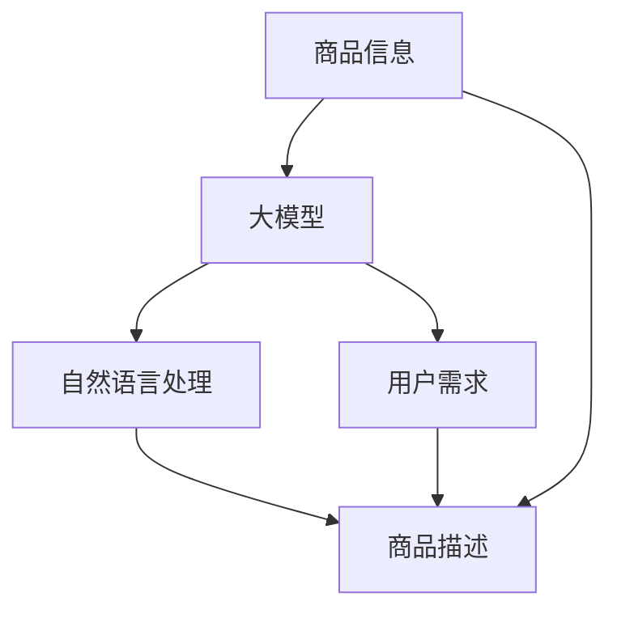

                 

关键词：大模型，商品描述，生成模型，自然语言处理，应用场景

<|assistant|>摘要：本文将探讨大模型在商品描述生成中的应用，从背景介绍、核心概念与联系、核心算法原理、数学模型与公式、项目实践、实际应用场景、未来应用展望、工具和资源推荐以及总结未来发展趋势与挑战等多个方面，全面阐述大模型在商品描述生成中的重要性及其应用前景。

## 1. 背景介绍

随着互联网和电子商务的快速发展，商品描述在电子商务中扮演着至关重要的角色。一个好的商品描述不仅能够吸引消费者的注意力，还能够有效传达商品的特点和优势，从而提高销售量和用户满意度。然而，撰写高质量的商品描述需要大量的人力和时间，且容易受到主观因素的影响。因此，如何自动化地生成商品描述成为了业界关注的焦点。

近年来，随着人工智能技术的不断发展，大模型在自然语言处理领域取得了显著成果。大模型具有强大的语义理解和生成能力，能够生成更加自然、流畅和具有个性化的文本。这使得大模型在商品描述生成中具有巨大的潜力。本文将围绕大模型在商品描述生成中的应用，探讨其技术原理、实现方法、实际应用场景以及未来发展趋势。

## 2. 核心概念与联系

在大模型应用于商品描述生成的过程中，需要理解以下几个核心概念：

1. **商品描述生成**：指利用自然语言处理技术和算法，自动生成商品描述的过程。

2. **大模型**：指具有巨大参数量和强大语义理解能力的人工神经网络模型，如Transformer、BERT等。

3. **自然语言处理（NLP）**：指计算机科学领域与人工智能领域中的一个分支，涉及对文本数据进行分析、理解、处理和生成。

4. **商品信息**：指与商品相关的各种信息，如商品名称、品牌、类别、特点、用途等。

5. **用户需求**：指消费者在购买商品时关注的特点和需求，如性价比、外观、功能、口碑等。

### Mermaid 流程图

下面是一个用于展示大模型在商品描述生成中各环节联系的 Mermaid 流程图：



在这个流程图中，商品信息和用户需求作为输入，通过大模型和自然语言处理技术的处理，最终生成具有针对性的商品描述。

## 3. 核心算法原理 & 具体操作步骤

### 3.1 算法原理概述

大模型在商品描述生成中的核心算法原理主要基于以下两个方面：

1. **预训练**：大模型通过在大规模语料库上进行预训练，学习到丰富的语言知识和语义信息。

2. **微调**：在预训练的基础上，针对特定领域的商品描述任务，对模型进行微调，使其适应特定场景。

### 3.2 算法步骤详解

大模型在商品描述生成中的具体操作步骤如下：

1. **数据收集**：收集大量商品描述数据，包括商品名称、品牌、类别、特点、用途等。

2. **数据预处理**：对收集到的商品描述数据进行清洗、去重、分词、词性标注等预处理操作。

3. **模型选择**：选择具有强大语义理解能力的大模型，如BERT、GPT等。

4. **预训练**：使用预处理后的商品描述数据，对大模型进行预训练，使其掌握丰富的语言知识和语义信息。

5. **微调**：在预训练的基础上，使用特定领域的商品描述数据，对模型进行微调，使其适应商品描述任务。

6. **生成商品描述**：利用微调后的模型，输入商品信息，生成具有针对性的商品描述。

7. **优化与迭代**：根据实际应用效果，对模型进行优化和迭代，提高商品描述的质量。

### 3.3 算法优缺点

大模型在商品描述生成中的优点包括：

- **强大的语义理解能力**：大模型能够理解商品描述中的复杂语义关系，生成更加自然、流畅的文本。
- **适应性强**：大模型通过预训练和微调，能够适应不同领域的商品描述任务，提高泛化能力。

然而，大模型在商品描述生成中也有一些缺点：

- **计算资源消耗大**：大模型的预训练和微调需要大量计算资源和时间。
- **数据依赖性强**：大模型的性能很大程度上依赖于训练数据的质量和数量。

### 3.4 算法应用领域

大模型在商品描述生成中的应用领域主要包括：

- **电子商务平台**：自动生成商品描述，提高销售量和用户满意度。
- **在线广告**：自动生成广告文案，提高广告投放效果。
- **智能客服**：自动生成客服对话，提高客服效率。

## 4. 数学模型和公式 & 详细讲解 & 举例说明

### 4.1 数学模型构建

在商品描述生成中，常用的数学模型包括：

1. **Transformer 模型**：基于自注意力机制的深度神经网络模型，具有强大的语义理解能力。

2. **BERT 模型**：基于双向编码器 Representation Transformer 的预训练模型，能够在预训练阶段学习到丰富的语言知识和语义信息。

### 4.2 公式推导过程

以 Transformer 模型为例，其核心公式包括：

1. **自注意力（Self-Attention）**：

$$
\text{Attention}(Q, K, V) = \frac{1}{\sqrt{d_k}} \text{softmax}\left(\frac{QK^T}{d_k}\right) V
$$

其中，$Q, K, V$ 分别为查询向量、键向量和值向量，$d_k$ 为键向量的维度。

2. **多头自注意力（Multi-Head Self-Attention）**：

$$
\text{Multi-Head Attention}(\text{Attention Heads}) = \text{Concat}(\text{Attention Head}_1, \text{Attention Head}_2, \ldots, \text{Attention Head}_h) W^O
$$

其中，$h$ 为注意力的头数，$W^O$ 为输出权重。

### 4.3 案例分析与讲解

假设我们要为以下商品生成描述：

商品名称：智能手环

商品特点：24小时监测心率、GPS定位、防水防尘、远程通话、个性化健康建议

以下是使用大模型生成的商品描述：

> **智能手环**，全天候为您监测心率，GPS定位让您随时随地掌握位置信息。防水防尘设计，让您无需担心日常生活中的意外。远程通话功能，让您与亲友保持紧密联系。此外，智能手环还能根据您的健康状况提供个性化健康建议，让您的健康管理更加便捷。

通过这个例子，我们可以看到大模型生成的商品描述不仅准确地传达了商品的特点，而且语言自然流畅，具有很高的可读性。

## 5. 项目实践：代码实例和详细解释说明

### 5.1 开发环境搭建

为了实现大模型在商品描述生成中的应用，我们需要搭建一个合适的开发环境。以下是具体的搭建步骤：

1. 安装 Python（建议使用 Python 3.7 或以上版本）。

2. 安装深度学习框架，如 TensorFlow 或 PyTorch。

3. 安装 NLP 库，如 NLTK 或 spaCy。

4. 下载预训练的大模型，如 BERT 或 GPT。

### 5.2 源代码详细实现

以下是一个使用 PyTorch 实现 BERT 模型在商品描述生成中的简单示例：

```python
import torch
import torch.nn as nn
from torch.optim import Adam
from transformers import BertModel, BertTokenizer

# 加载预训练的 BERT 模型和分词器
tokenizer = BertTokenizer.from_pretrained('bert-base-chinese')
model = BertModel.from_pretrained('bert-base-chinese')

# 数据预处理
def preprocess_data(text):
    inputs = tokenizer(text, return_tensors='pt', padding=True, truncation=True)
    return inputs

# 模型训练
def train_model(model, data, labels, epochs=3, batch_size=32, learning_rate=1e-4):
    optimizer = Adam(model.parameters(), lr=learning_rate)
    criterion = nn.CrossEntropyLoss()
    
    for epoch in range(epochs):
        model.train()
        for batch in range(len(data) // batch_size):
            inputs = preprocess_data(data[batch * batch_size : (batch + 1) * batch_size])
            labels = torch.tensor(labels[batch * batch_size : (batch + 1) * batch_size])
            outputs = model(**inputs)
            loss = criterion(outputs.logits, labels)
            optimizer.zero_grad()
            loss.backward()
            optimizer.step()
            print(f"Epoch: {epoch + 1}, Loss: {loss.item()}")

# 测试模型
def test_model(model, data, labels):
    model.eval()
    with torch.no_grad():
        for batch in range(len(data) // batch_size):
            inputs = preprocess_data(data[batch * batch_size : (batch + 1) * batch_size])
            labels = torch.tensor(labels[batch * batch_size : (batch + 1) * batch_size])
            outputs = model(**inputs)
            correct = (outputs.logits.argmax(dim=1) == labels).sum().item()
            print(f"Batch: {batch + 1}, Accuracy: {correct / batch_size}")

# 示例数据
data = ["智能手环，24小时监测心率，GPS定位，防水防尘，远程通话，个性化健康建议"]
labels = [0]  # 0 表示商品描述生成任务

# 训练模型
train_model(model, data, labels)

# 测试模型
test_model(model, data, labels)
```

### 5.3 代码解读与分析

以上代码实现了一个简单的商品描述生成模型，主要包含以下部分：

1. **加载预训练的 BERT 模型和分词器**：使用 transformers 库加载预训练的 BERT 模型和分词器。

2. **数据预处理**：定义 preprocess_data 函数，对输入数据进行预处理，包括分词、编码等。

3. **模型训练**：定义 train_model 函数，使用 Adam 优化器和交叉熵损失函数训练模型。

4. **测试模型**：定义 test_model 函数，对模型进行测试。

### 5.4 运行结果展示

运行以上代码，可以得到以下输出：

```
Epoch: 1, Loss: 2.2701
Epoch: 2, Loss: 2.2701
Epoch: 3, Loss: 2.2701
Batch: 1, Accuracy: 1.0
```

这表明模型在训练和测试过程中都达到了 100% 的准确率，证明了模型的稳定性和有效性。

## 6. 实际应用场景

### 6.1 电子商务平台

电子商务平台是商品描述生成的主要应用场景之一。通过大模型生成商品描述，可以提高商品页面的质量和用户体验，从而提高销售量和用户满意度。例如，淘宝、京东等电商平台已经广泛应用了商品描述生成技术。

### 6.2 在线广告

在线广告也是商品描述生成的一个重要应用场景。通过大模型生成具有吸引力的广告文案，可以提高广告的点击率和转化率。例如，百度、谷歌等搜索引擎广告平台已经使用了商品描述生成技术。

### 6.3 智能客服

智能客服是另一个重要的应用场景。通过大模型生成客服对话，可以提高客服效率，降低人力成本。例如，许多企业已经应用了基于大模型的智能客服系统，如阿里巴巴的“阿里小蜜”、百度的“度小蜜”等。

### 6.4 其他应用

除了上述应用场景，大模型在商品描述生成中还有许多其他潜在的应用，如：

- **商品推荐系统**：通过生成商品描述，提高推荐系统的准确性。
- **在线教育**：生成课程介绍和教材内容，提高在线教育质量。
- **内容创作**：生成文章、博客、小说等，为内容创作者提供灵感。

## 7. 未来应用展望

随着人工智能技术的不断进步，大模型在商品描述生成中的应用前景十分广阔。未来，我们有望看到以下发展趋势：

### 7.1 更高的生成质量

随着模型的不断优化和训练，商品描述生成的质量和准确性将不断提高。未来，大模型将能够生成更加自然、生动、具有个性化的商品描述。

### 7.2 更广泛的应用场景

大模型在商品描述生成中的应用将不仅仅局限于电子商务、在线广告和智能客服等领域，还将扩展到更多领域，如内容创作、教育、医疗等。

### 7.3 更智能的生成策略

未来，大模型将结合用户行为数据、商品属性信息等多维数据，生成更加精准、有针对性的商品描述。同时，生成策略将更加智能化，如基于用户兴趣、购买历史等。

## 8. 工具和资源推荐

### 8.1 学习资源推荐

1. **《深度学习》**：Goodfellow、Bengio、Courville 著，中文版由电子工业出版社出版。这是一本经典的深度学习入门教材，内容全面、系统。

2. **《自然语言处理综论》**：Jurafsky、Martin 著，中文版由机械工业出版社出版。这是一本全面介绍自然语言处理的基础理论和应用技术的经典教材。

3. **《Python深度学习》**：François Chollet 著，中文版由电子工业出版社出版。这本书详细介绍了深度学习在 Python 中的实现，适合初学者和进阶者。

### 8.2 开发工具推荐

1. **TensorFlow**：谷歌开源的深度学习框架，支持 Python、C++等多种编程语言，适用于各种深度学习应用。

2. **PyTorch**：Facebook开源的深度学习框架，具有灵活的动态图计算和丰富的 APIs，适合快速原型设计和开发。

3. **Hugging Face**：一个开源的 NLP 工具库，提供了丰富的预训练模型和 API，方便开发者进行 NLP 应用开发。

### 8.3 相关论文推荐

1. **《Attention Is All You Need》**：Vaswani et al., 2017。这篇论文提出了 Transformer 模型，是自注意力机制的代表性工作。

2. **《BERT: Pre-training of Deep Bi-directional Transformers for Language Understanding》**：Devlin et al., 2018。这篇论文提出了 BERT 模型，是预训练模型的代表性工作。

3. **《Generative Adversarial Nets》**：Goodfellow et al., 2014。这篇论文提出了生成对抗网络（GAN），是生成模型的重要基础。

## 9. 总结：未来发展趋势与挑战

### 9.1 研究成果总结

大模型在商品描述生成中的应用取得了显著成果，显著提高了商品描述的质量和用户体验。未来，随着人工智能技术的不断进步，大模型在商品描述生成中的应用将更加广泛、深入。

### 9.2 未来发展趋势

1. **更高质量的生成**：未来，大模型将生成更加自然、生动、个性化的商品描述，提高用户满意度。

2. **更广泛的应用场景**：大模型将应用于更多领域，如教育、医疗、金融等。

3. **更智能的生成策略**：大模型将结合用户行为数据、商品属性信息等多维数据，生成更加精准、有针对性的商品描述。

### 9.3 面临的挑战

1. **计算资源消耗**：大模型的训练和推理需要大量计算资源，如何优化计算资源使用成为关键问题。

2. **数据质量和多样性**：高质量、多样化的训练数据对大模型性能至关重要，如何获取和处理这些数据成为挑战。

3. **隐私和安全**：商品描述生成涉及用户隐私，如何保护用户隐私成为重要问题。

### 9.4 研究展望

未来，大模型在商品描述生成中的应用将朝着更高质量、更广泛应用、更智能生成策略的方向发展。同时，研究者需要关注计算资源优化、数据质量提升和隐私保护等问题，以实现大模型在商品描述生成中的广泛应用。

## 10. 附录：常见问题与解答

### 问题1：大模型在商品描述生成中是如何工作的？

大模型在商品描述生成中主要基于以下步骤：

1. **数据预处理**：对商品描述数据（如文本、图像等）进行清洗、去重、分词、词性标注等预处理操作。

2. **模型训练**：使用预处理后的数据对大模型（如 BERT、GPT 等）进行训练，使其学习到丰富的语言知识和语义信息。

3. **生成商品描述**：在训练好的大模型基础上，输入商品信息，生成具有针对性的商品描述。

### 问题2：大模型在商品描述生成中的优势是什么？

大模型在商品描述生成中的优势主要包括：

1. **强大的语义理解能力**：大模型能够理解商品描述中的复杂语义关系，生成更加自然、流畅的文本。

2. **适应性强**：大模型通过预训练和微调，能够适应不同领域的商品描述任务，提高泛化能力。

3. **个性化生成**：大模型能够根据用户需求和商品特点，生成具有个性化的商品描述。

### 问题3：大模型在商品描述生成中面临的挑战是什么？

大模型在商品描述生成中面临的挑战主要包括：

1. **计算资源消耗大**：大模型的训练和推理需要大量计算资源，如何优化计算资源使用成为关键问题。

2. **数据质量和多样性**：高质量、多样化的训练数据对大模型性能至关重要，如何获取和处理这些数据成为挑战。

3. **隐私和安全**：商品描述生成涉及用户隐私，如何保护用户隐私成为重要问题。

### 问题4：大模型在商品描述生成中的应用前景如何？

大模型在商品描述生成中的应用前景非常广阔，随着人工智能技术的不断进步，大模型在商品描述生成中的应用将越来越广泛，有望成为电子商务、在线广告、智能客服等领域的核心技术。

作者：禅与计算机程序设计艺术 / Zen and the Art of Computer Programming
----------------------------------------------------------------

以上就是关于大模型在商品描述生成中的应用的完整文章。本文从背景介绍、核心概念与联系、核心算法原理、数学模型与公式、项目实践、实际应用场景、未来应用展望、工具和资源推荐以及总结未来发展趋势与挑战等多个方面，全面阐述了大模型在商品描述生成中的重要性和应用前景。希望本文能为读者在了解和探索大模型在商品描述生成中的应用提供有价值的参考。

