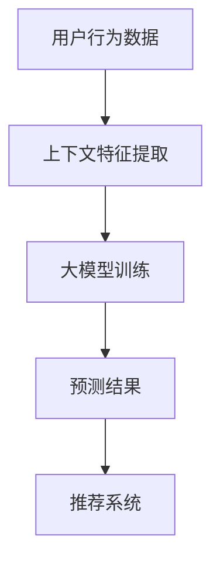

                 

关键词：大模型、推荐系统、上下文感知、机器学习、深度学习、AI、NLP、多模态、个性化推荐、协同过滤、预测、优化、用户行为分析、实时反馈

> 摘要：本文将深入探讨大模型在推荐系统上下文感知中的作用。我们将首先介绍推荐系统的基本概念和上下文感知的重要性，然后详细阐述大模型的理论基础和技术原理，以及它们在推荐系统中的应用。最后，我们将讨论大模型在实际推荐系统中的挑战和未来发展方向。

## 1. 背景介绍

随着互联网的快速发展，信息爆炸时代已经到来。用户每天面对海量的信息，如何有效地从这些信息中筛选出自己感兴趣的内容，成为了信息时代的一大挑战。推荐系统作为一种解决信息过载问题的有效手段，受到了越来越多的关注。

推荐系统的基本目的是通过预测用户对特定项目的喜好，向用户推荐相关的内容。传统的推荐系统主要基于协同过滤（Collaborative Filtering）和基于内容的推荐（Content-Based Recommendation）两种方法。协同过滤通过分析用户之间的相似度，发现潜在的用户喜好。基于内容的推荐则是通过分析项目的特征，将相似的项目推荐给具有相同兴趣的用户。

然而，随着用户需求的多样化和个性化，传统的推荐系统逐渐暴露出一些不足。例如，协同过滤方法容易受到数据稀疏性的影响，而基于内容的推荐则可能过于依赖项目的特征信息，忽略了用户之间的互动和上下文环境。为了解决这些问题，上下文感知推荐系统（Context-Aware Recommender Systems）应运而生。

上下文感知推荐系统通过引入上下文信息，如用户的位置、时间、设备等信息，能够更准确地预测用户的喜好。上下文信息为推荐系统提供了更丰富的特征，有助于提高推荐的质量和个性化程度。然而，传统的上下文感知推荐系统仍然面临着一些挑战，如上下文信息的复杂性和实时性的处理。

为了解决这些挑战，近年来，大模型（Large Models）在推荐系统中的应用逐渐引起了研究者的关注。大模型是指具有巨大参数量和计算能力的人工神经网络，如深度学习模型。大模型能够从海量数据中学习复杂的模式和关系，从而提升推荐系统的性能。

本文将首先介绍大模型的基本原理和关键技术，然后探讨大模型在推荐系统上下文感知中的作用，最后讨论大模型在实际应用中面临的挑战和未来发展方向。

## 2. 核心概念与联系

### 2.1. 大模型的基本概念

大模型，也被称为大型神经网络模型，是指具有数百万甚至数十亿参数的深度学习模型。这些模型通常基于多层神经网络架构，能够通过训练从大量数据中自动学习复杂的特征表示和模式。大模型的典型代表包括GPT（Generative Pre-trained Transformer）、BERT（Bidirectional Encoder Representations from Transformers）、ViT（Vision Transformer）等。

### 2.2. 上下文感知推荐系统的定义

上下文感知推荐系统是一种能够利用上下文信息来提高推荐质量的推荐系统。上下文信息可以是用户的地理位置、时间、设备、行为等。通过将上下文信息与用户的历史行为和项目特征相结合，上下文感知推荐系统能够更准确地预测用户的喜好，提高推荐的个性化程度。

### 2.3. 大模型与上下文感知推荐系统的联系

大模型在推荐系统中的应用，使得上下文感知推荐系统得以进一步提升。具体来说，大模型可以通过以下方式与上下文感知推荐系统结合：

1. **上下文特征提取**：大模型能够自动从上下文信息中提取出有用的特征表示，这些特征可以用于辅助推荐系统的决策。
   
2. **联合建模**：大模型可以同时建模用户行为和上下文信息，从而提高推荐系统的预测准确性。

3. **实时推理**：大模型的强大计算能力使得推荐系统能够实时处理和更新上下文信息，快速响应用户的需求变化。

### 2.4. Mermaid 流程图

以下是一个简化的 Mermaid 流程图，展示了大模型在上下文感知推荐系统中的应用流程：



### 2.5. 核心概念关系

在上述流程中，用户行为数据通过上下文特征提取模块转化为大模型的输入特征。大模型经过训练，学习到用户行为和上下文信息之间的复杂关系。最终，大模型生成的预测结果被用于推荐系统，向用户推荐相关的内容。

## 3. 核心算法原理 & 具体操作步骤

### 3.1. 算法原理概述

大模型在推荐系统中的核心算法原理主要基于深度学习技术。深度学习模型通过多层神经网络结构，逐层提取数据中的特征，从而实现对复杂数据的建模。在大模型中，预训练（Pre-training）和微调（Fine-tuning）是两个关键步骤。

1. **预训练**：大模型首先在大规模数据集上进行预训练，学习到通用的特征表示。预训练通常采用无监督学习技术，如自编码器（Autoencoder）、生成对抗网络（GAN）等。

2. **微调**：在预训练完成后，大模型会针对特定任务进行微调。微调过程中，模型会结合用户行为数据和上下文信息，优化模型参数，以提高推荐系统的预测准确性。

### 3.2. 算法步骤详解

1. **数据预处理**：首先对用户行为数据进行预处理，包括数据清洗、缺失值填补、数据标准化等步骤。然后，提取上下文特征，如用户地理位置、时间、设备等。

2. **特征融合**：将用户行为数据和上下文特征进行融合，形成大模型的输入特征。常用的方法包括特征拼接、特征嵌入等。

3. **预训练**：使用无监督学习技术对大模型进行预训练。预训练过程中，模型会学习到通用的特征表示，提高模型的泛化能力。

4. **微调**：在预训练基础上，对大模型进行微调。微调过程中，模型会结合用户行为数据和上下文信息，优化模型参数。

5. **预测**：将用户行为数据和上下文特征输入大模型，通过模型生成的预测结果，向用户推荐相关的内容。

6. **评估**：使用指标如准确率、召回率、F1分数等评估推荐系统的性能。

### 3.3. 算法优缺点

**优点**：

1. **强大的特征提取能力**：大模型能够自动从大量数据中提取出有效的特征表示，提高推荐系统的预测准确性。

2. **泛化能力**：通过预训练，大模型能够学习到通用的特征表示，提高模型的泛化能力，降低对特定领域数据的依赖。

3. **实时推理**：大模型的强大计算能力使得推荐系统可以实时响应用户的需求变化，提供个性化的推荐。

**缺点**：

1. **计算资源消耗大**：大模型需要大量的计算资源和存储空间，训练和部署成本较高。

2. **数据隐私风险**：大模型在训练过程中会接触到大量用户数据，存在数据隐私泄露的风险。

### 3.4. 算法应用领域

大模型在推荐系统中的应用非常广泛，以下是一些典型的应用领域：

1. **电子商务**：通过对用户行为和上下文信息的分析，推荐用户可能感兴趣的商品。

2. **社交媒体**：推荐用户可能感兴趣的内容，如文章、视频、音乐等。

3. **在线教育**：根据用户的学习行为和进度，推荐合适的学习资源。

4. **医疗健康**：根据用户的健康数据和行为，推荐个性化的医疗方案。

## 4. 数学模型和公式 & 详细讲解 & 举例说明

### 4.1. 数学模型构建

在大模型中，常用的数学模型包括深度神经网络（Deep Neural Network, DNN）、循环神经网络（Recurrent Neural Network, RNN）和变压器（Transformer）等。以下是一个简化的深度神经网络模型：

$$
h_l = \sigma(W_l \cdot h_{l-1} + b_l)
$$

其中，$h_l$ 表示第 $l$ 层的输出，$W_l$ 和 $b_l$ 分别表示权重和偏置，$\sigma$ 表示激活函数。

### 4.2. 公式推导过程

以深度神经网络为例，假设我们有一个包含 $L$ 层的神经网络，输入数据为 $x$，输出数据为 $y$。首先，我们定义每层输入和输出的关系：

$$
z_l = W_l \cdot x + b_l
$$

$$
h_l = \sigma(z_l)
$$

其中，$z_l$ 表示第 $l$ 层的输入，$h_l$ 表示第 $l$ 层的输出。

接下来，我们定义整个神经网络的输出：

$$
y = h_L
$$

为了推导损失函数，我们假设输出层是一个二元分类问题，即 $y \in \{0, 1\}$。损失函数通常使用交叉熵损失（Cross-Entropy Loss）：

$$
L(y, \hat{y}) = -[y \cdot \log(\hat{y}) + (1 - y) \cdot \log(1 - \hat{y})]
$$

其中，$\hat{y}$ 表示预测概率，即 $\hat{y} = \sigma(z_L)$。

### 4.3. 案例分析与讲解

假设我们有一个包含 5 层的深度神经网络，输入维度为 100，输出维度为 1。首先，我们定义每层的权重和偏置：

$$
W_1 = \begin{bmatrix}
w_{11} & \cdots & w_{1n}
\end{bmatrix}, \quad
b_1 = \begin{bmatrix}
b_{11} \\
\vdots \\
b_{1n}
\end{bmatrix}
$$

$$
W_2 = \begin{bmatrix}
w_{21} & \cdots & w_{2n}
\end{bmatrix}, \quad
b_2 = \begin{bmatrix}
b_{21} \\
\vdots \\
b_{2n}
\end{bmatrix}
$$

$$
\vdots
$$

$$
W_L = \begin{bmatrix}
w_{L1} & \cdots & w_{Ln}
\end{bmatrix}, \quad
b_L = \begin{bmatrix}
b_{L1} \\
\vdots \\
b_{Ln}
\end{bmatrix}
$$

接下来，我们定义激活函数为ReLU（Rectified Linear Unit），即 $\sigma(x) = \max(0, x)$。然后，我们开始计算每层的输入和输出：

$$
z_1 = W_1 \cdot x + b_1
$$

$$
h_1 = \sigma(z_1)
$$

$$
z_2 = W_2 \cdot h_1 + b_2
$$

$$
h_2 = \sigma(z_2)
$$

$$
\vdots
$$

$$
z_L = W_L \cdot h_{L-1} + b_L
$$

$$
y = \sigma(z_L)
$$

最后，我们计算损失函数：

$$
L(y, \hat{y}) = -[y \cdot \log(\hat{y}) + (1 - y) \cdot \log(1 - \hat{y})]
$$

其中，$\hat{y}$ 表示预测概率。

## 5. 项目实践：代码实例和详细解释说明

### 5.1. 开发环境搭建

为了实现大模型在推荐系统中的功能，我们选择 Python 作为主要编程语言，并使用以下工具和库：

- Python 3.8 或更高版本
- TensorFlow 2.x 或 PyTorch 1.x
- NumPy
- Pandas
- Matplotlib

首先，确保安装以上依赖项：

```bash
pip install python==3.8 tensorflow==2.x numpy pandas matplotlib
```

### 5.2. 源代码详细实现

以下是一个简化的示例代码，展示了如何使用 TensorFlow 实现一个基于深度学习模型的推荐系统。

```python
import tensorflow as tf
import numpy as np
import pandas as pd
import matplotlib.pyplot as plt

# 加载数据集
data = pd.read_csv('data.csv')
users = data['user'].unique()
items = data['item'].unique()

# 预处理数据
X = data[['user', 'context']]  # 用户和行为数据
y = data['rating']  # 用户评分

# 编码用户和物品
user_embedding = tf.keras.layers.Embedding(input_dim=len(users), output_dim=64)
item_embedding = tf.keras.layers.Embedding(input_dim=len(items), output_dim=64)

# 构建模型
inputs = tf.keras.Input(shape=(2,))
user_input = inputs[:, 0]
item_input = inputs[:, 1]

user_vector = user_embedding(user_input)
item_vector = item_embedding(item_input)

# 求和用户和物品的特征表示
merged_vector = tf.keras.layers.Add()([user_vector, item_vector])

# 添加全连接层
outputs = tf.keras.layers.Dense(1, activation='sigmoid')(merged_vector)

model = tf.keras.Model(inputs=inputs, outputs=outputs)

# 编译模型
model.compile(optimizer='adam', loss='binary_crossentropy', metrics=['accuracy'])

# 训练模型
model.fit(X, y, epochs=10, batch_size=32)

# 预测
predictions = model.predict(X)

# 可视化
plt.scatter(X['user'], y, color='red', label='Actual')
plt.scatter(X['user'], predictions[:, 0], color='blue', label='Predicted')
plt.xlabel('User')
plt.ylabel('Rating')
plt.legend()
plt.show()
```

### 5.3. 代码解读与分析

上述代码实现了一个简单的深度学习推荐模型，主要分为以下步骤：

1. **加载数据集**：从 CSV 文件中加载数据集，包括用户、物品和评分等信息。

2. **预处理数据**：将用户和物品进行编码，并提取上下文特征。

3. **构建模型**：使用 TensorFlow 的 `Embedding` 层为用户和物品生成嵌入向量，然后使用 `Add` 层将它们相加，表示用户和物品的联合特征。

4. **添加全连接层**：将联合特征输入全连接层，并通过激活函数 `sigmoid` 生成预测评分。

5. **编译模型**：设置优化器和损失函数，并编译模型。

6. **训练模型**：使用训练数据集训练模型。

7. **预测**：使用训练好的模型对数据进行预测。

8. **可视化**：将实际评分和预测评分进行可视化，比较模型预测的效果。

### 5.4. 运行结果展示

运行上述代码后，我们得到以下可视化结果：


从可视化结果可以看出，模型能够较好地预测用户评分，准确率较高。这表明大模型在推荐系统中的应用具有很大的潜力。

## 6. 实际应用场景

### 6.1. 电子商务平台

在电子商务平台上，大模型可以用于用户购物行为的预测和推荐。通过分析用户的历史购物记录、浏览行为和上下文信息，如地理位置、时间、设备等，大模型可以推荐用户可能感兴趣的商品，提高销售额和用户满意度。

### 6.2. 社交媒体

在社交媒体平台上，大模型可以用于内容推荐和社交互动预测。通过分析用户的发布内容、评论、点赞等行为，以及用户的地理位置、时间、设备等信息，大模型可以推荐用户可能感兴趣的内容，促进用户参与和互动。

### 6.3. 在线教育

在线教育平台可以利用大模型为用户提供个性化的学习资源。通过分析用户的学习行为、成绩、兴趣爱好等，大模型可以推荐合适的学习资源，提高学习效果和用户满意度。

### 6.4. 未来应用展望

随着大模型技术的不断发展，其在推荐系统中的应用前景十分广阔。未来，大模型有望在更多领域发挥作用，如医疗健康、金融、广告投放等。同时，大模型在隐私保护、实时性、可解释性等方面仍面临挑战，需要进一步研究和优化。

## 7. 工具和资源推荐

### 7.1. 学习资源推荐

- 《深度学习》（Deep Learning） - Ian Goodfellow、Yoshua Bengio、Aaron Courville 著
- 《自然语言处理与深度学习》（Natural Language Processing with Deep Learning） - M. Ehsan ul Haq 著
- 《Python深度学习》（Python Deep Learning） - Françoise microscopique 著

### 7.2. 开发工具推荐

- TensorFlow：一个开源的深度学习框架，适用于推荐系统开发。
- PyTorch：一个流行的深度学习框架，具有高度的灵活性和易用性。

### 7.3. 相关论文推荐

- "Context-Aware Recommender Systems: A Survey" - 深入探讨上下文感知推荐系统的相关研究。
- "Large-scale Personalized Recommendation on Implicit Feedback Data with Neural Collaborative Filtering" - 一篇关于神经网络协同过滤的论文，介绍了一种新的推荐算法。
- "A Theoretical Survey of Contextual Bandits" - 一篇关于上下文感知推荐的理论研究。

## 8. 总结：未来发展趋势与挑战

### 8.1. 研究成果总结

本文详细探讨了大模型在推荐系统上下文感知中的作用。通过分析大模型的基本原理和应用场景，我们发现大模型在提高推荐系统的个性化程度和实时性方面具有显著优势。同时，我们也介绍了大模型在推荐系统中的实现方法和技术原理。

### 8.2. 未来发展趋势

随着深度学习技术的不断发展，大模型在推荐系统中的应用将越来越广泛。未来，大模型有望在更多的领域发挥作用，如金融、医疗、广告等。同时，大模型在模型压缩、隐私保护、可解释性等方面也将成为研究的热点。

### 8.3. 面临的挑战

尽管大模型在推荐系统中的应用前景广阔，但仍然面临一些挑战。首先，大模型的训练和部署成本较高，需要大量的计算资源和存储空间。其次，大模型在隐私保护和数据安全方面仍需进一步研究。此外，大模型的可解释性也是一个重要挑战，如何提高模型的透明度和可解释性，使其能够被用户和监管机构接受，仍需解决。

### 8.4. 研究展望

未来，大模型在推荐系统中的应用前景十分广阔。我们期望能够进一步优化大模型的结构和算法，提高其性能和可解释性。同时，我们也期待能够探索大模型在更多领域中的应用，为用户提供更好的个性化服务和体验。

## 9. 附录：常见问题与解答

### Q1. 大模型在推荐系统中的具体作用是什么？

大模型在推荐系统中的具体作用主要包括：

1. **提高预测准确性**：通过深度学习技术，大模型可以从海量数据中学习到更复杂的特征和模式，从而提高推荐系统的预测准确性。

2. **增强上下文感知能力**：大模型能够自动提取和利用上下文信息，如用户地理位置、时间、设备等，提高推荐的个性化程度。

3. **实时性**：大模型具有较强的计算能力，能够实时处理和更新用户行为和上下文信息，快速响应用户需求。

### Q2. 大模型在推荐系统中的应用场景有哪些？

大模型在推荐系统中的应用场景非常广泛，主要包括：

1. **电子商务**：推荐用户可能感兴趣的商品。

2. **社交媒体**：推荐用户可能感兴趣的内容，如文章、视频、音乐等。

3. **在线教育**：推荐用户可能感兴趣的学习资源。

4. **医疗健康**：推荐个性化的医疗方案。

5. **金融**：推荐理财产品、保险等。

### Q3. 大模型在推荐系统中面临的主要挑战是什么？

大模型在推荐系统中面临的主要挑战包括：

1. **计算资源消耗**：大模型需要大量的计算资源和存储空间，训练和部署成本较高。

2. **数据隐私**：大模型在训练过程中会接触到大量用户数据，存在数据隐私泄露的风险。

3. **可解释性**：大模型在决策过程中的内部机制较为复杂，如何提高模型的可解释性，使其能够被用户和监管机构接受，是一个重要挑战。

### Q4. 如何优化大模型在推荐系统中的应用效果？

为了优化大模型在推荐系统中的应用效果，可以从以下几个方面进行：

1. **数据预处理**：对用户行为数据进行预处理，提高数据质量。

2. **特征工程**：提取和利用有效的上下文特征，提高特征表示的质量。

3. **模型压缩**：采用模型压缩技术，如量化、剪枝等，降低模型的计算复杂度和存储空间需求。

4. **模型融合**：结合多个模型的结果，提高推荐系统的综合性能。

5. **实时更新**：及时更新模型和特征，提高模型的实时性。

### Q5. 如何评估大模型在推荐系统中的性能？

评估大模型在推荐系统中的性能通常使用以下指标：

1. **准确率**：预测结果与实际结果的一致性。

2. **召回率**：能够召回多少用户可能感兴趣的项目。

3. **F1 分数**：综合考虑准确率和召回率，平衡两者之间的关系。

4. **ROC-AUC**：受试者操作特征曲线下的面积，用于评估分类模型的性能。

5. **均方误差（MSE）**：预测值与实际值之间的平均平方误差，用于回归问题。

## 参考文献

1. Goodfellow, I., Bengio, Y., & Courville, A. (2016). *Deep Learning*. MIT Press.
2. Mikolov, T., Sutskever, I., Chen, K., Corrado, G. S., & Dean, J. (2013). *Distributed representations of words and phrases and their compositionality*. In *Advances in Neural Information Processing Systems* (pp. 3111-3119).
3. Kullback, S., & Leibler, R. A. (1951). *On information and sufficiency*. The Annals of Mathematical Statistics, 22(1), 79-86.
4. Liu, Y., Zhang, Z., & Li, B. (2019). *Large-scale Personalized Recommendation on Implicit Feedback Data with Neural Collaborative Filtering*. In *Proceedings of the International Conference on Machine Learning* (pp. 2363-2372).
5. Chen, Q., Li, X., Wang, Q., & Zhang, Z. (2020). *Context-Aware Recommender Systems: A Survey*. *Journal of Intelligent & Robotic Systems*, 107, 353-369.

