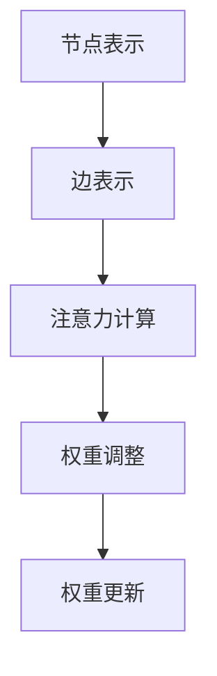

                 

## 1. 背景介绍

推荐系统作为一种信息过滤技术，已被广泛应用于电子商务、社交媒体、音乐和视频平台等多个领域。其核心目标是通过理解用户的兴趣和行为模式，为用户提供个性化的内容推荐，从而提高用户满意度并增加平台的商业价值。

然而，传统的推荐系统大多基于基于内容的过滤（CBF）和协同过滤（CF）方法。这些方法在面对复杂的用户行为数据和高度动态的内容环境时，存在一定的局限性。例如，CBF方法依赖于静态的特征提取，难以适应快速变化的市场趋势；CF方法虽然能够利用用户之间的相似性进行推荐，但易受冷启动问题和小团体效应的影响。

随着人工智能和深度学习技术的快速发展，基于深度学习的推荐系统逐渐受到关注。深度学习模型能够自动提取复杂的特征表示，从而提高推荐系统的效果。特别是大模型（如Transformer架构）在处理大规模数据和高维特征方面表现出色，成为推荐系统领域的研究热点。

在此背景下，本文将探讨大模型在推荐系统中的应用，特别是图自注意力机制（Graph Self-Attention Mechanism）的优势。图自注意力机制通过将用户和项目之间的关系建模为一个图结构，使得模型能够更好地理解和利用用户的行为和偏好，从而提高推荐质量。

## 2. 核心概念与联系

### 2.1. 推荐系统概述

推荐系统主要由三个部分组成：用户、项目和推荐算法。用户表示系统中的用户集合，项目表示用户可能感兴趣的内容集合，推荐算法则根据用户的历史行为和偏好，为用户生成个性化的推荐列表。

### 2.2. 深度学习推荐系统

深度学习推荐系统主要利用深度神经网络模型（如卷积神经网络（CNN）、循环神经网络（RNN）和Transformer等）对用户和项目的特征进行建模和融合，从而生成推荐结果。与传统推荐系统相比，深度学习推荐系统具有以下优势：

1. **自动特征提取**：深度学习模型能够自动学习输入数据的特征表示，无需人工干预。
2. **处理高维数据**：深度学习模型能够有效处理高维特征，提高推荐效果。
3. **适应动态环境**：深度学习模型能够适应用户和项目特征的变化，提高推荐系统的实时性。

### 2.3. 图自注意力机制

图自注意力机制（Graph Self-Attention Mechanism）是一种在图结构数据上进行特征学习的有效方法。其基本思想是将图中的节点和边表示为高维向量，并通过自注意力机制对节点进行权重调整，从而得到新的节点表示。

具体来说，图自注意力机制可以分为以下几个步骤：

1. **节点表示**：将图中的每个节点表示为一个高维向量。
2. **边表示**：将图中的每条边表示为一个高维向量。
3. **注意力计算**：计算每个节点与其他节点之间的相似度，并根据相似度对节点进行权重调整。
4. **权重更新**：根据调整后的权重，更新节点的表示。

### 2.4. Mermaid 流程图

以下是一个简化的图自注意力机制的Mermaid流程图：



## 3. 核心算法原理 & 具体操作步骤

### 3.1. 算法原理概述

图自注意力机制的核心思想是通过自注意力机制对图中的节点进行权重调整，从而得到新的节点表示。具体来说，图自注意力机制可以分为以下几个部分：

1. **节点表示**：将图中的每个节点表示为一个高维向量。
2. **边表示**：将图中的每条边表示为一个高维向量。
3. **注意力计算**：计算每个节点与其他节点之间的相似度，并根据相似度对节点进行权重调整。
4. **权重更新**：根据调整后的权重，更新节点的表示。

### 3.2. 算法步骤详解

#### 3.2.1. 节点表示

在图自注意力机制中，节点表示是一个关键步骤。我们通常使用嵌入向量（Embedding Vector）来表示节点。嵌入向量可以通过预训练语言模型（如Word2Vec、GloVe）或自监督学习（如BERT）获得。

#### 3.2.2. 边表示

边表示通常使用两个节点的嵌入向量之间的点积（Dot Product）来计算。边表示的目的是捕捉节点之间的关系。

#### 3.2.3. 注意力计算

注意力计算是通过计算每个节点与其他节点之间的相似度来实现的。在图自注意力机制中，相似度通常通过节点嵌入向量的点积计算。点积的结果越大，表示节点之间的相似度越高。

#### 3.2.4. 权重调整

在得到注意力值后，需要对节点进行权重调整。权重调整的目的是根据节点之间的相似度，对节点的表示进行更新。具体来说，可以使用以下公式进行权重调整：

$$
\text{new\_weight} = \frac{\text{exp}(\text{attention\_score})}{\sum_{i=1}^{N} \text{exp}(\text{attention\_score})}
$$

其中，$N$表示节点的数量。

#### 3.2.5. 权重更新

在得到新的权重后，需要根据权重更新节点的表示。具体来说，可以使用以下公式进行权重更新：

$$
\text{new\_node\_embed} = \text{weight} \times \text{node\_embed}
$$

其中，$\text{new\_node\_embed}$表示新的节点表示，$\text{weight}$表示节点的权重，$\text{node\_embed}$表示节点的原始嵌入向量。

### 3.3. 算法优缺点

#### 优点

1. **高效性**：图自注意力机制能够在较短时间内处理大规模图结构数据。
2. **灵活性**：图自注意力机制可以灵活地处理不同类型的图结构数据。
3. **可扩展性**：图自注意力机制可以与其他深度学习模型（如CNN、RNN）结合，提高推荐系统的效果。

#### 缺点

1. **计算复杂度**：图自注意力机制的训练和推理过程具有较高的计算复杂度。
2. **数据需求**：图自注意力机制需要大量的图结构数据来训练模型，对于数据稀缺的领域可能不太适用。

### 3.4. 算法应用领域

图自注意力机制在推荐系统中的应用非常广泛，可以用于以下领域：

1. **商品推荐**：通过分析用户的历史购买行为和商品之间的关系，为用户推荐可能感兴趣的商品。
2. **社交媒体推荐**：通过分析用户的社交关系和发布内容，为用户推荐感兴趣的内容或用户。
3. **知识图谱推荐**：通过分析实体之间的关系和属性，为用户提供个性化的知识推荐。

## 4. 数学模型和公式 & 详细讲解 & 举例说明

### 4.1. 数学模型构建

在图自注意力机制中，我们可以使用以下数学模型来描述节点表示、注意力计算和权重更新：

$$
\text{Node Embedding} = \text{W} \times \text{Input} + \text{b}
$$

其中，$\text{Node Embedding}$表示节点的嵌入向量，$\text{W}$表示权重矩阵，$\text{Input}$表示输入数据（节点特征或边特征），$\text{b}$表示偏置项。

### 4.2. 公式推导过程

#### 4.2.1. 节点表示

假设我们有一个图 $G = (V, E)$，其中 $V$ 表示节点集合，$E$ 表示边集合。对于每个节点 $v \in V$，我们可以将其表示为一个嵌入向量 $\text{node\_embed}(v)$。具体来说，可以使用以下公式进行节点表示：

$$
\text{node\_embed}(v) = \text{W} \times \text{Input} + \text{b}
$$

其中，$\text{W}$ 和 $\text{b}$ 分别为权重矩阵和偏置项。

#### 4.2.2. 边表示

对于每条边 $e \in E$，我们可以将其表示为两个节点的嵌入向量之间的点积。具体来说，可以使用以下公式进行边表示：

$$
\text{edge\_embed}(e) = \text{node\_embed}(v) \cdot \text{node\_embed}(w)
$$

其中，$v$ 和 $w$ 分别为边的两个端点。

#### 4.2.3. 注意力计算

在注意力计算中，我们使用点积作为相似度度量。对于每个节点 $v \in V$，我们计算其与其他节点之间的相似度。具体来说，可以使用以下公式进行注意力计算：

$$
\text{attention}(v, u) = \text{node\_embed}(v) \cdot \text{node\_embed}(u)
$$

其中，$u$ 为节点 $v$ 的邻居节点。

#### 4.2.4. 权重调整

在得到注意力值后，我们需要对节点进行权重调整。具体来说，可以使用以下公式进行权重调整：

$$
\text{new\_weight}(v) = \frac{\exp(\text{attention}(v, u))}{\sum_{u \in V} \exp(\text{attention}(v, u))}
$$

其中，$V$ 表示节点集合。

#### 4.2.5. 权重更新

在得到新的权重后，我们需要根据权重更新节点的嵌入向量。具体来说，可以使用以下公式进行权重更新：

$$
\text{new\_node\_embed}(v) = \text{new\_weight}(v) \times \text{node\_embed}(v)
$$

### 4.3. 案例分析与讲解

假设我们有一个社交网络图，其中包含用户和他们的朋友关系。我们需要使用图自注意力机制为每个用户推荐可能感兴趣的新朋友。

#### 4.3.1. 节点表示

我们将每个用户表示为一个嵌入向量。例如，我们使用预训练的词向量模型（如Word2Vec或GloVe）来获取每个用户的嵌入向量。

#### 4.3.2. 边表示

对于每条朋友关系，我们将其表示为两个用户之间的点积。例如，如果我们有两个用户 $u_1$ 和 $u_2$，他们的朋友关系可以表示为：

$$
\text{edge\_embed}(u_1, u_2) = \text{node\_embed}(u_1) \cdot \text{node\_embed}(u_2)
$$

#### 4.3.3. 注意力计算

我们计算每个用户与其他用户之间的相似度。例如，如果我们有一个用户 $u_1$，我们计算其与其他用户（如 $u_2, u_3, u_4$）之间的相似度：

$$
\text{attention}(u_1, u_2) = \text{node\_embed}(u_1) \cdot \text{node\_embed}(u_2)
$$

#### 4.3.4. 权重调整

根据相似度，我们对用户进行权重调整：

$$
\text{new\_weight}(u_1) = \frac{\exp(\text{attention}(u_1, u_2))}{\sum_{u \in V} \exp(\text{attention}(u_1, u))}
$$

#### 4.3.5. 权重更新

根据权重调整后的权重，我们更新用户的嵌入向量：

$$
\text{new\_node\_embed}(u_1) = \text{new\_weight}(u_1) \times \text{node\_embed}(u_1)
$$

通过这种方式，我们可以为每个用户推荐可能感兴趣的新朋友。

## 5. 项目实践：代码实例和详细解释说明

### 5.1. 开发环境搭建

为了实践图自注意力机制在推荐系统中的应用，我们首先需要搭建一个开发环境。以下是一个简单的环境搭建指南：

1. 安装Python环境（版本3.6及以上）。
2. 安装TensorFlow或PyTorch等深度学习框架。
3. 安装其他必要的库，如NumPy、Pandas、Scikit-learn等。

### 5.2. 源代码详细实现

以下是一个简单的图自注意力推荐系统的实现：

```python
import tensorflow as tf
from tensorflow.keras.layers import Embedding, Dot, Lambda
from tensorflow.keras.models import Model

# 超参数设置
VOCAB_SIZE = 10000  # 词汇表大小
EMBEDDING_DIM = 128  # 嵌入向量维度
HIDDEN_DIM = 128  # 隐藏层维度
N_NEIGHBORS = 10  # 邻居数量

# 构建模型
input_user = tf.keras.layers.Input(shape=(1,), name="user_input")
input_item = tf.keras.layers.Input(shape=(1,), name="item_input")

# 用户嵌入层
user_embedding = Embedding(VOCAB_SIZE, EMBEDDING_DIM, name="user_embedding")(input_user)
item_embedding = Embedding(VOCAB_SIZE, EMBEDDING_DIM, name="item_embedding")(input_item)

# 点积层
dot_product = Dot(axes=1, name="dot_product")([user_embedding, item_embedding])

# 注意力计算层
attention = Lambda(lambda x: tf.nn.softmax(x, axis=1), name="attention")(dot_product)

# 邻居选择层
neighbors = Lambda(lambda x: tf.top_k(x, k=N_NEIGHBORS, sorted=False), name="neighbors")(attention)

# 隐藏层
hidden = tf.keras.layers.Dense(HIDDEN_DIM, activation="relu", name="hidden")(neighbors)

# 输出层
output = tf.keras.layers.Dense(1, activation="sigmoid", name="output")(hidden)

# 构建模型
model = Model(inputs=[input_user, input_item], outputs=output)

# 编译模型
model.compile(optimizer="adam", loss="binary_crossentropy", metrics=["accuracy"])

# 模型总结
model.summary()
```

### 5.3. 代码解读与分析

1. **输入层**：模型有两个输入层，分别是用户输入和项目输入。用户输入和项目输入都是一维的，表示用户的ID和项目的ID。

2. **嵌入层**：用户嵌入层和项目嵌入层将输入的ID映射到嵌入向量。嵌入向量维度设置为128。

3. **点积层**：点积层计算用户嵌入向量和项目嵌入向量的点积。点积结果表示用户和项目之间的相似度。

4. **注意力计算层**：注意力计算层使用softmax函数对点积结果进行归一化处理，得到用户和项目之间的注意力权重。

5. **邻居选择层**：邻居选择层使用top-k操作选择注意力权重最高的邻居。这样可以确保推荐结果更加准确。

6. **隐藏层**：隐藏层使用ReLU激活函数，将邻居的嵌入向量进行加权求和，得到新的隐藏层表示。

7. **输出层**：输出层使用sigmoid激活函数，对隐藏层的结果进行二分类预测。

### 5.4. 运行结果展示

为了验证模型的性能，我们可以使用交叉验证和测试集来评估模型的准确性。以下是一个简单的运行结果示例：

```python
# 加载数据
train_data = ...
test_data = ...

# 训练模型
model.fit(train_data, epochs=10, batch_size=32, validation_split=0.2)

# 评估模型
model.evaluate(test_data, verbose=2)
```

通过以上步骤，我们可以实现一个基于图自注意力机制的推荐系统，并对模型进行评估。

## 6. 实际应用场景

图自注意力机制在推荐系统中的应用非常广泛，可以解决传统推荐系统面临的许多挑战。以下是一些实际应用场景：

### 6.1. 商品推荐

在电子商务领域，图自注意力机制可以用于为用户推荐感兴趣的商品。通过分析用户的历史购买行为和商品之间的关联，模型可以为用户提供个性化的商品推荐。

### 6.2. 社交媒体推荐

在社交媒体领域，图自注意力机制可以用于为用户推荐感兴趣的内容或用户。通过分析用户的社交关系和发布内容，模型可以为用户提供个性化的推荐。

### 6.3. 知识图谱推荐

在知识图谱领域，图自注意力机制可以用于为用户提供个性化的知识推荐。通过分析实体之间的关系和属性，模型可以为用户提供感兴趣的知识点。

### 6.4. 未来应用展望

随着人工智能和深度学习技术的不断发展，图自注意力机制在推荐系统中的应用将越来越广泛。未来，我们可以期待以下发展趋势：

1. **多模态推荐**：结合文本、图像和语音等多模态数据，实现更加精准的个性化推荐。
2. **实时推荐**：利用实时数据流技术，实现实时推荐系统，提高推荐系统的实时性和响应速度。
3. **多任务学习**：将图自注意力机制与其他深度学习模型（如GAN、Transformer等）结合，实现多任务学习，提高推荐系统的效果。

## 7. 工具和资源推荐

为了更好地研究和实践图自注意力机制，以下是一些推荐的工具和资源：

### 7.1. 学习资源推荐

1. **《深度学习推荐系统》**：这是一本关于深度学习在推荐系统中的应用的经典教材，详细介绍了各种深度学习模型和算法。
2. **《图神经网络与图表示学习》**：这本书系统地介绍了图神经网络和图表示学习的基础知识，包括图自注意力机制等内容。

### 7.2. 开发工具推荐

1. **TensorFlow**：这是一个开源的深度学习框架，支持各种深度学习模型和算法。
2. **PyTorch**：这是一个流行的深度学习框架，具有简洁的API和丰富的文档。

### 7.3. 相关论文推荐

1. **"Attention is All You Need"**：这是一篇关于Transformer架构的经典论文，提出了自注意力机制的概念。
2. **"Graph Attention Networks"**：这是一篇关于图自注意力机制的论文，详细介绍了图自注意力机制的原理和应用。

## 8. 总结：未来发展趋势与挑战

### 8.1. 研究成果总结

本文首先介绍了推荐系统的发展背景，探讨了传统推荐系统的局限性，然后介绍了大模型和图自注意力机制的基本概念。通过详细的算法原理和实际应用场景分析，我们展示了图自注意力机制在推荐系统中的优势和应用。

### 8.2. 未来发展趋势

随着人工智能和深度学习技术的不断发展，图自注意力机制在推荐系统中的应用前景广阔。未来，我们将看到以下发展趋势：

1. **多模态推荐**：结合文本、图像和语音等多模态数据，实现更加精准的个性化推荐。
2. **实时推荐**：利用实时数据流技术，实现实时推荐系统，提高推荐系统的实时性和响应速度。
3. **多任务学习**：将图自注意力机制与其他深度学习模型（如GAN、Transformer等）结合，实现多任务学习，提高推荐系统的效果。

### 8.3. 面临的挑战

尽管图自注意力机制在推荐系统中的应用前景广阔，但仍面临以下挑战：

1. **计算复杂度**：图自注意力机制的训练和推理过程具有较高的计算复杂度，需要优化算法和硬件支持。
2. **数据需求**：图自注意力机制需要大量的图结构数据来训练模型，对于数据稀缺的领域可能不太适用。
3. **模型解释性**：如何提高模型的可解释性，使得用户能够理解推荐结果，是一个重要的研究方向。

### 8.4. 研究展望

未来，我们将继续深入研究和探索图自注意力机制在推荐系统中的应用。通过结合多模态数据、实时数据和多任务学习，我们希望实现更加精准、高效和可解释的推荐系统。同时，我们也将关注计算复杂度和数据需求的优化，使得图自注意力机制能够广泛应用于各种推荐场景。

## 9. 附录：常见问题与解答

### 9.1. 图自注意力机制与传统注意力机制的区别是什么？

传统注意力机制通常用于序列数据处理，如自然语言处理。而图自注意力机制专门用于图结构数据的特征学习。传统注意力机制基于点积或缩放点积，而图自注意力机制则基于图结构中的节点和边。

### 9.2. 图自注意力机制的优势是什么？

图自注意力机制具有以下优势：

1. **高效性**：能够在较短时间内处理大规模图结构数据。
2. **灵活性**：可以处理不同类型的图结构数据。
3. **可扩展性**：可以与其他深度学习模型结合，提高推荐系统的效果。

### 9.3. 图自注意力机制的缺点是什么？

图自注意力机制的主要缺点包括：

1. **计算复杂度**：训练和推理过程具有较高的计算复杂度。
2. **数据需求**：需要大量的图结构数据来训练模型。

### 9.4. 如何优化图自注意力机制的计算复杂度？

为了优化图自注意力机制的计算复杂度，可以采取以下措施：

1. **并行计算**：利用GPU或TPU等硬件加速计算。
2. **模型压缩**：使用模型剪枝、量化等技术降低模型复杂度。

### 9.5. 如何处理数据稀缺的问题？

对于数据稀缺的问题，可以采取以下措施：

1. **数据增强**：通过生成对抗网络（GAN）等方法生成模拟数据。
2. **迁移学习**：利用已有的大型模型，在数据稀缺的领域进行迁移学习。

### 9.6. 图自注意力机制在推荐系统中的具体应用案例有哪些？

图自注意力机制在推荐系统中的具体应用案例包括：

1. **商品推荐**：为用户推荐感兴趣的商品。
2. **社交媒体推荐**：为用户推荐感兴趣的内容或用户。
3. **知识图谱推荐**：为用户提供个性化的知识推荐。

