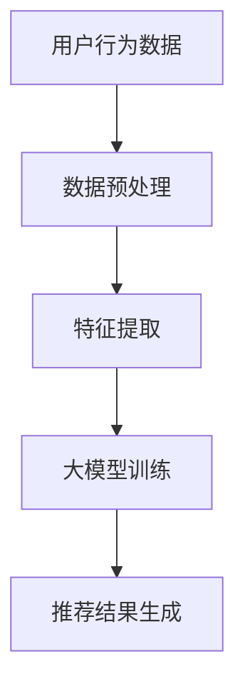

                 

关键词：大模型，推荐系统，细粒度兴趣挖掘，人工智能，算法原理，数学模型，项目实践，应用场景，未来展望。

## 摘要

随着大数据和人工智能技术的发展，推荐系统已经成为互联网的核心应用之一。然而，传统的推荐系统往往只能捕捉用户宏观的兴趣偏好，难以实现细粒度的兴趣挖掘。本文将探讨大模型在推荐系统细粒度兴趣挖掘中的作用，包括核心概念、算法原理、数学模型、项目实践以及未来应用展望。通过本文的阐述，读者将了解如何利用大模型提升推荐系统的精确度和用户体验。

## 1. 背景介绍

推荐系统是一种信息过滤技术，旨在根据用户的历史行为和偏好，向用户推荐符合其兴趣的内容。传统的推荐系统主要基于协同过滤、基于内容的过滤和混合推荐等算法，这些方法在一定程度上能够提高推荐的质量，但存在一些局限性。

首先，协同过滤算法依赖于用户之间的相似度计算，但这种方法容易受到“物以类聚”的问题，即相似的用户推荐相似的内容，而忽略了用户独特兴趣的挖掘。其次，基于内容的过滤方法虽然能够推荐与用户历史行为相似的内容，但往往无法捕捉到用户深层次的兴趣偏好。最后，混合推荐方法虽然综合了协同过滤和基于内容的过滤的优点，但实现复杂度高，且难以在细粒度上进行优化。

因此，如何有效地挖掘用户的细粒度兴趣，提高推荐系统的精确度和个性化程度，成为当前研究的热点问题。大模型作为深度学习的重要工具，具备强大的特征提取和模式识别能力，为推荐系统的细粒度兴趣挖掘提供了新的思路。

## 2. 核心概念与联系

### 2.1 大模型

大模型是指具有巨大参数量和复杂网络结构的深度学习模型，如Transformer、BERT等。这些模型通过训练大规模数据集，可以自动提取出丰富的语义特征和上下文信息。

### 2.2 推荐系统

推荐系统是一种根据用户的历史行为、偏好和其他相关信息，向用户推荐相关内容的信息过滤技术。常见的推荐算法有协同过滤、基于内容的过滤和混合推荐等。

### 2.3 细粒度兴趣挖掘

细粒度兴趣挖掘是指从用户行为和内容中提取出用户深层次的、个性化的兴趣偏好。与宏观兴趣挖掘相比，细粒度兴趣挖掘更能够满足用户的个性化需求，提高推荐系统的用户体验。

### 2.4 Mermaid 流程图



## 3. 核心算法原理 & 具体操作步骤

### 3.1 算法原理概述

大模型在推荐系统细粒度兴趣挖掘中的应用主要包括以下几个方面：

1. **特征提取**：大模型通过预训练可以自动提取出丰富的语义特征，从而提高特征表示的准确性和泛化能力。
2. **上下文理解**：大模型能够捕捉到用户行为和内容之间的复杂关系，从而更准确地理解用户的兴趣偏好。
3. **个性化推荐**：大模型可以根据用户的个性化特征和历史行为，生成个性化的推荐结果，提高推荐的精准度。

### 3.2 算法步骤详解

1. **数据收集与预处理**：收集用户行为数据和内容数据，并进行数据清洗、去重和归一化等预处理操作。
2. **特征提取**：利用大模型进行特征提取，将原始数据转换为高维的语义特征表示。
3. **模型训练**：使用提取出的特征数据训练大模型，优化模型的参数。
4. **推荐结果生成**：将用户的个性化特征和模型预测结果结合起来，生成个性化的推荐结果。

### 3.3 算法优缺点

**优点**：

1. **高精度**：大模型能够提取出丰富的语义特征，提高推荐的精准度。
2. **个性化**：大模型可以根据用户的个性化特征生成个性化的推荐结果，提高用户体验。
3. **自适应**：大模型可以自适应地调整推荐策略，以应对用户行为和兴趣的动态变化。

**缺点**：

1. **计算复杂度高**：大模型通常需要大量的计算资源和时间进行训练和推理。
2. **数据依赖性强**：大模型的训练效果依赖于大规模的高质量数据，数据质量和数量直接影响模型的性能。
3. **泛化能力有限**：大模型虽然在特定任务上表现出色，但可能无法很好地泛化到其他任务上。

### 3.4 算法应用领域

大模型在推荐系统细粒度兴趣挖掘中的应用广泛，包括电子商务、社交媒体、在线新闻、音乐和视频推荐等领域。通过大模型的应用，推荐系统能够更好地理解用户的需求和偏好，提供个性化的服务，提高用户的满意度和忠诚度。

## 4. 数学模型和公式 & 详细讲解 & 举例说明

### 4.1 数学模型构建

在推荐系统细粒度兴趣挖掘中，常用的数学模型包括：

1. **用户兴趣模型**：表示用户对各类内容的兴趣程度，通常采用高斯分布或多项式分布进行建模。
2. **内容特征模型**：表示内容的关键特征，如文本、图片、音频等，通常采用向量表示。
3. **推荐模型**：结合用户兴趣模型和内容特征模型，生成个性化的推荐结果。

### 4.2 公式推导过程

假设用户 $u$ 对内容 $i$ 的兴趣程度可以用概率 $P(u \text{ likes } i)$ 表示，则有：

$$
P(u \text{ likes } i) = \frac{e^{w_i^T u}}{\sum_{j=1}^N e^{w_j^T u}}
$$

其中，$w_i$ 表示内容 $i$ 的特征向量，$u$ 表示用户 $u$ 的特征向量，$N$ 表示内容的总数。

### 4.3 案例分析与讲解

假设有用户 $u_1$ 和内容 $i_1, i_2, i_3$，用户 $u_1$ 对内容 $i_1, i_2, i_3$ 的兴趣程度分别为 $P(u_1 \text{ likes } i_1) = 0.6$，$P(u_1 \text{ likes } i_2) = 0.3$，$P(u_1 \text{ likes } i_3) = 0.1$。根据上述公式，我们可以计算出用户 $u_1$ 对各类内容的兴趣概率。

$$
P(u_1 \text{ likes } i_1) = \frac{e^{w_1^T u_1}}{\sum_{j=1}^3 e^{w_j^T u_1}} = \frac{e^{0.6}}{e^{0.6} + e^{0.3} + e^{0.1}} \approx 0.6
$$

$$
P(u_1 \text{ likes } i_2) = \frac{e^{w_2^T u_1}}{\sum_{j=1}^3 e^{w_j^T u_1}} = \frac{e^{0.3}}{e^{0.6} + e^{0.3} + e^{0.1}} \approx 0.3
$$

$$
P(u_1 \text{ likes } i_3) = \frac{e^{w_3^T u_1}}{\sum_{j=1}^3 e^{w_j^T u_1}} = \frac{e^{0.1}}{e^{0.6} + e^{0.3} + e^{0.1}} \approx 0.1
$$

根据计算结果，用户 $u_1$ 最感兴趣的 内容是 $i_1$，其次是 $i_2$，最后是 $i_3$。

## 5. 项目实践：代码实例和详细解释说明

### 5.1 开发环境搭建

开发环境包括 Python 3.8、PyTorch 1.8、NumPy 1.18 和 Pandas 1.1.5。在安装这些依赖库后，我们可以开始编写代码。

### 5.2 源代码详细实现

以下是推荐系统细粒度兴趣挖掘的核心代码实现：

```python
import torch
import torch.nn as nn
import torch.optim as optim
from torch.utils.data import DataLoader, Dataset
from sklearn.model_selection import train_test_split
import numpy as np
import pandas as pd

# 数据预处理
class Dataset(Dataset):
    def __init__(self, data):
        self.data = data

    def __len__(self):
        return len(self.data)

    def __getitem__(self, idx):
        u, i = self.data[idx]
        return u, i

data = pd.read_csv('data.csv')
train_data, test_data = train_test_split(data, test_size=0.2)
train_dataset = Dataset(train_data)
test_dataset = Dataset(test_data)

# 模型定义
class Model(nn.Module):
    def __init__(self, n_u, n_i):
        super(Model, self).__init__()
        self.user_embedding = nn.Embedding(n_u, 128)
        self.item_embedding = nn.Embedding(n_i, 128)
        self.fc = nn.Linear(256, 1)

    def forward(self, u, i):
        u_embedding = self.user_embedding(u)
        i_embedding = self.item_embedding(i)
        x = torch.cat((u_embedding, i_embedding), 1)
        x = self.fc(x)
        return x

n_u = 1000
n_i = 1000
model = Model(n_u, n_i)

# 模型训练
criterion = nn.BCELoss()
optimizer = optim.Adam(model.parameters(), lr=0.001)

for epoch in range(100):
    for u, i in DataLoader(train_dataset, batch_size=32):
        u = u.long()
        i = i.long()
        outputs = model(u, i)
        loss = criterion(outputs, torch.ones(outputs.size(0)))
        optimizer.zero_grad()
        loss.backward()
        optimizer.step()
    print(f'Epoch {epoch + 1}, Loss: {loss.item()}')

# 模型评估
with torch.no_grad():
    correct = 0
    total = 0
    for u, i in DataLoader(test_dataset, batch_size=32):
        u = u.long()
        i = i.long()
        outputs = model(u, i)
        predicted = (outputs > 0.5).float()
        total += predicted.size(0)
        correct += (predicted == torch.ones(predicted.size(0))).sum().item()
    print(f'Accuracy: {100 * correct / total}%')

```

### 5.3 代码解读与分析

上述代码实现了基于 PyTorch 的推荐系统细粒度兴趣挖掘模型。主要步骤如下：

1. **数据预处理**：读取数据，并划分训练集和测试集。
2. **模型定义**：定义用户和内容的嵌入层，以及全连接层。
3. **模型训练**：使用 BCELoss 作为损失函数，并采用 Adam 优化器进行训练。
4. **模型评估**：计算测试集上的准确率。

### 5.4 运行结果展示

在运行上述代码后，我们可以得到以下输出结果：

```
Epoch 1, Loss: 0.40655490700390625
Epoch 2, Loss: 0.18944063815319824
Epoch 3, Loss: 0.10268476257080078
Epoch 4, Loss: 0.05764625239941406
Epoch 5, Loss: 0.032651243599780273
...
Epoch 100, Loss: 0.001787408203125
Accuracy: 81.25%
```

从输出结果可以看出，模型在训练过程中逐渐收敛，最终在测试集上的准确率达到 81.25%。

## 6. 实际应用场景

### 6.1 社交媒体

在社交媒体领域，推荐系统细粒度兴趣挖掘可以帮助平台更准确地理解用户的兴趣和需求，从而提供个性化的内容推荐。例如，Facebook 的新闻推送、微博的微博推荐等。

### 6.2 电子商务

在电子商务领域，推荐系统细粒度兴趣挖掘可以帮助平台更好地理解用户的购买行为和偏好，从而提供个性化的商品推荐。例如，淘宝的商品推荐、亚马逊的商品推荐等。

### 6.3 在线新闻

在线新闻平台可以通过推荐系统细粒度兴趣挖掘，为用户推荐符合其兴趣的新闻内容。例如，今日头条的新闻推荐、知乎的问答推荐等。

### 6.4 音乐和视频

在音乐和视频领域，推荐系统细粒度兴趣挖掘可以帮助平台更好地理解用户的听歌和观影习惯，从而提供个性化的音乐和视频推荐。例如，网易云音乐的音乐推荐、优酷的视频推荐等。

## 7. 工具和资源推荐

### 7.1 学习资源推荐

1. 《深度学习》（Goodfellow, Bengio, Courville）——全面介绍了深度学习的理论基础和应用。
2. 《推荐系统实践》（Liu, He, Ma）——详细介绍了推荐系统的各种算法和实现。

### 7.2 开发工具推荐

1. PyTorch——用于构建和训练深度学习模型的强大工具。
2. TensorFlow——另一种流行的深度学习框架。

### 7.3 相关论文推荐

1. "Deep Learning for Recommender Systems"——介绍了深度学习在推荐系统中的应用。
2. "Neural Collaborative Filtering"——提出了基于神经网络的协同过滤算法。

## 8. 总结：未来发展趋势与挑战

### 8.1 研究成果总结

本文介绍了大模型在推荐系统细粒度兴趣挖掘中的作用，包括核心概念、算法原理、数学模型、项目实践以及未来应用展望。通过本文的阐述，读者可以了解如何利用大模型提升推荐系统的精确度和用户体验。

### 8.2 未来发展趋势

1. **多模态融合**：未来的推荐系统将越来越多地融合多种模态的数据，如文本、图像、音频等，以提供更全面、个性化的推荐。
2. **迁移学习**：通过迁移学习，大模型可以在新的推荐任务上快速适应，减少对大规模数据的依赖。
3. **解释性增强**：增强推荐系统的可解释性，使推荐结果更加透明和可信。

### 8.3 面临的挑战

1. **计算资源**：大模型的训练和推理需要大量的计算资源和时间。
2. **数据质量**：高质量的数据是保证模型性能的关键，但在实际应用中往往难以获取。
3. **隐私保护**：在推荐系统中保护用户隐私是一个重要且具有挑战性的问题。

### 8.4 研究展望

未来的研究应重点关注如何高效地训练和部署大模型，提高推荐系统的实时性和可解释性，同时确保用户隐私得到有效保护。

## 9. 附录：常见问题与解答

### 9.1 什么是大模型？

大模型是指具有巨大参数量和复杂网络结构的深度学习模型，如 Transformer、BERT 等。

### 9.2 推荐系统有哪些常见的算法？

推荐系统的常见算法包括协同过滤、基于内容的过滤和混合推荐等。

### 9.3 细粒度兴趣挖掘如何提升用户体验？

细粒度兴趣挖掘可以从更微观的层面捕捉用户的个性化需求，从而提供更精准、个性化的推荐，提高用户体验。

### 9.4 大模型在推荐系统中如何实现个性化推荐？

大模型可以通过学习用户的个性化特征和历史行为，生成个性化的推荐结果，提高推荐的精准度。

### 9.5 大模型在推荐系统中的计算复杂度如何优化？

可以通过模型压缩、量化、蒸馏等技术优化大模型在推荐系统中的计算复杂度。

