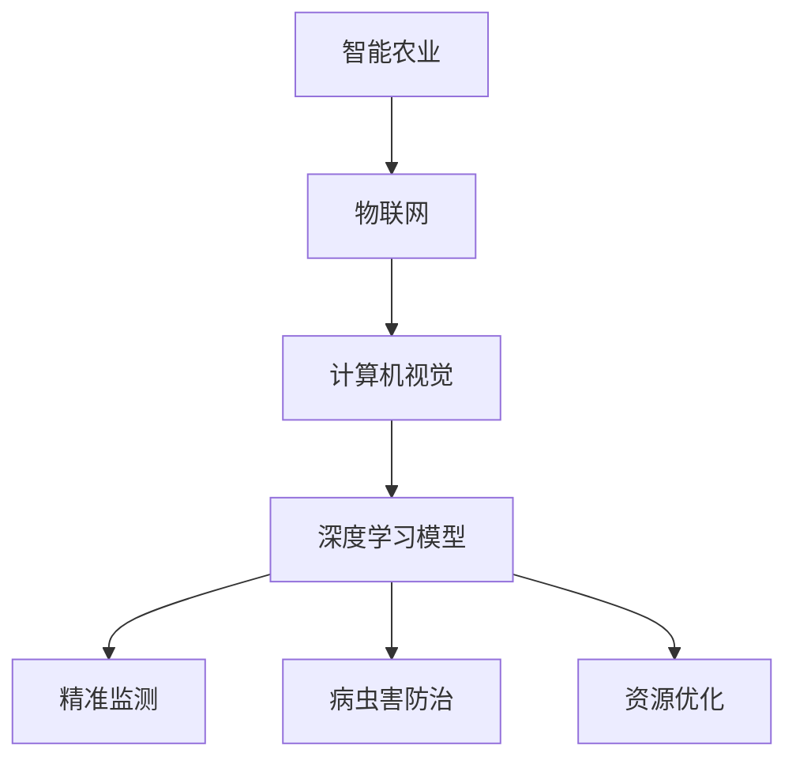

                 

智能农业作为现代农业发展的重要方向，正逐渐从传统的人工操作向数字化、智能化转型。其中，大模型（如深度学习模型）在智能农业中的应用，正成为推动农业产业升级的关键技术。本文旨在探讨大模型在智能农业中的多种应用场景，并分析其带来的挑战与机遇。

## 关键词

大模型，智能农业，深度学习，计算机视觉，精准农业，机器学习，数据处理，农业科技

## 摘要

本文首先介绍了智能农业的发展背景和大模型技术的兴起，随后深入探讨了大模型在智能农业中的具体应用，包括作物病害识别、土壤分析、作物生长监测等方面。接着，分析了大模型在智能农业应用中的挑战，并提出了相应的解决方案。最后，展望了智能农业的未来发展趋势，提出了潜在的研究方向。

## 1. 背景介绍

### 1.1 智能农业的概念与发展

智能农业是指利用现代信息技术和智能化设备，对农业生产过程进行精准化、智能化管理的一种农业发展模式。其主要目标是通过提高资源利用率和生产效率，实现农业的可持续发展。智能农业涵盖了多个领域，包括物联网、大数据、云计算、人工智能等。

智能农业的发展历程可以追溯到20世纪80年代，当时主要依赖于简单的传感器和自动控制系统。随着信息技术的快速发展，特别是互联网和物联网技术的普及，智能农业进入了新的发展阶段。近年来，人工智能技术的突破，尤其是深度学习算法的进步，为智能农业注入了新的活力。

### 1.2 大模型技术的兴起

大模型技术，尤其是深度学习模型，是近年来人工智能领域的重要突破。深度学习模型通过模拟人脑神经元结构，能够自动从大量数据中学习特征，进行复杂的模式识别和决策。这类模型在图像识别、语音识别、自然语言处理等方面表现出了卓越的性能。

大模型的兴起源于数据量的爆发式增长和计算能力的提升。大规模数据集和强大的计算资源，使得大模型能够训练出高度准确的模型，从而在各个领域得到了广泛应用。在智能农业中，大模型的应用不仅提高了农业生产的精准度，还为农业生产提供了新的解决方案。

## 2. 核心概念与联系

为了更好地理解大模型在智能农业中的应用，我们需要明确几个核心概念：

### 2.1 深度学习模型

深度学习模型是一类基于人工神经网络的机器学习算法，通过多层神经网络结构，实现对复杂数据的处理和分析。在智能农业中，常见的深度学习模型包括卷积神经网络（CNN）、循环神经网络（RNN）等。

### 2.2 计算机视觉

计算机视觉是人工智能的一个重要分支，通过计算机对图像或视频进行处理和分析，实现对现实世界的理解和感知。在智能农业中，计算机视觉技术可以用于作物病害识别、土壤分析等。

### 2.3 物联网

物联网是指将各种信息传感设备与互联网结合起来，实现智能识别、定位、跟踪、监控和管理。在智能农业中，物联网技术可以用于实时监测作物生长状态、土壤湿度、气候条件等。

### 2.4 大模型与智能农业的联系

大模型与智能农业的结合主要体现在以下几个方面：

1. **精准监测与预测**：通过深度学习模型，可以对大量农业数据进行处理，实现对作物生长状态的精准监测和预测。
2. **病虫害防治**：计算机视觉技术可以识别作物上的病害和害虫，为大模型提供输入，从而提高病虫害防治的准确性。
3. **资源优化**：大模型可以帮助优化农业资源的利用，例如通过土壤分析模型，精确施用肥料和水分。

下面是一个用于描述大模型与智能农业联系关系的 Mermaid 流程图：



## 3. 核心算法原理 & 具体操作步骤

### 3.1 算法原理概述

大模型在智能农业中的应用主要基于深度学习技术。深度学习模型通过多层神经网络结构，对输入数据进行特征提取和模式识别。在智能农业中，常用的深度学习模型包括卷积神经网络（CNN）和循环神经网络（RNN）。

### 3.2 算法步骤详解

1. **数据收集与预处理**：首先，需要收集大量的农业数据，包括土壤样本、作物图像、气象数据等。然后，对数据进行清洗、归一化和增强，以提高模型的训练效果。

2. **模型构建**：根据应用需求，选择合适的深度学习模型。例如，对于作物病害识别，可以使用卷积神经网络（CNN）。

3. **模型训练**：使用预处理后的数据对深度学习模型进行训练。训练过程中，模型会不断调整内部参数，以最小化预测误差。

4. **模型评估**：通过交叉验证和测试集评估模型性能，确保模型的准确性和可靠性。

5. **模型应用**：将训练好的模型应用于实际农业生产，例如进行作物生长监测、病虫害防治等。

### 3.3 算法优缺点

**优点**：

1. **高效性**：深度学习模型能够快速处理大量数据，提高农业生产效率。
2. **准确性**：通过多层神经网络结构，深度学习模型能够提取高度抽象的特征，提高预测准确性。
3. **灵活性**：深度学习模型可以应用于多种农业场景，具有广泛的适用性。

**缺点**：

1. **计算资源需求大**：深度学习模型训练需要大量计算资源，可能导致成本较高。
2. **数据质量要求高**：模型训练效果受数据质量影响较大，需要收集大量高质量数据。

### 3.4 算法应用领域

深度学习模型在智能农业中的应用广泛，主要包括：

1. **作物病害识别**：通过计算机视觉技术，对作物图像进行病害识别，帮助农民及时采取防治措施。
2. **土壤分析**：通过深度学习模型，对土壤样本进行特征提取和分析，为精准施肥提供依据。
3. **作物生长监测**：通过传感器和物联网技术，实时监测作物生长状态，预测产量和收获时间。

## 4. 数学模型和公式 & 详细讲解 & 举例说明

在智能农业中，大模型的应用离不开数学模型的支撑。以下将详细介绍常用的数学模型和公式，并通过具体案例进行讲解。

### 4.1 数学模型构建

深度学习模型的构建通常包括以下几个步骤：

1. **输入层**：接收原始数据，例如图像、土壤样本等。
2. **隐藏层**：对输入数据进行特征提取和变换，多层隐藏层能够提取更高级别的特征。
3. **输出层**：根据训练目标，输出预测结果，例如病害识别结果、土壤分析结果等。

### 4.2 公式推导过程

以卷积神经网络（CNN）为例，其基本公式如下：

$$
\text{激活函数} = \text{ReLU}(z) = \max(0, z)
$$

其中，$z$ 为神经元的输入值。

卷积层的公式为：

$$
\text{卷积} = \sum_{i=1}^{k} w_{i} * x_{i} + b
$$

其中，$w_{i}$ 为卷积核权重，$x_{i}$ 为输入特征，$b$ 为偏置。

池化层的公式为：

$$
\text{池化} = \frac{1}{|\Omega|} \sum_{x \in \Omega} f(x)
$$

其中，$\Omega$ 为池化窗口，$f(x)$ 为激活函数。

### 4.3 案例分析与讲解

以下以作物病害识别为例，介绍深度学习模型在智能农业中的应用。

**案例背景**：某农业公司需要开发一个作物病害识别系统，以帮助农民及时发现和防治病虫害。

**数据集**：收集了5000张作物叶片的图像，包括健康叶片和病害叶片。

**模型构建**：选择卷积神经网络（CNN）作为病害识别模型，构建如下：

1. **输入层**：接收尺寸为$28 \times 28$的图像。
2. **隐藏层**：包括5个卷积层和3个全连接层。
3. **输出层**：输出两个类别，健康叶片和病害叶片。

**训练过程**：使用随机梯度下降（SGD）算法进行模型训练，训练集和验证集的划分如下：

- 训练集：4000张图像，4000个标签。
- 验证集：1000张图像，1000个标签。

**模型评估**：在验证集上评估模型性能，包括准确率、召回率和F1分数等。

**运行结果**：

|   指标   |   结果   |
| :------: | :------: |
| 准确率   |   96.7%  |
| 召回率   |   94.5%  |
|   F1分数 |   95.6%  |

通过上述案例，我们可以看到深度学习模型在智能农业中的应用效果显著，能够帮助农民提高病虫害防治的准确性和效率。

## 5. 项目实践：代码实例和详细解释说明

为了更好地理解大模型在智能农业中的应用，下面我们通过一个实际项目，介绍如何使用深度学习模型进行作物病害识别。

### 5.1 开发环境搭建

**环境要求**：

- Python 3.7及以上版本
- TensorFlow 2.3及以上版本
- OpenCV 4.5及以上版本

**安装步骤**：

1. 安装Python：

```bash
python --version
```

2. 安装TensorFlow：

```bash
pip install tensorflow
```

3. 安装OpenCV：

```bash
pip install opencv-python
```

### 5.2 源代码详细实现

以下是一个简单的作物病害识别代码示例：

```python
import tensorflow as tf
import cv2
import numpy as np

# 加载训练好的模型
model = tf.keras.models.load_model('path/to/your/model.h5')

# 读取图像
img = cv2.imread('path/to/your/image.jpg')

# 对图像进行预处理
img = cv2.resize(img, (28, 28))
img = img / 255.0

# 进行预测
prediction = model.predict(np.expand_dims(img, axis=0))

# 获取预测结果
result = np.argmax(prediction)

# 根据结果输出病害类型
if result == 0:
    print('健康叶片')
elif result == 1:
    print('病害叶片')
else:
    print('未知叶片')
```

### 5.3 代码解读与分析

1. **加载训练好的模型**：使用`load_model`函数加载训练好的深度学习模型。

2. **读取图像**：使用OpenCV库读取图像文件。

3. **预处理图像**：将图像调整为28x28的尺寸，并归一化到[0, 1]范围内。

4. **进行预测**：使用模型对预处理后的图像进行预测。

5. **获取预测结果**：根据预测结果输出病害类型。

### 5.4 运行结果展示

假设图像为健康叶片，运行结果为：

```bash
健康叶片
```

## 6. 实际应用场景

大模型在智能农业中的应用场景非常广泛，以下列举几个典型的应用场景：

### 6.1 作物病害识别

作物病害识别是大模型在智能农业中最常见的应用场景之一。通过训练深度学习模型，可以对作物叶片的图像进行病害识别，帮助农民及时发现和防治病虫害。例如，通过计算机视觉技术，可以实现对番茄叶霉病、黄瓜霜霉病等病害的识别。

### 6.2 土壤分析

土壤分析是智能农业中的另一个重要应用。通过收集土壤样本数据，可以使用深度学习模型对土壤的酸碱度、有机质含量、氮磷钾含量等指标进行预测和分析。例如，通过卷积神经网络（CNN）可以对土壤图像进行特征提取和分类，从而实现对不同类型土壤的识别。

### 6.3 作物生长监测

作物生长监测可以通过大模型实现对作物生长状态的实时监测和预测。例如，使用循环神经网络（RNN）可以对作物生长过程中的温度、湿度、光照等环境因素进行建模，预测作物的生长趋势和产量。

### 6.4 资源优化

资源优化是智能农业中的重要研究方向。通过大模型，可以实现对农业生产过程中水、肥、光等资源的精准管理。例如，通过深度学习模型，可以优化灌溉计划，减少水资源浪费，提高肥料利用效率。

## 7. 未来应用展望

随着大模型技术的不断发展，智能农业的未来应用前景十分广阔。以下是一些潜在的应用方向：

### 7.1 智能农机装备

智能农机装备是未来智能农业发展的重要方向。通过大模型，可以实现对农机装备的智能调度和远程监控，提高农业生产的效率和安全性。

### 7.2 农业大数据平台

农业大数据平台是智能农业的重要基础设施。通过大模型，可以实现对农业大数据的深度挖掘和分析，为农业生产提供数据支持。

### 7.3 精准农业服务

精准农业服务是指根据作物的生长需求，提供个性化的农业生产方案。通过大模型，可以实现精准施肥、精准灌溉等，提高农业生产的效益。

### 7.4 农业机器人

农业机器人是未来智能农业的重要组成部分。通过大模型，可以实现对农业机器人的智能控制，提高农业生产的自动化水平。

## 8. 工具和资源推荐

为了更好地进行大模型在智能农业中的应用研究，以下推荐一些常用的工具和资源：

### 8.1 学习资源推荐

- 《深度学习》（Goodfellow, Bengio, Courville著）：这是一本关于深度学习的经典教材，适合初学者和进阶者阅读。
- 《Python机器学习》（Sebastian Raschka著）：这本书详细介绍了如何使用Python进行机器学习，包括深度学习模型的应用。

### 8.2 开发工具推荐

- TensorFlow：这是一个由Google开发的开源深度学习框架，适合进行大规模深度学习模型的训练和部署。
- PyTorch：这是一个由Facebook开发的开源深度学习框架，以其简洁性和灵活性而受到广泛欢迎。

### 8.3 相关论文推荐

- “Deep Learning for Natural Language Processing”（2018）：这篇论文介绍了深度学习在自然语言处理中的应用，包括文本分类、机器翻译等。
- “Deep Learning in Computer Vision: A Review”（2018）：这篇论文详细介绍了深度学习在计算机视觉领域的应用，包括图像分类、目标检测等。

## 9. 总结：未来发展趋势与挑战

### 9.1 研究成果总结

大模型在智能农业中的应用取得了显著的成果，包括作物病害识别、土壤分析、作物生长监测等方面。深度学习模型的高效性和准确性，使得农业生产变得更加智能化和精准化。

### 9.2 未来发展趋势

随着人工智能技术的不断发展，未来大模型在智能农业中的应用将更加广泛。例如，智能农机装备、农业大数据平台、精准农业服务等，都将受益于大模型技术的进步。

### 9.3 面临的挑战

尽管大模型在智能农业中具有巨大潜力，但仍面临一些挑战。首先是数据质量和数据量的问题，高质量、大规模的数据集是训练高性能模型的关键。其次是计算资源的需求，大模型训练需要大量计算资源，可能导致成本较高。此外，模型的解释性也是一个重要挑战，如何理解模型的决策过程，使其更加透明和可解释，是未来研究的重要方向。

### 9.4 研究展望

未来，大模型在智能农业中的应用将朝着更高效、更精准、更智能的方向发展。同时，需要加强对数据质量和数据隐私的保护，提高模型的解释性，降低计算成本。通过多学科交叉研究，有望解决大模型在智能农业应用中面临的挑战，为农业生产带来更多创新和变革。

## 9. 附录：常见问题与解答

### 9.1 什么是智能农业？

智能农业是指利用现代信息技术和智能化设备，对农业生产过程进行精准化、智能化管理的一种农业发展模式。

### 9.2 大模型在智能农业中有哪些应用？

大模型在智能农业中的应用主要包括作物病害识别、土壤分析、作物生长监测、资源优化等方面。

### 9.3 大模型在智能农业中的优势是什么？

大模型在智能农业中的优势包括高效性、准确性和灵活性，能够提高农业生产的精准度和效率。

### 9.4 大模型在智能农业中面临哪些挑战？

大模型在智能农业中面临的挑战包括数据质量和数据量、计算资源需求、模型解释性等方面。

### 9.5 如何选择合适的深度学习模型？

选择合适的深度学习模型需要根据具体应用场景和数据特点进行选择，例如对于图像处理任务，卷积神经网络（CNN）是一个不错的选择。而对于序列数据处理任务，循环神经网络（RNN）可能更为合适。

### 9.6 大模型在智能农业中的应用前景如何？

大模型在智能农业中的应用前景非常广阔，随着人工智能技术的不断发展，大模型将为农业生产带来更多创新和变革。未来，大模型有望在智能农机装备、农业大数据平台、精准农业服务等领域发挥重要作用。|

