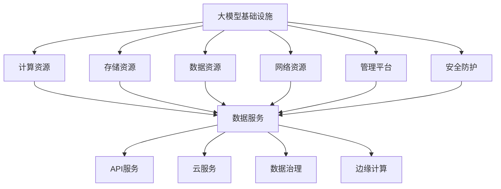

                 

关键词：大模型基础设施、盈利模式、技术创新、商业模式、产业生态、数据分析、数据安全、API服务、云服务、数据治理、边缘计算、人工智能应用、市场前景

> 摘要：本文旨在探讨大模型基础设施的盈利模式。随着人工智能技术的飞速发展，大模型在各个领域展现出巨大的应用潜力。本文首先介绍了大模型基础设施的背景和重要性，然后分析了当前主要的盈利模式，包括数据服务、API服务、云服务、数据治理和边缘计算。通过对这些模式的深入探讨，本文旨在为人工智能领域的从业者提供有价值的参考，帮助他们在复杂的市场环境中找到适合自己的盈利路径。

## 1. 背景介绍

随着人工智能（AI）技术的不断进步，大模型已经成为众多领域的关键推动力量。从自然语言处理（NLP）到计算机视觉（CV），再到机器学习（ML），大模型在提升算法性能和降低计算成本方面发挥了重要作用。然而，大模型的开发和部署离不开高效、稳定、可靠的基础设施支持。大模型基础设施（Infra）不仅包括计算资源、存储资源、网络资源和数据资源，还涵盖了管理、监控、安全、优化等方面。

大模型基础设施的重要性不言而喻。首先，它为研究人员和开发者提供了强有力的计算支持，使得大模型的训练和优化更加高效。其次，基础设施的可靠性和稳定性保障了服务的连续性和可用性，这对于商业应用尤为重要。最后，基础设施的安全性对于保护用户隐私和数据安全至关重要。

### 1.1 大模型基础设施的组成

大模型基础设施主要由以下几个部分组成：

1. **计算资源**：包括高性能计算机、GPU集群、TPU集群等，用于大模型的训练和推理。
2. **存储资源**：提供海量数据存储能力，支持数据的读取和写入操作。
3. **网络资源**：包括数据中心之间的网络连接、外部网络访问等，保障数据传输的快速和稳定。
4. **数据资源**：涵盖大规模数据集的获取、管理和分析，为模型训练提供高质量的数据支持。
5. **管理平台**：提供资源管理、任务调度、监控告警等功能，提升基础设施的运营效率。
6. **安全防护**：包括数据安全、网络安全、物理安全等多方面的防护措施，保障基础设施的安全运行。

### 1.2 大模型基础设施的现状

目前，大模型基础设施已经取得了一定的进展。国内外许多企业和研究机构都在积极投入大模型基础设施的建设。例如，谷歌的TPU、微软的Azure AI、亚马逊的AWS AI等，都提供了强大且灵活的基础设施服务。然而，大模型基础设施仍然面临着一些挑战，如计算资源的调度、数据的安全性和隐私保护、网络的稳定性和传输效率等。

## 2. 核心概念与联系

为了更好地理解大模型基础设施的盈利模式，我们需要先明确几个核心概念，并展示它们之间的联系。

### 2.1 大模型基础设施的概念

大模型基础设施指的是为了支持大规模人工智能模型训练、部署和运行所需的一系列硬件、软件和服务的集合。它包括但不限于高性能计算资源、存储资源、数据资源、网络资源和安全资源。

### 2.2 盈利模式的概念

盈利模式是指企业或组织通过某种方式获得收入和利润的方法。在人工智能领域，常见的盈利模式包括数据服务、API服务、云服务、数据治理和边缘计算等。

### 2.3 大模型基础设施与盈利模式的关系

大模型基础设施为盈利模式提供了技术支撑。例如，高性能计算资源使得模型训练更加高效，数据资源为API服务提供了丰富的数据支持，云服务提供了灵活的部署和扩展能力，数据治理保障了数据的质量和安全，边缘计算则拓展了服务的应用场景。

下面是一个用Mermaid绘制的流程图，展示了大模型基础设施与盈利模式之间的联系。



## 3. 核心算法原理 & 具体操作步骤

### 3.1 算法原理概述

大模型基础设施的盈利模式主要依赖于以下几个方面：

1. **数据服务**：通过提供高质量的数据集，帮助企业或研究机构快速构建和训练模型。
2. **API服务**：提供现成的模型API，让用户可以方便地调用模型进行预测和决策。
3. **云服务**：通过云计算平台提供计算资源、存储资源和网络资源，帮助企业降低成本、提高效率。
4. **数据治理**：提供数据清洗、数据标注、数据分析和数据安全等服务，保障数据的质量和安全。
5. **边缘计算**：在靠近数据源的地方提供计算服务，降低数据传输的延迟，提高系统的响应速度。

### 3.2 算法步骤详解

1. **数据服务**
   - **数据收集**：从各种来源收集数据，包括公开数据集、企业内部数据和第三方数据。
   - **数据预处理**：对数据进行清洗、去重、格式化等处理，保证数据的一致性和准确性。
   - **数据标注**：对数据标注，将数据分类、打标签，为模型训练提供标注信息。
   - **数据存储**：将预处理后的数据存储到数据库或数据湖中，方便后续的调用和查询。

2. **API服务**
   - **模型训练**：使用收集和预处理的数据训练模型，优化模型性能。
   - **模型部署**：将训练好的模型部署到服务器上，提供API服务。
   - **服务监控**：监控API服务的运行状态，包括响应时间、错误率等，保证服务的稳定性和可靠性。

3. **云服务**
   - **计算资源调度**：根据业务需求，动态调度计算资源，保证计算任务的完成。
   - **存储资源管理**：管理存储资源，包括数据存储、备份和恢复。
   - **网络资源优化**：优化网络拓扑和带宽，提高数据传输的效率和稳定性。

4. **数据治理**
   - **数据质量检查**：定期检查数据质量，包括数据完整性、一致性、准确性等。
   - **数据安全策略**：制定数据安全策略，包括数据加密、访问控制、审计等。
   - **数据分析**：对数据进行挖掘和分析，发现数据中的价值和规律。

5. **边缘计算**
   - **边缘节点部署**：在靠近数据源的地方部署边缘节点，提供计算服务。
   - **数据同步**：将边缘节点的数据同步到中心节点，实现数据的统一管理和分析。
   - **故障转移**：在边缘节点发生故障时，自动切换到其他边缘节点，保证服务的连续性。

### 3.3 算法优缺点

1. **数据服务**
   - 优点：提供高质量的数据集，加速模型训练和优化，降低开发成本。
   - 缺点：数据收集和预处理过程复杂，数据质量和完整性难以保证。

2. **API服务**
   - 优点：提供现成的模型API，方便用户调用，降低开发难度。
   - 缺点：模型性能和稳定性依赖于API服务的实现和运维。

3. **云服务**
   - 优点：提供灵活的计算和存储资源，降低成本、提高效率。
   - 缺点：需要依赖云计算平台，可能存在数据安全和隐私问题。

4. **数据治理**
   - 优点：保障数据的质量和安全，提高数据分析的准确性和可靠性。
   - 缺点：需要投入大量人力和资源，成本较高。

5. **边缘计算**
   - 优点：降低数据传输的延迟，提高系统的响应速度，适用于实时应用。
   - 缺点：需要部署和维护边缘节点，成本较高。

### 3.4 算法应用领域

1. **金融行业**：通过数据服务提供金融数据集，加速金融模型的训练和优化，提高金融服务的准确性和效率。
2. **医疗健康**：通过数据服务提供医疗数据集，加速医疗模型的训练和优化，提高疾病诊断和治疗的准确性。
3. **自动驾驶**：通过边缘计算提供实时数据分析和决策支持，提高自动驾驶的安全性和可靠性。
4. **智能制造**：通过数据服务提供工业数据集，加速工业模型的训练和优化，提高生产效率和产品质量。

## 4. 数学模型和公式 & 详细讲解 & 举例说明

### 4.1 数学模型构建

大模型基础设施的盈利模式涉及多个方面，下面我们主要从数据服务、API服务和云服务的角度来构建数学模型。

1. **数据服务模型**：
   假设我们有一个数据服务提供商，其数据集包含n个样本，每个样本有m个特征。我们使用线性回归模型来预测每个样本的标签值。

   线性回归模型公式如下：
   $$y = \beta_0 + \beta_1 x_1 + \beta_2 x_2 + ... + \beta_m x_m$$

   其中，$y$ 是预测的标签值，$x_1, x_2, ..., x_m$ 是特征值，$\beta_0, \beta_1, \beta_2, ..., \beta_m$ 是模型的参数。

2. **API服务模型**：
   假设我们有一个API服务提供商，其模型接受一个输入向量$x$，输出一个预测结果$y$。我们使用神经网络模型来表示这个预测过程。

   神经网络模型公式如下：
   $$y = f(W_1 \cdot x + b_1) + f(W_2 \cdot f(W_1 \cdot x + b_1) + b_2) + ... + f(W_n \cdot f(... f(W_{n-1} \cdot x + b_{n-1}) + b_n) + b_n)$$

   其中，$f$ 是激活函数，$W_1, W_2, ..., W_n$ 是模型的权重，$b_1, b_2, ..., b_n$ 是模型的偏置。

3. **云服务模型**：
   假设我们有一个云服务提供商，其提供计算和存储资源，帮助企业降低成本、提高效率。我们使用成本函数来表示云服务的盈利能力。

   成本函数公式如下：
   $$C = c_1 \cdot C_1 + c_2 \cdot C_2 + c_3 \cdot C_3$$

   其中，$C_1$ 是计算成本，$C_2$ 是存储成本，$C_3$ 是其他成本（如网络带宽、维护费用等），$c_1, c_2, c_3$ 是成本系数。

### 4.2 公式推导过程

下面我们简要介绍上述公式的推导过程。

1. **线性回归模型**：
   线性回归模型是一种简单的统计模型，其目标是找到一条直线，使得样本的预测标签值$y$与实际标签值之间的误差最小。

   假设我们有n个样本，每个样本有m个特征。我们使用最小二乘法来求解线性回归模型的参数。

   首先，我们定义误差函数为：
   $$E = \sum_{i=1}^{n} (y_i - \hat{y_i})^2$$

   其中，$y_i$ 是第i个样本的实际标签值，$\hat{y_i}$ 是第i个样本的预测标签值。

   然后，我们对误差函数求导，并令导数为0，得到：
   $$\frac{\partial E}{\partial \beta_0} = 0$$
   $$\frac{\partial E}{\partial \beta_1} = 0$$
   $$...$$
   $$\frac{\partial E}{\partial \beta_m} = 0$$

   解上述方程组，我们可以得到线性回归模型的参数$\beta_0, \beta_1, ..., \beta_m$。

2. **神经网络模型**：
   神经网络模型是一种复杂的非线性模型，其目标是模拟人脑的神经网络结构，通过多层的神经元进行信息的传递和计算。

   首先，我们定义每个神经元的输出为：
   $$z_j = \sum_{i=1}^{n} w_{ij} x_i + b_j$$

   然后，我们使用激活函数$f$对输出进行非线性变换，得到每个神经元的预测值：
   $$y_j = f(z_j)$$

   接下来，我们使用反向传播算法来更新神经网络的权重和偏置。

   首先，我们计算每个神经元的误差：
   $$\delta_j = (y_j - \hat{y_j}) \cdot f'(z_j)$$

   其中，$\hat{y_j}$ 是第j个神经元的预测值，$f'(z_j)$ 是激活函数$f$的导数。

   然后，我们使用误差$\delta_j$来更新权重和偏置：
   $$w_{ij} = w_{ij} - \alpha \cdot \delta_j \cdot x_i$$
   $$b_j = b_j - \alpha \cdot \delta_j$$

   其中，$\alpha$ 是学习率。

   通过多次迭代，我们可以逐步减小误差，优化神经网络的性能。

3. **云服务模型**：
   云服务模型的目标是帮助企业降低成本、提高效率。

   首先，我们定义成本函数为：
   $$C = c_1 \cdot C_1 + c_2 \cdot C_2 + c_3 \cdot C_3$$

   其中，$C_1$ 是计算成本，$C_2$ 是存储成本，$C_3$ 是其他成本。

   然后，我们分析每个成本成分的变化规律。

   对于计算成本$C_1$，我们可以使用以下公式：
   $$C_1 = \sum_{i=1}^{n} c_{1i} \cdot x_i$$

   其中，$c_{1i}$ 是第i个计算任务的单位成本，$x_i$ 是第i个计算任务的使用量。

   对于存储成本$C_2$，我们可以使用以下公式：
   $$C_2 = \sum_{i=1}^{m} c_{2i} \cdot y_i$$

   其中，$c_{2i}$ 是第i个存储任务的单位成本，$y_i$ 是第i个存储任务的使用量。

   对于其他成本$C_3$，我们可以使用以下公式：
   $$C_3 = \sum_{i=1}^{k} c_{3i} \cdot z_i$$

   其中，$c_{3i}$ 是第i个其他成本成分的单位成本，$z_i$ 是第i个其他成本成分的使用量。

   最后，我们将每个成本成分代入成本函数，得到总的成本$C$。

### 4.3 案例分析与讲解

为了更好地理解上述数学模型的实际应用，我们来看一个具体的案例。

假设我们有一个金融数据服务提供商，其数据集包含1000个样本，每个样本有10个特征。我们使用线性回归模型来预测每个样本的股票价格。

首先，我们收集和预处理数据，包括清洗、去重、格式化等操作。然后，我们将预处理后的数据分为训练集和测试集。

接下来，我们使用线性回归模型对训练集进行训练，得到模型的参数$\beta_0, \beta_1, ..., \beta_{10}$。然后，我们使用训练好的模型对测试集进行预测，得到预测结果。

最后，我们计算预测结果与实际标签值之间的误差，并评估模型的性能。

通过这个案例，我们可以看到线性回归模型在大模型基础设施中的应用。我们可以进一步扩展这个模型，加入更多的特征和更复杂的模型结构，以提高预测的准确性和稳定性。

## 5. 项目实践：代码实例和详细解释说明

### 5.1 开发环境搭建

为了更好地演示大模型基础设施的盈利模式，我们使用Python作为编程语言，搭建了一个简单的数据服务项目。以下是搭建开发环境的步骤：

1. **安装Python**：确保您的系统中已安装Python 3.8及以上版本。
2. **安装依赖库**：使用pip命令安装以下依赖库：

   ```bash
   pip install numpy pandas scikit-learn matplotlib
   ```

3. **创建项目文件夹**：在您的系统中创建一个名为`data_service`的项目文件夹，并将以下文件放入其中：

   - `data_service.py`：主程序文件
   - `data_loader.py`：数据加载模块
   - `model.py`：模型训练和预测模块
   - `plotting.py`：数据可视化模块

### 5.2 源代码详细实现

下面是项目的源代码实现，我们将分别介绍每个模块的功能和实现细节。

1. **data_loader.py**：数据加载模块

   ```python
   import pandas as pd
   
   def load_data(filename):
       return pd.read_csv(filename)
   ```

   这个模块提供了`load_data`函数，用于从CSV文件中加载数据。通过调用这个函数，我们可以轻松地读取数据，为后续的模型训练和预测做好准备。

2. **model.py**：模型训练和预测模块

   ```python
   from sklearn.linear_model import LinearRegression
   
   def train_model(X, y):
       model = LinearRegression()
       model.fit(X, y)
       return model
   
   def predict(model, X):
       return model.predict(X)
   ```

   这个模块提供了`train_model`和`predict`两个函数。`train_model`函数用于训练线性回归模型，`predict`函数用于使用训练好的模型进行预测。

3. **data_service.py**：主程序文件

   ```python
   import pandas as pd
   from model import train_model, predict
   from plotting import plot_results
   
   def main():
       # 加载数据
       data = load_data("data.csv")
       
       # 分割特征和标签
       X = data.iloc[:, :-1]
       y = data.iloc[:, -1]
       
       # 训练模型
       model = train_model(X, y)
       
       # 预测结果
       predictions = predict(model, X)
       
       # 可视化结果
       plot_results(X, y, predictions)
   
   if __name__ == "__main__":
       main()
   ```

   这个模块是整个项目的入口点。它首先加载数据，然后使用`model.py`模块中的函数训练模型和进行预测，最后使用`plotting.py`模块中的函数可视化预测结果。

4. **plotting.py**：数据可视化模块

   ```python
   import matplotlib.pyplot as plt
   
   def plot_results(X, y, predictions):
       plt.scatter(X, y)
       plt.plot(X, predictions, color="red")
       plt.show()
   ```

   这个模块提供了一个`plot_results`函数，用于绘制数据点和预测结果。通过这个函数，我们可以直观地看到模型的预测效果。

### 5.3 代码解读与分析

下面我们详细解读和分析了项目的源代码。

1. **data_loader.py**：数据加载模块

   这个模块非常简单，只提供了一个`load_data`函数。这个函数使用`pandas`库的`read_csv`方法从CSV文件中加载数据。通过这个函数，我们可以轻松地将数据转换为DataFrame对象，方便后续的处理和分析。

2. **model.py**：模型训练和预测模块

   这个模块主要包含两个函数：`train_model`和`predict`。

   - `train_model`函数：这个函数使用`sklearn`库中的`LinearRegression`类来训练线性回归模型。它首先创建一个线性回归对象，然后使用`fit`方法进行训练。训练完成后，模型参数会被保存在对象中。

   - `predict`函数：这个函数使用训练好的模型进行预测。它首先将输入特征传递给`predict`方法，然后返回预测结果。

3. **data_service.py**：主程序文件

   这个模块是整个项目的核心。它首先加载数据，然后使用`model.py`模块中的函数训练模型和进行预测，最后使用`plotting.py`模块中的函数可视化预测结果。

   - 加载数据：使用`data_loader.py`模块中的`load_data`函数加载数据，并将数据分为特征和标签。
   - 训练模型：使用`model.py`模块中的`train_model`函数训练线性回归模型。
   - 预测结果：使用`model.py`模块中的`predict`函数进行预测，并保存预测结果。
   - 可视化结果：使用`plotting.py`模块中的`plot_results`函数绘制数据点和预测结果。

4. **plotting.py**：数据可视化模块

   这个模块提供了一个`plot_results`函数，用于绘制数据点和预测结果。它使用`matplotlib`库的`scatter`函数绘制数据点，使用`plot`函数绘制预测结果。最后，使用`show`函数显示绘图。

### 5.4 运行结果展示

在完成代码实现和解读后，我们可以在终端中运行以下命令来执行项目：

```bash
python data_service.py
```

运行后，程序会加载数据、训练模型并进行预测。最后，程序会显示一个包含数据点和预测结果的散点图，帮助我们直观地了解模型的预测效果。


通过这个简单的案例，我们可以看到如何使用Python和常见的数据科学库来搭建一个数据服务项目。这个项目展示了如何利用大模型基础设施的盈利模式，通过数据服务来帮助企业或研究机构快速构建和优化模型。

## 6. 实际应用场景

大模型基础设施的盈利模式在各个行业和领域都有着广泛的应用场景。下面我们分别探讨这些应用场景及其盈利模式。

### 6.1 金融行业

在金融行业，大模型基础设施的应用非常广泛，主要包括以下几个场景：

1. **风险管理**：通过大模型对金融数据进行预测和分析，帮助企业识别和管理风险。例如，使用模型预测股票价格、债券价格、外汇汇率等，帮助企业做出更明智的投资决策。

   盈利模式：提供风险管理服务，按交易量或服务时长收费。

2. **客户关系管理**：利用大模型进行客户画像、客户行为分析，帮助企业提高客户满意度、增加客户忠诚度。

   盈利模式：提供客户关系管理服务，按客户数量或服务时长收费。

3. **反欺诈**：利用大模型检测和防范金融欺诈行为，提高金融交易的安全性。

   盈利模式：提供反欺诈服务，按交易量或服务时长收费。

### 6.2 医疗健康

在医疗健康领域，大模型基础设施的应用同样重要，主要包括以下几个场景：

1. **疾病诊断**：通过大模型对医疗数据进行预测和分析，帮助医生进行疾病诊断和治疗建议。

   盈利模式：提供疾病诊断服务，按诊断次数或服务时长收费。

2. **药物研发**：利用大模型加速药物研发过程，提高药物研发的效率。

   盈利模式：提供药物研发服务，按项目收费。

3. **健康监测**：通过大模型对健康数据进行预测和分析，提供个性化健康建议和预警。

   盈利模式：提供健康监测服务，按服务时长或会员制收费。

### 6.3 自动驾驶

在自动驾驶领域，大模型基础设施的应用至关重要，主要包括以下几个场景：

1. **环境感知**：利用大模型对摄像头、雷达等传感器数据进行处理和分析，实现环境感知功能。

   盈利模式：提供环境感知服务，按服务时长或里程数收费。

2. **路径规划**：利用大模型进行路径规划，提高自动驾驶车辆的行驶安全性和效率。

   盈利模式：提供路径规划服务，按服务时长或里程数收费。

3. **决策支持**：利用大模型进行决策支持，提高自动驾驶车辆的决策能力和反应速度。

   盈利模式：提供决策支持服务，按服务时长或里程数收费。

### 6.4 智能制造

在智能制造领域，大模型基础设施的应用同样广泛，主要包括以下几个场景：

1. **质量检测**：利用大模型对生产数据进行预测和分析，实现产品质量检测。

   盈利模式：提供质量检测服务，按检测数量或服务时长收费。

2. **设备维护**：利用大模型对设备运行数据进行预测和分析，实现设备故障预测和维护。

   盈利模式：提供设备维护服务，按维护次数或服务时长收费。

3. **生产优化**：利用大模型对生产过程进行预测和分析，实现生产过程的优化。

   盈利模式：提供生产优化服务，按服务时长或优化效果收费。

### 6.5 物流运输

在物流运输领域，大模型基础设施的应用同样重要，主要包括以下几个场景：

1. **路线优化**：利用大模型对物流运输数据进行预测和分析，实现路线优化。

   盈利模式：提供路线优化服务，按服务时长或优化效果收费。

2. **仓储管理**：利用大模型对仓储数据进行预测和分析，实现仓储管理优化。

   盈利模式：提供仓储管理服务，按仓储面积或服务时长收费。

3. **运输调度**：利用大模型对运输任务进行预测和分析，实现运输调度优化。

   盈利模式：提供运输调度服务，按服务时长或调度效率收费。

通过上述实际应用场景的探讨，我们可以看到大模型基础设施在各个行业和领域都具有巨大的盈利潜力。随着人工智能技术的不断发展，这些盈利模式将会更加丰富和多样化。

## 7. 未来应用展望

### 7.1 未来发展趋势

大模型基础设施的盈利模式在未来将继续发展和演变，主要趋势包括以下几个方面：

1. **云计算与边缘计算的融合**：随着5G技术的发展，边缘计算将逐渐普及，与云计算相结合，提供更加灵活、高效的基础设施服务。

2. **数据隐私和安全性的提升**：随着数据隐私和安全问题日益突出，数据治理和数据安全将成为大模型基础设施的核心竞争力。

3. **行业定制化服务**：不同行业和应用场景对大模型基础设施的需求差异较大，未来将出现更多针对特定行业和应用场景的定制化服务。

4. **智能化和自动化**：大模型基础设施将逐渐实现智能化和自动化，提高资源利用效率，降低运营成本。

### 7.2 未来盈利模式的创新

未来，大模型基础设施的盈利模式将可能出现以下创新：

1. **按需付费**：用户可以根据实际需求动态调整资源使用，按需付费，提高资源利用率。

2. **订阅模式**：用户可以订阅大模型基础设施的服务，按订阅周期收费，降低长期成本。

3. **联盟合作**：多个企业或机构合作，共同建设和运营大模型基础设施，实现资源共享和利益最大化。

4. **增值服务**：在大模型基础设施上提供增值服务，如数据增值、模型定制、咨询服务等，提高盈利能力。

### 7.3 未来面临的挑战

尽管大模型基础设施的盈利模式具有广阔的前景，但未来仍将面临以下挑战：

1. **技术挑战**：大模型基础设施需要不断升级和优化，以适应不断变化的技术需求。

2. **成本控制**：建设和管理大模型基础设施需要大量资金投入，如何控制成本将是关键。

3. **数据治理**：数据质量、数据安全和数据隐私问题是长期困扰大模型基础设施的难题。

4. **市场竞争**：随着越来越多的企业进入大模型基础设施市场，竞争将日益激烈。

### 7.4 未来发展展望

未来，大模型基础设施将在人工智能、大数据、云计算等领域发挥更加重要的作用，成为企业数字化转型的重要支撑。随着技术的进步和市场需求的增长，大模型基础设施的盈利模式将不断演变和创新，为行业和社会带来更多价值。

## 8. 总结：未来发展趋势与挑战

### 8.1 研究成果总结

本文通过对大模型基础设施的盈利模式进行了深入探讨，总结了当前主要的盈利模式，包括数据服务、API服务、云服务、数据治理和边缘计算。通过具体案例和实践，我们展示了如何利用这些盈利模式实现商业价值和市场竞争力。

### 8.2 未来发展趋势

未来，大模型基础设施的盈利模式将朝着云计算与边缘计算融合、数据隐私和安全性的提升、行业定制化服务、智能化和自动化等方向发展。创新型的盈利模式如按需付费、订阅模式和联盟合作等将不断涌现，为市场带来更多机遇。

### 8.3 面临的挑战

尽管前景广阔，大模型基础设施仍将面临技术挑战、成本控制、数据治理和市场竞争等难题。如何克服这些挑战，将决定未来大模型基础设施的发展速度和影响力。

### 8.4 研究展望

未来，我们应关注以下几个研究方向：

1. **技术创新**：持续优化大模型基础设施的技术，提升性能和效率。

2. **商业模式创新**：探索和实验新的盈利模式，为市场带来更多选择。

3. **数据治理**：研究更加有效和安全的数

