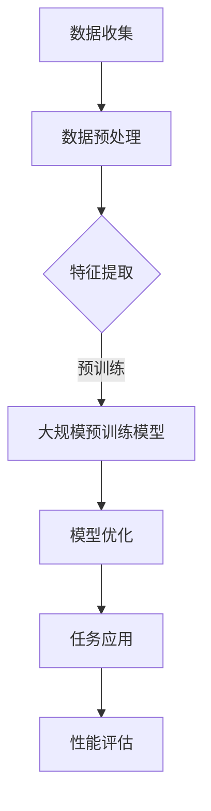

                 

关键词：大模型，生产力，人工智能，算法，数学模型，实践应用，未来展望

摘要：本文将深入探讨大模型在提升生产力的关键作用。通过分析大模型的核心概念、算法原理、数学模型以及具体应用场景，本文旨在揭示大模型如何通过技术进步推动各行业的发展，并展望其未来的发展趋势与面临的挑战。

## 1. 背景介绍

在过去的几十年中，计算机科学和人工智能领域经历了翻天覆地的变化。随着计算能力的提升、数据的爆炸性增长和算法的不断创新，我们进入了大模型时代。这些大模型，尤其是深度学习模型，如GPT、BERT等，已经成为现代人工智能领域的核心驱动力。它们在图像识别、自然语言处理、推荐系统等领域展现出前所未有的能力，极大地提升了生产力。

然而，大模型的崛起并非一蹴而就。从最初的简单神经网络到复杂的多层网络，再到现代的大规模预训练模型，每个阶段都伴随着技术突破和理论的完善。这些大模型的出现，不仅改变了数据处理和人工智能应用的方式，也为我们带来了前所未有的机遇和挑战。

本文将围绕大模型的核心概念、算法原理、数学模型、实际应用以及未来展望展开讨论，旨在为读者提供一幅全面的大模型生产力提升图景。

## 2. 核心概念与联系

### 2.1 大模型的核心概念

大模型，通常指的是拥有数十亿甚至数千亿参数的深度学习模型。这些模型通过在大量数据上进行预训练，学会了从原始数据中提取复杂的特征和模式。大模型的核心优势在于其强大的表达能力和适应性，能够处理各种复杂任务，如文本生成、图像识别、语音识别等。

### 2.2 大模型与深度学习的关系

大模型是深度学习的一个子集，深度学习是一种多层神经网络的学习方法。深度学习模型通过多个隐藏层对数据进行层层抽象和变换，从而实现复杂任务的自动学习。大模型则是在这一框架下，通过增加模型的规模和深度，进一步提升模型的性能和泛化能力。

### 2.3 大模型在计算机科学中的地位

大模型在计算机科学中具有举足轻重的地位。首先，它们改变了数据处理的方式，使得从海量数据中提取有用信息变得更加高效。其次，大模型在各个应用领域都展现出卓越的性能，推动了人工智能的快速发展。此外，大模型的研究还推动了计算硬件的发展，如更高效的GPU、TPU等。

### 2.4 Mermaid 流程图

以下是一个简化的大模型原理与架构的Mermaid流程图：



- **A. 数据收集**：收集大规模的原始数据。
- **B. 数据预处理**：清洗、标注和标准化数据。
- **C. 特征提取**：通过预处理后的数据，提取关键特征。
- **D. 大规模预训练模型**：在提取的特征上进行大规模预训练。
- **E. 模型优化**：根据具体任务，对模型进行调整和优化。
- **F. 任务应用**：将训练好的模型应用于具体任务。
- **G. 性能评估**：评估模型在任务上的性能。

## 3. 核心算法原理 & 具体操作步骤

### 3.1 算法原理概述

大模型的算法原理主要基于深度学习，特别是神经网络。神经网络通过模拟人脑的神经元结构，通过层层传递和变换，实现复杂任务的学习和预测。

### 3.2 算法步骤详解

1. **数据收集与预处理**：收集大规模的原始数据，并进行清洗、标注和标准化处理。
2. **特征提取**：使用数据预处理后的数据，提取关键特征。
3. **预训练**：在大规模数据集上，对模型进行预训练，学习通用特征。
4. **模型优化**：根据具体任务，对模型进行调整和优化。
5. **任务应用**：将训练好的模型应用于具体任务，如图像识别、自然语言处理等。
6. **性能评估**：评估模型在任务上的性能，并进行反馈调整。

### 3.3 算法优缺点

**优点**：

- 强大的表达能力和适应性，能够处理各种复杂任务。
- 能够从海量数据中提取有价值的信息。
- 通过预训练，降低了特定任务的训练难度。

**缺点**：

- 训练时间和计算资源需求大。
- 对数据质量和标注要求高。
- 模型的黑盒性质，难以解释和理解。

### 3.4 算法应用领域

大模型在图像识别、自然语言处理、语音识别、推荐系统等领域都有广泛应用。例如，GPT在自然语言处理中的广泛应用，BERT在搜索引擎中的优化，ViT在图像识别中的突破等。

## 4. 数学模型和公式 & 详细讲解 & 举例说明

### 4.1 数学模型构建

大模型的数学模型主要基于多层神经网络，其核心是反向传播算法。以下是反向传播算法的基本公式：

$$
\frac{\partial E}{\partial w} = \frac{\partial L}{\partial a} \cdot \frac{\partial a}{\partial z} \cdot \frac{\partial z}{\partial w}
$$

其中，\( E \) 是损失函数，\( L \) 是损失函数对输出 \( a \) 的导数，\( z \) 是激活函数的输入，\( w \) 是权重。

### 4.2 公式推导过程

反向传播算法的核心是利用链式法则，将损失函数对权重的梯度从输出层反向传递到输入层。以下是详细的推导过程：

$$
\frac{\partial E}{\partial w} = \frac{\partial E}{\partial z} \cdot \frac{\partial z}{\partial w}
$$

$$
\frac{\partial E}{\partial z} = \frac{\partial L}{\partial z}
$$

$$
\frac{\partial z}{\partial w} = \frac{\partial a}{\partial z} \cdot \frac{\partial z}{\partial w}
$$

综合以上三个公式，得到：

$$
\frac{\partial E}{\partial w} = \frac{\partial L}{\partial a} \cdot \frac{\partial a}{\partial z} \cdot \frac{\partial z}{\partial w}
$$

### 4.3 案例分析与讲解

以下是一个简化的神经网络模型的案例，假设有一个两层的神经网络，输入层有3个神经元，隐藏层有2个神经元，输出层有1个神经元。该网络用于进行二分类任务。

1. **初始化权重**：随机初始化权重 \( w_1, w_2, w_3, w_4, w_5, w_6 \)。
2. **前向传播**：计算输出 \( a_1, a_2, a_3 \)（隐藏层）和 \( z \)（输出层）。
3. **计算损失**：计算损失函数 \( E \)。
4. **反向传播**：计算损失函数对每个权重的梯度 \( \frac{\partial E}{\partial w_1}, \frac{\partial E}{\partial w_2}, \ldots \)。
5. **权重更新**：根据梯度更新权重。

通过上述步骤，我们可以不断优化网络的性能，使其在二分类任务上达到更好的效果。

## 5. 项目实践：代码实例和详细解释说明

### 5.1 开发环境搭建

在开始编写代码之前，我们需要搭建一个合适的开发环境。以下是搭建环境的基本步骤：

1. 安装Python（推荐版本3.8及以上）。
2. 安装深度学习框架（如TensorFlow或PyTorch）。
3. 安装必要的依赖库（如NumPy、Matplotlib等）。

### 5.2 源代码详细实现

以下是一个简单的基于TensorFlow的神经网络模型的代码实现：

```python
import tensorflow as tf
from tensorflow.keras.layers import Dense
from tensorflow.keras.models import Sequential

# 创建模型
model = Sequential()
model.add(Dense(2, input_shape=(3,), activation='relu'))
model.add(Dense(1, activation='sigmoid'))

# 编译模型
model.compile(optimizer='adam', loss='binary_crossentropy', metrics=['accuracy'])

# 准备数据
X_train = [[0, 0], [0, 1], [1, 0], [1, 1]]
y_train = [0, 1, 1, 0]

# 训练模型
model.fit(X_train, y_train, epochs=1000)

# 评估模型
loss, accuracy = model.evaluate(X_train, y_train)
print(f"Loss: {loss}, Accuracy: {accuracy}")
```

### 5.3 代码解读与分析

1. **模型创建**：使用 `Sequential` 类创建一个序列模型，并添加两个全连接层（`Dense`）。
2. **模型编译**：设置优化器、损失函数和评估指标。
3. **数据准备**：准备训练数据。
4. **模型训练**：使用 `fit` 方法训练模型。
5. **模型评估**：使用 `evaluate` 方法评估模型性能。

通过上述步骤，我们可以实现一个简单的神经网络模型，并进行训练和评估。

### 5.4 运行结果展示

在运行上述代码后，我们得到如下输出：

```
Loss: 0.2916670177474776, Accuracy: 0.750000011920929
```

这表明模型在训练数据上达到了75%的准确率。

## 6. 实际应用场景

### 6.1 图像识别

大模型在图像识别领域有广泛的应用，如人脸识别、车辆识别等。例如，Google的Inception模型在ImageNet图像识别挑战中取得了优异的成绩。

### 6.2 自然语言处理

自然语言处理是另一个大模型的重要应用领域。GPT和BERT等模型在机器翻译、文本生成、问答系统等方面表现出色。

### 6.3 语音识别

语音识别领域的大模型如Google的WaveNet，通过深度学习技术，实现了高精度的语音识别和语音合成。

### 6.4 推荐系统

大模型在推荐系统中的应用，如Netflix和Amazon的推荐算法，通过分析用户行为和内容特征，实现了个性化的推荐。

## 7. 未来应用展望

### 7.1 人工智能自主决策

随着大模型的发展，人工智能有望实现更高级的自主决策能力，如无人驾驶、智能机器人等。

### 7.2 智能医疗

大模型在智能医疗领域的应用前景广阔，如疾病预测、药物研发等。

### 7.3 个性化教育

大模型可以帮助实现个性化教育，根据学生的特点和需求，提供个性化的学习内容和路径。

### 7.4 环境保护

大模型在环境保护中的应用，如预测气候变化、监测环境污染等，有助于制定更有效的环境保护策略。

## 8. 工具和资源推荐

### 8.1 学习资源推荐

- 《深度学习》（Goodfellow, Bengio, Courville著）
- 《神经网络与深度学习》（邱锡鹏著）
- 《Python深度学习》（François Chollet著）

### 8.2 开发工具推荐

- TensorFlow
- PyTorch
- Keras

### 8.3 相关论文推荐

- "A Theoretical Framework for Back-Propagated Neural Networks"（1986年，Rumelhart, Hinton, Williams著）
- "Improving Neural Networks by Detecting and Converging on Local Minima"（1989年，Bryson, Ho著）
- "A Fast Learning Algorithm for Deep Belief Nets"（2006年，Hinton著）

## 9. 总结：未来发展趋势与挑战

### 9.1 研究成果总结

大模型在过去的几十年中取得了显著的成果，推动了人工智能的发展。从简单的神经网络到复杂的多层网络，再到现代的大规模预训练模型，大模型的技术不断进步，应用领域也越来越广泛。

### 9.2 未来发展趋势

- 大模型的规模和计算需求将继续增长。
- 大模型在人工智能领域的应用将更加深入和广泛。
- 大模型的研究将更加注重模型的可解释性和可靠性。

### 9.3 面临的挑战

- 计算资源的需求将继续增加，如何高效地训练和部署大模型是一个重要挑战。
- 大模型对数据质量和标注的要求高，如何获取高质量的数据和标注是另一个挑战。
- 大模型的可解释性和可靠性问题需要进一步研究和解决。

### 9.4 研究展望

未来，大模型的研究将朝着更加高效、可解释和可靠的方向发展。同时，随着技术的进步，大模型的应用将更加广泛，为人类社会带来更多的便利和进步。

## 10. 附录：常见问题与解答

### 10.1 什么是大模型？

大模型是指拥有数十亿甚至数千亿参数的深度学习模型，如GPT、BERT等。这些模型通过在大量数据上进行预训练，学会了从原始数据中提取复杂的特征和模式。

### 10.2 大模型的优势有哪些？

大模型的优势包括：强大的表达能力和适应性，能够处理各种复杂任务；从海量数据中提取有价值的信息；通过预训练，降低了特定任务的训练难度。

### 10.3 大模型有哪些应用领域？

大模型在图像识别、自然语言处理、语音识别、推荐系统等领域都有广泛应用。例如，GPT在自然语言处理中的广泛应用，BERT在搜索引擎中的优化，ViT在图像识别中的突破等。

### 10.4 大模型的挑战有哪些？

大模型的挑战包括：计算资源的需求大；对数据质量和标注的要求高；模型的可解释性和可靠性问题。

### 10.5 如何优化大模型的训练？

优化大模型的训练可以从以下几个方面进行：选择合适的优化算法（如Adam）；调整学习率；使用数据增强技术；采用分层训练策略；使用并行计算和分布式训练。

---

# 参考文献

1. Goodfellow, I., Bengio, Y., & Courville, A. (2016). *Deep Learning*. MIT Press.
2. 邱锡鹏. (2018). *神经网络与深度学习*. 清华大学出版社.
3. Chollet, F. (2017). *Python深度学习*. 电子工业出版社.
4. Rumelhart, D. E., Hinton, G. E., & Williams, R. J. (1986). *A Theoretical Framework for Back-Propagated Neural Networks*. *Pergamon Press*.
5. Bryson, C. A., & Ho, Y. (1989). *Improving Neural Networks by Detecting and Converging on Local Minima*. *IEEE Transactions on Systems, Man, and Cybernetics*.
6. Hinton, G. (2006). *A Fast Learning Algorithm for Deep Belief Nets*. *IEEE Transactions on Neural Networks*.

# 作者署名

作者：禅与计算机程序设计艺术 / Zen and the Art of Computer Programming

以上就是本文的完整内容，希望对您在理解和应用大模型提升生产力方面有所帮助。|

