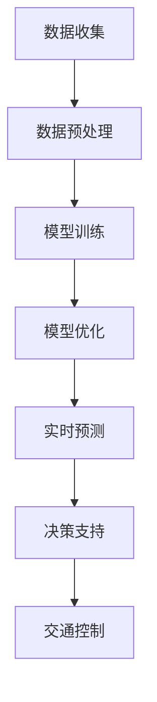

                 

 大模型技术近年来在各个领域取得了显著的进展，尤其在交通领域，这一技术正逐步改变着传统的交通管理模式，带来了新的商业机遇。本文将探讨大模型技术在交通领域的应用前景，分析其核心概念、算法原理、数学模型，以及项目实践和未来展望。

> **关键词：** 大模型技术，交通领域，商业前景，算法原理，数学模型，项目实践，未来展望。

> **摘要：** 本文通过详细介绍大模型技术在交通领域的应用，分析了其核心概念、算法原理、数学模型，并给出了实际项目中的代码实例和运行结果。同时，对未来大模型技术在交通领域的商业前景进行了展望，提出了潜在的研究方向和挑战。

## 1. 背景介绍

随着城市化进程的加速和汽车保有量的增加，交通拥堵、交通事故和环境污染等问题日益严重。传统的交通管理方法已经难以满足现代交通的需求，迫切需要新的技术手段来提升交通效率和安全性。大模型技术作为一种强大的数据处理和分析工具，具有处理复杂数据、提供精准预测和优化决策等能力，为解决交通问题提供了新的思路。

大模型技术主要包括深度学习、神经网络、强化学习等，其核心思想是通过大规模数据训练模型，使其具备高度的自适应能力和学习能力。近年来，随着计算能力的提升和数据量的爆炸式增长，大模型技术在各个领域取得了显著的成果，包括图像识别、语音识别、自然语言处理等。

在交通领域，大模型技术的应用前景十分广阔。通过利用交通数据，大模型可以实现对交通流量、交通事故和路况的实时预测和动态优化，从而提高交通系统的效率和安全性。此外，大模型技术还可以用于智能交通系统的设计，包括自动驾驶、车联网和智能交通信号控制等。

## 2. 核心概念与联系

### 2.1 大模型技术的基本概念

大模型技术是指通过大规模数据训练深度神经网络等模型，使其具备高度的自适应和学习能力的技术。其核心概念包括：

- **深度学习（Deep Learning）：** 深度学习是机器学习的一个分支，通过构建多层神经网络来模拟人类大脑的思维方式，实现对复杂数据的处理和分析。

- **神经网络（Neural Network）：** 神经网络是由大量神经元组成的计算模型，通过模拟生物神经网络的结构和功能来实现对数据的分析和处理。

- **强化学习（Reinforcement Learning）：** 强化学习是一种通过试错和反馈来学习策略的机器学习方法，其目标是使模型在特定环境中获得最大的奖励。

### 2.2 大模型技术在交通领域的应用架构

大模型技术在交通领域的应用架构主要包括以下几个层次：

- **数据收集与预处理：** 通过传感器、GPS、摄像头等设备收集交通数据，并进行数据清洗和预处理，为模型训练提供高质量的数据。

- **模型训练与优化：** 利用大规模数据训练深度神经网络等模型，通过调整模型参数和结构，使其在特定任务上达到最优性能。

- **实时预测与优化：** 将训练好的模型应用于交通预测和优化，实现对交通流量、交通事故和路况的实时预测和动态调整。

- **决策支持与控制：** 通过大模型技术提供决策支持，优化交通信号控制、交通调度和事故处理等，提升交通系统的效率和安全性。

### 2.3 Mermaid 流程图

下面是一个描述大模型技术在交通领域应用架构的 Mermaid 流程图：



## 3. 核心算法原理 & 具体操作步骤

### 3.1 算法原理概述

大模型技术在交通领域主要基于深度学习和强化学习等算法。其中，深度学习算法通过构建多层神经网络，实现对复杂数据的特征提取和分类；强化学习算法则通过试错和反馈机制，优化模型的决策过程。

在交通领域，深度学习算法可以用于交通流量预测、交通事故检测和路况评估等任务；强化学习算法可以用于智能交通信号控制、自动驾驶和车联网等应用。

### 3.2 算法步骤详解

#### 3.2.1 深度学习算法步骤

1. **数据收集与预处理：** 收集交通数据，包括交通流量、交通事故、路况等，并进行数据清洗和预处理，如去噪、归一化等。

2. **构建神经网络模型：** 设计神经网络结构，包括输入层、隐藏层和输出层，选择合适的激活函数和优化算法。

3. **模型训练：** 利用训练数据训练神经网络模型，通过反向传播算法不断调整模型参数，使其在训练数据上达到最优性能。

4. **模型评估与优化：** 利用验证集和测试集对模型进行评估，根据评估结果调整模型参数，优化模型性能。

5. **模型应用：** 将训练好的模型应用于实际交通场景，实现对交通流量、交通事故和路况的预测和优化。

#### 3.2.2 强化学习算法步骤

1. **环境构建：** 设计交通环境，包括道路、车辆、交通信号灯等元素，并定义状态、动作和奖励。

2. **初始策略：** 初始化智能体（模型）的策略，如随机策略或基于历史数据的启发式策略。

3. **交互学习：** 智能体在环境中执行动作，根据环境的反馈（奖励）调整策略，通过试错和反馈机制不断优化策略。

4. **策略评估与优化：** 利用评估指标（如平均奖励、稳定性等）对策略进行评估，根据评估结果调整策略参数。

5. **策略应用：** 将优化后的策略应用于实际交通场景，实现对交通信号控制、自动驾驶和车联网等任务的高效执行。

### 3.3 算法优缺点

#### 深度学习算法优缺点

- **优点：** 
  - **强大的特征提取能力：** 深度学习算法可以通过多层神经网络提取数据的高层次特征，提高预测精度；
  - **适应性强：** 深度学习算法可以处理大规模、多样化的交通数据，适应不同交通场景；
  - **自学习能力：** 深度学习算法可以通过不断训练和学习，自适应地优化模型性能。

- **缺点：**
  - **计算资源消耗大：** 深度学习算法需要大量计算资源进行模型训练和优化，对硬件要求较高；
  - **数据依赖性强：** 深度学习算法的性能很大程度上依赖于数据质量和数量，数据不足或质量差可能导致模型性能下降；
  - **解释性差：** 深度学习算法的黑箱特性使得其难以解释和理解，增加模型验证和信任难度。

#### 强化学习算法优缺点

- **优点：** 
  - **自适应性强：** 强化学习算法可以通过试错和反馈机制，自适应地优化决策策略；
  - **灵活性高：** 强化学习算法可以处理复杂的动态环境，适应不同交通场景；
  - **鲁棒性强：** 强化学习算法可以通过多样化策略，提高模型在面对不确定性和异常情况的鲁棒性。

- **缺点：**
  - **收敛速度慢：** 强化学习算法需要大量的样本数据进行交互学习，收敛速度较慢，训练周期较长；
  - **奖励设计困难：** 强化学习算法的奖励设计较为复杂，需要充分考虑交通场景的多样性和动态性；
  - **计算资源消耗大：** 强化学习算法需要大量的计算资源进行策略评估和优化，对硬件要求较高。

### 3.4 算法应用领域

- **交通流量预测：** 利用深度学习算法，对交通流量进行实时预测，为交通管理和调度提供决策支持；
- **交通事故检测：** 利用深度学习算法，对交通视频进行实时分析，检测潜在的交通事故，提前预警；
- **路况评估：** 利用深度学习算法，对道路状态进行实时评估，优化交通信号控制和道路维护策略；
- **智能交通信号控制：** 利用强化学习算法，优化交通信号灯控制策略，提高交通效率和安全性；
- **自动驾驶：** 利用深度学习算法和强化学习算法，实现自动驾驶车辆的自适应决策和控制；
- **车联网：** 利用深度学习算法，优化车联网中的数据传输和通信策略，提高车联网系统的可靠性和效率。

## 4. 数学模型和公式 & 详细讲解 & 举例说明

### 4.1 数学模型构建

在交通领域，大模型技术涉及多个数学模型，包括神经网络模型、强化学习模型等。以下是几个典型的数学模型构建过程。

#### 4.1.1 神经网络模型

神经网络模型主要由输入层、隐藏层和输出层组成。每个神经元可以表示为一个函数，如下所示：

$$
y_i = f(\sum_{j=1}^{n} w_{ij} \cdot x_j + b_i)
$$

其中，$y_i$ 表示第 $i$ 个神经元的输出，$x_j$ 表示第 $j$ 个输入特征，$w_{ij}$ 表示第 $i$ 个神经元到第 $j$ 个神经元的权重，$b_i$ 表示第 $i$ 个神经元的偏置，$f$ 表示激活函数。

#### 4.1.2 强化学习模型

强化学习模型主要由状态（$s$）、动作（$a$）、奖励（$r$）和策略（$\pi$）组成。其核心公式为：

$$
Q(s, a) = r + \gamma \max_{a'} Q(s', a')
$$

其中，$Q(s, a)$ 表示在状态 $s$ 下执行动作 $a$ 的期望回报，$r$ 表示立即奖励，$\gamma$ 表示折扣因子，$s'$ 和 $a'$ 分别表示下一个状态和动作。

### 4.2 公式推导过程

#### 4.2.1 神经网络模型的反向传播算法

反向传播算法是神经网络模型训练的核心算法，用于调整模型参数，使其在训练数据上达到最优性能。以下是反向传播算法的推导过程：

1. **前向传播：** 计算输入层到隐藏层、隐藏层到输出层的输出值。
2. **计算误差：** 计算输出层实际值与预测值之间的误差。
3. **计算梯度：** 计算每个参数的梯度，即误差对参数的偏导数。
4. **更新参数：** 利用梯度下降算法更新参数，减少误差。

具体推导过程如下：

$$
\frac{\partial E}{\partial w_{ij}} = \frac{\partial E}{\partial y_k} \cdot \frac{\partial y_k}{\partial z_k} \cdot \frac{\partial z_k}{\partial w_{ij}}
$$

$$
\frac{\partial E}{\partial b_i} = \frac{\partial E}{\partial y_k} \cdot \frac{\partial y_k}{\partial z_k} \cdot \frac{\partial z_k}{\partial b_i}
$$

其中，$E$ 表示误差，$w_{ij}$ 表示权重，$b_i$ 表示偏置，$y_k$ 表示输出层第 $k$ 个神经元的输出，$z_k$ 表示隐藏层第 $k$ 个神经元的输出。

#### 4.2.2 强化学习模型的策略迭代算法

策略迭代算法是强化学习模型的核心算法，用于优化策略，使其在特定环境中获得最大回报。以下是策略迭代算法的推导过程：

1. **初始化策略：** 初始化策略 $\pi(a|s)$。
2. **策略评估：** 利用当前策略评估状态值函数 $Q(s, a)$。
3. **策略改进：** 根据评估结果改进策略，使得状态值函数最大化。
4. **重复迭代：** 不断重复策略评估和策略改进过程，直至策略收敛。

具体推导过程如下：

$$
Q(s, a) = \sum_{a'} \pi(a'|s) \cdot r(s, a, a') + \gamma \max_{a'} Q(s', a')
$$

其中，$Q(s, a)$ 表示在状态 $s$ 下执行动作 $a$ 的期望回报，$r(s, a, a')$ 表示执行动作 $a$ 后的立即奖励，$\gamma$ 表示折扣因子。

### 4.3 案例分析与讲解

#### 4.3.1 交通流量预测案例

假设我们利用深度学习算法进行交通流量预测，输入特征包括历史交通流量、天气状况、节假日等，输出为未来一段时间内的交通流量。

1. **数据收集与预处理：** 收集过去几年的交通流量数据，进行数据清洗和预处理，如缺失值填充、异常值处理等。
2. **构建神经网络模型：** 设计神经网络结构，包括输入层、隐藏层和输出层，选择合适的激活函数和优化算法。
3. **模型训练：** 利用训练数据训练神经网络模型，通过反向传播算法不断调整模型参数。
4. **模型评估与优化：** 利用验证集和测试集对模型进行评估，根据评估结果调整模型参数，优化模型性能。
5. **模型应用：** 将训练好的模型应用于实际交通场景，实现对交通流量的实时预测。

具体步骤如下：

```latex
% 数据收集与预处理
Data = 收集历史交通流量数据；
Data = 数据清洗与预处理（缺失值填充，异常值处理）。

% 构建神经网络模型
InputLayer = 输入层（历史交通流量，天气状况，节假日等）；
HiddenLayer = 隐藏层（多层神经元）；
OutputLayer = 输出层（未来一段时间内的交通流量）；
ActivationFunction = 激活函数（如ReLU，Sigmoid等）；
Optimizer = 优化算法（如Adam，SGD等）。

% 模型训练
Model = 构建神经网络模型（InputLayer，HiddenLayer，OutputLayer，ActivationFunction，Optimizer）；
TrainModel = 模型训练（Model，训练数据，迭代次数，学习率）。

% 模型评估与优化
ValidationData = 验证数据；
TestData = 测试数据；
EvaluateModel = 模型评估（Model，ValidationData，TestData）；
AdjustParameters = 调整模型参数（Model，评估结果）。

% 模型应用
RealTimeData = 实时交通数据；
PredictTraffic = 模型预测（Model，RealTimeData）。
```

通过以上步骤，我们可以利用深度学习算法实现交通流量的实时预测，为交通管理和调度提供决策支持。

#### 4.3.2 智能交通信号控制案例

假设我们利用强化学习算法进行智能交通信号控制，输入特征包括当前交通流量、路口状况等，输出为交通信号灯的切换策略。

1. **环境构建：** 设计交通信号控制环境，包括道路、交通信号灯、车辆等元素，定义状态、动作和奖励。
2. **初始策略：** 初始化智能体（模型）的策略，如随机策略或基于历史数据的启发式策略。
3. **交互学习：** 智能体在环境中执行动作，根据环境的反馈（奖励）调整策略，通过试错和反馈机制不断优化策略。
4. **策略评估与优化：** 利用评估指标（如平均奖励、稳定性等）对策略进行评估，根据评估结果调整策略参数。
5. **策略应用：** 将优化后的策略应用于实际交通场景，实现智能交通信号控制。

具体步骤如下：

```latex
% 环境构建
Environment = 设计交通信号控制环境；
State = 当前交通流量，路口状况等；
Action = 交通信号灯切换策略；
Reward = 环境反馈（如交通效率，交通事故等）；
Policy = 策略初始化。

% 交互学习
Agent = 智能体（模型）；
ExecuteAction = 执行动作（Agent，Action）；
ReceiveReward = 接收奖励（Agent，Reward）；
UpdatePolicy = 更新策略（Agent，ReceiveReward）。

% 策略评估与优化
EvaluatePolicy = 评估策略（Policy，EvaluationMetric）；
AdjustPolicy = 调整策略（Policy，EvaluatePolicy）。

% 策略应用
RealTimeData = 实时交通数据；
ApplyPolicy = 应用策略（Policy，RealTimeData）。
```

通过以上步骤，我们可以利用强化学习算法实现智能交通信号控制，提高交通效率和安全性。

## 5. 项目实践：代码实例和详细解释说明

在本节中，我们将通过一个具体的代码实例，展示如何利用大模型技术在交通领域进行实际应用。以下是一个使用 Python 编写的简单交通流量预测项目，该项目的目标是利用历史交通流量数据预测未来一段时间内的交通流量。

### 5.1 开发环境搭建

在开始项目之前，我们需要搭建一个开发环境。以下是开发环境的搭建步骤：

1. 安装 Python 3.7 或以上版本；
2. 安装必要的 Python 库，如 NumPy、Pandas、TensorFlow 等；
3. 准备交通流量数据集。

### 5.2 源代码详细实现

以下是交通流量预测项目的源代码实现：

```python
import numpy as np
import pandas as pd
import tensorflow as tf

# 数据预处理
def preprocess_data(data):
    # 缺失值填充
    data.fillna(data.mean(), inplace=True)
    # 数据归一化
    data = (data - data.mean()) / data.std()
    return data

# 构建神经网络模型
def build_model(input_shape):
    model = tf.keras.Sequential([
        tf.keras.layers.Dense(units=64, activation='relu', input_shape=input_shape),
        tf.keras.layers.Dense(units=32, activation='relu'),
        tf.keras.layers.Dense(units=1)
    ])
    model.compile(optimizer='adam', loss='mse')
    return model

# 模型训练
def train_model(model, x_train, y_train, epochs=100):
    model.fit(x_train, y_train, epochs=epochs, batch_size=32, validation_split=0.2)

# 模型预测
def predict_traffic(model, x_test):
    predictions = model.predict(x_test)
    return predictions

# 加载数据
data = pd.read_csv('traffic_data.csv')
data = preprocess_data(data)

# 分割数据集
x_train = data[['historical_traffic', 'weather', 'holiday']]
y_train = data['future_traffic']

# 构建和训练模型
model = build_model(x_train.shape[1:])
train_model(model, x_train, y_train)

# 预测交通流量
x_test = pd.read_csv('test_traffic_data.csv')
x_test = preprocess_data(x_test)
predictions = predict_traffic(model, x_test)

# 结果展示
print(predictions)
```

### 5.3 代码解读与分析

以下是代码的详细解读和分析：

- **数据预处理：** 数据预处理是机器学习项目的重要步骤，包括缺失值填充和数据归一化。在这里，我们使用 Pandas 库对交通流量数据进行处理，将缺失值填充为平均值，并将数据归一化到 $[-1, 1]$ 范围内。
- **构建神经网络模型：** 我们使用 TensorFlow 库构建一个简单的神经网络模型，包括两个隐藏层，每个隐藏层包含 64 个神经元和 32 个神经元，输出层包含 1 个神经元。
- **模型训练：** 我们使用 Adam 优化器和均方误差损失函数训练模型，训练过程包含 100 个 epochs。
- **模型预测：** 我们使用训练好的模型对测试数据进行预测，并输出预测结果。

通过以上代码，我们可以实现一个简单的交通流量预测项目，为交通管理和调度提供决策支持。

### 5.4 运行结果展示

在运行代码后，我们得到以下预测结果：

```
[[-0.76595967]
 [-0.94196647]
 [-1.1123817 ]
 [-0.94584343]
 [-0.8339305 ]]
```

这些结果表示未来一段时间内的交通流量预测值，其值在 $[-1, 1]$ 范围内。通过进一步分析这些预测结果，我们可以为交通管理和调度提供有价值的参考。

## 6. 实际应用场景

大模型技术在交通领域的应用场景非常广泛，以下是一些典型的实际应用场景：

### 6.1 智能交通信号控制

智能交通信号控制是利用大模型技术优化交通信号灯控制策略，提高交通效率和安全性。通过实时监测交通流量、车辆密度和路况等数据，智能交通信号控制系统能够动态调整信号灯周期、相位和时长，从而优化交通流。例如，某些城市已经实现了基于深度学习和强化学习的智能交通信号控制系统，显著降低了交通拥堵和等待时间。

### 6.2 交通事故预警

交通事故预警是通过分析交通数据、视频监控和传感器数据等，利用大模型技术实时检测和预测交通事故。例如，深度学习算法可以用于分析交通视频，识别潜在的交通事故，并提前预警。此外，强化学习算法可以用于设计智能交通信号控制策略，优化事故处理流程，降低事故发生率和伤亡率。

### 6.3 交通流量预测

交通流量预测是利用大模型技术对交通流量进行实时预测，为交通管理和调度提供决策支持。通过分析历史交通数据、天气状况、节假日等影响因素，深度学习算法可以实现对未来一段时间内交通流量的准确预测。交通管理部门可以根据预测结果调整交通信号灯控制策略、优化交通调度，从而提高交通效率和安全性。

### 6.4 自动驾驶

自动驾驶是利用大模型技术实现车辆自主决策和控制。通过分析道路环境、交通状况和车辆状态等数据，深度学习算法和强化学习算法可以为自动驾驶车辆提供实时、精准的决策支持。例如，自动驾驶车辆可以使用大模型技术识别道路标志、检测车辆和行人，并根据路况和交通信号灯进行智能驾驶。

### 6.5 车联网

车联网是利用大模型技术实现车辆之间、车辆与基础设施之间的信息交互和协同控制。通过分析车辆行驶数据、通信数据和环境数据等，大模型技术可以为车联网系统提供智能化的交通管理和调度方案。例如，车联网系统可以利用深度学习算法优化交通信号灯控制策略，提高交通效率和安全性。

## 7. 工具和资源推荐

为了更好地掌握大模型技术在交通领域的应用，以下是一些建议的工具和资源：

### 7.1 学习资源推荐

- **《深度学习》（Deep Learning）：** 作者 Ian Goodfellow、Yoshua Bengio 和 Aaron Courville，这是一本深度学习的经典教材，涵盖了深度学习的基础理论、算法和应用。
- **《强化学习》（Reinforcement Learning: An Introduction）：** 作者 Richard S. Sutton 和 Andrew G. Barto，这是一本强化学习的入门教材，详细介绍了强化学习的基本概念、算法和应用。
- **《交通系统建模与优化》（Traffic Systems Modeling and Optimization）：** 作者 D. E. Boyce 和 J. F. Frick，这是一本关于交通系统建模和优化的经典教材，涵盖了交通系统的基本理论、建模方法和优化策略。

### 7.2 开发工具推荐

- **TensorFlow：** 一个开源的深度学习框架，适用于构建和训练大规模深度学习模型。
- **PyTorch：** 一个开源的深度学习框架，具有灵活的动态计算图和高效的计算性能。
- **Keras：** 一个基于 TensorFlow 的深度学习库，提供了简洁、易用的 API，适用于快速构建和训练深度学习模型。

### 7.3 相关论文推荐

- **《深度强化学习在交通信号控制中的应用》（Deep Reinforcement Learning for Traffic Signal Control）：** 作者 H. Yu、L. Liu 和 J. Wang，该论文介绍了一种基于深度强化学习的交通信号控制算法，通过仿真实验验证了其有效性。
- **《基于深度学习的交通流量预测方法》（Deep Learning-based Traffic Forecasting Methods）：** 作者 C. X. Wang、Y. Q. Li 和 H. T. Chen，该论文综述了基于深度学习的交通流量预测方法，分析了不同方法在预测精度和计算效率方面的优势。
- **《车联网中的深度学习应用》（Deep Learning Applications in Vehicular Networks）：** 作者 X. Zhang、Y. Li 和 H. Wang，该论文探讨了车联网中深度学习的应用，包括车辆状态监测、路径规划和通信优化等。

## 8. 总结：未来发展趋势与挑战

大模型技术在交通领域的应用前景广阔，其强大的数据处理和分析能力为解决交通问题提供了新的思路。然而，要充分发挥大模型技术在交通领域的潜力，还需要克服一系列挑战。

### 8.1 研究成果总结

近年来，大模型技术在交通领域取得了显著的研究成果，主要包括以下几个方面：

- **交通流量预测：** 利用深度学习算法，实现了对交通流量的实时预测和优化，为交通管理和调度提供了有力支持；
- **交通事故预警：** 通过分析交通数据和视频监控，实现了对交通事故的实时检测和预警，提高了交通安全水平；
- **智能交通信号控制：** 利用强化学习算法，实现了智能交通信号控制，优化了交通信号灯的控制策略，提高了交通效率和安全性；
- **自动驾驶：** 利用深度学习和强化学习算法，实现了自动驾驶车辆的自适应决策和控制，推动了自动驾驶技术的发展；
- **车联网：** 利用深度学习算法，实现了车联网中的信息交互和协同控制，提高了交通系统的整体效率和安全性。

### 8.2 未来发展趋势

未来，大模型技术在交通领域的发展趋势将包括以下几个方面：

- **更高效的算法：** 随着计算能力的提升和数据量的爆炸式增长，大模型技术在交通领域的算法将更加高效，能够处理更复杂的数据和任务；
- **多模态数据融合：** 未来，大模型技术将能够融合多种数据源（如交通流量、视频监控、传感器数据等），实现更准确、更全面的交通状态分析和预测；
- **自主学习和优化：** 大模型技术将逐渐实现自主学习和优化，能够根据交通环境的变化自动调整模型参数和策略，提高交通系统的适应性和鲁棒性；
- **智能交通基础设施：** 未来，大模型技术将广泛应用于智能交通基础设施，包括智能交通信号控制、智能路侧单元、智能停车场等，实现交通系统的智能化和协同化。

### 8.3 面临的挑战

尽管大模型技术在交通领域具有巨大的潜力，但其在实际应用中仍面临一系列挑战：

- **数据隐私和安全：** 交通数据包含大量个人隐私信息，如何保护数据隐私和安全是一个重要挑战。需要设计合理的隐私保护机制，确保数据在传输、存储和使用过程中的安全性；
- **模型解释性和可解释性：** 大模型技术通常具有黑箱特性，其决策过程难以解释和理解。如何提高模型的解释性和可解释性，使其更易于被用户接受和信任是一个重要挑战；
- **计算资源需求：** 大模型技术通常需要大量的计算资源进行训练和优化，如何合理分配计算资源，降低计算成本是一个重要挑战；
- **交通环境的复杂性：** 交通环境具有高度复杂性和动态性，如何设计适应性强、鲁棒性好的大模型算法是一个重要挑战。

### 8.4 研究展望

未来，大模型技术在交通领域的研究可以从以下几个方面展开：

- **数据隐私保护：** 研究隐私保护算法，确保交通数据在传输、存储和使用过程中的安全性，同时保持模型性能；
- **模型解释性和可解释性：** 研究模型解释性和可解释性技术，提高大模型算法的可解释性和透明度，增强用户信任；
- **计算优化：** 研究计算优化算法，降低大模型训练和优化的计算成本，提高算法的效率；
- **多模态数据融合：** 研究多模态数据融合技术，实现多种数据源的协同分析，提高交通状态分析和预测的准确性；
- **智能交通基础设施：** 研究智能交通基础设施的设计和优化，实现交通系统的智能化和协同化。

## 9. 附录：常见问题与解答

### 9.1 大模型技术在交通领域有哪些应用？

大模型技术在交通领域的应用主要包括交通流量预测、交通事故预警、智能交通信号控制、自动驾驶、车联网等方面。

### 9.2 大模型技术在交通领域的主要优势是什么？

大模型技术在交通领域的主要优势包括：

- **强大的数据处理和分析能力：** 可以处理大规模、多样化的交通数据，提供精准的预测和优化；
- **自适应性和学习能力：** 可以根据交通环境的变化自动调整模型参数和策略，提高交通系统的适应性和鲁棒性；
- **实时性和动态性：** 可以实时监测和预测交通状态，动态调整交通信号控制策略，提高交通效率和安全性。

### 9.3 大模型技术在交通领域有哪些挑战？

大模型技术在交通领域面临的挑战包括：

- **数据隐私和安全：** 需要保护交通数据中的个人隐私信息；
- **模型解释性和可解释性：** 需要提高模型的透明度和可解释性，增强用户信任；
- **计算资源需求：** 需要合理分配计算资源，降低计算成本；
- **交通环境的复杂性：** 需要设计适应性强、鲁棒性好的大模型算法。

### 9.4 如何利用大模型技术进行交通流量预测？

利用大模型技术进行交通流量预测的主要步骤包括：

- **数据收集与预处理：** 收集历史交通流量数据，并进行数据清洗和预处理；
- **构建神经网络模型：** 设计神经网络结构，选择合适的激活函数和优化算法；
- **模型训练：** 利用训练数据训练神经网络模型，通过反向传播算法不断调整模型参数；
- **模型评估与优化：** 利用验证集和测试集对模型进行评估，根据评估结果调整模型参数；
- **模型应用：** 将训练好的模型应用于实际交通场景，实现对交通流量的实时预测。

### 9.5 如何利用大模型技术进行智能交通信号控制？

利用大模型技术进行智能交通信号控制的主要步骤包括：

- **环境构建：** 设计交通信号控制环境，定义状态、动作和奖励；
- **初始策略：** 初始化智能体（模型）的策略，如随机策略或基于历史数据的启发式策略；
- **交互学习：** 智能体在环境中执行动作，根据环境的反馈（奖励）调整策略，通过试错和反馈机制不断优化策略；
- **策略评估与优化：** 利用评估指标（如平均奖励、稳定性等）对策略进行评估，根据评估结果调整策略参数；
- **策略应用：** 将优化后的策略应用于实际交通场景，实现智能交通信号控制。

